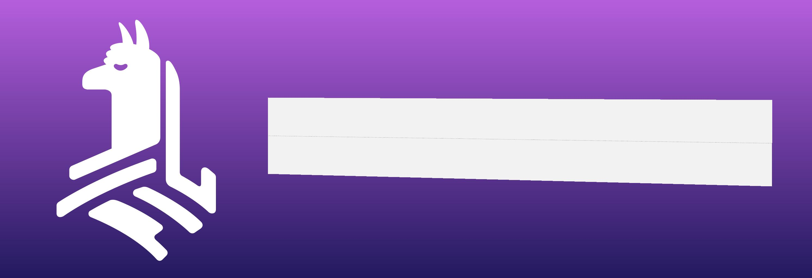
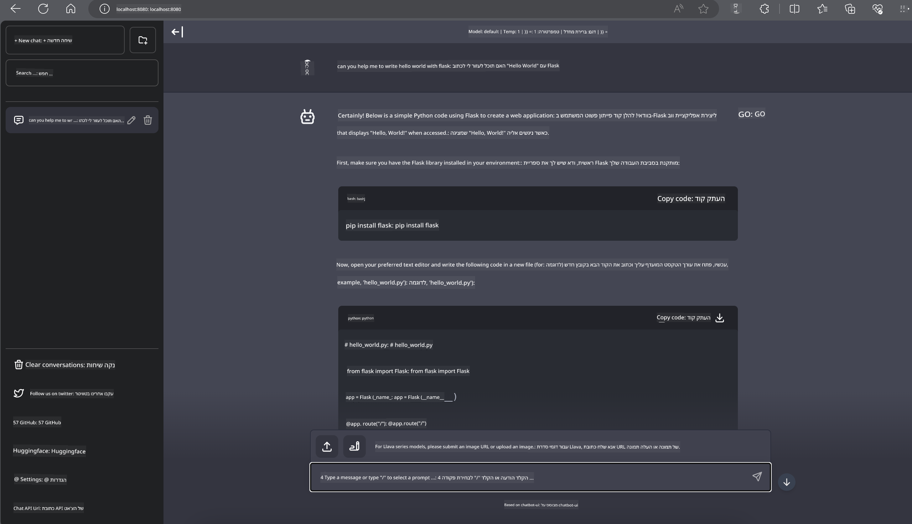

<!--
CO_OP_TRANSLATOR_METADATA:
{
  "original_hash": "be4101a30d98e95a71d42c276e8bcd37",
  "translation_date": "2025-07-16T20:43:41+00:00",
  "source_file": "md/01.Introduction/03/Jetson_Inference.md",
  "language_code": "he"
}
-->
# **הסקת Phi-3 ב-Nvidia Jetson**

Nvidia Jetson היא סדרת לוחות מחשוב משובצים מבית Nvidia. דגמי Jetson TK1, TX1 ו-TX2 כוללים מעבד Tegra (או SoC) מבית Nvidia שמשלב יחידת עיבוד מרכזית (CPU) בארכיטקטורת ARM. Jetson הוא מערכת צריכת-אנרגיה נמוכה ומתוכננת להאצת יישומי למידת מכונה. Nvidia Jetson משמשת מפתחים מקצועיים ליצירת מוצרי AI פורצי דרך בכל התעשיות, וכן סטודנטים וחובבים ללמידת AI מעשית וליצירת פרויקטים מרתקים. SLM מוטמעת במכשירי קצה כמו Jetson, מה שמאפשר יישום טוב יותר של תרחישי יישום AI תעשייתיים גנרטיביים.

## פריסה על NVIDIA Jetson:
מפתחים העובדים על רובוטיקה אוטונומית ומכשירים משובצים יכולים לנצל את Phi-3 Mini. הגודל הקטן יחסית של Phi-3 הופך אותו לאידיאלי לפריסה בקצה. הפרמטרים כוונו בקפידה במהלך האימון, מה שמבטיח דיוק גבוה בתגובות.

### אופטימיזציה TensorRT-LLM:
ספריית [TensorRT-LLM של NVIDIA](https://github.com/NVIDIA/TensorRT-LLM?WT.mc_id=aiml-138114-kinfeylo) משפרת את הסקת המודלים הגדולים של שפה. היא תומכת בחלון הקשר ארוך של Phi-3 Mini, ומשפרת גם את התפוקה וגם את זמן התגובה. האופטימיזציות כוללות טכניקות כמו LongRoPE, FP8 ו-batching בזמן ריצה.

### זמינות ופריסה:
מפתחים יכולים לחקור את Phi-3 Mini עם חלון הקשר של 128K ב-[NVIDIA AI](https://www.nvidia.com/en-us/ai-data-science/generative-ai/). הוא ארוז כ-NVIDIA NIM, מיקרו-שירות עם API סטנדרטי שניתן לפרוס בכל מקום. בנוסף, קיימות [מימושי TensorRT-LLM ב-GitHub](https://github.com/NVIDIA/TensorRT-LLM).

## **1. הכנה**

a. Jetson Orin NX / Jetson NX

b. JetPack 5.1.2+

c. Cuda 11.8

d. Python 3.8+

## **2. הרצת Phi-3 ב-Jetson**

ניתן לבחור בין [Ollama](https://ollama.com) או [LlamaEdge](https://llamaedge.com)

אם רוצים להשתמש ב-gguf בענן ובמכשירי קצה בו זמנית, ניתן להבין את LlamaEdge כ-WasmEdge (WasmEdge הוא ריצה קלה, בעלת ביצועים גבוהים וסקלאבילית של WebAssembly המתאימה ליישומי ענן, קצה ויישומים מבוזרים. היא תומכת ביישומים ללא שרת, פונקציות משובצות, מיקרו-שירותים, חוזים חכמים ומכשירי IoT). ניתן לפרוס את המודל הכמותי של gguf למכשירי קצה ולענן דרך LlamaEdge.



הנה השלבים לשימוש

1. התקנת והורדת ספריות וקבצים רלוונטיים

```bash

curl -sSf https://raw.githubusercontent.com/WasmEdge/WasmEdge/master/utils/install.sh | bash -s -- --plugin wasi_nn-ggml

curl -LO https://github.com/LlamaEdge/LlamaEdge/releases/latest/download/llama-api-server.wasm

curl -LO https://github.com/LlamaEdge/chatbot-ui/releases/latest/download/chatbot-ui.tar.gz

tar xzf chatbot-ui.tar.gz

```

**הערה**: הקבצים llama-api-server.wasm ו-chatbot-ui צריכים להיות באותה תיקייה

2. הרצת סקריפטים בטרמינל

```bash

wasmedge --dir .:. --nn-preload default:GGML:AUTO:{Your gguf path} llama-api-server.wasm -p phi-3-chat

```

הנה תוצאת ההרצה



***קוד לדוגמה*** [Phi-3 mini WASM Notebook Sample](https://github.com/Azure-Samples/Phi-3MiniSamples/tree/main/wasm)

לסיכום, Phi-3 Mini מייצג קפיצה משמעותית במודלים לשפה, המשלבת יעילות, מודעות להקשר וכוח האופטימיזציה של NVIDIA. בין אם אתם בונים רובוטים או יישומי קצה, Phi-3 Mini הוא כלי חזק שכדאי להכיר.

**כתב ויתור**:  
מסמך זה תורגם באמצעות שירות תרגום מבוסס בינה מלאכותית [Co-op Translator](https://github.com/Azure/co-op-translator). למרות שאנו שואפים לדיוק, יש לקחת בחשבון כי תרגומים אוטומטיים עלולים להכיל שגיאות או אי-דיוקים. המסמך המקורי בשפת המקור שלו נחשב למקור הסמכותי. למידע קריטי מומלץ להשתמש בתרגום מקצועי על ידי מתרגם אנושי. אנו לא נושאים באחריות לכל אי-הבנה או פרשנות שגויה הנובעת משימוש בתרגום זה.