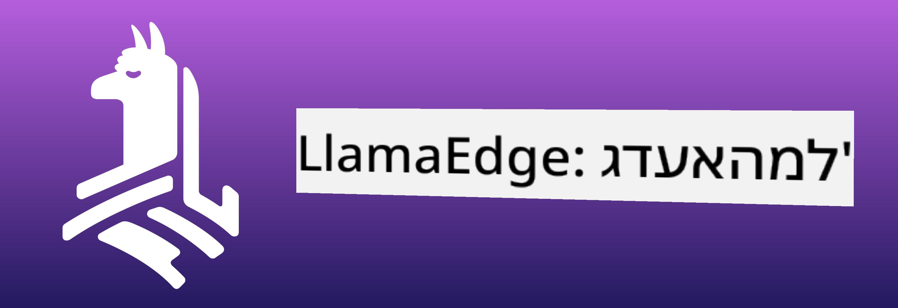

<!--
CO_OP_TRANSLATOR_METADATA:
{
  "original_hash": "be4101a30d98e95a71d42c276e8bcd37",
  "translation_date": "2025-05-09T11:40:52+00:00",
  "source_file": "md/01.Introduction/03/Jetson_Inference.md",
  "language_code": "he"
}
-->
# **Inference Phi-3 ב-Nvidia Jetson**

Nvidia Jetson היא סדרת לוחות מחשוב משובצים של Nvidia. דגמי Jetson TK1, TX1 ו-TX2 כוללים מעבד Tegra (או SoC) מ-Nvidia שמשלב יחידת עיבוד מרכזית (CPU) בארכיטקטורת ARM. Jetson הוא מערכת צריכת-אנרגיה נמוכה ומיועדת להאצת יישומי למידת מכונה. Nvidia Jetson משמשת מפתחים מקצועיים ליצירת מוצרי AI פורצי דרך בכל התעשיות, וכמו כן סטודנטים וחובבים ללמידה מעשית של AI וליצירת פרויקטים מרשימים. SLM מוטמעת במכשירי edge כמו Jetson, מה שמאפשר יישום טוב יותר של תרחישי יישום AI תעשייתי גנרטיבי.

## פריסה על NVIDIA Jetson:
מפתחים העובדים על רובוטיקה אוטונומית ומכשירים משובצים יכולים לנצל את Phi-3 Mini. הגודל הקטן יחסית של Phi-3 הופך אותו לאידיאלי לפריסה בקצה הרשת. הפרמטרים כוונו בקפידה במהלך האימון, כדי להבטיח דיוק גבוה בתגובות.

### אופטימיזציה של TensorRT-LLM:
[TensorRT-LLM library](https://github.com/NVIDIA/TensorRT-LLM?WT.mc_id=aiml-138114-kinfeylo) של NVIDIA משפר את ביצועי המודל השפתי הגדול. הוא תומך בחלון הקשר ארוך של Phi-3 Mini, ומשפר גם את התפוקה וגם את זמן ההשהיה. האופטימיזציות כוללות טכניקות כמו LongRoPE, FP8 ו-inflight batching.

### זמינות ופריסה:
מפתחים יכולים לבדוק את Phi-3 Mini עם חלון הקשר של 128K ב-[NVIDIA's AI](https://www.nvidia.com/en-us/ai-data-science/generative-ai/). הוא ארוז כ-NVIDIA NIM, מיקרו-שירות עם API סטנדרטי שניתן לפרוס בכל מקום. בנוסף, קיימות [מימושי TensorRT-LLM ב-GitHub](https://github.com/NVIDIA/TensorRT-LLM).

## **1. הכנה**

a. Jetson Orin NX / Jetson NX

b. JetPack 5.1.2+

c. Cuda 11.8

d. Python 3.8+

## **2. הרצת Phi-3 ב-Jetson**

ניתן לבחור ב-[Ollama](https://ollama.com) או [LlamaEdge](https://llamaedge.com)

אם רוצים להשתמש ב-gguf גם בענן וגם במכשירי edge בו-זמנית, אפשר להבין את LlamaEdge כ-WasmEdge (WasmEdge הוא runtime WebAssembly קל משקל, ביצועי גבוה וניתן להרחבה המתאים ליישומים בענן, edge ומבוזרים. הוא תומך ביישומים ללא שרת, פונקציות משובצות, מיקרו-שירותים, חוזים חכמים ומכשירי IoT. ניתן לפרוס את המודל הכמותי של gguf במכשירי edge ובענן דרך LlamaEdge.



הנה השלבים לשימוש

1. התקנה והורדת ספריות וקבצים קשורים

```bash

curl -sSf https://raw.githubusercontent.com/WasmEdge/WasmEdge/master/utils/install.sh | bash -s -- --plugin wasi_nn-ggml

curl -LO https://github.com/LlamaEdge/LlamaEdge/releases/latest/download/llama-api-server.wasm

curl -LO https://github.com/LlamaEdge/chatbot-ui/releases/latest/download/chatbot-ui.tar.gz

tar xzf chatbot-ui.tar.gz

```

**הערה**: llama-api-server.wasm ו-chatbot-ui צריכים להיות באותה תיקייה

2. הרצת סקריפטים בטרמינל

```bash

wasmedge --dir .:. --nn-preload default:GGML:AUTO:{Your gguf path} llama-api-server.wasm -p phi-3-chat

```

הנה תוצאת ההרצה


***קוד לדוגמה*** [Phi-3 mini WASM Notebook Sample](https://github.com/Azure-Samples/Phi-3MiniSamples/tree/main/wasm)

לסיכום, Phi-3 Mini מייצג קפיצה משמעותית במידול שפה, שמשלבת יעילות, מודעות להקשר וכוח האופטימיזציה של NVIDIA. בין אם אתם בונים רובוטים או יישומי edge, Phi-3 Mini הוא כלי חזק שכדאי להכיר.

**כתב ויתור**:  
מסמך זה תורגם באמצעות שירות תרגום מבוסס בינה מלאכותית [Co-op Translator](https://github.com/Azure/co-op-translator). למרות שאנו שואפים לדיוק, יש להיות מודעים לכך שתרגומים אוטומטיים עלולים להכיל שגיאות או אי דיוקים. המסמך המקורי בשפת המקור שלו הוא המקור הסמכותי שיש להתייחס אליו. למידע קריטי מומלץ להשתמש בתרגום מקצועי שנעשה על ידי מתרגם אנושי. אנו לא נושאים באחריות לכל אי הבנה או פרשנות שגויה הנובעת משימוש בתרגום זה.