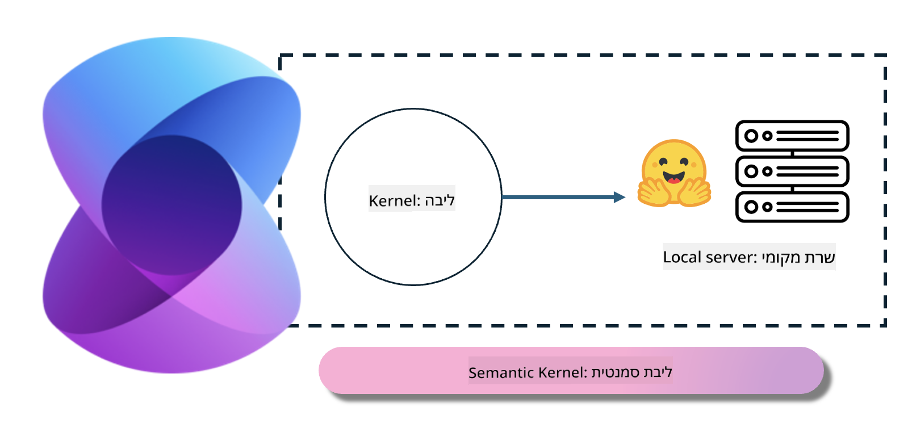
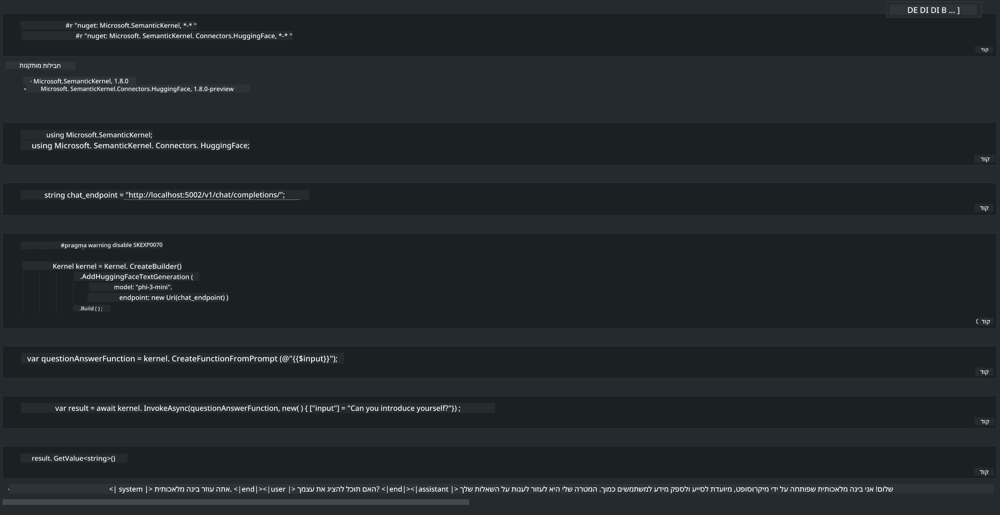

<!--
CO_OP_TRANSLATOR_METADATA:
{
  "original_hash": "bcf5dd7031db0031abdb9dd0c05ba118",
  "translation_date": "2025-07-16T20:58:10+00:00",
  "source_file": "md/01.Introduction/03/Local_Server_Inference.md",
  "language_code": "he"
}
-->
# **הסקת מסקנות Phi-3 בשרת מקומי**

ניתן לפרוס את Phi-3 על שרת מקומי. המשתמשים יכולים לבחור בפתרונות [Ollama](https://ollama.com) או [LM Studio](https://llamaedge.com), או לכתוב את הקוד שלהם בעצמם. ניתן לחבר את שירותי Phi-3 המקומיים דרך [Semantic Kernel](https://github.com/microsoft/semantic-kernel?WT.mc_id=aiml-138114-kinfeylo) או [Langchain](https://www.langchain.com/) כדי לבנות אפליקציות Copilot.

## **שימוש ב-Semantic Kernel לגישה ל-Phi-3-mini**

באפליקציית Copilot, אנו יוצרים אפליקציות דרך Semantic Kernel / LangChain. מסגרת אפליקציה מסוג זה בדרך כלל תואמת לשירות Azure OpenAI / מודלים של OpenAI, ויכולה גם לתמוך במודלים בקוד פתוח ב-Hugging Face ובמודלים מקומיים. מה עלינו לעשות אם נרצה להשתמש ב-Semantic Kernel כדי לגשת ל-Phi-3-mini? בדוגמה של .NET, ניתן לשלב אותו עם Hugging Face Connector ב-Semantic Kernel. כברירת מחדל, הוא יכול להתאים למזהה המודל ב-Hugging Face (בפעם הראשונה שתשתמשו בו, המודל יורד מ-Hugging Face, וזה לוקח זמן רב). ניתן גם להתחבר לשירות המקומי שנבנה. בהשוואה לשניים, אנו ממליצים להשתמש באחרון כי יש לו רמת אוטונומיה גבוהה יותר, במיוחד באפליקציות ארגוניות.

מהתמונה, גישה לשירותים מקומיים דרך Semantic Kernel יכולה להתחבר בקלות לשרת המודל Phi-3-mini שנבנה בעצמנו. להלן תוצאת הריצה

***Sample Code*** https://github.com/kinfey/Phi3MiniSamples/tree/main/semantickernel

**כתב ויתור**:  
מסמך זה תורגם באמצעות שירות תרגום מבוסס בינה מלאכותית [Co-op Translator](https://github.com/Azure/co-op-translator). למרות שאנו שואפים לדיוק, יש לקחת בחשבון כי תרגומים אוטומטיים עלולים להכיל שגיאות או אי-דיוקים. המסמך המקורי בשפת המקור שלו נחשב למקור הסמכותי. למידע קריטי מומלץ להשתמש בתרגום מקצועי על ידי מתרגם אנושי. אנו לא נושאים באחריות לכל אי-הבנה או פרשנות שגויה הנובעת משימוש בתרגום זה.