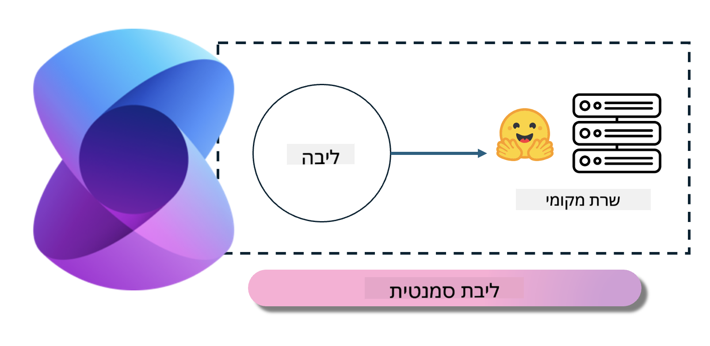

<!--
CO_OP_TRANSLATOR_METADATA:
{
  "original_hash": "bcf5dd7031db0031abdb9dd0c05ba118",
  "translation_date": "2025-05-09T12:06:23+00:00",
  "source_file": "md/01.Introduction/03/Local_Server_Inference.md",
  "language_code": "he"
}
-->
# **Inference Phi-3 בשרת מקומי**

אפשר לפרוס את Phi-3 על שרת מקומי. משתמשים יכולים לבחור בפתרונות של [Ollama](https://ollama.com) או [LM Studio](https://llamaedge.com), או לכתוב את הקוד שלהם בעצמם. ניתן לחבר את שירותי Phi-3 המקומיים דרך [Semantic Kernel](https://github.com/microsoft/semantic-kernel?WT.mc_id=aiml-138114-kinfeylo) או [Langchain](https://www.langchain.com/) כדי לבנות אפליקציות Copilot

## **שימוש ב-Semantic Kernel כדי לגשת ל-Phi-3-mini**

באפליקציית Copilot, אנחנו יוצרים אפליקציות דרך Semantic Kernel / LangChain. מסגרת אפליקציה מסוג זה בדרך כלל תואמת לשירות Azure OpenAI / דגמי OpenAI, ויכולה גם לתמוך בדגמים בקוד פתוח ב-Hugging Face ובדגמים מקומיים. מה עושים אם רוצים להשתמש ב-Semantic Kernel כדי לגשת ל-Phi-3-mini? בדוגמת .NET, אפשר לשלב אותו עם Hugging Face Connector ב-Semantic Kernel. כברירת מחדל, זה יכול להתאים ל-id של הדגם ב-Hugging Face (בפעם הראשונה שמשתמשים בו, הדגם יורד מ-Hugging Face, וזה לוקח זמן רב). אפשר גם להתחבר לשירות המקומי שנבנה. בהשוואה לשניים, מומלץ להשתמש באחרון כי יש לו רמת עצמאות גבוהה יותר, במיוחד באפליקציות ארגוניות.

מהתמונה, הגישה לשירותים מקומיים דרך Semantic Kernel יכולה להתחבר בקלות לשרת הדגם Phi-3-mini שנבנה בעצמנו. הנה תוצאת הריצה

***Sample Code*** https://github.com/kinfey/Phi3MiniSamples/tree/main/semantickernel

**כתב ויתור**:  
מסמך זה תורגם באמצעות שירות תרגום מבוסס בינה מלאכותית [Co-op Translator](https://github.com/Azure/co-op-translator). למרות שאנו שואפים לדיוק, יש לקחת בחשבון כי תרגומים אוטומטיים עלולים להכיל שגיאות או אי-דיוקים. יש להתייחס למסמך המקורי בשפתו המקורית כמקור הסמכותי. למידע קריטי מומלץ להשתמש בתרגום מקצועי אנושי. אנו לא נושאים באחריות לכל אי-הבנה או פרשנות שגויה הנובעת משימוש בתרגום זה.