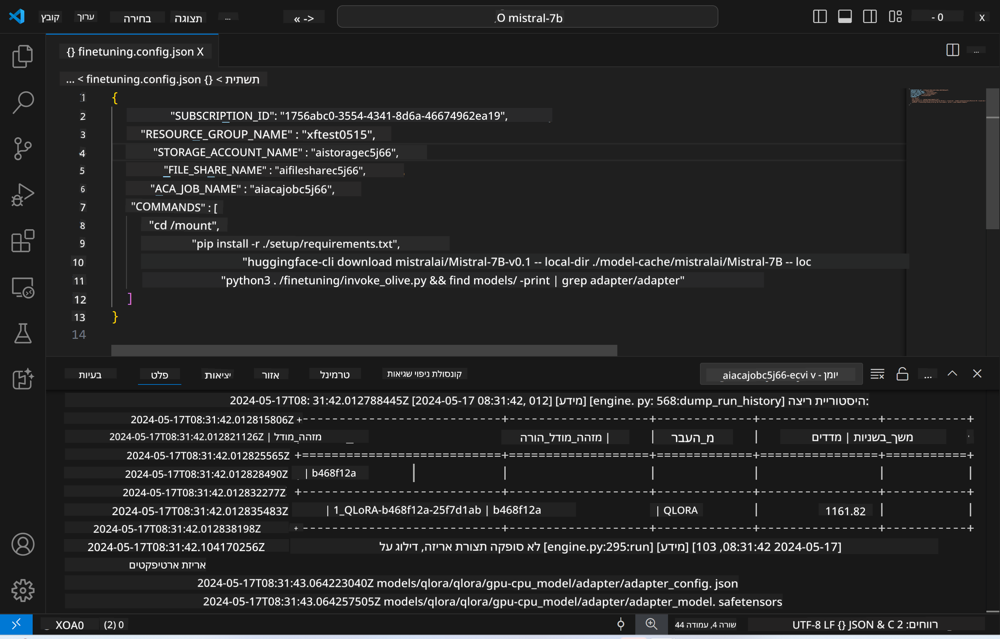
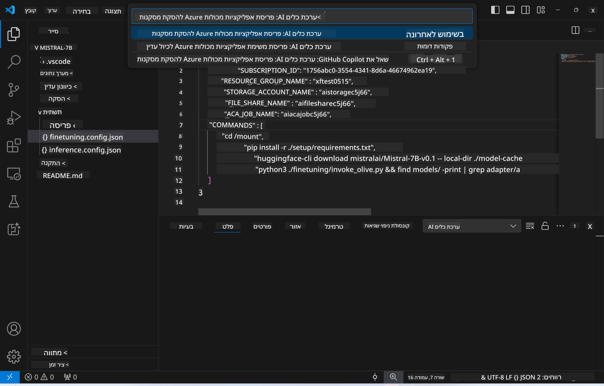
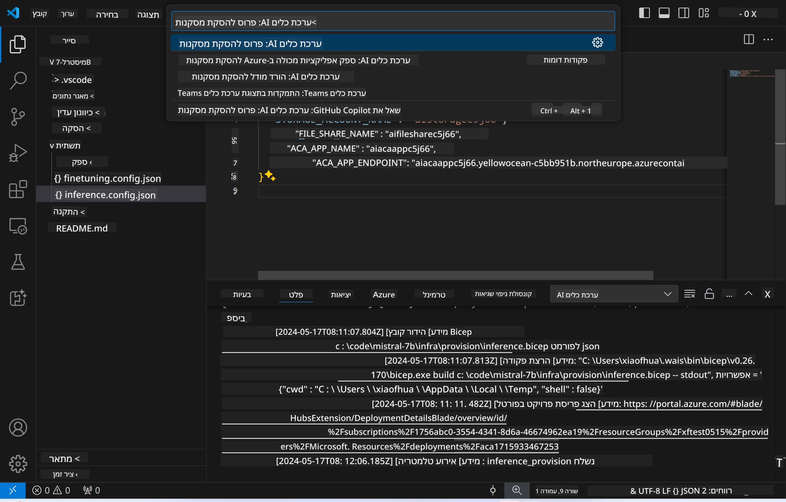
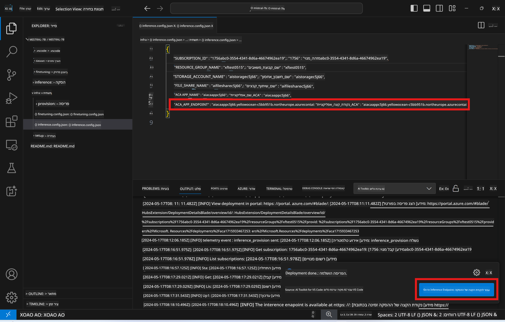

<!--
CO_OP_TRANSLATOR_METADATA:
{
  "original_hash": "a54cd3d65b6963e4e8ce21e143c3ab04",
  "translation_date": "2025-07-16T21:20:27+00:00",
  "source_file": "md/01.Introduction/03/Remote_Interence.md",
  "language_code": "he"
}
-->
# הסקת מסקנות מרחוק עם המודל המותאם אישית

לאחר שה-adapters אומנו בסביבה מרוחקת, השתמשו באפליקציית Gradio פשוטה כדי לתקשר עם המודל.



### הקצאת משאבי Azure  
יש להגדיר את משאבי Azure עבור הסקת מסקנות מרחוק על ידי ביצוע הפקודה `AI Toolkit: Provision Azure Container Apps for inference` מפלטת הפקודות. במהלך ההגדרה תתבקשו לבחור את המנוי ואת קבוצת המשאבים שלכם ב-Azure.  


ברירת המחדל היא שהמנוי וקבוצת המשאבים עבור ההסקה יתאימו לאלו ששימשו לאימון המודל. ההסקה תשתמש באותו Azure Container App Environment ותיגש למודל ול-adapter של המודל המאוחסנים ב-Azure Files, שנוצרו במהלך שלב האימון.

## שימוש ב-AI Toolkit

### פריסה עבור הסקה  
אם ברצונכם לעדכן את קוד ההסקה או לטעון מחדש את מודל ההסקה, יש להריץ את הפקודה `AI Toolkit: Deploy for inference`. פעולה זו תסנכרן את הקוד העדכני שלכם עם ACA ותאתחל מחדש את הרפליקה.



לאחר השלמת הפריסה בהצלחה, המודל מוכן להערכה דרך נקודת הקצה הזו.

### גישה ל-API של ההסקה

ניתן לגשת ל-API של ההסקה על ידי לחיצה על כפתור "*Go to Inference Endpoint*" שמופיע בהתראה ב-VSCode. לחלופין, ניתן למצוא את נקודת הקצה של ה-API תחת `ACA_APP_ENDPOINT` בקובץ `./infra/inference.config.json` ובחלונית הפלט.



> **[!NOTE]:** ייתכן שלוקח כמה דקות עד שנקודת הקצה של ההסקה תהיה פעילה במלואה.

## רכיבי ההסקה הכלולים בתבנית

| תיקייה | תוכן |
| ------ |--------- |
| `infra` | מכילה את כל ההגדרות הנדרשות להפעלה מרחוק. |
| `infra/provision/inference.parameters.json` | מכיל פרמטרים לתבניות bicep, המשמשות להקצאת משאבי Azure עבור ההסקה. |
| `infra/provision/inference.bicep` | מכיל תבניות להקצאת משאבי Azure עבור ההסקה. |
| `infra/inference.config.json` | קובץ ההגדרות, שנוצר על ידי הפקודה `AI Toolkit: Provision Azure Container Apps for inference`. משמש כקלט לפלטות פקודות מרוחקות נוספות. |

### שימוש ב-AI Toolkit להגדרת הקצאת משאבי Azure  
הגדירו את [AI Toolkit](https://marketplace.visualstudio.com/items?itemName=ms-windows-ai-studio.windows-ai-studio)

פקודת `Provision Azure Container Apps for inference`.

ניתן למצוא את פרמטרי ההגדרה בקובץ `./infra/provision/inference.parameters.json`. להלן הפרטים:  
| פרמטר | תיאור |
| --------- |------------ |
| `defaultCommands` | הפקודות שמפעילות את ה-web API. |
| `maximumInstanceCount` | פרמטר זה מגדיר את הקיבולת המקסימלית של מופעי GPU. |
| `location` | מיקום בו מוקצים משאבי Azure. הערך ברירת המחדל הוא מיקום קבוצת המשאבים שנבחרה. |
| `storageAccountName`, `fileShareName`, `acaEnvironmentName`, `acaEnvironmentStorageName`, `acaAppName`, `acaLogAnalyticsName` | פרמטרים אלו משמשים לשם משאבי Azure שיוקצו. כברירת מחדל, שמות אלו יהיו זהים לשם משאבי האימון. ניתן להזין שם חדש, שלא בשימוש, ליצירת משאבים עם שמות מותאמים אישית, או להזין שם של משאב Azure קיים במידה וברצונכם להשתמש בו. לפרטים נוספים ראו את הסעיף [Using existing Azure Resources](../../../../../md/01.Introduction/03). |

### שימוש במשאבי Azure קיימים

ברירת המחדל היא שההקצאה של ההסקה תשתמש באותו Azure Container App Environment, Storage Account, Azure File Share ו-Azure Log Analytics ששימשו לאימון. אפליקציית Azure Container App נפרדת נוצרת אך ורק עבור API ההסקה.

אם ביצעתם התאמות אישיות למשאבי Azure במהלך שלב האימון או ברצונכם להשתמש במשאבי Azure קיימים משלכם עבור ההסקה, יש לציין את שמותיהם בקובץ `./infra/inference.parameters.json`. לאחר מכן, הריצו את הפקודה `AI Toolkit: Provision Azure Container Apps for inference` מפלטת הפקודות. פעולה זו תעדכן את המשאבים שצוינו ותיצור את אלו החסרים.

לדוגמה, אם יש לכם סביבה קיימת של Azure container, קובץ `./infra/finetuning.parameters.json` שלכם אמור להיראות כך:

```json
{
    "$schema": "https://schema.management.azure.com/schemas/2019-04-01/deploymentParameters.json#",
    "contentVersion": "1.0.0.0",
    "parameters": {
      ...
      "acaEnvironmentName": {
        "value": "<your-aca-env-name>"
      },
      "acaEnvironmentStorageName": {
        "value": null
      },
      ...
    }
  }
```

### הקצאה ידנית  
אם אתם מעדיפים להגדיר את משאבי Azure באופן ידני, ניתן להשתמש בקבצי bicep המסופקים בתיקיות `./infra/provision`. אם כבר הגדרתם וקונפגתם את כל משאבי Azure ללא שימוש בפלטת הפקודות של AI Toolkit, תוכלו פשוט להזין את שמות המשאבים בקובץ `inference.config.json`.

לדוגמה:

```json
{
  "SUBSCRIPTION_ID": "<your-subscription-id>",
  "RESOURCE_GROUP_NAME": "<your-resource-group-name>",
  "STORAGE_ACCOUNT_NAME": "<your-storage-account-name>",
  "FILE_SHARE_NAME": "<your-file-share-name>",
  "ACA_APP_NAME": "<your-aca-name>",
  "ACA_APP_ENDPOINT": "<your-aca-endpoint>"
}
```

**כתב ויתור**:  
מסמך זה תורגם באמצעות שירות תרגום מבוסס בינה מלאכותית [Co-op Translator](https://github.com/Azure/co-op-translator). למרות שאנו שואפים לדיוק, יש לקחת בחשבון כי תרגומים אוטומטיים עלולים להכיל שגיאות או אי-דיוקים. המסמך המקורי בשפת המקור שלו נחשב למקור הסמכותי. למידע קריטי מומלץ להשתמש בתרגום מקצועי על ידי מתרגם אנושי. אנו לא נושאים באחריות לכל אי-הבנה או פרשנות שגויה הנובעת משימוש בתרגום זה.