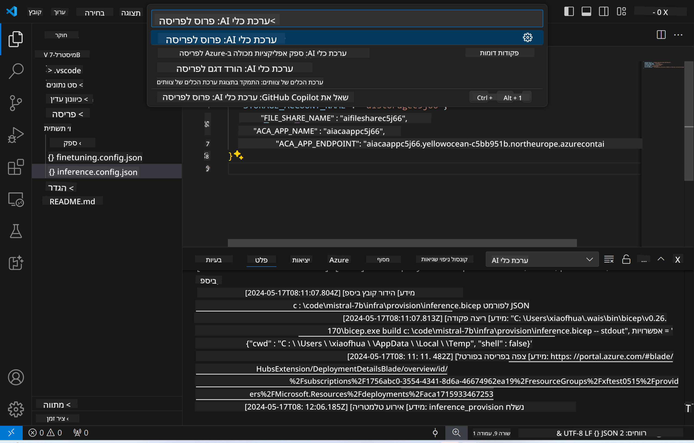

<!--
CO_OP_TRANSLATOR_METADATA:
{
  "original_hash": "a54cd3d65b6963e4e8ce21e143c3ab04",
  "translation_date": "2025-05-09T12:42:49+00:00",
  "source_file": "md/01.Introduction/03/Remote_Interence.md",
  "language_code": "he"
}
-->
# למידת מרחוק עם המודל המותאם

לאחר שהמתאמים מאומנים בסביבה מרוחקת, השתמשו באפליקציית Gradio פשוטה כדי לתקשר עם המודל.


### הקצאת משאבי Azure  
יש להגדיר את משאבי Azure עבור למידת מרחוק על ידי הרצת `AI Toolkit: Provision Azure Container Apps for inference` מפלטת הפקודות. במהלך ההגדרה תתבקשו לבחור את מנוי ה-Azure וקבוצת המשאבים שלכם.  


ברירת המחדל היא שמנוי וקבוצת המשאבים ללמידה יתאימו לאלו ששימשו לאימון המודל. הלמידה תשתמש באותה סביבת Azure Container App ותיגש למודל ולמתאם המודל המאוחסנים ב-Azure Files, שנוצרו במהלך שלב האימון.

## שימוש ב-AI Toolkit

### פריסה ללמידה  
אם ברצונכם לשנות את קוד הלמידה או לטעון מחדש את מודל הלמידה, יש להריץ את הפקודה `AI Toolkit: Deploy for inference`. פעולה זו תסנכרן את הקוד העדכני עם ACA ותאתחל מחדש את הרפליקה.



לאחר השלמת הפריסה בהצלחה, המודל מוכן להערכה דרך נקודת הקצה הזו.

### גישה ל-API של הלמידה

ניתן לגשת ל-API של הלמידה על ידי לחיצה על הכפתור "*Go to Inference Endpoint*" שמוצג בהתראה ב-VSCode. לחלופין, ניתן למצוא את נקודת הקצה של ה-API תחת `ACA_APP_ENDPOINT` ב-`./infra/inference.config.json` ובפאנל הפלט.


> **Note:** ייתכן שנקודת הקצה של הלמידה תדרוש מספר דקות עד שתפעל במלואה.

## רכיבי הלמידה הכלולים בתבנית

| תיקייה | תוכן |
| ------ |--------- |
| `infra` | מכילה את כל ההגדרות הדרושות לפעולות מרחוק. |
| `infra/provision/inference.parameters.json` | מכילה פרמטרים לתבניות bicep, המשמשות להקצאת משאבי Azure ללמידה. |
| `infra/provision/inference.bicep` | מכילה תבניות להקצאת משאבי Azure ללמידה. |
| `infra/inference.config.json` | קובץ ההגדרות, שנוצר על ידי הפקודה `AI Toolkit: Provision Azure Container Apps for inference`. משמש כקלט לפלטות פקודות מרוחקות נוספות. |

### שימוש ב-AI Toolkit להגדרת הקצאת משאבי Azure  
הגדירו את [AI Toolkit](https://marketplace.visualstudio.com/items?itemName=ms-windows-ai-studio.windows-ai-studio)

הקצו Azure Container Apps ללמידה ` command.

You can find configuration parameters in `./infra/provision/inference.parameters.json` file. Here are the details:
| Parameter | Description |
| --------- |------------ |
| `defaultCommands` | This is the commands to initiate a web API. |
| `maximumInstanceCount` | This parameter sets the maximum capacity of GPU instances. |
| `location` | This is the location where Azure resources are provisioned. The default value is the same as the chosen resource group's location. |
| `storageAccountName`, `fileShareName` `acaEnvironmentName`, `acaEnvironmentStorageName`, `acaAppName`,  `acaLogAnalyticsName` | These parameters are used to name the Azure resources for provision. By default, they will be same to the fine-tuning resource name. You can input a new, unused resource name to create your own custom-named resources, or you can input the name of an already existing Azure resource if you'd prefer to use that. For details, refer to the section [Using existing Azure Resources](../../../../../md/01.Introduction/03). |

### Using Existing Azure Resources

By default, the inference provision use the same Azure Container App Environment, Storage Account, Azure File Share, and Azure Log Analytics that were used for fine-tuning. A separate Azure Container App is created solely for the inference API. 

If you have customized the Azure resources during the fine-tuning step or want to use your own existing Azure resources for inference, specify their names in the `./infra/inference.parameters.json` ואז הריצו את הפקודה `AI Toolkit: Provision Azure Container Apps for inference` מפלטת הפקודות. פעולה זו מעדכנת משאבים קיימים ויוצרת משאבים חסרים.

לדוגמה, אם יש לכם סביבת Azure container קיימת, הקובץ `./infra/finetuning.parameters.json` שלכם אמור להיראות כך:

```json
{
    "$schema": "https://schema.management.azure.com/schemas/2019-04-01/deploymentParameters.json#",
    "contentVersion": "1.0.0.0",
    "parameters": {
      ...
      "acaEnvironmentName": {
        "value": "<your-aca-env-name>"
      },
      "acaEnvironmentStorageName": {
        "value": null
      },
      ...
    }
  }
```

### הקצאה ידנית  
אם אתם מעדיפים להגדיר את משאבי Azure באופן ידני, ניתן להשתמש בקבצי bicep המסופקים ב-`./infra/provision` folders. If you have already set up and configured all the Azure resources without using the AI Toolkit command palette, you can simply enter the resource names in the `inference.config.json`.

לדוגמה:

```json
{
  "SUBSCRIPTION_ID": "<your-subscription-id>",
  "RESOURCE_GROUP_NAME": "<your-resource-group-name>",
  "STORAGE_ACCOUNT_NAME": "<your-storage-account-name>",
  "FILE_SHARE_NAME": "<your-file-share-name>",
  "ACA_APP_NAME": "<your-aca-name>",
  "ACA_APP_ENDPOINT": "<your-aca-endpoint>"
}
```

**כתב ויתור**:  
מסמך זה תורגם באמצעות שירות תרגום מבוסס בינה מלאכותית [Co-op Translator](https://github.com/Azure/co-op-translator). למרות שאנו שואפים לדיוק, יש לקחת בחשבון כי תרגומים אוטומטיים עלולים להכיל שגיאות או אי-דיוקים. המסמך המקורי בשפת המקור שלו נחשב למקור הסמכותי. למידע קריטי מומלץ להשתמש בתרגום מקצועי על ידי אדם. אנו לא נושאים באחריות לכל אי-הבנות או פרשנויות שגויות הנובעות משימוש בתרגום זה.