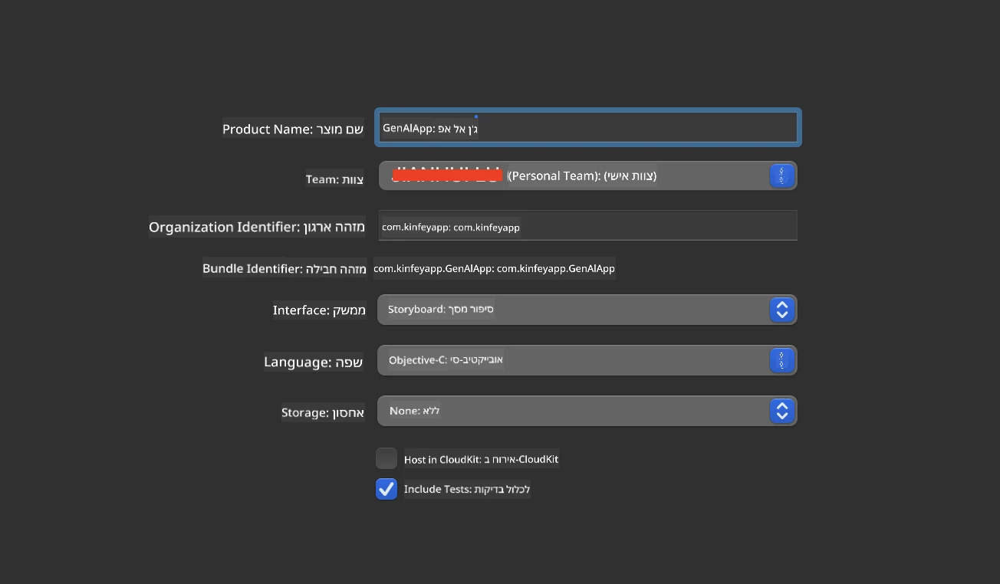
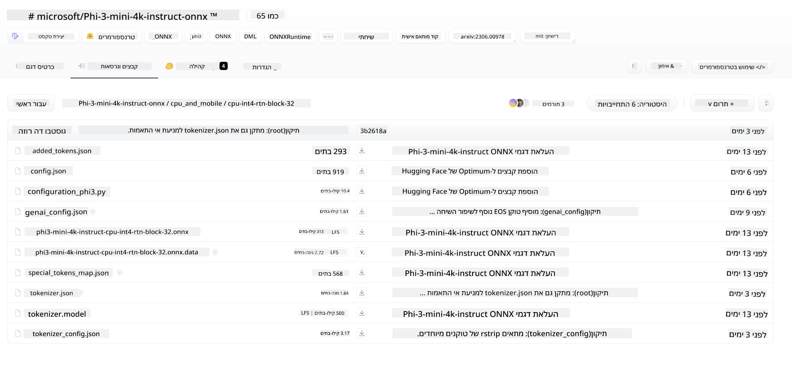
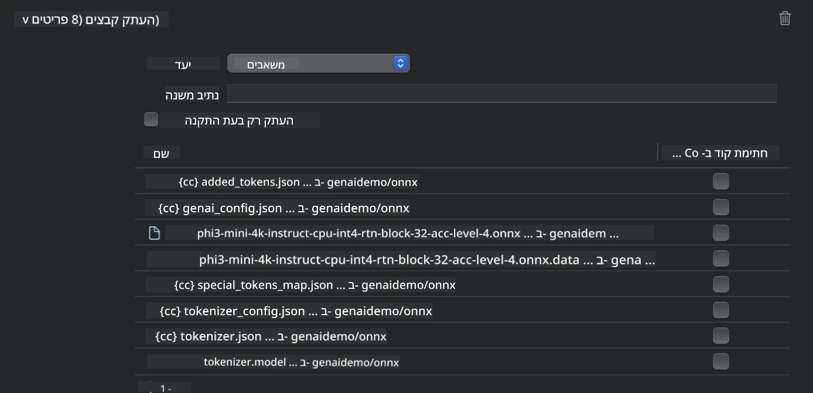
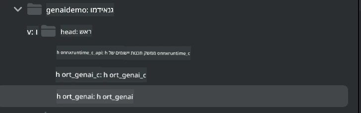
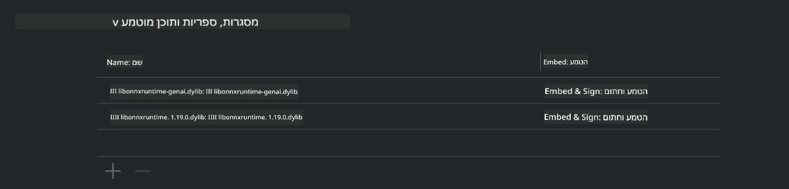
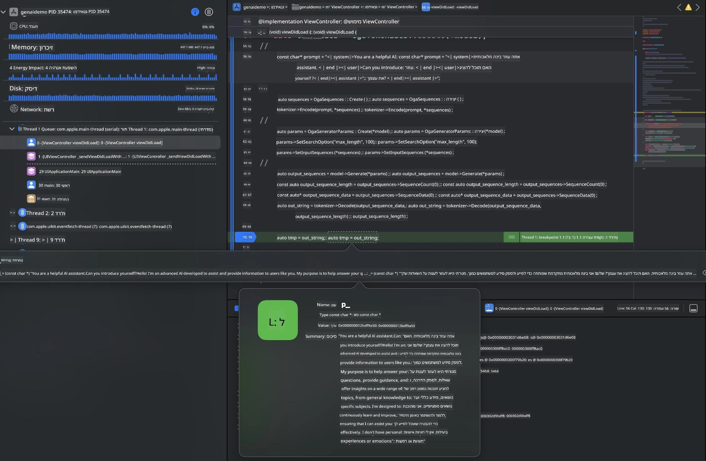

# **הסקת מסקנות Phi-3 ב-iOS**

Phi-3-mini היא סדרת דגמים חדשה של מיקרוסופט שמאפשרת פריסה של מודלים גדולים של שפה (LLMs) במכשירי קצה ומכשירי IoT. Phi-3-mini זמינה לפריסות ב-iOS, אנדרואיד ומכשירי קצה, ומאפשרת לפרוס בינה מלאכותית גנרטיבית בסביבות BYOD. הדוגמה הבאה מראה כיצד לפרוס את Phi-3-mini ב-iOS.

## **1. הכנה**

- **א.** macOS 14+
- **ב.** Xcode 15+
- **ג.** iOS SDK 17.x (אייפון 14 A16 או חדש יותר)
- **ד.** התקנת Python 3.10+ (מומלץ Conda)
- **ה.** התקנת ספריית Python: `python-flatbuffers`
- **ו.** התקנת CMake

### Semantic Kernel והסקת מסקנות

Semantic Kernel הוא מסגרת אפליקציה שמאפשרת ליצור אפליקציות התואמות ל-Azure OpenAI Service, מודלים של OpenAI ואפילו מודלים מקומיים. גישה לשירותים מקומיים דרך Semantic Kernel מאפשרת אינטגרציה פשוטה עם שרת מודל Phi-3-mini המארח בעצמך.

### קריאה למודלים מקוונטים עם Ollama או LlamaEdge

רבים מהמשתמשים מעדיפים להשתמש במודלים מקוונטים כדי להריץ מודלים באופן מקומי. [Ollama](https://ollama.com) ו-[LlamaEdge](https://llamaedge.com) מאפשרים למשתמשים לקרוא למודלים מקוונטים שונים:

#### **Ollama**

ניתן להריץ `ollama run phi3` ישירות או להגדיר אותו במצב לא מקוון. יש ליצור Modelfile עם הנתיב לקובץ `gguf` שלך. דוגמת קוד להרצת מודל Phi-3-mini מקוונט:

```gguf
FROM {Add your gguf file path}
TEMPLATE \"\"\"<|user|> .Prompt<|end|> <|assistant|>\"\"\"
PARAMETER stop <|end|>
PARAMETER num_ctx 4096
```

#### **LlamaEdge**

אם ברצונך להשתמש ב-`gguf` גם בענן וגם במכשירי קצה בו זמנית, LlamaEdge היא אפשרות מצוינת.

## **2. הידור ONNX Runtime ל-iOS**

```bash

git clone https://github.com/microsoft/onnxruntime.git

cd onnxruntime

./build.sh --build_shared_lib --ios --skip_tests --parallel --build_dir ./build_ios --ios --apple_sysroot iphoneos --osx_arch arm64 --apple_deploy_target 17.5 --cmake_generator Xcode --config Release

cd ../

```

### **הערה**

- **א.** לפני ההידור, ודא ש-Xcode מוגדר כראוי והגדר אותו כספריית המפתחים הפעילה בטרמינל:

    ```bash
    sudo xcode-select -switch /Applications/Xcode.app/Contents/Developer
    ```

- **ב.** יש להדר את ONNX Runtime לפלטפורמות שונות. עבור iOS, ניתן להדר ל-`arm64` או `x86_64`.

- **ג.** מומלץ להשתמש בגרסת ה-iOS SDK העדכנית ביותר להידור. עם זאת, ניתן להשתמש גם בגרסה ישנה יותר אם נדרשת תאימות עם SDKים קודמים.

## **3. הידור Generative AI עם ONNX Runtime ל-iOS**

> **Note:** מאחר ש-Generative AI עם ONNX Runtime נמצא בגרסת תצוגה מוקדמת, יש לקחת בחשבון שינויים אפשריים.

```bash

git clone https://github.com/microsoft/onnxruntime-genai
 
cd onnxruntime-genai
 
mkdir ort
 
cd ort
 
mkdir include
 
mkdir lib
 
cd ../
 
cp ../onnxruntime/include/onnxruntime/core/session/onnxruntime_c_api.h ort/include
 
cp ../onnxruntime/build_ios/Release/Release-iphoneos/libonnxruntime*.dylib* ort/lib
 
export OPENCV_SKIP_XCODEBUILD_FORCE_TRYCOMPILE_DEBUG=1
 
python3 build.py --parallel --build_dir ./build_ios --ios --ios_sysroot iphoneos --ios_arch arm64 --ios_deployment_target 17.5 --cmake_generator Xcode --cmake_extra_defines CMAKE_XCODE_ATTRIBUTE_CODE_SIGNING_ALLOWED=NO

```

## **4. יצירת אפליקציית App ב-Xcode**

בחרתי ב-Objective-C כשיטת פיתוח האפליקציה, כי בשימוש עם Generative AI דרך ONNX Runtime C++ API, Objective-C תואם יותר. כמובן, ניתן גם להשלים קריאות רלוונטיות דרך גישור Swift.



## **5. העתקת מודל ONNX מקוונט INT4 לפרויקט האפליקציה**

יש לייבא את מודל הקוונטיזציה INT4 בפורמט ONNX, שצריך להוריד קודם.



לאחר ההורדה, יש להוסיף אותו לתיקיית Resources של הפרויקט ב-Xcode.



## **6. הוספת API של C++ ב-ViewControllers**

> **הערה:**

- **א.** הוסף את קבצי הכותרת המתאימים של C++ לפרויקט.

  

- **ב.** כלול את ספריית ה-dynamic `onnxruntime-genai` ב-Xcode.

  

- **ג.** השתמש בקוד דוגמאות C לצורך בדיקות. ניתן גם להוסיף תכונות נוספות כמו ChatUI לפונקציונליות מורחבת.

- **ד.** מאחר ויש צורך להשתמש ב-C++ בפרויקט, שנה את שם הקובץ `ViewController.m` ל-`ViewController.mm` כדי לאפשר תמיכה ב-Objective-C++.

```objc

    NSString *llmPath = [[NSBundle mainBundle] resourcePath];
    char const *modelPath = llmPath.cString;

    auto model =  OgaModel::Create(modelPath);

    auto tokenizer = OgaTokenizer::Create(*model);

    const char* prompt = "<|system|>You are a helpful AI assistant.<|end|><|user|>Can you introduce yourself?<|end|><|assistant|>";

    auto sequences = OgaSequences::Create();
    tokenizer->Encode(prompt, *sequences);

    auto params = OgaGeneratorParams::Create(*model);
    params->SetSearchOption("max_length", 100);
    params->SetInputSequences(*sequences);

    auto output_sequences = model->Generate(*params);
    const auto output_sequence_length = output_sequences->SequenceCount(0);
    const auto* output_sequence_data = output_sequences->SequenceData(0);
    auto out_string = tokenizer->Decode(output_sequence_data, output_sequence_length);
    
    auto tmp = out_string;

```

## **7. הרצת האפליקציה**

לאחר השלמת ההגדרות, ניתן להריץ את האפליקציה ולראות את תוצאות ההסקה של מודל Phi-3-mini.



לקוד דוגמאות נוסף והוראות מפורטות, בקרו ב-[מאגר דוגמאות Phi-3 Mini](https://github.com/Azure-Samples/Phi-3MiniSamples/tree/main/ios).

**כתב ויתור**:  
מסמך זה תורגם באמצעות שירות תרגום מבוסס בינה מלאכותית [Co-op Translator](https://github.com/Azure/co-op-translator). למרות שאנו שואפים לדיוק, יש לקחת בחשבון כי תרגומים אוטומטיים עלולים להכיל שגיאות או אי-דיוקים. המסמך המקורי בשפת המקור שלו נחשב למקור הסמכותי. למידע קריטי מומלץ להשתמש בתרגום מקצועי על ידי מתרגם אנושי. אנו לא נושאים באחריות לכל אי-הבנה או פרשנות שגויה הנובעת משימוש בתרגום זה.