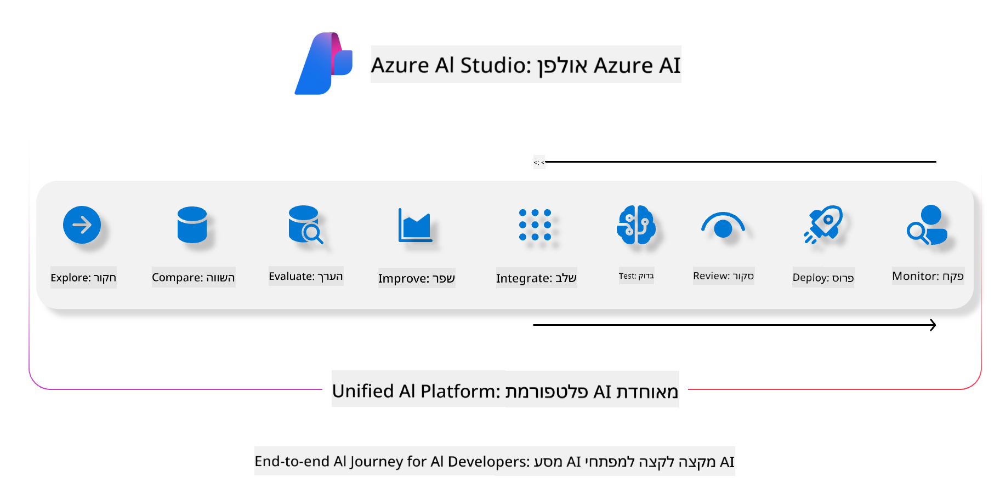
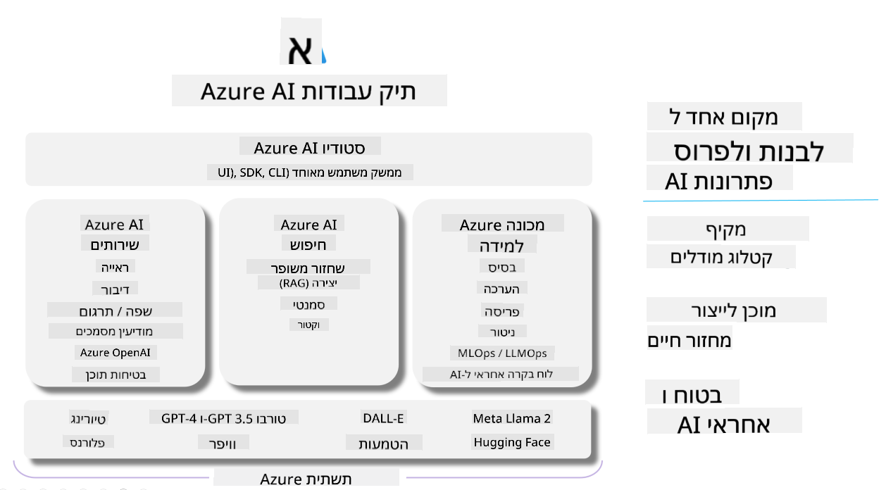

<!--
CO_OP_TRANSLATOR_METADATA:
{
  "original_hash": "7b4235159486df4000e16b7b46ddfec3",
  "translation_date": "2025-05-09T15:00:34+00:00",
  "source_file": "md/01.Introduction/05/AIFoundry.md",
  "language_code": "he"
}
-->
# **שימוש ב-Azure AI Foundry להערכה**

איך להעריך את אפליקציית ה-AI הגנרטיבי שלך בעזרת [Azure AI Foundry](https://ai.azure.com?WT.mc_id=aiml-138114-kinfeylo). בין אם אתה מעריך שיחות חד-סיבוביות או רב-סיבוביות, Azure AI Foundry מספקת כלים להערכת ביצועי המודל ובטיחותו.

## איך להעריך אפליקציות AI גנרטיביות עם Azure AI Foundry  
למידע מפורט יותר ראה את [תיעוד Azure AI Foundry](https://learn.microsoft.com/azure/ai-studio/how-to/evaluate-generative-ai-app?WT.mc_id=aiml-138114-kinfeylo)

הנה השלבים להתחלה:

## הערכת מודלים גנרטיביים ב-Azure AI Foundry

**דרישות מוקדמות**

- קבוצת נתונים לבחינה בפורמט CSV או JSON.  
- מודל AI גנרטיבי פרוס (כמו Phi-3, GPT 3.5, GPT 4, או מודלים של Davinci).  
- סביבת ריצה עם מופע מחשוב להפעיל את ההערכה.

## מדדי הערכה מובנים

Azure AI Foundry מאפשרת להעריך שיחות גם חד-סיבוביות וגם מורכבות רב-סיבוביות.  
בתרחישי Retrieval Augmented Generation (RAG), שבהם המודל מבוסס על נתונים ספציפיים, ניתן להעריך ביצועים בעזרת מדדי הערכה מובנים.  
בנוסף, אפשר להעריך תרחישי שאלות ותשובות חד-סיבוביות כלליות (שאינן RAG).

## יצירת ריצת הערכה

מממשק המשתמש של Azure AI Foundry, נווט לדף Evaluate או לדף Prompt Flow.  
עקוב אחר אשף יצירת ההערכה כדי להקים ריצת הערכה. תוכל לספק שם אופציונלי להערכתך.  
בחר בתרחיש שמתאים למטרות האפליקציה שלך.  
בחר מדד הערכה אחד או יותר כדי להעריך את פלט המודל.

## זרם הערכה מותאם אישית (אופציונלי)

לגמישות מוגברת, ניתן להקים זרם הערכה מותאם אישית. התאם את תהליך ההערכה לפי הצרכים הספציפיים שלך.

## צפייה בתוצאות

לאחר הרצת ההערכה, תוכל לתעד, לצפות ולנתח מדדי הערכה מפורטים ב-Azure AI Foundry. קבל תובנות על היכולות והמגבלות של האפליקציה שלך.

**Note** Azure AI Foundry נמצאת כעת במצב תצוגה ציבורית, ולכן מומלץ להשתמש בה לצרכי ניסויים ופיתוח. לעומסי עבודה פרודקשן, שקול אפשרויות אחרות.  
עיין בתיעוד הרשמי של [AI Foundry](https://learn.microsoft.com/azure/ai-studio/?WT.mc_id=aiml-138114-kinfeylo) לפרטים נוספים והוראות שלב-אחר-שלב.

**כתב ויתור**:  
מסמך זה תורגם באמצעות שירות תרגום מבוסס בינה מלאכותית [Co-op Translator](https://github.com/Azure/co-op-translator). למרות שאנו שואפים לדיוק, יש לקחת בחשבון כי תרגומים אוטומטיים עלולים להכיל שגיאות או אי-דיוקים. המסמך המקורי בשפת המקור שלו צריך להיחשב כמקור הסמכות. למידע קריטי מומלץ להשתמש בתרגום מקצועי של אדם. איננו אחראים לכל אי-הבנות או פרשנויות שגויות הנובעות משימוש בתרגום זה.