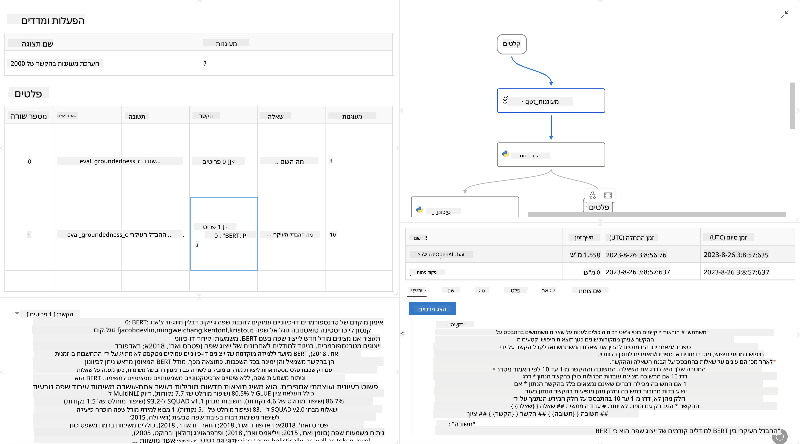

<!--
CO_OP_TRANSLATOR_METADATA:
{
  "original_hash": "3cbe7629d254f1043193b7fe22524d55",
  "translation_date": "2025-05-09T15:16:20+00:00",
  "source_file": "md/01.Introduction/05/Promptflow.md",
  "language_code": "he"
}
-->
# **הקדמה ל-Promptflow**

[Microsoft Prompt Flow](https://microsoft.github.io/promptflow/index.html?WT.mc_id=aiml-138114-kinfeylo) הוא כלי אוטומציה ויזואלי לזרימות עבודה, המאפשר למשתמשים ליצור זרימות עבודה אוטומטיות באמצעות תבניות מוכנות ומחברים מותאמים אישית. הכלי מיועד לאפשר למפתחים ואנליסטים עסקיים לבנות במהירות תהליכים אוטומטיים למשימות כמו ניהול נתונים, שיתוף פעולה ואופטימיזציה של תהליכים. עם Prompt Flow, משתמשים יכולים לחבר בקלות שירותים, אפליקציות ומערכות שונות, ולאוטומט תהליכים עסקיים מורכבים.

Microsoft Prompt Flow תוכנן לייעל את מחזור הפיתוח מקצה לקצה של אפליקציות AI המונעות על ידי מודלים שפתיים גדולים (LLMs). בין אם אתם מפתחים רעיונות, יוצרים אב-טיפוס, מבצעים בדיקות, מעריכים או מפעילים אפליקציות מבוססות LLM, Prompt Flow מפשט את התהליך ומאפשר לכם לבנות אפליקציות LLM באיכות ייצור.

## הנה התכונות והיתרונות המרכזיים של Microsoft Prompt Flow:

**חוויית כתיבה אינטראקטיבית**

Prompt Flow מספק ייצוג ויזואלי של מבנה הזרימה שלכם, מה שמקל על ההבנה והניווט בפרויקטים.
הוא מציע חוויית קידוד בדומה למחברת (notebook) לפיתוח ופתרון בעיות יעיל של הזרימה.

**גרסאות וכיוונון של פרומפטים**

צרו והשוו בין מספר גרסאות פרומפט כדי לאפשר תהליך שיפור איטרטיבי. העריכו את ביצועי הפרומפטים השונים ובחרו את היעילים ביותר.

**זרימות הערכה מובנות**

העריכו את האיכות והאפקטיביות של הפרומפטים והזרימות שלכם באמצעות כלי הערכה מובנים.
הבינו עד כמה אפליקציות ה-LLM שלכם מתפקדות טוב.

**משאבים מקיפים**

Prompt Flow כולל ספרייה של כלים, דוגמאות ותבניות מובנות. משאבים אלה משמשים נקודת התחלה לפיתוח, מעוררים יצירתיות ומאיצים את התהליך.

**שיתוף פעולה ומוכנות לארגון**

תמכו בשיתוף פעולה צוותי על ידי מתן אפשרות למספר משתמשים לעבוד יחד על פרויקטים של הנדסת פרומפטים.
שמרו על בקרת גרסאות ושתפו ידע ביעילות. ייעלו את כל תהליך הנדסת הפרומפטים, מהפיתוח וההערכה ועד הפריסה והמעקב.

## הערכה ב-Prompt Flow

ב-Microsoft Prompt Flow, ההערכה משחקת תפקיד מרכזי בהערכת ביצועי מודלי ה-AI שלכם. נבחן כיצד ניתן להתאים אישית זרימות הערכה ומדדים בתוך Prompt Flow:

**הבנת ההערכה ב-Prompt Flow**

ב-Prompt Flow, זרימה מייצגת רצף של צמתים שמעבדים קלט ומייצרים פלט. זרימות הערכה הן סוג מיוחד של זרימות שנועדו להעריך את ביצועי הריצה בהתבסס על קריטריונים ומטרות ספציפיות.

**תכונות מרכזיות של זרימות הערכה**

הן בדרך כלל רצות לאחר הזרימה הנבדקת, תוך שימוש בפלטים שלה. הן מחשבות ניקוד או מדדים למדידת ביצועי הזרימה הנבדקת. המדדים יכולים לכלול דיוק, ציוני רלוונטיות או מדדים רלוונטיים אחרים.

### התאמת זרימות הערכה

**הגדרת קלטים**

זרימות הערכה צריכות לקבל את הפלטים של הריצה הנבדקת. הגדירו קלטים בדומה לזרימות סטנדרטיות.
לדוגמה, אם אתם מעריכים זרימת שאלות ותשובות (QnA), קראו לקלט "answer". אם מעריכים זרימת סיווג, קראו לקלט "category". ייתכן שתצטרכו גם קלטים של אמת קרקעית (כגון תוויות בפועל).

**פלטים ומדדים**

זרימות הערכה מפיקות תוצאות שמודדות את ביצועי הזרימה הנבדקת. ניתן לחשב מדדים באמצעות Python או מודלים שפתיים גדולים (LLM). השתמשו בפונקציה log_metric() כדי לרשום מדדים רלוונטיים.

**שימוש בזרימות הערכה מותאמות**

פיתחו זרימת הערכה מותאמת אישית שמתאימה למשימות ולמטרות שלכם.
התאימו מדדים בהתאם למטרות ההערכה שלכם.
החילו את זרימת ההערכה המותאמת על ריצות באצוות לבדיקות בקנה מידה גדול.

## שיטות הערכה מובנות

Prompt Flow מספק גם שיטות הערכה מובנות.
ניתן להגיש ריצות באצווה ולהשתמש בשיטות אלו כדי להעריך עד כמה הזרימה שלכם מתפקדת עם מאגרי נתונים גדולים.
צפו בתוצאות ההערכה, השוו מדדים וחזרו על התהליך לפי הצורך.
זכרו, ההערכה חיונית כדי לוודא שמודלי ה-AI שלכם עומדים בקריטריונים ובמטרות הרצויות. עיינו בתיעוד הרשמי להוראות מפורטות על פיתוח ושימוש בזרימות הערכה ב-Microsoft Prompt Flow.

לסיכום, Microsoft Prompt Flow מעניק למפתחים כלים לבניית אפליקציות LLM איכותיות על ידי פישוט הנדסת הפרומפטים וסביבת פיתוח חזקה. אם אתם עובדים עם LLMs, Prompt Flow הוא כלי חשוב שכדאי להכיר. עיינו ב-[Prompt Flow Evaluation Documents](https://learn.microsoft.com/azure/machine-learning/prompt-flow/how-to-develop-an-evaluation-flow?view=azureml-api-2?WT.mc_id=aiml-138114-kinfeylo) להוראות מפורטות על פיתוח ושימוש בזרימות הערכה ב-Microsoft Prompt Flow.

**כתב ויתור**:  
מסמך זה תורגם באמצעות שירות תרגום מבוסס בינה מלאכותית [Co-op Translator](https://github.com/Azure/co-op-translator). למרות שאנו שואפים לדייק, יש לקחת בחשבון כי תרגומים אוטומטיים עלולים להכיל שגיאות או אי-דיוקים. המסמך המקורי בשפת המקור שלו נחשב למקור הסמכותי. למידע קריטי מומלץ להשתמש בתרגום מקצועי אנושי. אנו לא אחראים לכל אי הבנה או פרשנות שגויה הנובעים משימוש בתרגום זה.