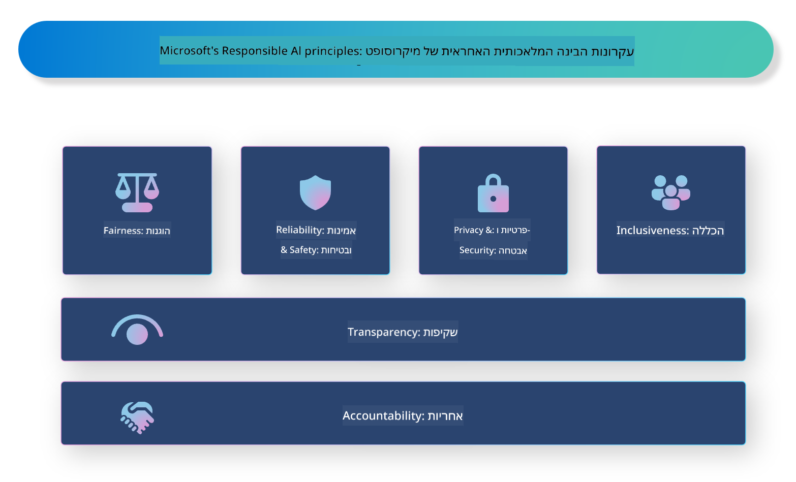

<!--
CO_OP_TRANSLATOR_METADATA:
{
  "original_hash": "805b96b20152936d8f4c587d90d6e06e",
  "translation_date": "2025-05-09T15:39:52+00:00",
  "source_file": "md/01.Introduction/05/ResponsibleAI.md",
  "language_code": "he"
}
-->
# **הקדמה ל-Responsible AI**

[Microsoft Responsible AI](https://www.microsoft.com/ai/responsible-ai?WT.mc_id=aiml-138114-kinfeylo) היא יוזמה שמטרתה לסייע למפתחים ולארגונים לבנות מערכות AI שקופות, אמינות ואחראיות. היוזמה מספקת הנחיות ומשאבים לפיתוח פתרונות AI אחראיים התואמים לעקרונות אתיים, כמו פרטיות, הוגנות ושקיפות. בנוסף, נסקור כמה מהאתגרים והפרקטיקות המומלצות הקשורים לבניית מערכות AI אחראיות.

## סקירה כללית של Microsoft Responsible AI

**עקרונות אתיים**

Microsoft Responsible AI מונחה על ידי סט של עקרונות אתיים, כגון פרטיות, הוגנות, שקיפות, אחריות ובטיחות. עקרונות אלה נועדו להבטיח שמערכות AI מפותחות באופן אתי ואחראי.

**AI שקוף**

Microsoft Responsible AI מדגישה את החשיבות של שקיפות במערכות AI. זה כולל מתן הסברים ברורים על אופן פעולת מודלי ה-AI, וכן הבטחת זמינות ציבורית של מקורות הנתונים והאלגוריתמים.

**AI אחראי**

[Microsoft Responsible AI](https://www.microsoft.com/ai/responsible-ai?WT.mc_id=aiml-138114-kinfeylo) מקדמת פיתוח מערכות AI אחראיות שיכולות לספק תובנות על האופן שבו מודלי ה-AI מקבלים החלטות. זה מסייע למשתמשים להבין ולבטוח בתוצאות של מערכות ה-AI.

**כלליות**

מערכות AI צריכות להיות מתוכננות לטובת כולם. Microsoft שואפת ליצור AI כוללני שמתחשב בפרספקטיבות מגוונות ומונע הטיות או אפליה.

**אמינות ובטיחות**

הבטחת אמינות ובטיחות של מערכות AI היא קריטית. Microsoft מתמקדת בבניית מודלים חזקים שמתפקדים בעקביות ומונעים תוצאות מזיקות.

**הוגנות ב-AI**

Microsoft Responsible AI מכירה בכך שמערכות AI עלולות להנציח הטיות אם הן מאומנות על נתונים או אלגוריתמים מוטים. היוזמה מספקת הנחיות לפיתוח מערכות AI הוגנות שאינן מפלות על בסיס גורמים כמו גזע, מגדר או גיל.

**פרטיות ואבטחה**

Microsoft Responsible AI מדגישה את החשיבות של הגנת פרטיות המשתמש ואבטחת הנתונים במערכות AI. זה כולל יישום הצפנת נתונים חזקה ובקרות גישה, וכן ביקורת שוטפת של מערכות AI לזיהוי פגיעויות.

**אחריות ולקיחת אחריות**

Microsoft Responsible AI מקדמת אחריות ולקיחת אחריות בפיתוח והטמעה של AI. זה כולל הבטחת מודעות של מפתחים וארגונים לסיכונים הפוטנציאליים במערכות AI ונקיטת צעדים לצמצום סיכונים אלה.

## פרקטיקות מומלצות לבניית מערכות AI אחראיות

**פיתוח מודלי AI באמצעות מערכי נתונים מגוונים**

כדי למנוע הטיות במערכות AI, חשוב להשתמש במערכי נתונים מגוונים המייצגים מגוון פרספקטיבות וניסיון.

**שימוש בטכניקות AI להסבר**

טכניקות AI להסבר מסייעות למשתמשים להבין כיצד מודלי ה-AI מקבלים החלטות, מה שיכול להגביר את האמון במערכת.

**ביקורת שוטפת של מערכות AI לזיהוי פגיעויות**

ביקורות תקופתיות של מערכות AI עוזרות לזהות סיכונים ופגיעויות שיש לטפל בהם.

**יישום הצפנת נתונים חזקה ובקרות גישה**

הצפנת נתונים ובקרות גישה מסייעות להגן על פרטיות ואבטחת המשתמש במערכות AI.

**עמידה בעקרונות אתיים בפיתוח AI**

הקפדה על עקרונות אתיים, כגון הוגנות, שקיפות ואחריות, תורמת לבניית אמון במערכות AI ומבטיחה פיתוח אחראי.

## שימוש ב-AI Foundry ל-Responsible AI

[Azure AI Foundry](https://ai.azure.com?WT.mc_id=aiml-138114-kinfeylo) היא פלטפורמה חזקה המאפשרת למפתחים ולארגונים ליצור במהירות יישומים אינטיליגנטיים, מתקדמים, מוכנים לשוק ואחראיים. הנה כמה תכונות ויכולות מרכזיות של Azure AI Foundry:

**API ומודלים מוכנים לשימוש**

Azure AI Foundry מספקת API ומודלים מוכנים מראש שניתן להתאים אישית. הם מכסים מגוון רחב של משימות AI, כולל AI גנרטיבי, עיבוד שפה טבעית לשיחות, חיפוש, ניטור, תרגום, דיבור, ראייה וקבלת החלטות.

**Prompt Flow**

Prompt Flow ב-Azure AI Foundry מאפשר ליצור חוויות AI שיחתיות. הוא מאפשר לתכנן ולנהל זרמי שיחה, מה שמקל על בניית צ'אטבוטים, עוזרים וירטואליים ויישומים אינטראקטיביים אחרים.

**Retrieval Augmented Generation (RAG)**

RAG היא טכניקה שמשלבת גישות מבוססות שליפה וגנרטיביות. היא משפרת את איכות התגובות המופקות על ידי שימוש הן בידע קיים (שליפה) והן ביצירה יצירתית (גנרציה).

**מדדים להערכה וניטור של AI גנרטיבי**

Azure AI Foundry מספקת כלים להערכת וניטור מודלי AI גנרטיביים. ניתן להעריך את ביצועיהם, הוגנותם ומדדים חשובים נוספים כדי להבטיח הטמעה אחראית. בנוסף, אם יצרתם לוח בקרה, תוכלו להשתמש בממשק ללא קוד ב-Azure Machine Learning Studio כדי להתאים וליצור לוח בקרה ל-Responsible AI וכרטיס ניקוד מבוסס על [Repsonsible AI Toolbox](https://responsibleaitoolbox.ai/?WT.mc_id=aiml-138114-kinfeylo) Python Libraries. כרטיס ניקוד זה מסייע לשתף תובנות מרכזיות הקשורות להוגנות, חשיבות תכונות ושיקולים אחרים של הטמעה אחראית עם בעלי עניין טכניים ולא טכניים כאחד.

להשתמש ב-AI Foundry עם Responsible AI, ניתן לפעול לפי הפרקטיקות המומלצות הבאות:

**הגדרת הבעיה והמטרות של מערכת ה-AI שלך**

לפני תחילת תהליך הפיתוח, חשוב להגדיר בבירור את הבעיה או המטרה שמערכת ה-AI שלך שואפת לפתור. זה יעזור לזהות את הנתונים, האלגוריתמים והמשאבים הדרושים לבניית מודל יעיל.

**איסוף ועיבוד מוקדם של נתונים רלוונטיים**

איכות וכמות הנתונים המשמשים לאימון מערכת AI משפיעים משמעותית על ביצועיה. לכן, חשוב לאסוף נתונים רלוונטיים, לנקות אותם, לעבד אותם מוקדם ולהבטיח שהם מייצגים את האוכלוסייה או הבעיה שאתה מנסה לפתור.

**בחירת שיטת הערכה מתאימה**

קיימות אלגוריתמים שונים להערכה. חשוב לבחור את האלגוריתם המתאים ביותר בהתבסס על הנתונים והבעיה שלך.

**הערכת המודל ופירוש התוצאות**

לאחר בניית מודל AI, חשוב להעריך את ביצועיו באמצעות מדדים מתאימים ולפרש את התוצאות באופן שקוף. זה יסייע לזהות הטיות או מגבלות במודל ולבצע שיפורים במידת הצורך.

**הבטחת שקיפות והסברתיות**

מערכות AI צריכות להיות שקופות ומוסברות כך שמשתמשים יוכלו להבין כיצד הן פועלות וכיצד מתקבלות ההחלטות. זה חשוב במיוחד ליישומים עם השפעות משמעותיות על חיי אדם, כמו בריאות, פיננסים ומערכות משפטיות.

**ניטור ועדכון המודל**

מערכות AI צריכות להיות במעקב מתמיד ולעדכן כדי להבטיח שהן נשארות מדויקות ויעילות לאורך זמן. זה דורש תחזוקה שוטפת, בדיקות ואימון מחדש של המודל.

לסיכום, Microsoft Responsible AI היא יוזמה שמטרתה לסייע למפתחים ולארגונים לבנות מערכות AI שקופות, אמינות ואחראיות. חשוב לזכור שהטמעת AI אחראי היא קריטית, ו-Azure AI Foundry שואפת להפוך זאת לפרקטי לארגונים. באמצעות הקפדה על עקרונות אתיים ופרקטיקות מומלצות, נוכל להבטיח שמערכות AI מפותחות ומוטמעות באחריות לטובת החברה כולה.

**כתב ויתור**:  
מסמך זה תורגם באמצעות שירות תרגום מבוסס בינה מלאכותית [Co-op Translator](https://github.com/Azure/co-op-translator). למרות שאנו שואפים לדיוק, יש לקחת בחשבון שתרגומים אוטומטיים עלולים להכיל שגיאות או אי דיוקים. המסמך המקורי בשפת המקור שלו נחשב למקור הסמכותי. למידע קריטי מומלץ להשתמש בתרגום מקצועי אנושי. אנו לא אחראים לכל אי הבנות או פרשנויות שגויות הנובעות משימוש בתרגום זה.