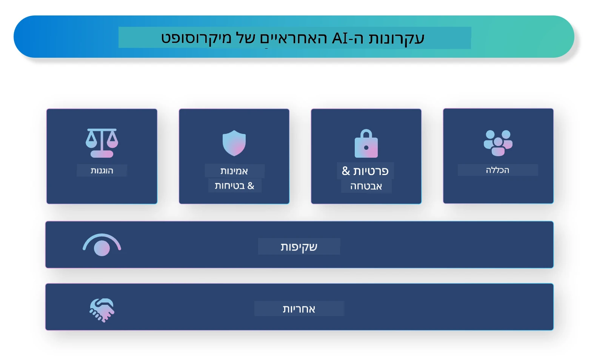

<!--
CO_OP_TRANSLATOR_METADATA:
{
  "original_hash": "805b96b20152936d8f4c587d90d6e06e",
  "translation_date": "2025-07-16T22:55:19+00:00",
  "source_file": "md/01.Introduction/05/ResponsibleAI.md",
  "language_code": "he"
}
-->
# **הקדמה ל-AI אחראי**

[Microsoft Responsible AI](https://www.microsoft.com/ai/responsible-ai?WT.mc_id=aiml-138114-kinfeylo) היא יוזמה שמטרתה לסייע למפתחים ולארגונים לבנות מערכות AI שקופות, אמינות ואחראיות. היוזמה מספקת הנחיות ומשאבים לפיתוח פתרונות AI אחראיים שמתיישבים עם עקרונות אתיים, כמו פרטיות, הוגנות ושקיפות. בנוסף, נבחן כמה מהאתגרים והפרקטיקות הטובות ביותר הקשורות לבניית מערכות AI אחראיות.

## סקירה כללית של Microsoft Responsible AI

**עקרונות אתיים**

Microsoft Responsible AI מונחה על ידי סט של עקרונות אתיים, כגון פרטיות, הוגנות, שקיפות, אחריות ובטיחות. עקרונות אלו נועדו להבטיח שמערכות AI מפותחות בצורה אתית ואחראית.

**AI שקוף**

Microsoft Responsible AI מדגישה את החשיבות של שקיפות במערכות AI. זה כולל מתן הסברים ברורים על אופן פעולת מודלי ה-AI, וכן הבטחה שמקורות הנתונים והאלגוריתמים יהיו זמינים לציבור.

**AI אחראי**

[Microsoft Responsible AI](https://www.microsoft.com/ai/responsible-ai?WT.mc_id=aiml-138114-kinfeylo) מקדמת פיתוח מערכות AI אחראיות, שיכולות לספק תובנות לגבי האופן שבו מודלי ה-AI מקבלים החלטות. זה מסייע למשתמשים להבין ולבטוח בתוצאות של מערכות ה-AI.

**הכללה**

מערכות AI צריכות להיות מתוכננות לטובת כולם. Microsoft שואפת ליצור AI כוללני שמתחשב בפרספקטיבות מגוונות ומונע הטיות או אפליה.

**אמינות ובטיחות**

הבטחת אמינות ובטיחות של מערכות AI היא קריטית. Microsoft מתמקדת בבניית מודלים חזקים שמבצעים בעקביות ומונעים תוצאות מזיקות.

**הוגנות ב-AI**

Microsoft Responsible AI מכירה בכך שמערכות AI עלולות להנציח הטיות אם הן מאומנות על נתונים או אלגוריתמים מוטים. היוזמה מספקת הנחיות לפיתוח מערכות AI הוגנות שאינן מפלות על בסיס גורמים כמו גזע, מין או גיל.

**פרטיות ואבטחה**

Microsoft Responsible AI מדגישה את החשיבות של הגנת פרטיות המשתמש ואבטחת הנתונים במערכות AI. זה כולל יישום הצפנת נתונים חזקה ובקרות גישה, וכן ביצוע ביקורות תקופתיות על מערכות ה-AI לזיהוי פגיעויות.

**אחריות ואמינות**

Microsoft Responsible AI מקדמת אחריות ואמינות בפיתוח והטמעת מערכות AI. זה כולל הבטחה שמפתחים וארגונים מודעים לסיכונים הפוטנציאליים הקשורים למערכות AI ונוקטים צעדים להפחתתם.

## פרקטיקות מומלצות לבניית מערכות AI אחראיות

**פיתוח מודלי AI באמצעות מערכי נתונים מגוונים**

כדי למנוע הטיות במערכות AI, חשוב להשתמש במערכי נתונים מגוונים שמייצגים טווח רחב של פרספקטיבות וניסיונות.

**שימוש בטכניקות AI להסבר**

טכניקות AI להסבר יכולות לסייע למשתמשים להבין כיצד מודלי ה-AI מקבלים החלטות, מה שמגביר את האמון במערכת.

**ביצוע ביקורות תקופתיות לזיהוי פגיעויות במערכות AI**

ביקורות תקופתיות של מערכות AI יכולות לסייע בזיהוי סיכונים ופגיעויות שיש לטפל בהם.

**יישום הצפנת נתונים חזקה ובקרות גישה**

הצפנת נתונים ובקרות גישה מסייעות בהגנה על פרטיות המשתמש ואבטחת מערכות ה-AI.

**שמירה על עקרונות אתיים בפיתוח AI**

שמירה על עקרונות אתיים, כגון הוגנות, שקיפות ואחריות, מסייעת לבניית אמון במערכות AI ומבטיחה שהן מפותחות בצורה אחראית.

## שימוש ב-AI Foundry ל-AI אחראי

[Azure AI Foundry](https://ai.azure.com?WT.mc_id=aiml-138114-kinfeylo) היא פלטפורמה עוצמתית המאפשרת למפתחים וארגונים ליצור במהירות יישומים אינטיליגנטיים, מתקדמים, מוכנים לשוק ואחראיים. להלן כמה תכונות ויכולות מרכזיות של Azure AI Foundry:

**API ומודלים מוכנים לשימוש**

Azure AI Foundry מספקת API ומודלים מוכנים מראש וניתנים להתאמה אישית. הם מכסים מגוון רחב של משימות AI, כולל AI גנרטיבי, עיבוד שפה טבעית לשיחות, חיפוש, ניטור, תרגום, דיבור, ראייה וקבלת החלטות.

**Prompt Flow**

Prompt flow ב-Azure AI Foundry מאפשר יצירת חוויות AI שיחתיות. הוא מאפשר לעצב ולנהל זרימות שיחה, מה שמקל על בניית צ'אטבוטים, עוזרים וירטואליים ויישומים אינטראקטיביים אחרים.

**Retrieval Augmented Generation (RAG)**

RAG היא טכניקה שמשלבת גישות מבוססות אחזור וגנרטיביות. היא משפרת את איכות התגובות שנוצרות על ידי ניצול ידע קיים (אחזור) ויצירה יצירתית (גנרטיביות).

**מדדי הערכה וניטור ל-AI גנרטיבי**

Azure AI Foundry מספקת כלים להערכת וניטור מודלי AI גנרטיביים. ניתן להעריך את הביצועים, ההוגנות ומדדים חשובים נוספים כדי להבטיח הטמעה אחראית. בנוסף, אם יצרתם לוח בקרה, ניתן להשתמש בממשק ללא קוד ב-Azure Machine Learning Studio כדי להתאים וליצור לוח בקרה ל-Responsible AI וכרטיס ניקוד קשור המבוסס על [Repsonsible AI Toolbox](https://responsibleaitoolbox.ai/?WT.mc_id=aiml-138114-kinfeylo) ספריות Python. כרטיס הניקוד הזה מסייע לשתף תובנות מרכזיות הקשורות להוגנות, חשיבות תכונות ושיקולים נוספים של הטמעה אחראית עם בעלי עניין טכניים ולא טכניים.

כדי להשתמש ב-AI Foundry עם AI אחראי, ניתן לעקוב אחרי הפרקטיקות הבאות:

**הגדרת הבעיה והמטרות של מערכת ה-AI שלך**

לפני תחילת תהליך הפיתוח, חשוב להגדיר בבירור את הבעיה או המטרה שמערכת ה-AI שלך שואפת לפתור. זה יעזור לזהות את הנתונים, האלגוריתמים והמשאבים הדרושים לבניית מודל יעיל.

**איסוף ועיבוד מוקדם של נתונים רלוונטיים**

איכות וכמות הנתונים המשמשים לאימון מערכת AI משפיעים משמעותית על הביצועים שלה. לכן, חשוב לאסוף נתונים רלוונטיים, לנקות אותם, לעבד אותם מראש ולהבטיח שהם מייצגים את האוכלוסייה או הבעיה שאתה מנסה לפתור.

**בחירת שיטת הערכה מתאימה**

קיימים אלגוריתמים שונים להערכה. חשוב לבחור את האלגוריתם המתאים ביותר בהתבסס על הנתונים והבעיה שלך.

**הערכת המודל ופרשנות התוצאות**

לאחר בניית מודל AI, חשוב להעריך את ביצועיו באמצעות מדדים מתאימים ולפרש את התוצאות בצורה שקופה. זה יסייע לזהות הטיות או מגבלות במודל ולבצע שיפורים במידת הצורך.

**הבטחת שקיפות והסבריות**

מערכות AI צריכות להיות שקופות ומסבירות כדי שמשתמשים יוכלו להבין כיצד הן פועלות וכיצד מתקבלות ההחלטות. זה חשוב במיוחד ליישומים שיש להם השפעות משמעותיות על חיי אדם, כמו בריאות, פיננסים ומערכות משפטיות.

**ניטור ועדכון המודל**

מערכות AI צריכות להיות במעקב מתמיד ולעבור עדכונים כדי להבטיח שהן נשארות מדויקות ויעילות לאורך זמן. זה דורש תחזוקה שוטפת, בדיקות ואימון מחודש של המודל.

לסיכום, Microsoft Responsible AI היא יוזמה שמטרתה לסייע למפתחים ולארגונים לבנות מערכות AI שקופות, אמינות ואחראיות. חשוב לזכור שהטמעת AI אחראי היא קריטית, ו-Azure AI Foundry שואפת להפוך זאת לפרקטי עבור ארגונים. על ידי שמירה על עקרונות אתיים ופרקטיקות מומלצות, נוכל להבטיח שמערכות AI מפותחות ומוטמעות בצורה אחראית שמיטיבה עם החברה כולה.

**כתב ויתור**:  
מסמך זה תורגם באמצעות שירות תרגום מבוסס בינה מלאכותית [Co-op Translator](https://github.com/Azure/co-op-translator). למרות שאנו שואפים לדיוק, יש לקחת בחשבון כי תרגומים אוטומטיים עלולים להכיל שגיאות או אי-דיוקים. המסמך המקורי בשפת המקור שלו נחשב למקור הסמכותי. למידע קריטי מומלץ להשתמש בתרגום מקצועי על ידי אדם. אנו לא נושאים באחריות לכל אי-הבנה או פרשנות שגויה הנובעת משימוש בתרגום זה.