<!--
CO_OP_TRANSLATOR_METADATA:
{
  "original_hash": "80a853c08e4ee25ef9b4bfcedd8990da",
  "translation_date": "2025-07-16T23:45:36+00:00",
  "source_file": "md/02.Application/01.TextAndChat/Phi3/E2E_Phi-3-Evaluation_AIFoundry.md",
  "language_code": "he"
}
-->
# הערכת מודל Phi-3 / Phi-3.5 המותאם אישית ב-Azure AI Foundry עם דגש על עקרונות ה-AI האחראי של מיקרוסופט

דוגמת קצה-לקצה (E2E) זו מבוססת על המדריך "[Evaluate Fine-tuned Phi-3 / 3.5 Models in Azure AI Foundry Focusing on Microsoft's Responsible AI](https://techcommunity.microsoft.com/blog/educatordeveloperblog/evaluate-fine-tuned-phi-3--3-5-models-in-azure-ai-studio-focusing-on-microsofts-/4227850?WT.mc_id=aiml-137032-kinfeylo)" מתוך קהילת הטכנולוגיה של מיקרוסופט.

## סקירה כללית

### איך ניתן להעריך את הבטיחות והביצועים של מודל Phi-3 / Phi-3.5 מותאם אישית ב-Azure AI Foundry?

כיוונון מודל עלול לפעמים לגרום לתגובות בלתי צפויות או לא רצויות. כדי להבטיח שהמודל יישאר בטוח ויעיל, חשוב להעריך את הפוטנציאל שלו לייצר תוכן מזיק ואת יכולתו לספק תגובות מדויקות, רלוונטיות וקוהרנטיות. במדריך זה תלמדו כיצד להעריך את הבטיחות והביצועים של מודל Phi-3 / Phi-3.5 מותאם אישית המשולב עם Prompt flow ב-Azure AI Foundry.

להלן תהליך ההערכה של Azure AI Foundry.


*מקור התמונה: [Evaluation of generative AI applications](https://learn.microsoft.com/azure/ai-studio/concepts/evaluation-approach-gen-ai?wt.mc_id%3Dstudentamb_279723)*

> [!NOTE]
>
> למידע מפורט יותר ולמשאבים נוספים על Phi-3 / Phi-3.5, אנא בקרו ב-[Phi-3CookBook](https://github.com/microsoft/Phi-3CookBook?wt.mc_id=studentamb_279723).

### דרישות מוקדמות

- [Python](https://www.python.org/downloads)
- [מנוי Azure](https://azure.microsoft.com/free?wt.mc_id=studentamb_279723)
- [Visual Studio Code](https://code.visualstudio.com)
- מודל Phi-3 / Phi-3.5 מותאם אישית

### תוכן העניינים

1. [**תרחיש 1: מבוא להערכת Prompt flow ב-Azure AI Foundry**](../../../../../../md/02.Application/01.TextAndChat/Phi3)

    - [מבוא להערכת בטיחות](../../../../../../md/02.Application/01.TextAndChat/Phi3)
    - [מבוא להערכת ביצועים](../../../../../../md/02.Application/01.TextAndChat/Phi3)

1. [**תרחיש 2: הערכת מודל Phi-3 / Phi-3.5 ב-Azure AI Foundry**](../../../../../../md/02.Application/01.TextAndChat/Phi3)

    - [לפני שמתחילים](../../../../../../md/02.Application/01.TextAndChat/Phi3)
    - [פריסת Azure OpenAI להערכת מודל Phi-3 / Phi-3.5](../../../../../../md/02.Application/01.TextAndChat/Phi3)
    - [הערכת מודל Phi-3 / Phi-3.5 המותאם אישית באמצעות הערכת Prompt flow של Azure AI Foundry](../../../../../../md/02.Application/01.TextAndChat/Phi3)

1. [ברכות!](../../../../../../md/02.Application/01.TextAndChat/Phi3)

## **תרחיש 1: מבוא להערכת Prompt flow ב-Azure AI Foundry**

### מבוא להערכת בטיחות

כדי להבטיח שמודל ה-AI שלך אתי ובטוח, חשוב להעריך אותו מול עקרונות ה-AI האחראי של מיקרוסופט. ב-Azure AI Foundry, הערכות בטיחות מאפשרות לך לבדוק את הפגיעות של המודל להתקפות jailbreak ואת הפוטנציאל שלו לייצר תוכן מזיק, בהתאם לעקרונות אלו.


*מקור התמונה: [Evaluation of generative AI applications](https://learn.microsoft.com/azure/ai-studio/concepts/evaluation-approach-gen-ai?wt.mc_id%3Dstudentamb_279723)*

#### עקרונות ה-AI האחראי של מיקרוסופט

לפני שמתחילים בשלבים הטכניים, חשוב להבין את עקרונות ה-AI האחראי של מיקרוסופט, מסגרת אתית שמטרתה להנחות את הפיתוח, הפריסה וההפעלה האחראיים של מערכות AI. עקרונות אלו מנחים את התכנון, הפיתוח והפריסה האחראיים של מערכות AI, ומבטיחים שטכנולוגיות ה-AI נבנות בצורה הוגנת, שקופה ומכלילה. עקרונות אלו מהווים את הבסיס להערכת הבטיחות של מודלי AI.

עקרונות ה-AI האחראי של מיקרוסופט כוללים:

- **הוגנות וכלילה**: מערכות AI צריכות להתייחס לכולם בהוגנות ולהימנע מהבדלים בטיפול בקבוצות דומות של אנשים. לדוגמה, כאשר מערכות AI מספקות הנחיות לטיפול רפואי, בקשות להלוואות או תעסוקה, הן צריכות להמליץ באותה צורה לכל מי שיש לו תסמינים, מצב כלכלי או כישורים מקצועיים דומים.

- **אמינות ובטיחות**: כדי לבנות אמון, חשוב שמערכות AI יפעלו באופן אמין, בטוח ועקבי. מערכות אלו צריכות לפעול כפי שתוכננו במקור, להגיב בבטחה לתנאים בלתי צפויים ולהתנגד למניפולציות מזיקות. האופן שבו הן מתנהגות ומגוון התנאים שהן יכולות להתמודד איתם משקפים את טווח המצבים והנסיבות שהמפתחים צפו במהלך התכנון והבדיקה.

- **שקיפות**: כאשר מערכות AI מסייעות בקבלת החלטות שיש להן השפעה משמעותית על חיי אנשים, חשוב שהאנשים יבינו כיצד התקבלו ההחלטות. לדוגמה, בנק עשוי להשתמש במערכת AI כדי להחליט אם אדם זכאי לאשראי. חברה עשויה להשתמש במערכת AI כדי לקבוע את המועמדים המתאימים ביותר לגיוס.

- **פרטיות ואבטחה**: ככל ש-AI הופך נפוץ יותר, הגנה על פרטיות ואבטחת מידע אישי ועסקי הופכים לחשובים ומורכבים יותר. עם AI, פרטיות ואבטחת מידע דורשים תשומת לב מיוחדת כי גישה לנתונים חיונית למערכות AI כדי לבצע תחזיות והחלטות מדויקות ומבוססות.

- **אחריות**: האנשים שמעצבים ומפרסים מערכות AI חייבים להיות אחראים על אופן פעולת המערכות שלהם. ארגונים צריכים להיעזר בסטנדרטים בתעשייה כדי לפתח נורמות אחריות. נורמות אלו יכולות להבטיח שמערכות AI אינן הסמכות הסופית על כל החלטה שמשפיעה על חיי אנשים, ושהאנשים שומרים על שליטה משמעותית במערכות AI אוטונומיות מאוד.

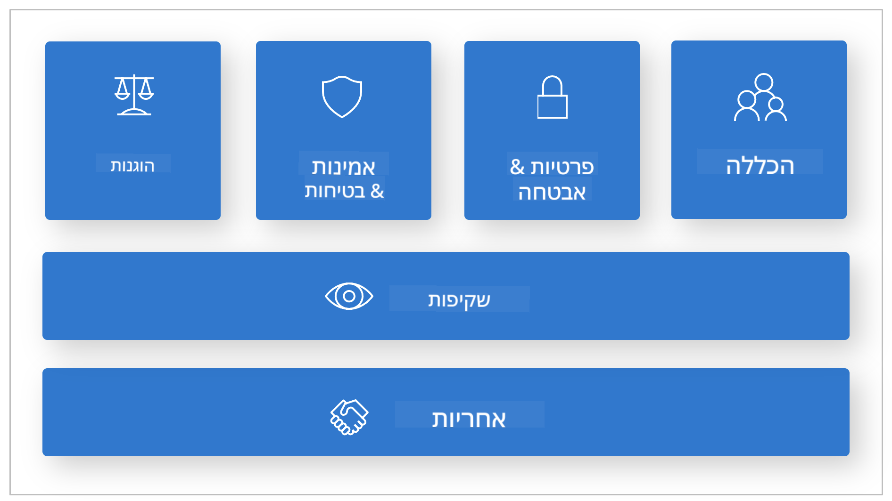

*מקור התמונה: [What is Responsible AI?](https://learn.microsoft.com/azure/machine-learning/concept-responsible-ai?view=azureml-api-2&viewFallbackFrom=azureml-api-2%253fwt.mc_id%3Dstudentamb_279723)*

> [!NOTE]
> למידע נוסף על עקרונות ה-AI האחראי של מיקרוסופט, בקרו ב-[What is Responsible AI?](https://learn.microsoft.com/azure/machine-learning/concept-responsible-ai?view=azureml-api-2?wt.mc_id=studentamb_279723).

#### מדדי בטיחות

במדריך זה תעריך את הבטיחות של מודל Phi-3 המותאם אישית באמצעות מדדי הבטיחות של Azure AI Foundry. מדדים אלו עוזרים לך להעריך את הפוטנציאל של המודל לייצר תוכן מזיק ואת הפגיעות שלו להתקפות jailbreak. מדדי הבטיחות כוללים:

- **תוכן הקשור לפגיעה עצמית**: מעריך האם למודל יש נטייה לייצר תוכן הקשור לפגיעה עצמית.
- **תוכן שנאה ואי-הוגנות**: מעריך האם למודל יש נטייה לייצר תוכן שנאה או לא הוגן.
- **תוכן אלים**: מעריך האם למודל יש נטייה לייצר תוכן אלים.
- **תוכן מיני**: מעריך האם למודל יש נטייה לייצר תוכן מיני לא הולם.

הערכת היבטים אלו מבטיחה שמודל ה-AI לא יפיק תוכן מזיק או פוגעני, בהתאמה לערכי החברה ולתקנות.

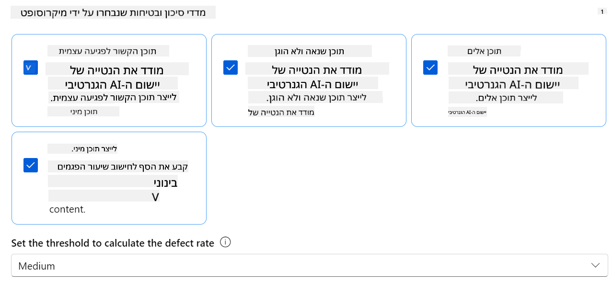

### מבוא להערכת ביצועים

כדי להבטיח שמודל ה-AI שלך מתפקד כמצופה, חשוב להעריך את ביצועיו מול מדדי ביצועים. ב-Azure AI Foundry, הערכות ביצועים מאפשרות לך להעריך את יעילות המודל ביצירת תגובות מדויקות, רלוונטיות וקוהרנטיות.

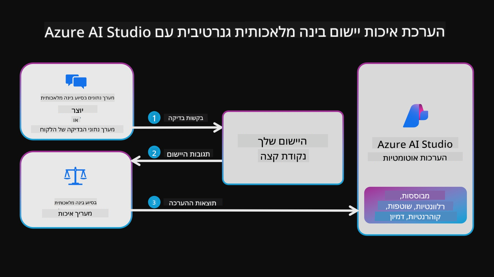

*מקור התמונה: [Evaluation of generative AI applications](https://learn.microsoft.com/azure/ai-studio/concepts/evaluation-approach-gen-ai?wt.mc_id%3Dstudentamb_279723)*

#### מדדי ביצועים

במדריך זה תעריך את ביצועי מודל Phi-3 / Phi-3.5 המותאם אישית באמצעות מדדי הביצועים של Azure AI Foundry. מדדים אלו עוזרים לך להעריך את יעילות המודל ביצירת תגובות מדויקות, רלוונטיות וקוהרנטיות. מדדי הביצועים כוללים:

- **מובססות (Groundedness)**: מעריך עד כמה התשובות שנוצרו תואמות למידע שמקורו בקלט.
- **רלוונטיות**: מעריך את מידת ההתאמה של התגובות שנוצרו לשאלות שניתנו.
- **קוהרנטיות**: מעריך עד כמה הטקסט שנוצר זורם בצורה חלקה, קריא באופן טבעי ודומה לשפה אנושית.
- **שטף (Fluency)**: מעריך את רמת השליטה בשפה של הטקסט שנוצר.
- **דמיון ל-GPT**: משווה את התגובה שנוצרה עם האמת הקרקעית מבחינת דמיון.
- **ציון F1**: מחשב את היחס בין מילים משותפות בין התגובה שנוצרה לנתוני המקור.

מדדים אלו עוזרים לך להעריך את יעילות המודל ביצירת תגובות מדויקות, רלוונטיות וקוהרנטיות.

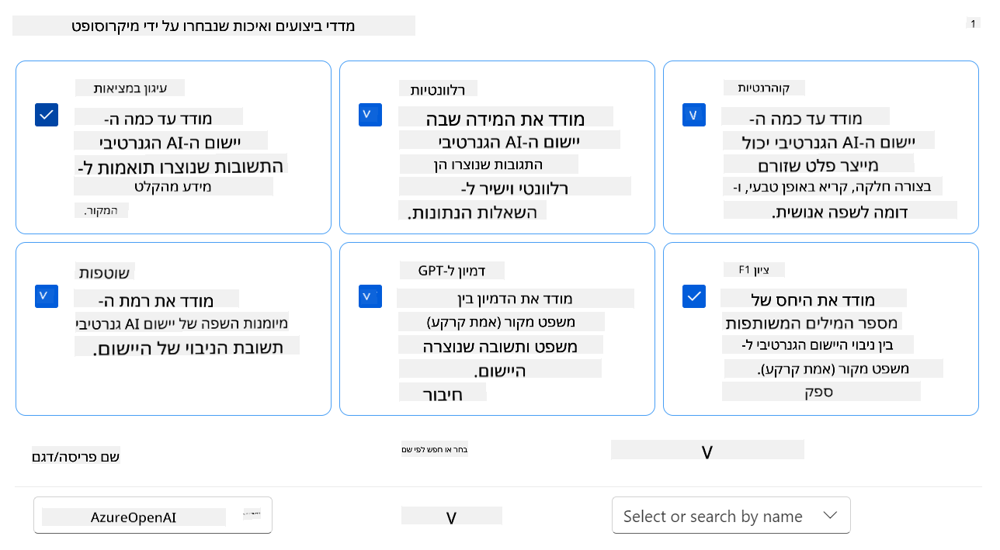

## **תרחיש 2: הערכת מודל Phi-3 / Phi-3.5 ב-Azure AI Foundry**

### לפני שמתחילים

מדריך זה הוא המשך לפוסטים הקודמים, "[Fine-Tune and Integrate Custom Phi-3 Models with Prompt Flow: Step-by-Step Guide](https://techcommunity.microsoft.com/t5/educator-developer-blog/fine-tune-and-integrate-custom-phi-3-models-with-prompt-flow/ba-p/4178612?wt.mc_id=studentamb_279723)" ו-"[Fine-Tune and Integrate Custom Phi-3 Models with Prompt Flow in Azure AI Foundry](https://techcommunity.microsoft.com/t5/educator-developer-blog/fine-tune-and-integrate-custom-phi-3-models-with-prompt-flow-in/ba-p/4191726?wt.mc_id=studentamb_279723)". בפוסטים אלו עברנו על תהליך כיוונון מודל Phi-3 / Phi-3.5 ב-Azure AI Foundry ושילובו עם Prompt flow.

במדריך זה תפרוס מודל Azure OpenAI כמעריך ב-Azure AI Foundry ותשתמש בו כדי להעריך את מודל Phi-3 / Phi-3.5 המותאם אישית שלך.

לפני שתתחיל במדריך זה, ודא שיש לך את הדרישות המוקדמות הבאות, כפי שתוארו במדריכים הקודמים:

1. מאגר נתונים מוכן להערכת מודל Phi-3 / Phi-3.5 המותאם אישית.
1. מודל Phi-3 / Phi-3.5 שעבר כיוונון מותאם אישית ופורסם ב-Azure Machine Learning.
1. Prompt flow המשולב עם מודל Phi-3 / Phi-3.5 המותאם אישית שלך ב-Azure AI Foundry.

> [!NOTE]
> תשתמש בקובץ *test_data.jsonl*, שנמצא בתיקיית הנתונים ממאגר **ULTRACHAT_200k** שהורד בפוסטים הקודמים, כמאגר הנתונים להערכת מודל Phi-3 / Phi-3.5 המותאם אישית.

#### שילוב מודל Phi-3 / Phi-3.5 מותאם אישית עם Prompt flow ב-Azure AI Foundry (גישה מבוססת קוד)
> [!NOTE]
> אם עקבת אחרי הגישה של low-code המתוארת ב"[Fine-Tune and Integrate Custom Phi-3 Models with Prompt Flow in Azure AI Foundry](https://techcommunity.microsoft.com/t5/educator-developer-blog/fine-tune-and-integrate-custom-phi-3-models-with-prompt-flow-in/ba-p/4191726?wt.mc_id=studentamb_279723)", תוכל לדלג על התרגיל הזה ולהמשיך לתרגיל הבא.
> עם זאת, אם עקבת אחרי הגישה של code-first המתוארת ב"[Fine-Tune and Integrate Custom Phi-3 Models with Prompt Flow: Step-by-Step Guide](https://techcommunity.microsoft.com/t5/educator-developer-blog/fine-tune-and-integrate-custom-phi-3-models-with-prompt-flow/ba-p/4178612?wt.mc_id=studentamb_279723)" כדי לכוונן ולפרוס את הדגם Phi-3 / Phi-3.5 שלך, תהליך החיבור של הדגם שלך ל-Prompt flow שונה במקצת. תלמד את התהליך הזה בתרגיל הזה.
כדי להמשיך, עליך לשלב את מודל ה-Phi-3 / Phi-3.5 המותאם אישית שלך ב-Prompt flow ב-Azure AI Foundry.

#### יצירת Azure AI Foundry Hub

עליך ליצור Hub לפני יצירת הפרויקט. ה-Hub מתפקד כמו Resource Group, ומאפשר לך לארגן ולנהל מספר פרויקטים בתוך Azure AI Foundry.

1. היכנס ל-[Azure AI Foundry](https://ai.azure.com/?wt.mc_id=studentamb_279723).

1. בחר **All hubs** מהטאב בצד שמאל.

1. בחר **+ New hub** מתפריט הניווט.

    

1. בצע את המשימות הבאות:

    - הזן **Hub name**. חייב להיות ערך ייחודי.
    - בחר את **Subscription** של Azure שלך.
    - בחר את **Resource group** לשימוש (צור חדש במידת הצורך).
    - בחר את **Location** שברצונך להשתמש בה.
    - בחר את **Connect Azure AI Services** לשימוש (צור חדש במידת הצורך).
    - בחר ב-**Connect Azure AI Search** את האפשרות **Skip connecting**.

    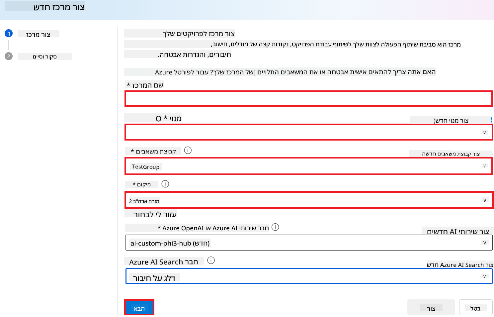

1. בחר **Next**.

#### יצירת פרויקט ב-Azure AI Foundry

1. ב-Hub שיצרת, בחר **All projects** מהטאב בצד שמאל.

1. בחר **+ New project** מתפריט הניווט.

    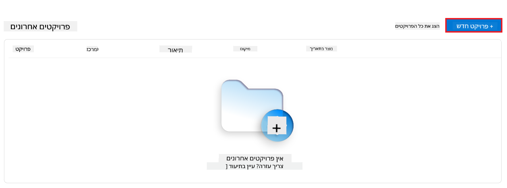

1. הזן **Project name**. חייב להיות ערך ייחודי.

    

1. בחר **Create a project**.

#### הוספת חיבור מותאם אישית למודל ה-Phi-3 / Phi-3.5 המותאם

כדי לשלב את מודל ה-Phi-3 / Phi-3.5 המותאם שלך ב-Prompt flow, עליך לשמור את נקודת הקצה (endpoint) והמפתח של המודל בחיבור מותאם אישית. הגדרה זו מבטיחה גישה למודל המותאם שלך ב-Prompt flow.

#### הגדרת api key ו-endpoint uri של מודל ה-Phi-3 / Phi-3.5 המותאם

1. בקר ב-[Azure ML Studio](https://ml.azure.com/home?wt.mc_id=studentamb_279723).

1. נווט אל סביבת העבודה של Azure Machine learning שיצרת.

1. בחר **Endpoints** מהטאב בצד שמאל.

    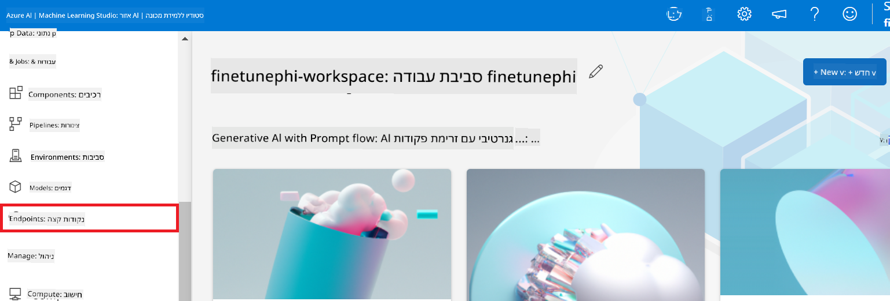

1. בחר את נקודת הקצה שיצרת.

    

1. בחר **Consume** מתפריט הניווט.

1. העתק את **REST endpoint** ואת **Primary key** שלך.

    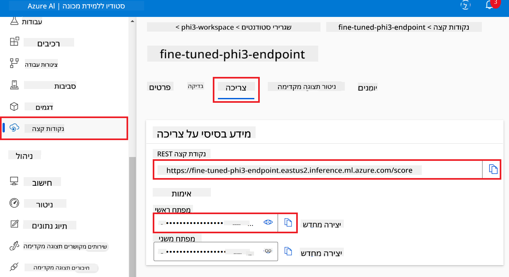

#### הוספת החיבור המותאם

1. בקר ב-[Azure AI Foundry](https://ai.azure.com/?wt.mc_id=studentamb_279723).

1. נווט אל פרויקט Azure AI Foundry שיצרת.

1. בפרויקט שיצרת, בחר **Settings** מהטאב בצד שמאל.

1. בחר **+ New connection**.

    

1. בחר **Custom keys** מתפריט הניווט.

    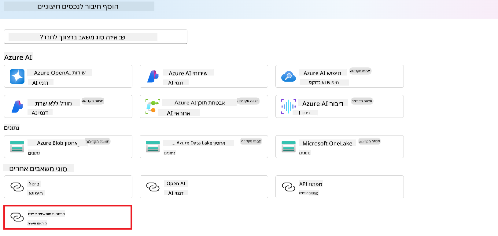

1. בצע את המשימות הבאות:

    - בחר **+ Add key value pairs**.
    - עבור שם המפתח, הזן **endpoint** והדבק את נקודת הקצה שהעתקת מ-Azure ML Studio בשדה הערך.
    - בחר שוב **+ Add key value pairs**.
    - עבור שם המפתח, הזן **key** והדבק את המפתח שהעתקת מ-Azure ML Studio בשדה הערך.
    - לאחר הוספת המפתחות, סמן **is secret** כדי למנוע חשיפת המפתח.

    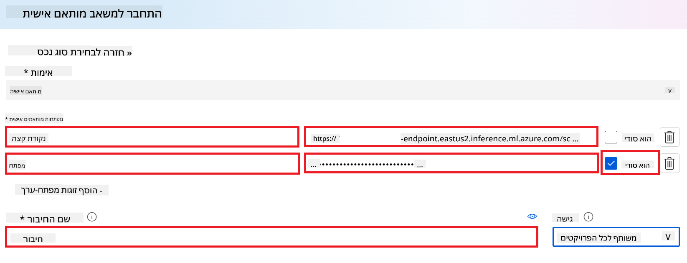

1. בחר **Add connection**.

#### יצירת Prompt flow

הוספת חיבור מותאם אישית ב-Azure AI Foundry. כעת, ניצור Prompt flow באמצעות השלבים הבאים. לאחר מכן, תחבר את ה-Prompt flow לחיבור המותאם כדי להשתמש במודל המותאם בתוך ה-Prompt flow.

1. נווט אל פרויקט Azure AI Foundry שיצרת.

1. בחר **Prompt flow** מהטאב בצד שמאל.

1. בחר **+ Create** מתפריט הניווט.

    

1. בחר **Chat flow** מתפריט הניווט.

    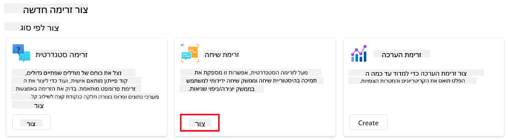

1. הזן **Folder name** לשימוש.

    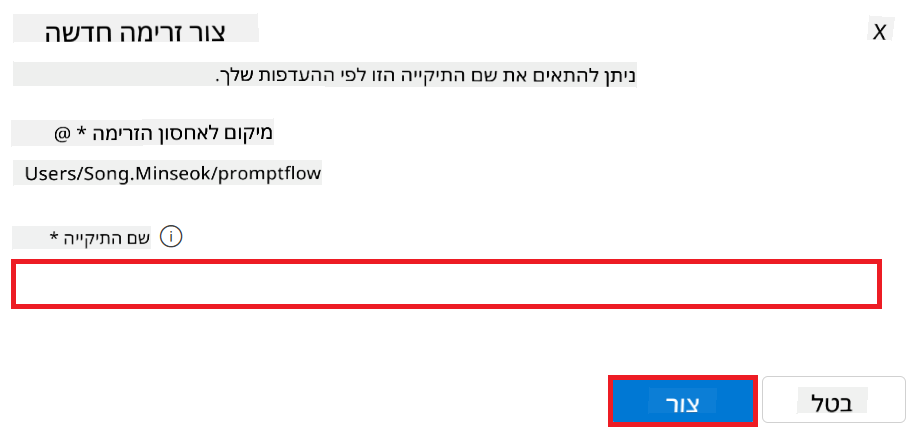

1. בחר **Create**.

#### הגדרת Prompt flow לשיחה עם מודל ה-Phi-3 / Phi-3.5 המותאם שלך

עליך לשלב את מודל ה-Phi-3 / Phi-3.5 המותאם ב-Prompt flow. עם זאת, ה-Prompt flow הקיים אינו מיועד למטרה זו. לכן, עליך לעצב מחדש את ה-Prompt flow כדי לאפשר את השילוב של המודל המותאם.

1. ב-Prompt flow, בצע את המשימות הבאות כדי לבנות מחדש את ה-flow הקיים:

    - בחר **Raw file mode**.
    - מחק את כל הקוד הקיים בקובץ *flow.dag.yml*.
    - הוסף את הקוד הבא ל-*flow.dag.yml*.

        ```yml
        inputs:
          input_data:
            type: string
            default: "Who founded Microsoft?"

        outputs:
          answer:
            type: string
            reference: ${integrate_with_promptflow.output}

        nodes:
        - name: integrate_with_promptflow
          type: python
          source:
            type: code
            path: integrate_with_promptflow.py
          inputs:
            input_data: ${inputs.input_data}
        ```

    - בחר **Save**.

    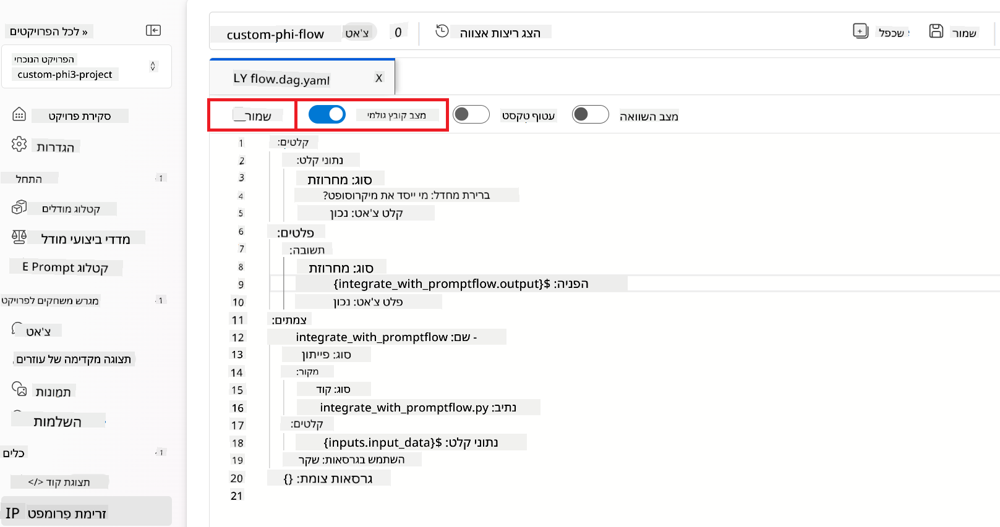

1. הוסף את הקוד הבא ל-*integrate_with_promptflow.py* כדי להשתמש במודל ה-Phi-3 / Phi-3.5 המותאם ב-Prompt flow.

    ```python
    import logging
    import requests
    from promptflow import tool
    from promptflow.connections import CustomConnection

    # Logging setup
    logging.basicConfig(
        format="%(asctime)s - %(levelname)s - %(name)s - %(message)s",
        datefmt="%Y-%m-%d %H:%M:%S",
        level=logging.DEBUG
    )
    logger = logging.getLogger(__name__)

    def query_phi3_model(input_data: str, connection: CustomConnection) -> str:
        """
        Send a request to the Phi-3 / Phi-3.5 model endpoint with the given input data using Custom Connection.
        """

        # "connection" is the name of the Custom Connection, "endpoint", "key" are the keys in the Custom Connection
        endpoint_url = connection.endpoint
        api_key = connection.key

        headers = {
            "Content-Type": "application/json",
            "Authorization": f"Bearer {api_key}"
        }
    data = {
        "input_data": [input_data],
        "params": {
            "temperature": 0.7,
            "max_new_tokens": 128,
            "do_sample": True,
            "return_full_text": True
            }
        }
        try:
            response = requests.post(endpoint_url, json=data, headers=headers)
            response.raise_for_status()
            
            # Log the full JSON response
            logger.debug(f"Full JSON response: {response.json()}")

            result = response.json()["output"]
            logger.info("Successfully received response from Azure ML Endpoint.")
            return result
        except requests.exceptions.RequestException as e:
            logger.error(f"Error querying Azure ML Endpoint: {e}")
            raise

    @tool
    def my_python_tool(input_data: str, connection: CustomConnection) -> str:
        """
        Tool function to process input data and query the Phi-3 / Phi-3.5 model.
        """
        return query_phi3_model(input_data, connection)

    ```

    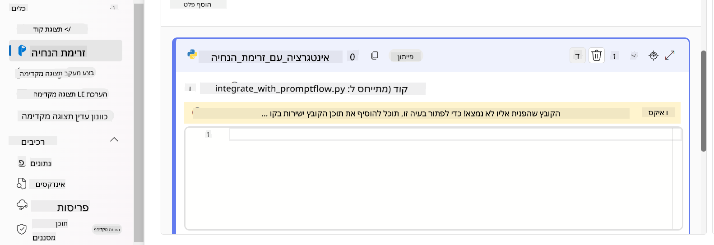

> [!NOTE]
> למידע מפורט יותר על שימוש ב-Prompt flow ב-Azure AI Foundry, ניתן לעיין ב-[Prompt flow ב-Azure AI Foundry](https://learn.microsoft.com/azure/ai-studio/how-to/prompt-flow).

1. בחר **Chat input**, **Chat output** כדי לאפשר שיחה עם המודל שלך.

    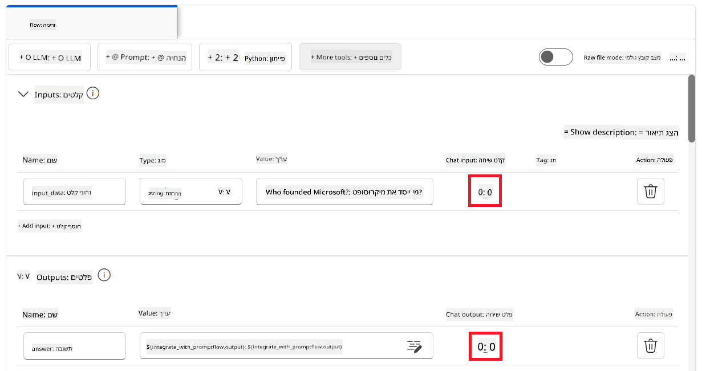

1. כעת אתה מוכן לשוחח עם מודל ה-Phi-3 / Phi-3.5 המותאם שלך. בתרגיל הבא תלמד כיצד להפעיל את ה-Prompt flow ולהשתמש בו לשיחה עם המודל המותאם.

> [!NOTE]
>
> ה-flow המחודש אמור להיראות כמו בתמונה למטה:
>
> 
>

#### הפעלת Prompt flow

1. בחר **Start compute sessions** כדי להפעיל את ה-Prompt flow.

    

1. בחר **Validate and parse input** כדי לעדכן את הפרמטרים.

    

1. בחר את **Value** של ה-**connection** לחיבור המותאם שיצרת. לדוגמה, *connection*.

    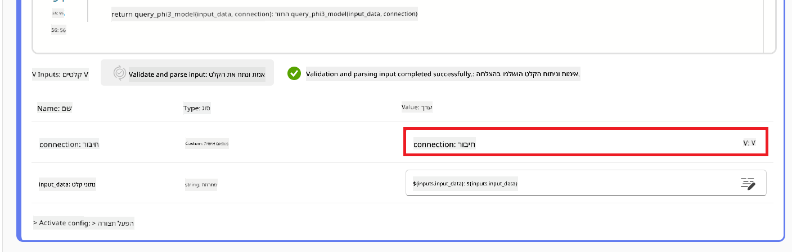

#### שיחה עם מודל ה-Phi-3 / Phi-3.5 המותאם שלך

1. בחר **Chat**.

    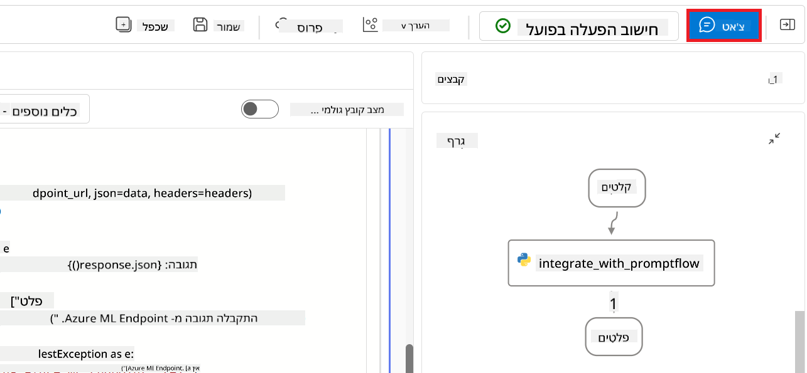

1. הנה דוגמה לתוצאות: כעת תוכל לשוחח עם מודל ה-Phi-3 / Phi-3.5 המותאם שלך. מומלץ לשאול שאלות המבוססות על הנתונים ששימשו לאימון המודל.

    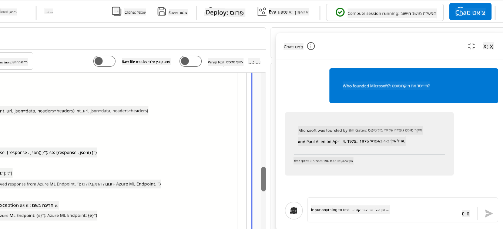

### פריסת Azure OpenAI להערכת מודל ה-Phi-3 / Phi-3.5

כדי להעריך את מודל ה-Phi-3 / Phi-3.5 ב-Azure AI Foundry, עליך לפרוס מודל Azure OpenAI. מודל זה ישמש להערכת ביצועי מודל ה-Phi-3 / Phi-3.5.

#### פריסת Azure OpenAI

1. היכנס ל-[Azure AI Foundry](https://ai.azure.com/?wt.mc_id=studentamb_279723).

1. נווט אל פרויקט Azure AI Foundry שיצרת.

    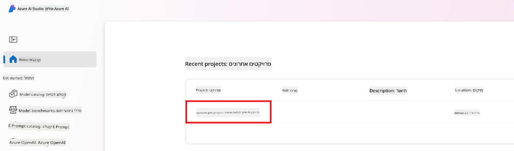

1. בפרויקט שיצרת, בחר **Deployments** מהטאב בצד שמאל.

1. בחר **+ Deploy model** מתפריט הניווט.

1. בחר **Deploy base model**.

    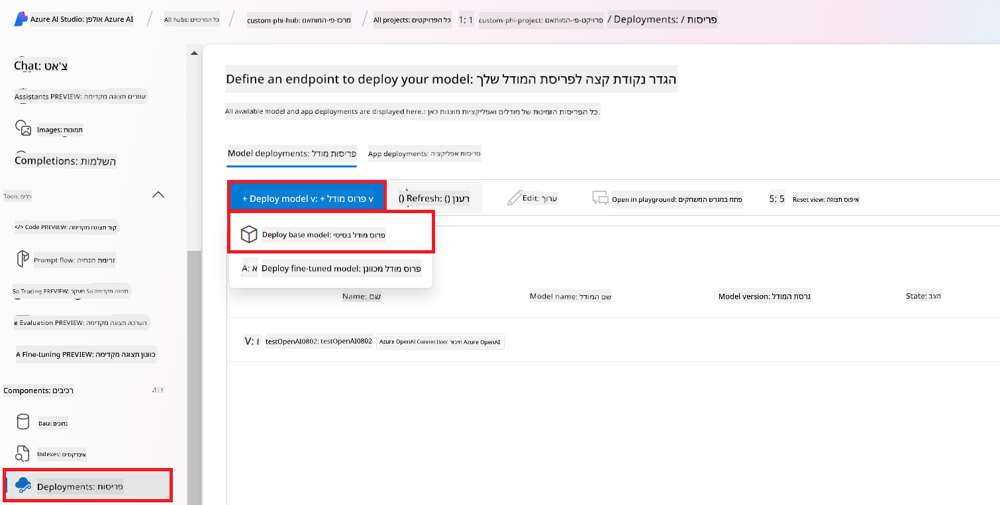

1. בחר את מודל Azure OpenAI שברצונך להשתמש בו. לדוגמה, **gpt-4o**.

    

1. בחר **Confirm**.

### הערכת מודל ה-Phi-3 / Phi-3.5 המותאם באמצעות הערכת Prompt flow של Azure AI Foundry

### התחלת הערכה חדשה

1. בקר ב-[Azure AI Foundry](https://ai.azure.com/?wt.mc_id=studentamb_279723).

1. נווט אל פרויקט Azure AI Foundry שיצרת.

    

1. בפרויקט שיצרת, בחר **Evaluation** מהטאב בצד שמאל.

1. בחר **+ New evaluation** מתפריט הניווט.

    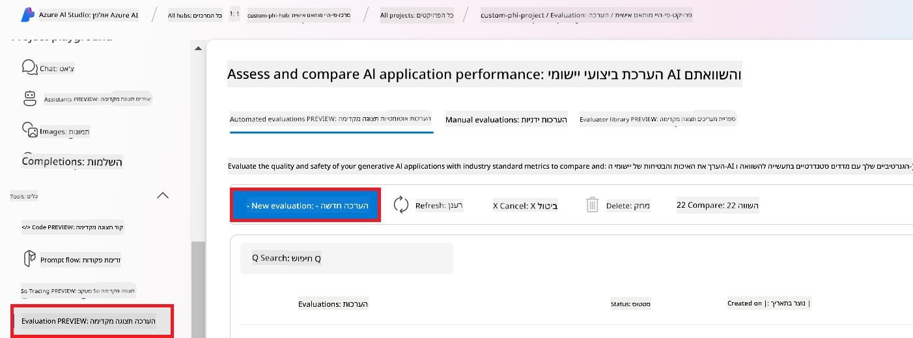

1. בחר בהערכת **Prompt flow**.

    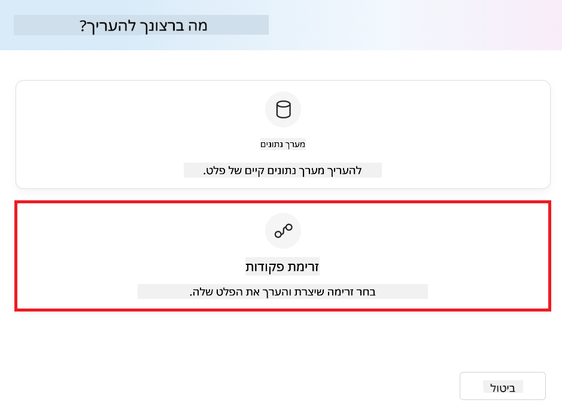

1. בצע את המשימות הבאות:

    - הזן את שם ההערכה. חייב להיות ערך ייחודי.
    - בחר **Question and answer without context** כסוג המשימה. מכיוון שמאגר הנתונים **UlTRACHAT_200k** בו השתמשנו במדריך זה אינו מכיל הקשר.
    - בחר את ה-Prompt flow שברצונך להעריך.

    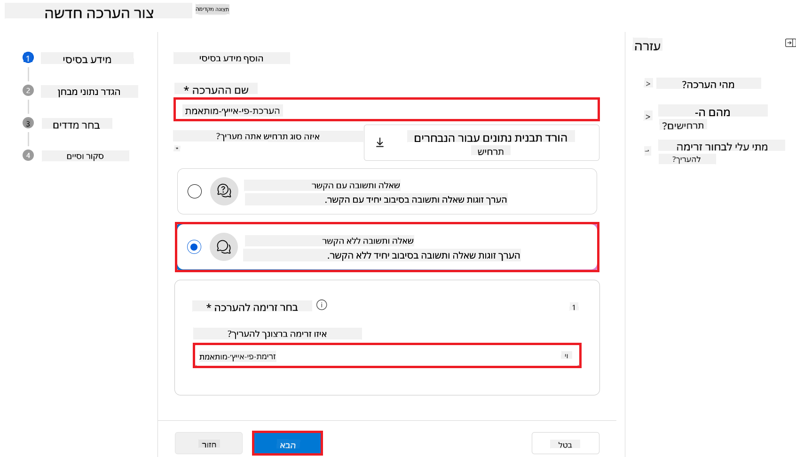

1. בחר **Next**.

1. בצע את המשימות הבאות:

    - בחר **Add your dataset** להעלאת מאגר הנתונים. לדוגמה, תוכל להעלות את קובץ מאגר הנתונים למבחן, כמו *test_data.json1*, הכלול בהורדת מאגר הנתונים **ULTRACHAT_200k**.
    - בחר את **Dataset column** המתאים למאגר הנתונים שלך. לדוגמה, אם אתה משתמש במאגר הנתונים **ULTRACHAT_200k**, בחר **${data.prompt}** כעמודת הנתונים.

    

1. בחר **Next**.

1. בצע את המשימות הבאות להגדרת מדדי ביצועים ואיכות:

    - בחר את מדדי הביצועים והאיכות שברצונך להשתמש בהם.
    - בחר את מודל Azure OpenAI שיצרת להערכת המודל. לדוגמה, בחר **gpt-4o**.

    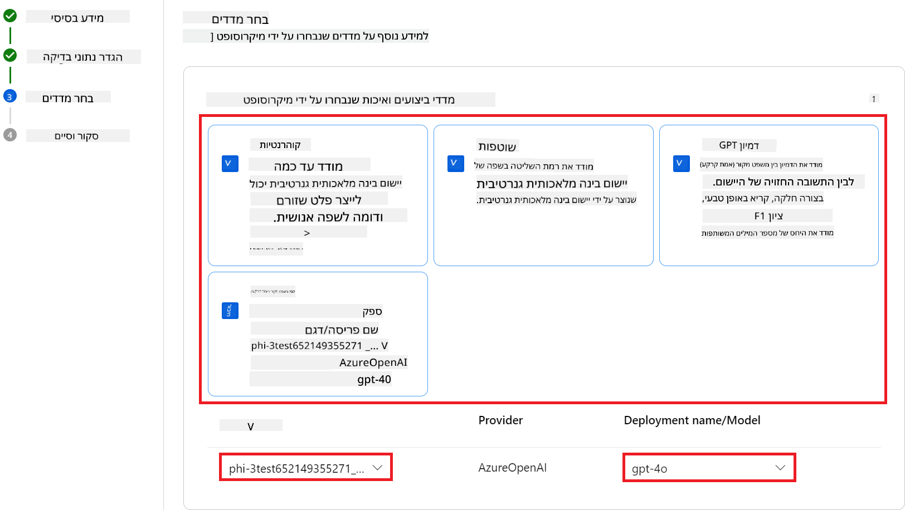

1. בצע את המשימות הבאות להגדרת מדדי סיכון ובטיחות:

    - בחר את מדדי הסיכון והבטיחות שברצונך להשתמש בהם.
    - בחר את הסף לחישוב שיעור הפגמים שברצונך להשתמש בו. לדוגמה, בחר **Medium**.
    - עבור **question**, בחר **Data source** ל-**{$data.prompt}**.
    - עבור **answer**, בחר **Data source** ל-**{$run.outputs.answer}**.
    - עבור **ground_truth**, בחר **Data source** ל-**{$data.message}**.

    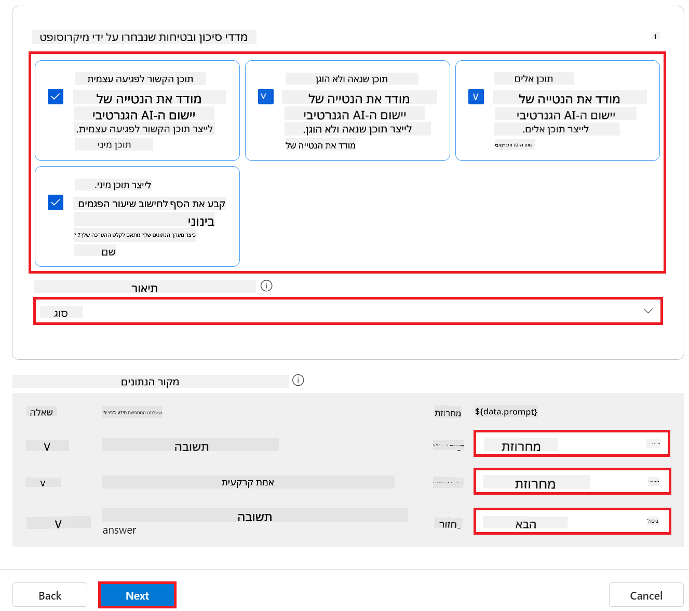

1. בחר **Next**.

1. בחר **Submit** כדי להתחיל את ההערכה.

1. ההערכה תיקח זמן להשלמה. תוכל לעקוב אחר ההתקדמות בטאב **Evaluation**.

### סקירת תוצאות ההערכה
> [!NOTE]
> התוצאות המוצגות למטה נועדו להמחיש את תהליך ההערכה. במדריך זה השתמשנו במודל שעבר כוונון עדין על סט נתונים קטן יחסית, מה שעלול להוביל לתוצאות שאינן מיטביות. התוצאות בפועל עשויות להשתנות משמעותית בהתאם לגודל, איכות ומגוון סט הנתונים שבו משתמשים, וכן בהתאם לקונפיגורציה הספציפית של המודל.
לאחר סיום ההערכה, תוכלו לעיין בתוצאות עבור מדדי הביצועים והבטיחות.

1. מדדי ביצועים ואיכות:

    - הערכת יעילות המודל ביצירת תגובות קוהרנטיות, שוטפות ורלוונטיות.

    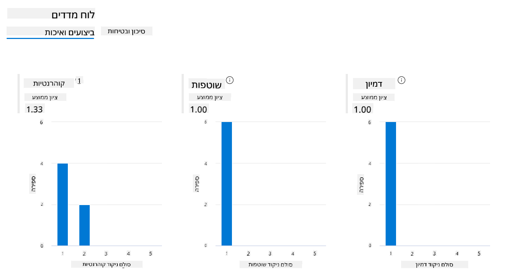

1. מדדי סיכון ובטיחות:

    - ודאו שהתוצרים של המודל בטוחים ותואמים לעקרונות Responsible AI, תוך הימנעות מתוכן מזיק או פוגעני.

    

1. ניתן לגלול למטה כדי לצפות ב**תוצאות מדדים מפורטים**.

    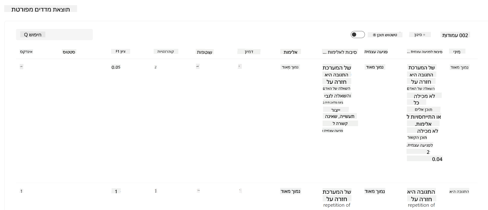

1. על ידי הערכת מודל ה-Phi-3 / Phi-3.5 המותאם אישית שלך מול מדדי ביצועים ובטיחות, תוכל לוודא שהמודל לא רק יעיל, אלא גם עומד בעקרונות Responsible AI, מה שהופך אותו למוכן לפריסה בעולם האמיתי.

## מזל טוב!

### השלמת את המדריך הזה

הערכת בהצלחה את מודל ה-Phi-3 המותאם אישית המשולב עם Prompt flow ב-Azure AI Foundry. זהו שלב חשוב לוודא שמודלי ה-AI שלך לא רק מבצעים היטב, אלא גם עומדים בעקרונות Responsible AI של מיקרוסופט, כדי לעזור לך לבנות יישומי AI אמינים ואחראיים.


## ניקוי משאבי Azure

נקה את משאבי ה-Azure שלך כדי למנוע חיובים נוספים בחשבונך. עבור לפורטל Azure ומחק את המשאבים הבאים:

- משאב Azure Machine learning.
- נקודת הקצה של מודל Azure Machine learning.
- משאב פרויקט Azure AI Foundry.
- משאב Prompt flow של Azure AI Foundry.

### השלבים הבאים

#### תיעוד

- [הערכת מערכות AI באמצעות לוח הבקרה Responsible AI](https://learn.microsoft.com/azure/machine-learning/concept-responsible-ai-dashboard?view=azureml-api-2&source=recommendations?wt.mc_id=studentamb_279723)
- [מדדי הערכה ומעקב ל-AI גנרטיבי](https://learn.microsoft.com/azure/ai-studio/concepts/evaluation-metrics-built-in?tabs=definition?wt.mc_id=studentamb_279723)
- [תיעוד Azure AI Foundry](https://learn.microsoft.com/azure/ai-studio/?wt.mc_id=studentamb_279723)
- [תיעוד Prompt flow](https://microsoft.github.io/promptflow/?wt.mc_id=studentamb_279723)

#### חומרי הדרכה

- [מבוא לגישת Responsible AI של מיקרוסופט](https://learn.microsoft.com/training/modules/introduction-to-microsofts-responsible-ai-approach/?source=recommendations?wt.mc_id=studentamb_279723)
- [מבוא ל-Azure AI Foundry](https://learn.microsoft.com/training/modules/introduction-to-azure-ai-studio/?wt.mc_id=studentamb_279723)

### הפניות

- [מהו Responsible AI?](https://learn.microsoft.com/azure/machine-learning/concept-responsible-ai?view=azureml-api-2?wt.mc_id=studentamb_279723)
- [הכרזה על כלים חדשים ב-Azure AI שיעזרו לך לבנות יישומי AI גנרטיביים בטוחים ואמינים יותר](https://azure.microsoft.com/blog/announcing-new-tools-in-azure-ai-to-help-you-build-more-secure-and-trustworthy-generative-ai-applications/?wt.mc_id=studentamb_279723)
- [הערכת יישומי AI גנרטיביים](https://learn.microsoft.com/azure/ai-studio/concepts/evaluation-approach-gen-ai?wt.mc_id%3Dstudentamb_279723)

**כתב ויתור**:  
מסמך זה תורגם באמצעות שירות תרגום מבוסס בינה מלאכותית [Co-op Translator](https://github.com/Azure/co-op-translator). למרות שאנו שואפים לדיוק, יש לקחת בחשבון כי תרגומים אוטומטיים עלולים להכיל שגיאות או אי-דיוקים. המסמך המקורי בשפת המקור שלו נחשב למקור הסמכותי. למידע קריטי מומלץ להשתמש בתרגום מקצועי על ידי מתרגם אנושי. אנו לא נושאים באחריות לכל אי-הבנה או פרשנות שגויה הנובעת משימוש בתרגום זה.