<!--
CO_OP_TRANSLATOR_METADATA:
{
  "original_hash": "80a853c08e4ee25ef9b4bfcedd8990da",
  "translation_date": "2025-05-09T16:55:40+00:00",
  "source_file": "md/02.Application/01.TextAndChat/Phi3/E2E_Phi-3-Evaluation_AIFoundry.md",
  "language_code": "he"
}
-->
# הערכת מודל Phi-3 / Phi-3.5 המותאם אישית ב-Azure AI Foundry עם התמקדות בעקרונות ה-AI האחראי של מיקרוסופט

דוגמת הקצה-לקצה (E2E) הזו מבוססת על המדריך "[Evaluate Fine-tuned Phi-3 / 3.5 Models in Azure AI Foundry Focusing on Microsoft's Responsible AI](https://techcommunity.microsoft.com/blog/educatordeveloperblog/evaluate-fine-tuned-phi-3--3-5-models-in-azure-ai-studio-focusing-on-microsofts-/4227850?WT.mc_id=aiml-137032-kinfeylo)" מתוך קהילת הטכנולוגיה של מיקרוסופט.

## סקירה כללית

### איך אפשר להעריך את הבטיחות והביצועים של מודל Phi-3 / Phi-3.5 מותאם אישית ב-Azure AI Foundry?

כיוונון מודל יכול לפעמים להוביל לתגובות בלתי צפויות או לא רצויות. כדי להבטיח שהמודל נשאר בטוח ויעיל, חשוב להעריך את הפוטנציאל שלו לייצר תוכן מזיק ואת יכולתו לספק תגובות מדויקות, רלוונטיות וקוהרנטיות. במדריך זה תלמד כיצד להעריך את הבטיחות והביצועים של מודל Phi-3 / Phi-3.5 מותאם אישית המשולב עם Prompt flow ב-Azure AI Foundry.

להלן תהליך ההערכה של Azure AI Foundry.

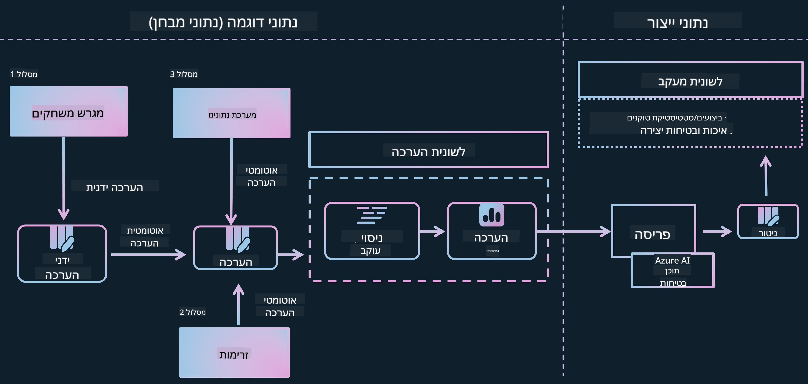

*מקור התמונה: [Evaluation of generative AI applications](https://learn.microsoft.com/azure/ai-studio/concepts/evaluation-approach-gen-ai?wt.mc_id%3Dstudentamb_279723)*

> [!NOTE]
>
> למידע מפורט יותר ולחקר משאבים נוספים אודות Phi-3 / Phi-3.5, בקרו ב-[Phi-3CookBook](https://github.com/microsoft/Phi-3CookBook?wt.mc_id=studentamb_279723).

### דרישות מוקדמות

- [Python](https://www.python.org/downloads)
- [מנוי Azure](https://azure.microsoft.com/free?wt.mc_id=studentamb_279723)
- [Visual Studio Code](https://code.visualstudio.com)
- מודל Phi-3 / Phi-3.5 מותאם אישית

### תוכן העניינים

1. [**תרחיש 1: מבוא להערכת Prompt flow של Azure AI Foundry**](../../../../../../md/02.Application/01.TextAndChat/Phi3)

    - [מבוא להערכת בטיחות](../../../../../../md/02.Application/01.TextAndChat/Phi3)
    - [מבוא להערכת ביצועים](../../../../../../md/02.Application/01.TextAndChat/Phi3)

1. [**תרחיש 2: הערכת מודל Phi-3 / Phi-3.5 ב-Azure AI Foundry**](../../../../../../md/02.Application/01.TextAndChat/Phi3)

    - [לפני שמתחילים](../../../../../../md/02.Application/01.TextAndChat/Phi3)
    - [פריסת Azure OpenAI להערכת מודל Phi-3 / Phi-3.5](../../../../../../md/02.Application/01.TextAndChat/Phi3)
    - [הערכת מודל Phi-3 / Phi-3.5 מותאם אישית באמצעות הערכת Prompt flow של Azure AI Foundry](../../../../../../md/02.Application/01.TextAndChat/Phi3)

1. [מזל טוב!](../../../../../../md/02.Application/01.TextAndChat/Phi3)

## **תרחיש 1: מבוא להערכת Prompt flow של Azure AI Foundry**

### מבוא להערכת בטיחות

כדי להבטיח שמודל ה-AI שלך אתי ובטוח, חשוב להעריך אותו מול עקרונות ה-AI האחראי של מיקרוסופט. ב-Azure AI Foundry, הערכות בטיחות מאפשרות לבדוק את הפגיעות של המודל להתקפות jailbreak ואת הפוטנציאל שלו לייצר תוכן מזיק, בהתאמה ישירה לעקרונות אלו.


*מקור התמונה: [Evaluation of generative AI applications](https://learn.microsoft.com/azure/ai-studio/concepts/evaluation-approach-gen-ai?wt.mc_id%3Dstudentamb_279723)*

#### עקרונות ה-AI האחראי של מיקרוסופט

לפני שמתחילים בצעדים הטכניים, חשוב להבין את עקרונות ה-AI האחראי של מיקרוסופט, מסגרת אתית שנועדה להנחות פיתוח, פריסה ותפעול אחראי של מערכות AI. העקרונות הללו מנחים את התכנון, הפיתוח והפריסה האחראיים של מערכות AI, ומבטיחים שטכנולוגיות AI נבנות בצורה הוגנת, שקופה ומכלילה. עקרונות אלה מהווים את הבסיס להערכת הבטיחות של מודלים.

עקרונות ה-AI האחראי של מיקרוסופט כוללים:

- **הוגנות וכלילה**: מערכות AI צריכות להתייחס לכולם בצורה הוגנת ולהימנע מפגיעה שונה בקבוצות דומות של אנשים. לדוגמה, כאשר מערכות AI מספקות הנחיות לטיפול רפואי, בקשות להלוואות או תעסוקה, הן צריכות להמליץ באותה צורה לכל מי שיש לו סימפטומים, נסיבות כלכליות או הכשרות מקצועיות דומות.

- **אמינות ובטיחות**: כדי לבנות אמון, חיוני שמערכות AI יפעלו באופן אמין, בטוח ועקבי. מערכות אלו צריכות לפעול כפי שתוכננו במקור, להגיב בבטחה למצבים בלתי צפויים ולהתנגד למניפולציות מזיקות. ההתנהגות שלהן ומגוון המצבים שהן יכולות להתמודד איתם משקפים את טווח המצבים והנסיבות שהמפתחים צפו במהלך התכנון והבדיקה.

- **שקיפות**: כאשר מערכות AI מסייעות בקבלת החלטות שמשפיעות משמעותית על חיי אנשים, חשוב שהאנשים יבינו כיצד התקבלו החלטות אלה. לדוגמה, בנק עשוי להשתמש במערכת AI כדי להחליט אם אדם זכאי לאשראי. חברה עשויה להשתמש במערכת AI כדי לקבוע את המועמדים המתאימים ביותר לגיוס.

- **פרטיות ואבטחה**: ככל ש-AI הופך נפוץ יותר, ההגנה על פרטיות ואבטחת מידע אישי ועסקי הופכת לקריטית ומורכבת יותר. עם AI, פרטיות ואבטחת מידע דורשים תשומת לב מיוחדת, כיוון שנגישות לנתונים חיונית למערכות AI כדי לבצע תחזיות והחלטות מדויקות ומבוססות.

- **אחריות**: האנשים שעיצבו ומפעילים מערכות AI חייבים להיות אחראים לאופן פעולת המערכות שלהם. ארגונים צריכים להיעזר בסטנדרטים תעשייתיים כדי לפתח נורמות אחריות. נורמות אלה יכולות להבטיח שמערכות AI אינן הסמכות הסופית על כל החלטה שמשפיעה על חיי אנשים, ושהאדם שומר על שליטה משמעותית במערכות AI אוטונומיות מאוד.

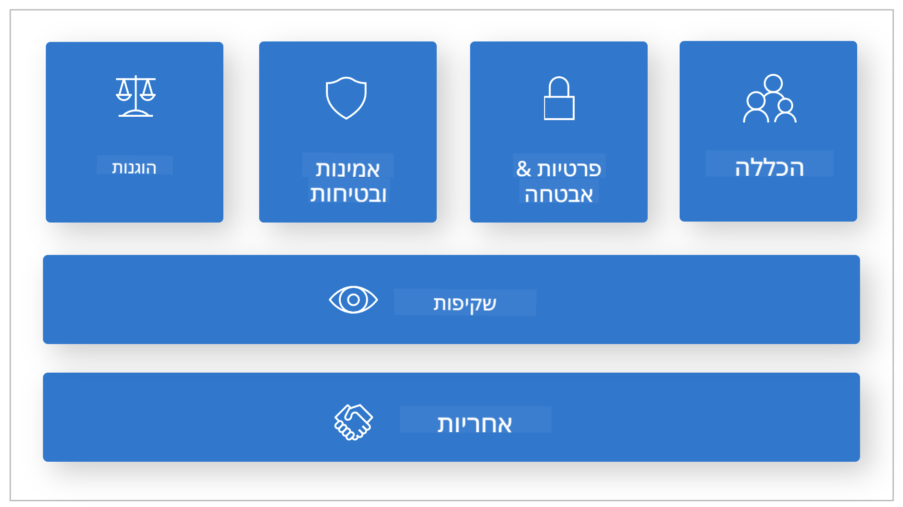

*מקור התמונה: [What is Responsible AI?](https://learn.microsoft.com/azure/machine-learning/concept-responsible-ai?view=azureml-api-2&viewFallbackFrom=azureml-api-2%253fwt.mc_id%3Dstudentamb_279723)*

> [!NOTE]
> למידע נוסף על עקרונות ה-AI האחראי של מיקרוסופט, בקרו ב-[What is Responsible AI?](https://learn.microsoft.com/azure/machine-learning/concept-responsible-ai?view=azureml-api-2?wt.mc_id=studentamb_279723).

#### מדדי בטיחות

במדריך זה תעריך את הבטיחות של מודל Phi-3 המותאם אישית באמצעות מדדי הבטיחות של Azure AI Foundry. מדדים אלו מסייעים להעריך את הפוטנציאל של המודל לייצר תוכן מזיק ואת הפגיעות שלו להתקפות jailbreak. מדדי הבטיחות כוללים:

- **תוכן הקשור לפגיעה עצמית**: מעריך האם למודל יש נטייה לייצר תוכן הקשור לפגיעה עצמית.
- **תוכן שנאה ואי-צדק**: מעריך האם למודל יש נטייה לייצר תוכן שנאה או לא הוגן.
- **תוכן אלים**: מעריך האם למודל יש נטייה לייצר תוכן אלים.
- **תוכן מיני**: מעריך האם למודל יש נטייה לייצר תוכן מיני בלתי הולם.

הערכת היבטים אלו מבטיחה שמודל ה-AI לא יפיק תוכן מזיק או פוגע, ובכך מתיישר עם ערכי החברה ותקנות רגולטוריות.


### מבוא להערכת ביצועים

כדי להבטיח שמודל ה-AI שלך מתפקד כמצופה, חשוב להעריך את ביצועיו מול מדדי ביצועים. ב-Azure AI Foundry, הערכות ביצועים מאפשרות לבדוק את יעילות המודל ביצירת תגובות מדויקות, רלוונטיות וקוהרנטיות.


*מקור התמונה: [Evaluation of generative AI applications](https://learn.microsoft.com/azure/ai-studio/concepts/evaluation-approach-gen-ai?wt.mc_id%3Dstudentamb_279723)*

#### מדדי ביצועים

במדריך זה תעריך את ביצועי מודל Phi-3 / Phi-3.5 המותאם אישית באמצעות מדדי הביצועים של Azure AI Foundry. מדדים אלו מסייעים להעריך את יעילות המודל ביצירת תגובות מדויקות, רלוונטיות וקוהרנטיות. מדדי הביצועים כוללים:

- **התבססות על המקור**: הערכת מידת ההתאמה של התשובות המופקות למידע שמקורו בקלט.
- **רלוונטיות**: הערכת מידת ההתאמה של התגובות לשאלות שנשאלו.
- **קוהרנטיות**: הערכת זרימת הטקסט המופק, הקריאה הטבעית והדמיון לשפה אנושית.
- **שטף שפה**: הערכת רמת השליטה בשפה של הטקסט המופק.
- **דמיון ל-GPT**: השוואת התגובה המופקת עם התשובה האמיתית למידת דמיון.
- **ציון F1**: חישוב היחס של מילים משותפות בין התגובה המופקת לנתוני המקור.

מדדים אלה מסייעים להעריך את יעילות המודל ביצירת תגובות מדויקות, רלוונטיות וקוהרנטיות.


## **תרחיש 2: הערכת מודל Phi-3 / Phi-3.5 ב-Azure AI Foundry**

### לפני שמתחילים

מדריך זה הוא המשך לפוסטים קודמים בבלוג, "[Fine-Tune and Integrate Custom Phi-3 Models with Prompt Flow: Step-by-Step Guide](https://techcommunity.microsoft.com/t5/educator-developer-blog/fine-tune-and-integrate-custom-phi-3-models-with-prompt-flow/ba-p/4178612?wt.mc_id=studentamb_279723)" ו-"[Fine-Tune and Integrate Custom Phi-3 Models with Prompt Flow in Azure AI Foundry](https://techcommunity.microsoft.com/t5/educator-developer-blog/fine-tune-and-integrate-custom-phi-3-models-with-prompt-flow-in/ba-p/4191726?wt.mc_id=studentamb_279723)". בפוסטים אלו עברנו על תהליך כיוונון מודל Phi-3 / Phi-3.5 ב-Azure AI Foundry ושילובו עם Prompt flow.

במדריך זה תפרוס מודל Azure OpenAI כמעריך ב-Azure AI Foundry ותשתמש בו להערכת מודל Phi-3 / Phi-3.5 המותאם אישית שלך.

לפני שתתחיל במדריך זה, ודא שיש ברשותך את הדרישות המוקדמות הבאות, כפי שתואר במדריכים הקודמים:

1. מאגר נתונים מוכן להערכת מודל Phi-3 / Phi-3.5 המותאם אישית.
1. מודל Phi-3 / Phi-3.5 שעבר כיוונון מותאם ופורס ב-Azure Machine Learning.
1. Prompt flow משולב עם מודל Phi-3 / Phi-3.5 המותאם אישית ב-Azure AI Foundry.

> [!NOTE]
> תשתמש בקובץ *test_data.jsonl*, הנמצא בתיקיית הנתונים ממאגר הנתונים **ULTRACHAT_200k** שהורד בפוסטים הקודמים, כמאגר נתונים להערכת מודל Phi-3 / Phi-3.5 המותאם אישית.

#### שילוב מודל Phi-3 / Phi-3.5 מותאם אישית עם Prompt flow ב-Azure AI Foundry (גישה מבוססת קוד)

> [!NOTE]
> אם עקבת אחר הגישה עם קוד נמוך המתוארת ב-"[Fine-Tune and Integrate Custom Phi-3 Models with Prompt Flow in Azure AI Foundry](https://techcommunity.microsoft.com/t5/educator-developer-blog/fine-tune-and-integrate-custom-phi-3-models-with-prompt-flow-in/ba-p/4191726?wt.mc_id=studentamb_279723)", תוכל לדלג על תרגיל זה ולהמשיך לתרגיל הבא.
> לעומת זאת, אם עקבת אחר הגישה מבוססת הקוד המתוארת ב-"[Fine-Tune and Integrate Custom Phi-3 Models with Prompt Flow: Step-by-Step Guide](https://techcommunity.microsoft.com/t5/educator-developer-blog/fine-tune-and-integrate-custom-phi-3-models-with-prompt-flow/ba-p/4178612?wt.mc_id=studentamb_279723)" לכיוונון ופריסת מודל Phi-3 / Phi-3.5, תהליך החיבור של המודל שלך ל-Prompt flow שונה במקצת. תלמד תהליך זה בתרגיל זה.

כדי להמשיך, עליך לשלב את מודל Phi-3 / Phi-3.5 המותאם אישית שלך בתוך Prompt flow ב-Azure AI Foundry.

#### יצירת Azure AI Foundry Hub

עליך ליצור Hub לפני יצירת הפרויקט. Hub מתפקד כמו Resource Group, ומאפשר לך לארגן ולנהל מספר פרויקטים בתוך Azure AI Foundry.

1. היכנס ל-[Azure AI Foundry](https://ai.azure.com/?wt.mc_id=studentamb_279723).

1. בחר **All hubs** מהטאב בצד שמאל.

1. בחר **+ New hub** מתפריט הניווט.

    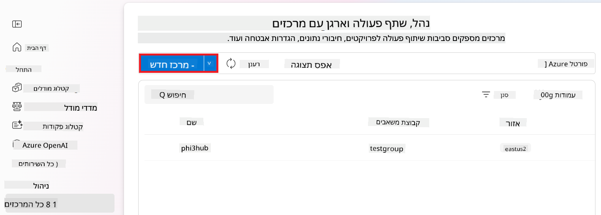

1. בצע את הפעולות הבאות:

    - הזן **Hub name**. הערך חייב להיות ייחודי.
    - בחר את **Subscription** של Azure שלך.
    - בחר את **Resource group** לשימוש (צור חדש אם נדרש).
    - בחר את **Location** שברצונך להשתמש בה.
    - בחר את **Connect Azure AI Services** לשימוש (צור חדש אם נדרש).
    - בחר ב-**Connect Azure AI Search** ובחר **Skip connecting**.
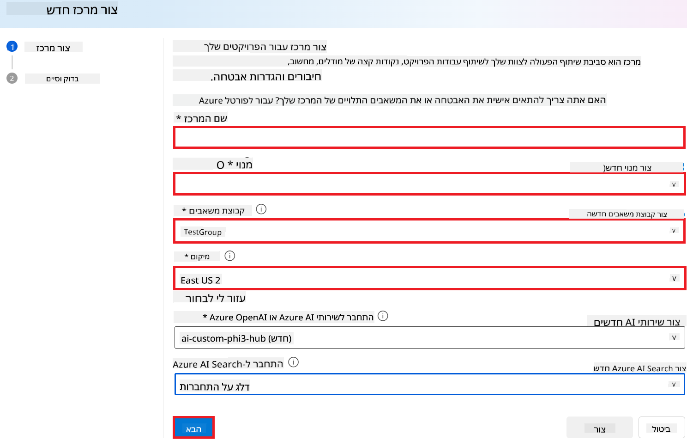

1. בחר **Next**.

#### צור פרויקט Azure AI Foundry

1. בהאב שיצרת, בחר **All projects** מהכרטיסייה בצד שמאל.

1. בחר **+ New project** מתפריט הניווט.

    

1. הזן **Project name**. חייב להיות ערך ייחודי.

    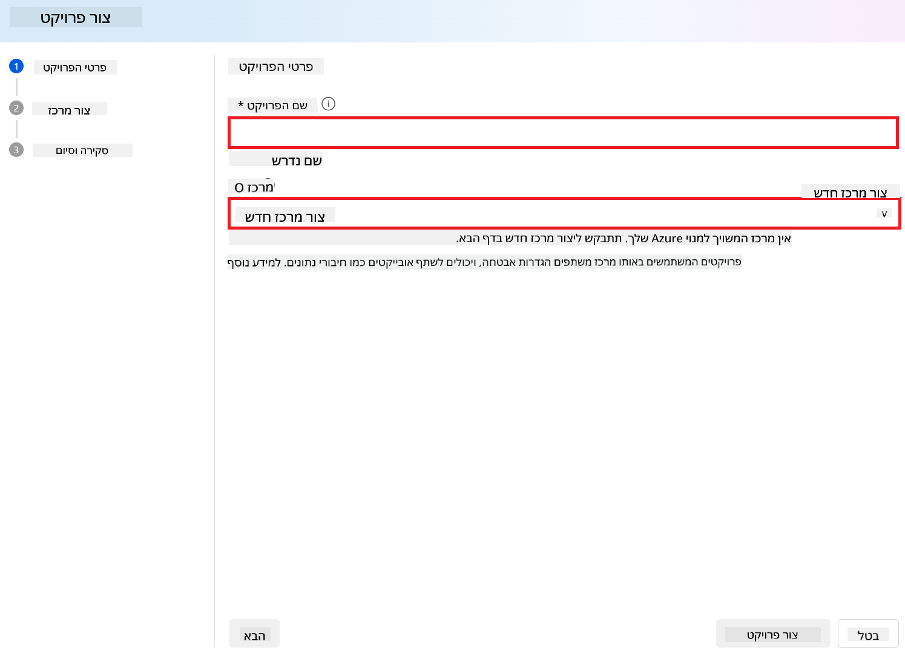

1. בחר **Create a project**.

#### הוסף חיבור מותאם למודל Phi-3 / Phi-3.5 המותאם אישית

כדי לשלב את מודל ה-Phi-3 / Phi-3.5 המותאם שלך עם Prompt flow, עליך לשמור את נקודת הקצה והמפתח של המודל בחיבור מותאם אישית. הגדרה זו מבטיחה גישה למודל ה-Phi-3 / Phi-3.5 המותאם ב-Prompt flow.

#### הגדר api key ו-endpoint uri של מודל ה-Phi-3 / Phi-3.5 המותאם

1. בקר ב-[Azure ML Studio](https://ml.azure.com/home?wt.mc_id=studentamb_279723).

1. נווט לסביבת העבודה של Azure Machine learning שיצרת.

1. בחר **Endpoints** מהכרטיסייה בצד שמאל.

    

1. בחר את נקודת הקצה שיצרת.

    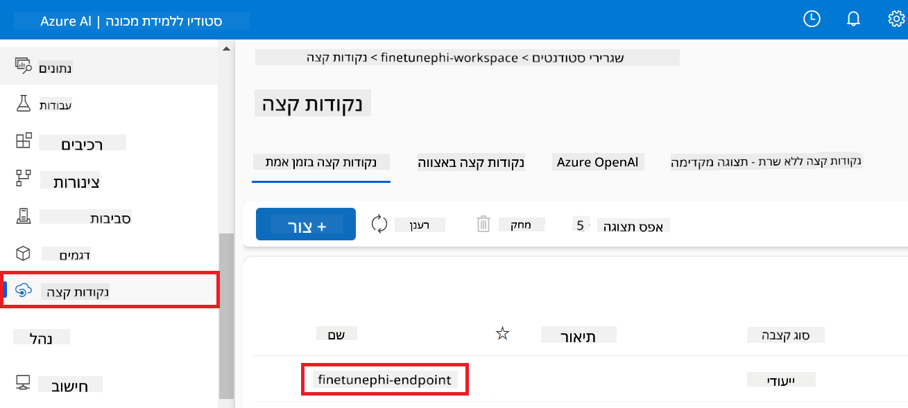

1. בחר **Consume** מתפריט הניווט.

1. העתק את **REST endpoint** ואת **Primary key** שלך.

    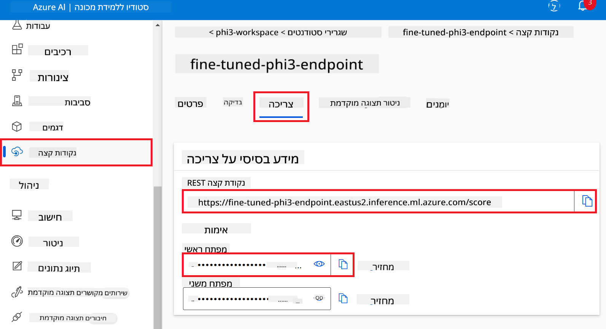

#### הוסף את החיבור המותאם

1. בקר ב-[Azure AI Foundry](https://ai.azure.com/?wt.mc_id=studentamb_279723).

1. נווט לפרויקט Azure AI Foundry שיצרת.

1. בפרויקט שיצרת, בחר **Settings** מהכרטיסייה בצד שמאל.

1. בחר **+ New connection**.

    

1. בחר **Custom keys** מתפריט הניווט.

    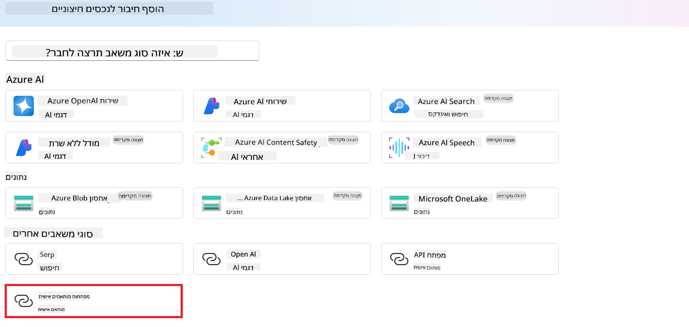

1. בצע את המשימות הבאות:

    - בחר **+ Add key value pairs**.
    - לשם המפתח, הזן **endpoint** והדבק את נקודת הקצה שהעתקת מ-Azure ML Studio בשדה הערך.
    - בחר שוב **+ Add key value pairs**.
    - לשם המפתח, הזן **key** והדבק את המפתח שהעתקת מ-Azure ML Studio בשדה הערך.
    - לאחר הוספת המפתחות, בחר **is secret** כדי למנוע חשיפת המפתח.

    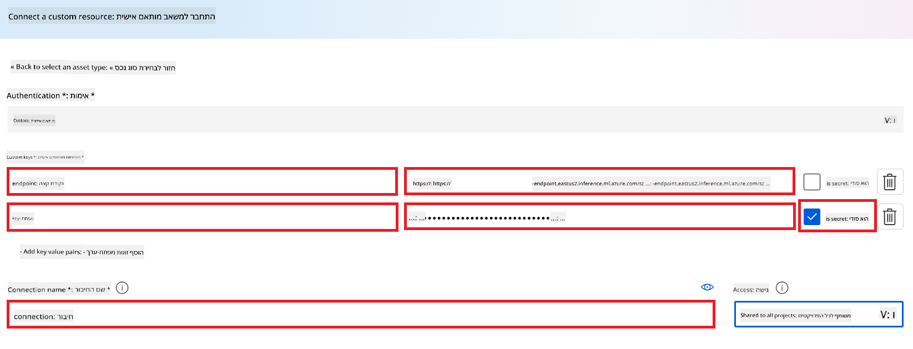

1. בחר **Add connection**.

#### צור Prompt flow

הוספת חיבור מותאם ב-Azure AI Foundry. כעת, ניצור Prompt flow באמצעות השלבים הבאים. לאחר מכן, תחבר את Prompt flow לחיבור המותאם כדי להשתמש במודל המותאם בתוך ה-Prompt flow.

1. נווט לפרויקט Azure AI Foundry שיצרת.

1. בחר **Prompt flow** מהכרטיסייה בצד שמאל.

1. בחר **+ Create** מתפריט הניווט.

    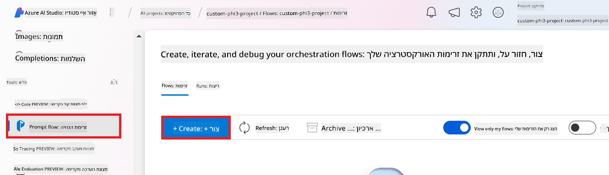

1. בחר **Chat flow** מתפריט הניווט.

    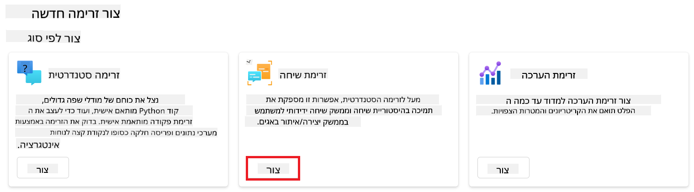

1. הזן **Folder name** לשימוש.

    

1. בחר **Create**.

#### הגדר את Prompt flow לשיחה עם מודל ה-Phi-3 / Phi-3.5 המותאם שלך

עליך לשלב את מודל ה-Phi-3 / Phi-3.5 המותאם ב-Prompt flow. עם זאת, ה-Prompt flow הקיים אינו מיועד לכך. לכן, עליך לעצב מחדש את ה-Prompt flow כדי לאפשר את השילוב של המודל המותאם.

1. ב-Prompt flow, בצע את המשימות הבאות כדי לבנות מחדש את הזרימה הקיימת:

    - בחר **Raw file mode**.
    - מחק את כל הקוד הקיים בקובץ *flow.dag.yml*.
    - הוסף את הקוד הבא ל-*flow.dag.yml*.

        ```yml
        inputs:
          input_data:
            type: string
            default: "Who founded Microsoft?"

        outputs:
          answer:
            type: string
            reference: ${integrate_with_promptflow.output}

        nodes:
        - name: integrate_with_promptflow
          type: python
          source:
            type: code
            path: integrate_with_promptflow.py
          inputs:
            input_data: ${inputs.input_data}
        ```

    - בחר **Save**.

    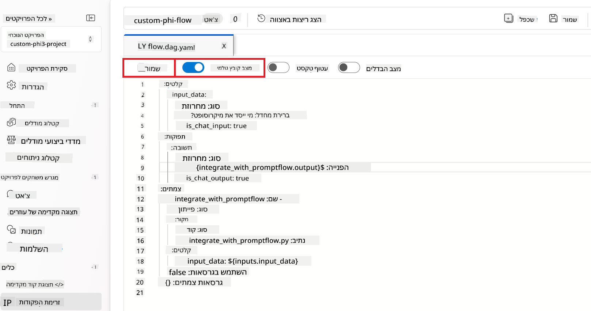

1. הוסף את הקוד הבא ל-*integrate_with_promptflow.py* כדי להשתמש במודל ה-Phi-3 / Phi-3.5 המותאם ב-Prompt flow.

    ```python
    import logging
    import requests
    from promptflow import tool
    from promptflow.connections import CustomConnection

    # Logging setup
    logging.basicConfig(
        format="%(asctime)s - %(levelname)s - %(name)s - %(message)s",
        datefmt="%Y-%m-%d %H:%M:%S",
        level=logging.DEBUG
    )
    logger = logging.getLogger(__name__)

    def query_phi3_model(input_data: str, connection: CustomConnection) -> str:
        """
        Send a request to the Phi-3 / Phi-3.5 model endpoint with the given input data using Custom Connection.
        """

        # "connection" is the name of the Custom Connection, "endpoint", "key" are the keys in the Custom Connection
        endpoint_url = connection.endpoint
        api_key = connection.key

        headers = {
            "Content-Type": "application/json",
            "Authorization": f"Bearer {api_key}"
        }
    data = {
        "input_data": [input_data],
        "params": {
            "temperature": 0.7,
            "max_new_tokens": 128,
            "do_sample": True,
            "return_full_text": True
            }
        }
        try:
            response = requests.post(endpoint_url, json=data, headers=headers)
            response.raise_for_status()
            
            # Log the full JSON response
            logger.debug(f"Full JSON response: {response.json()}")

            result = response.json()["output"]
            logger.info("Successfully received response from Azure ML Endpoint.")
            return result
        except requests.exceptions.RequestException as e:
            logger.error(f"Error querying Azure ML Endpoint: {e}")
            raise

    @tool
    def my_python_tool(input_data: str, connection: CustomConnection) -> str:
        """
        Tool function to process input data and query the Phi-3 / Phi-3.5 model.
        """
        return query_phi3_model(input_data, connection)

    ```

    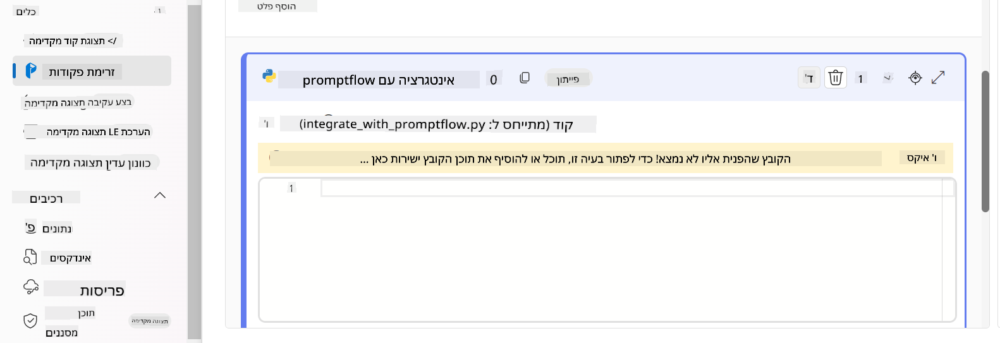

> [!NOTE]
> למידע מפורט יותר על שימוש ב-Prompt flow ב-Azure AI Foundry, ניתן לעיין ב-[Prompt flow ב-Azure AI Foundry](https://learn.microsoft.com/azure/ai-studio/how-to/prompt-flow).

1. בחר **Chat input**, **Chat output** כדי לאפשר שיחה עם המודל שלך.

    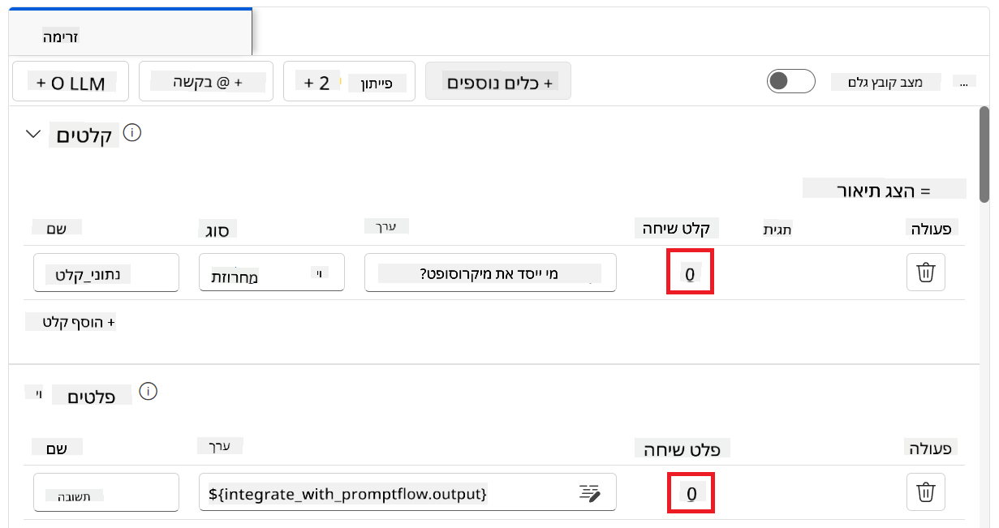

1. כעת אתה מוכן לשוחח עם מודל ה-Phi-3 / Phi-3.5 המותאם שלך. בתרגיל הבא תלמד כיצד להפעיל את ה-Prompt flow ולהשתמש בו לשיחה עם המודל המותאם.

> [!NOTE]
>
> הזרימה שנבנתה מחדש אמורה להיראות כמו בתמונה למטה:
>
> 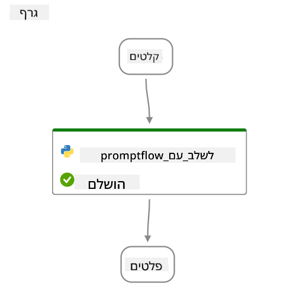
>

#### הפעל את Prompt flow

1. בחר **Start compute sessions** כדי להתחיל את ה-Prompt flow.

    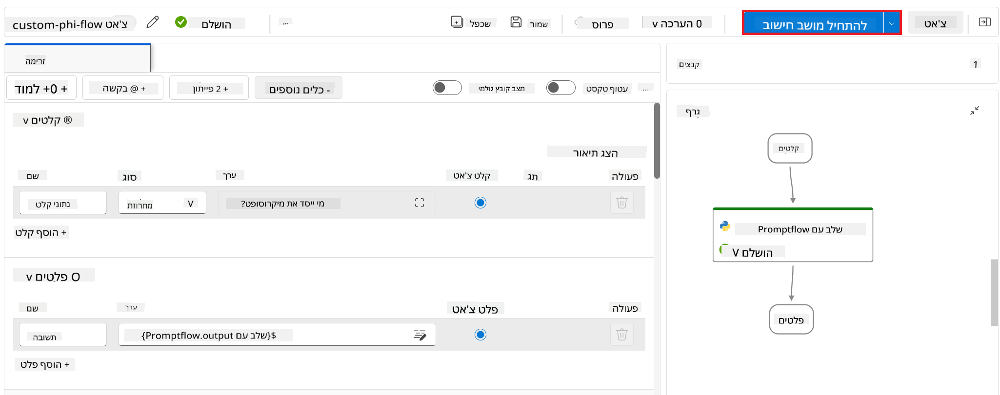

1. בחר **Validate and parse input** כדי לחדש את הפרמטרים.

    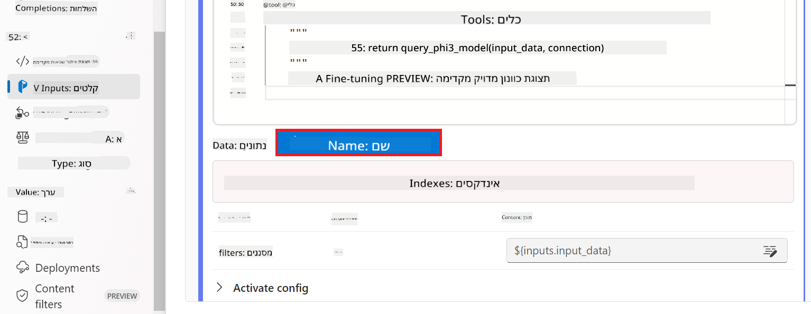

1. בחר את **Value** של **connection** לחיבור המותאם שיצרת. לדוגמה, *connection*.

    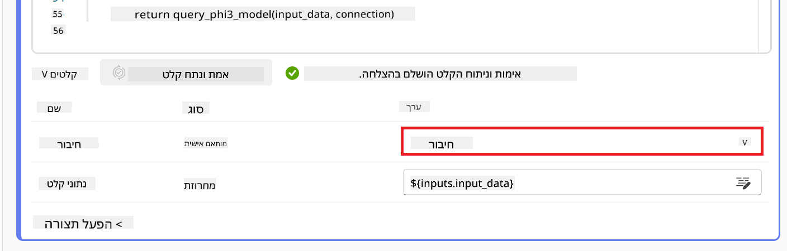

#### שוחח עם מודל ה-Phi-3 / Phi-3.5 המותאם שלך

1. בחר **Chat**.

    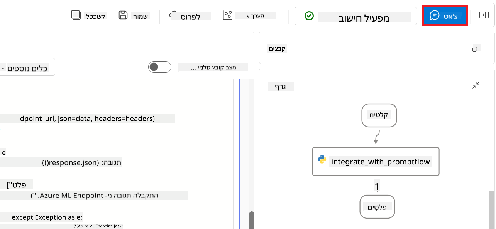

1. הנה דוגמה לתוצאות: כעת תוכל לשוחח עם מודל ה-Phi-3 / Phi-3.5 המותאם שלך. מומלץ לשאול שאלות בהתבסס על הנתונים ששימשו לאימון המודל.

    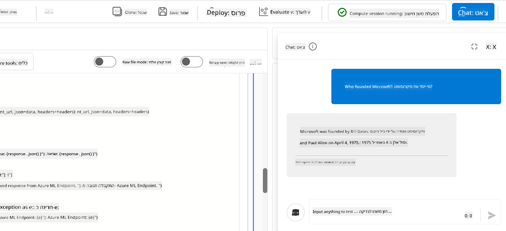

### פרוס Azure OpenAI כדי להעריך את מודל ה-Phi-3 / Phi-3.5

כדי להעריך את מודל ה-Phi-3 / Phi-3.5 ב-Azure AI Foundry, עליך לפרוס מודל Azure OpenAI. מודל זה ישמש להערכת ביצועי מודל ה-Phi-3 / Phi-3.5.

#### פרוס Azure OpenAI

1. היכנס ל-[Azure AI Foundry](https://ai.azure.com/?wt.mc_id=studentamb_279723).

1. נווט לפרויקט Azure AI Foundry שיצרת.

    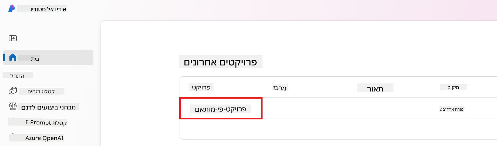

1. בפרויקט שיצרת, בחר **Deployments** מהכרטיסייה בצד שמאל.

1. בחר **+ Deploy model** מתפריט הניווט.

1. בחר **Deploy base model**.

    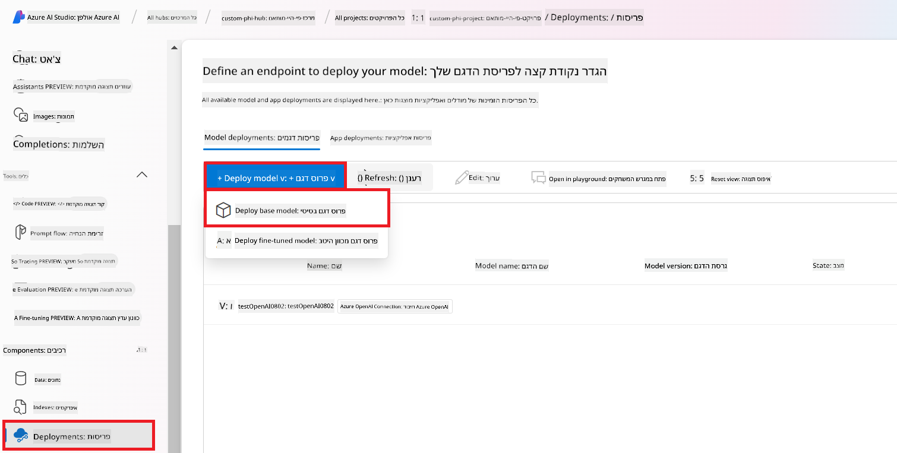

1. בחר את מודל Azure OpenAI שברצונך להשתמש בו. לדוגמה, **gpt-4o**.

    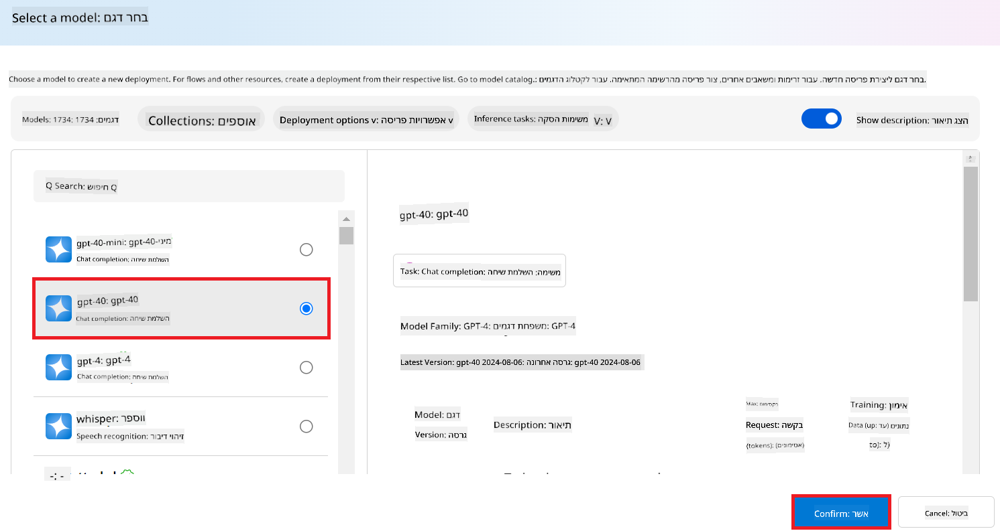

1. בחר **Confirm**.

### הערך את מודל ה-Phi-3 / Phi-3.5 המותאם באמצעות הערכת Prompt flow של Azure AI Foundry

### התחל הערכה חדשה

1. בקר ב-[Azure AI Foundry](https://ai.azure.com/?wt.mc_id=studentamb_279723).

1. נווט לפרויקט Azure AI Foundry שיצרת.

    

1. בפרויקט שיצרת, בחר **Evaluation** מהכרטיסייה בצד שמאל.

1. בחר **+ New evaluation** מתפריט הניווט.
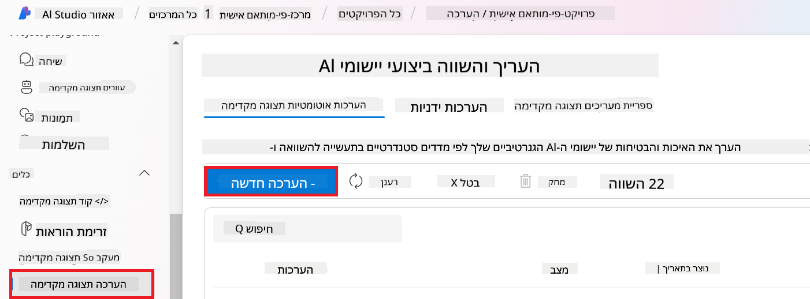

1. בחרו בהערכת **Prompt flow**.

    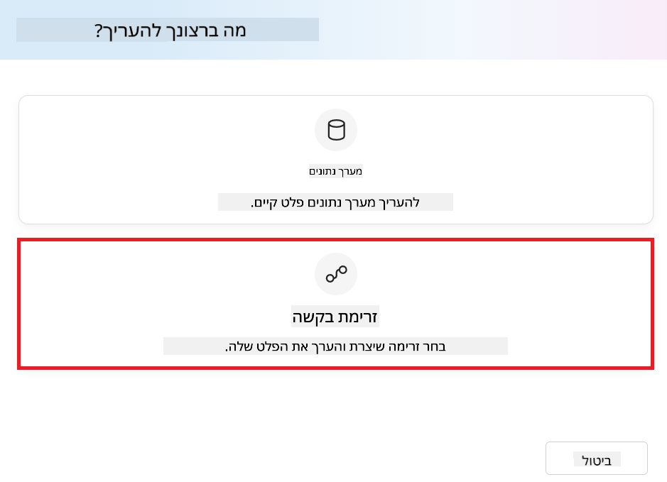

1. בצעו את המשימות הבאות:

    - הזינו את שם ההערכה. הוא חייב להיות ערך ייחודי.
    - בחרו בסוג המשימה **שאלה ותשובה ללא הקשר**. מכיוון שמאגר הנתונים **UlTRACHAT_200k** המשמש במדריך זה אינו מכיל הקשר.
    - בחרו את ה-Prompt flow שברצונכם להעריך.

    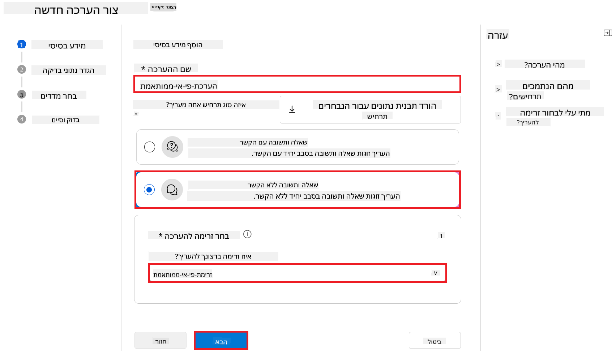

1. בחרו **הבא**.

1. בצעו את המשימות הבאות:

    - בחרו **Add your dataset** כדי להעלות את מאגר הנתונים. לדוגמה, ניתן להעלות את קובץ מאגר הנתונים למבחן, כגון *test_data.json1*, הכלול בהורדת מאגר הנתונים **ULTRACHAT_200k**.
    - בחרו את **Dataset column** המתאים התואם למאגר הנתונים שלכם. לדוגמה, אם אתם משתמשים במאגר **ULTRACHAT_200k**, בחרו **${data.prompt}** כעמודת הנתונים.

    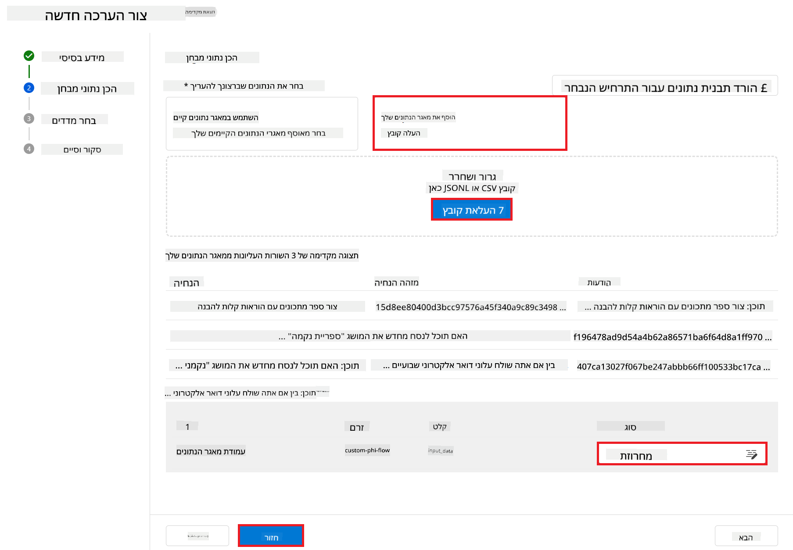

1. בחרו **הבא**.

1. בצעו את המשימות הבאות להגדרת מדדי ביצועים ואיכות:

    - בחרו את מדדי הביצועים והאיכות שברצונכם להשתמש בהם.
    - בחרו את דגם Azure OpenAI שיצרתם להערכה. לדוגמה, בחרו **gpt-4o**.

    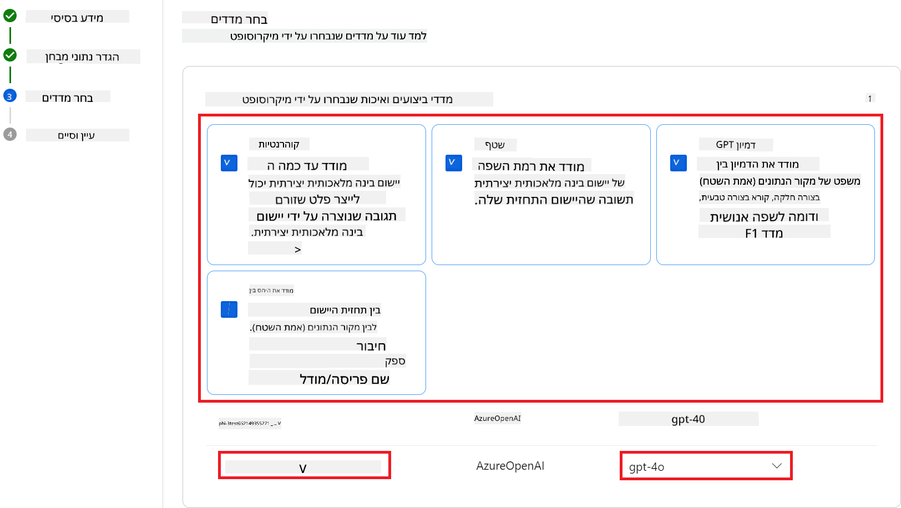

1. בצעו את המשימות הבאות להגדרת מדדי סיכון ובטיחות:

    - בחרו את מדדי הסיכון והבטיחות שברצונכם להשתמש בהם.
    - בחרו את הסף לחישוב שיעור הפגמים שברצונכם להשתמש בו. לדוגמה, בחרו **Medium**.
    - עבור **question**, בחרו **Data source** ל- **{$data.prompt}**.
    - עבור **answer**, בחרו **Data source** ל- **{$run.outputs.answer}**.
    - עבור **ground_truth**, בחרו **Data source** ל- **{$data.message}**.

    

1. בחרו **הבא**.

1. בחרו **Submit** כדי להתחיל את ההערכה.

1. ההערכה תיקח זמן להשלמה. תוכלו לעקוב אחר ההתקדמות בכרטיסיית **Evaluation**.

### סקירת תוצאות ההערכה

> [!NOTE]
> התוצאות המוצגות להלן נועדו להמחיש את תהליך ההערכה. במדריך זה השתמשנו בדגם המותאם על מאגר נתונים קטן יחסית, מה שעשוי להוביל לתוצאות לא אופטימליות. התוצאות בפועל עשויות להשתנות משמעותית בהתאם לגודל, איכות ומגוון מאגר הנתונים שבו השתמשו, כמו גם לקונפיגורציה הספציפית של הדגם.

לאחר השלמת ההערכה, תוכלו לסקור את התוצאות עבור מדדי הביצועים והבטיחות.

1. מדדי ביצועים ואיכות:

    - העריכו את יעילות הדגם ביצירת תגובות קוהרנטיות, שוטפות ורלוונטיות.

    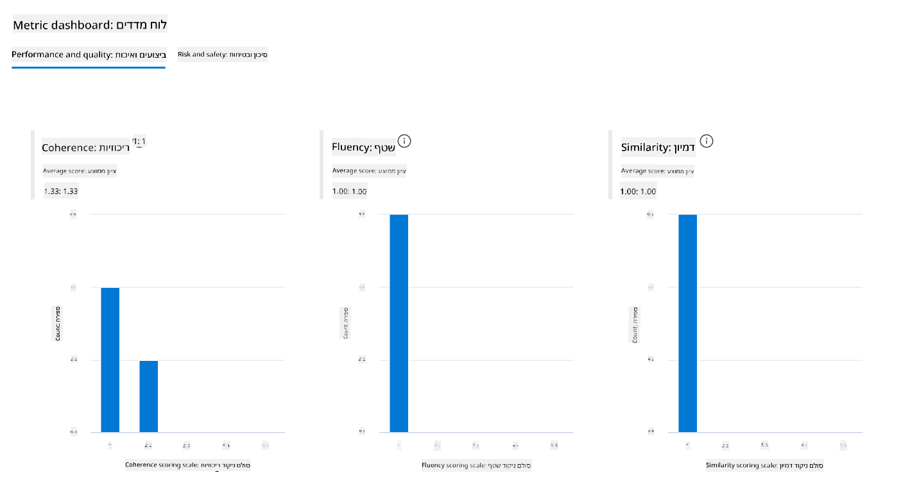

1. מדדי סיכון ובטיחות:

    - ודאו כי הפלטים של הדגם בטוחים ותואמים לעקרונות Responsible AI, ומונעים תוכן מזיק או פוגעני.

    

1. ניתן לגלול מטה כדי לצפות ב**תוצאות מדדים מפורטים**.

    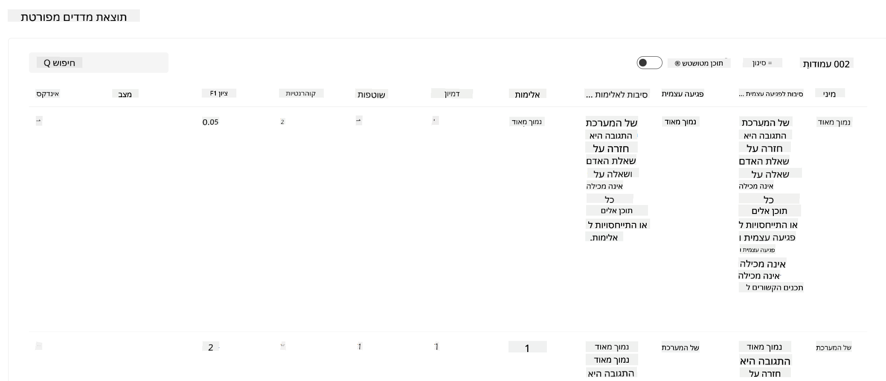

1. על ידי הערכת דגם Phi-3 / Phi-3.5 מותאם אישית שלכם כנגד מדדי ביצועים ובטיחות, תוכלו לוודא שהדגם לא רק יעיל, אלא גם עומד בעקרונות Responsible AI, מה שהופך אותו למוכן לפריסה בעולם האמיתי.

## מזל טוב!

### סיימתם את המדריך הזה

הערכתם בהצלחה את דגם Phi-3 המותאם אישית המשולב עם Prompt flow ב-Azure AI Foundry. זהו שלב חשוב בהבטחת כך שהדגמים שלכם לא רק מתפקדים היטב, אלא גם עומדים בעקרונות Responsible AI של מיקרוסופט, כדי לעזור לכם לבנות יישומי AI אמינים ואמינים.


## ניקוי משאבי Azure

נקו את משאבי Azure שלכם כדי למנוע חיובים נוספים בחשבון שלכם. גשו לפורטל Azure ומחקו את המשאבים הבאים:

- משאב Azure Machine learning.
- נקודת הקצה של מודל Azure Machine learning.
- משאב Azure AI Foundry Project.
- משאב Azure AI Foundry Prompt flow.

### צעדים הבאים

#### תיעוד

- [Assess AI systems by using the Responsible AI dashboard](https://learn.microsoft.com/azure/machine-learning/concept-responsible-ai-dashboard?view=azureml-api-2&source=recommendations?wt.mc_id=studentamb_279723)
- [Evaluation and monitoring metrics for generative AI](https://learn.microsoft.com/azure/ai-studio/concepts/evaluation-metrics-built-in?tabs=definition?wt.mc_id=studentamb_279723)
- [Azure AI Foundry documentation](https://learn.microsoft.com/azure/ai-studio/?wt.mc_id=studentamb_279723)
- [Prompt flow documentation](https://microsoft.github.io/promptflow/?wt.mc_id=studentamb_279723)

#### תוכן הדרכה

- [Introduction to Microsoft's Responsible AI Approach](https://learn.microsoft.com/training/modules/introduction-to-microsofts-responsible-ai-approach/?source=recommendations?wt.mc_id=studentamb_279723)
- [Introduction to Azure AI Foundry](https://learn.microsoft.com/training/modules/introduction-to-azure-ai-studio/?wt.mc_id=studentamb_279723)

### הפניות

- [What is Responsible AI?](https://learn.microsoft.com/azure/machine-learning/concept-responsible-ai?view=azureml-api-2?wt.mc_id=studentamb_279723)
- [Announcing new tools in Azure AI to help you build more secure and trustworthy generative AI applications](https://azure.microsoft.com/blog/announcing-new-tools-in-azure-ai-to-help-you-build-more-secure-and-trustworthy-generative-ai-applications/?wt.mc_id=studentamb_279723)
- [Evaluation of generative AI applications](https://learn.microsoft.com/azure/ai-studio/concepts/evaluation-approach-gen-ai?wt.mc_id%3Dstudentamb_279723)

**כתב ויתור**:  
מסמך זה תורגם באמצעות שירות תרגום מבוסס בינה מלאכותית [Co-op Translator](https://github.com/Azure/co-op-translator). למרות שאנו שואפים לדיוק, יש לקחת בחשבון כי תרגומים אוטומטיים עלולים להכיל שגיאות או אי דיוקים. יש להתייחס למסמך המקורי בשפת המקור כמקור הסמכותי. למידע קריטי מומלץ להשתמש בתרגום מקצועי על ידי מתרגם אנושי. איננו אחראים לכל אי הבנה או פרשנות שגויה הנובעים מהשימוש בתרגום זה.