# כיוונון ועדכון מודלים מותאמים אישית Phi-3 עם Prompt flow

דוגמת קצה-לקצה (E2E) זו מבוססת על המדריך "[Fine-Tune and Integrate Custom Phi-3 Models with Prompt Flow: Step-by-Step Guide](https://techcommunity.microsoft.com/t5/educator-developer-blog/fine-tune-and-integrate-custom-phi-3-models-with-prompt-flow/ba-p/4178612?WT.mc_id=aiml-137032-kinfeylo)" מהקהילה הטכנולוגית של מיקרוסופט. היא מציגה את התהליכים של כיוונון, פריסה ואינטגרציה של מודלים מותאמים אישית של Phi-3 עם Prompt flow.

## סקירה כללית

בדוגמת קצה-לקצה זו תלמד כיצד לכוונן את מודל Phi-3 ולשלב אותו עם Prompt flow. באמצעות Azure Machine Learning ו-Prompt flow תקים זרימת עבודה לפריסת מודלי AI מותאמים אישית ושימוש בהם. דוגמה זו מחולקת לשלוש תרחישים:

**תרחיש 1: הגדרת משאבי Azure והכנה לכיוונון**

**תרחיש 2: כיוונון מודל Phi-3 ופריסתו ב-Azure Machine Learning Studio**

**תרחיש 3: אינטגרציה עם Prompt flow וצ'אט עם המודל המותאם שלך**

הנה סקירה כללית של דוגמת קצה-לקצה זו.

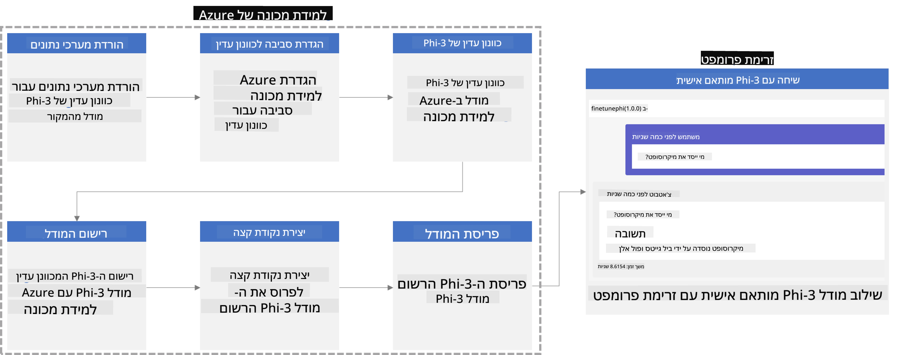

### תוכן העניינים

1. **[תרחיש 1: הגדרת משאבי Azure והכנה לכיוונון](../../../../../../md/02.Application/01.TextAndChat/Phi3)**
    - [יצירת סביבת עבודה של Azure Machine Learning](../../../../../../md/02.Application/01.TextAndChat/Phi3)
    - [בקשת מכסות GPU במנוי Azure](../../../../../../md/02.Application/01.TextAndChat/Phi3)
    - [הוספת הקצאת תפקיד](../../../../../../md/02.Application/01.TextAndChat/Phi3)
    - [הגדרת פרויקט](../../../../../../md/02.Application/01.TextAndChat/Phi3)
    - [הכנת מערך נתונים לכיוונון](../../../../../../md/02.Application/01.TextAndChat/Phi3)

1. **[תרחיש 2: כיוונון מודל Phi-3 ופריסה ב-Azure Machine Learning Studio](../../../../../../md/02.Application/01.TextAndChat/Phi3)**
    - [הגדרת Azure CLI](../../../../../../md/02.Application/01.TextAndChat/Phi3)
    - [כוונון מודל Phi-3](../../../../../../md/02.Application/01.TextAndChat/Phi3)
    - [פריסת המודל המכוונן](../../../../../../md/02.Application/01.TextAndChat/Phi3)

1. **[תרחיש 3: אינטגרציה עם Prompt flow וצ'אט עם המודל המותאם שלך](../../../../../../md/02.Application/01.TextAndChat/Phi3)**
    - [אינטגרציה של מודל Phi-3 מותאם אישית עם Prompt flow](../../../../../../md/02.Application/01.TextAndChat/Phi3)
    - [צ'אט עם המודל המותאם שלך](../../../../../../md/02.Application/01.TextAndChat/Phi3)

## תרחיש 1: הגדרת משאבי Azure והכנה לכיוונון

### יצירת סביבת עבודה של Azure Machine Learning

1. הקלד *azure machine learning* ב**סרגל החיפוש** שמעל דף הפורטל ובחר **Azure Machine Learning** מתוך האפשרויות המופיעות.

    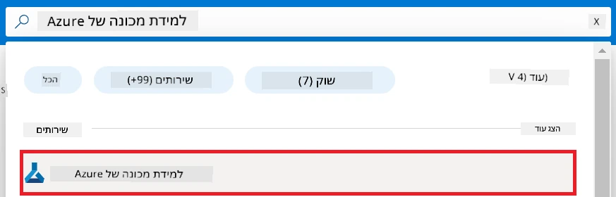

1. בחר **+ יצירה** מתפריט הניווט.

1. בחר **סביבת עבודה חדשה** מתפריט הניווט.

    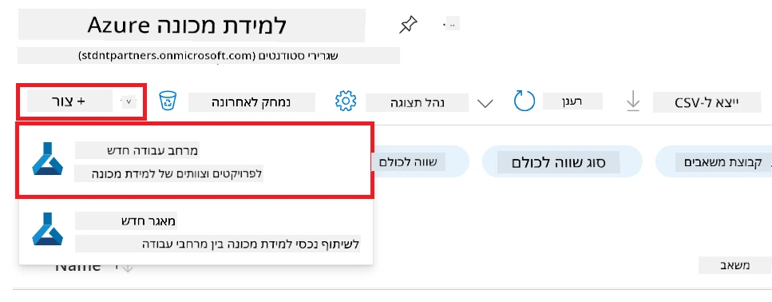

1. בצע את המשימות הבאות:

    - בחר את **המנוי** של Azure שלך.
    - בחר את **קבוצת המשאבים** לשימוש (צור חדשה אם יש צורך).
    - הזן **שם סביבת העבודה**. הוא חייב להיות ערך ייחודי.
    - בחר את **האזור** שבו תרצה להשתמש.
    - בחר את **חשבון האחסון** לשימוש (צור חדש אם יש צורך).
    - בחר את **מחסן המפתחות** לשימוש (צור חדש אם יש צורך).
    - בחר את **Application insights** לשימוש (צור חדש אם יש צורך).
    - בחר את **רשימת המכולות** לשימוש (צור חדשה אם יש צורך).

    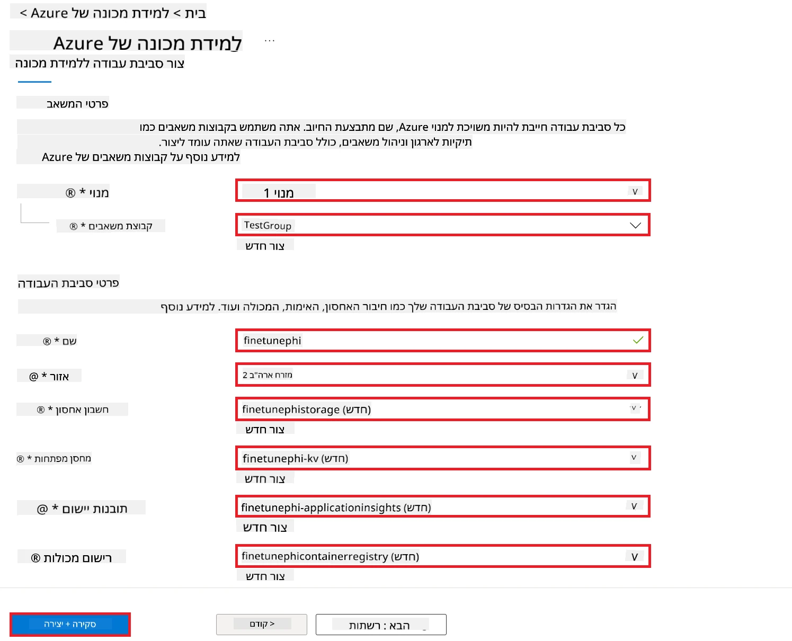

1. בחר **סקירה + יצירה**.

1. בחר **יצירה**.

### בקשת מכסות GPU במנוי Azure

בדוגמת קצה-לקצה זו, תשתמש ב-*Standard_NC24ads_A100_v4 GPU* לכיוונון, שדורש בקשת מכסה, וב-*Standard_E4s_v3* CPU לפריסה, שאינו דורש בקשת מכסה.

> [!NOTE]
>
> רק מנויי Pay-As-You-Go (סוג המנוי הסטנדרטי) זכאים להקצאת GPU; מנויי תועלת עדיין לא נתמכים.
>
> עבור אלו המשתמשים במנויי תועלת (כגון מנוי Visual Studio Enterprise) או שמעוניינים לבדוק במהירות את תהליך הכיוונון והפריסה, מדריך זה מספק גם הנחיות לכיוונון עם מערך נתונים מזערי באמצעות CPU. עם זאת, חשוב לציין שתוצאות הכיוונון טובות משמעותית כאשר משתמשים ב-GPU עם מערכי נתונים גדולים יותר.

1. עבור אל [Azure ML Studio](https://ml.azure.com/home?wt.mc_id=studentamb_279723).

1. בצע את המשימות הבאות לבקשת מכסת *Standard NCADSA100v4 Family*:

    - בחר **מכסות** מהכרטיסיה משמאל.
    - בחר את **משפחת המכונה הווירטואלית** לשימוש. לדוגמה, בחר **Standard NCADSA100v4 Family Cluster Dedicated vCPUs**, שכוללת את *Standard_NC24ads_A100_v4* GPU.
    - בחר **בקשת מכסה** מתפריט הניווט.

        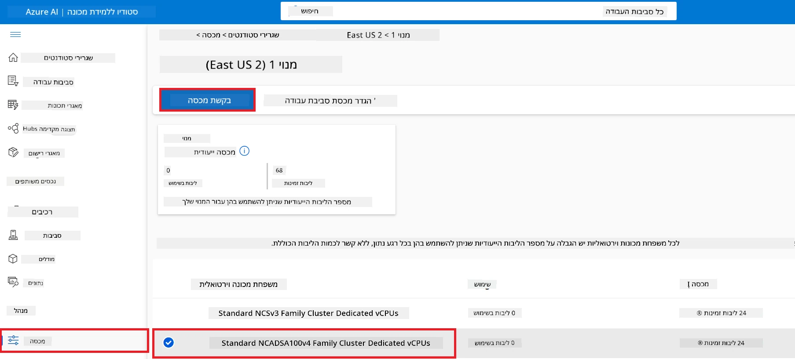

    - בדף בקשת המכסה, הזן את **המגבלה החדשה על הליבות** שברצונך להשתמש בה. לדוגמה, 24.
    - בדף בקשת המכסה, בחר **שלח** לבקשת מכסת ה-GPU.

> [!NOTE]
> ניתן לבחור את ה-GPU או ה-CPU המתאים לצרכיך לפי העיון במסמך [Sizes for Virtual Machines in Azure](https://learn.microsoft.com/azure/virtual-machines/sizes/overview?tabs=breakdownseries%2Cgeneralsizelist%2Ccomputesizelist%2Cmemorysizelist%2Cstoragesizelist%2Cgpusizelist%2Cfpgasizelist%2Chpcsizelist).

### הוספת הקצאת תפקיד

כדי לכוונן ולפרוס את המודלים שלך, עליך קודם ליצור זהות מנוהלת מוקצית למשתמש (UAI) ולהקצות לה את ההרשאות המתאימות. זהות מנוהלת זו תשמש לאימות במהלך הפריסה.

#### יצירת זהות מנוהלת מוקצית למשתמש (UAI)

1. הקלד *managed identities* ב**סרגל החיפוש** שמעל דף הפורטל ובחר **Managed Identities** מתוך האפשרויות המופיעות.

    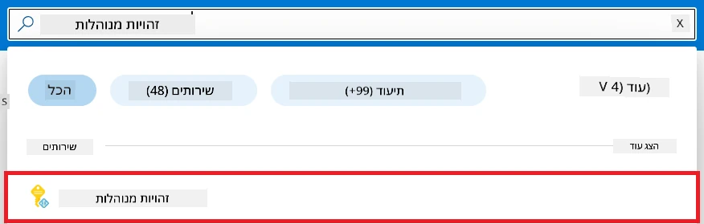

1. בחר **+ יצירה**.

    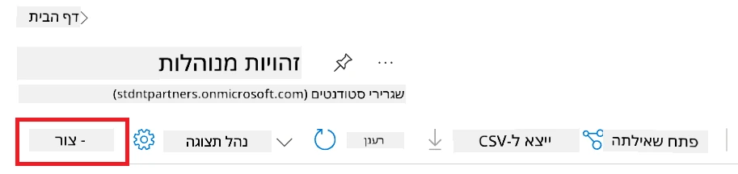

1. בצע את המשימות הבאות:

    - בחר את **המנוי** של Azure שלך.
    - בחר את **קבוצת המשאבים** לשימוש (צור חדשה אם יש צורך).
    - בחר את **האזור** שבו תרצה להשתמש.
    - הזן את **השם**. הוא חייב להיות ערך ייחודי.

1. בחר **סקירה + יצירה**.

1. בחר **+ יצירה**.

#### הוספת הקצאת תפקיד Contributor לזהות המנוהלת

1. עבור למשאב הזהות המנוהלת שיצרת.

1. בחר **הקצאות תפקיד Azure** מהכרטיסיה משמאל.

1. בחר **+ הוסף הקצאת תפקיד** מתפריט הניווט.

1. בדף הוספת הקצאת תפקיד, בצע את המשימות הבאות:
    - בחר **טווח** ל**קבוצת משאבים**.
    - בחר את **המנוי** של Azure שלך.
    - בחר את **קבוצת המשאבים** לשימוש.
    - בחר את **התפקיד** ל**Contributor**.

    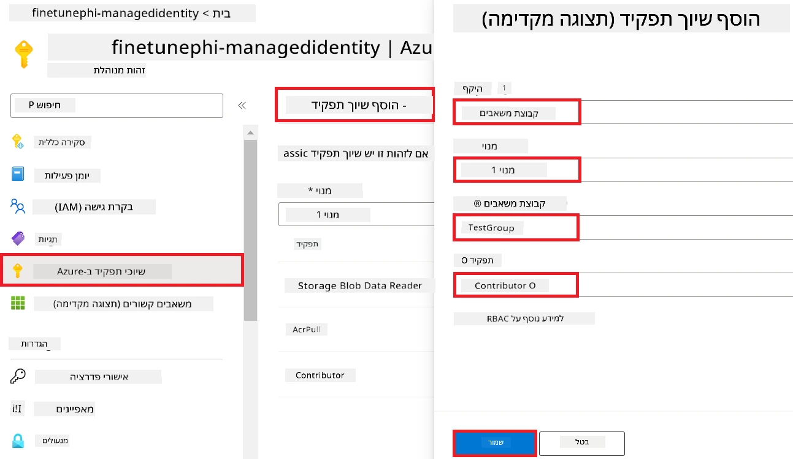

1. בחר **שמור**.

#### הוספת הקצאת תפקיד Storage Blob Data Reader לזהות המנוהלת

1. הקלד *storage accounts* ב**סרגל החיפוש** שמעל דף הפורטל ובחר **Storage accounts** מתוך האפשרויות המופיעות.

    

1. בחר את חשבון האחסון המשויך לסביבת העבודה של Azure Machine Learning שיצרת. לדוגמה, *finetunephistorage*.

1. בצע את המשימות הבאות כדי לנווט לדף הוספת הקצאת תפקיד:

    - עבור לחשבון האחסון של Azure שיצרת.
    - בחר **בקרת גישה (IAM)** מהכרטיסיה משמאל.
    - בחר **+ הוסף** מתפריט הניווט.
    - בחר **הוסף הקצאת תפקיד** מתפריט הניווט.

    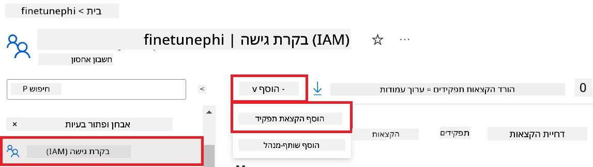

1. בדף הוספת הקצאת תפקיד, בצע את המשימות הבאות:

    - בדף התפקיד, הקלד *Storage Blob Data Reader* ב**סרגל החיפוש** ובחר **Storage Blob Data Reader** מתוך האפשרויות המופיעות.
    - בדף התפקיד, בחר **הבא**.
    - בדף החברים, בחר **הקצה גישה ל** **Managed identity**.
    - בדף החברים, בחר **+ בחר חברים**.
    - בדף בחירת זהויות מנוהלות, בחר את **המנוי** של Azure שלך.
    - בדף בחירת זהויות מנוהלות, בחר את **הזהות המנוהלת** ל**Manage Identity**.
    - בדף בחירת זהויות מנוהלות, בחר את זהות ניהול שיצרת. לדוגמה, *finetunephi-managedidentity*.
    - בדף בחירת זהויות מנוהלות, בחר **בחר**.

    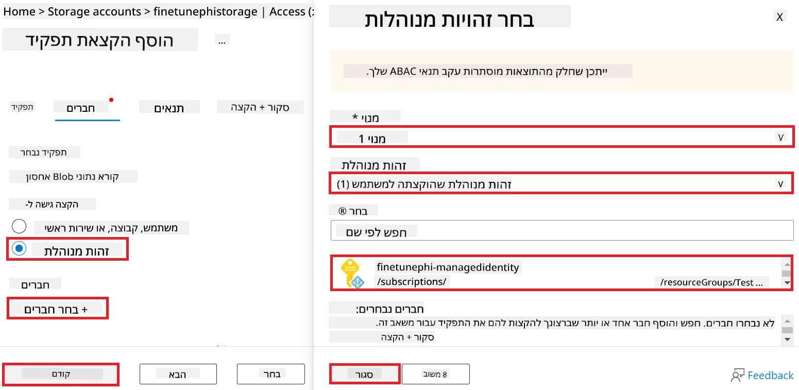

1. בחר **סקירה + הקצה**.

#### הוספת הקצאת תפקיד AcrPull לזהות המנוהלת

1. הקלד *container registries* ב**סרגל החיפוש** שמעל דף הפורטל ובחר **Container registries** מתוך האפשרויות המופיעות.

    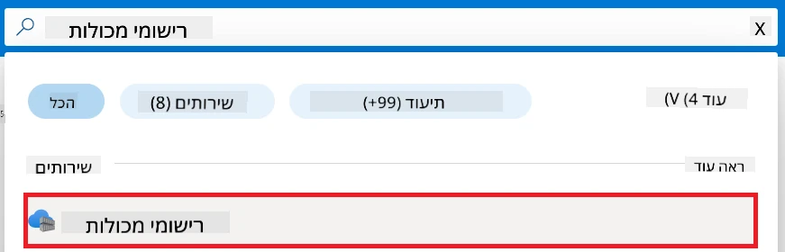

1. בחר את רישום המכולות המשויך לסביבת העבודה של Azure Machine Learning. לדוגמה, *finetunephicontainerregistries*

1. בצע את המשימות הבאות כדי לנווט לדף הוספת הקצאת תפקיד:

    - בחר **בקרת גישה (IAM)** מהכרטיסיה משמאל.
    - בחר **+ הוסף** מתפריט הניווט.
    - בחר **הוסף הקצאת תפקיד** מתפריט הניווט.

1. בדף הוספת הקצאת תפקיד, בצע את המשימות הבאות:

    - בדף התפקיד, הקלד *AcrPull* ב**סרגל החיפוש** ובחר **AcrPull** מתוך האפשרויות המופיעות.
    - בדף התפקיד, בחר **הבא**.
    - בדף החברים, בחר **הקצה גישה ל** **Managed identity**.
    - בדף החברים, בחר **+ בחר חברים**.
    - בדף בחירת זהויות מנוהלות, בחר את **המנוי** של Azure שלך.
    - בדף בחירת זהויות מנוהלות, בחר את **הזהות המנוהלת** ל**Manage Identity**.
    - בדף בחירת זהויות מנוהלות, בחר את זהות ניהול שיצרת. לדוגמה, *finetunephi-managedidentity*.
    - בדף בחירת זהויות מנוהלות, בחר **בחר**.
    - בחר **סקירה + הקצה**.

### הגדרת פרויקט

כעת, תיצור תיקייה לעבודה ותגדיר סביבה וירטואלית לפיתוח תוכנית שמתקשרת עם משתמשים ומשתמשת בהיסטוריית צ'אט מאוחסנת ב-Azure Cosmos DB כדי להעשיר את התגובות שלה.

#### יצירת תיקייה לעבודה בתוכה

1. פתח חלון טרמינל והקלד את הפקודה הבאה ליצירת תיקייה בשם *finetune-phi* בנתיב ברירת המחדל.

    ```console
    mkdir finetune-phi
    ```

1. הקלד את הפקודה הבאה בתוך הטרמינל כדי לנווט לתיקיית *finetune-phi* שיצרת.

    ```console
    cd finetune-phi
    ```

#### יצירת סביבה וירטואלית

1. הקלד את הפקודה הבאה בתוך הטרמינל כדי ליצור סביבה וירטואלית בשם *.venv*.

    ```console
    python -m venv .venv
    ```

1. הקלד את הפקודה הבאה בתוך הטרמינל כדי להפעיל את הסביבה הוירטואלית.

    ```console
    .venv\Scripts\activate.bat
    ```

> [!NOTE]
>
> אם זה עבד, תראה *(.venv)* לפני שורת הפקודה.

#### התקנת החבילות הנדרשות

1. הקלד את הפקודות הבאות בתוך הטרמינל להתקנת החבילות הנדרשות.

    ```console
    pip install datasets==2.19.1
    pip install transformers==4.41.1
    pip install azure-ai-ml==1.16.0
    pip install torch==2.3.1
    pip install trl==0.9.4
    pip install promptflow==1.12.0
    ```

#### יצירת קבצי פרויקט
בתרגיל זה, תיצור את הקבצים החיוניים עבור הפרויקט שלנו. קבצים אלה כוללים סקריפטים להורדת מערך הנתונים, הקמת סביבת Azure Machine Learning, כיוונון עדין של מודל Phi-3, והפעלת המודל המכוונן. בנוסף, תיצור קובץ *conda.yml* כדי להגדיר את סביבת הכיוונון העדין.

בתרגיל זה, תעשה את הדברים הבאים:

- צור קובץ *download_dataset.py* להורדת מערך הנתונים.
- צור קובץ *setup_ml.py* להקמת סביבת Azure Machine Learning.
- צור קובץ *fine_tune.py* בתיקיית *finetuning_dir* כדי לכוון עדין את מודל Phi-3 באמצעות מערך הנתונים.
- צור קובץ *conda.yml* להגדרת סביבת הכיוונון העדין.
- צור קובץ *deploy_model.py* לפריסת המודל המכוונן.
- צור קובץ *integrate_with_promptflow.py* לשילוב המודל המכוונן ולהרצת המודל באמצעות Prompt flow.
- צור קובץ flow.dag.yml, להקמת מבנה זרימת העבודה של Prompt flow.
- צור קובץ *config.py* להזנת מידע על Azure.

> [!NOTE]
>
> מבנה התיקיות המלא:
>
> ```text
> └── YourUserName
> .    └── finetune-phi
> .        ├── finetuning_dir
> .        │      └── fine_tune.py
> .        ├── conda.yml
> .        ├── config.py
> .        ├── deploy_model.py
> .        ├── download_dataset.py
> .        ├── flow.dag.yml
> .        ├── integrate_with_promptflow.py
> .        └── setup_ml.py
> ```

1. פתח את **Visual Studio Code**.

1. בחר **File** בסרגל התפריטים.

1. בחר **Open Folder**.

1. בחר את תיקיית *finetune-phi* שיצרת, הממוקמת ב-*C:\Users\yourUserName\finetune-phi*.

    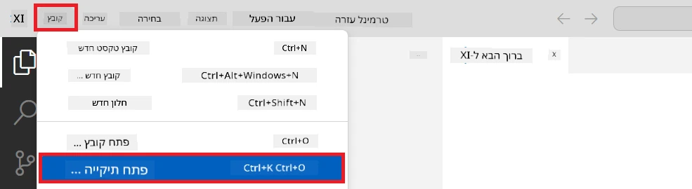

1. בפאנל השמאלי של Visual Studio Code, לחץ קליק ימני ובחר **New File** כדי ליצור קובץ חדש בשם *download_dataset.py*.

1. בפאנל השמאלי של Visual Studio Code, לחץ קליק ימני ובחר **New File** כדי ליצור קובץ חדש בשם *setup_ml.py*.

1. בפאנל השמאלי של Visual Studio Code, לחץ קליק ימני ובחר **New File** כדי ליצור קובץ חדש בשם *deploy_model.py*.

    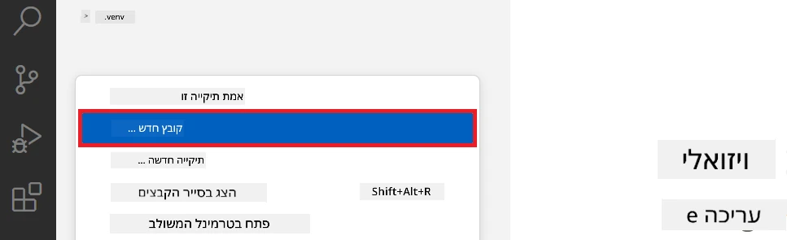

1. בפאנל השמאלי של Visual Studio Code, לחץ קליק ימני ובחר **New Folder** כדי ליצור תיקייה חדשה בשם *finetuning_dir*.

1. בתיקיית *finetuning_dir*, צור קובץ חדש בשם *fine_tune.py*.

#### צור והגדר את קובץ *conda.yml*

1. בפאנל השמאלי של Visual Studio Code, לחץ קליק ימני ובחר **New File** כדי ליצור קובץ חדש בשם *conda.yml*.

1. הוסף את הקוד הבא לקובץ *conda.yml* כדי להגדיר את סביבת הכיוונון העדין עבור מודל Phi-3.

    ```yml
    name: phi-3-training-env
    channels:
      - defaults
      - conda-forge
    dependencies:
      - python=3.10
      - pip
      - numpy<2.0
      - pip:
          - torch==2.4.0
          - torchvision==0.19.0
          - trl==0.8.6
          - transformers==4.41
          - datasets==2.21.0
          - azureml-core==1.57.0
          - azure-storage-blob==12.19.0
          - azure-ai-ml==1.16
          - azure-identity==1.17.1
          - accelerate==0.33.0
          - mlflow==2.15.1
          - azureml-mlflow==1.57.0
    ```

#### צור והגדר את קובץ *config.py*

1. בפאנל השמאלי של Visual Studio Code, לחץ קליק ימני ובחר **New File** כדי ליצור קובץ חדש בשם *config.py*.

1. הוסף את הקוד הבא לקובץ *config.py* כדי לכלול את פרטי ה-Azure שלך.

    ```python
    # הגדרות Azure
    AZURE_SUBSCRIPTION_ID = "your_subscription_id"
    AZURE_RESOURCE_GROUP_NAME = "your_resource_group_name" # "TestGroup"

    # הגדרות Azure Machine Learning
    AZURE_ML_WORKSPACE_NAME = "your_workspace_name" # "finetunephi-workspace"

    # הגדרות זהות מנוהלת של Azure
    AZURE_MANAGED_IDENTITY_CLIENT_ID = "your_azure_managed_identity_client_id"
    AZURE_MANAGED_IDENTITY_NAME = "your_azure_managed_identity_name" # "finetunephi-mangedidentity"
    AZURE_MANAGED_IDENTITY_RESOURCE_ID = f"/subscriptions/{AZURE_SUBSCRIPTION_ID}/resourceGroups/{AZURE_RESOURCE_GROUP_NAME}/providers/Microsoft.ManagedIdentity/userAssignedIdentities/{AZURE_MANAGED_IDENTITY_NAME}"

    # נתיבי קבצי מערך הנתונים
    TRAIN_DATA_PATH = "data/train_data.jsonl"
    TEST_DATA_PATH = "data/test_data.jsonl"

    # הגדרות מודל מכוּון
    AZURE_MODEL_NAME = "your_fine_tuned_model_name" # "finetune-phi-model"
    AZURE_ENDPOINT_NAME = "your_fine_tuned_model_endpoint_name" # "finetune-phi-endpoint"
    AZURE_DEPLOYMENT_NAME = "your_fine_tuned_model_deployment_name" # "finetune-phi-deployment"

    AZURE_ML_API_KEY = "your_fine_tuned_model_api_key"
    AZURE_ML_ENDPOINT = "your_fine_tuned_model_endpoint_uri" # "https://{your-endpoint-name}.{your-region}.inference.ml.azure.com/score"
    ```

#### הוסף משתני סביבה של Azure

1. בצע את המשימות הבאות כדי להוסיף את מזהה המנוי (Subscription ID) של Azure:

    - הקלד *subscriptions* בסרגל החיפוש בראש דף הפורטל ובחר **Subscriptions** מתוך האפשרויות שמופיעות.
    - בחר את המנוי של Azure שבו אתה משתמש כרגע.
    - העתק והדבק את מזהה המנוי שלך לקובץ *config.py*.

    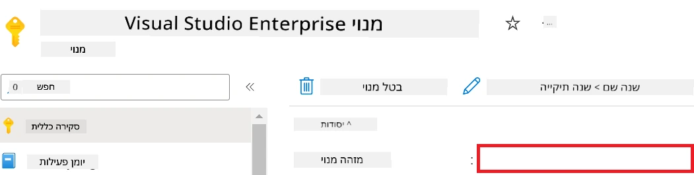

1. בצע את המשימות הבאות כדי להוסיף את שם סביבת העבודה של Azure:

    - נווט למשאב Azure Machine Learning שיצרת.
    - העתק והדבק את שם סביבת העבודה לקובץ *config.py*.

    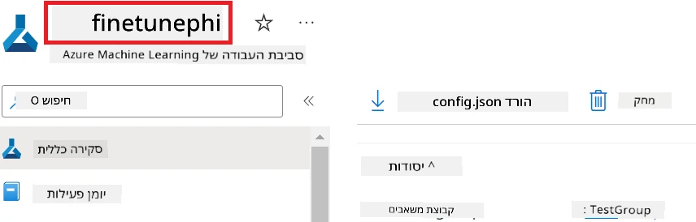

1. בצע את המשימות הבאות כדי להוסיף את שם קבוצת המשאבים של Azure:

    - נווט למשאב Azure Machine Learning שיצרת.
    - העתק והדבק את שם קבוצת המשאבים לקובץ *config.py*.

    

2. בצע את המשימות הבאות כדי להוסיף את שם זהות מנוהלת (Managed Identity) של Azure:

    - נווט למשאב Managed Identities שיצרת.
    - העתק והדבק את שם זהות מנוהלת לקובץ *config.py*.

    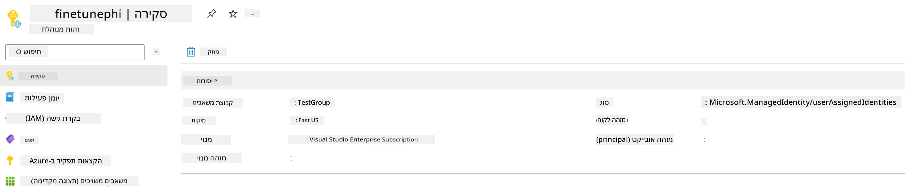

### הכנת מערך הנתונים לכיוונון עדין

בתרגיל זה, תריץ את הקובץ *download_dataset.py* כדי להוריד את מערכי הנתונים *ULTRACHAT_200k* לסביבה המקומית שלך. לאחר מכן תשתמש במערכי הנתונים כדי לכוון עדין את מודל Phi-3 ב-Azure Machine Learning.

#### הורד את מערך הנתונים שלך באמצעות *download_dataset.py*

1. פתח את הקובץ *download_dataset.py* ב-Visual Studio Code.

1. הוסף את הקוד הבא לקובץ *download_dataset.py*.

    ```python
    import json
    import os
    from datasets import load_dataset
    from config import (
        TRAIN_DATA_PATH,
        TEST_DATA_PATH)

    def load_and_split_dataset(dataset_name, config_name, split_ratio):
        """
        Load and split a dataset.
        """
        # טען את מערך הנתונים בעל השם, התצורה ושיעור החלוקה שצוינו
        dataset = load_dataset(dataset_name, config_name, split=split_ratio)
        print(f"Original dataset size: {len(dataset)}")
        
        # חלק את מערך הנתונים לקבוצות אימון ובדיקה (80% אימון, 20% בדיקה)
        split_dataset = dataset.train_test_split(test_size=0.2)
        print(f"Train dataset size: {len(split_dataset['train'])}")
        print(f"Test dataset size: {len(split_dataset['test'])}")
        
        return split_dataset

    def save_dataset_to_jsonl(dataset, filepath):
        """
        Save a dataset to a JSONL file.
        """
        # צור את התיקייה אם היא לא קיימת
        os.makedirs(os.path.dirname(filepath), exist_ok=True)
        
        # פתח את הקובץ במצב כתיבה
        with open(filepath, 'w', encoding='utf-8') as f:
            # עבור על כל רשומה במערך הנתונים
            for record in dataset:
                # המיר את הרשומה לאובייקט JSON וכתוב אותה לקובץ
                json.dump(record, f)
                # כתוב תו שורה חדשה כדי להפריד בין הרשומות
                f.write('\n')
        
        print(f"Dataset saved to {filepath}")

    def main():
        """
        Main function to load, split, and save the dataset.
        """
        # טען וחלק את מערך הנתונים ULTRACHAT_200k עם תצורה ושיעור חלוקה ספציפיים
        dataset = load_and_split_dataset("HuggingFaceH4/ultrachat_200k", 'default', 'train_sft[:1%]')
        
        # הפק את מערכי הנתונים של האימון והבדיקה מהחלוקה
        train_dataset = dataset['train']
        test_dataset = dataset['test']

        # שמור את מערך האימון לקובץ JSONL
        save_dataset_to_jsonl(train_dataset, TRAIN_DATA_PATH)
        
        # שמור את מערך הבדיקה בקובץ JSONL נפרד
        save_dataset_to_jsonl(test_dataset, TEST_DATA_PATH)

    if __name__ == "__main__":
        main()

    ```

> [!TIP]
>
> **הנחיות לכיוונון עדין עם מערך נתונים מינימלי באמצעות מעבד (CPU)**
>
> אם ברצונך להשתמש במעבד (CPU) לכיוונון עדין, גישה זו אידיאלית למי שיש לו מינויי הטבה (כגון Visual Studio Enterprise Subscription) או כדי לבדוק במהירות את תהליך הכיוונון והפריסה.
>
> החלף את `dataset = load_and_split_dataset("HuggingFaceH4/ultrachat_200k", 'default', 'train_sft[:1%]')` ב- `dataset = load_and_split_dataset("HuggingFaceH4/ultrachat_200k", 'default', 'train_sft[:10]')`
>

1. הקלד את הפקודה הבאה בתוך הטרמינל שלך כדי להריץ את הסקריפט ולהוריד את מערך הנתונים לסביבת העבודה המקומית שלך.

    ```console
    python download_data.py
    ```

1. ודא כי מערכי הנתונים נשמרו בהצלחה בתיקייה המקומית *finetune-phi/data*.

> [!NOTE]
>
> **גודל מערך הנתונים וזמן הכיוונון העדין**
>
> בדוגמת E2E זו, אתה משתמש רק ב-1% ממערך הנתונים (`train_sft[:1%]`). זה מפחית משמעותית את כמות הנתונים, ומאיץ הן את ההעלאה והן את תהליכי הכיוונון העדין. ניתן לכוונן את האחוז כדי למצוא את האיזון המתאים בין זמן האימון לביצועי המודל. שימוש בתת-ערכה קטנה של מערך הנתונים מקטין את הזמן הנדרש לכיוונון, מה שהופך את התהליך לנוח יותר לדוגמת E2E.

## תרחיש 2: כיוונון עדין של מודל Phi-3 ופריסה ב-Azure Machine Learning Studio

### הגדרת Azure CLI

עליך להגדיר את Azure CLI כדי לאמת את סביבת העבודה שלך. Azure CLI מאפשר לך לנהל משאבים של Azure ישירות משורת הפקודה ומספק את האישורים הנדרשים ל-Azure Machine Learning לגישה למשאבים אלה. כדי להתחיל התקן את [Azure CLI](https://learn.microsoft.com/cli/azure/install-azure-cli)

1. פתח חלון טרמינל והקלד את הפקודה הבאה כדי להיכנס לחשבון ה-Azure שלך.

    ```console
    az login
    ```

1. בחר את חשבון ה-Azure שלך לשימוש.

1. בחר את המנוי של Azure לשימוש.

    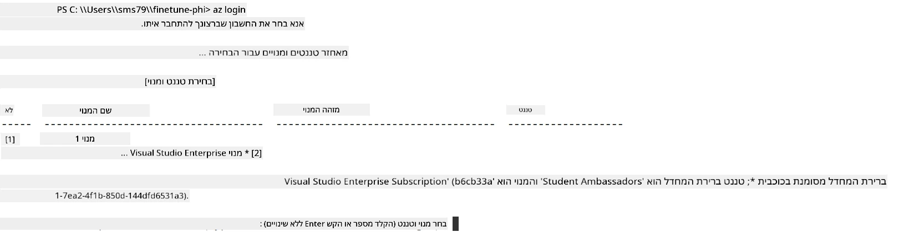

> [!TIP]
>
> אם יש לך בעיות בהתחברות ל-Azure, נסה להשתמש בקוד מכשיר (device code). פתח חלון טרמינל והקלד את הפקודה הבאה כדי להיכנס לחשבון ה-Azure שלך:
>
> ```console
> az login --use-device-code
> ```
>

### כיוונון עדין של מודל Phi-3

בתרגיל זה, תכוין עדין את מודל Phi-3 באמצעות מערך הנתונים שניתן. תחילה, תגדיר את תהליך הכיוונון העדין בקובץ *fine_tune.py*. לאחר מכן, תגדיר את סביבת ה-Azure Machine Learning ותתחיל את תהליך הכיוונון על ידי הרצת הקובץ *setup_ml.py*. סקריפט זה מוודא שכיוונון העדין מתבצע בתוך סביבת Azure Machine Learning.

בהרצת *setup_ml.py*, תתחיל את תהליך הכיוונון העדין בסביבת Azure Machine Learning.

#### הוסף קוד לקובץ *fine_tune.py*

1. נווט לתיקיית *finetuning_dir* ופתח את הקובץ *fine_tune.py* ב-Visual Studio Code.

1. הוסף את הקוד הבא לקובץ *fine_tune.py*.

    ```python
    import argparse
    import sys
    import logging
    import os
    from datasets import load_dataset
    import torch
    import mlflow
    from transformers import AutoModelForCausalLM, AutoTokenizer, TrainingArguments
    from trl import SFTTrainer

    # כדי להימנע משגיאת INVALID_PARAMETER_VALUE ב-MLflow, יש לנטרל את שילוב ה-MLflow
    os.environ["DISABLE_MLFLOW_INTEGRATION"] = "True"

    # הגדרת רישום
    logging.basicConfig(
        format="%(asctime)s - %(levelname)s - %(name)s - %(message)s",
        datefmt="%Y-%m-%d %H:%M:%S",
        handlers=[logging.StreamHandler(sys.stdout)],
        level=logging.WARNING
    )
    logger = logging.getLogger(__name__)

    def initialize_model_and_tokenizer(model_name, model_kwargs):
        """
        Initialize the model and tokenizer with the given pretrained model name and arguments.
        """
        model = AutoModelForCausalLM.from_pretrained(model_name, **model_kwargs)
        tokenizer = AutoTokenizer.from_pretrained(model_name)
        tokenizer.model_max_length = 2048
        tokenizer.pad_token = tokenizer.unk_token
        tokenizer.pad_token_id = tokenizer.convert_tokens_to_ids(tokenizer.pad_token)
        tokenizer.padding_side = 'right'
        return model, tokenizer

    def apply_chat_template(example, tokenizer):
        """
        Apply a chat template to tokenize messages in the example.
        """
        messages = example["messages"]
        if messages[0]["role"] != "system":
            messages.insert(0, {"role": "system", "content": ""})
        example["text"] = tokenizer.apply_chat_template(
            messages, tokenize=False, add_generation_prompt=False
        )
        return example

    def load_and_preprocess_data(train_filepath, test_filepath, tokenizer):
        """
        Load and preprocess the dataset.
        """
        train_dataset = load_dataset('json', data_files=train_filepath, split='train')
        test_dataset = load_dataset('json', data_files=test_filepath, split='train')
        column_names = list(train_dataset.features)

        train_dataset = train_dataset.map(
            apply_chat_template,
            fn_kwargs={"tokenizer": tokenizer},
            num_proc=10,
            remove_columns=column_names,
            desc="Applying chat template to train dataset",
        )

        test_dataset = test_dataset.map(
            apply_chat_template,
            fn_kwargs={"tokenizer": tokenizer},
            num_proc=10,
            remove_columns=column_names,
            desc="Applying chat template to test dataset",
        )

        return train_dataset, test_dataset

    def train_and_evaluate_model(train_dataset, test_dataset, model, tokenizer, output_dir):
        """
        Train and evaluate the model.
        """
        training_args = TrainingArguments(
            bf16=True,
            do_eval=True,
            output_dir=output_dir,
            eval_strategy="epoch",
            learning_rate=5.0e-06,
            logging_steps=20,
            lr_scheduler_type="cosine",
            num_train_epochs=3,
            overwrite_output_dir=True,
            per_device_eval_batch_size=4,
            per_device_train_batch_size=4,
            remove_unused_columns=True,
            save_steps=500,
            seed=0,
            gradient_checkpointing=True,
            gradient_accumulation_steps=1,
            warmup_ratio=0.2,
        )

        trainer = SFTTrainer(
            model=model,
            args=training_args,
            train_dataset=train_dataset,
            eval_dataset=test_dataset,
            max_seq_length=2048,
            dataset_text_field="text",
            tokenizer=tokenizer,
            packing=True
        )

        train_result = trainer.train()
        trainer.log_metrics("train", train_result.metrics)

        mlflow.transformers.log_model(
            transformers_model={"model": trainer.model, "tokenizer": tokenizer},
            artifact_path=output_dir,
        )

        tokenizer.padding_side = 'left'
        eval_metrics = trainer.evaluate()
        eval_metrics["eval_samples"] = len(test_dataset)
        trainer.log_metrics("eval", eval_metrics)

    def main(train_file, eval_file, model_output_dir):
        """
        Main function to fine-tune the model.
        """
        model_kwargs = {
            "use_cache": False,
            "trust_remote_code": True,
            "torch_dtype": torch.bfloat16,
            "device_map": None,
            "attn_implementation": "eager"
        }

        # pretrained_model_name = "microsoft/Phi-3-mini-4k-instruct"
        pretrained_model_name = "microsoft/Phi-3.5-mini-instruct"

        with mlflow.start_run():
            model, tokenizer = initialize_model_and_tokenizer(pretrained_model_name, model_kwargs)
            train_dataset, test_dataset = load_and_preprocess_data(train_file, eval_file, tokenizer)
            train_and_evaluate_model(train_dataset, test_dataset, model, tokenizer, model_output_dir)

    if __name__ == "__main__":
        parser = argparse.ArgumentParser()
        parser.add_argument("--train-file", type=str, required=True, help="Path to the training data")
        parser.add_argument("--eval-file", type=str, required=True, help="Path to the evaluation data")
        parser.add_argument("--model_output_dir", type=str, required=True, help="Directory to save the fine-tuned model")
        args = parser.parse_args()
        main(args.train_file, args.eval_file, args.model_output_dir)

    ```

1. שמור וסגור את קובץ *fine_tune.py*.

> [!TIP]
> **ניתן לכוונן עדין את מודל Phi-3.5**
>
> בקובץ *fine_tune.py*, ניתן לשנות את `pretrained_model_name` מ- `"microsoft/Phi-3-mini-4k-instruct"` לכל מודל שתרצה לכוונן. לדוגמה, אם תשנה אותו ל- `"microsoft/Phi-3.5-mini-instruct"`, תשמש במודל Phi-3.5-mini-instruct לכיוונון עדין. כדי למצוא ולשימוש בשם המודל שאתה מעוניין בו, בקר ב-[Hugging Face](https://huggingface.co/), חפש את המודל הרצוי, ואז העתק והדבק את שמו לשדה `pretrained_model_name` בסקריפט שלך.
>
> <image type="content" src="../../../../imgs/02/FineTuning-PromptFlow/finetunephi3.5.png" alt-text="Fine tune Phi-3.5.">
>

#### הוסף קוד לקובץ *setup_ml.py*

1. פתח את הקובץ *setup_ml.py* ב-Visual Studio Code.

1. הוסף את הקוד הבא לקובץ *setup_ml.py*.

    ```python
    import logging
    from azure.ai.ml import MLClient, command, Input
    from azure.ai.ml.entities import Environment, AmlCompute
    from azure.identity import AzureCliCredential
    from config import (
        AZURE_SUBSCRIPTION_ID,
        AZURE_RESOURCE_GROUP_NAME,
        AZURE_ML_WORKSPACE_NAME,
        TRAIN_DATA_PATH,
        TEST_DATA_PATH
    )

    # קבועים

    # הסר את ההערה מהשורות הבאות כדי להשתמש במחשב CPU לאימון
    # COMPUTE_INSTANCE_TYPE = "Standard_E16s_v3" # מעבד
    # COMPUTE_NAME = "cpu-e16s-v3"
    # DOCKER_IMAGE_NAME = "mcr.microsoft.com/azureml/openmpi4.1.0-ubuntu20.04:latest"

    # הסר את ההערה מהשורות הבאות כדי להשתמש במחשב GPU לאימון
    COMPUTE_INSTANCE_TYPE = "Standard_NC24ads_A100_v4"
    COMPUTE_NAME = "gpu-nc24s-a100-v4"
    DOCKER_IMAGE_NAME = "mcr.microsoft.com/azureml/curated/acft-hf-nlp-gpu:59"

    CONDA_FILE = "conda.yml"
    LOCATION = "eastus2" # החלף למיקום של אשכול המחשוב שלך
    FINETUNING_DIR = "./finetuning_dir" # נתיב לסקריפט הכוונון המדויק
    TRAINING_ENV_NAME = "phi-3-training-environment" # שם סביבה לאימון
    MODEL_OUTPUT_DIR = "./model_output" # נתיב לתיקיית הפלט של המודל ב-azure ml

    # הגדרת רישום למעקב אחר התהליך
    logger = logging.getLogger(__name__)
    logging.basicConfig(
        format="%(asctime)s - %(levelname)s - %(name)s - %(message)s",
        datefmt="%Y-%m-%d %H:%M:%S",
        level=logging.WARNING
    )

    def get_ml_client():
        """
        Initialize the ML Client using Azure CLI credentials.
        """
        credential = AzureCliCredential()
        return MLClient(credential, AZURE_SUBSCRIPTION_ID, AZURE_RESOURCE_GROUP_NAME, AZURE_ML_WORKSPACE_NAME)

    def create_or_get_environment(ml_client):
        """
        Create or update the training environment in Azure ML.
        """
        env = Environment(
            image=DOCKER_IMAGE_NAME,  # תמונת דוקר עבור הסביבה
            conda_file=CONDA_FILE,  # קובץ סביבה Conda
            name=TRAINING_ENV_NAME,  # שם הסביבה
        )
        return ml_client.environments.create_or_update(env)

    def create_or_get_compute_cluster(ml_client, compute_name, COMPUTE_INSTANCE_TYPE, location):
        """
        Create or update the compute cluster in Azure ML.
        """
        try:
            compute_cluster = ml_client.compute.get(compute_name)
            logger.info(f"Compute cluster '{compute_name}' already exists. Reusing it for the current run.")
        except Exception:
            logger.info(f"Compute cluster '{compute_name}' does not exist. Creating a new one with size {COMPUTE_INSTANCE_TYPE}.")
            compute_cluster = AmlCompute(
                name=compute_name,
                size=COMPUTE_INSTANCE_TYPE,
                location=location,
                tier="Dedicated",  # דרגת אשכול המחשוב
                min_instances=0,  # מספר מינימלי של מופעים
                max_instances=1  # מספר מקסימלי של מופעים
            )
            ml_client.compute.begin_create_or_update(compute_cluster).wait()  # המתן ליצירת האשכול
        return compute_cluster

    def create_fine_tuning_job(env, compute_name):
        """
        Set up the fine-tuning job in Azure ML.
        """
        return command(
            code=FINETUNING_DIR,  # נתיב ל-fine_tune.py
            command=(
                "python fine_tune.py "
                "--train-file ${{inputs.train_file}} "
                "--eval-file ${{inputs.eval_file}} "
                "--model_output_dir ${{inputs.model_output}}"
            ),
            environment=env,  # סביבה לאימון
            compute=compute_name,  # אשכול המחשוב לשימוש
            inputs={
                "train_file": Input(type="uri_file", path=TRAIN_DATA_PATH),  # נתיב לקובץ נתוני האימון
                "eval_file": Input(type="uri_file", path=TEST_DATA_PATH),  # נתיב לקובץ נתוני ההערכה
                "model_output": MODEL_OUTPUT_DIR
            }
        )

    def main():
        """
        Main function to set up and run the fine-tuning job in Azure ML.
        """
        # אתחל לקוח ML
        ml_client = get_ml_client()

        # צור סביבה
        env = create_or_get_environment(ml_client)
        
        # צור או השג אשכול מחשוב קיים
        create_or_get_compute_cluster(ml_client, COMPUTE_NAME, COMPUTE_INSTANCE_TYPE, LOCATION)

        # צור ושלח משימת כוונון מדויק
        job = create_fine_tuning_job(env, COMPUTE_NAME)
        returned_job = ml_client.jobs.create_or_update(job)  # שלח את המשימה
        ml_client.jobs.stream(returned_job.name)  # הזרם את יומני המשימה
        
        # תפס את שם המשימה
        job_name = returned_job.name
        print(f"Job name: {job_name}")

    if __name__ == "__main__":
        main()

    ```

1. החלף את `COMPUTE_INSTANCE_TYPE`, `COMPUTE_NAME` ו-`LOCATION` בפרטים הספציפיים שלך.

    ```python
   # הסר את ההערה מהשורות הבאות כדי להשתמש במכונת GPU לאימון
    COMPUTE_INSTANCE_TYPE = "Standard_NC24ads_A100_v4"
    COMPUTE_NAME = "gpu-nc24s-a100-v4"
    ...
    LOCATION = "eastus2" # החלף במיקום אשכול המחשב שלך
    ```

> [!TIP]
>
> **הנחיות לכיוונון עדין עם מערך נתונים מינימלי באמצעות מעבד (CPU)**
>
> אם ברצונך להשתמש במעבד (CPU) לכיוונון עדין, גישה זו אידיאלית למי שיש לו מינויי הטבה (כגון Visual Studio Enterprise Subscription) או כדי לבדוק במהירות את תהליך הכיוונון והפריסה.
>
> 1. פתח את קובץ *setup_ml*.
> 1. החלף את `COMPUTE_INSTANCE_TYPE`, `COMPUTE_NAME` ו-`DOCKER_IMAGE_NAME` בהתאם לזה להלן. אם אין לך גישה ל-*Standard_E16s_v3*, תוכל להשתמש במכונה שוות ערך עם CPU או לבקש הקצאת זכות חדשה.
> 1. החלף את `LOCATION` בפרטים הספציפיים שלך.
>
>    ```python
>    # Uncomment the following lines to use a CPU instance for training
>    COMPUTE_INSTANCE_TYPE = "Standard_E16s_v3" # cpu
>    COMPUTE_NAME = "cpu-e16s-v3"
>    DOCKER_IMAGE_NAME = "mcr.microsoft.com/azureml/openmpi4.1.0-ubuntu20.04:latest"
>    LOCATION = "eastus2" # Replace with the location of your compute cluster
>    ```
>

1. הקלד את הפקודה הבאה כדי להריץ את סקריפט *setup_ml.py* ולהתחיל את תהליך הכיוונון העדין ב-Azure Machine Learning.

    ```python
    python setup_ml.py
    ```

1. בתרגיל זה כיווננת בהצלחה את מודל Phi-3 באמצעות Azure Machine Learning. בהרצת קובץ *setup_ml.py*, הקמת את סביבת Azure Machine Learning והתחלת את תהליך הכיוונון שהוגדר בקובץ *fine_tune.py*. שים לב שתהליך הכיוונון העדין יכול לקחת זמן ניכר. לאחר הרצת הפקודה `python setup_ml.py`, עליך להמתין לסיום התהליך. ניתן לנטר את סטטוס עבודת הכיוונון דרך הקישור המסופק בטרמינל אל פורטל Azure Machine Learning.

    

### פריסת המודל המכוונן

כדי לשלב את מודל Phi-3 המכוונן עם Prompt Flow, עליך לפרוס את המודל כך שיהיה נגיש לניתוח בזמן אמת. תהליך זה כולל רישום המודל, יצירת נקודת קצה מקוונת, ופריסת המודל.

#### הגדר את שם המודל, שם נקודת הקצה, ושם הפריסה לפריסה

1. פתח את הקובץ *config.py*.

1. החלף את `AZURE_MODEL_NAME = "your_fine_tuned_model_name"` בשם הרצוי עבור המודל שלך.

1. החלף את `AZURE_ENDPOINT_NAME = "your_fine_tuned_model_endpoint_name"` בשם הרצוי לנקודת הקצה.

1. החלף את `AZURE_DEPLOYMENT_NAME = "your_fine_tuned_model_deployment_name"` בשם הרצוי לפריסה.

#### הוסף קוד לקובץ *deploy_model.py*

הרצת הקובץ *deploy_model.py* מאוטומטת את כל תהליך הפריסה. היא מבצעת רישום של המודל, יוצרת נקודת קצה, ומבצעת את ההפעלה בהתאם להגדרות המצוינות בקובץ config.py, הכוללות את שם המודל, שם נקודת הקצה ושם הפריסה.

1. פתח את הקובץ *deploy_model.py* ב-Visual Studio Code.

1. הוסף את הקוד הבא לקובץ *deploy_model.py*.

    ```python
    import logging
    from azure.identity import AzureCliCredential
    from azure.ai.ml import MLClient
    from azure.ai.ml.entities import Model, ProbeSettings, ManagedOnlineEndpoint, ManagedOnlineDeployment, IdentityConfiguration, ManagedIdentityConfiguration, OnlineRequestSettings
    from azure.ai.ml.constants import AssetTypes

    # ייבוא הגדרות
    from config import (
        AZURE_SUBSCRIPTION_ID,
        AZURE_RESOURCE_GROUP_NAME,
        AZURE_ML_WORKSPACE_NAME,
        AZURE_MANAGED_IDENTITY_RESOURCE_ID,
        AZURE_MANAGED_IDENTITY_CLIENT_ID,
        AZURE_MODEL_NAME,
        AZURE_ENDPOINT_NAME,
        AZURE_DEPLOYMENT_NAME
    )

    # קבועים
    JOB_NAME = "your-job-name"
    COMPUTE_INSTANCE_TYPE = "Standard_E4s_v3"

    deployment_env_vars = {
        "SUBSCRIPTION_ID": AZURE_SUBSCRIPTION_ID,
        "RESOURCE_GROUP_NAME": AZURE_RESOURCE_GROUP_NAME,
        "UAI_CLIENT_ID": AZURE_MANAGED_IDENTITY_CLIENT_ID,
    }

    # הגדרת רישום לוג
    logging.basicConfig(
        format="%(asctime)s - %(levelname)s - %(name)s - %(message)s",
        datefmt="%Y-%m-%d %H:%M:%S",
        level=logging.DEBUG
    )
    logger = logging.getLogger(__name__)

    def get_ml_client():
        """Initialize and return the ML Client."""
        credential = AzureCliCredential()
        return MLClient(credential, AZURE_SUBSCRIPTION_ID, AZURE_RESOURCE_GROUP_NAME, AZURE_ML_WORKSPACE_NAME)

    def register_model(ml_client, model_name, job_name):
        """Register a new model."""
        model_path = f"azureml://jobs/{job_name}/outputs/artifacts/paths/model_output"
        logger.info(f"Registering model {model_name} from job {job_name} at path {model_path}.")
        run_model = Model(
            path=model_path,
            name=model_name,
            description="Model created from run.",
            type=AssetTypes.MLFLOW_MODEL,
        )
        model = ml_client.models.create_or_update(run_model)
        logger.info(f"Registered model ID: {model.id}")
        return model

    def delete_existing_endpoint(ml_client, endpoint_name):
        """Delete existing endpoint if it exists."""
        try:
            endpoint_result = ml_client.online_endpoints.get(name=endpoint_name)
            logger.info(f"Deleting existing endpoint {endpoint_name}.")
            ml_client.online_endpoints.begin_delete(name=endpoint_name).result()
            logger.info(f"Deleted existing endpoint {endpoint_name}.")
        except Exception as e:
            logger.info(f"No existing endpoint {endpoint_name} found to delete: {e}")

    def create_or_update_endpoint(ml_client, endpoint_name, description=""):
        """Create or update an endpoint."""
        delete_existing_endpoint(ml_client, endpoint_name)
        logger.info(f"Creating new endpoint {endpoint_name}.")
        endpoint = ManagedOnlineEndpoint(
            name=endpoint_name,
            description=description,
            identity=IdentityConfiguration(
                type="user_assigned",
                user_assigned_identities=[ManagedIdentityConfiguration(resource_id=AZURE_MANAGED_IDENTITY_RESOURCE_ID)]
            )
        )
        endpoint_result = ml_client.online_endpoints.begin_create_or_update(endpoint).result()
        logger.info(f"Created new endpoint {endpoint_name}.")
        return endpoint_result

    def create_or_update_deployment(ml_client, endpoint_name, deployment_name, model):
        """Create or update a deployment."""

        logger.info(f"Creating deployment {deployment_name} for endpoint {endpoint_name}.")
        deployment = ManagedOnlineDeployment(
            name=deployment_name,
            endpoint_name=endpoint_name,
            model=model.id,
            instance_type=COMPUTE_INSTANCE_TYPE,
            instance_count=1,
            environment_variables=deployment_env_vars,
            request_settings=OnlineRequestSettings(
                max_concurrent_requests_per_instance=3,
                request_timeout_ms=180000,
                max_queue_wait_ms=120000
            ),
            liveness_probe=ProbeSettings(
                failure_threshold=30,
                success_threshold=1,
                period=100,
                initial_delay=500,
            ),
            readiness_probe=ProbeSettings(
                failure_threshold=30,
                success_threshold=1,
                period=100,
                initial_delay=500,
            ),
        )
        deployment_result = ml_client.online_deployments.begin_create_or_update(deployment).result()
        logger.info(f"Created deployment {deployment.name} for endpoint {endpoint_name}.")
        return deployment_result

    def set_traffic_to_deployment(ml_client, endpoint_name, deployment_name):
        """Set traffic to the specified deployment."""
        try:
            # משוך את פרטי הנקודת קצה הנוכחית
            endpoint = ml_client.online_endpoints.get(name=endpoint_name)
            
            # רישום הקצאת התנועה הנוכחית לצורך איתור שגיאות
            logger.info(f"Current traffic allocation: {endpoint.traffic}")
            
            # הגדר את הקצאת התנועה לפריסה
            endpoint.traffic = {deployment_name: 100}
            
            # עדכן את נקודת הקצה עם הקצאת התנועה החדשה
            endpoint_poller = ml_client.online_endpoints.begin_create_or_update(endpoint)
            updated_endpoint = endpoint_poller.result()
            
            # רישום עדכון הקצאת התנועה לצורך איתור שגיאות
            logger.info(f"Updated traffic allocation: {updated_endpoint.traffic}")
            logger.info(f"Set traffic to deployment {deployment_name} at endpoint {endpoint_name}.")
            return updated_endpoint
        except Exception as e:
            # רישום שגיאות שמתרחשות במהלך התהליך
            logger.error(f"Failed to set traffic to deployment: {e}")
            raise


    def main():
        ml_client = get_ml_client()

        registered_model = register_model(ml_client, AZURE_MODEL_NAME, JOB_NAME)
        logger.info(f"Registered model ID: {registered_model.id}")

        endpoint = create_or_update_endpoint(ml_client, AZURE_ENDPOINT_NAME, "Endpoint for finetuned Phi-3 model")
        logger.info(f"Endpoint {AZURE_ENDPOINT_NAME} is ready.")

        try:
            deployment = create_or_update_deployment(ml_client, AZURE_ENDPOINT_NAME, AZURE_DEPLOYMENT_NAME, registered_model)
            logger.info(f"Deployment {AZURE_DEPLOYMENT_NAME} is created for endpoint {AZURE_ENDPOINT_NAME}.")

            set_traffic_to_deployment(ml_client, AZURE_ENDPOINT_NAME, AZURE_DEPLOYMENT_NAME)
            logger.info(f"Traffic is set to deployment {AZURE_DEPLOYMENT_NAME} at endpoint {AZURE_ENDPOINT_NAME}.")
        except Exception as e:
            logger.error(f"Failed to create or update deployment: {e}")

    if __name__ == "__main__":
        main()

    ```

1. בצע את המשימות הבאות כדי לקבל את `JOB_NAME`:

    - נווט למשאב Azure Machine Learning שיצרת.
    - בחר **Studio web URL** כדי לפתוח את סביבת העבודה של Azure Machine Learning.
    - בחר **Jobs** מהטאב בצד שמאל.
    - בחר בניסוי לכיוונון עדין, לדוגמה *finetunephi*.
    - בחר בעבודה שיצרת.
- העתק והדבק את שם העבודה שלך ל-`JOB_NAME = "your-job-name"` בקובץ *deploy_model.py*.

1. החלף את `COMPUTE_INSTANCE_TYPE` בפרטים הספציפיים שלך.

1. הקלד את הפקודה הבאה כדי להריץ את הסקריפט *deploy_model.py* ולהתחיל בתהליך הפריסה ב-Azure Machine Learning.

    ```python
    python deploy_model.py
    ```

> [!WARNING]
> כדי למנוע חיובים נוספים לחשבונך, ודא למחוק את נקודת הקצה שנוצרה במרחב העבודה של Azure Machine Learning.
>

#### בדוק את מצב הפריסה במרחב העבודה של Azure Machine Learning

1. בקר ב-[Azure ML Studio](https://ml.azure.com/home?wt.mc_id=studentamb_279723).

1. עבור למרחב העבודה של Azure Machine Learning שיצרת.

1. בחר **Studio web URL** כדי לפתוח את מרחב העבודה של Azure Machine Learning.

1. בחר **Endpoints** מהכרטיסייה בצד שמאל.

    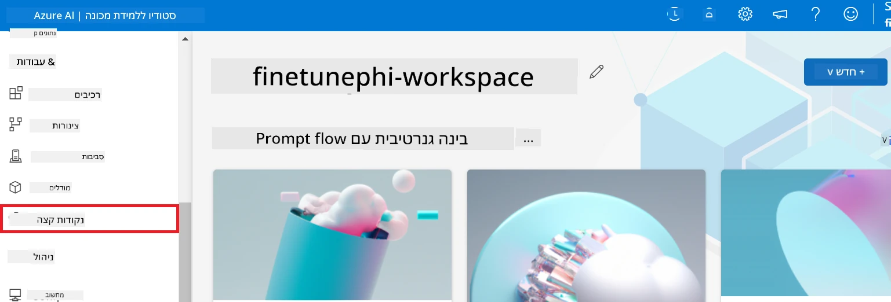

2. בחר נקודת קצה שיצרת.

    

3. בדף זה, תוכל לנהל את נקודות הקצה שנוצרו במהלך תהליך הפריסה.

## תרחיש 3: אינטגרציה עם Prompt flow ושיחה עם המודל המותאם אישית שלך

### אינטגרציה של המודל המותאם Phi-3 עם Prompt flow

לאחר שהפרסת בהצלחה את המודל שעבר כוונון עדין, כעת תוכל לשלב אותו עם Prompt flow לשימוש במודל שלך באפליקציות בזמן אמת, המאפשרות מגוון משימות אינטראקטיביות עם מודל Phi-3 המותאם אישית שלך.

#### הגדרת מפתח API וכתובת נקודת הקצה של מודל Phi-3 שכונן עדין

1. עבור למרחב העבודה של Azure Machine Learning שיצרת.
1. בחר **Endpoints** מהכרטיסייה בצד שמאל.
1. בחר נקודת קצה שיצרת.
1. בחר **Consume** מתפריט הניווט.
1. העתק והדבק את **נקודת הקצה של REST** לתוך קובץ *config.py*, והחלף את `AZURE_ML_ENDPOINT = "your_fine_tuned_model_endpoint_uri"` בכתובת **נקודת הקצה של REST** שלך.
1. העתק והדבק את **המפתח הראשי** לתוך קובץ *config.py*, והחלף את `AZURE_ML_API_KEY = "your_fine_tuned_model_api_key"` במפתח הראשי שלך.

    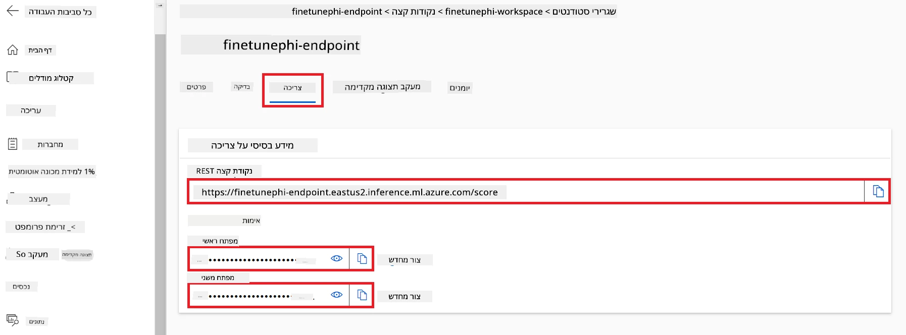

#### הוסף קוד לקובץ *flow.dag.yml*

1. פתח את הקובץ *flow.dag.yml* ב-Visual Studio Code.

1. הוסף את הקוד הבא לתוך *flow.dag.yml*.

    ```yml
    inputs:
      input_data:
        type: string
        default: "Who founded Microsoft?"

    outputs:
      answer:
        type: string
        reference: ${integrate_with_promptflow.output}

    nodes:
    - name: integrate_with_promptflow
      type: python
      source:
        type: code
        path: integrate_with_promptflow.py
      inputs:
        input_data: ${inputs.input_data}
    ```

#### הוסף קוד לקובץ *integrate_with_promptflow.py*

1. פתח את הקובץ *integrate_with_promptflow.py* ב-Visual Studio Code.

1. הוסף את הקוד הבא לתוך *integrate_with_promptflow.py*.

    ```python
    import logging
    import requests
    from promptflow.core import tool
    import asyncio
    import platform
    from config import (
        AZURE_ML_ENDPOINT,
        AZURE_ML_API_KEY
    )

    # הגדרת רישום
    logging.basicConfig(
        format="%(asctime)s - %(levelname)s - %(name)s - %(message)s",
        datefmt="%Y-%m-%d %H:%M:%S",
        level=logging.DEBUG
    )
    logger = logging.getLogger(__name__)

    def query_azml_endpoint(input_data: list, endpoint_url: str, api_key: str) -> str:
        """
        Send a request to the Azure ML endpoint with the given input data.
        """
        headers = {
            "Content-Type": "application/json",
            "Authorization": f"Bearer {api_key}"
        }
        data = {
            "input_data": [input_data],
            "params": {
                "temperature": 0.7,
                "max_new_tokens": 128,
                "do_sample": True,
                "return_full_text": True
            }
        }
        try:
            response = requests.post(endpoint_url, json=data, headers=headers)
            response.raise_for_status()
            result = response.json()[0]
            logger.info("Successfully received response from Azure ML Endpoint.")
            return result
        except requests.exceptions.RequestException as e:
            logger.error(f"Error querying Azure ML Endpoint: {e}")
            raise

    def setup_asyncio_policy():
        """
        Setup asyncio event loop policy for Windows.
        """
        if platform.system() == 'Windows':
            asyncio.set_event_loop_policy(asyncio.WindowsSelectorEventLoopPolicy())
            logger.info("Set Windows asyncio event loop policy.")

    @tool
    def my_python_tool(input_data: str) -> str:
        """
        Tool function to process input data and query the Azure ML endpoint.
        """
        setup_asyncio_policy()
        return query_azml_endpoint(input_data, AZURE_ML_ENDPOINT, AZURE_ML_API_KEY)

    ```

### שיחה עם המודל המותאם אישית שלך

1. הקלד את הפקודה הבאה כדי להריץ את הסקריפט *deploy_model.py* ולהתחיל בתהליך הפריסה ב-Azure Machine Learning.

    ```python
    pf flow serve --source ./ --port 8080 --host localhost
    ```

1. הנה דוגמה לתוצאות: כעת תוכל לשוחח עם מודל Phi-3 המותאם שלך. מומלץ לשאול שאלות המבוססות על הנתונים ששימשו לכוונון העדין.

    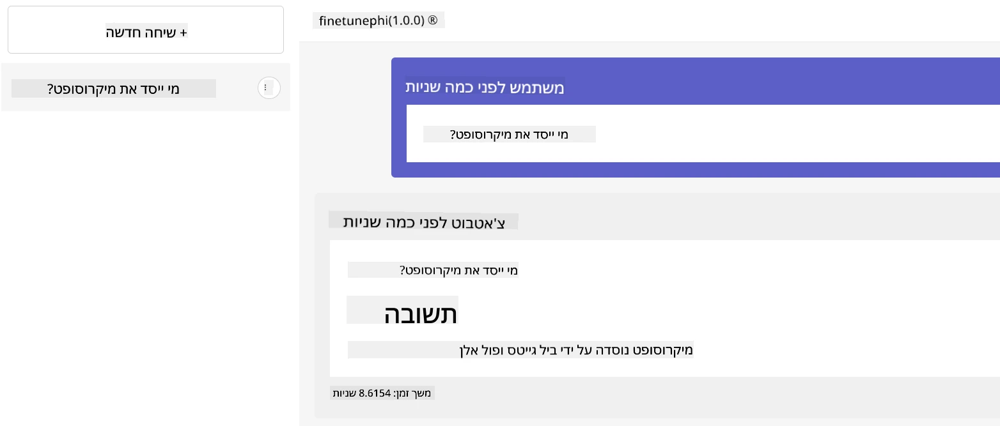

---

<!-- CO-OP TRANSLATOR DISCLAIMER START -->
**כתב ויתור**:  
מסמך זה תורגם באמצעות שירות תרגום בינה מלאכותית [Co-op Translator](https://github.com/Azure/co-op-translator). למרות שאנו שואפים לדייק, יש לקחת בחשבון כי תרגומים אוטומטיים עלולים להכיל שגיאות או אי-דיוקים. יש לראות במסמך המקורי בשפת המקור את המקור הסמכותי. למידע קריטי מומלץ להיעזר בתרגום מקצועי של אדם. איננו אחראים לכל אי-הבנות או פרשנויות שגויות הנובעות מהשימוש בתרגום זה.
<!-- CO-OP TRANSLATOR DISCLAIMER END -->