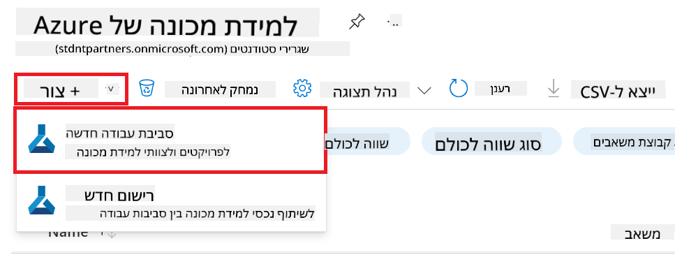
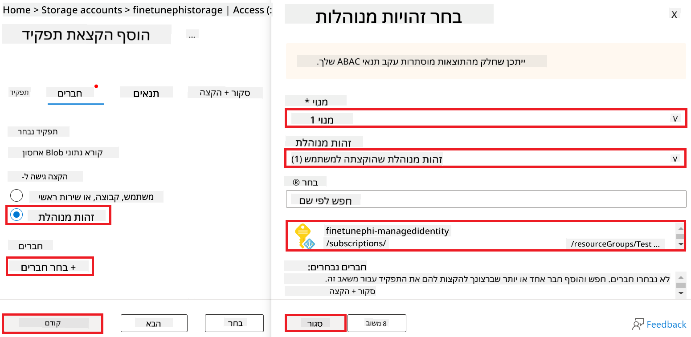
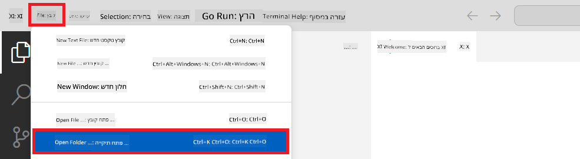
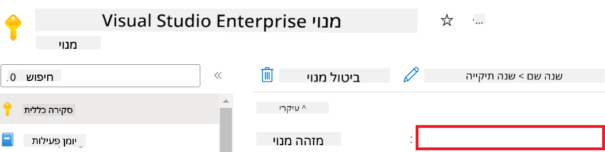
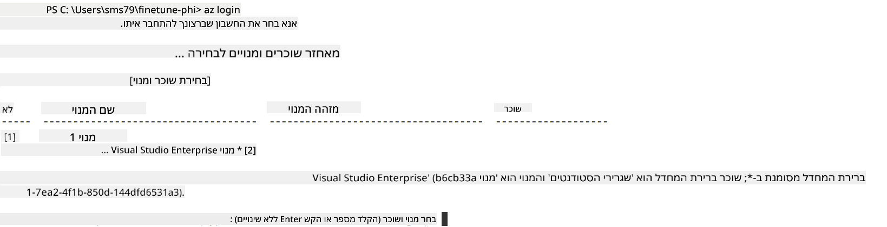
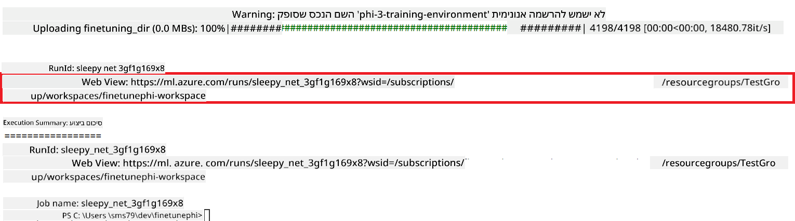

<!--
CO_OP_TRANSLATOR_METADATA:
{
  "original_hash": "455be2b7b9c3390d367d528f8fab2aa0",
  "translation_date": "2025-07-17T00:35:00+00:00",
  "source_file": "md/02.Application/01.TextAndChat/Phi3/E2E_Phi-3-FineTuning_PromptFlow_Integration.md",
  "language_code": "he"
}
-->
# כוונון מדויק ואינטגרציה של מודלים מותאמים אישית Phi-3 עם Prompt flow

דוגמת קצה-לקצה (E2E) זו מבוססת על המדריך "[Fine-Tune and Integrate Custom Phi-3 Models with Prompt Flow: Step-by-Step Guide](https://techcommunity.microsoft.com/t5/educator-developer-blog/fine-tune-and-integrate-custom-phi-3-models-with-prompt-flow/ba-p/4178612?WT.mc_id=aiml-137032-kinfeylo)" מקהילת הטכנולוגיה של מיקרוסופט. היא מציגה את התהליכים של כוונון מדויק, פריסה ואינטגרציה של מודלים מותאמים אישית Phi-3 עם Prompt flow.

## סקירה כללית

בדוגמת E2E זו תלמד כיצד לכוונן מדויק את מודל Phi-3 ולשלב אותו עם Prompt flow. באמצעות Azure Machine Learning ו-Prompt flow תקים זרימת עבודה לפריסה ושימוש במודלים מותאמים אישית של בינה מלאכותית. דוגמת E2E זו מחולקת לשלושה תרחישים:

**תרחיש 1: הקמת משאבי Azure והכנה לכוונון מדויק**

**תרחיש 2: כוונון מדויק של מודל Phi-3 ופריסה ב-Azure Machine Learning Studio**

**תרחיש 3: אינטגרציה עם Prompt flow ושיחה עם המודל המותאם שלך**

להלן סקירה כללית של דוגמת E2E זו.


### תוכן העניינים

1. **[תרחיש 1: הקמת משאבי Azure והכנה לכוונון מדויק](../../../../../../md/02.Application/01.TextAndChat/Phi3)**
    - [יצירת סביבת עבודה ב-Azure Machine Learning](../../../../../../md/02.Application/01.TextAndChat/Phi3)
    - [בקשת מכסות GPU במנוי Azure](../../../../../../md/02.Application/01.TextAndChat/Phi3)
    - [הוספת שיוך תפקיד](../../../../../../md/02.Application/01.TextAndChat/Phi3)
    - [הקמת פרויקט](../../../../../../md/02.Application/01.TextAndChat/Phi3)
    - [הכנת מערך נתונים לכוונון מדויק](../../../../../../md/02.Application/01.TextAndChat/Phi3)

1. **[תרחיש 2: כוונון מדויק של מודל Phi-3 ופריסה ב-Azure Machine Learning Studio](../../../../../../md/02.Application/01.TextAndChat/Phi3)**
    - [הקמת Azure CLI](../../../../../../md/02.Application/01.TextAndChat/Phi3)
    - [כוונון מדויק של מודל Phi-3](../../../../../../md/02.Application/01.TextAndChat/Phi3)
    - [פריסת המודל המכוונן](../../../../../../md/02.Application/01.TextAndChat/Phi3)

1. **[תרחיש 3: אינטגרציה עם Prompt flow ושיחה עם המודל המותאם שלך](../../../../../../md/02.Application/01.TextAndChat/Phi3)**
    - [אינטגרציה של מודל Phi-3 מותאם אישית עם Prompt flow](../../../../../../md/02.Application/01.TextAndChat/Phi3)
    - [שיחה עם המודל המותאם שלך](../../../../../../md/02.Application/01.TextAndChat/Phi3)

## תרחיש 1: הקמת משאבי Azure והכנה לכוונון מדויק

### יצירת סביבת עבודה ב-Azure Machine Learning

1. הקלד *azure machine learning* ב**סרגל החיפוש** בראש דף הפורטל ובחר **Azure Machine Learning** מתוך האפשרויות שמופיעות.

    

1. בחר **+ Create** מתפריט הניווט.

1. בחר **New workspace** מתפריט הניווט.

    

1. בצע את המשימות הבאות:

    - בחר את **המנוי** שלך ב-Azure.
    - בחר את **קבוצת המשאבים** לשימוש (צור חדשה במידת הצורך).
    - הזן **שם סביבת העבודה**. חייב להיות ערך ייחודי.
    - בחר את **האזור** שבו תרצה להשתמש.
    - בחר את **חשבון האחסון** לשימוש (צור חדש במידת הצורך).
    - בחר את **Key vault** לשימוש (צור חדש במידת הצורך).
    - בחר את **Application insights** לשימוש (צור חדש במידת הצורך).
    - בחר את **רישום המכולות** לשימוש (צור חדש במידת הצורך).

    

1. בחר **Review + Create**.

1. בחר **Create**.

### בקשת מכסות GPU במנוי Azure

בדוגמת E2E זו תשתמש ב-*Standard_NC24ads_A100_v4 GPU* לכוונון מדויק, שדורש בקשת מכסה, וב-*Standard_E4s_v3* CPU לפריסה, שאינה דורשת בקשת מכסה.

> [!NOTE]
>
> רק מנויים מסוג Pay-As-You-Go (המנוי הסטנדרטי) זכאים להקצאת GPU; מנויי הטבות אינם נתמכים כרגע.
>
> למשתמשים במנויי הטבות (כגון Visual Studio Enterprise Subscription) או למי שרוצה לבדוק במהירות את תהליך הכוונון והפריסה, מדריך זה מספק גם הנחיות לכוונון מדויק עם מערך נתונים מינימלי באמצעות CPU. עם זאת, חשוב לציין שהתוצאות של הכוונון המדויק טובות משמעותית כאשר משתמשים ב-GPU עם מערכי נתונים גדולים יותר.

1. בקר ב-[Azure ML Studio](https://ml.azure.com/home?wt.mc_id=studentamb_279723).

1. בצע את המשימות הבאות כדי לבקש מכסת *Standard NCADSA100v4 Family*:

    - בחר **Quota** מהכרטיסייה בצד שמאל.
    - בחר את **משפחת המכונות הווירטואליות** לשימוש. לדוגמה, בחר **Standard NCADSA100v4 Family Cluster Dedicated vCPUs**, הכוללת את ה-GPU *Standard_NC24ads_A100_v4*.
    - בחר **Request quota** מתפריט הניווט.

        

    - בדף Request quota, הזן את **מגבלת הליבות החדשה** שברצונך להשתמש בה. לדוגמה, 24.
    - בדף Request quota, בחר **Submit** כדי לבקש את מכסת ה-GPU.

> [!NOTE]
> ניתן לבחור את ה-GPU או ה-CPU המתאים לצרכיך על ידי עיון במסמך [Sizes for Virtual Machines in Azure](https://learn.microsoft.com/azure/virtual-machines/sizes/overview?tabs=breakdownseries%2Cgeneralsizelist%2Ccomputesizelist%2Cmemorysizelist%2Cstoragesizelist%2Cgpusizelist%2Cfpgasizelist%2Chpcsizelist).

### הוספת שיוך תפקיד

כדי לכוונן מדויק ולפרוס את המודלים שלך, עליך קודם ליצור User Assigned Managed Identity (UAI) ולהקצות לה את ההרשאות המתאימות. UAI זה ישמש לאימות במהלך הפריסה.

#### יצירת User Assigned Managed Identity (UAI)

1. הקלד *managed identities* ב**סרגל החיפוש** בראש דף הפורטל ובחר **Managed Identities** מתוך האפשרויות שמופיעות.

    

1. בחר **+ Create**.

    

1. בצע את המשימות הבאות:

    - בחר את **המנוי** שלך ב-Azure.
    - בחר את **קבוצת המשאבים** לשימוש (צור חדשה במידת הצורך).
    - בחר את **האזור** שבו תרצה להשתמש.
    - הזן את ה**שם**. חייב להיות ערך ייחודי.

1. בחר **Review + create**.

1. בחר **+ Create**.

#### הוספת שיוך תפקיד Contributor ל-Managed Identity

1. עבור למשאב Managed Identity שיצרת.

1. בחר **Azure role assignments** מהכרטיסייה בצד שמאל.

1. בחר **+Add role assignment** מתפריט הניווט.

1. בדף Add role assignment, בצע את המשימות הבאות:
    - בחר את **היקף** ל-**Resource group**.
    - בחר את **המנוי** שלך ב-Azure.
    - בחר את **קבוצת המשאבים** לשימוש.
    - בחר את **התפקיד** ל-**Contributor**.

    

1. בחר **Save**.

#### הוספת שיוך תפקיד Storage Blob Data Reader ל-Managed Identity

1. הקלד *storage accounts* ב**סרגל החיפוש** בראש דף הפורטל ובחר **Storage accounts** מתוך האפשרויות שמופיעות.

    

1. בחר את חשבון האחסון המשויך לסביבת העבודה של Azure Machine Learning שיצרת. לדוגמה, *finetunephistorage*.

1. בצע את המשימות הבאות כדי לנווט לדף Add role assignment:

    - עבור לחשבון האחסון של Azure שיצרת.
    - בחר **Access Control (IAM)** מהכרטיסייה בצד שמאל.
    - בחר **+ Add** מתפריט הניווט.
    - בחר **Add role assignment** מתפריט הניווט.

    

1. בדף Add role assignment, בצע את המשימות הבאות:

    - בדף Role, הקלד *Storage Blob Data Reader* ב**סרגל החיפוש** ובחר **Storage Blob Data Reader** מתוך האפשרויות שמופיעות.
    - בדף Role, בחר **Next**.
    - בדף Members, בחר **Assign access to** **Managed identity**.
    - בדף Members, בחר **+ Select members**.
    - בדף Select managed identities, בחר את **המנוי** שלך ב-Azure.
    - בדף Select managed identities, בחר את ה-**Managed identity** ל-**Manage Identity**.
    - בדף Select managed identities, בחר את ה-Manage Identity שיצרת. לדוגמה, *finetunephi-managedidentity*.
    - בדף Select managed identities, בחר **Select**.

    

1. בחר **Review + assign**.

#### הוספת שיוך תפקיד AcrPull ל-Managed Identity

1. הקלד *container registries* ב**סרגל החיפוש** בראש דף הפורטל ובחר **Container registries** מתוך האפשרויות שמופיעות.

    

1. בחר את רישום המכולות המשויך לסביבת העבודה של Azure Machine Learning. לדוגמה, *finetunephicontainerregistries*

1. בצע את המשימות הבאות כדי לנווט לדף Add role assignment:

    - בחר **Access Control (IAM)** מהכרטיסייה בצד שמאל.
    - בחר **+ Add** מתפריט הניווט.
    - בחר **Add role assignment** מתפריט הניווט.

1. בדף Add role assignment, בצע את המשימות הבאות:

    - בדף Role, הקלד *AcrPull* ב**סרגל החיפוש** ובחר **AcrPull** מתוך האפשרויות שמופיעות.
    - בדף Role, בחר **Next**.
    - בדף Members, בחר **Assign access to** **Managed identity**.
    - בדף Members, בחר **+ Select members**.
    - בדף Select managed identities, בחר את **המנוי** שלך ב-Azure.
    - בדף Select managed identities, בחר את ה-**Managed identity** ל-**Manage Identity**.
    - בדף Select managed identities, בחר את ה-Manage Identity שיצרת. לדוגמה, *finetunephi-managedidentity*.
    - בדף Select managed identities, בחר **Select**.
    - בחר **Review + assign**.

### הקמת פרויקט

כעת, תיצור תיקייה לעבודה ותקים סביבה וירטואלית לפיתוח תוכנית שמתקשרת עם משתמשים ומשתמשת בהיסטוריית שיחות מאוחסנת ב-Azure Cosmos DB כדי להעשיר את התגובות שלה.

#### יצירת תיקייה לעבודה בתוכה

1. פתח חלון טרמינל והקלד את הפקודה הבאה ליצירת תיקייה בשם *finetune-phi* בנתיב ברירת המחדל.

    ```console
    mkdir finetune-phi
    ```

1. הקלד את הפקודה הבאה בטרמינל כדי לנווט לתיקיית *finetune-phi* שיצרת.

    ```console
    cd finetune-phi
    ```

#### יצירת סביבה וירטואלית

1. הקלד את הפקודה הבאה בטרמינל כדי ליצור סביבה וירטואלית בשם *.venv*.

    ```console
    python -m venv .venv
    ```

1. הקלד את הפקודה הבאה בטרמינל כדי להפעיל את הסביבה הווירטואלית.

    ```console
    .venv\Scripts\activate.bat
    ```
> [!NOTE]
>
> אם זה עבד, אמור להופיע *(.venv)* לפני שורת הפקודה.
#### התקן את החבילות הנדרשות

1. הקלד את הפקודות הבאות בתוך הטרמינל שלך כדי להתקין את החבילות הנדרשות.

    ```console
    pip install datasets==2.19.1
    pip install transformers==4.41.1
    pip install azure-ai-ml==1.16.0
    pip install torch==2.3.1
    pip install trl==0.9.4
    pip install promptflow==1.12.0
    ```

#### צור קבצי פרויקט

בתרגיל זה, תיצור את הקבצים החיוניים לפרויקט שלנו. קבצים אלה כוללים סקריפטים להורדת מערך הנתונים, הגדרת סביבת Azure Machine Learning, כוונון מדויק של מודל Phi-3, ופריסת המודל המכוונן. בנוסף, תיצור קובץ *conda.yml* להגדרת סביבת הכוונון.

בתרגיל זה תבצע:

- יצירת קובץ *download_dataset.py* להורדת מערך הנתונים.
- יצירת קובץ *setup_ml.py* להגדרת סביבת Azure Machine Learning.
- יצירת קובץ *fine_tune.py* בתיקיית *finetuning_dir* לכוונון מדויק של מודל Phi-3 באמצעות מערך הנתונים.
- יצירת קובץ *conda.yml* להגדרת סביבת הכוונון.
- יצירת קובץ *deploy_model.py* לפריסת המודל המכוונן.
- יצירת קובץ *integrate_with_promptflow.py* לשילוב המודל המכוונן והפעלתו באמצעות Prompt flow.
- יצירת קובץ flow.dag.yml להגדרת מבנה זרימת העבודה עבור Prompt flow.
- יצירת קובץ *config.py* להזנת פרטי Azure.

> [!NOTE]
>
> מבנה התיקיות המלא:
>
> ```text
> └── YourUserName
> .    └── finetune-phi
> .        ├── finetuning_dir
> .        │      └── fine_tune.py
> .        ├── conda.yml
> .        ├── config.py
> .        ├── deploy_model.py
> .        ├── download_dataset.py
> .        ├── flow.dag.yml
> .        ├── integrate_with_promptflow.py
> .        └── setup_ml.py
> ```

1. פתח את **Visual Studio Code**.

1. בחר **File** בסרגל התפריטים.

1. בחר **Open Folder**.

1. בחר את תיקיית *finetune-phi* שיצרת, הממוקמת ב-*C:\Users\yourUserName\finetune-phi*.

    

1. בלוח השמאלי של Visual Studio Code, לחץ קליק ימני ובחר **New File** ליצירת קובץ חדש בשם *download_dataset.py*.

1. בלוח השמאלי של Visual Studio Code, לחץ קליק ימני ובחר **New File** ליצירת קובץ חדש בשם *setup_ml.py*.

1. בלוח השמאלי של Visual Studio Code, לחץ קליק ימני ובחר **New File** ליצירת קובץ חדש בשם *deploy_model.py*.

    

1. בלוח השמאלי של Visual Studio Code, לחץ קליק ימני ובחר **New Folder** ליצירת תיקייה חדשה בשם *finetuning_dir*.

1. בתיקיית *finetuning_dir*, צור קובץ חדש בשם *fine_tune.py*.

#### צור והגדר את קובץ *conda.yml*

1. בלוח השמאלי של Visual Studio Code, לחץ קליק ימני ובחר **New File** ליצירת קובץ חדש בשם *conda.yml*.

1. הוסף את הקוד הבא לקובץ *conda.yml* כדי להגדיר את סביבת הכוונון המדויק עבור מודל Phi-3.

    ```yml
    name: phi-3-training-env
    channels:
      - defaults
      - conda-forge
    dependencies:
      - python=3.10
      - pip
      - numpy<2.0
      - pip:
          - torch==2.4.0
          - torchvision==0.19.0
          - trl==0.8.6
          - transformers==4.41
          - datasets==2.21.0
          - azureml-core==1.57.0
          - azure-storage-blob==12.19.0
          - azure-ai-ml==1.16
          - azure-identity==1.17.1
          - accelerate==0.33.0
          - mlflow==2.15.1
          - azureml-mlflow==1.57.0
    ```

#### צור והגדר את קובץ *config.py*

1. בלוח השמאלי של Visual Studio Code, לחץ קליק ימני ובחר **New File** ליצירת קובץ חדש בשם *config.py*.

1. הוסף את הקוד הבא לקובץ *config.py* כדי לכלול את פרטי Azure שלך.

    ```python
    # Azure settings
    AZURE_SUBSCRIPTION_ID = "your_subscription_id"
    AZURE_RESOURCE_GROUP_NAME = "your_resource_group_name" # "TestGroup"

    # Azure Machine Learning settings
    AZURE_ML_WORKSPACE_NAME = "your_workspace_name" # "finetunephi-workspace"

    # Azure Managed Identity settings
    AZURE_MANAGED_IDENTITY_CLIENT_ID = "your_azure_managed_identity_client_id"
    AZURE_MANAGED_IDENTITY_NAME = "your_azure_managed_identity_name" # "finetunephi-mangedidentity"
    AZURE_MANAGED_IDENTITY_RESOURCE_ID = f"/subscriptions/{AZURE_SUBSCRIPTION_ID}/resourceGroups/{AZURE_RESOURCE_GROUP_NAME}/providers/Microsoft.ManagedIdentity/userAssignedIdentities/{AZURE_MANAGED_IDENTITY_NAME}"

    # Dataset file paths
    TRAIN_DATA_PATH = "data/train_data.jsonl"
    TEST_DATA_PATH = "data/test_data.jsonl"

    # Fine-tuned model settings
    AZURE_MODEL_NAME = "your_fine_tuned_model_name" # "finetune-phi-model"
    AZURE_ENDPOINT_NAME = "your_fine_tuned_model_endpoint_name" # "finetune-phi-endpoint"
    AZURE_DEPLOYMENT_NAME = "your_fine_tuned_model_deployment_name" # "finetune-phi-deployment"

    AZURE_ML_API_KEY = "your_fine_tuned_model_api_key"
    AZURE_ML_ENDPOINT = "your_fine_tuned_model_endpoint_uri" # "https://{your-endpoint-name}.{your-region}.inference.ml.azure.com/score"
    ```

#### הוסף משתני סביבה של Azure

1. בצע את המשימות הבאות להוספת מזהה המנוי (Subscription ID) של Azure:

    - הקלד *subscriptions* בשורת החיפוש בראש דף הפורטל ובחר **Subscriptions** מהאפשרויות שמופיעות.
    - בחר את מנוי Azure שבו אתה משתמש כרגע.
    - העתק והדבק את מזהה המנוי שלך לקובץ *config.py*.

    

1. בצע את המשימות הבאות להוספת שם סביבת העבודה (Workspace Name) של Azure:

    - עבור למשאב Azure Machine Learning שיצרת.
    - העתק והדבק את שם החשבון שלך לקובץ *config.py*.

    

1. בצע את המשימות הבאות להוספת שם קבוצת המשאבים (Resource Group Name) של Azure:

    - עבור למשאב Azure Machine Learning שיצרת.
    - העתק והדבק את שם קבוצת המשאבים של Azure לקובץ *config.py*.

    

2. בצע את המשימות הבאות להוספת שם הזהות המנוהלת (Managed Identity) של Azure:

    - עבור למשאב Managed Identities שיצרת.
    - העתק והדבק את שם הזהות המנוהלת של Azure לקובץ *config.py*.

    

### הכנת מערך הנתונים לכוונון מדויק

בתרגיל זה, תריץ את הקובץ *download_dataset.py* להורדת מערכי הנתונים *ULTRACHAT_200k* לסביבת העבודה המקומית שלך. לאחר מכן תשתמש במערכי הנתונים הללו כדי לכוונן את מודל Phi-3 ב-Azure Machine Learning.

#### הורד את מערך הנתונים שלך באמצעות *download_dataset.py*

1. פתח את הקובץ *download_dataset.py* ב-Visual Studio Code.

1. הוסף את הקוד הבא לקובץ *download_dataset.py*.

    ```python
    import json
    import os
    from datasets import load_dataset
    from config import (
        TRAIN_DATA_PATH,
        TEST_DATA_PATH)

    def load_and_split_dataset(dataset_name, config_name, split_ratio):
        """
        Load and split a dataset.
        """
        # Load the dataset with the specified name, configuration, and split ratio
        dataset = load_dataset(dataset_name, config_name, split=split_ratio)
        print(f"Original dataset size: {len(dataset)}")
        
        # Split the dataset into train and test sets (80% train, 20% test)
        split_dataset = dataset.train_test_split(test_size=0.2)
        print(f"Train dataset size: {len(split_dataset['train'])}")
        print(f"Test dataset size: {len(split_dataset['test'])}")
        
        return split_dataset

    def save_dataset_to_jsonl(dataset, filepath):
        """
        Save a dataset to a JSONL file.
        """
        # Create the directory if it does not exist
        os.makedirs(os.path.dirname(filepath), exist_ok=True)
        
        # Open the file in write mode
        with open(filepath, 'w', encoding='utf-8') as f:
            # Iterate over each record in the dataset
            for record in dataset:
                # Dump the record as a JSON object and write it to the file
                json.dump(record, f)
                # Write a newline character to separate records
                f.write('\n')
        
        print(f"Dataset saved to {filepath}")

    def main():
        """
        Main function to load, split, and save the dataset.
        """
        # Load and split the ULTRACHAT_200k dataset with a specific configuration and split ratio
        dataset = load_and_split_dataset("HuggingFaceH4/ultrachat_200k", 'default', 'train_sft[:1%]')
        
        # Extract the train and test datasets from the split
        train_dataset = dataset['train']
        test_dataset = dataset['test']

        # Save the train dataset to a JSONL file
        save_dataset_to_jsonl(train_dataset, TRAIN_DATA_PATH)
        
        # Save the test dataset to a separate JSONL file
        save_dataset_to_jsonl(test_dataset, TEST_DATA_PATH)

    if __name__ == "__main__":
        main()

    ```

> [!TIP]
>
> **הנחיות לכוונון מדויק עם מערך נתונים מינימלי באמצעות CPU**
>
> אם ברצונך להשתמש ב-CPU לכוונון, גישה זו מתאימה למי שיש לו מנויים עם הטבות (כגון Visual Studio Enterprise Subscription) או למי שרוצה לבדוק במהירות את תהליך הכוונון והפריסה.
>
> החלף את `dataset = load_and_split_dataset("HuggingFaceH4/ultrachat_200k", 'default', 'train_sft[:1%]')` ב-`dataset = load_and_split_dataset("HuggingFaceH4/ultrachat_200k", 'default', 'train_sft[:10]')`
>

1. הקלד את הפקודה הבאה בתוך הטרמינל שלך כדי להריץ את הסקריפט ולהוריד את מערך הנתונים לסביבת העבודה המקומית.

    ```console
    python download_data.py
    ```

1. ודא שמערכי הנתונים נשמרו בהצלחה בתיקיית *finetune-phi/data* המקומית שלך.

> [!NOTE]
>
> **גודל מערך הנתונים וזמן הכוונון המדויק**
>
> בדוגמת E2E זו, אתה משתמש רק ב-1% ממערך הנתונים (`train_sft[:1%]`). זה מקטין משמעותית את כמות הנתונים, ומאיץ הן את תהליך ההעלאה והן את תהליך הכוונון המדויק. ניתן להתאים את האחוז כדי למצוא את האיזון הנכון בין זמן האימון לביצועי המודל. שימוש בתת-מערך קטן יותר מקטין את זמן הכוונון, מה שהופך את התהליך לנוח יותר לדוגמת E2E.

## תרחיש 2: כוונון מדויק של מודל Phi-3 ופריסה ב-Azure Machine Learning Studio

### הגדרת Azure CLI

עליך להגדיר את Azure CLI כדי לאמת את הסביבה שלך. Azure CLI מאפשר לך לנהל משאבי Azure ישירות משורת הפקודה ומספק את האישורים הדרושים ל-Azure Machine Learning לגישה למשאבים אלה. כדי להתחיל, התקן את [Azure CLI](https://learn.microsoft.com/cli/azure/install-azure-cli)

1. פתח חלון טרמינל והקלד את הפקודה הבאה כדי להתחבר לחשבון Azure שלך.

    ```console
    az login
    ```

1. בחר את חשבון Azure שבו ברצונך להשתמש.

1. בחר את מנוי Azure שבו ברצונך להשתמש.

    

> [!TIP]
>
> אם יש לך קושי להתחבר ל-Azure, נסה להשתמש בקוד מכשיר. פתח חלון טרמינל והקלד את הפקודה הבאה כדי להתחבר לחשבון Azure שלך:
>
> ```console
> az login --use-device-code
> ```
>

### כוונון מדויק של מודל Phi-3

בתרגיל זה, תכוונן את מודל Phi-3 באמצעות מערך הנתונים שסופק. תחילה תגדיר את תהליך הכוונון המדויק בקובץ *fine_tune.py*. לאחר מכן תגדיר את סביבת Azure Machine Learning ותתחיל את תהליך הכוונון על ידי הרצת קובץ *setup_ml.py*. סקריפט זה מבטיח שהכוונון יתבצע בתוך סביבת Azure Machine Learning.

בהרצת *setup_ml.py*, תפעיל את תהליך הכוונון המדויק בסביבת Azure Machine Learning.

#### הוסף קוד לקובץ *fine_tune.py*

1. עבור לתיקיית *finetuning_dir* ופתח את הקובץ *fine_tune.py* ב-Visual Studio Code.

1. הוסף את הקוד הבא לקובץ *fine_tune.py*.

    ```python
    import argparse
    import sys
    import logging
    import os
    from datasets import load_dataset
    import torch
    import mlflow
    from transformers import AutoModelForCausalLM, AutoTokenizer, TrainingArguments
    from trl import SFTTrainer

    # To avoid the INVALID_PARAMETER_VALUE error in MLflow, disable MLflow integration
    os.environ["DISABLE_MLFLOW_INTEGRATION"] = "True"

    # Logging setup
    logging.basicConfig(
        format="%(asctime)s - %(levelname)s - %(name)s - %(message)s",
        datefmt="%Y-%m-%d %H:%M:%S",
        handlers=[logging.StreamHandler(sys.stdout)],
        level=logging.WARNING
    )
    logger = logging.getLogger(__name__)

    def initialize_model_and_tokenizer(model_name, model_kwargs):
        """
        Initialize the model and tokenizer with the given pretrained model name and arguments.
        """
        model = AutoModelForCausalLM.from_pretrained(model_name, **model_kwargs)
        tokenizer = AutoTokenizer.from_pretrained(model_name)
        tokenizer.model_max_length = 2048
        tokenizer.pad_token = tokenizer.unk_token
        tokenizer.pad_token_id = tokenizer.convert_tokens_to_ids(tokenizer.pad_token)
        tokenizer.padding_side = 'right'
        return model, tokenizer

    def apply_chat_template(example, tokenizer):
        """
        Apply a chat template to tokenize messages in the example.
        """
        messages = example["messages"]
        if messages[0]["role"] != "system":
            messages.insert(0, {"role": "system", "content": ""})
        example["text"] = tokenizer.apply_chat_template(
            messages, tokenize=False, add_generation_prompt=False
        )
        return example

    def load_and_preprocess_data(train_filepath, test_filepath, tokenizer):
        """
        Load and preprocess the dataset.
        """
        train_dataset = load_dataset('json', data_files=train_filepath, split='train')
        test_dataset = load_dataset('json', data_files=test_filepath, split='train')
        column_names = list(train_dataset.features)

        train_dataset = train_dataset.map(
            apply_chat_template,
            fn_kwargs={"tokenizer": tokenizer},
            num_proc=10,
            remove_columns=column_names,
            desc="Applying chat template to train dataset",
        )

        test_dataset = test_dataset.map(
            apply_chat_template,
            fn_kwargs={"tokenizer": tokenizer},
            num_proc=10,
            remove_columns=column_names,
            desc="Applying chat template to test dataset",
        )

        return train_dataset, test_dataset

    def train_and_evaluate_model(train_dataset, test_dataset, model, tokenizer, output_dir):
        """
        Train and evaluate the model.
        """
        training_args = TrainingArguments(
            bf16=True,
            do_eval=True,
            output_dir=output_dir,
            eval_strategy="epoch",
            learning_rate=5.0e-06,
            logging_steps=20,
            lr_scheduler_type="cosine",
            num_train_epochs=3,
            overwrite_output_dir=True,
            per_device_eval_batch_size=4,
            per_device_train_batch_size=4,
            remove_unused_columns=True,
            save_steps=500,
            seed=0,
            gradient_checkpointing=True,
            gradient_accumulation_steps=1,
            warmup_ratio=0.2,
        )

        trainer = SFTTrainer(
            model=model,
            args=training_args,
            train_dataset=train_dataset,
            eval_dataset=test_dataset,
            max_seq_length=2048,
            dataset_text_field="text",
            tokenizer=tokenizer,
            packing=True
        )

        train_result = trainer.train()
        trainer.log_metrics("train", train_result.metrics)

        mlflow.transformers.log_model(
            transformers_model={"model": trainer.model, "tokenizer": tokenizer},
            artifact_path=output_dir,
        )

        tokenizer.padding_side = 'left'
        eval_metrics = trainer.evaluate()
        eval_metrics["eval_samples"] = len(test_dataset)
        trainer.log_metrics("eval", eval_metrics)

    def main(train_file, eval_file, model_output_dir):
        """
        Main function to fine-tune the model.
        """
        model_kwargs = {
            "use_cache": False,
            "trust_remote_code": True,
            "torch_dtype": torch.bfloat16,
            "device_map": None,
            "attn_implementation": "eager"
        }

        # pretrained_model_name = "microsoft/Phi-3-mini-4k-instruct"
        pretrained_model_name = "microsoft/Phi-3.5-mini-instruct"

        with mlflow.start_run():
            model, tokenizer = initialize_model_and_tokenizer(pretrained_model_name, model_kwargs)
            train_dataset, test_dataset = load_and_preprocess_data(train_file, eval_file, tokenizer)
            train_and_evaluate_model(train_dataset, test_dataset, model, tokenizer, model_output_dir)

    if __name__ == "__main__":
        parser = argparse.ArgumentParser()
        parser.add_argument("--train-file", type=str, required=True, help="Path to the training data")
        parser.add_argument("--eval-file", type=str, required=True, help="Path to the evaluation data")
        parser.add_argument("--model_output_dir", type=str, required=True, help="Directory to save the fine-tuned model")
        args = parser.parse_args()
        main(args.train_file, args.eval_file, args.model_output_dir)

    ```

1. שמור וסגור את הקובץ *fine_tune.py*.

> [!TIP]
> **ניתן לכוונן את מודל Phi-3.5**
>
> בקובץ *fine_tune.py*, ניתן לשנות את `pretrained_model_name` מ-`"microsoft/Phi-3-mini-4k-instruct"` לכל מודל שתרצה לכוונן. לדוגמה, אם תשנה ל-`"microsoft/Phi-3.5-mini-instruct"`, תשתמש במודל Phi-3.5-mini-instruct לכוונון. כדי למצוא ולהשתמש בשם המודל המועדף עליך, בקר ב-[Hugging Face](https://huggingface.co/), חפש את המודל שמעניין אותך, והעתק את שמו לשדה `pretrained_model_name` בסקריפט שלך.
>
> :::image type="content" source="../../imgs/03/FineTuning-PromptFlow/finetunephi3.5.png" alt-text="כוונון מדויק של Phi-3.5.":::
>

#### הוסף קוד לקובץ *setup_ml.py*

1. פתח את הקובץ *setup_ml.py* ב-Visual Studio Code.

1. הוסף את הקוד הבא לקובץ *setup_ml.py*.

    ```python
    import logging
    from azure.ai.ml import MLClient, command, Input
    from azure.ai.ml.entities import Environment, AmlCompute
    from azure.identity import AzureCliCredential
    from config import (
        AZURE_SUBSCRIPTION_ID,
        AZURE_RESOURCE_GROUP_NAME,
        AZURE_ML_WORKSPACE_NAME,
        TRAIN_DATA_PATH,
        TEST_DATA_PATH
    )

    # Constants

    # Uncomment the following lines to use a CPU instance for training
    # COMPUTE_INSTANCE_TYPE = "Standard_E16s_v3" # cpu
    # COMPUTE_NAME = "cpu-e16s-v3"
    # DOCKER_IMAGE_NAME = "mcr.microsoft.com/azureml/openmpi4.1.0-ubuntu20.04:latest"

    # Uncomment the following lines to use a GPU instance for training
    COMPUTE_INSTANCE_TYPE = "Standard_NC24ads_A100_v4"
    COMPUTE_NAME = "gpu-nc24s-a100-v4"
    DOCKER_IMAGE_NAME = "mcr.microsoft.com/azureml/curated/acft-hf-nlp-gpu:59"

    CONDA_FILE = "conda.yml"
    LOCATION = "eastus2" # Replace with the location of your compute cluster
    FINETUNING_DIR = "./finetuning_dir" # Path to the fine-tuning script
    TRAINING_ENV_NAME = "phi-3-training-environment" # Name of the training environment
    MODEL_OUTPUT_DIR = "./model_output" # Path to the model output directory in azure ml

    # Logging setup to track the process
    logger = logging.getLogger(__name__)
    logging.basicConfig(
        format="%(asctime)s - %(levelname)s - %(name)s - %(message)s",
        datefmt="%Y-%m-%d %H:%M:%S",
        level=logging.WARNING
    )

    def get_ml_client():
        """
        Initialize the ML Client using Azure CLI credentials.
        """
        credential = AzureCliCredential()
        return MLClient(credential, AZURE_SUBSCRIPTION_ID, AZURE_RESOURCE_GROUP_NAME, AZURE_ML_WORKSPACE_NAME)

    def create_or_get_environment(ml_client):
        """
        Create or update the training environment in Azure ML.
        """
        env = Environment(
            image=DOCKER_IMAGE_NAME,  # Docker image for the environment
            conda_file=CONDA_FILE,  # Conda environment file
            name=TRAINING_ENV_NAME,  # Name of the environment
        )
        return ml_client.environments.create_or_update(env)

    def create_or_get_compute_cluster(ml_client, compute_name, COMPUTE_INSTANCE_TYPE, location):
        """
        Create or update the compute cluster in Azure ML.
        """
        try:
            compute_cluster = ml_client.compute.get(compute_name)
            logger.info(f"Compute cluster '{compute_name}' already exists. Reusing it for the current run.")
        except Exception:
            logger.info(f"Compute cluster '{compute_name}' does not exist. Creating a new one with size {COMPUTE_INSTANCE_TYPE}.")
            compute_cluster = AmlCompute(
                name=compute_name,
                size=COMPUTE_INSTANCE_TYPE,
                location=location,
                tier="Dedicated",  # Tier of the compute cluster
                min_instances=0,  # Minimum number of instances
                max_instances=1  # Maximum number of instances
            )
            ml_client.compute.begin_create_or_update(compute_cluster).wait()  # Wait for the cluster to be created
        return compute_cluster

    def create_fine_tuning_job(env, compute_name):
        """
        Set up the fine-tuning job in Azure ML.
        """
        return command(
            code=FINETUNING_DIR,  # Path to fine_tune.py
            command=(
                "python fine_tune.py "
                "--train-file ${{inputs.train_file}} "
                "--eval-file ${{inputs.eval_file}} "
                "--model_output_dir ${{inputs.model_output}}"
            ),
            environment=env,  # Training environment
            compute=compute_name,  # Compute cluster to use
            inputs={
                "train_file": Input(type="uri_file", path=TRAIN_DATA_PATH),  # Path to the training data file
                "eval_file": Input(type="uri_file", path=TEST_DATA_PATH),  # Path to the evaluation data file
                "model_output": MODEL_OUTPUT_DIR
            }
        )

    def main():
        """
        Main function to set up and run the fine-tuning job in Azure ML.
        """
        # Initialize ML Client
        ml_client = get_ml_client()

        # Create Environment
        env = create_or_get_environment(ml_client)
        
        # Create or get existing compute cluster
        create_or_get_compute_cluster(ml_client, COMPUTE_NAME, COMPUTE_INSTANCE_TYPE, LOCATION)

        # Create and Submit Fine-Tuning Job
        job = create_fine_tuning_job(env, COMPUTE_NAME)
        returned_job = ml_client.jobs.create_or_update(job)  # Submit the job
        ml_client.jobs.stream(returned_job.name)  # Stream the job logs
        
        # Capture the job name
        job_name = returned_job.name
        print(f"Job name: {job_name}")

    if __name__ == "__main__":
        main()

    ```

1. החלף את `COMPUTE_INSTANCE_TYPE`, `COMPUTE_NAME`, ו-`LOCATION` בפרטים הספציפיים שלך.

    ```python
   # Uncomment the following lines to use a GPU instance for training
    COMPUTE_INSTANCE_TYPE = "Standard_NC24ads_A100_v4"
    COMPUTE_NAME = "gpu-nc24s-a100-v4"
    ...
    LOCATION = "eastus2" # Replace with the location of your compute cluster
    ```

> [!TIP]
>
> **הנחיות לכוונון מדויק עם מערך נתונים מינימלי באמצעות CPU**
>
> אם ברצונך להשתמש ב-CPU לכוונון, גישה זו מתאימה למי שיש לו מנויים עם הטבות (כגון Visual Studio Enterprise Subscription) או למי שרוצה לבדוק במהירות את תהליך הכוונון והפריסה.
>
> 1. פתח את קובץ *setup_ml*.
> 1. החלף את `COMPUTE_INSTANCE_TYPE`, `COMPUTE_NAME`, ו-`DOCKER_IMAGE_NAME` עם הערכים הבאים. אם אין לך גישה ל-*Standard_E16s_v3*, תוכל להשתמש במכונה שווה ערך עם CPU או לבקש הקצאת משאבים חדשה.
> 1. החלף את `LOCATION` בפרטים הספציפיים שלך.
>
>    ```python
>    # Uncomment the following lines to use a CPU instance for training
>    COMPUTE_INSTANCE_TYPE = "Standard_E16s_v3" # cpu
>    COMPUTE_NAME = "cpu-e16s-v3"
>    DOCKER_IMAGE_NAME = "mcr.microsoft.com/azureml/openmpi4.1.0-ubuntu20.04:latest"
>    LOCATION = "eastus2" # Replace with the location of your compute cluster
>    ```
>

1. הקלד את הפקודה הבאה כדי להריץ את סקריפט *setup_ml.py* ולהתחיל את תהליך הכוונון המדויק ב-Azure Machine Learning.

    ```python
    python setup_ml.py
    ```

1. בתרגיל זה, כווננת בהצלחה את מודל Phi-3 באמצעות Azure Machine Learning. בהרצת סקריפט *setup_ml.py*, הגדרת את סביבת Azure Machine Learning והתחלת את תהליך הכוונון שהוגדר בקובץ *fine_tune.py*. שים לב שתהליך הכוונון עשוי לקחת זמן משמעותי. לאחר הרצת הפקודה `python setup_ml.py`, עליך להמתין לסיום התהליך. ניתן לעקוב אחר מצב עבודת הכוונון באמצעות הקישור שמופיע בטרמינל לפורטל Azure Machine Learning.

    

### פריסת המודל המכוונן

כדי לשלב את מודל Phi-3 המכוונן עם Prompt Flow, עליך לפרוס את המודל כדי שיהיה נגיש לביצוע חיזוי בזמן אמת. תהליך זה כולל רישום המודל, יצירת נקודת קצה מקוונת, ופריסת המודל.

#### הגדר את שם המודל, שם נקודת הקצה ושם הפריסה

1. פתח את קובץ *config.py*.

1. החלף את `AZURE_MODEL_NAME = "your_fine_tuned_model_name"` בשם הרצוי למודל שלך.

1. החלף את `AZURE_ENDPOINT_NAME = "your_fine_tuned_model_endpoint_name"` בשם הרצוי לנקודת הקצה שלך.

1. החלף את `AZURE_DEPLOYMENT_NAME = "your_fine_tuned_model_deployment_name"` בשם הרצוי לפריסה שלך.

#### הוסף קוד לקובץ *deploy_model.py*

הרצת קובץ *deploy_model.py* מאוטומטת את כל תהליך הפריסה. היא מבצעת רישום של המודל, יוצרת נקודת קצה, ומבצעת את הפריסה בהתאם להגדרות שבקובץ *config.py*, הכוללות את שם המודל, שם נקודת הקצה ושם הפריסה.

1. פתח את הקובץ *deploy_model.py* ב-Visual Studio Code.

1. הוסף את הקוד הבא לקובץ *deploy_model.py*.

    ```python
    import logging
    from azure.identity import AzureCliCredential
    from azure.ai.ml import MLClient
    from azure.ai.ml.entities import Model, ProbeSettings, ManagedOnlineEndpoint, ManagedOnlineDeployment, IdentityConfiguration, ManagedIdentityConfiguration, OnlineRequestSettings
    from azure.ai.ml.constants import AssetTypes

    # Configuration imports
    from config import (
        AZURE_SUBSCRIPTION_ID,
        AZURE_RESOURCE_GROUP_NAME,
        AZURE_ML_WORKSPACE_NAME,
        AZURE_MANAGED_IDENTITY_RESOURCE_ID,
        AZURE_MANAGED_IDENTITY_CLIENT_ID,
        AZURE_MODEL_NAME,
        AZURE_ENDPOINT_NAME,
        AZURE_DEPLOYMENT_NAME
    )

    # Constants
    JOB_NAME = "your-job-name"
    COMPUTE_INSTANCE_TYPE = "Standard_E4s_v3"

    deployment_env_vars = {
        "SUBSCRIPTION_ID": AZURE_SUBSCRIPTION_ID,
        "RESOURCE_GROUP_NAME": AZURE_RESOURCE_GROUP_NAME,
        "UAI_CLIENT_ID": AZURE_MANAGED_IDENTITY_CLIENT_ID,
    }

    # Logging setup
    logging.basicConfig(
        format="%(asctime)s - %(levelname)s - %(name)s - %(message)s",
        datefmt="%Y-%m-%d %H:%M:%S",
        level=logging.DEBUG
    )
    logger = logging.getLogger(__name__)

    def get_ml_client():
        """Initialize and return the ML Client."""
        credential = AzureCliCredential()
        return MLClient(credential, AZURE_SUBSCRIPTION_ID, AZURE_RESOURCE_GROUP_NAME, AZURE_ML_WORKSPACE_NAME)

    def register_model(ml_client, model_name, job_name):
        """Register a new model."""
        model_path = f"azureml://jobs/{job_name}/outputs/artifacts/paths/model_output"
        logger.info(f"Registering model {model_name} from job {job_name} at path {model_path}.")
        run_model = Model(
            path=model_path,
            name=model_name,
            description="Model created from run.",
            type=AssetTypes.MLFLOW_MODEL,
        )
        model = ml_client.models.create_or_update(run_model)
        logger.info(f"Registered model ID: {model.id}")
        return model

    def delete_existing_endpoint(ml_client, endpoint_name):
        """Delete existing endpoint if it exists."""
        try:
            endpoint_result = ml_client.online_endpoints.get(name=endpoint_name)
            logger.info(f"Deleting existing endpoint {endpoint_name}.")
            ml_client.online_endpoints.begin_delete(name=endpoint_name).result()
            logger.info(f"Deleted existing endpoint {endpoint_name}.")
        except Exception as e:
            logger.info(f"No existing endpoint {endpoint_name} found to delete: {e}")

    def create_or_update_endpoint(ml_client, endpoint_name, description=""):
        """Create or update an endpoint."""
        delete_existing_endpoint(ml_client, endpoint_name)
        logger.info(f"Creating new endpoint {endpoint_name}.")
        endpoint = ManagedOnlineEndpoint(
            name=endpoint_name,
            description=description,
            identity=IdentityConfiguration(
                type="user_assigned",
                user_assigned_identities=[ManagedIdentityConfiguration(resource_id=AZURE_MANAGED_IDENTITY_RESOURCE_ID)]
            )
        )
        endpoint_result = ml_client.online_endpoints.begin_create_or_update(endpoint).result()
        logger.info(f"Created new endpoint {endpoint_name}.")
        return endpoint_result

    def create_or_update_deployment(ml_client, endpoint_name, deployment_name, model):
        """Create or update a deployment."""

        logger.info(f"Creating deployment {deployment_name} for endpoint {endpoint_name}.")
        deployment = ManagedOnlineDeployment(
            name=deployment_name,
            endpoint_name=endpoint_name,
            model=model.id,
            instance_type=COMPUTE_INSTANCE_TYPE,
            instance_count=1,
            environment_variables=deployment_env_vars,
            request_settings=OnlineRequestSettings(
                max_concurrent_requests_per_instance=3,
                request_timeout_ms=180000,
                max_queue_wait_ms=120000
            ),
            liveness_probe=ProbeSettings(
                failure_threshold=30,
                success_threshold=1,
                period=100,
                initial_delay=500,
            ),
            readiness_probe=ProbeSettings(
                failure_threshold=30,
                success_threshold=1,
                period=100,
                initial_delay=500,
            ),
        )
        deployment_result = ml_client.online_deployments.begin_create_or_update(deployment).result()
        logger.info(f"Created deployment {deployment.name} for endpoint {endpoint_name}.")
        return deployment_result

    def set_traffic_to_deployment(ml_client, endpoint_name, deployment_name):
        """Set traffic to the specified deployment."""
        try:
            # Fetch the current endpoint details
            endpoint = ml_client.online_endpoints.get(name=endpoint_name)
            
            # Log the current traffic allocation for debugging
            logger.info(f"Current traffic allocation: {endpoint.traffic}")
            
            # Set the traffic allocation for the deployment
            endpoint.traffic = {deployment_name: 100}
            
            # Update the endpoint with the new traffic allocation
            endpoint_poller = ml_client.online_endpoints.begin_create_or_update(endpoint)
            updated_endpoint = endpoint_poller.result()
            
            # Log the updated traffic allocation for debugging
            logger.info(f"Updated traffic allocation: {updated_endpoint.traffic}")
            logger.info(f"Set traffic to deployment {deployment_name} at endpoint {endpoint_name}.")
            return updated_endpoint
        except Exception as e:
            # Log any errors that occur during the process
            logger.error(f"Failed to set traffic to deployment: {e}")
            raise


    def main():
        ml_client = get_ml_client()

        registered_model = register_model(ml_client, AZURE_MODEL_NAME, JOB_NAME)
        logger.info(f"Registered model ID: {registered_model.id}")

        endpoint = create_or_update_endpoint(ml_client, AZURE_ENDPOINT_NAME, "Endpoint for finetuned Phi-3 model")
        logger.info(f"Endpoint {AZURE_ENDPOINT_NAME} is ready.")

        try:
            deployment = create_or_update_deployment(ml_client, AZURE_ENDPOINT_NAME, AZURE_DEPLOYMENT_NAME, registered_model)
            logger.info(f"Deployment {AZURE_DEPLOYMENT_NAME} is created for endpoint {AZURE_ENDPOINT_NAME}.")

            set_traffic_to_deployment(ml_client, AZURE_ENDPOINT_NAME, AZURE_DEPLOYMENT_NAME)
            logger.info(f"Traffic is set to deployment {AZURE_DEPLOYMENT_NAME} at endpoint {AZURE_ENDPOINT_NAME}.")
        except Exception as e:
            logger.error(f"Failed to create or update deployment: {e}")

    if __name__ == "__main__":
        main()

    ```

1. בצע את המשימות הבאות כדי לקבל את `JOB_NAME`:

    - עבור למשאב Azure Machine Learning שיצרת.
    - בחר **Studio web URL** כדי לפתוח את סביבת העבודה של Azure Machine Learning.
    - בחר **Jobs** מהטאב בצד שמאל.
    - בחר את הניסוי לכוונון המדויק. לדוגמה, *finetunephi*.
    - בחר את העבודה שיצרת.
- העתק והדבק את שם העבודה שלך ל-`JOB_NAME = "your-job-name"` בקובץ *deploy_model.py*.

1. החלף את `COMPUTE_INSTANCE_TYPE` בפרטים הספציפיים שלך.

1. הקלד את הפקודה הבאה כדי להריץ את הסקריפט *deploy_model.py* ולהתחיל את תהליך הפריסה ב-Azure Machine Learning.

    ```python
    python deploy_model.py
    ```


> [!WARNING]
> כדי למנוע חיובים נוספים בחשבונך, ודא שאתה מוחק את נקודת הקצה שנוצרה במרחב העבודה של Azure Machine Learning.
>

#### בדוק את מצב הפריסה במרחב העבודה של Azure Machine Learning

1. בקר ב-[Azure ML Studio](https://ml.azure.com/home?wt.mc_id=studentamb_279723).

1. עבור למרחב העבודה של Azure Machine Learning שיצרת.

1. בחר **Studio web URL** כדי לפתוח את מרחב העבודה של Azure Machine Learning.

1. בחר **Endpoints** מהטאב בצד שמאל.

    

2. בחר את נקודת הקצה שיצרת.

    

3. בעמוד זה, תוכל לנהל את נקודות הקצה שנוצרו במהלך תהליך הפריסה.

## תרחיש 3: אינטגרציה עם Prompt flow ושיחה עם המודל המותאם אישית שלך

### אינטגרציה של מודל Phi-3 המותאם אישית עם Prompt flow

לאחר שהפרסת בהצלחה את המודל המותאם שלך, כעת תוכל לשלב אותו עם Prompt flow כדי להשתמש במודל שלך באפליקציות בזמן אמת, מה שמאפשר מגוון משימות אינטראקטיביות עם מודל Phi-3 המותאם אישית שלך.

#### הגדר את מפתח ה-API וכתובת נקודת הקצה של מודל Phi-3 המותאם

1. עבור למרחב העבודה של Azure Machine Learning שיצרת.
1. בחר **Endpoints** מהטאב בצד שמאל.
1. בחר את נקודת הקצה שיצרת.
1. בחר **Consume** מתפריט הניווט.
1. העתק והדבק את **REST endpoint** שלך לקובץ *config.py*, והחלף את `AZURE_ML_ENDPOINT = "your_fine_tuned_model_endpoint_uri"` בכתובת ה-**REST endpoint** שלך.
1. העתק והדבק את **Primary key** שלך לקובץ *config.py*, והחלף את `AZURE_ML_API_KEY = "your_fine_tuned_model_api_key"` במפתח הראשי שלך.

    

#### הוסף קוד לקובץ *flow.dag.yml*

1. פתח את הקובץ *flow.dag.yml* ב-Visual Studio Code.

1. הוסף את הקוד הבא לתוך *flow.dag.yml*.

    ```yml
    inputs:
      input_data:
        type: string
        default: "Who founded Microsoft?"

    outputs:
      answer:
        type: string
        reference: ${integrate_with_promptflow.output}

    nodes:
    - name: integrate_with_promptflow
      type: python
      source:
        type: code
        path: integrate_with_promptflow.py
      inputs:
        input_data: ${inputs.input_data}
    ```

#### הוסף קוד לקובץ *integrate_with_promptflow.py*

1. פתח את הקובץ *integrate_with_promptflow.py* ב-Visual Studio Code.

1. הוסף את הקוד הבא לתוך *integrate_with_promptflow.py*.

    ```python
    import logging
    import requests
    from promptflow.core import tool
    import asyncio
    import platform
    from config import (
        AZURE_ML_ENDPOINT,
        AZURE_ML_API_KEY
    )

    # Logging setup
    logging.basicConfig(
        format="%(asctime)s - %(levelname)s - %(name)s - %(message)s",
        datefmt="%Y-%m-%d %H:%M:%S",
        level=logging.DEBUG
    )
    logger = logging.getLogger(__name__)

    def query_azml_endpoint(input_data: list, endpoint_url: str, api_key: str) -> str:
        """
        Send a request to the Azure ML endpoint with the given input data.
        """
        headers = {
            "Content-Type": "application/json",
            "Authorization": f"Bearer {api_key}"
        }
        data = {
            "input_data": [input_data],
            "params": {
                "temperature": 0.7,
                "max_new_tokens": 128,
                "do_sample": True,
                "return_full_text": True
            }
        }
        try:
            response = requests.post(endpoint_url, json=data, headers=headers)
            response.raise_for_status()
            result = response.json()[0]
            logger.info("Successfully received response from Azure ML Endpoint.")
            return result
        except requests.exceptions.RequestException as e:
            logger.error(f"Error querying Azure ML Endpoint: {e}")
            raise

    def setup_asyncio_policy():
        """
        Setup asyncio event loop policy for Windows.
        """
        if platform.system() == 'Windows':
            asyncio.set_event_loop_policy(asyncio.WindowsSelectorEventLoopPolicy())
            logger.info("Set Windows asyncio event loop policy.")

    @tool
    def my_python_tool(input_data: str) -> str:
        """
        Tool function to process input data and query the Azure ML endpoint.
        """
        setup_asyncio_policy()
        return query_azml_endpoint(input_data, AZURE_ML_ENDPOINT, AZURE_ML_API_KEY)

    ```

### שיחה עם המודל המותאם אישית שלך

1. הקלד את הפקודה הבאה כדי להריץ את הסקריפט *deploy_model.py* ולהתחיל את תהליך הפריסה ב-Azure Machine Learning.

    ```python
    pf flow serve --source ./ --port 8080 --host localhost
    ```

1. הנה דוגמה לתוצאות: כעת תוכל לשוחח עם מודל Phi-3 המותאם אישית שלך. מומלץ לשאול שאלות המבוססות על הנתונים ששימשו לכוונון המדויק.

    

**כתב ויתור**:  
מסמך זה תורגם באמצעות שירות תרגום מבוסס בינה מלאכותית [Co-op Translator](https://github.com/Azure/co-op-translator). למרות שאנו שואפים לדיוק, יש לקחת בחשבון כי תרגומים אוטומטיים עלולים להכיל שגיאות או אי-דיוקים. המסמך המקורי בשפת המקור שלו נחשב למקור הסמכותי. למידע קריטי מומלץ להשתמש בתרגום מקצועי על ידי אדם. אנו לא נושאים באחריות לכל אי-הבנה או פרשנות שגויה הנובעת משימוש בתרגום זה.