# כוונון ושילוב דגמי Phi-3 מותאמים אישית עם Prompt flow ב- Azure AI Foundry

דוגמת הקצה-לקצה (E2E) הזו מבוססת על המדריך "[כוונון ושילוב דגמי Phi-3 מותאמים אישית עם Prompt Flow ב- Azure AI Foundry](https://techcommunity.microsoft.com/t5/educator-developer-blog/fine-tune-and-integrate-custom-phi-3-models-with-prompt-flow-in/ba-p/4191726?WT.mc_id=aiml-137032-kinfeylo)" מקהילת הטכנולוגיה של מיקרוסופט. היא מציגה את התהליכים של כוונון, פריסה, ושילוב של מודלים מותאמים אישית של Phi-3 עם Prompt flow ב- Azure AI Foundry.
בניגוד לדוגמת הקצה-לקצה, "[כוונון ושילוב דגמי Phi-3 מותאמים אישית עם Prompt Flow](./E2E_Phi-3-FineTuning_PromptFlow_Integration.md)", שכללה הרצת קוד באופן מקומי, הדרכה זו מתמקדת כולו בכוונון ושילוב המודל שלך בתוך Azure AI / ML Studio.

## סקירה כללית

בדוגמת הקצה-לקצה הזו תלמד כיצד לכוונן את מודל Phi-3 ולשלב אותו עם Prompt flow ב- Azure AI Foundry. באמצעות Azure AI / ML Studio, תיצור זרימת עבודה לפריסה ושימוש במודלים מותאמים אישית של AI. דוגמת הקצה-לקצה הזו מחולקת לשלושה תרחישים:

**תרחיש 1: הקמת משאבי Azure והכנה לכוונון**

**תרחיש 2: כוונון מודל Phi-3 ופריסה ב- Azure Machine Learning Studio**

**תרחיש 3: שילוב עם Prompt flow וצ'אט עם המודל המותאם שלך ב- Azure AI Foundry**

להלן סקירה של דוגמת הקצה-לקצה הזו.


### תוכן העניינים

1. **[תרחיש 1: הקמת משאבי Azure והכנה לכוונון](../../../../../../md/02.Application/01.TextAndChat/Phi3)**
    - [יצירת סביבת עבודה ב-Azure Machine Learning](../../../../../../md/02.Application/01.TextAndChat/Phi3)
    - [בקשת מכסות GPU במנוי Azure](../../../../../../md/02.Application/01.TextAndChat/Phi3)
    - [הוספת שיוך תפקיד](../../../../../../md/02.Application/01.TextAndChat/Phi3)
    - [הקמת הפרויקט](../../../../../../md/02.Application/01.TextAndChat/Phi3)
    - [הכנת מערך נתונים לכוונון](../../../../../../md/02.Application/01.TextAndChat/Phi3)

1. **[תרחיש 2: כוונון מודל Phi-3 ופריסה ב- Azure Machine Learning Studio](../../../../../../md/02.Application/01.TextAndChat/Phi3)**
    - [כוונון מודל Phi-3](../../../../../../md/02.Application/01.TextAndChat/Phi3)
    - [פריסת מודל Phi-3 המכוונן](../../../../../../md/02.Application/01.TextAndChat/Phi3)

1. **[תרחיש 3: שילוב עם Prompt flow וצ'אט עם המודל המותאם שלך ב- Azure AI Foundry](../../../../../../md/02.Application/01.TextAndChat/Phi3)**
    - [שילוב מודל Phi-3 מותאם עם Prompt flow](../../../../../../md/02.Application/01.TextAndChat/Phi3)
    - [צ'אט עם מודל Phi-3 מותאם שלך](../../../../../../md/02.Application/01.TextAndChat/Phi3)

## תרחיש 1: הקמת משאבי Azure והכנה לכוונון

### יצירת סביבת עבודה ב-Azure Machine Learning

1. הקלד *azure machine learning* ב**סרגל החיפוש** בראש דף הפורטל ובחר **Azure Machine Learning** מהאפשרויות שמופיעות.

    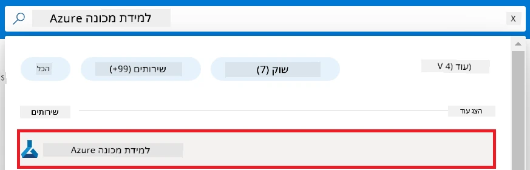

2. בחר **+ Create** בתפריט הניווט.

3. בחר **New workspace** בתפריט הניווט.

    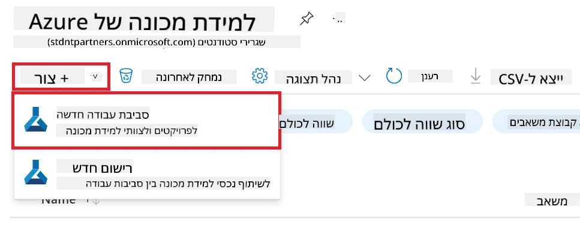

4. בצע את הפעולות הבאות:

    - בחר את **המנוי** שלך ב-Azure.
    - בחר את **קבוצת המשאבים** לשימוש (צור חדשה במידת הצורך).
    - הזן **שם סביבת העבודה**. חייב להיות ערך ייחודי.
    - בחר את **האזור** שבו תרצה להשתמש.
    - בחר את **חשבון האחסון** לשימוש (צור חדש במידת הצורך).
    - בחר את **Key vault** לשימוש (צור חדש במידת הצורך).
    - בחר את **Application insights** לשימוש (צור חדש במידת הצורך).
    - בחר את **מרשם המכולות** לשימוש (צור חדש במידת הצורך).

    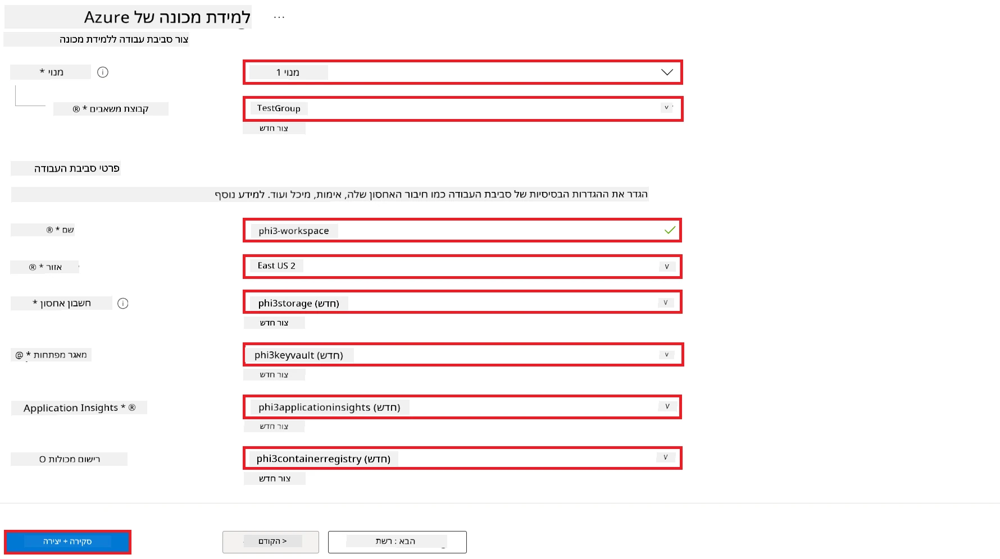

5. בחר **Review + Create**.

6. בחר **Create**.

### בקשת מכסות GPU במנוי Azure

בהדרכה זו תלמד כיצד לכוונן ולפרוס מודל Phi-3, באמצעות GPUs. עבור כוונון, תשתמש ב-GPU מסוג *Standard_NC24ads_A100_v4*, שדורש בקשת מכסה. עבור פריסה, תשתמש ב-GPU מסוג *Standard_NC6s_v3*, שגם הוא דורש בקשת מכסה.

> [!NOTE]
>
> רק מנויי Pay-As-You-Go (סוג המנוי הסטנדרטי) זכאים להקצאת GPU; מנויי זכאות אינם נתמכים כרגע.
>

1. בקר ב-[Azure ML Studio](https://ml.azure.com/home?wt.mc_id=studentamb_279723).

1. בצע את הפעולות הבאות לבקשת מכסת *Standard NCADSA100v4 Family*:

    - בחר **Quota** בכרטיסייה בצד שמאל.
    - בחר את **משפחת מכונות וירטואליות** לשימוש. לדוגמה, בחר **Standard NCADSA100v4 Family Cluster Dedicated vCPUs**, הכוללת את ה-GPU מסוג *Standard_NC24ads_A100_v4*.
    - בחר **Request quota** מתפריט הניווט.

        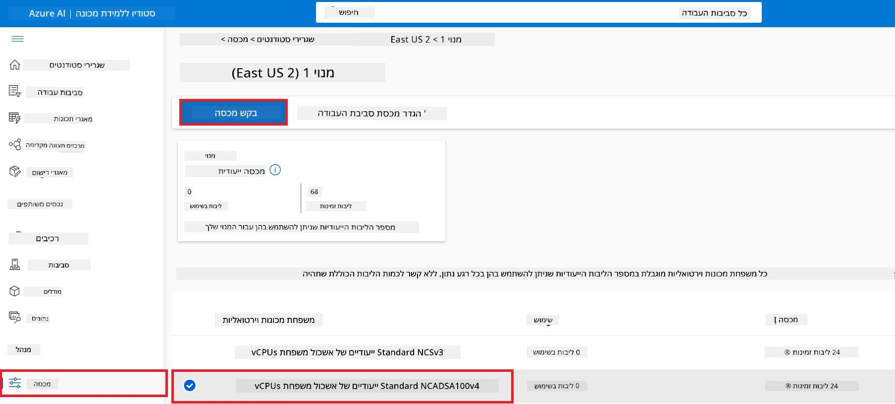

    - בדף בקשת המכסה, הזן את **מכסת הליבות החדשה** שברצונך להשתמש בה. לדוגמה, 24.
    - בדף בקשת המכסה, בחר **Submit** כדי לבקש את המכסה ל-GPU.

1. בצע את הפעולות הבאות לבקשת מכסת *Standard NCSv3 Family*:

    - בחר **Quota** בכרטיסייה בצד שמאל.
    - בחר את **משפחת מכונות וירטואליות** לשימוש. לדוגמה, בחר **Standard NCSv3 Family Cluster Dedicated vCPUs**, הכוללת את ה-GPU מסוג *Standard_NC6s_v3*.
    - בחר **Request quota** מתפריט הניווט.
    - בדף בקשת המכסה, הזן את **מכסת הליבות החדשה** שברצונך להשתמש בה. לדוגמה, 24.
    - בדף בקשת המכסה, בחר **Submit** כדי לבקש את המכסה ל-GPU.

### הוספת שיוך תפקיד

כדי לכוונן ולפרוס את המודלים שלך, עליך קודם ליצור זהות מנוהלת שהוקצתה למשתמש (User Assigned Managed Identity - UAI) ולהעניק לה את ההרשאות המתאימות. ה-UAI הזה ישמש לאימות במהלך הפריסה.

#### יצירת User Assigned Managed Identity (UAI)

1. הקלד *managed identities* ב**סרגל החיפוש** בראש דף הפורטל ובחר **Managed Identities** מהאפשרויות שמופיעות.

    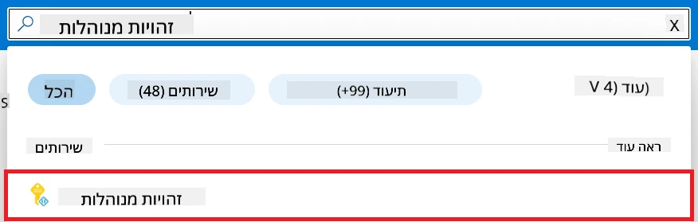

1. בחר **+ Create**.

    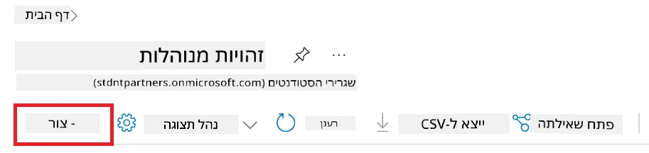

1. בצע את הפעולות הבאות:

    - בחר את **המנוי** שלך ב-Azure.
    - בחר את **קבוצת המשאבים** לשימוש (צור חדשה במידת הצורך).
    - בחר את **האזור** שבו תרצה להשתמש.
    - הזן את ה**שם**. חייב להיות ערך ייחודי.

    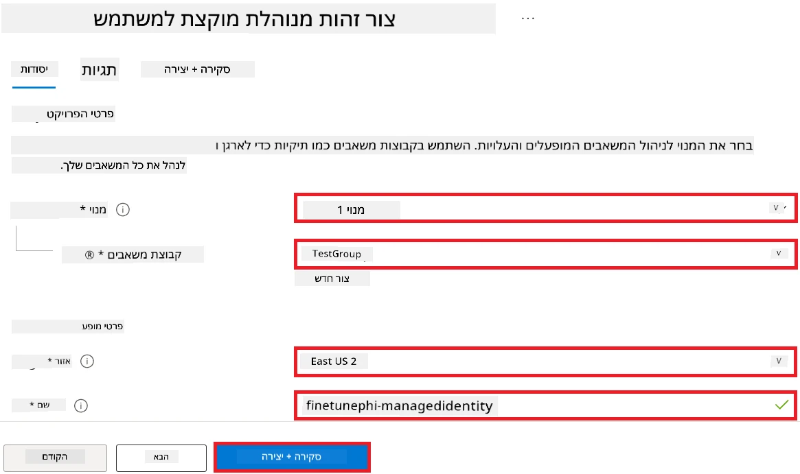

1. בחר **Review + create**.

1. בחר **+ Create**.

#### הוספת שיוך תפקיד Contributor לזהות מנוהלת

1. נווט למשאב זהות מנוהלת שיצרת.

1. בחר **Azure role assignments** בכרטיסייה בצד שמאל.

1. בחר **+Add role assignment** מתפריט הניווט.

1. בדף הוספת שיוך תפקיד, בצע את הפעולות הבאות:
    - בחר את **היקף** ל**קבוצת המשאבים**.
    - בחר את **המנוי** שלך ב-Azure.
    - בחר את **קבוצת המשאבים** לשימוש.
    - בחר את **התפקיד** ל**Contributor**.

    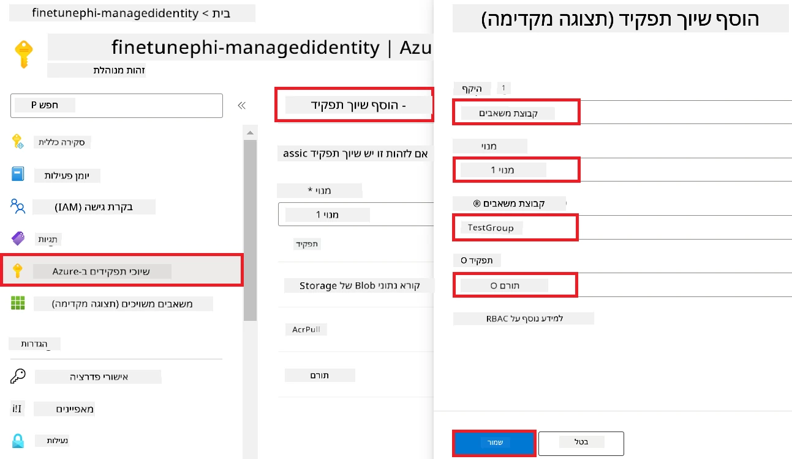

2. בחר **Save**.

#### הוספת שיוך תפקיד Storage Blob Data Reader לזהות מנוהלת

1. הקלד *storage accounts* ב**סרגל החיפוש** בראש דף הפורטל ובחר **Storage accounts** מהאפשרויות שמופיעות.

    

1. בחר את חשבון האחסון המשויך לסביבת העבודה ב-Azure Machine Learning שיצרת. לדוגמה, *finetunephistorage*.

1. בצע את הפעולות הבאות לניווט לדף הוספת שיוך תפקיד:

    - נווט לחשבון האחסון של Azure שיצרת.
    - בחר **Access Control (IAM)** בכרטיסייה בצד שמאל.
    - בחר **+ Add** מתפריט הניווט.
    - בחר **Add role assignment** מתפריט הניווט.

    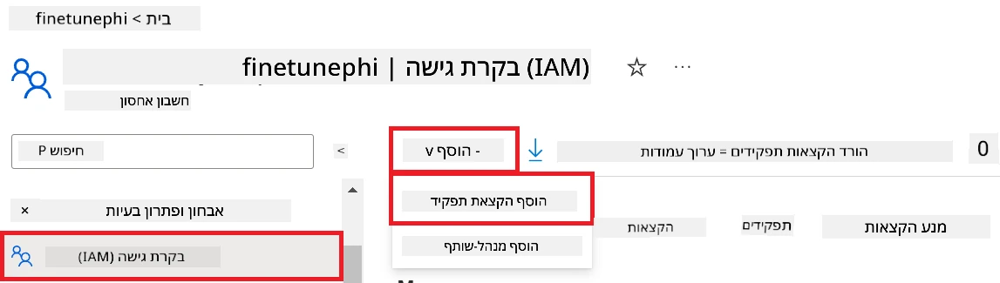

1. בדף הוספת שיוך תפקיד, בצע את הפעולות הבאות:

    - בדף התפקיד, הקלד *Storage Blob Data Reader* ב**סרגל החיפוש** ובחר **Storage Blob Data Reader** מהאפשרויות שמופיעות.
    - בדף התפקיד, בחר **Next**.
    - בדף החברים, בחר **Assign access to** **Managed identity**.
    - בדף החברים, בחר **+ Select members**.
    - בדף בחירת זהויות מנוהלות, בחר את **המנוי** שלך ב-Azure.
    - בדף בחירת זהויות מנוהלות, בחר את ה**זהות המנוהלת** ל**Manage Identity**.
    - בדף בחירת זהויות מנוהלות, בחר את Manage Identity שיצרת. לדוגמה, *finetunephi-managedidentity*.
    - בדף בחירת זהויות מנוהלות, בחר **Select**.

    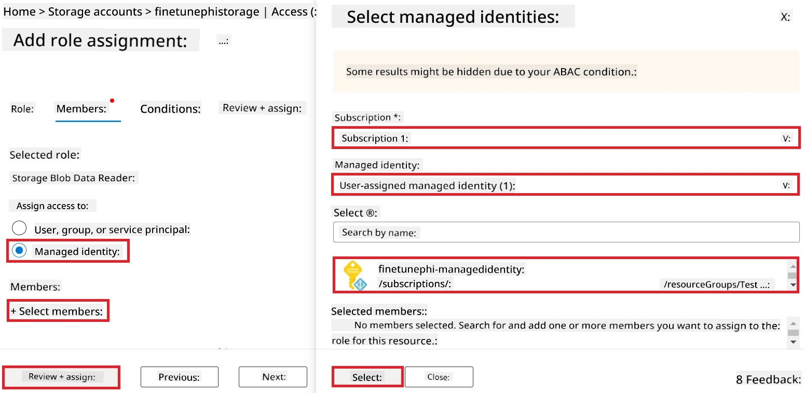

1. בחר **Review + assign**.

#### הוספת שיוך תפקיד AcrPull לזהות מנוהלת

1. הקלד *container registries* ב**סרגל החיפוש** בראש דף הפורטל ובחר **Container registries** מהאפשרויות שמופיעות.

    

1. בחר את מרשם המכולות המשויך לסביבת העבודה ב-Azure Machine Learning. לדוגמה, *finetunephicontainerregistry*

1. בצע את הפעולות הבאות לניווט לדף הוספת שיוך תפקיד:

    - בחר **Access Control (IAM)** בכרטיסייה בצד שמאל.
    - בחר **+ Add** מתפריט הניווט.
    - בחר **Add role assignment** מתפריט הניווט.

1. בדף הוספת שיוך תפקיד, בצע את הפעולות הבאות:

    - בדף התפקיד, הקלד *AcrPull* ב**סרגל החיפוש** ובחר **AcrPull** מהאפשרויות שמופיעות.
    - בדף התפקיד, בחר **Next**.
    - בדף החברים, בחר **Assign access to** **Managed identity**.
    - בדף החברים, בחר **+ Select members**.
    - בדף בחירת זהויות מנוהלות, בחר את **המנוי** שלך ב-Azure.
    - בדף בחירת זהויות מנוהלות, בחר את ה**זהות המנוהלת** ל**Manage Identity**.
    - בדף בחירת זהויות מנוהלות, בחר את Manage Identity שיצרת. לדוגמה, *finetunephi-managedidentity*.
    - בדף בחירת זהויות מנוהלות, בחר **Select**.
    - בחר **Review + assign**.

### הקמת הפרויקט

להורדת מערכי הנתונים הדרושים לכוונון, תקים סביבה מקומית.

בתרגיל זה, תבצע

- יצירת תיקייה לעבודה בתוכה.
- יצירת סביבה וירטואלית.
- התקנת החבילות הנדרשות.
- יצירת קובץ *download_dataset.py* להורדת מערך הנתונים.

#### יצירת תיקייה לעבודה בתוכה

1. פתח חלון טרמינל והקלד את הפקודה הבאה ליצירת תיקייה בשם *finetune-phi* בנתיב ברירת המחדל.

    ```console
    mkdir finetune-phi
    ```

2. הקלד את הפקודה הבאה בתוך הטרמינל שלך כדי לנווט לתיקיית *finetune-phi* שיצרת.

    ```console
    cd finetune-phi
    ```

#### צור סביבה וירטואלית

1. הקלד את הפקודה הבאה בתוך הטרמינל שלך כדי ליצור סביבה וירטואלית בשם *.venv*.

    ```console
    python -m venv .venv
    ```

2. הקלד את הפקודה הבאה בתוך הטרמינל שלך כדי להפעיל את הסביבה הווירטואלית.

    ```console
    .venv\Scripts\activate.bat
    ```

> [!NOTE]
> אם זה עבד, אתה אמור לראות את *(.venv)* לפני שורת הפקודה.

#### התקן את החבילות הנדרשות

1. הקלד את הפקודות הבאות בתוך הטרמינל שלך כדי להתקין את החבילות הנדרשות.

    ```console
    pip install datasets==2.19.1
    ```

#### צור את `donload_dataset.py`

> [!NOTE]
> מבנה התיקיה המלא:
>
> ```text
> └── YourUserName
> .    └── finetune-phi
> .        └── download_dataset.py
> ```

1. פתח את **Visual Studio Code**.

1. בחר **File** בסרגל התפריטים.

1. בחר **Open Folder**.

1. בחר את תיקיית *finetune-phi* שיצרת, שנמצאת ב-*C:\Users\yourUserName\finetune-phi*.

    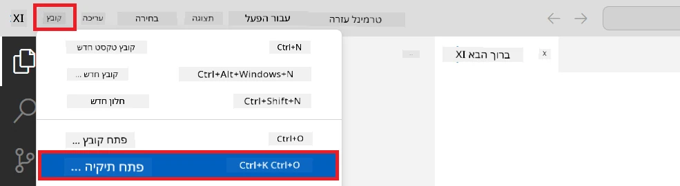

1. בסרגל השמאלי של Visual Studio Code, לחץ קליק ימני ובחר **New File** כדי ליצור קובץ חדש בשם *download_dataset.py*.

    

### הכנת מערך הנתונים לכוונון עדין

בתרגיל זה, תריץ את הקובץ *download_dataset.py* כדי להוריד את מערכי הנתונים *ultrachat_200k* לסביבה המקומית שלך. לאחר מכן תשתמש במערכי הנתונים האלה כדי לכוונן עדין את הדגם Phi-3 ב-Azure Machine Learning.

בתרגיל זה, תעשה את הפעולות הבאות:

- הוסף קוד לקובץ *download_dataset.py* כדי להוריד את מערכי הנתונים.
- הרץ את הקובץ *download_dataset.py* כדי להוריד את מערכי הנתונים לסביבה המקומית שלך.

#### הורד את מערך הנתונים שלך באמצעות *download_dataset.py*

1. פתח את הקובץ *download_dataset.py* ב-Visual Studio Code.

1. הוסף את הקוד הבא לתוך הקובץ *download_dataset.py*.

    ```python
    import json
    import os
    from datasets import load_dataset

    def load_and_split_dataset(dataset_name, config_name, split_ratio):
        """
        Load and split a dataset.
        """
        # טען את מערך הנתונים עם השם, התצורה ויחס החלוקה שצוינו
        dataset = load_dataset(dataset_name, config_name, split=split_ratio)
        print(f"Original dataset size: {len(dataset)}")
        
        # חלק את מערך הנתונים לסטים של אימון ובדיקה (80% אימון, 20% בדיקה)
        split_dataset = dataset.train_test_split(test_size=0.2)
        print(f"Train dataset size: {len(split_dataset['train'])}")
        print(f"Test dataset size: {len(split_dataset['test'])}")
        
        return split_dataset

    def save_dataset_to_jsonl(dataset, filepath):
        """
        Save a dataset to a JSONL file.
        """
        # צור את התיקיה אם היא לא קיימת
        os.makedirs(os.path.dirname(filepath), exist_ok=True)
        
        # פתח את הקובץ במצב כתיבה
        with open(filepath, 'w', encoding='utf-8') as f:
            # עבור על כל רשומה במערך הנתונים
            for record in dataset:
                # המר את הרשומה לאובייקט JSON וכתוב אותה בקובץ
                json.dump(record, f)
                # כתוב תו שורה חדשה להפרדת רשומות
                f.write('\n')
        
        print(f"Dataset saved to {filepath}")

    def main():
        """
        Main function to load, split, and save the dataset.
        """
        # טען וחלק את מערך הנתונים ULTRACHAT_200k עם תצורה מסוימת ויחס חלוקה
        dataset = load_and_split_dataset("HuggingFaceH4/ultrachat_200k", 'default', 'train_sft[:1%]')
        
        # חלץ את מערכי האימון והבדיקה מהחלוקה
        train_dataset = dataset['train']
        test_dataset = dataset['test']

        # שמור את מערך האימון בקובץ JSONL
        save_dataset_to_jsonl(train_dataset, "data/train_data.jsonl")
        
        # שמור את מערך הבדיקה בקובץ JSONL נפרד
        save_dataset_to_jsonl(test_dataset, "data/test_data.jsonl")

    if __name__ == "__main__":
        main()

    ```

1. הקלד את הפקודה הבאה בתוך הטרמינל שלך כדי להריץ את הסקריפט ולהוריד את מערך הנתונים לסביבה המקומית שלך.

    ```console
    python download_dataset.py
    ```

1. אמת כי מערכי הנתונים נשמרו בהצלחה בתיקיית *finetune-phi/data* המקומית שלך.

> [!NOTE]
>
> #### הערה על גודל מערך הנתונים וזמן הכוונון העדין
>
> במדריך זה, אתה משתמש רק ב-1% ממערך הנתונים (`split='train[:1%]'`). זה מצמצם משמעותית את גודל הנתונים, מה שמאיץ הן את תהליך ההעלאה והן את תהליך הכוונון העדין. אתה יכול לכוונן את האחוז כדי למצוא את האיזון הנכון בין זמן האימון לביצועי המודל. שימוש בתת-מערך קטן יותר של הנתונים מקצר את זמן הכוונון העדין, ומקל על ביצוע התהליך במסגרת הדרכה.

## תרחיש 2: כוונון עדין של דגם Phi-3 ופריסה ב-Azure Machine Learning Studio

### כוונן עדין את דגם Phi-3

בתרגיל זה תכוין עדין את דגם Phi-3 ב-Azure Machine Learning Studio.

בתרגיל זה, תעשה את הפעולות הבאות:

- צור אשכול מחשבים עבור כוונון עדין.
- כוונן עדין את דגם Phi-3 ב-Azure Machine Learning Studio.

#### צור אשכול מחשבים עבור כוונון עדין

1. עבור ל-[Azure ML Studio](https://ml.azure.com/home?wt.mc_id=studentamb_279723).

1. בחר **Compute** מהטאב הצדדי השמאלי.

1. בחר **Compute clusters** מתפריט הניווט.

1. בחר **+ New**.

    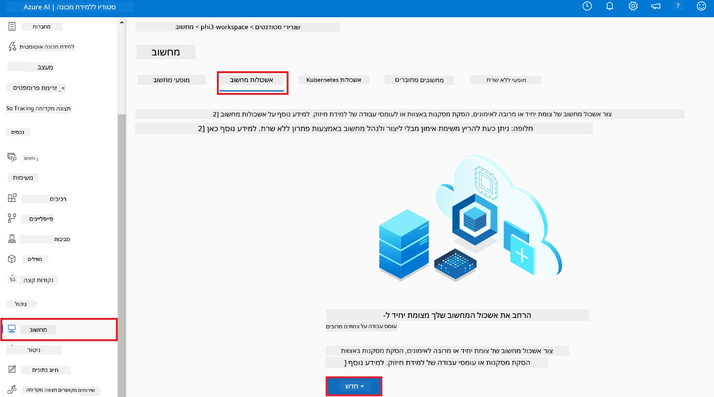

1. בצע את הפעולות הבאות:

    - בחר את **Region** הרצוי.
    - בחר את **Virtual machine tier** ל-**Dedicated**.
    - בחר את **Virtual machine type** ל-**GPU**.
    - בחר את סינון **Virtual machine size** ל-**Select from all options**.
    - בחר את **Virtual machine size** ל-**Standard_NC24ads_A100_v4**.

    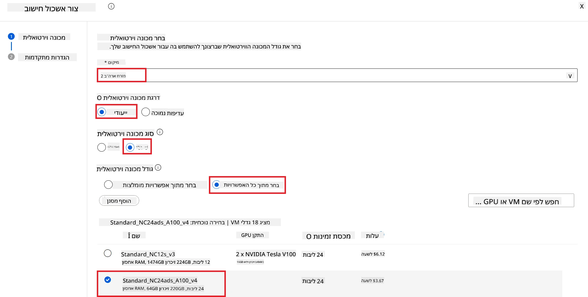

1. בחר **Next**.

1. בצע את הפעולות הבאות:

    - הזן **Compute name**. חייב להיות שם ייחודי.
    - בחר את **Minimum number of nodes** ל-**0**.
    - בחר את **Maximum number of nodes** ל-**1**.
    - בחר את **Idle seconds before scale down** ל-**120**.

    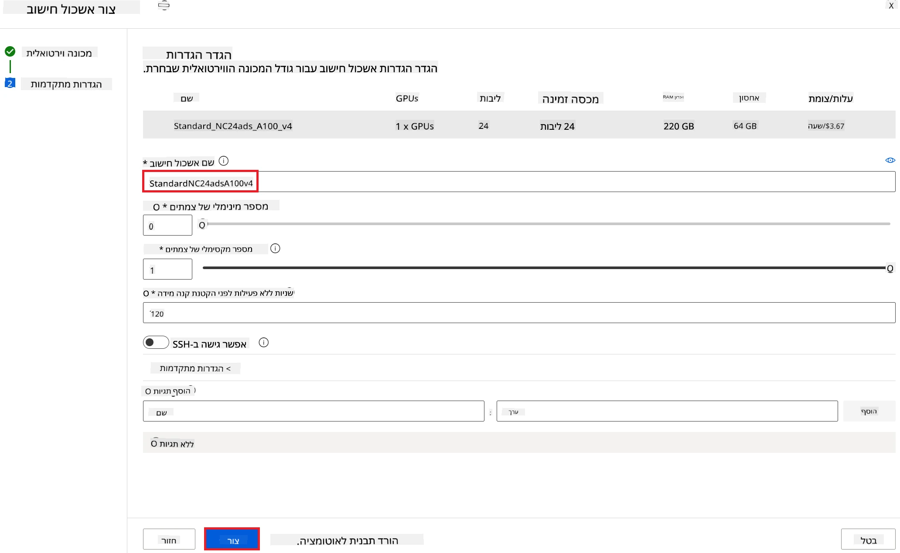

1. בחר **Create**.

#### כוונן עדין את דגם Phi-3

1. עבור ל-[Azure ML Studio](https://ml.azure.com/home?wt.mc_id=studentamb_279723).

1. בחר את סביבת העבודה Azure Machine Learning שיצרת.

    

1. בצע את הפעולות הבאות:

    - בחר **Model catalog** מהטאב הצדדי השמאלי.
    - הקלד *phi-3-mini-4k* בשורת החיפוש ובחר **Phi-3-mini-4k-instruct** מתוך האפשרויות שמופיעות.

    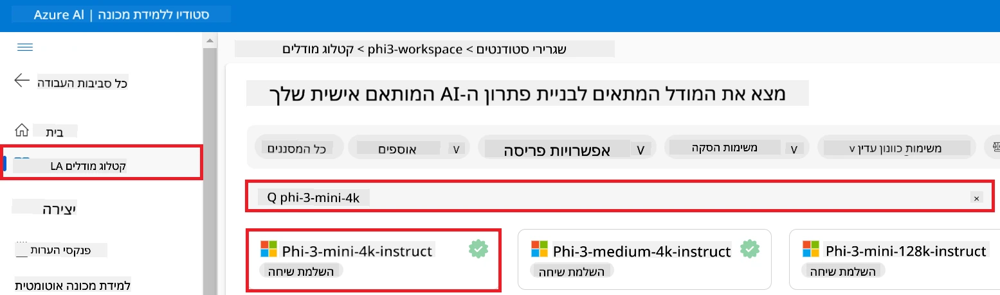

1. בחר **Fine-tune** מתפריט הניווט.

    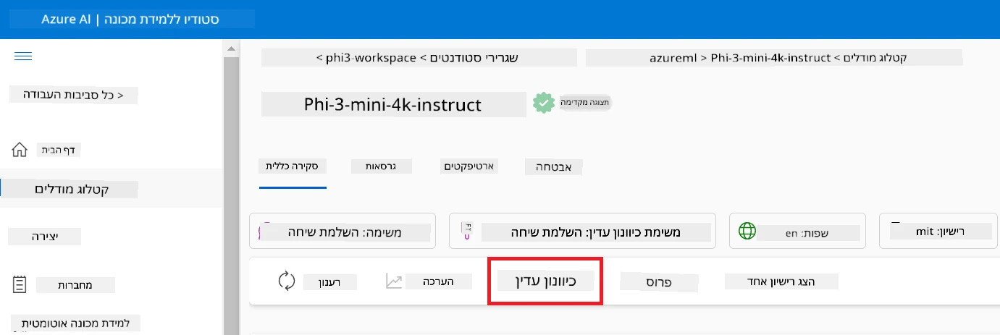

1. בצע את הפעולות הבאות:

    - בחר **Select task type** ל-**Chat completion**.
    - בחר **+ Select data** כדי להעלות **Training data**.
    - בחר את סוג העלאת נתוני האימות ל-**Provide different validation data**.
    - בחר **+ Select data** כדי להעלות **Validation data**.

    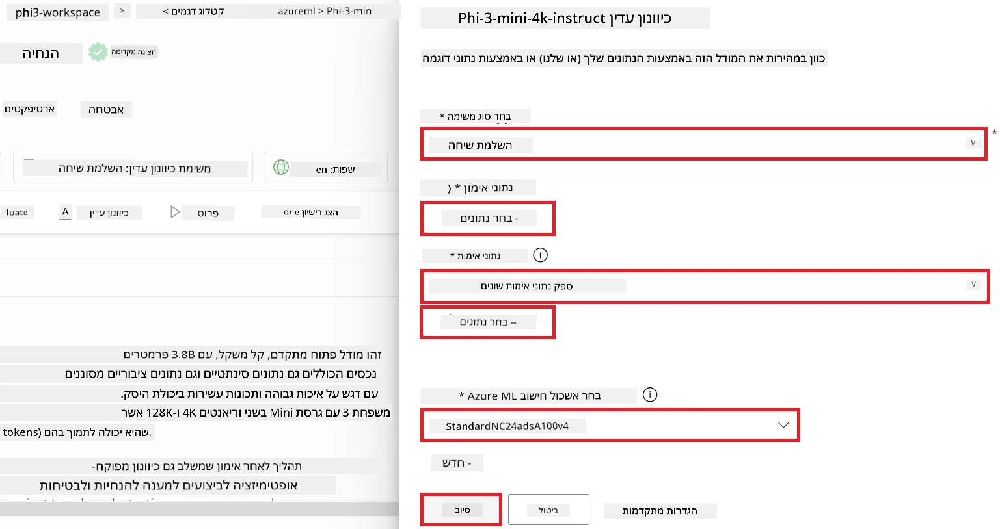

> [!TIP]
>
> ניתן לבחור **Advanced settings** כדי להתאים אישית פרמטרים כמו **learning_rate** ו-**lr_scheduler_type** כדי לייעל את תהליך הכוונון העדין לפי הצרכים הספציפיים שלך.

1. בחר **Finish**.

1. בתרגיל זה, ביצעת בהצלחה כוונון עדין לדגם Phi-3 באמצעות Azure Machine Learning. שים לב שתהליך הכוונון העדין עלול לקחת זמן מה. לאחר הפעלת משימת הכוונון, עליך לחכות עד שתסתיים. ניתן לעקוב אחר מצב משימת הכוונון על ידי כניסה לטאב Jobs בצד השמאלי בסביבת העבודה שלך ב-Azure Machine Learning. בסדרה הבאה תפרוס את הדגם המכוון ותשלב אותו עם Prompt flow.

    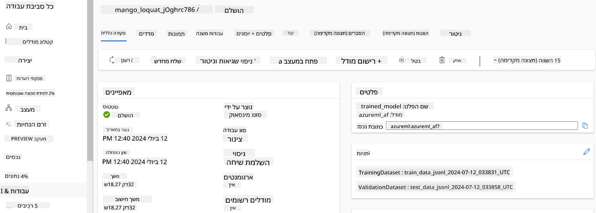

### פרוס את דגם Phi-3 המכוון

כדי לשלב את דגם Phi-3 המכוון עם Prompt flow, עליך לפרוס את הדגם כך שיהיה נגיש עבור ביצועי שחזור בזמן אמת. תהליך זה כולל רישום הדגם, יצירת נקודת קצה מקוונת ופריסת הדגם.

בתרגיל זה תעשה את הפעולות הבאות:

- רשום את הדגם המכוון בסביבת העבודה של Azure Machine Learning.
- צור נקודת קצה מקוונת.
- פרוס את דגם Phi-3 המכוון שנרשם.

#### רשום את הדגם המכוון

1. עבור ל-[Azure ML Studio](https://ml.azure.com/home?wt.mc_id=studentamb_279723).

1. בחר את סביבת העבודה Azure Machine Learning שיצרת.

    

1. בחר **Models** מהטאב הצדדי השמאלי.
1. בחר **+ Register**.
1. בחר **From a job output**.

    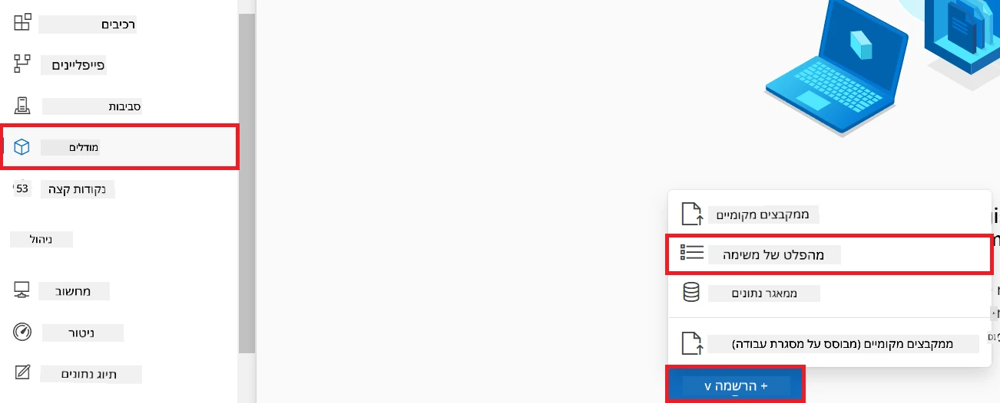

1. בחר את המשימה שיצרת.

    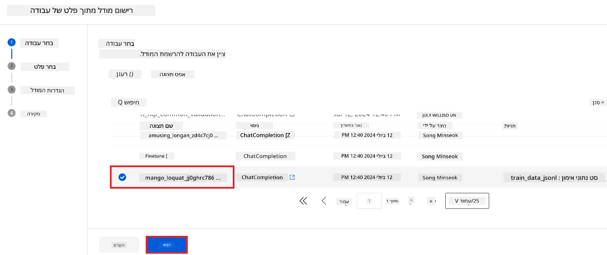

1. בחר **Next**.

1. בחר את סוג הדגם ל-**MLflow**.

1. ודא שה-**Job output** מסומן; זה צריך להיות מסומן אוטומטית.

    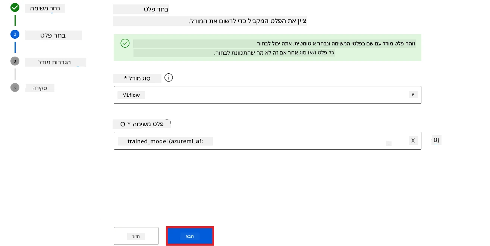

2. בחר **Next**.

3. בחר **Register**.

    

4. ניתן לראות את הדגם שנרשם דרך תפריט **Models** בטאב הצדדי השמאלי.

    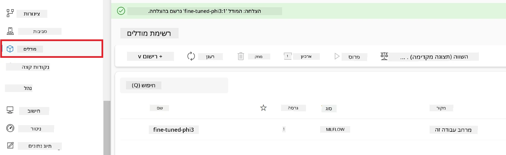

#### פרוס את הדגם המכוון

1. עבור לסביבת העבודה Azure Machine Learning שיצרת.

1. בחר **Endpoints** בטאב הצדדי השמאלי.

1. בחר **Real-time endpoints** מתפריט הניווט.

    

1. בחר **Create**.

1. בחר את הדגם שנרשם שיצרת.

    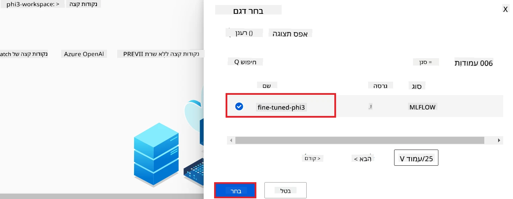

1. בחר **Select**.

1. בצע את הפעולות הבאות:

    - בחר **Virtual machine** ל-*Standard_NC6s_v3*.
    - בחר את **Instance count** הרצוי. לדוגמה, *1*.
    - בחר את **Endpoint** ל-**New** כדי ליצור נקודת קצה.
    - הזן **Endpoint name**. חייב להיות שם ייחודי.
    - הזן **Deployment name**. חייב להיות שם ייחודי.

    

1. בחר **Deploy**.

> [!WARNING]
> כדי למנוע חיובים נוספים בחשבונך, וודא למחוק את נקודת הקצה שנוצרה בסביבת העבודה של Azure Machine Learning.
>

#### בדוק את מצב הפריסה בסביבת העבודה של Azure Machine Learning

1. עבור לסביבת העבודה Azure Machine Learning שיצרת.

1. בחר **Endpoints** בטאב הצדדי השמאלי.

1. בחר את נקודת הקצה שיצרת.

    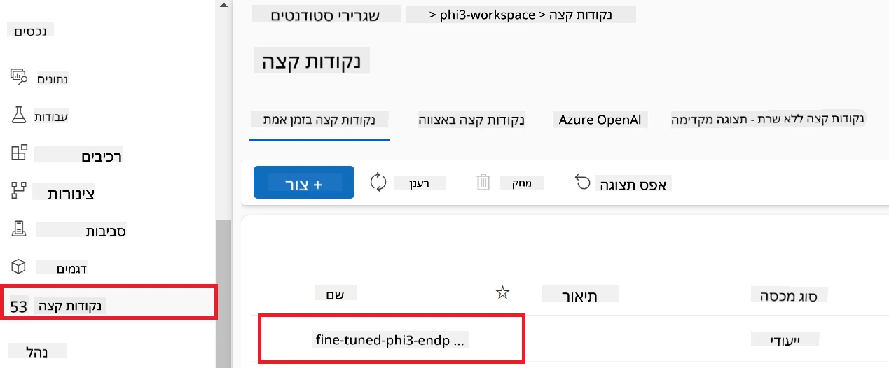

1. בדף זה, ניתן לנהל את נקודות הקצה במהלך תהליך הפריסה.

> [!NOTE]
> לאחר שהפריסה הושלמה, ודא כי **Live traffic** מוגדר ל-**100%**. אם לא, בחר **Update traffic** כדי לשנות את הגדרות התעבורה. שים לב שאי אפשר לבדוק את הדגם אם תעבורה מוגדרת ל-0%.
>
> 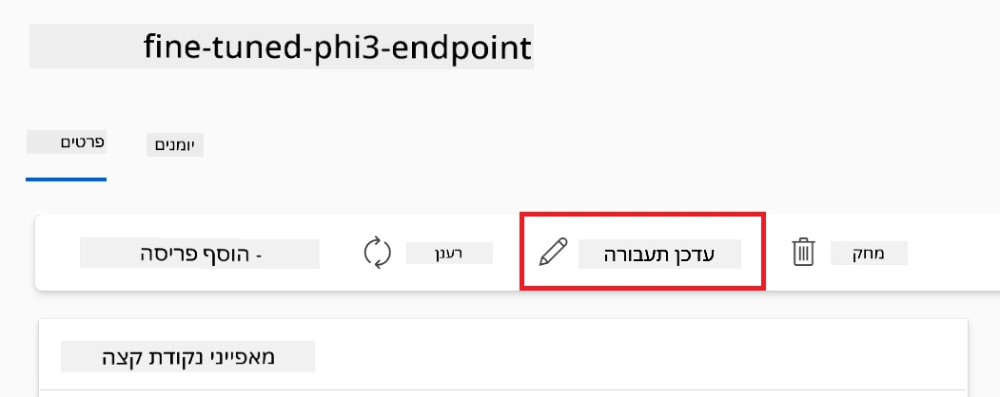
>

## תרחיש 3: אינטגרציה עם Prompt flow ויצירת שיחה עם הדגם המותאם שלך ב-Azure AI Foundry

### אינטגרציה של דגם Phi-3 מותאם עם Prompt flow

לאחר שפרסת בהצלחה את הדגם המכוון, כעת תוכל לשלב אותו עם Prompt Flow לשימוש באפליקציות בזמן אמת, המאפשרות מגוון משימות אינטראקטיביות עם הדגם המותאם שלך Phi-3.

בתרגיל זה תעשה את הפעולות הבאות:

- צור Azure AI Foundry Hub.
- צור פרויקט ב-Azure AI Foundry.
- צור Prompt flow.
- הוסף חיבור מותאם לדגם Phi-3 המכוון.
- הגדר את Prompt flow לשיחה עם דגם Phi-3 המותאם שלך.

> [!NOTE]
> ניתן גם לשלב עם Promptflow באמצעות Azure ML Studio. אותו תהליך אינטגרציה תקף ל-Azure ML Studio.

#### צור Azure AI Foundry Hub

יש ליצור Hub לפני יצירת הפרויקט. ה-Hub פועל כמו קבוצת משאבים, ומאפשר לארגן ולנהל מספר פרויקטים בתוך Azure AI Foundry.

1. עבור ל-[Azure AI Foundry](https://ai.azure.com/?WT.mc_id=aiml-137032-kinfeylo).

1. בחר **All hubs** בטאב הצדדי השמאלי.

1. בחר **+ New hub** מתפריט הניווט.
    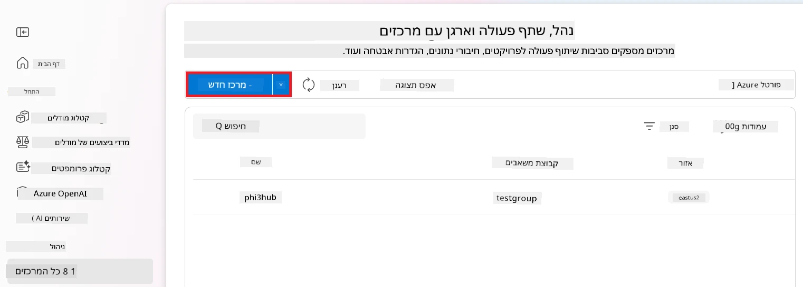

1. בצע את המשימות הבאות:

    - הזן **שם המרכז**. חייב להיות ערך ייחודי.
    - בחר את **המנוי** שלך ב-Azure.
    - בחר את **קבוצת המשאבים** לשימוש (צור חדשה אם יש צורך).
    - בחר את **מיקום** שבו תרצה להשתמש.
    - בחר את **חיבור שירותי AI של Azure** לשימוש (צור חדש אם יש צורך).
    - בחר ב-**חיבור Azure AI Search** את האפשרות **דלג על חיבור**.

    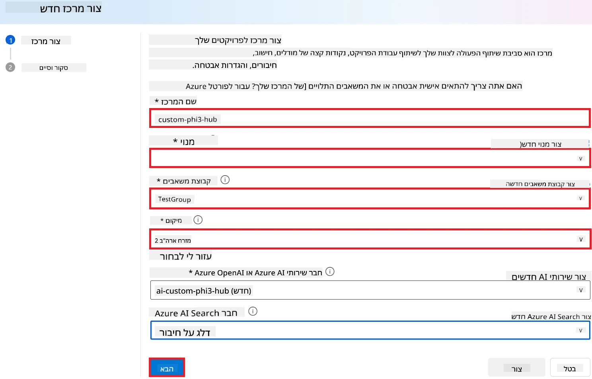

1. בחר **הבא**.

#### צור פרויקט Azure AI Foundry

1. במרכז שיצרת, בחר **כל הפרויקטים** מהכרטיסייה בצדו השמאלי.

1. בחר **+ פרויקט חדש** מתפריט הניווט.

    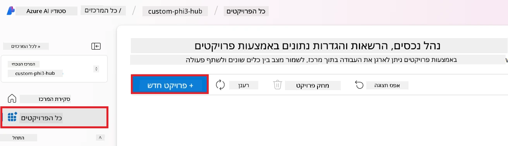

1. הזן **שם הפרויקט**. חייב להיות ערך ייחודי.

    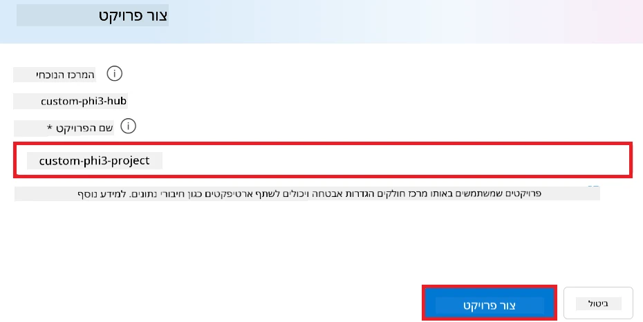

1. בחר **צור פרויקט**.

#### הוסף חיבור מותאם אישית למודל Phi-3 המותאם

כדי לשלב את מודל Phi-3 המותאם שלך עם Prompt flow, עליך לשמור את נקודת הקצה ומפתח המודל בחיבור מותאם אישית. הגדרה זו מבטיחה גישה למודל Phi-3 המותאם שלך ב-Prompt flow.

#### הגדר את מפתח ה-API וכתובת נקודת הקצה של מודל Phi-3 המותאם

1. בקר ב-[Azure ML Studio](https://ml.azure.com/home?WT.mc_id=aiml-137032-kinfeylo).

1. עבור לסביבת העבודה של Azure Machine learning שיצרת.

1. בחר **Endpoints** מהכרטיסייה בצדו השמאלי.

    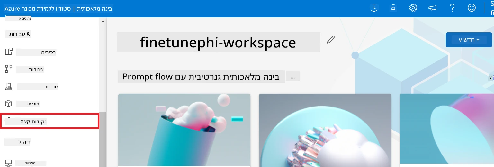

1. בחר את נקודת הקצה שיצרת.

    

1. בחר **Consume** מתפריט הניווט.

1. העתק את **נקודת הקצה REST** ואת ה-**מפתח הראשי** שלך.

    

#### הוסף את החיבור המותאם אישית

1. בקר ב-[Azure AI Foundry](https://ai.azure.com/?WT.mc_id=aiml-137032-kinfeylo).

1. עבור לפרויקט Azure AI Foundry שיצרת.

1. בפרויקט שיצרת, בחר **הגדרות** מהכרטיסייה בצדו השמאלי.

1. בחר **+ חיבור חדש**.

    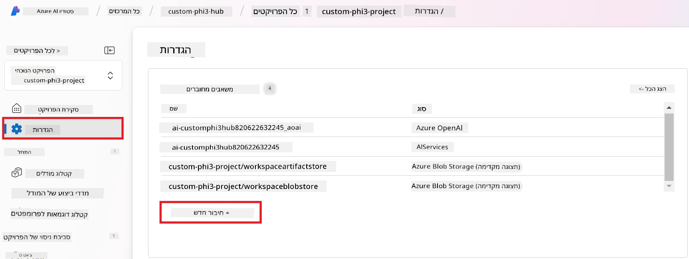

1. בחר **מפתחות מותאמים אישית** מתפריט הניווט.

    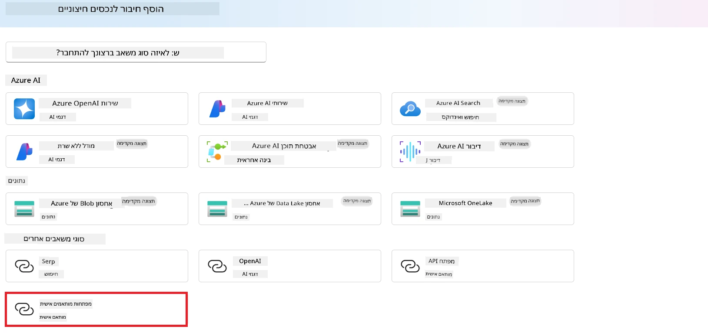

1. בצע את המשימות הבאות:

    - בחר **+ הוסף זוגות מפתח-ערך**.
    - עבור שם המפתח, הזן **endpoint** והדבק את נקודת הקצה שהעתקת מ-Azure ML Studio בשדה הערך.
    - בחר שוב **+ הוסף זוגות מפתח-ערך**.
    - עבור שם המפתח, הזן **key** והדבק את המפתח שהעתקת מ-Azure ML Studio בשדה הערך.
    - לאחר הוספת המפתחות, בחר **הוא סודי** כדי למנוע את החשיפה של המפתח.

    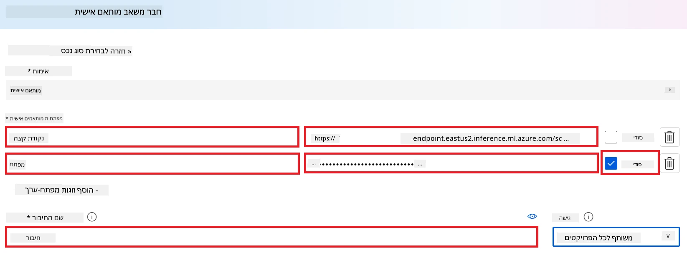

1. בחר **הוסף חיבור**.

#### צור Prompt flow

הוספת חיבור מותאם אישית ב-Azure AI Foundry. כעת, בוא ניצור Prompt flow באמצעות השלבים הבאים. לאחר מכן, תחבר את ה-Prompt flow הזה לחיבור המותאם אישית כדי שתוכל להשתמש במודל המותאם במסגרת ה-Prompt flow.

1. עבור לפרויקט Azure AI Foundry שיצרת.

1. בחר **Prompt flow** מהכרטיסייה בצדו השמאלי.

1. בחר **+ צור** מתפריט הניווט.

    

1. בחר **זרם שיחה** מתפריט הניווט.

    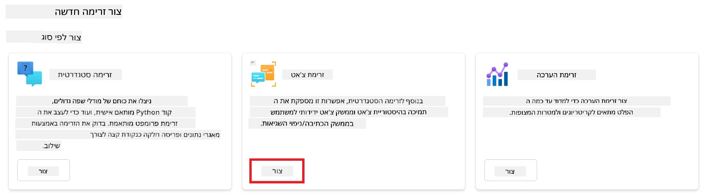

1. הזן **שם התיקייה** לשימוש.

    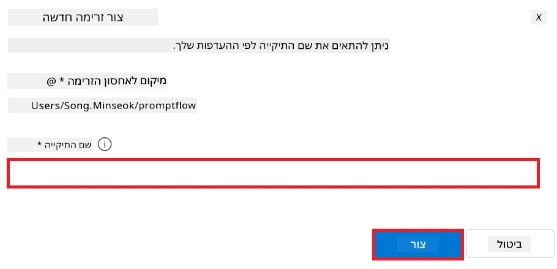

2. בחר **צור**.

#### הגדר את Prompt flow לשיחה עם מודל Phi-3 המותאם שלך

עליך לשלב את מודל Phi-3 המותאם ל-Prompt flow. עם זאת, ה-Prompt flow הקיים אינו מיועד למטרה זו. לכן, עליך לעצב מחדש את ה-Prompt flow כדי לאפשר את השילוב של המודל המותאם.

1. ב-Prompt flow, בצע את המשימות הבאות כדי לבנות מחדש את הזרם הקיים:

    - בחר **מצב קובץ גולמי**.
    - מחק את כל הקוד הקיים בקובץ *flow.dag.yml*.
    - הוסף את הקוד הבא לקובץ *flow.dag.yml*.

        ```yml
        inputs:
          input_data:
            type: string
            default: "Who founded Microsoft?"

        outputs:
          answer:
            type: string
            reference: ${integrate_with_promptflow.output}

        nodes:
        - name: integrate_with_promptflow
          type: python
          source:
            type: code
            path: integrate_with_promptflow.py
          inputs:
            input_data: ${inputs.input_data}
        ```

    - בחר **שמירה**.

    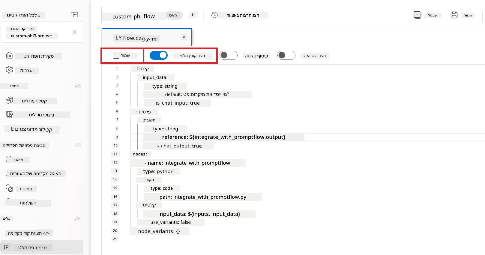

1. הוסף את הקוד הבא לקובץ *integrate_with_promptflow.py* כדי להשתמש במודל Phi-3 המותאם ב-Prompt flow.

    ```python
    import logging
    import requests
    from promptflow import tool
    from promptflow.connections import CustomConnection

    # הגדרת רישום
    logging.basicConfig(
        format="%(asctime)s - %(levelname)s - %(name)s - %(message)s",
        datefmt="%Y-%m-%d %H:%M:%S",
        level=logging.DEBUG
    )
    logger = logging.getLogger(__name__)

    def query_phi3_model(input_data: str, connection: CustomConnection) -> str:
        """
        Send a request to the Phi-3 model endpoint with the given input data using Custom Connection.
        """

        # "connection" הוא שם החיבור המותאם, "endpoint", "key" הם המפתחות בחיבור המותאם
        endpoint_url = connection.endpoint
        api_key = connection.key

        headers = {
            "Content-Type": "application/json",
            "Authorization": f"Bearer {api_key}"
        }
        data = {
            "input_data": {
                "input_string": [
                    {"role": "user", "content": input_data}
                ],
                "parameters": {
                    "temperature": 0.7,
                    "max_new_tokens": 128
                }
            }
        }
        try:
            response = requests.post(endpoint_url, json=data, headers=headers)
            response.raise_for_status()
            
            # רישום תגובת JSON מלאה
            logger.debug(f"Full JSON response: {response.json()}")

            result = response.json()["output"]
            logger.info("Successfully received response from Azure ML Endpoint.")
            return result
        except requests.exceptions.RequestException as e:
            logger.error(f"Error querying Azure ML Endpoint: {e}")
            raise

    @tool
    def my_python_tool(input_data: str, connection: CustomConnection) -> str:
        """
        Tool function to process input data and query the Phi-3 model.
        """
        return query_phi3_model(input_data, connection)

    ```

    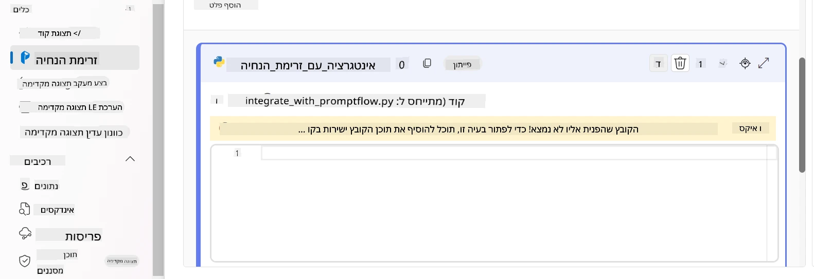

> [!NOTE]
> לקבלת מידע מפורט יותר על השימוש ב-Prompt flow ב-Azure AI Foundry, ניתן לעיין ב-[Prompt flow ב-Azure AI Foundry](https://learn.microsoft.com/azure/ai-studio/how-to/prompt-flow).

1. בחר **קלט שיחה**, **פלט שיחה** כדי לאפשר שיחה עם המודל שלך.

    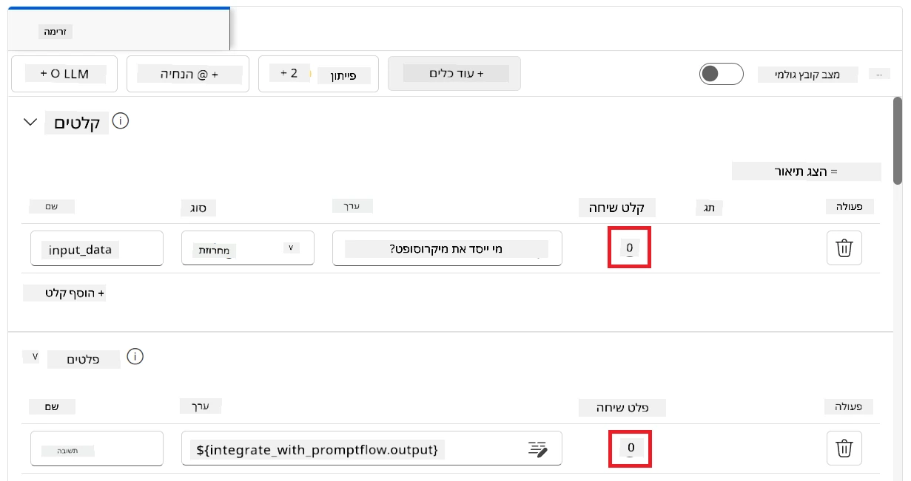

1. כעת אתה מוכן לנהל שיחה עם מודל Phi-3 המותאם שלך. בתרגיל הבא תלמד כיצד להפעיל את ה-Prompt flow ולהשתמש בו לשיחה עם מודל Phi-3 המותאם שלך.

> [!NOTE]
>
> הזרם המחודש אמור להיראות כמו התמונה למטה:
>
> 
>

### שיחה עם מודל Phi-3 המותאם שלך

כעת לאחר שעברת התאמה אישית ושילבת את מודל Phi-3 המותאם שלך עם Prompt flow, אתה מוכן להתחיל באינטראקציה איתו. תרגיל זה ינחה אותך בתהליך הקמת והפעלת שיחה עם המודל שלך באמצעות Prompt flow. על ידי ביצוע שלבים אלה תוכל לנצל את תכונות מודל Phi-3 המותאם שלך במלואן למשימות ושיחות שונות.

- שוחח עם מודל Phi-3 המותאם שלך באמצעות Prompt flow.

#### הפעל את Prompt flow

1. בחר **הפעל מושבי חישוב** כדי להפעיל את Prompt flow.

    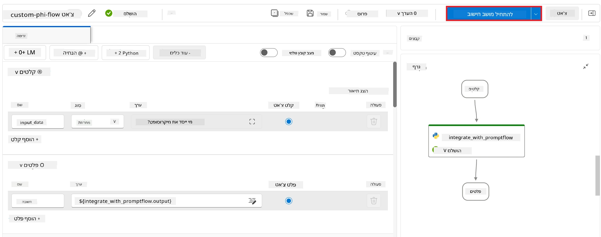

1. בחר **אשר ופרש קלט** כדי לחדש פרמטרים.

    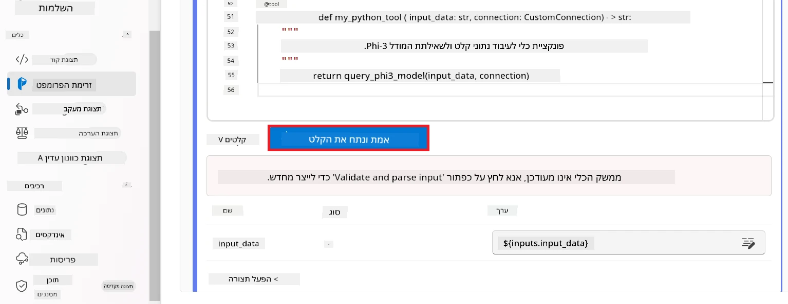

1. בחר את **ערך** ה-**חיבור** לחיבור המותאם אישית שיצרת. לדוגמה, *connection*.

    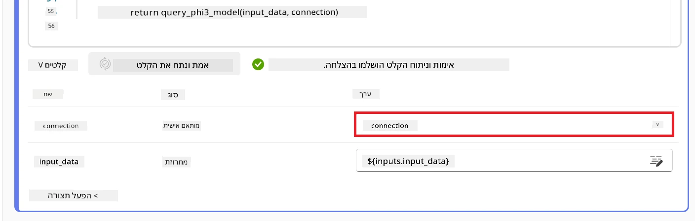

#### שיחה עם המודל המותאם שלך

1. בחר **שיחה**.

    

1. הנה דוגמה לתוצאות: כעת אתה יכול לשוחח עם מודל Phi-3 המותאם שלך. מומלץ לשאול שאלות בהתבסס על הנתונים שבהם השתמשת להתאמה אישית.

    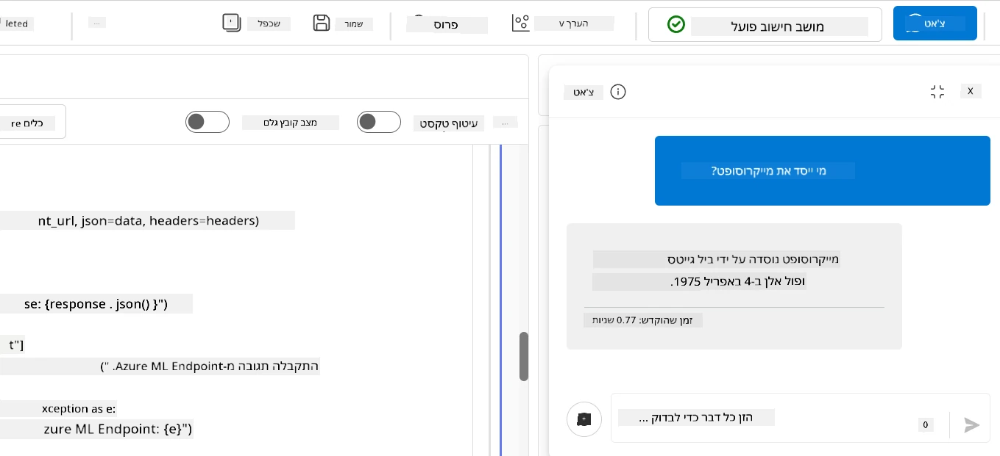

---

<!-- CO-OP TRANSLATOR DISCLAIMER START -->
**הצהרת אחריות**:
מסמך זה תורגם בעזרת שירות תרגום מבוסס בינה מלאכותית [Co-op Translator](https://github.com/Azure/co-op-translator). למרות שאנו שואפים לדיוק, יש לקחת בחשבון שתרגומים אוטומטיים עלולים להכיל טעויות או אי-דיוקים. המסמך המקורי בשפה המקורית נחשב כמקור הסמכותי. למידע קריטי מומלץ להיעזר בתרגום מקצועי לבני אדם. אנו לא אחראים על כל אי הבנה או פרשנות שגויה הנובעת משימוש בתרגום זה.
<!-- CO-OP TRANSLATOR DISCLAIMER END -->