<!--
CO_OP_TRANSLATOR_METADATA:
{
  "original_hash": "ecbd9179a21edbaafaf114d47f09f3e3",
  "translation_date": "2025-05-09T18:14:35+00:00",
  "source_file": "md/02.Application/01.TextAndChat/Phi3/E2E_Phi-3-FineTuning_PromptFlow_Integration_AIFoundry.md",
  "language_code": "he"
}
-->
# לכוונן ולהטמיע מודלים מותאמים אישית של Phi-3 עם Prompt flow ב-Azure AI Foundry

דוגמת קצה-לקצה (E2E) זו מבוססת על המדריך "[Fine-Tune and Integrate Custom Phi-3 Models with Prompt Flow in Azure AI Foundry](https://techcommunity.microsoft.com/t5/educator-developer-blog/fine-tune-and-integrate-custom-phi-3-models-with-prompt-flow-in/ba-p/4191726?WT.mc_id=aiml-137032-kinfeylo)" מקהילת הטכנולוגיה של מיקרוסופט. היא מציגה את התהליכים של לכוונון, פריסה והטמעה של מודלים מותאמים אישית של Phi-3 עם Prompt flow ב-Azure AI Foundry.  
בשונה מדוגמת ה-E2E, "[Fine-Tune and Integrate Custom Phi-3 Models with Prompt Flow](./E2E_Phi-3-FineTuning_PromptFlow_Integration.md)", שכללה הרצת קוד מקומית, המדריך הזה מתמקד כולו בלכוונון ובהטמעת המודל שלך בתוך Azure AI / ML Studio.

## סקירה כללית

בדוגמת E2E זו תלמד כיצד לכוונן את מודל Phi-3 ולהטמיע אותו עם Prompt flow ב-Azure AI Foundry. באמצעות Azure AI / ML Studio, תקים זרימת עבודה לפריסה ושימוש במודלים מותאמים אישית של בינה מלאכותית. דוגמת ה-E2E מחולקת לשלוש תרחישים:

**תרחיש 1: הקמת משאבי Azure והכנה ללכוונון**

**תרחיש 2: לכוונון מודל Phi-3 ופריסה ב-Azure Machine Learning Studio**

**תרחיש 3: הטמעה עם Prompt flow ושיחה עם המודל המותאם שלך ב-Azure AI Foundry**

להלן סקירה כללית של דוגמת ה-E2E הזו.

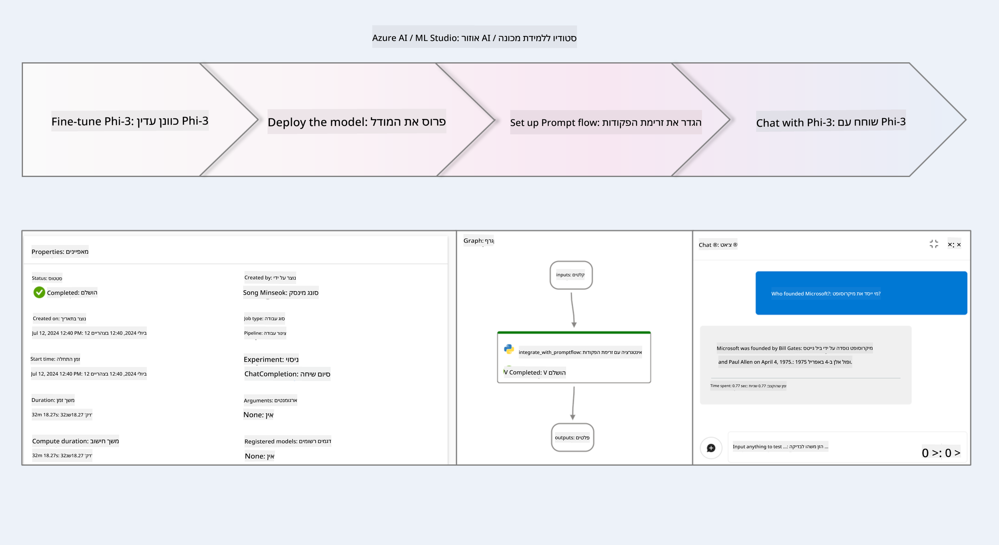

### תוכן העניינים

1. **[תרחיש 1: הקמת משאבי Azure והכנה ללכוונון](../../../../../../md/02.Application/01.TextAndChat/Phi3)**  
    - [יצירת סביבת עבודה ב-Azure Machine Learning](../../../../../../md/02.Application/01.TextAndChat/Phi3)  
    - [בקשת מכסות GPU במנוי Azure](../../../../../../md/02.Application/01.TextAndChat/Phi3)  
    - [הוספת שיוך תפקיד](../../../../../../md/02.Application/01.TextAndChat/Phi3)  
    - [הקמת פרויקט](../../../../../../md/02.Application/01.TextAndChat/Phi3)  
    - [הכנת מערך נתונים ללכוונון](../../../../../../md/02.Application/01.TextAndChat/Phi3)  

1. **[תרחיש 2: לכוונון מודל Phi-3 ופריסה ב-Azure Machine Learning Studio](../../../../../../md/02.Application/01.TextAndChat/Phi3)**  
    - [לכוונון מודל Phi-3](../../../../../../md/02.Application/01.TextAndChat/Phi3)  
    - [פריסת מודל Phi-3 המכוונן](../../../../../../md/02.Application/01.TextAndChat/Phi3)  

1. **[תרחיש 3: הטמעה עם Prompt flow ושיחה עם המודל המותאם שלך ב-Azure AI Foundry](../../../../../../md/02.Application/01.TextAndChat/Phi3)**  
    - [הטמעת מודל Phi-3 מותאם אישית עם Prompt flow](../../../../../../md/02.Application/01.TextAndChat/Phi3)  
    - [שיחה עם מודל Phi-3 מותאם אישית שלך](../../../../../../md/02.Application/01.TextAndChat/Phi3)  

## תרחיש 1: הקמת משאבי Azure והכנה ללכוונון

### יצירת סביבת עבודה ב-Azure Machine Learning

1. הקלד *azure machine learning* בשורת ה**חיפוש** בראש דף הפורטל ובחר **Azure Machine Learning** מתוך האפשרויות שמופיעות.

    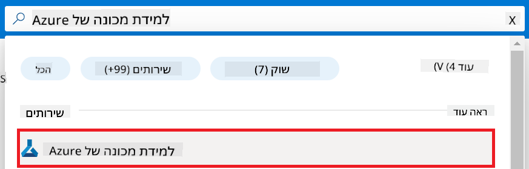

2. בחר **+ Create** מתפריט הניווט.

3. בחר **New workspace** מתפריט הניווט.

    

4. בצע את המשימות הבאות:

    - בחר את **המנוי** שלך ב-Azure.  
    - בחר את **קבוצת המשאבים** לשימוש (צור חדשה במידת הצורך).  
    - הזן את **שם סביבת העבודה**. חייב להיות ערך ייחודי.  
    - בחר את **האזור** שבו תרצה להשתמש.  
    - בחר את **חשבון האחסון** לשימוש (צור חדש במידת הצורך).  
    - בחר את **Key vault** לשימוש (צור חדש במידת הצורך).  
    - בחר את **Application insights** לשימוש (צור חדש במידת הצורך).  
    - בחר את **רישום המכולות (Container registry)** לשימוש (צור חדש במידת הצורך).

    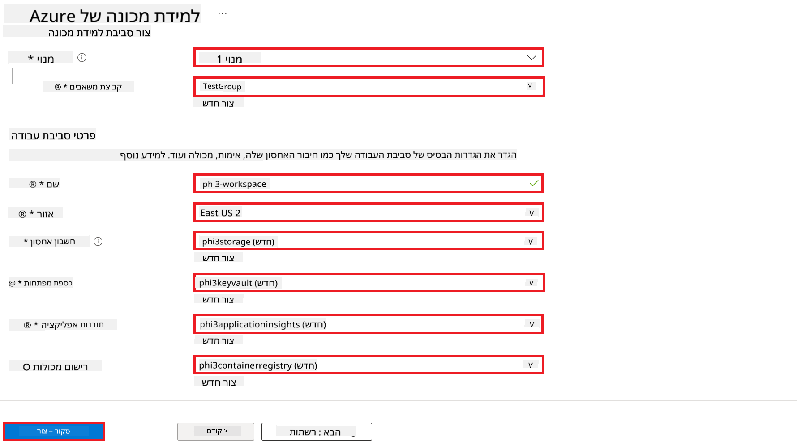

5. בחר **Review + Create**.

6. בחר **Create**.

### בקשת מכסות GPU במנוי Azure

במדריך זה תלמד כיצד לכוונן ולפרוס מודל Phi-3, תוך שימוש ב-GPU. ללכוונון תשתמש ב-GPU מסוג *Standard_NC24ads_A100_v4*, שדורש בקשת מכסה. לפריסה תשתמש ב-GPU מסוג *Standard_NC6s_v3*, שגם הוא דורש בקשת מכסה.

> [!NOTE]  
> רק מנויים מסוג Pay-As-You-Go (סוג המנוי הסטנדרטי) זכאים להקצאת GPU; מנויי הטבות אינם נתמכים כרגע.  
>

1. בקר ב-[Azure ML Studio](https://ml.azure.com/home?wt.mc_id=studentamb_279723).

1. בצע את המשימות הבאות כדי לבקש מכסת *Standard NCADSA100v4 Family*:

    - בחר **Quota** מהטאב בצד שמאל.  
    - בחר את **משפחת המכונות הווירטואליות** לשימוש. לדוגמה, בחר **Standard NCADSA100v4 Family Cluster Dedicated vCPUs**, שכוללת את ה-GPU מסוג *Standard_NC24ads_A100_v4*.  
    - בחר **Request quota** מתפריט הניווט.

        

    - בדף בקשת המכסה, הזן את **המגבלה החדשה של הליבות** שברצונך להשתמש בה. לדוגמה, 24.  
    - בדף בקשת המכסה, בחר **Submit** כדי לשלוח את בקשת המכסה ל-GPU.

1. בצע את המשימות הבאות כדי לבקש מכסת *Standard NCSv3 Family*:

    - בחר **Quota** מהטאב בצד שמאל.  
    - בחר את **משפחת המכונות הווירטואליות** לשימוש. לדוגמה, בחר **Standard NCSv3 Family Cluster Dedicated vCPUs**, שכוללת את ה-GPU מסוג *Standard_NC6s_v3*.  
    - בחר **Request quota** מתפריט הניווט.  
    - בדף בקשת המכסה, הזן את **המגבלה החדשה של הליבות** שברצונך להשתמש בה. לדוגמה, 24.  
    - בדף בקשת המכסה, בחר **Submit** כדי לשלוח את בקשת המכסה ל-GPU.

### הוספת שיוך תפקיד

כדי לכוונן ולפרוס את המודלים שלך, עליך תחילה ליצור User Assigned Managed Identity (UAI) ולהקצות לה את ההרשאות המתאימות. UAI זו תשמש לאימות במהלך הפריסה.

#### יצירת User Assigned Managed Identity (UAI)

1. הקלד *managed identities* בשורת ה**חיפוש** בראש דף הפורטל ובחר **Managed Identities** מתוך האפשרויות שמופיעות.

    

1. בחר **+ Create**.

    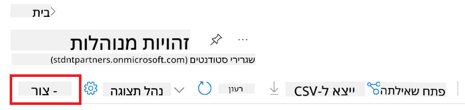

1. בצע את המשימות הבאות:

    - בחר את **המנוי** שלך ב-Azure.  
    - בחר את **קבוצת המשאבים** לשימוש (צור חדשה במידת הצורך).  
    - בחר את **האזור** שבו תרצה להשתמש.  
    - הזן את ה**שם**. חייב להיות ערך ייחודי.

    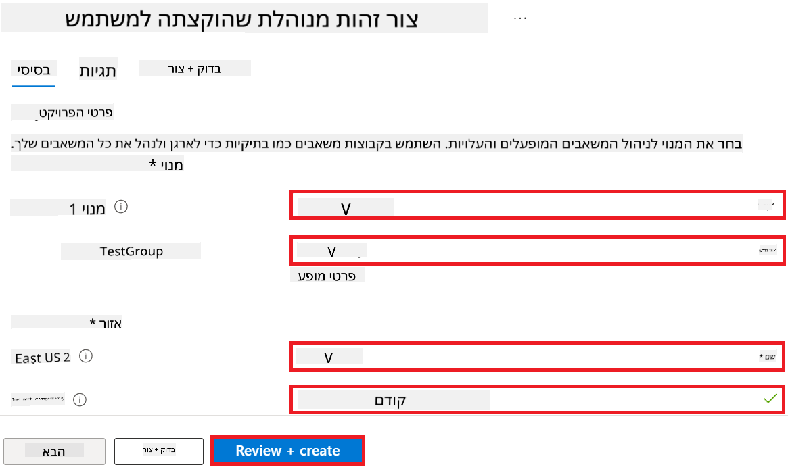

1. בחר **Review + create**.

1. בחר **+ Create**.

#### הוספת שיוך תפקיד Contributor ל-Managed Identity

1. עבור למשאב Managed Identity שיצרת.

1. בחר **Azure role assignments** מהטאב בצד שמאל.

1. בחר **+Add role assignment** מתפריט הניווט.

1. בדף הוספת שיוך תפקיד, בצע את המשימות הבאות:  
    - בחר את **הטווח** ל-**Resource group**.  
    - בחר את **המנוי** שלך ב-Azure.  
    - בחר את **קבוצת המשאבים** לשימוש.  
    - בחר את ה**תפקיד** ל-**Contributor**.

    

2. בחר **Save**.

#### הוספת שיוך תפקיד Storage Blob Data Reader ל-Managed Identity

1. הקלד *storage accounts* בשורת ה**חיפוש** בראש דף הפורטל ובחר **Storage accounts** מתוך האפשרויות שמופיעות.

    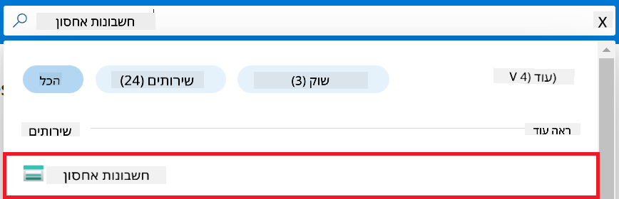

1. בחר את חשבון האחסון המשויך לסביבת העבודה של Azure Machine Learning שיצרת. לדוגמה, *finetunephistorage*.

1. בצע את המשימות הבאות כדי לנווט לדף הוספת שיוך תפקיד:

    - עבור לחשבון האחסון שיצרת ב-Azure.  
    - בחר **Access Control (IAM)** מהטאב בצד שמאל.  
    - בחר **+ Add** מתפריט הניווט.  
    - בחר **Add role assignment** מתפריט הניווט.

    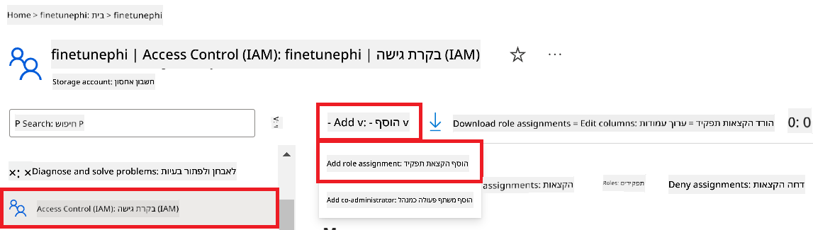

1. בדף הוספת שיוך תפקיד, בצע את המשימות הבאות:

    - בדף התפקיד, הקלד *Storage Blob Data Reader* בשורת ה**חיפוש** ובחר **Storage Blob Data Reader** מתוך האפשרויות שמופיעות.  
    - בדף התפקיד, בחר **Next**.  
    - בדף החברים, בחר **Assign access to** **Managed identity**.  
    - בדף החברים, בחר **+ Select members**.  
    - בדף בחירת Managed identities, בחר את **המנוי** שלך ב-Azure.  
    - בדף בחירת Managed identities, בחר את ה-**Managed identity** ל-**Manage Identity**.  
    - בדף בחירת Managed identities, בחר את ה-Manage Identity שיצרת. לדוגמה, *finetunephi-managedidentity*.  
    - בדף בחירת Managed identities, בחר **Select**.

    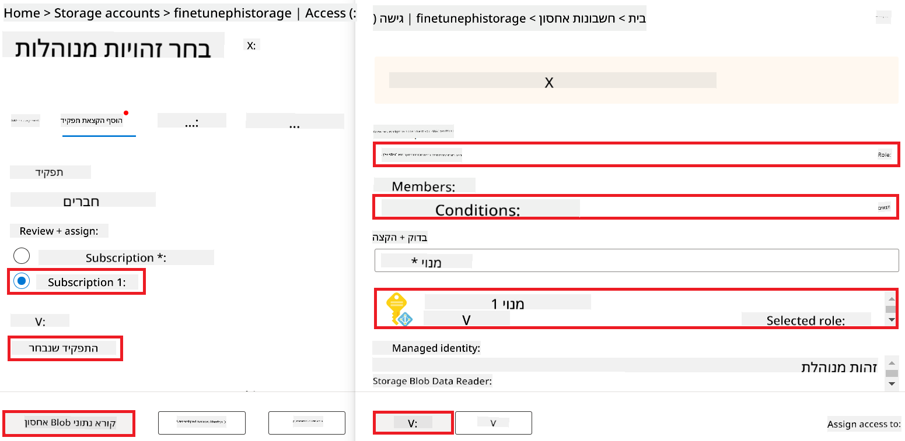

1. בחר **Review + assign**.

#### הוספת שיוך תפקיד AcrPull ל-Managed Identity

1. הקלד *container registries* בשורת ה**חיפוש** בראש דף הפורטל ובחר **Container registries** מתוך האפשרויות שמופיעות.

    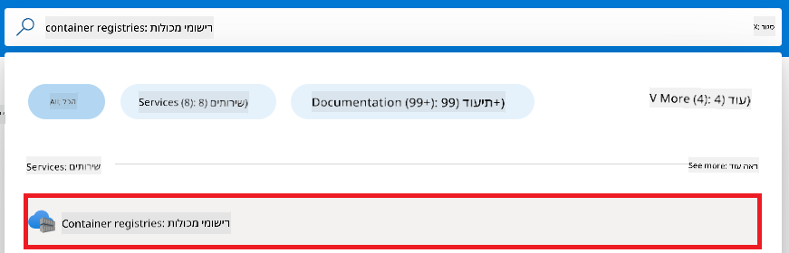

1. בחר את רישום המכולות המשויך לסביבת העבודה של Azure Machine Learning. לדוגמה, *finetunephicontainerregistry*

1. בצע את המשימות הבאות כדי לנווט לדף הוספת שיוך תפקיד:

    - בחר **Access Control (IAM)** מהטאב בצד שמאל.  
    - בחר **+ Add** מתפריט הניווט.  
    - בחר **Add role assignment** מתפריט הניווט.

1. בדף הוספת שיוך תפקיד, בצע את המשימות הבאות:

    - בדף התפקיד, הקלד *AcrPull* בשורת ה**חיפוש** ובחר **AcrPull** מתוך האפשרויות שמופיעות.  
    - בדף התפקיד, בחר **Next**.  
    - בדף החברים, בחר **Assign access to** **Managed identity**.  
    - בדף החברים, בחר **+ Select members**.  
    - בדף בחירת Managed identities, בחר את **המנוי** שלך ב-Azure.  
    - בדף בחירת Managed identities, בחר את ה-**Managed identity** ל-**Manage Identity**.  
    - בדף בחירת Managed identities, בחר את ה-Manage Identity שיצרת. לדוגמה, *finetunephi-managedidentity*.  
    - בדף בחירת Managed identities, בחר **Select**.  
    - בחר **Review + assign**.

### הקמת פרויקט

כדי להוריד את מערכי הנתונים הדרושים ללכוונון, תקים סביבה מקומית.

בתרגיל זה תעשה:

- יצירת תיקייה לעבודה בתוכה.  
- יצירת סביבה וירטואלית.  
- התקנת החבילות הנדרשות.  
- יצירת קובץ *download_dataset.py* להורדת מערך הנתונים.

#### יצירת תיקייה לעבודה בתוכה

1. פתח חלון טרמינל והקלד את הפקודה הבאה ליצירת תיקייה בשם *finetune-phi* בנתיב ברירת המחדל.

    ```console
    mkdir finetune-phi
    ```

2. הקלד את הפקודה הבאה בטרמינל כדי לנווט לתיקיית *finetune-phi* שיצרת.

    ```console
    cd finetune-phi
    ```

#### יצירת סביבה וירטואלית

1. הקלד את הפקודה הבאה בטרמינל כדי ליצור סביבה וירטואלית בשם *.venv*.

    ```console
    python -m venv .venv
    ```

2. הקלד את הפקודה הבאה בטרמינל כדי להפעיל את הסביבה הוירטואלית.

    ```console
    .venv\Scripts\activate.bat
    ```

> [!NOTE]  
> אם זה עבד, תראה את *(.venv)* לפני שורת הפקודה.

#### התקנת החבילות הנדרשות

1. הקלד את הפקודות הבאות בטרמינל כדי להתקין את החבילות הנדרשות.

    ```console
    pip install datasets==2.19.1
    ```

#### יצירת `download_dataset.py`

> [!NOTE]  
> מבנה התיקייה המלא:  
>  
> ```text
> └── YourUserName
> .    └── finetune-phi
> .        └── download_dataset.py
> ```

1. פתח את **Visual Studio Code**.

1. בחר **File** מתפריט העליון.

1. בחר **Open Folder**.

1. בחר את תיקיית *finetune-phi* שיצרת, שנמצאת ב-*C:\Users\yourUserName\finetune-phi*.

    

1. בחלונית השמאלית של Visual Studio Code, לחץ ימני ובחר **New File** כדי ליצור קובץ חדש בשם *download_dataset.py*.

    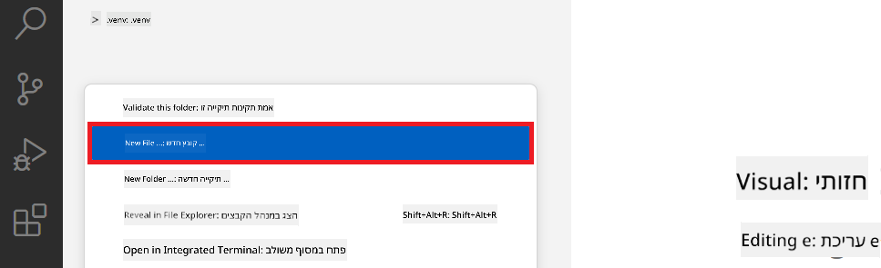

### הכנת מערך נתונים ללכוונון

בתרגיל זה תריץ את הקובץ *download_dataset.py* כדי להוריד את מערכי הנתונים *ultrachat_200k* לסביבה המקומית שלך. לאחר מכן תשתמש במערכי הנתונים הללו ללכוונון מודל Phi-3 ב-Azure Machine Learning.

בתרגיל זה תעשה:

- הוספת קוד לקובץ *download_dataset.py* להורדת מערכי הנתונים.  
- הרצת קובץ *download_dataset.py* להורדת מערכי הנתונים לסביבה המקומית.

#### הורדת מערך הנתונים באמצעות *download_dataset.py*

1. פתח את קובץ *download_dataset.py* ב-Visual Studio Code.

1. הוסף את הקוד הבא לתוך קובץ *download_dataset.py*.

    ```python
    import json
    import os
    from datasets import load_dataset

    def load_and_split_dataset(dataset_name, config_name, split_ratio):
        """
        Load and split a dataset.
        """
        # Load the dataset with the specified name, configuration, and split ratio
        dataset = load_dataset(dataset_name, config_name, split=split_ratio)
        print(f"Original dataset size: {len(dataset)}")
        
        # Split the dataset into train and test sets (80% train, 20% test)
        split_dataset = dataset.train_test_split(test_size=0.2)
        print(f"Train dataset size: {len(split_dataset['train'])}")
        print(f"Test dataset size: {len(split_dataset['test'])}")
        
        return split_dataset

    def save_dataset_to_jsonl(dataset, filepath):
        """
        Save a dataset to a JSONL file.
        """
        # Create the directory if it does not exist
        os.makedirs(os.path.dirname(filepath), exist_ok=True)
        
        # Open the file in write mode
        with open(filepath, 'w', encoding='utf-8') as f:
            # Iterate over each record in the dataset
            for record in dataset:
                # Dump the record as a JSON object and write it to the file
                json.dump(record, f)
                # Write a newline character to separate records
                f.write('\n')
        
        print(f"Dataset saved to {filepath}")

    def main():
        """
        Main function to load, split, and save the dataset.
        """
        # Load and split the ULTRACHAT_200k dataset with a specific configuration and split ratio
        dataset = load_and_split_dataset("HuggingFaceH4/ultrachat_200k", 'default', 'train_sft[:1%]')
        
        # Extract the train and test datasets from the split
        train_dataset = dataset['train']
        test_dataset = dataset['test']

        # Save the train dataset to a JSONL file
        save_dataset_to_jsonl(train_dataset, "data/train_data.jsonl")
        
        # Save the test dataset to a separate JSONL file
        save_dataset_to_jsonl(test_dataset, "data/test_data.jsonl")

    if __name__ == "__main__":
        main()

    ```

1. הקלד את הפקודה הבאה בטרמינל כדי להריץ את הסקריפט ולהוריד את מערך הנתונים לסביבה המקומית.

    ```console
    python download_dataset.py
    ```

1. אמת שמערכי הנתונים נשמרו בהצלחה בתיקיית *finetune-phi/data* המקומית שלך.

> [!NOTE]  
> #### הערה לגבי גודל מערך הנתונים וז
1. בקרו ב-[Azure ML Studio](https://ml.azure.com/home?wt.mc_id=studentamb_279723).

1. בחרו ב-**Compute** מהכרטיסייה בצד שמאל.

1. בחרו ב-**Compute clusters** מתפריט הניווט.

1. בחרו ב-**+ New**.

    

1. בצעו את המשימות הבאות:

    - בחרו את ה-**Region** שבו תרצו להשתמש.
    - בחרו ב-**Virtual machine tier** ל-**Dedicated**.
    - בחרו ב-**Virtual machine type** ל-**GPU**.
    - בחרו במסנן **Virtual machine size** ל-**Select from all options**.
    - בחרו ב-**Virtual machine size** ל-**Standard_NC24ads_A100_v4**.

    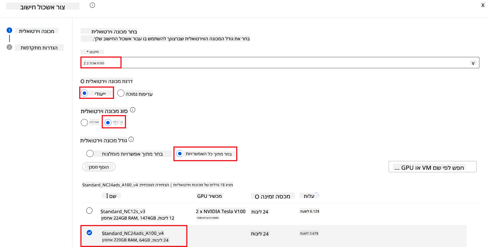

1. בחרו ב-**Next**.

1. בצעו את המשימות הבאות:

    - הזינו את **Compute name**. חייב להיות ערך ייחודי.
    - בחרו ב-**Minimum number of nodes** ל-**0**.
    - בחרו ב-**Maximum number of nodes** ל-**1**.
    - בחרו ב-**Idle seconds before scale down** ל-**120**.

    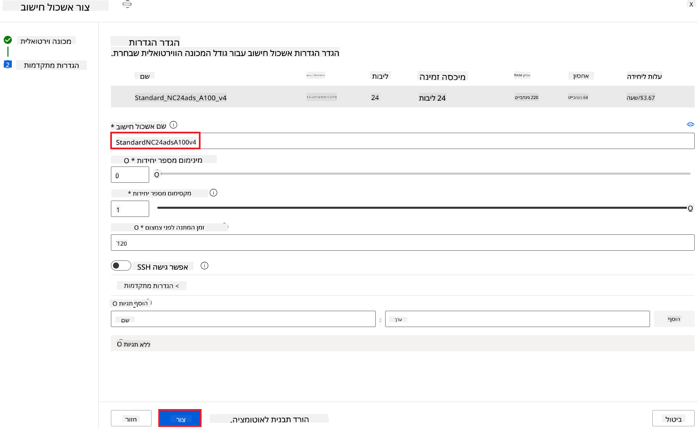

1. בחרו ב-**Create**.

#### כוונון מדויק של מודל Phi-3

1. בקרו ב-[Azure ML Studio](https://ml.azure.com/home?wt.mc_id=studentamb_279723).

1. בחרו את סביבת העבודה Azure Machine Learning שיצרתם.

    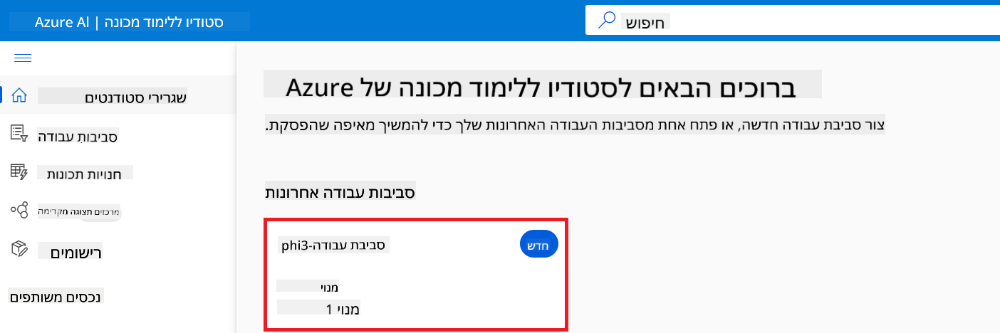

1. בצעו את המשימות הבאות:

    - בחרו ב-**Model catalog** מהכרטיסייה בצד שמאל.
    - הקלידו *phi-3-mini-4k* בשורת החיפוש ובחרו ב-**Phi-3-mini-4k-instruct** מתוך האפשרויות שמופיעות.

    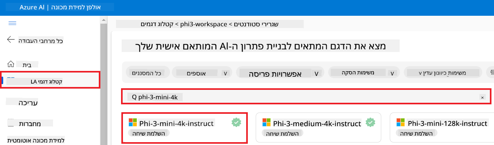

1. בחרו ב-**Fine-tune** מתפריט הניווט.

    

1. בצעו את המשימות הבאות:

    - בחרו ב-**Select task type** ל-**Chat completion**.
    - בחרו ב-**+ Select data** כדי להעלות **Traning data**.
    - בחרו בסוג העלאת נתוני האימות ל-**Provide different validation data**.
    - בחרו ב-**+ Select data** כדי להעלות **Validation data**.

    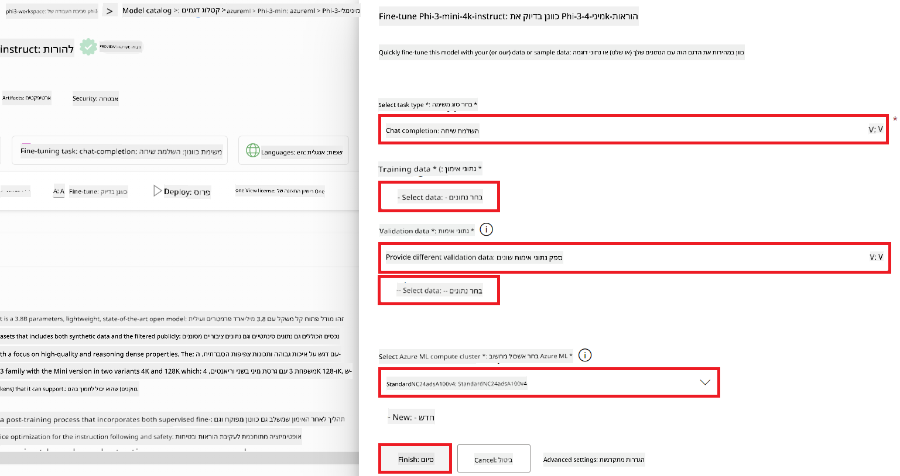

    > [!TIP]
    >
    > ניתן לבחור ב-**Advanced settings** כדי להתאים אישית הגדרות כמו **learning_rate** ו-**lr_scheduler_type** לשיפור תהליך הכוונון המדויק לפי הצרכים הספציפיים שלכם.

1. בחרו ב-**Finish**.

1. בתרגיל זה כווננתם בהצלחה את מודל Phi-3 באמצעות Azure Machine Learning. שימו לב שתהליך הכוונון המדויק עלול לקחת זמן משמעותי. לאחר הפעלת משימת הכוונון, יש להמתין לסיומה. ניתן לעקוב אחרי סטטוס המשימה בכרטיסיית Jobs בצד שמאל בסביבת העבודה שלכם ב-Azure Machine Learning. בסדרה הבאה תפרסמו את המודל הכוונן ותשלבו אותו עם Prompt flow.

    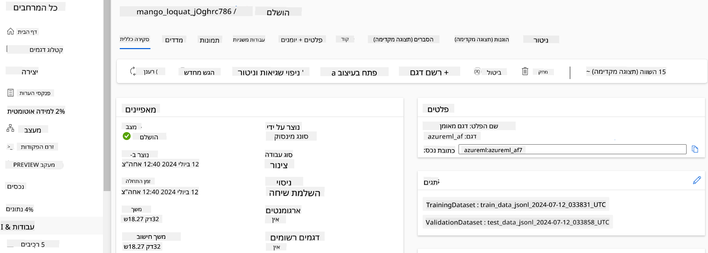

### פריסת מודל Phi-3 המכוונן

כדי לשלב את מודל Phi-3 המכוונן עם Prompt flow, יש לפרוס את המודל כדי לאפשר גישה בזמן אמת. תהליך זה כולל רישום המודל, יצירת נקודת קצה מקוונת ופריסת המודל.

בתרגיל זה תבצעו:

- רישום המודל המכוונן בסביבת העבודה Azure Machine Learning.
- יצירת נקודת קצה מקוונת.
- פריסת מודל Phi-3 המכוונן הרשום.

#### רישום המודל המכוונן

1. בקרו ב-[Azure ML Studio](https://ml.azure.com/home?wt.mc_id=studentamb_279723).

1. בחרו את סביבת העבודה Azure Machine Learning שיצרתם.

    

1. בחרו ב-**Models** מהכרטיסייה בצד שמאל.
1. בחרו ב-**+ Register**.
1. בחרו ב-**From a job output**.

    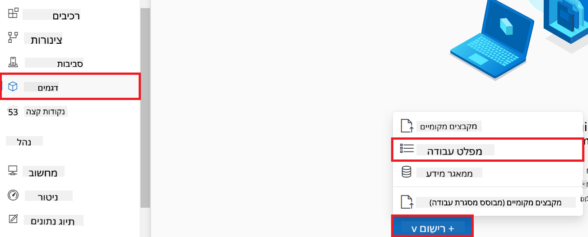

1. בחרו את המשימה שיצרתם.

    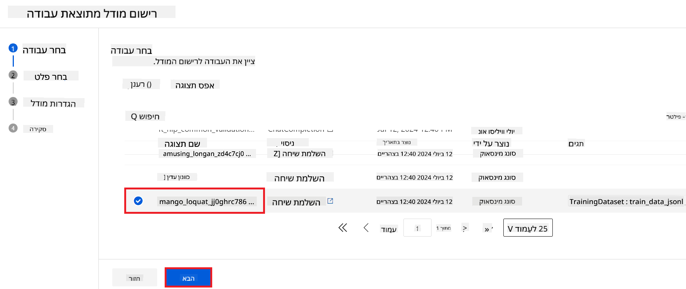

1. בחרו ב-**Next**.

1. בחרו ב-**Model type** ל-**MLflow**.

1. ודאו ש-**Job output** מסומן; זה אמור להיבחר אוטומטית.

    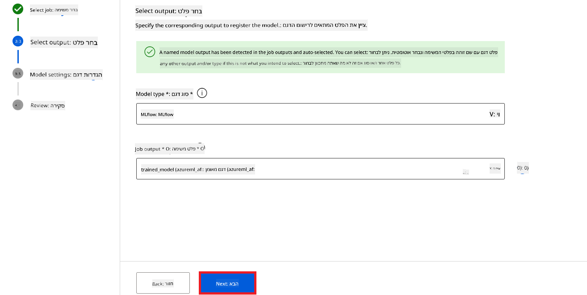

2. בחרו ב-**Next**.

3. בחרו ב-**Register**.

    

4. ניתן לצפות במודל הרשום דרך תפריט **Models** בכרטיסייה בצד שמאל.

    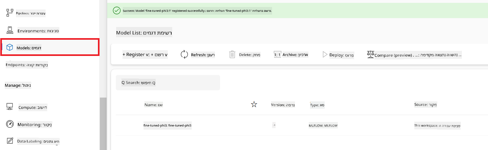

#### פריסת המודל המכוונן

1. נווטו לסביבת העבודה Azure Machine Learning שיצרתם.

1. בחרו ב-**Endpoints** מהכרטיסייה בצד שמאל.

1. בחרו ב-**Real-time endpoints** מתפריט הניווט.

    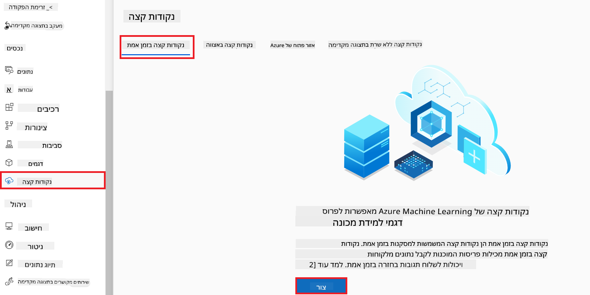

1. בחרו ב-**Create**.

1. בחרו את המודל הרשום שיצרתם.

    

1. בחרו ב-**Select**.

1. בצעו את המשימות הבאות:

    - בחרו ב-**Virtual machine** ל-*Standard_NC6s_v3*.
    - בחרו את **Instance count** שברצונכם להשתמש בו. לדוגמה, *1*.
    - בחרו ב-**Endpoint** ל-**New** כדי ליצור נקודת קצה חדשה.
    - הזינו את **Endpoint name**. חייב להיות ערך ייחודי.
    - הזינו את **Deployment name**. חייב להיות ערך ייחודי.

    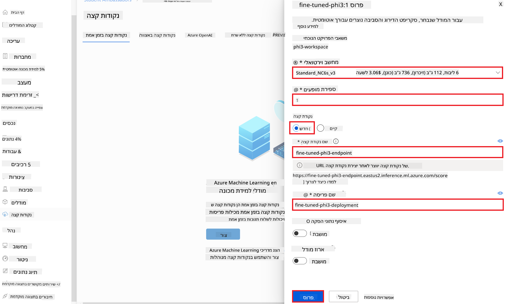

1. בחרו ב-**Deploy**.

> [!WARNING]
> כדי למנוע חיובים נוספים בחשבונכם, ודאו למחוק את נקודת הקצה שנוצרה בסביבת העבודה Azure Machine Learning.
>

#### בדיקת סטטוס הפריסה בסביבת העבודה Azure Machine Learning

1. נווטו לסביבת העבודה Azure Machine Learning שיצרתם.

1. בחרו ב-**Endpoints** מהכרטיסייה בצד שמאל.

1. בחרו את נקודת הקצה שיצרתם.

    

1. בדף זה ניתן לנהל את נקודות הקצה במהלך תהליך הפריסה.

> [!NOTE]
> לאחר סיום הפריסה, ודאו שה-**Live traffic** מוגדר ל-**100%**. אם לא, בחרו ב-**Update traffic** כדי לעדכן את הגדרות התנועה. שימו לב שלא ניתן לבדוק את המודל אם התנועה מוגדרת ל-0%.
>
> 
>

## תרחיש 3: שילוב עם Prompt flow ושיחה עם המודל המותאם שלכם ב-Azure AI Foundry

### שילוב מודל Phi-3 המותאם עם Prompt flow

לאחר שפרסתם בהצלחה את המודל המכוונן, ניתן לשלבו עם Prompt Flow לשימוש במודל בזמן אמת, מה שמאפשר מגוון משימות אינטראקטיביות עם מודל Phi-3 המותאם שלכם.

בתרגיל זה תבצעו:

- יצירת Azure AI Foundry Hub.
- יצירת Azure AI Foundry Project.
- יצירת Prompt flow.
- הוספת חיבור מותאם למודל Phi-3 המכוונן.
- הגדרת Prompt flow לשיחה עם מודל Phi-3 המותאם שלכם.

> [!NOTE]
> ניתן גם לשלב עם Promptflow באמצעות Azure ML Studio. אותו תהליך שילוב תקף גם ל-Azure ML Studio.

#### יצירת Azure AI Foundry Hub

יש ליצור Hub לפני יצירת הפרויקט. ה-Hub מתפקד כמו Resource Group, ומאפשר לארגן ולנהל מספר פרויקטים בתוך Azure AI Foundry.

1. בקרו ב-[Azure AI Foundry](https://ai.azure.com/?WT.mc_id=aiml-137032-kinfeylo).

1. בחרו ב-**All hubs** מהכרטיסייה בצד שמאל.

1. בחרו ב-**+ New hub** מתפריט הניווט.

    

1. בצעו את המשימות הבאות:

    - הזינו את **Hub name**. חייב להיות ערך ייחודי.
    - בחרו במנוי Azure שלכם (**Subscription**).
    - בחרו ב-**Resource group** לשימוש (צרו חדש במידת הצורך).
    - בחרו את ה-**Location** הרצוי.
    - בחרו ב-**Connect Azure AI Services** לשימוש (צרו חדש במידת הצורך).
    - בחרו ב-**Connect Azure AI Search** ל-**Skip connecting**.

    

1. בחרו ב-**Next**.

#### יצירת Azure AI Foundry Project

1. ב-Hub שיצרתם, בחרו ב-**All projects** מהכרטיסייה בצד שמאל.

1. בחרו ב-**+ New project** מתפריט הניווט.

    

1. הזינו את **Project name**. חייב להיות ערך ייחודי.

    

1. בחרו ב-**Create a project**.

#### הוספת חיבור מותאם למודל Phi-3 המכוונן

כדי לשלב את מודל Phi-3 המותאם עם Prompt flow, יש לשמור את נקודת הקצה ומפתח ה-API של המודל בחיבור מותאם. הגדרה זו מבטיחה גישה למודל המותאם ב-Prompt flow.

#### הגדרת מפתח API וכתובת נקודת הקצה של מודל Phi-3 המכוונן

1. בקרו ב-[Azure ML Studio](https://ml.azure.com/home?WT.mc_id=aiml-137032-kinfeylo).

1. נווטו לסביבת העבודה Azure Machine Learning שיצרתם.

1. בחרו ב-**Endpoints** מהכרטיסייה בצד שמאל.

    

1. בחרו את נקודת הקצה שיצרתם.

    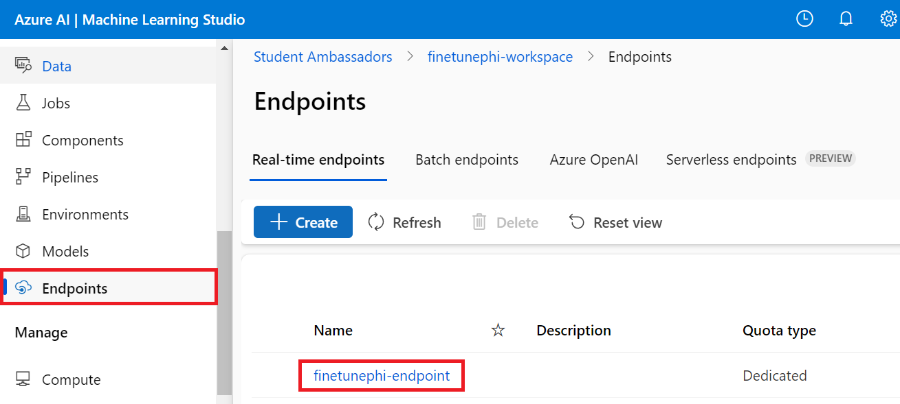

1. בחרו ב-**Consume** מתפריט הניווט.

1. העתיקו את **REST endpoint** ואת **Primary key** שלכם.


#### הוסף את החיבור המותאם אישית

1. בקר ב-[Azure AI Foundry](https://ai.azure.com/?WT.mc_id=aiml-137032-kinfeylo).

1. עבור לפרויקט Azure AI Foundry שיצרת.

1. בפרויקט שיצרת, בחר ב-**Settings** מהכרטיסייה בצד שמאל.

1. בחר ב-**+ New connection**.

    

1. בחר ב-**Custom keys** מתפריט הניווט.

    

1. בצע את הפעולות הבאות:

    - בחר ב-**+ Add key value pairs**.
    - עבור שם המפתח, הזן **endpoint** והדבק את ה-endpoint שהעתקת מ-Azure ML Studio בשדה הערך.
    - בחר שוב ב-**+ Add key value pairs**.
    - עבור שם המפתח, הזן **key** והדבק את המפתח שהעתקת מ-Azure ML Studio בשדה הערך.
    - לאחר הוספת המפתחות, סמן את **is secret** כדי למנוע חשיפת המפתח.

    

1. בחר ב-**Add connection**.

#### צור Prompt flow

הוספת חיבור מותאם אישית ב-Azure AI Foundry. כעת, ניצור Prompt flow באמצעות השלבים הבאים. לאחר מכן, תחבר את ה-Prompt flow הזה לחיבור המותאם כדי שתוכל להשתמש במודל המתוחכם בתוך ה-Prompt flow.

1. עבור לפרויקט Azure AI Foundry שיצרת.

1. בחר ב-**Prompt flow** מהכרטיסייה בצד שמאל.

1. בחר ב-**+ Create** מתפריט הניווט.

    

1. בחר ב-**Chat flow** מתפריט הניווט.

    

1. הזן את **שם התיקייה** לשימוש.

    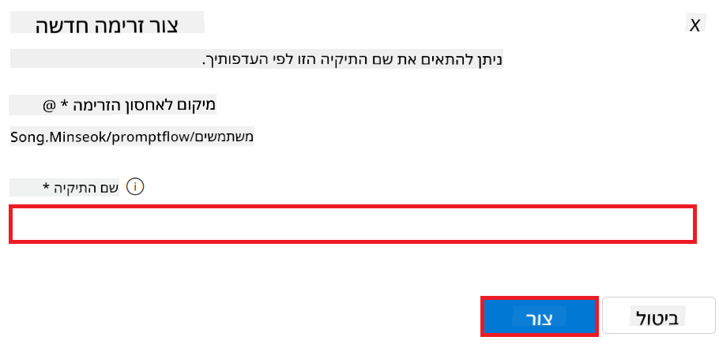

2. בחר ב-**Create**.

#### הגדר את ה-Prompt flow לשיחה עם מודל Phi-3 מותאם אישית שלך

עליך לשלב את מודל Phi-3 המתוחכם ב-Prompt flow. עם זאת, ה-Prompt flow הקיים אינו מיועד למטרה זו. לכן, עליך לעצב מחדש את ה-Prompt flow כדי לאפשר את השילוב של המודל המותאם.

1. ב-Prompt flow, בצע את הפעולות הבאות כדי לבנות מחדש את הזרימה הקיימת:

    - בחר ב-**Raw file mode**.
    - מחק את כל הקוד הקיים בקובץ *flow.dag.yml*.
    - הוסף את הקוד הבא לקובץ *flow.dag.yml*.

        ```yml
        inputs:
          input_data:
            type: string
            default: "Who founded Microsoft?"

        outputs:
          answer:
            type: string
            reference: ${integrate_with_promptflow.output}

        nodes:
        - name: integrate_with_promptflow
          type: python
          source:
            type: code
            path: integrate_with_promptflow.py
          inputs:
            input_data: ${inputs.input_data}
        ```

    - בחר ב-**Save**.

    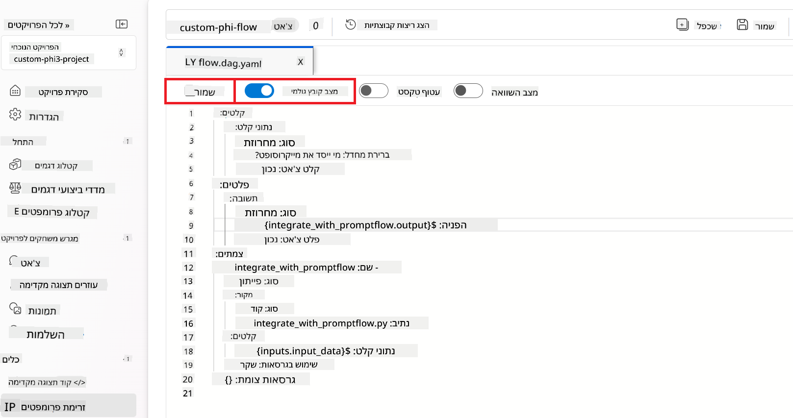

1. הוסף את הקוד הבא לקובץ *integrate_with_promptflow.py* כדי להשתמש במודל Phi-3 המותאם ב-Prompt flow.

    ```python
    import logging
    import requests
    from promptflow import tool
    from promptflow.connections import CustomConnection

    # Logging setup
    logging.basicConfig(
        format="%(asctime)s - %(levelname)s - %(name)s - %(message)s",
        datefmt="%Y-%m-%d %H:%M:%S",
        level=logging.DEBUG
    )
    logger = logging.getLogger(__name__)

    def query_phi3_model(input_data: str, connection: CustomConnection) -> str:
        """
        Send a request to the Phi-3 model endpoint with the given input data using Custom Connection.
        """

        # "connection" is the name of the Custom Connection, "endpoint", "key" are the keys in the Custom Connection
        endpoint_url = connection.endpoint
        api_key = connection.key

        headers = {
            "Content-Type": "application/json",
            "Authorization": f"Bearer {api_key}"
        }
        data = {
            "input_data": {
                "input_string": [
                    {"role": "user", "content": input_data}
                ],
                "parameters": {
                    "temperature": 0.7,
                    "max_new_tokens": 128
                }
            }
        }
        try:
            response = requests.post(endpoint_url, json=data, headers=headers)
            response.raise_for_status()
            
            # Log the full JSON response
            logger.debug(f"Full JSON response: {response.json()}")

            result = response.json()["output"]
            logger.info("Successfully received response from Azure ML Endpoint.")
            return result
        except requests.exceptions.RequestException as e:
            logger.error(f"Error querying Azure ML Endpoint: {e}")
            raise

    @tool
    def my_python_tool(input_data: str, connection: CustomConnection) -> str:
        """
        Tool function to process input data and query the Phi-3 model.
        """
        return query_phi3_model(input_data, connection)

    ```

    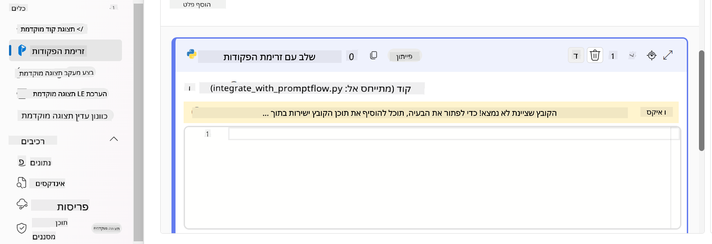

> [!NOTE]
> למידע מפורט יותר על שימוש ב-Prompt flow ב-Azure AI Foundry, ניתן לעיין ב-[Prompt flow ב-Azure AI Foundry](https://learn.microsoft.com/azure/ai-studio/how-to/prompt-flow).

1. בחר ב-**Chat input**, **Chat output** כדי לאפשר שיחה עם המודל שלך.

    

1. כעת אתה מוכן לשוחח עם מודל Phi-3 המותאם שלך. בתרגיל הבא תלמד כיצד להפעיל את ה-Prompt flow ולהשתמש בו לשיחה עם מודל Phi-3 המתוחכם שלך.

> [!NOTE]
>
> הזרימה המחודשת צריכה להיראות כמו בתמונה למטה:
>
> 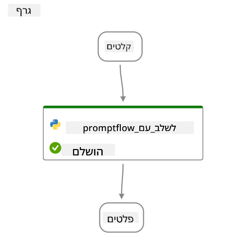
>

### שוחח עם מודל Phi-3 מותאם אישית שלך

כעת לאחר שעיצבת ושילבת את מודל Phi-3 המותאם עם Prompt flow, אתה מוכן להתחיל אינטראקציה איתו. תרגיל זה ינחה אותך בתהליך ההגדרה וההפעלה של שיחה עם המודל באמצעות Prompt flow. בעזרת השלבים האלה תוכל לנצל במלואן את יכולות מודל Phi-3 המתוחכם שלך למשימות ושיחות שונות.

- שוחח עם מודל Phi-3 מותאם אישית שלך באמצעות Prompt flow.

#### הפעלת Prompt flow

1. בחר ב-**Start compute sessions** כדי להפעיל את ה-Prompt flow.

    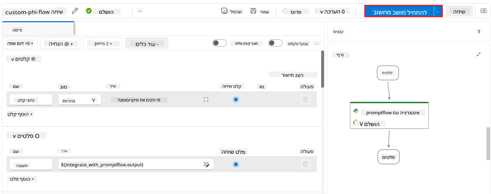

1. בחר ב-**Validate and parse input** כדי לעדכן פרמטרים.

    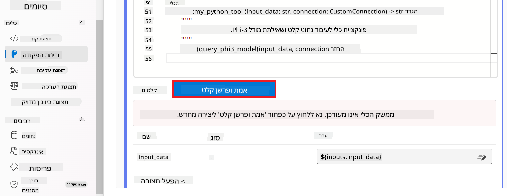

1. בחר ב-**Value** של **connection** לחיבור המותאם שיצרת. לדוגמה, *connection*.

    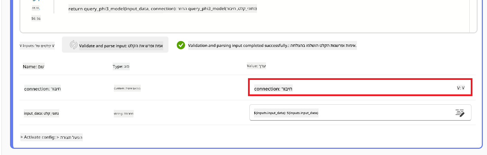

#### שוחח עם המודל המותאם שלך

1. בחר ב-**Chat**.

    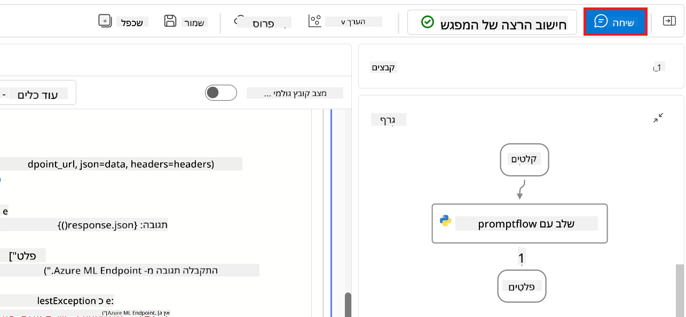

1. הנה דוגמה לתוצאות: עכשיו תוכל לשוחח עם מודל Phi-3 המותאם שלך. מומלץ לשאול שאלות המבוססות על הנתונים שבהם השתמשת לכיול המודל.

    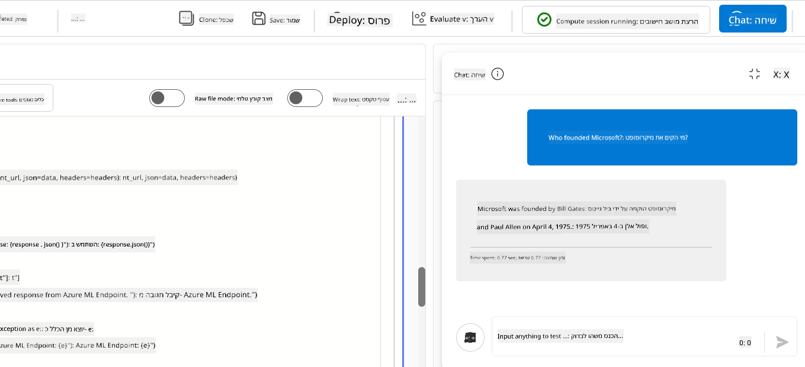

**כתב ויתור**:  
מסמך זה תורגם באמצעות שירות תרגום מבוסס בינה מלאכותית [Co-op Translator](https://github.com/Azure/co-op-translator). למרות שאנו שואפים לדיוק, יש לקחת בחשבון כי תרגומים אוטומטיים עלולים להכיל שגיאות או אי-דיוקים. המסמך המקורי בשפת המקור שלו נחשב למקור הסמכותי. למידע קריטי מומלץ להשתמש בתרגום מקצועי על ידי אדם. אנו לא נושאים באחריות לכל אי-הבנה או פרשנות שגויה הנובעת משימוש בתרגום זה.