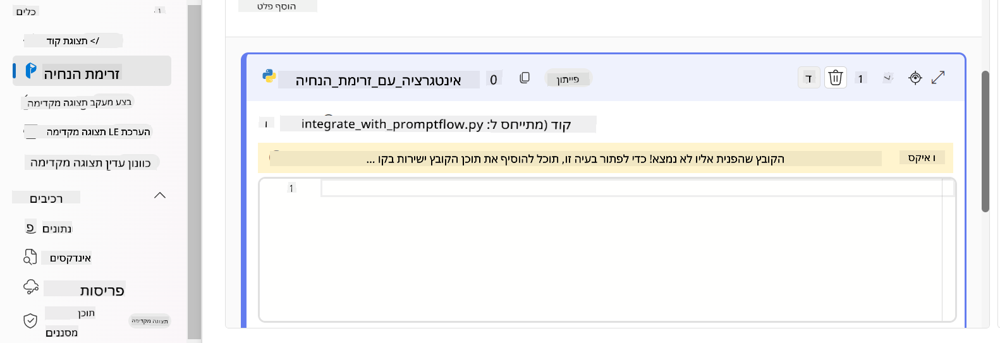
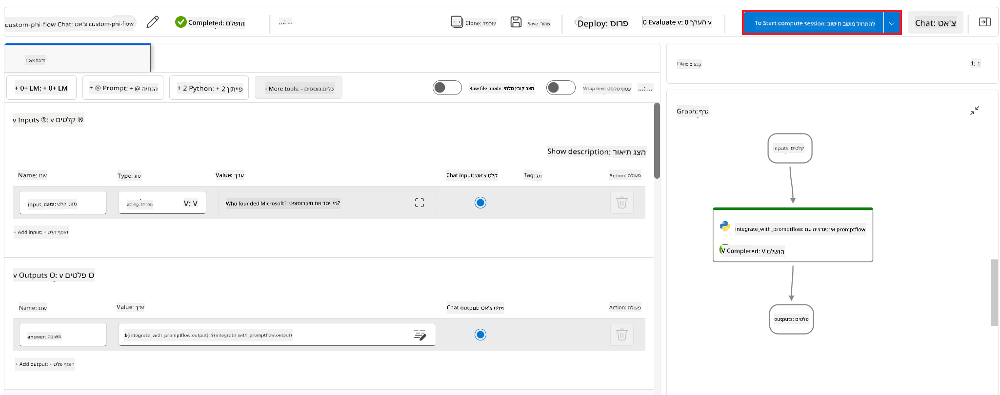

<!--
CO_OP_TRANSLATOR_METADATA:
{
  "original_hash": "ecbd9179a21edbaafaf114d47f09f3e3",
  "translation_date": "2025-07-17T01:40:22+00:00",
  "source_file": "md/02.Application/01.TextAndChat/Phi3/E2E_Phi-3-FineTuning_PromptFlow_Integration_AIFoundry.md",
  "language_code": "he"
}
-->
# כוונון מדויק ואינטגרציה של מודלים מותאמים אישית Phi-3 עם Prompt flow ב-Azure AI Foundry

דוגמת קצה-לקצה (E2E) זו מבוססת על המדריך "[Fine-Tune and Integrate Custom Phi-3 Models with Prompt Flow in Azure AI Foundry](https://techcommunity.microsoft.com/t5/educator-developer-blog/fine-tune-and-integrate-custom-phi-3-models-with-prompt-flow-in/ba-p/4191726?WT.mc_id=aiml-137032-kinfeylo)" מתוך קהילת הטכנולוגיה של מיקרוסופט. היא מציגה את התהליכים של כוונון מדויק, פריסה ואינטגרציה של מודלים מותאמים אישית Phi-3 עם Prompt flow ב-Azure AI Foundry.  
בשונה מדוגמת ה-E2E, "[Fine-Tune and Integrate Custom Phi-3 Models with Prompt Flow](./E2E_Phi-3-FineTuning_PromptFlow_Integration.md)", שכללה הרצת קוד מקומית, המדריך הזה מתמקד כולו בכוונון מדויק ואינטגרציה של המודל שלך בתוך Azure AI / ML Studio.

## סקירה כללית

בדוגמת ה-E2E הזו תלמד כיצד לכוונן מדויק את מודל Phi-3 ולשלב אותו עם Prompt flow ב-Azure AI Foundry. באמצעות Azure AI / ML Studio, תקים תהליך עבודה לפריסה ושימוש במודלים מותאמים אישית של בינה מלאכותית. דוגמת ה-E2E מחולקת לשלושה תרחישים:

**תרחיש 1: הקמת משאבי Azure והכנה לכוונון מדויק**

**תרחיש 2: כוונון מדויק של מודל Phi-3 ופריסה ב-Azure Machine Learning Studio**

**תרחיש 3: אינטגרציה עם Prompt flow ושיחה עם המודל המותאם שלך ב-Azure AI Foundry**

להלן סקירה של דוגמת ה-E2E הזו.


### תוכן העניינים

1. **[תרחיש 1: הקמת משאבי Azure והכנה לכוונון מדויק](../../../../../../md/02.Application/01.TextAndChat/Phi3)**  
    - [יצירת Azure Machine Learning Workspace](../../../../../../md/02.Application/01.TextAndChat/Phi3)  
    - [בקשת מכסות GPU במנוי Azure](../../../../../../md/02.Application/01.TextAndChat/Phi3)  
    - [הוספת שיוך תפקידים](../../../../../../md/02.Application/01.TextAndChat/Phi3)  
    - [הקמת פרויקט](../../../../../../md/02.Application/01.TextAndChat/Phi3)  
    - [הכנת מערך נתונים לכוונון מדויק](../../../../../../md/02.Application/01.TextAndChat/Phi3)  

1. **[תרחיש 2: כוונון מדויק של מודל Phi-3 ופריסה ב-Azure Machine Learning Studio](../../../../../../md/02.Application/01.TextAndChat/Phi3)**  
    - [כוונון מדויק של מודל Phi-3](../../../../../../md/02.Application/01.TextAndChat/Phi3)  
    - [פריסת מודל Phi-3 המכוונן](../../../../../../md/02.Application/01.TextAndChat/Phi3)  

1. **[תרחיש 3: אינטגרציה עם Prompt flow ושיחה עם המודל המותאם שלך ב-Azure AI Foundry](../../../../../../md/02.Application/01.TextAndChat/Phi3)**  
    - [אינטגרציה של מודל Phi-3 מותאם אישית עם Prompt flow](../../../../../../md/02.Application/01.TextAndChat/Phi3)  
    - [שיחה עם מודל Phi-3 המותאם שלך](../../../../../../md/02.Application/01.TextAndChat/Phi3)  

## תרחיש 1: הקמת משאבי Azure והכנה לכוונון מדויק

### יצירת Azure Machine Learning Workspace

1. הקלד *azure machine learning* בשורת החיפוש בראש דף הפורטל ובחר **Azure Machine Learning** מתוך האפשרויות שמופיעות.

    

2. בחר **+ Create** מתפריט הניווט.

3. בחר **New workspace** מתפריט הניווט.

    

4. בצע את המשימות הבאות:

    - בחר את **Subscription** של Azure שלך.  
    - בחר את **Resource group** לשימוש (צור חדש במידת הצורך).  
    - הזן **Workspace Name**. חייב להיות ערך ייחודי.  
    - בחר את **Region** שבו תרצה להשתמש.  
    - בחר את **Storage account** לשימוש (צור חדש במידת הצורך).  
    - בחר את **Key vault** לשימוש (צור חדש במידת הצורך).  
    - בחר את **Application insights** לשימוש (צור חדש במידת הצורך).  
    - בחר את **Container registry** לשימוש (צור חדש במידת הצורך).  

    

5. בחר **Review + Create**.

6. בחר **Create**.

### בקשת מכסות GPU במנוי Azure

במדריך זה תלמד כיצד לכוונן מדויק ולפרוס מודל Phi-3, תוך שימוש ב-GPU. לכוונון מדויק תשתמש ב-GPU מסוג *Standard_NC24ads_A100_v4*, שדורש בקשת מכסה. לפריסה תשתמש ב-GPU מסוג *Standard_NC6s_v3*, שגם הוא דורש בקשת מכסה.

> [!NOTE]  
> רק מנויי Pay-As-You-Go (סוג המנוי הסטנדרטי) זכאים להקצאת GPU; מנויי הטבות אינם נתמכים כרגע.  
>

1. בקר ב-[Azure ML Studio](https://ml.azure.com/home?wt.mc_id=studentamb_279723).

1. בצע את המשימות הבאות כדי לבקש מכסת *Standard NCADSA100v4 Family*:

    - בחר **Quota** מהטאב בצד שמאל.  
    - בחר את **Virtual machine family** לשימוש. לדוגמה, בחר **Standard NCADSA100v4 Family Cluster Dedicated vCPUs**, הכולל את ה-GPU *Standard_NC24ads_A100_v4*.  
    - בחר **Request quota** מתפריט הניווט.  

        

    - בדף Request quota, הזן את **New cores limit** שברצונך להשתמש בו. לדוגמה, 24.  
    - בדף Request quota, בחר **Submit** כדי לבקש את מכסת ה-GPU.  

1. בצע את המשימות הבאות כדי לבקש מכסת *Standard NCSv3 Family*:

    - בחר **Quota** מהטאב בצד שמאל.  
    - בחר את **Virtual machine family** לשימוש. לדוגמה, בחר **Standard NCSv3 Family Cluster Dedicated vCPUs**, הכולל את ה-GPU *Standard_NC6s_v3*.  
    - בחר **Request quota** מתפריט הניווט.  
    - בדף Request quota, הזן את **New cores limit** שברצונך להשתמש בו. לדוגמה, 24.  
    - בדף Request quota, בחר **Submit** כדי לבקש את מכסת ה-GPU.  

### הוספת שיוך תפקידים

כדי לכוונן מדויק ולפרוס את המודלים שלך, עליך קודם ליצור User Assigned Managed Identity (UAI) ולהקצות לה את ההרשאות המתאימות. ה-UAI ישמש לאימות במהלך הפריסה.

#### יצירת User Assigned Managed Identity (UAI)

1. הקלד *managed identities* בשורת החיפוש בראש דף הפורטל ובחר **Managed Identities** מתוך האפשרויות שמופיעות.

    

1. בחר **+ Create**.

    

1. בצע את המשימות הבאות:

    - בחר את **Subscription** של Azure שלך.  
    - בחר את **Resource group** לשימוש (צור חדש במידת הצורך).  
    - בחר את **Region** שבו תרצה להשתמש.  
    - הזן את ה-**Name**. חייב להיות ערך ייחודי.  

    

1. בחר **Review + create**.

1. בחר **+ Create**.

#### הוספת שיוך תפקיד Contributor ל-Managed Identity

1. עבור למשאב Managed Identity שיצרת.

1. בחר **Azure role assignments** מהטאב בצד שמאל.

1. בחר **+Add role assignment** מתפריט הניווט.

1. בדף Add role assignment, בצע את המשימות הבאות:  
    - בחר את **Scope** ל-**Resource group**.  
    - בחר את **Subscription** של Azure שלך.  
    - בחר את **Resource group** לשימוש.  
    - בחר את **Role** ל-**Contributor**.  

    

2. בחר **Save**.

#### הוספת שיוך תפקיד Storage Blob Data Reader ל-Managed Identity

1. הקלד *storage accounts* בשורת החיפוש בראש דף הפורטל ובחר **Storage accounts** מתוך האפשרויות שמופיעות.

    

1. בחר את חשבון האחסון המשויך ל-Azure Machine Learning workspace שיצרת. לדוגמה, *finetunephistorage*.

1. בצע את המשימות הבאות כדי לנווט לדף Add role assignment:

    - עבור לחשבון האחסון של Azure שיצרת.  
    - בחר **Access Control (IAM)** מהטאב בצד שמאל.  
    - בחר **+ Add** מתפריט הניווט.  
    - בחר **Add role assignment** מתפריט הניווט.  

    

1. בדף Add role assignment, בצע את המשימות הבאות:

    - בדף Role, הקלד *Storage Blob Data Reader* בשורת החיפוש ובחר **Storage Blob Data Reader** מתוך האפשרויות שמופיעות.  
    - בדף Role, בחר **Next**.  
    - בדף Members, בחר **Assign access to** **Managed identity**.  
    - בדף Members, בחר **+ Select members**.  
    - בדף Select managed identities, בחר את **Subscription** של Azure שלך.  
    - בדף Select managed identities, בחר את ה-**Managed identity** ל-**Manage Identity**.  
    - בדף Select managed identities, בחר את ה-Manage Identity שיצרת. לדוגמה, *finetunephi-managedidentity*.  
    - בדף Select managed identities, בחר **Select**.  

    

1. בחר **Review + assign**.

#### הוספת שיוך תפקיד AcrPull ל-Managed Identity

1. הקלד *container registries* בשורת החיפוש בראש דף הפורטל ובחר **Container registries** מתוך האפשרויות שמופיעות.

    

1. בחר את רישום המכולות המשויך ל-Azure Machine Learning workspace. לדוגמה, *finetunephicontainerregistry*

1. בצע את המשימות הבאות כדי לנווט לדף Add role assignment:

    - בחר **Access Control (IAM)** מהטאב בצד שמאל.  
    - בחר **+ Add** מתפריט הניווט.  
    - בחר **Add role assignment** מתפריט הניווט.  

1. בדף Add role assignment, בצע את המשימות הבאות:

    - בדף Role, הקלד *AcrPull* בשורת החיפוש ובחר **AcrPull** מתוך האפשרויות שמופיעות.  
    - בדף Role, בחר **Next**.  
    - בדף Members, בחר **Assign access to** **Managed identity**.  
    - בדף Members, בחר **+ Select members**.  
    - בדף Select managed identities, בחר את **Subscription** של Azure שלך.  
    - בדף Select managed identities, בחר את ה-**Managed identity** ל-**Manage Identity**.  
    - בדף Select managed identities, בחר את ה-Manage Identity שיצרת. לדוגמה, *finetunephi-managedidentity*.  
    - בדף Select managed identities, בחר **Select**.  
    - בחר **Review + assign**.

### הקמת פרויקט

כדי להוריד את מערכי הנתונים הדרושים לכוונון מדויק, תקים סביבה מקומית.

בתרגיל זה תעשה את הדברים הבאים:

- תיצור תיקייה לעבודה בתוכה.  
- תקים סביבה וירטואלית.  
- תתקין את החבילות הנדרשות.  
- תיצור קובץ *download_dataset.py* להורדת מערך הנתונים.

#### יצירת תיקייה לעבודה בתוכה

1. פתח חלון טרמינל והקלד את הפקודה הבאה ליצירת תיקייה בשם *finetune-phi* בנתיב ברירת המחדל.

    ```console
    mkdir finetune-phi
    ```

2. הקלד את הפקודה הבאה בטרמינל כדי לנווט לתיקיית *finetune-phi* שיצרת.
#### יצירת סביבה וירטואלית

1. הקלד את הפקודה הבאה בתוך הטרמינל שלך כדי ליצור סביבה וירטואלית בשם *.venv*.

2. הקלד את הפקודה הבאה בתוך הטרמינל שלך כדי להפעיל את הסביבה הווירטואלית.


> [!NOTE]
> אם זה עבד, תראה את *(.venv)* לפני שורת הפקודה.

#### התקנת החבילות הנדרשות

1. הקלד את הפקודות הבאות בתוך הטרמינל שלך כדי להתקין את החבילות הנדרשות.

#### יצירת `donload_dataset.py`

> [!NOTE]
> מבנה התיקייה המלא:
>
1. פתח את **Visual Studio Code**.

1. בחר ב-**File** בסרגל התפריטים.

1. בחר ב-**Open Folder**.

1. בחר בתיקיית *finetune-phi* שיצרת, שנמצאת ב-*C:\Users\yourUserName\finetune-phi*.

    

1. בחלונית השמאלית של Visual Studio Code, לחץ קליק ימני ובחר **New File** כדי ליצור קובץ חדש בשם *download_dataset.py*.

    

### הכנת מערך הנתונים לכוונון עדין

בתרגיל זה, תריץ את הקובץ *download_dataset.py* כדי להוריד את מערכי הנתונים *ultrachat_200k* לסביבה המקומית שלך. לאחר מכן תשתמש במערכי הנתונים האלה כדי לכוונן עדין את מודל Phi-3 ב-Azure Machine Learning.

בתרגיל זה תעשה את הדברים הבאים:

- תוסיף קוד לקובץ *download_dataset.py* להורדת מערכי הנתונים.
- תריץ את הקובץ *download_dataset.py* כדי להוריד את מערכי הנתונים לסביבה המקומית שלך.

#### הורדת מערך הנתונים שלך באמצעות *download_dataset.py*

1. פתח את הקובץ *download_dataset.py* ב-Visual Studio Code.

1. הוסף את הקוד הבא לתוך הקובץ *download_dataset.py*.

1. הקלד את הפקודה הבאה בתוך הטרמינל שלך כדי להריץ את הסקריפט ולהוריד את מערך הנתונים לסביבה המקומית שלך.

1. ודא שמערכי הנתונים נשמרו בהצלחה בתיקיית *finetune-phi/data* המקומית שלך.

> [!NOTE]
>
> #### הערה לגבי גודל מערך הנתונים וזמן הכוונון העדין
>
> במדריך זה, אתה משתמש רק ב-1% ממערך הנתונים (`split='train[:1%]'`). זה מקטין משמעותית את כמות הנתונים, ומאיץ הן את תהליך ההעלאה והן את תהליך הכוונון העדין. ניתן לשנות את האחוז כדי למצוא את האיזון הנכון בין זמן האימון לביצועי המודל. שימוש בתת-קבוצה קטנה יותר של מערך הנתונים מקטין את הזמן הנדרש לכוונון, מה שהופך את התהליך לנוח יותר למדריך.

## תרחיש 2: כוונון עדין של מודל Phi-3 ופריסה ב-Azure Machine Learning Studio

### כוונון עדין של מודל Phi-3

בתרגיל זה, תכוונן עדין את מודל Phi-3 ב-Azure Machine Learning Studio.

בתרגיל זה תעשה את הדברים הבאים:

- יצירת אשכול מחשבים לכוונון עדין.
- כוונון עדין של מודל Phi-3 ב-Azure Machine Learning Studio.

#### יצירת אשכול מחשבים לכוונון עדין

1. בקר ב-[Azure ML Studio](https://ml.azure.com/home?wt.mc_id=studentamb_279723).

1. בחר ב-**Compute** מהכרטיסייה בצד שמאל.

1. בחר ב-**Compute clusters** מתפריט הניווט.

1. בחר ב-**+ New**.

    

1. בצע את המשימות הבאות:

    - בחר את **Region** שברצונך להשתמש בו.
    - בחר את **Virtual machine tier** ל-**Dedicated**.
    - בחר את **Virtual machine type** ל-**GPU**.
    - בחר את סינון **Virtual machine size** ל-**Select from all options**.
    - בחר את **Virtual machine size** ל-**Standard_NC24ads_A100_v4**.

    

1. בחר **Next**.

1. בצע את המשימות הבאות:

    - הזן **Compute name**. חייב להיות ערך ייחודי.
    - בחר את **Minimum number of nodes** ל-**0**.
    - בחר את **Maximum number of nodes** ל-**1**.
    - בחר את **Idle seconds before scale down** ל-**120**.

    

1. בחר **Create**.

#### כוונון עדין של מודל Phi-3

1. בקר ב-[Azure ML Studio](https://ml.azure.com/home?wt.mc_id=studentamb_279723).

1. בחר את סביבת העבודה של Azure Machine Learning שיצרת.

    

1. בצע את המשימות הבאות:

    - בחר ב-**Model catalog** מהכרטיסייה בצד שמאל.
    - הקלד *phi-3-mini-4k* בשורת החיפוש ובחר ב-**Phi-3-mini-4k-instruct** מהאפשרויות שמופיעות.

    

1. בחר ב-**Fine-tune** מתפריט הניווט.

    

1. בצע את המשימות הבאות:

    - בחר ב-**Select task type** ל-**Chat completion**.
    - בחר ב-**+ Select data** להעלאת **Traning data**.
    - בחר את סוג העלאת נתוני האימות ל-**Provide different validation data**.
    - בחר ב-**+ Select data** להעלאת **Validation data**.

    

    > [!TIP]
    >
    > ניתן לבחור ב-**Advanced settings** כדי להתאים אישית הגדרות כמו **learning_rate** ו-**lr_scheduler_type** כדי לייעל את תהליך הכוונון העדין בהתאם לצרכים הספציפיים שלך.

1. בחר **Finish**.

1. בתרגיל זה, הצלחת לכוונן עדין את מודל Phi-3 באמצעות Azure Machine Learning. שים לב שתהליך הכוונון העדין עלול לקחת זמן משמעותי. לאחר הרצת משימת הכוונון, יש להמתין לסיומה. ניתן לעקוב אחר מצב המשימה בכרטיסיית Jobs בצד שמאל של סביבת העבודה שלך ב-Azure Machine Learning. בסדרה הבאה, תפרוס את המודל המכוונן ותשלב אותו עם Prompt flow.

    

### פריסת מודל Phi-3 המכוונן עדין

כדי לשלב את מודל Phi-3 המכוונן עם Prompt flow, יש לפרוס את המודל כדי שיהיה נגיש להסקת מסקנות בזמן אמת. תהליך זה כולל רישום המודל, יצירת נקודת קצה מקוונת ופריסת המודל.

בתרגיל זה תעשה את הדברים הבאים:

- רישום המודל המכוונן בסביבת העבודה של Azure Machine Learning.
- יצירת נקודת קצה מקוונת.
- פריסת מודל Phi-3 המכוונן שנרשם.

#### רישום המודל המכוונן

1. בקר ב-[Azure ML Studio](https://ml.azure.com/home?wt.mc_id=studentamb_279723).

1. בחר את סביבת העבודה של Azure Machine Learning שיצרת.

    

1. בחר ב-**Models** מהכרטיסייה בצד שמאל.

1. בחר ב-**+ Register**.

1. בחר ב-**From a job output**.

    

1. בחר את המשימה שיצרת.

    

1. בחר **Next**.

1. בחר את **Model type** ל-**MLflow**.

1. ודא ש-**Job output** מסומן; זה אמור להיבחר אוטומטית.

    

2. בחר **Next**.

3. בחר **Register**.

    

4. ניתן לצפות במודל שנרשם על ידי ניווט לתפריט **Models** מהכרטיסייה בצד שמאל.

    

#### פריסת המודל המכוונן

1. עבור לסביבת העבודה של Azure Machine Learning שיצרת.

1. בחר ב-**Endpoints** מהכרטיסייה בצד שמאל.

1. בחר ב-**Real-time endpoints** מתפריט הניווט.

    

1. בחר **Create**.

1. בחר את המודל שנרשם שיצרת.

    

1. בחר **Select**.

1. בצע את המשימות הבאות:

    - בחר ב-**Virtual machine** ל-*Standard_NC6s_v3*.
    - בחר את מספר המופעים שברצונך להשתמש בו. לדוגמה, *1*.
    - בחר את **Endpoint** ל-**New** כדי ליצור נקודת קצה חדשה.
    - הזן **Endpoint name**. חייב להיות ערך ייחודי.
    - הזן **Deployment name**. חייב להיות ערך ייחודי.

    

1. בחר **Deploy**.

> [!WARNING]
> כדי למנוע חיובים נוספים בחשבונך, ודא למחוק את נקודת הקצה שיצרת בסביבת העבודה של Azure Machine Learning.
>

#### בדיקת מצב הפריסה בסביבת העבודה של Azure Machine Learning

1. עבור לסביבת העבודה של Azure Machine Learning שיצרת.

1. בחר ב-**Endpoints** מהכרטיסייה בצד שמאל.

1. בחר את נקודת הקצה שיצרת.

    

1. בדף זה ניתן לנהל את נקודות הקצה במהלך תהליך הפריסה.

> [!NOTE]
> לאחר שהפריסה הושלמה, ודא ש-**Live traffic** מוגדר ל-**100%**. אם לא, בחר ב-**Update traffic** כדי לעדכן את הגדרות התנועה. שים לב שלא ניתן לבדוק את המודל אם התנועה מוגדרת ל-0%.
>
> 
>

## תרחיש 3: שילוב עם Prompt flow ושיחה עם המודל המותאם שלך ב-Azure AI Foundry

### שילוב מודל Phi-3 המותאם עם Prompt flow

לאחר שהפרסת בהצלחה את המודל המכוונן שלך, כעת תוכל לשלב אותו עם Prompt Flow כדי להשתמש במודל שלך באפליקציות בזמן אמת, מה שמאפשר מגוון משימות אינטראקטיביות עם מודל Phi-3 המותאם שלך.

בתרגיל זה תעשה את הדברים הבאים:

- יצירת Azure AI Foundry Hub.
- יצירת פרויקט ב-Azure AI Foundry.
- יצירת Prompt flow.
- הוספת חיבור מותאם למודל Phi-3 המכוונן.
- הגדרת Prompt flow לשיחה עם מודל Phi-3 המותאם שלך.
> [!NOTE]
> ניתן גם לשלב עם Promptflow באמצעות Azure ML Studio. ניתן ליישם את אותו תהליך השילוב גם ב-Azure ML Studio.
#### יצירת Azure AI Foundry Hub

עליך ליצור Hub לפני יצירת הפרויקט. ה-Hub מתפקד כמו Resource Group, ומאפשר לך לארגן ולנהל מספר פרויקטים בתוך Azure AI Foundry.

1. בקר ב-[Azure AI Foundry](https://ai.azure.com/?WT.mc_id=aiml-137032-kinfeylo).

1. בחר **All hubs** מהטאב בצד שמאל.

1. בחר **+ New hub** מתפריט הניווט.

    

1. בצע את המשימות הבאות:

    - הזן **Hub name**. חייב להיות ערך ייחודי.
    - בחר את **Subscription** שלך ב-Azure.
    - בחר את **Resource group** לשימוש (צור חדש במידת הצורך).
    - בחר את **Location** הרצוי.
    - בחר את **Connect Azure AI Services** לשימוש (צור חדש במידת הצורך).
    - בחר ב-**Connect Azure AI Search** את האפשרות **Skip connecting**.

    

1. בחר **Next**.

#### יצירת פרויקט ב-Azure AI Foundry

1. ב-Hub שיצרת, בחר **All projects** מהטאב בצד שמאל.

1. בחר **+ New project** מתפריט הניווט.

    

1. הזן **Project name**. חייב להיות ערך ייחודי.

    

1. בחר **Create a project**.

#### הוספת חיבור מותאם אישית למודל Phi-3 המותאם

כדי לשלב את מודל Phi-3 המותאם שלך עם Prompt flow, עליך לשמור את נקודת הקצה והמפתח של המודל בחיבור מותאם אישית. הגדרה זו מבטיחה גישה למודל Phi-3 המותאם שלך בתוך Prompt flow.

#### הגדרת api key ו-endpoint uri של מודל Phi-3 המותאם

1. בקר ב-[Azure ML Studio](https://ml.azure.com/home?WT.mc_id=aiml-137032-kinfeylo).

1. עבור לסביבת העבודה של Azure Machine learning שיצרת.

1. בחר **Endpoints** מהטאב בצד שמאל.

    

1. בחר את נקודת הקצה שיצרת.

    

1. בחר **Consume** מתפריט הניווט.

1. העתק את **REST endpoint** ואת **Primary key** שלך.

    

#### הוספת החיבור המותאם

1. בקר ב-[Azure AI Foundry](https://ai.azure.com/?WT.mc_id=aiml-137032-kinfeylo).

1. עבור לפרויקט Azure AI Foundry שיצרת.

1. בפרויקט שיצרת, בחר **Settings** מהטאב בצד שמאל.

1. בחר **+ New connection**.

    

1. בחר **Custom keys** מתפריט הניווט.

    

1. בצע את המשימות הבאות:

    - בחר **+ Add key value pairs**.
    - עבור שם המפתח, הזן **endpoint** והדבק את נקודת הקצה שהעתקת מ-Azure ML Studio בשדה הערך.
    - בחר שוב **+ Add key value pairs**.
    - עבור שם המפתח, הזן **key** והדבק את המפתח שהעתקת מ-Azure ML Studio בשדה הערך.
    - לאחר הוספת המפתחות, סמן **is secret** כדי למנוע חשיפת המפתח.

    

1. בחר **Add connection**.

#### יצירת Prompt flow

הוספת חיבור מותאם אישית ב-Azure AI Foundry. כעת, ניצור Prompt flow באמצעות השלבים הבאים. לאחר מכן, תחבר את ה-Prompt flow לחיבור המותאם כדי שתוכל להשתמש במודל המותאם בתוך ה-Prompt flow.

1. עבור לפרויקט Azure AI Foundry שיצרת.

1. בחר **Prompt flow** מהטאב בצד שמאל.

1. בחר **+ Create** מתפריט הניווט.

    

1. בחר **Chat flow** מתפריט הניווט.

    

1. הזן **Folder name** לשימוש.

    

2. בחר **Create**.

#### הגדרת Prompt flow לשיחה עם מודל Phi-3 המותאם שלך

עליך לשלב את מודל Phi-3 המותאם לתוך Prompt flow. עם זאת, ה-Prompt flow הקיים אינו מותאם למטרה זו. לכן, יש לעצב מחדש את ה-Prompt flow כדי לאפשר את השילוב של המודל המותאם.

1. ב-Prompt flow, בצע את המשימות הבאות כדי לבנות מחדש את הזרימה הקיימת:

    - בחר **Raw file mode**.
    - מחק את כל הקוד הקיים בקובץ *flow.dag.yml*.
    - הוסף את הקוד הבא לקובץ *flow.dag.yml*.

        ```yml
        inputs:
          input_data:
            type: string
            default: "Who founded Microsoft?"

        outputs:
          answer:
            type: string
            reference: ${integrate_with_promptflow.output}

        nodes:
        - name: integrate_with_promptflow
          type: python
          source:
            type: code
            path: integrate_with_promptflow.py
          inputs:
            input_data: ${inputs.input_data}
        ```

    - בחר **Save**.

    

1. הוסף את הקוד הבא לקובץ *integrate_with_promptflow.py* כדי להשתמש במודל Phi-3 המותאם ב-Prompt flow.

    ```python
    import logging
    import requests
    from promptflow import tool
    from promptflow.connections import CustomConnection

    # Logging setup
    logging.basicConfig(
        format="%(asctime)s - %(levelname)s - %(name)s - %(message)s",
        datefmt="%Y-%m-%d %H:%M:%S",
        level=logging.DEBUG
    )
    logger = logging.getLogger(__name__)

    def query_phi3_model(input_data: str, connection: CustomConnection) -> str:
        """
        Send a request to the Phi-3 model endpoint with the given input data using Custom Connection.
        """

        # "connection" is the name of the Custom Connection, "endpoint", "key" are the keys in the Custom Connection
        endpoint_url = connection.endpoint
        api_key = connection.key

        headers = {
            "Content-Type": "application/json",
            "Authorization": f"Bearer {api_key}"
        }
        data = {
            "input_data": {
                "input_string": [
                    {"role": "user", "content": input_data}
                ],
                "parameters": {
                    "temperature": 0.7,
                    "max_new_tokens": 128
                }
            }
        }
        try:
            response = requests.post(endpoint_url, json=data, headers=headers)
            response.raise_for_status()
            
            # Log the full JSON response
            logger.debug(f"Full JSON response: {response.json()}")

            result = response.json()["output"]
            logger.info("Successfully received response from Azure ML Endpoint.")
            return result
        except requests.exceptions.RequestException as e:
            logger.error(f"Error querying Azure ML Endpoint: {e}")
            raise

    @tool
    def my_python_tool(input_data: str, connection: CustomConnection) -> str:
        """
        Tool function to process input data and query the Phi-3 model.
        """
        return query_phi3_model(input_data, connection)

    ```

    

> [!NOTE]
> למידע מפורט יותר על שימוש ב-Prompt flow ב-Azure AI Foundry, ניתן לעיין ב-[Prompt flow in Azure AI Foundry](https://learn.microsoft.com/azure/ai-studio/how-to/prompt-flow).

1. בחר **Chat input**, **Chat output** כדי לאפשר שיחה עם המודל שלך.

    

1. כעת אתה מוכן לשוחח עם מודל Phi-3 המותאם שלך. בתרגיל הבא תלמד כיצד להפעיל את ה-Prompt flow ולהשתמש בו לשיחה עם מודל Phi-3 המותאם שלך.

> [!NOTE]
>
> הזרימה המחודשת אמורה להיראות כמו בתמונה למטה:
>
> 
>

### שיחה עם מודל Phi-3 המותאם שלך

כעת, לאחר שהכנת ושילבת את מודל Phi-3 המותאם שלך עם Prompt flow, אתה מוכן להתחיל באינטראקציה איתו. תרגיל זה ינחה אותך בתהליך ההגדרה וההפעלה של שיחה עם המודל באמצעות Prompt flow. על ידי ביצוע השלבים, תוכל לנצל במלואן את היכולות של מודל Phi-3 המותאם שלך למשימות ושיחות שונות.

- שוחח עם מודל Phi-3 המותאם שלך באמצעות Prompt flow.

#### הפעלת Prompt flow

1. בחר **Start compute sessions** כדי להפעיל את ה-Prompt flow.

    

1. בחר **Validate and parse input** כדי לעדכן את הפרמטרים.

    

1. בחר את **Value** של **connection** לחיבור המותאם שיצרת. לדוגמה, *connection*.

    

#### שיחה עם המודל המותאם שלך

1. בחר **Chat**.

    

1. הנה דוגמה לתוצאות: כעת תוכל לשוחח עם מודל Phi-3 המותאם שלך. מומלץ לשאול שאלות המבוססות על הנתונים ששימשו לאימון המודל.

    

**כתב ויתור**:  
מסמך זה תורגם באמצעות שירות תרגום מבוסס בינה מלאכותית [Co-op Translator](https://github.com/Azure/co-op-translator). למרות שאנו שואפים לדיוק, יש לקחת בחשבון כי תרגומים אוטומטיים עלולים להכיל שגיאות או אי-דיוקים. יש להתייחס למסמך המקורי בשפת המקור כמקור הסמכותי. עבור מידע קריטי, מומלץ להשתמש בתרגום מקצועי על ידי מתרגם אנושי. אנו לא נושאים באחריות לכל אי-הבנה או פרשנות שגויה הנובעת משימוש בתרגום זה.