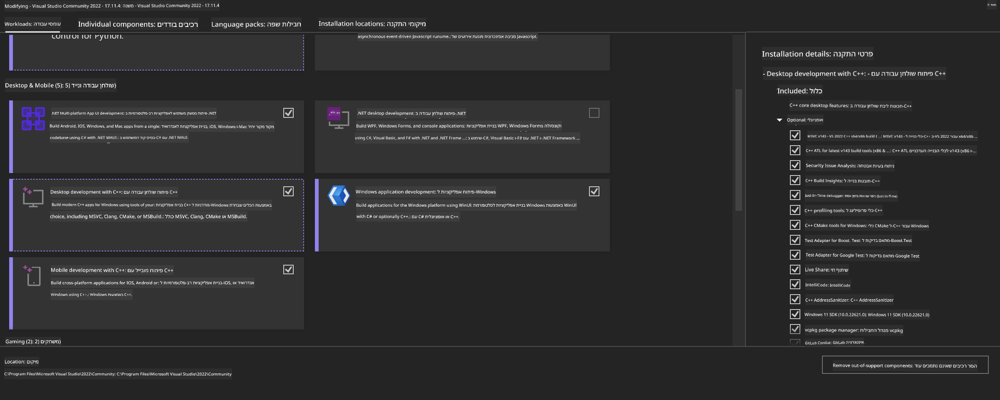

<!--
CO_OP_TRANSLATOR_METADATA:
{
  "original_hash": "b066fc29c1b2129df84e027cb75119ce",
  "translation_date": "2025-07-17T02:45:04+00:00",
  "source_file": "md/02.Application/01.TextAndChat/Phi3/ORTWindowGPUGuideline.md",
  "language_code": "he"
}
-->
# **מדריך לשימוש ב-OnnxRuntime GenAI עם GPU ב-Windows**

מדריך זה מספק שלבים להגדרה ושימוש ב-ONNX Runtime (ORT) עם GPUs ב-Windows. הוא נועד לעזור לך לנצל את האצת ה-GPU עבור המודלים שלך, לשפר ביצועים ויעילות.

המסמך כולל הנחיות לגבי:

- הגדרת סביבה: הוראות להתקנת התלויות הנדרשות כמו CUDA, cuDNN ו-ONNX Runtime.
- קונפיגורציה: כיצד להגדיר את הסביבה ואת ONNX Runtime לשימוש יעיל במשאבי ה-GPU.
- טיפים לאופטימיזציה: עצות לכיוונון הגדרות ה-GPU שלך לביצועים מיטביים.

### **1. Python 3.10.x /3.11.8**

   ***Note*** מומלץ להשתמש ב-[miniforge](https://github.com/conda-forge/miniforge/releases/latest/download/Miniforge3-Windows-x86_64.exe) כסביבת הפייתון שלך

   ```bash

   conda create -n pydev python==3.11.8

   conda activate pydev

   ```

   ***Reminder*** אם התקנת בעבר ספריות ONNX לפייתון, יש להסירן

### **2. התקנת CMake עם winget**

   ```bash

   winget install -e --id Kitware.CMake

   ```

### **3. התקנת Visual Studio 2022 - פיתוח דסקטופ עם C++**

   ***Note*** אם אינך מעוניין לקמפל, ניתן לדלג על שלב זה



### **4. התקנת דרייבר NVIDIA**

1. **דרייבר NVIDIA GPU**  [https://www.nvidia.com/en-us/drivers/](https://www.nvidia.com/en-us/drivers/)

2. **NVIDIA CUDA 12.4** [https://developer.nvidia.com/cuda-12-4-0-download-archive](https://developer.nvidia.com/cuda-12-4-0-download-archive)

3. **NVIDIA CUDNN 9.4**  [https://developer.nvidia.com/cudnn-downloads](https://developer.nvidia.com/cudnn-downloads)

***Reminder*** יש להשתמש בהגדרות ברירת המחדל במהלך ההתקנה

### **5. הגדרת סביבה ל-NVIDIA**

העתק את קבצי NVIDIA CUDNN 9.4 (lib, bin, include) לתיקיות המתאימות ב-NVIDIA CUDA 12.4

- העתק קבצים מ-*'C:\Program Files\NVIDIA\CUDNN\v9.4\bin\12.6'* אל *'C:\Program Files\NVIDIA GPU Computing Toolkit\CUDA\v12.4\bin'*

- העתק קבצים מ-*'C:\Program Files\NVIDIA\CUDNN\v9.4\include\12.6'* אל *'C:\Program Files\NVIDIA GPU Computing Toolkit\CUDA\v12.4\include'*

- העתק קבצים מ-*'C:\Program Files\NVIDIA\CUDNN\v9.4\lib\12.6'* אל *'C:\Program Files\NVIDIA GPU Computing Toolkit\CUDA\v12.4\lib\x64'*

### **6. הורדת Phi-3.5-mini-instruct-onnx**

   ```bash

   winget install -e --id Git.Git

   winget install -e --id GitHub.GitLFS

   git lfs install

   git clone https://huggingface.co/microsoft/Phi-3.5-mini-instruct-onnx

   ```

### **7. הרצת InferencePhi35Instruct.ipynb**

   פתח את [המחברת](../../../../../../code/09.UpdateSamples/Aug/ortgpu-phi35-instruct.ipynb) והרץ אותה


### **8. קומפילציה של ORT GenAI GPU**

   ***Note*** 
   
   1. יש להסיר תחילה את כל ההתקנות של onnx, onnxruntime ו-onnxruntime-genai

   ```bash

   pip list 
   
   ```

   לאחר מכן הסר את כל ספריות onnxruntime, לדוגמה:

   ```bash

   pip uninstall onnxruntime

   pip uninstall onnxruntime-genai

   pip uninstall onnxruntume-genai-cuda
   
   ```

   2. בדוק את תמיכת התוסף של Visual Studio

   ודא שקיים התיקייה C:\Program Files\NVIDIA GPU Computing Toolkit\CUDA\v12.4\extras\visual_studio_integration בתוך C:\Program Files\NVIDIA GPU Computing Toolkit\CUDA\v12.4\extras

   אם לא נמצאה, בדוק תיקיות אחרות של Cuda toolkit והעתק את תיקיית visual_studio_integration עם התוכן שלה אל C:\Program Files\NVIDIA GPU Computing Toolkit\CUDA\v12.4\extras\visual_studio_integration

   - אם אינך מעוניין לקמפל, ניתן לדלג על שלב זה

   ```bash

   git clone https://github.com/microsoft/onnxruntime-genai

   ```

   - הורד את [https://github.com/microsoft/onnxruntime/releases/download/v1.19.2/onnxruntime-win-x64-gpu-1.19.2.zip](https://github.com/microsoft/onnxruntime/releases/download/v1.19.2/onnxruntime-win-x64-gpu-1.19.2.zip)

   - חלץ את onnxruntime-win-x64-gpu-1.19.2.zip, שנה את שמו ל-**ort**, והעתק את תיקיית ort לתיקיית onnxruntime-genai

   - באמצעות Windows Terminal, עבור ל-Developer Command Prompt for VS 2022 וגש לתיקיית onnxruntime-genai


   - קמפל עם סביבת הפייתון שלך

   ```bash

   cd onnxruntime-genai

   python build.py --use_cuda  --cuda_home "C:\Program Files\NVIDIA GPU Computing Toolkit\CUDA\v12.4" --config Release
 

   cd build/Windows/Release/Wheel

   pip install .whl

   ```

**כתב ויתור**:  
מסמך זה תורגם באמצעות שירות תרגום מבוסס בינה מלאכותית [Co-op Translator](https://github.com/Azure/co-op-translator). למרות שאנו שואפים לדיוק, יש לקחת בחשבון כי תרגומים אוטומטיים עלולים להכיל שגיאות או אי-דיוקים. המסמך המקורי בשפת המקור שלו נחשב למקור הסמכותי. למידע קריטי מומלץ להשתמש בתרגום מקצועי על ידי מתרגם אנושי. אנו לא נושאים באחריות לכל אי-הבנה או פרשנות שגויה הנובעים משימוש בתרגום זה.