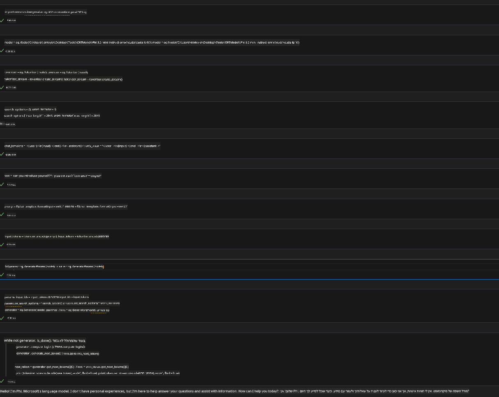
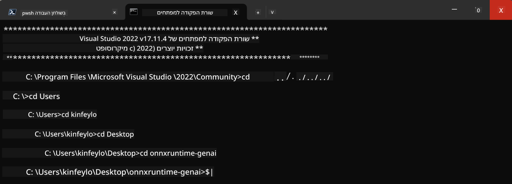

<!--
CO_OP_TRANSLATOR_METADATA:
{
  "original_hash": "b066fc29c1b2129df84e027cb75119ce",
  "translation_date": "2025-05-09T18:44:55+00:00",
  "source_file": "md/02.Application/01.TextAndChat/Phi3/ORTWindowGPUGuideline.md",
  "language_code": "he"
}
-->
# **מדריך לשימוש ב- OnnxRuntime GenAI עם GPU ב-Windows**

מדריך זה מספק שלבים להגדרה ושימוש ב-ONNX Runtime (ORT) עם GPUs ב-Windows. הוא נועד לעזור לכם לנצל את ההאצה של ה-GPU עבור המודלים שלכם, לשפר ביצועים ויעילות.

המסמך מספק הנחיות לגבי:

- הגדרת הסביבה: הוראות להתקנת התלויות הנדרשות כמו CUDA, cuDNN ו-ONNX Runtime.
- קונפיגורציה: כיצד להגדיר את הסביבה ואת ONNX Runtime כדי לנצל משאבי GPU בצורה יעילה.
- טיפים לאופטימיזציה: עצות לכוונון הגדרות ה-GPU שלכם לביצועים מיטביים.

### **1. Python 3.10.x /3.11.8**

   ***Note*** מומלץ להשתמש ב-[miniforge](https://github.com/conda-forge/miniforge/releases/latest/download/Miniforge3-Windows-x86_64.exe) כסביבת הפייתון שלכם

   ```bash

   conda create -n pydev python==3.11.8

   conda activate pydev

   ```

   ***Reminder*** אם התקנתם בעבר את ספריית ONNX לפייתון, יש להסיר אותה

### **2. התקנת CMake עם winget**

   ```bash

   winget install -e --id Kitware.CMake

   ```

### **3. התקנת Visual Studio 2022 - Desktop Development עם C++**

   ***Note*** אם אינכם רוצים לקמפל, ניתן לדלג על שלב זה


### **4. התקנת דרייבר NVIDIA**

1. **דרייבר GPU של NVIDIA**  [https://www.nvidia.com/en-us/drivers/](https://www.nvidia.com/en-us/drivers/)

2. **NVIDIA CUDA 12.4** [https://developer.nvidia.com/cuda-12-4-0-download-archive](https://developer.nvidia.com/cuda-12-4-0-download-archive)

3. **NVIDIA CUDNN 9.4**  [https://developer.nvidia.com/cudnn-downloads](https://developer.nvidia.com/cudnn-downloads)

***Reminder*** יש להשתמש בהגדרות ברירת המחדל במהלך ההתקנה

### **5. הגדרת סביבה ל-NVIDIA**

העתיקו את קבצי lib, bin ו-include של NVIDIA CUDNN 9.4 לתיקיות המקבילות של NVIDIA CUDA 12.4

- העתקת קבצים מ-*'C:\Program Files\NVIDIA\CUDNN\v9.4\bin\12.6'* ל-*'C:\Program Files\NVIDIA GPU Computing Toolkit\CUDA\v12.4\bin'*

- העתקת קבצים מ-*'C:\Program Files\NVIDIA\CUDNN\v9.4\include\12.6'* ל-*'C:\Program Files\NVIDIA GPU Computing Toolkit\CUDA\v12.4\include'*

- העתקת קבצים מ-*'C:\Program Files\NVIDIA\CUDNN\v9.4\lib\12.6'* ל-*'C:\Program Files\NVIDIA GPU Computing Toolkit\CUDA\v12.4\lib\x64'*

### **6. הורדת Phi-3.5-mini-instruct-onnx**

   ```bash

   winget install -e --id Git.Git

   winget install -e --id GitHub.GitLFS

   git lfs install

   git clone https://huggingface.co/microsoft/Phi-3.5-mini-instruct-onnx

   ```

### **7. הרצת InferencePhi35Instruct.ipynb**

   פתחו את [המחברת](../../../../../../code/09.UpdateSamples/Aug/ortgpu-phi35-instruct.ipynb) והריצו אותה



### **8. קומפילציה של ORT GenAI GPU**

   ***Note*** 
   
   1. יש להסיר תחילה את כל ההתקנות של onnx, onnxruntime ו-onnxruntime-genai

   ```bash

   pip list 
   
   ```

   לאחר מכן יש להסיר את כל ספריות onnxruntime, לדוגמה:

   ```bash

   pip uninstall onnxruntime

   pip uninstall onnxruntime-genai

   pip uninstall onnxruntume-genai-cuda
   
   ```

   2. בדקו את תמיכת ההרחבה של Visual Studio

   בדקו בתיקייה C:\Program Files\NVIDIA GPU Computing Toolkit\CUDA\v12.4\extras שהתקיים התיקייה C:\Program Files\NVIDIA GPU Computing Toolkit\CUDA\v12.4\extras\visual_studio_integration. 

   אם אינה קיימת, בדקו תיקיות דרייבר CUDA אחרות והעתיקו את תיקיית visual_studio_integration ואת התכולה שלה ל-C:\Program Files\NVIDIA GPU Computing Toolkit\CUDA\v12.4\extras\visual_studio_integration

   - אם אינכם רוצים לקמפל, ניתן לדלג על שלב זה

   ```bash

   git clone https://github.com/microsoft/onnxruntime-genai

   ```

   - הורידו את [https://github.com/microsoft/onnxruntime/releases/download/v1.19.2/onnxruntime-win-x64-gpu-1.19.2.zip](https://github.com/microsoft/onnxruntime/releases/download/v1.19.2/onnxruntime-win-x64-gpu-1.19.2.zip)

   - חלצו את onnxruntime-win-x64-gpu-1.19.2.zip, שנו את שמו ל-**ort**, והעתיקו את תיקיית ort לתיקיית onnxruntime-genai

   - השתמשו ב-Windows Terminal, עברו ל-Developer Command Prompt של VS 2022 וגשו לתיקיית onnxruntime-genai



   - קומפלו עם סביבת הפייתון שלכם

   ```bash

   cd onnxruntime-genai

   python build.py --use_cuda  --cuda_home "C:\Program Files\NVIDIA GPU Computing Toolkit\CUDA\v12.4" --config Release
 

   cd build/Windows/Release/Wheel

   pip install .whl

   ```

**כתב ויתור**:  
מסמך זה תורגם באמצעות שירות תרגום מבוסס בינה מלאכותית [Co-op Translator](https://github.com/Azure/co-op-translator). למרות שאנו שואפים לדיוק, יש לקחת בחשבון כי תרגומים אוטומטיים עלולים להכיל שגיאות או אי-דיוקים. המסמך המקורי בשפת המקור שלו צריך להיחשב כמקור הסמכותי. עבור מידע קריטי, מומלץ להשתמש בתרגום מקצועי אנושי. אנו לא אחראים על כל אי-הבנה או פרשנות שגויה הנובעת משימוש בתרגום זה.