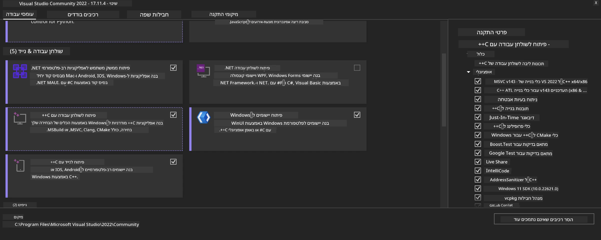
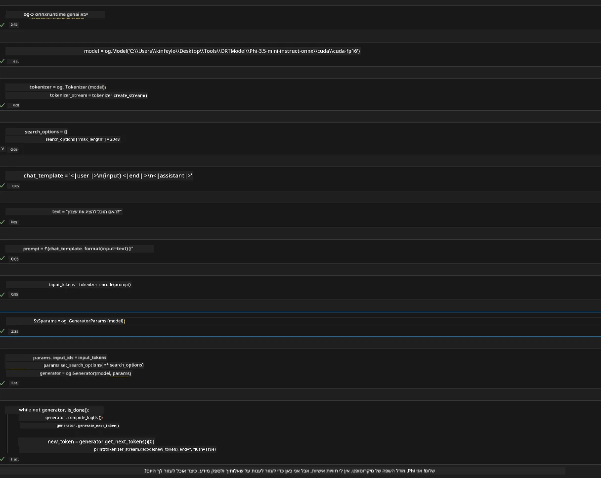
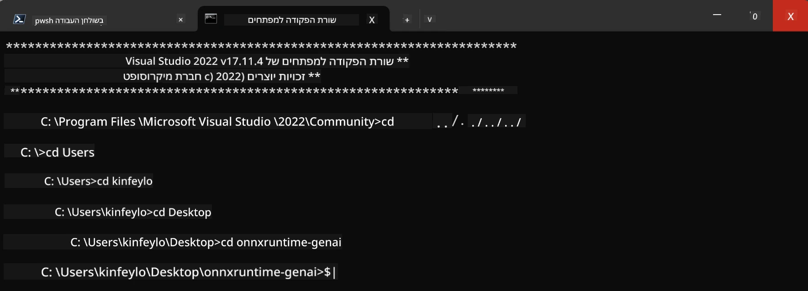

# **מדריך ל-OnnxRuntime GenAI  עבור GPU חלונות**

מדריך זה מספק שלבים להגדרה ושימוש ב- ONNX Runtime (ORT) עם GPUs במערכת חלונות. הוא מיועד לעזור לך לנצל את האצת ה-GPU עבור המודלים שלך, ולשפר ביצועים ויעילות.

המסמך מספק הנחיות על:

- הגדרת סביבה: הוראות להתקנת התלויות הנחוצות כמו CUDA, cuDNN ו-ONNX Runtime.
- קונפיגורציה: כיצד להגדיר את הסביבה ואת ONNX Runtime לשימוש יעיל במשאבי GPU.
- טיפים לאופטימיזציה: עצות כיצד לכוונן את הגדרות ה-GPU שלך לביצועים מיטביים.

### **1. Python 3.10.x /3.11.8**

   ***הערה*** מומלץ להשתמש ב-[miniforge](https://github.com/conda-forge/miniforge/releases/latest/download/Miniforge3-Windows-x86_64.exe) כסביבת Python שלך

   ```bash

   conda create -n pydev python==3.11.8

   conda activate pydev

   ```

   ***תזכורת*** אם התקנת כל ספריית Python ONNX, בבקשה הסר אותה

### **2. התקנת CMake באמצעות winget**


   ```bash

   winget install -e --id Kitware.CMake

   ```

### **3. התקנת Visual Studio 2022 - פיתוח דסקטופ עם C++**

   ***הערה*** אם אינך רוצה לקמפל, ניתן לדלג על שלב זה




### **4. התקנת דרייבר NVIDIA**

1. **דרייבר NVIDIA GPU**  [https://www.nvidia.com/en-us/drivers/](https://www.nvidia.com/en-us/drivers/)

2. **NVIDIA CUDA 12.4** [https://developer.nvidia.com/cuda-12-4-0-download-archive](https://developer.nvidia.com/cuda-12-4-0-download-archive)

3. **NVIDIA CUDNN 9.4**  [https://developer.nvidia.com/cudnn-downloads](https://developer.nvidia.com/cudnn-downloads)

***תזכורת*** יש להשתמש בהגדרות ברירת המחדל במהלך תהליך ההתקנה

### **5. הגדרת סביבה ל-NVIDIA**

יש להעתיק את ספריות NVIDIA CUDNN 9.4 lib, bin, include אל ספריות NVIDIA CUDA 12.4 lib, bin, include

- העתקת קבצי *'C:\Program Files\NVIDIA\CUDNN\v9.4\bin\12.6'* לתיקיית  *'C:\Program Files\NVIDIA GPU Computing Toolkit\CUDA\v12.4\bin'*

- העתקת קבצי *'C:\Program Files\NVIDIA\CUDNN\v9.4\include\12.6'* לתיקיית  *'C:\Program Files\NVIDIA GPU Computing Toolkit\CUDA\v12.4\include'*

- העתקת קבצי *'C:\Program Files\NVIDIA\CUDNN\v9.4\lib\12.6'* לתיקיית  *'C:\Program Files\NVIDIA GPU Computing Toolkit\CUDA\v12.4\lib\x64'*


### **6. הורדת Phi-3.5-mini-instruct-onnx**


   ```bash

   winget install -e --id Git.Git

   winget install -e --id GitHub.GitLFS

   git lfs install

   git clone https://huggingface.co/microsoft/Phi-3.5-mini-instruct-onnx

   ```

### **7. הרצת InferencePhi35Instruct.ipynb**

   פתח את [המנצ'בוק](../../../../code/09.UpdateSamples/Aug/ortgpu-phi35-instruct.ipynb) והריץ אותו 





### **8. קימפול ORT GenAI GPU**


   ***הערה*** 
   
   1. יש להסיר תחילה את כל ההתקנות של onnx, onnxruntime ו-onnxruntime-genai

   
   ```bash

   pip list 
   
   ```

   לאחר מכן הסר את כל ספריות onnxruntime, כלומר 


   ```bash

   pip uninstall onnxruntime

   pip uninstall onnxruntime-genai

   pip uninstall onnxruntume-genai-cuda
   
   ```

   2. בדוק את התמיכה בתוסף Visual Studio 

   בדוק בנתיב C:\Program Files\NVIDIA GPU Computing Toolkit\CUDA\v12.4\extras כדי לוודא שקיים התיקיה C:\Program Files\NVIDIA GPU Computing Toolkit\CUDA\v12.4\extras\visual_studio_integration. 
   
   אם לא נמצא, בדוק תיקיות אחרות של ערכת הכלים CUDA והעבר את תיקיית visual_studio_integration ואת תוכנה ל-C:\Program Files\NVIDIA GPU Computing Toolkit\CUDA\v12.4\extras\visual_studio_integration


   - אם אינך רוצה לקמפל, ניתן לדלג על שלב זה


   ```bash

   git clone https://github.com/microsoft/onnxruntime-genai

   ```

   - הורד [https://github.com/microsoft/onnxruntime/releases/download/v1.19.2/onnxruntime-win-x64-gpu-1.19.2.zip](https://github.com/microsoft/onnxruntime/releases/download/v1.19.2/onnxruntime-win-x64-gpu-1.19.2.zip)

   - חלץ את הקובץ onnxruntime-win-x64-gpu-1.19.2.zip, שנה את שם התיקיה ל-**ort**, והעבר את תיקיית ort אל onnxruntime-genai

   - השתמש ב-Windows Terminal, עבור ל-Deveopler Command Prompt עבור VS 2022 וגש אל onnxruntime-genai 



   - קמפל עם סביבת הפייתון שלך

   
   ```bash

   cd onnxruntime-genai

   python build.py --use_cuda  --cuda_home "C:\Program Files\NVIDIA GPU Computing Toolkit\CUDA\v12.4" --config Release
 

   cd build/Windows/Release/Wheel

   pip install .whl

   ```

---

<!-- CO-OP TRANSLATOR DISCLAIMER START -->
**כתב ויתור**:
מסמך זה תורגם באמצעות שירות תרגום אוטומטי [Co-op Translator](https://github.com/Azure/co-op-translator). למרות שאנו שואפים לדיוק, יש לקחת בחשבון שתרגומים אוטומטיים עלולים להכיל שגיאות או אי-דיוקים. יש להחשיב את המסמך המקורי בשפתו הטבעית כמקור הסמכות. למידע קריטי מומלץ להשתמש בתרגום מקצועי על ידי מתרגם אדם. אנו לא אחראים לכל אי-הבנה או פירוש שגוי הנובע מהשימוש בתרגום זה.
<!-- CO-OP TRANSLATOR DISCLAIMER END -->