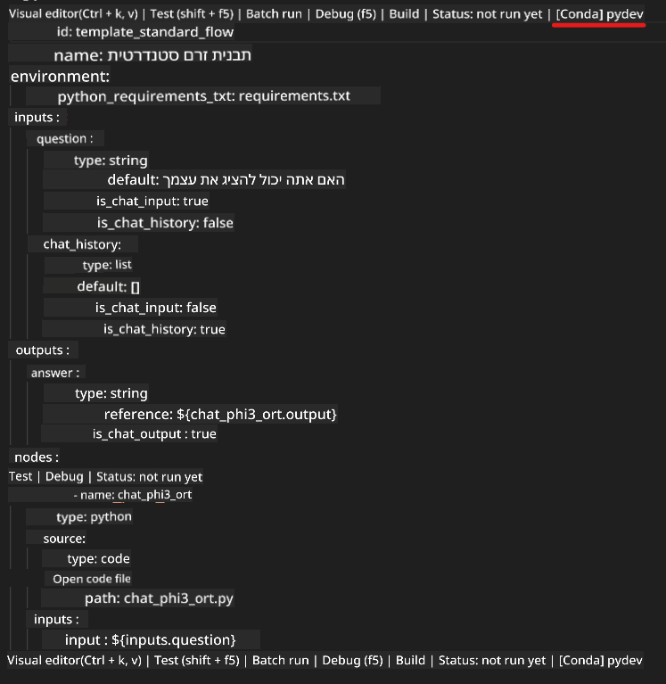
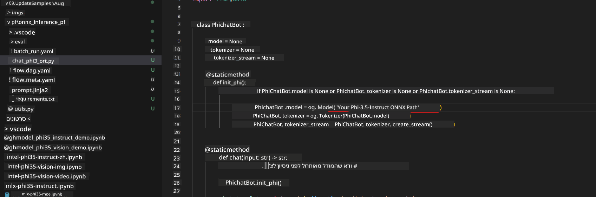
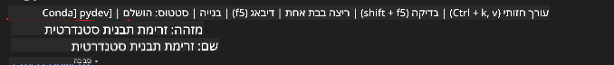
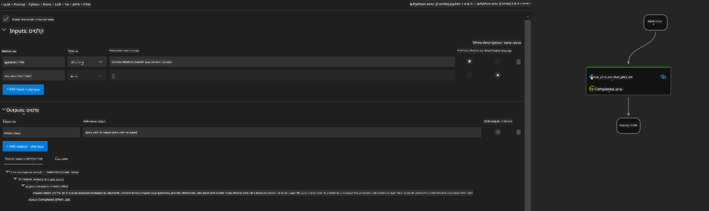

<!--
CO_OP_TRANSLATOR_METADATA:
{
  "original_hash": "92e7dac1e5af0dd7c94170fdaf6860fe",
  "translation_date": "2025-05-09T18:53:53+00:00",
  "source_file": "md/02.Application/01.TextAndChat/Phi3/UsingPromptFlowWithONNX.md",
  "language_code": "he"
}
-->
# שימוש ב-GPU של Windows ליצירת פתרון Prompt flow עם Phi-3.5-Instruct ONNX

המסמך הבא הוא דוגמה לאופן השימוש ב-PromptFlow עם ONNX (Open Neural Network Exchange) לפיתוח יישומי בינה מלאכותית מבוססי מודלים של Phi-3.

PromptFlow היא חבילת כלי פיתוח שמטרתה לייעל את מחזור הפיתוח המלא של יישומי AI מבוססי LLM (מודל שפה גדול), מהרעיון והפרוטוטייפ ועד לבדיקה והערכה.

באינטגרציה של PromptFlow עם ONNX, מפתחים יכולים:

- לשפר את ביצועי המודל: לנצל את ONNX לאינפרנס והפצה יעילים של המודל.
- לפשט את הפיתוח: להשתמש ב-PromptFlow לניהול זרימת העבודה ואוטומציה של משימות חוזרות.
- לחזק שיתוף פעולה: להקל על שיתוף פעולה בין חברי הצוות באמצעות סביבת פיתוח מאוחדת.

**Prompt flow** היא חבילת כלי פיתוח שמטרתה לייעל את מחזור הפיתוח המלא של יישומי AI מבוססי LLM, מהרעיונות, הפרוטוטייפ, הבדיקות וההערכה ועד לפריסה ומעקב בייצור. היא מפשטת מאוד את הנדסת הפרומפט ומאפשרת לבנות אפליקציות LLM באיכות ייצור.

Prompt flow יכולה להתחבר ל-OpenAI, Azure OpenAI Service, ולמודלים הניתנים להתאמה (Huggingface, LLM/SLM מקומי). אנו מקווים לפרוס את מודל ONNX הכמותי של Phi-3.5 ליישומים מקומיים. Prompt flow יכולה לסייע לנו לתכנן טוב יותר את העסק ולהשלים פתרונות מקומיים מבוססי Phi-3.5. בדוגמה זו, נשלב את ONNX Runtime GenAI Library להשלמת פתרון Prompt flow המבוסס על GPU של Windows.

## **התקנה**

### **ONNX Runtime GenAI עבור Windows GPU**

קראו מדריך זה כדי להגדיר ONNX Runtime GenAI עבור Windows GPU  [click here](./ORTWindowGPUGuideline.md)

### **הגדרת Prompt flow ב-VSCode**

1. התקינו את תוסף Prompt flow ל-VS Code


2. לאחר התקנת התוסף, לחצו עליו ובחרו **Installation dependencies** ופעלו לפי המדריך להתקנת Prompt flow SDK בסביבתכם


3. הורידו את [Sample Code](../../../../../../code/09.UpdateSamples/Aug/pf/onnx_inference_pf) ופתחו את הדוגמה ב-VS Code


4. פתחו את **flow.dag.yaml** לבחירת סביבת Python שלכם



   פתחו את **chat_phi3_ort.py** לשינוי מיקום מודל Phi-3.5-instruct ONNX שלכם



5. הריצו את Prompt flow לבדיקה

פתחו את **flow.dag.yaml** ולחצו על העורך הוויזואלי



לאחר הלחיצה, הריצו לבדיקה



1. ניתן להריץ batch בטרמינל כדי לבדוק תוצאות נוספות


```bash

pf run create --file batch_run.yaml --stream --name 'Your eval qa name'    

```

ניתן לבדוק את התוצאות בדפדפן המוגדר כברירת מחדל


**כתב ויתור**:  
מסמך זה תורגם באמצעות שירות תרגום מבוסס בינה מלאכותית [Co-op Translator](https://github.com/Azure/co-op-translator). למרות שאנו שואפים לדיוק, יש להיות מודעים לכך שתירגומים אוטומטיים עלולים להכיל שגיאות או אי דיוקים. המסמך המקורי בשפת המקור שלו צריך להיחשב כמקור הסמכותי. למידע קריטי מומלץ להשתמש בתרגום מקצועי על ידי מתרגם אנושי. אנו לא אחראים לכל אי הבנות או פרשנויות שגויות הנובעות משימוש בתרגום זה.