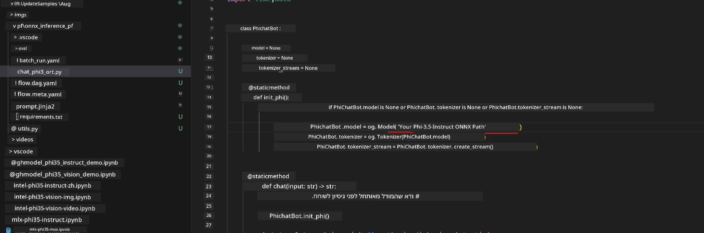
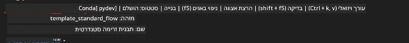
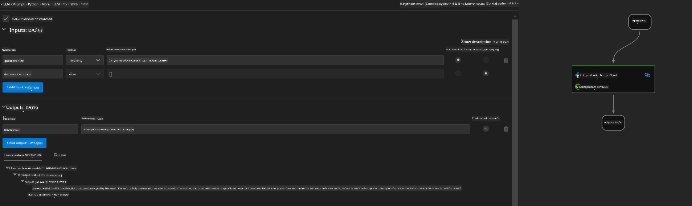
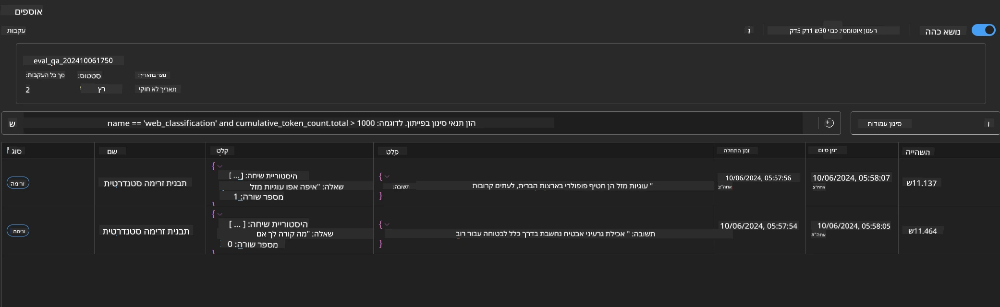

# שימוש ב-GPU של Windows ליצירת פתרון Prompt flow עם Phi-3.5-Instruct ONNX

המסמך הבא הוא דוגמה לאופן השימוש ב-PromptFlow עם ONNX (Open Neural Network Exchange) לפיתוח יישומי בינה מלאכותית מבוססי מודלים מסוג Phi-3.

PromptFlow היא חבילת כלים לפיתוח שמטרתה לייעל את מחזור הפיתוח המלא של יישומי בינה מלאכותית מבוססי LLM (Large Language Model), החל מרעיונות ופרוטוטייפינג ועד לבדיקות והערכה.

באמצעות שילוב של PromptFlow עם ONNX, מפתחים יכולים:

- לשפר את ביצועי המודל: לנצל את ONNX לאינפרנס ופריסה יעילים של המודל.
- לפשט את הפיתוח: להשתמש ב-PromptFlow לניהול זרימת העבודה ואוטומציה של משימות חוזרות.
- לשפר את שיתוף הפעולה: לאפשר שיתוף פעולה טוב יותר בין חברי הצוות על ידי מתן סביבת פיתוח מאוחדת.

**Prompt flow** היא חבילת כלים לפיתוח שמטרתה לייעל את מחזור הפיתוח המלא של יישומי בינה מלאכותית מבוססי LLM, החל מרעיונות, פרוטוטייפינג, בדיקות, הערכה ועד לפריסה ומעקב בייצור. היא מקלה מאוד על הנדסת הפרומפט ומאפשרת לבנות אפליקציות LLM באיכות ייצור.

Prompt flow יכולה להתחבר ל-OpenAI, Azure OpenAI Service, ולמודלים מותאמים אישית (Huggingface, LLM/SLM מקומי). אנו מקווים לפרוס את מודל ONNX הכמותי של Phi-3.5 באפליקציות מקומיות. Prompt flow יכולה לעזור לנו לתכנן טוב יותר את העסק ולהשלים פתרונות מקומיים מבוססי Phi-3.5. בדוגמה זו, נשלב את ONNX Runtime GenAI Library כדי להשלים את פתרון Prompt flow מבוסס Windows GPU.

## **התקנה**

### **ONNX Runtime GenAI עבור Windows GPU**

קראו את ההנחיות להגדרת ONNX Runtime GenAI עבור Windows GPU [לחצו כאן](./ORTWindowGPUGuideline.md)

### **הגדרת Prompt flow ב-VSCode**

1. התקינו את תוסף Prompt flow ל-VS Code


2. לאחר התקנת התוסף, לחצו עליו ובחרו **Installation dependencies** ופעלו לפי ההנחיות להתקנת Prompt flow SDK בסביבת העבודה שלכם


3. הורידו את [קוד הדוגמה](../../../../../../code/09.UpdateSamples/Aug/pf/onnx_inference_pf) ופתחו אותו ב-VS Code


4. פתחו את הקובץ **flow.dag.yaml** כדי לבחור את סביבת הפייתון שלכם


   פתחו את **chat_phi3_ort.py** כדי לשנות את מיקום מודל Phi-3.5-instruct ONNX שלכם



5. הריצו את ה-prompt flow שלכם לבדיקה

פתחו את **flow.dag.yaml** ולחצו על העורך הוויזואלי



לאחר הלחיצה, הריצו את הפתרון לבדיקה



1. ניתן להריץ אצווה בטרמינל כדי לבדוק תוצאות נוספות


```bash

pf run create --file batch_run.yaml --stream --name 'Your eval qa name'    

```

ניתן לבדוק את התוצאות בדפדפן המוגדר כברירת מחדל




**כתב ויתור**:  
מסמך זה תורגם באמצעות שירות תרגום מבוסס בינה מלאכותית [Co-op Translator](https://github.com/Azure/co-op-translator). למרות שאנו שואפים לדיוק, יש לקחת בחשבון כי תרגומים אוטומטיים עלולים להכיל שגיאות או אי-דיוקים. המסמך המקורי בשפת המקור שלו נחשב למקור הסמכותי. למידע קריטי מומלץ להשתמש בתרגום מקצועי על ידי מתרגם אנושי. אנו לא נושאים באחריות לכל אי-הבנה או פרשנות שגויה הנובעת משימוש בתרגום זה.