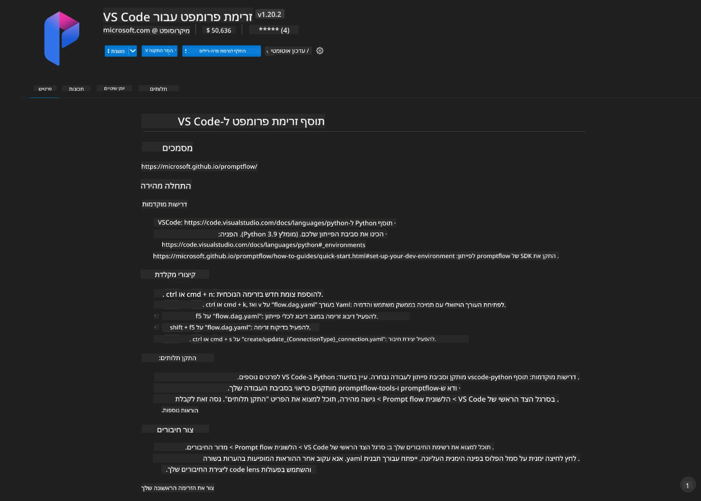
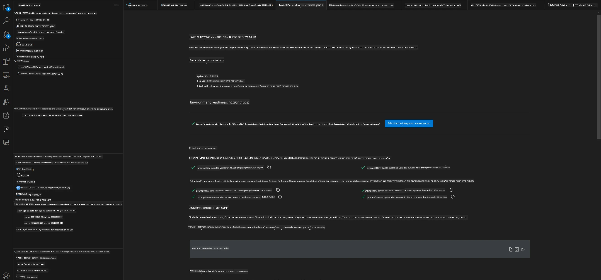
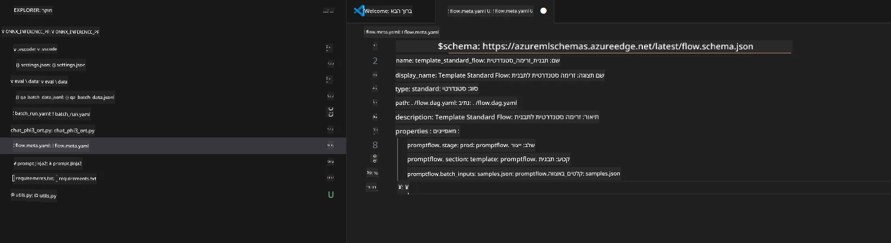
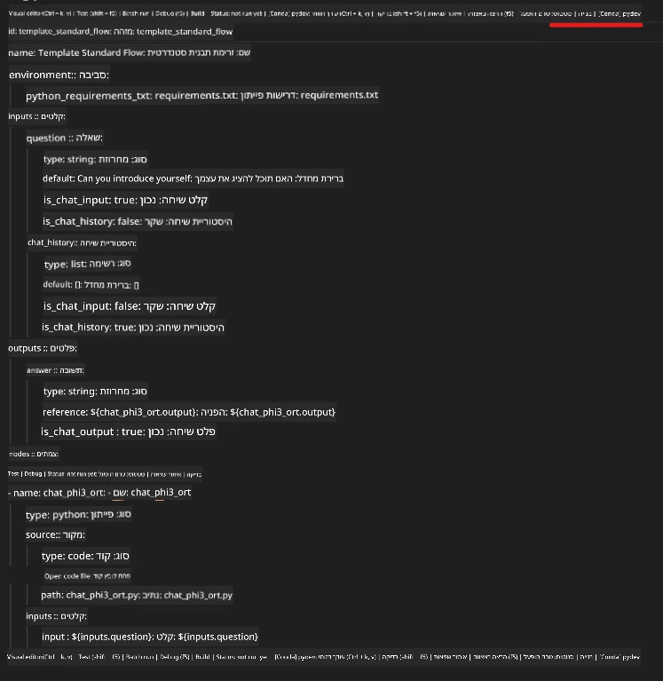
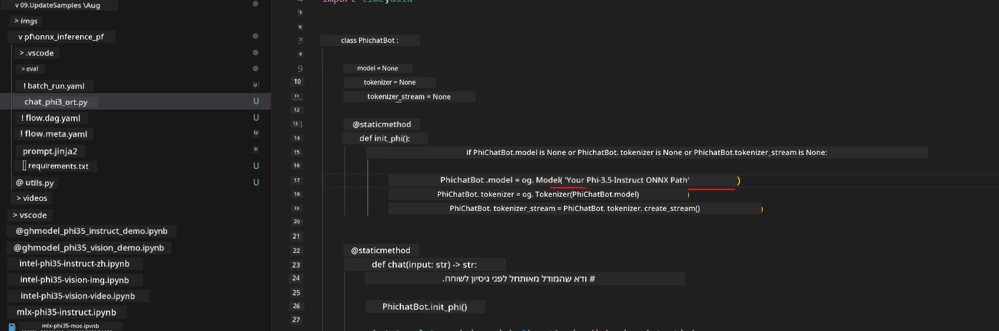
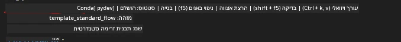
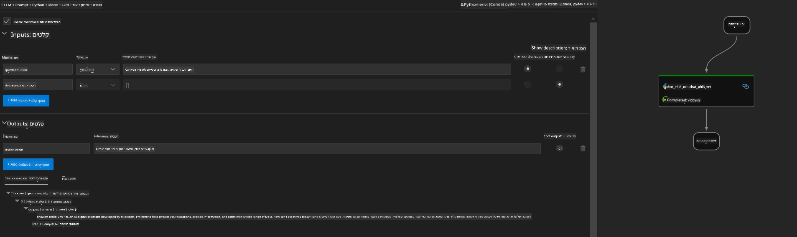
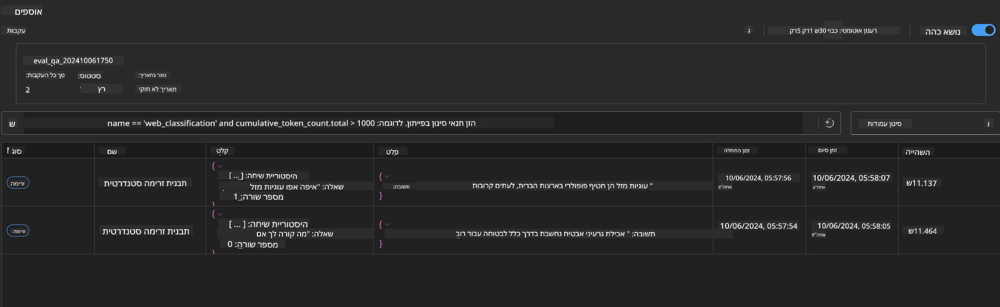

# שימוש ב-GPU של Windows ליצירת פתרון Prompt flow עם Phi-3.5-Instruct ONNX 

המסמך הבא הוא דוגמה לאופן השימוש ב-PromptFlow עם ONNX (Open Neural Network Exchange) לפיתוח יישומי AI המבוססים על מודלים של Phi-3.

PromptFlow היא חבילת כלים לפיתוח שנועדה לייעל את מחזור הפיתוח ממקור ליישום של יישומי AI מבוססי LLM (מודל שפה גדול), מתכנון ואבטיפוס ועד לבדיקה והערכה.

באמצעות שילוב PromptFlow עם ONNX, מפתחים יכולים:

- לשפר את ביצועי המודל: לנצל את ONNX לאינפרנציה ופריסה יעילה של מודל.
- לפשט את הפיתוח: להשתמש ב-PromptFlow לניהול זרימת העבודה ואוטומציה של משימות חוזרות.
- לשפר את שיתוף הפעולה: להקל על שיתוף פעולה טוב יותר בין חברי הצוות בעזרת סביבת פיתוח מאוחדת.

**Prompt flow** היא חבילת כלים לפיתוח שנועדה לייעל את מחזור הפיתוח ממקור ליישום של יישומי AI מבוססי LLM, מתכנון, אבטיפוס, בדיקה, הערכה ועד פריסה ומעקב בייצור. היא הופכת את הנדסת הפקודות לקלה הרבה יותר ומאפשרת לך לבנות אפליקציות LLM באיכות ייצור.

Prompt flow יכולה להתחבר ל-OpenAI, ל-Azure OpenAI Service ולמודלים הניתנים להתאמה אישית (Huggingface, LLM/SLM מקומי). אנו מקווים לפרוס את מודל ה-ONNX הכוונטי של Phi-3.5 ליישומים מקומיים. Prompt flow יכולה לסייע לנו בתכנון עסקי טוב יותר ובהשלמת פתרונות מקומיים המבוססים על Phi-3.5. בדוגמה זו, נשולב את ONNX Runtime GenAI Library להשלים את פתרון ה-Prompt flow מבוסס GPU של Windows.

## **התקנה**

### **ONNX Runtime GenAI עבור Windows GPU**

קרא את ההנחיה הזו כדי להגדיר ONNX Runtime GenAI עבור Windows GPU  [click here](./ORTWindowGPUGuideline.md)

### **הגדרת Prompt flow ב-VSCode**

1. התקן את הרחבת Prompt flow ב-VSCode



2. לאחר התקנת הרחבת Prompt flow ב-VSCode, לחץ על ההרחבה ובחר **תלויות התקנה** ופעל לפי ההנחיה הזו להתקנת ה-SDK של Prompt flow בסביבתך



3. הורד [קוד לדוגמה](../../../../../../code/09.UpdateSamples/Aug/pf/onnx_inference_pf) ופתח את הדוגמה הזו ב-VSCode



4. פתח **flow.dag.yaml** כדי לבחור את סביבת ה-Python שלך



   פתח את **chat_phi3_ort.py** כדי לשנות את מיקום מודל Phi-3.5-instruct ONNX שלך



5. הרץ את prompt flow שלך לבדיקה

פתח את **flow.dag.yaml** ולחץ על עורך חזותי



לאחר שלחצת על זה, הרץ כדי לבדוק



1. ניתן להריץ באצווה בטרמינל כדי לבדוק תוצאות נוספות


```bash

pf run create --file batch_run.yaml --stream --name 'Your eval qa name'    

```

ניתן לבדוק תוצאות בדפדפן המוגדר כברירת מחדל שלך




---

<!-- CO-OP TRANSLATOR DISCLAIMER START -->
**כתב ויתור**:
מסמך זה תורגם באמצעות שירות תרגום אוטומטי [Co-op Translator](https://github.com/Azure/co-op-translator). למרות שאנו שואפים לדיוק, יש לקחת בחשבון שתרגומים אוטומטיים עלולים להכיל שגיאות או אי-דיוקים. יש להחשיב את המסמך המקורי בשפתו הטבעית כמקור הסמכות. למידע קריטי מומלץ להשתמש בתרגום מקצועי על ידי מתרגם אדם. אנו לא אחראים לכל אי-הבנה או פירוש שגוי הנובע מהשימוש בתרגום זה.
<!-- CO-OP TRANSLATOR DISCLAIMER END -->