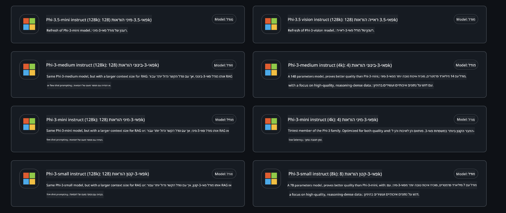
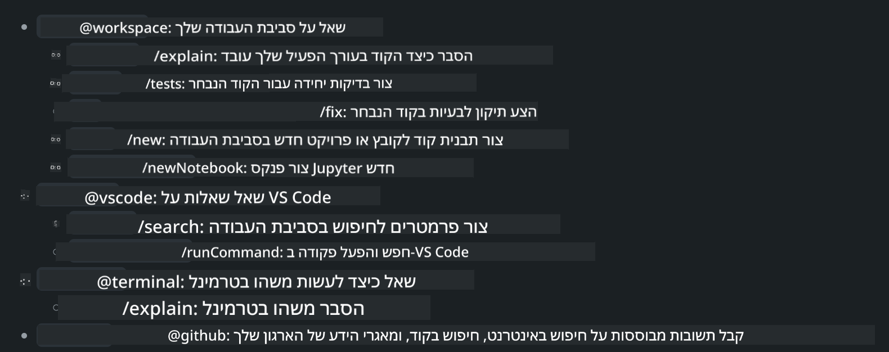
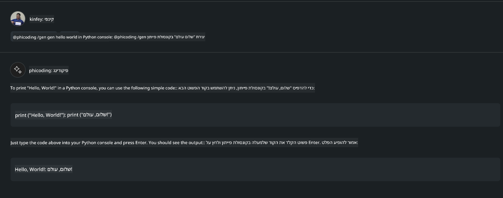

<!--
CO_OP_TRANSLATOR_METADATA:
{
  "original_hash": "35bf81388ac6917277b8d9a0c39bdc70",
  "translation_date": "2025-07-17T03:27:50+00:00",
  "source_file": "md/02.Application/02.Code/Phi3/CreateVSCodeChatAgentWithGitHubModels.md",
  "language_code": "he"
}
-->
# **צור סוכן Visual Studio Code Chat Copilot משלך עם Phi-3.5 של GitHub Models**

האם אתה משתמש ב-Visual Studio Code Copilot? במיוחד בצ'אט, ניתן להשתמש בסוכנים שונים כדי לשפר את היכולת ליצור, לכתוב ולתחזק פרויקטים ב-Visual Studio Code. Visual Studio Code מספק API שמאפשר לחברות ויחידים ליצור סוכנים שונים בהתבסס על העסק שלהם כדי להרחיב את היכולות בתחומים קנייניים שונים. במאמר זה נתמקד ב-**Phi-3.5-mini-instruct (128k)** ו-**Phi-3.5-vision-instruct (128k)** של GitHub Models כדי ליצור את סוכן Visual Studio Code משלך.

## **על Phi-3.5 ב-GitHub Models**

ידוע כי Phi-3/3.5-mini-instruct במשפחת Phi-3/3.5 מציג יכולות חזקות של הבנת קוד ויצירתו, ויש לו יתרונות על פני Gemma-2-9b ו-Mistral-Nemo-12B-instruct-2407.


הגרסאות האחרונות של GitHub Models כבר מספקות גישה למודלים Phi-3.5-mini-instruct (128k) ו-Phi-3.5-vision-instruct (128k). מפתחים יכולים לגשת אליהם דרך OpenAI SDK, Azure AI Inference SDK ו-REST API.



***Note:*** מומלץ להשתמש ב-Azure AI Inference SDK כאן, מכיוון שהוא מאפשר החלפה טובה יותר עם Azure Model Catalog בסביבת הייצור

להלן תוצאות של **Phi-3.5-mini-instruct (128k)** ו-**Phi-3.5-vision-instruct (128k)** בתרחיש יצירת קוד לאחר חיבור ל-GitHub Models, וכן הכנה לדוגמאות הבאות

**Demo: GitHub Models Phi-3.5-mini-instruct (128k) מייצר קוד מתוך Prompt** ([לחץ כאן](../../../../../../code/09.UpdateSamples/Aug/ghmodel_phi35_instruct_demo.ipynb))

**Demo: GitHub Models Phi-3.5-vision-instruct (128k) מייצר קוד מתוך תמונה** ([לחץ כאן](../../../../../../code/09.UpdateSamples/Aug/ghmodel_phi35_vision_demo.ipynb))


## **על סוכן GitHub Copilot Chat**

סוכן GitHub Copilot Chat יכול להשלים משימות שונות בתרחישי פרויקטים מגוונים בהתבסס על הקוד. המערכת כוללת ארבעה סוכנים: workspace, github, terminal, vscode



על ידי הוספת שם הסוכן עם ‘@’, ניתן להשלים במהירות את העבודה המתאימה. עבור ארגונים, אם תוסיפו תוכן עסקי משלכם כמו דרישות, קידוד, מפרטי בדיקה ושחרור, תוכלו לקבל פונקציות פרטיות ארגוניות חזקות יותר בהתבסס על GitHub Copilot.

סוכן Visual Studio Code Chat שוחרר כעת רשמית עם API, המאפשר לארגונים או למפתחים ארגוניים לפתח סוכנים בהתבסס על אקוסיסטמים עסקיים שונים של תוכנה. בהתבסס על שיטת הפיתוח של Visual Studio Code Extension Development, ניתן לגשת בקלות לממשק ה-API של סוכן Visual Studio Code Chat. ניתן לפתח בהתבסס על תהליך זה


תרחיש הפיתוח תומך בגישה ל-API של מודלים צד שלישי (כגון GitHub Models, Azure Model Catalog, ושירותים עצמאיים המבוססים על מודלים בקוד פתוח) וניתן גם להשתמש במודלים gpt-35-turbo, gpt-4, ו-gpt-4o המסופקים על ידי GitHub Copilot.

## **הוספת סוכן @phicoding מבוסס Phi-3.5**

ננסה לשלב את יכולות התכנות של Phi-3.5 כדי להשלים כתיבת קוד, יצירת קוד מתמונה ומשימות נוספות. נבנה סוכן סביב Phi-3.5 - @PHI, להלן כמה פונקציות

1. יצירת הצגה עצמית בהתבסס על GPT-4o המסופק על ידי GitHub Copilot באמצעות הפקודה **@phicoding /help**

2. יצירת קוד בשפות תכנות שונות בהתבסס על **Phi-3.5-mini-instruct (128k)** באמצעות הפקודה **@phicoding /gen**

3. יצירת קוד בהתבסס על **Phi-3.5-vision-instruct (128k)** והשלמת תמונה באמצעות הפקודה **@phicoding /image**


## **שלבים קשורים**

1. התקנת תמיכה בפיתוח Visual Studio Code Extension באמצעות npm

```bash

npm install --global yo generator-code 

```
2. יצירת תוסף Visual Studio Code Extension (בשיטת פיתוח Typescript, בשם phiext)

```bash

yo code 

```

3. פתיחת הפרויקט שנוצר ושינוי package.json. כאן נמצאות ההוראות וההגדרות הרלוונטיות, וכן הגדרת GitHub Models. שים לב שיש להוסיף כאן את הטוקן של GitHub Models שלך.

```json

{
  "name": "phiext",
  "displayName": "phiext",
  "description": "",
  "version": "0.0.1",
  "engines": {
    "vscode": "^1.93.0"
  },
  "categories": [
    "AI",
    "Chat"
  ],
  "activationEvents": [],
  "enabledApiProposals": [
      "chatVariableResolver"
  ],
  "main": "./dist/extension.js",
  "contributes": {
    "chatParticipants": [
        {
            "id": "chat.phicoding",
            "name": "phicoding",
            "description": "Hey! I am Microsoft Phi-3.5, She can help me with coding problems, such as generation code with your natural language, or even generation code about chart from images. Just ask me anything!",
            "isSticky": true,
            "commands": [
                {
                    "name": "help",
                    "description": "Introduce myself to you"
                },
                {
                    "name": "gen",
                    "description": "Generate code for you with Microsoft Phi-3.5-mini-instruct"
                },
                {
                    "name": "image",
                    "description": "Generate code for chart from image(png or jpg) with Microsoft Phi-3.5-vision-instruct, please add image url like this : https://ajaytech.co/wp-content/uploads/2019/09/index.png"
                }
            ]
        }
    ],
    "commands": [
        {
            "command": "phicoding.namesInEditor",
            "title": "Use Microsoft Phi 3.5 in Editor"
        }
    ],
    "configuration": {
      "type": "object",
      "title": "githubmodels",
      "properties": {
        "githubmodels.endpoint": {
          "type": "string",
          "default": "https://models.inference.ai.azure.com",
          "description": "Your GitHub Models Endpoint",
          "order": 0
        },
        "githubmodels.api_key": {
          "type": "string",
          "default": "Your GitHub Models Token",
          "description": "Your GitHub Models Token",
          "order": 1
        },
        "githubmodels.phi35instruct": {
          "type": "string",
          "default": "Phi-3.5-mini-instruct",
          "description": "Your Phi-35-Instruct Model",
          "order": 2
        },
        "githubmodels.phi35vision": {
          "type": "string",
          "default": "Phi-3.5-vision-instruct",
          "description": "Your Phi-35-Vision Model",
          "order": 3
        }
      }
    }
  },
  "scripts": {
    "vscode:prepublish": "npm run package",
    "compile": "webpack",
    "watch": "webpack --watch",
    "package": "webpack --mode production --devtool hidden-source-map",
    "compile-tests": "tsc -p . --outDir out",
    "watch-tests": "tsc -p . -w --outDir out",
    "pretest": "npm run compile-tests && npm run compile && npm run lint",
    "lint": "eslint src",
    "test": "vscode-test"
  },
  "devDependencies": {
    "@types/vscode": "^1.93.0",
    "@types/mocha": "^10.0.7",
    "@types/node": "20.x",
    "@typescript-eslint/eslint-plugin": "^8.3.0",
    "@typescript-eslint/parser": "^8.3.0",
    "eslint": "^9.9.1",
    "typescript": "^5.5.4",
    "ts-loader": "^9.5.1",
    "webpack": "^5.94.0",
    "webpack-cli": "^5.1.4",
    "@vscode/test-cli": "^0.0.10",
    "@vscode/test-electron": "^2.4.1"
  },
  "dependencies": {
    "@types/node-fetch": "^2.6.11",
    "node-fetch": "^3.3.2",
    "@azure-rest/ai-inference": "latest",
    "@azure/core-auth": "latest",
    "@azure/core-sse": "latest"
  }
}


```

4. שינוי הקובץ src/extension.ts

```typescript

// The module 'vscode' contains the VS Code extensibility API
// Import the module and reference it with the alias vscode in your code below
import * as vscode from 'vscode';
import ModelClient from "@azure-rest/ai-inference";
import { AzureKeyCredential } from "@azure/core-auth";


interface IPhiChatResult extends vscode.ChatResult {
    metadata: {
        command: string;
    };
}


const MODEL_SELECTOR: vscode.LanguageModelChatSelector = { vendor: 'copilot', family: 'gpt-4o' };

function isValidImageUrl(url: string): boolean {
    const regex = /^(https?:\/\/.*\.(?:png|jpg))$/i;
    return regex.test(url);
}
  

// This method is called when your extension is activated
// Your extension is activated the very first time the command is executed
export function activate(context: vscode.ExtensionContext) {

    const codinghandler: vscode.ChatRequestHandler = async (request: vscode.ChatRequest, context: vscode.ChatContext, stream: vscode.ChatResponseStream, token: vscode.CancellationToken): Promise<IPhiChatResult> => {


        const config : any = vscode.workspace.getConfiguration('githubmodels');
        const endPoint: string = config.get('endpoint');
        const apiKey: string = config.get('api_key');
        const phi35instruct: string = config.get('phi35instruct');
        const phi35vision: string = config.get('phi35vision');
        
        if (request.command === 'help') {

            const content = "Welcome to Coding assistant with Microsoft Phi-3.5"; 
            stream.progress(content);


            try {
                const [model] = await vscode.lm.selectChatModels(MODEL_SELECTOR);
                if (model) {
                    const messages = [
                        vscode.LanguageModelChatMessage.User("Please help me express this content in a humorous way: I am a programming assistant who can help you convert natural language into code and generate code based on the charts in the images. output format like this : Hey I am Phi ......")
                    ];
                    const chatResponse = await model.sendRequest(messages, {}, token);
                    for await (const fragment of chatResponse.text) {
                        stream.markdown(fragment);
                    }
                }
            } catch(err) {
                console.log(err);
            }


            return { metadata: { command: 'help' } };

        }

        
        if (request.command === 'gen') {

            const content = "Welcome to use phi-3.5 to generate code";

            stream.progress(content);

            const client = new ModelClient(endPoint, new AzureKeyCredential(apiKey));

            const response = await client.path("/chat/completions").post({
              body: {
                messages: [
                  { role:"system", content: "You are a coding assistant.Help answer all code generation questions." },
                  { role:"user", content: request.prompt }
                ],
                model: phi35instruct,
                temperature: 0.4,
                max_tokens: 1000,
                top_p: 1.
              }
            });

            stream.markdown(response.body.choices[0].message.content);

            return { metadata: { command: 'gen' } };

        }


        
        if (request.command === 'image') {


            const content = "Welcome to use phi-3.5 to generate code from image(png or jpg),image url like this:https://ajaytech.co/wp-content/uploads/2019/09/index.png";

            stream.progress(content);

            if (!isValidImageUrl(request.prompt)) {
                stream.markdown('Please provide a valid image URL');
                return { metadata: { command: 'image' } };
            }
            else
            {

                const client = new ModelClient(endPoint, new AzureKeyCredential(apiKey));
    
                const response = await client.path("/chat/completions").post({
                    body: {
                      messages: [
                        { role: "system", content: "You are a helpful assistant that describes images in details." },
                        { role: "user", content: [
                            { type: "text", text: "Please generate code according to the chart in the picture according to the following requirements\n1. Keep all information in the chart, including data and text\n2. Do not generate additional information that is not included in the chart\n3. Please extract data from the picture, do not generate it from csv\n4. Please save the regenerated chart as a chart and save it to ./output/demo.png"},
                            { type: "image_url", image_url: {url: request.prompt}
                            }
                          ]
                        }
                      ],
                      model: phi35vision,
                      temperature: 0.4,
                      max_tokens: 2048,
                      top_p: 1.
                    }
                  });
    
                
                stream.markdown(response.body.choices[0].message.content);
    
                return { metadata: { command: 'image' } };
            }


        }


        return { metadata: { command: '' } };
    };


    const phi_ext = vscode.chat.createChatParticipant("chat.phicoding", codinghandler);

    phi_ext.iconPath = new vscode.ThemeIcon('sparkle');


    phi_ext.followupProvider = {
        provideFollowups(result: IPhiChatResult, context: vscode.ChatContext, token: vscode.CancellationToken) {
            return [{
                prompt: 'Let us coding with Phi-3.5 😋😋😋😋',
                label: vscode.l10n.t('Enjoy coding with Phi-3.5'),
                command: 'help'
            } satisfies vscode.ChatFollowup];
        }
    };

    context.subscriptions.push(phi_ext);
}

// This method is called when your extension is deactivated
export function deactivate() {}


```

6. הרצה

***/help***


***@phicoding /help***


***@phicoding /gen***



***@phicoding /image***


ניתן להוריד קוד לדוגמה: [לחץ כאן](../../../../../../code/09.UpdateSamples/Aug/vscode)

## **משאבים**

1. הרשמה ל-GitHub Models [https://gh.io/models](https://gh.io/models)

2. למידה על פיתוח Visual Studio Code Extension [https://code.visualstudio.com/api/get-started/your-first-extension](https://code.visualstudio.com/api/get-started/your-first-extension)

3. למידה על Visual Studio Code Coilot Chat API [https://code.visualstudio.com/api/extension-guides/chat](https://code.visualstudio.com/api/extension-guides/chat)

**כתב ויתור**:  
מסמך זה תורגם באמצעות שירות תרגום מבוסס בינה מלאכותית [Co-op Translator](https://github.com/Azure/co-op-translator). למרות שאנו שואפים לדיוק, יש לקחת בחשבון כי תרגומים אוטומטיים עלולים להכיל שגיאות או אי-דיוקים. המסמך המקורי בשפת המקור שלו נחשב למקור הסמכותי. למידע קריטי מומלץ להשתמש בתרגום מקצועי על ידי אדם. אנו לא נושאים באחריות לכל אי-הבנה או פרשנות שגויה הנובעת משימוש בתרגום זה.