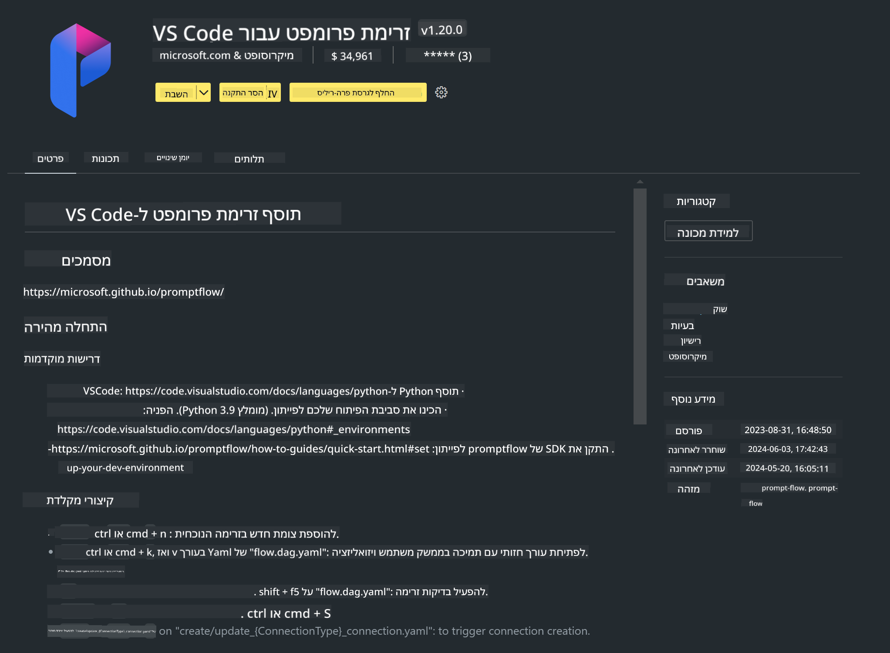

<!--
CO_OP_TRANSLATOR_METADATA:
{
  "original_hash": "a4ef39027902e82f2c33d568d2a2259a",
  "translation_date": "2025-07-17T03:51:27+00:00",
  "source_file": "md/02.Application/02.Code/Phi3/VSCodeExt/HOL/AIPC/01.Installations.md",
  "language_code": "he"
}
-->
# **מעבדה 0 - התקנה**

כשאנחנו נכנסים למעבדה, יש להגדיר את הסביבה הרלוונטית:


### **1. Python 3.11+**

מומלץ להשתמש ב-miniforge כדי להגדיר את סביבת ה-Python שלך

להגדרת miniforge, יש לעיין ב-[https://github.com/conda-forge/miniforge](https://github.com/conda-forge/miniforge)

לאחר הגדרת miniforge, הרץ את הפקודה הבאה ב-Power Shell

```bash

conda create -n pyenv python==3.11.8 -y

conda activate pyenv

```


### **2. התקנת Prompt flow SDK**

במעבדה 1, אנו משתמשים ב-Prompt flow, לכן יש להגדיר את ה-Prompt flow SDK.

```bash

pip install promptflow --upgrade

```

ניתן לבדוק את promptflow sdk באמצעות הפקודה הזו


```bash

pf --version

```

### **3. התקנת תוסף Prompt flow ל-Visual Studio Code**




### **4. ספריית האצת Intel NPU**

מעבדי הדור החדש של Intel תומכים ב-NPU. אם ברצונך להשתמש ב-NPU כדי להריץ LLMs / SLMs באופן מקומי, ניתן להשתמש ב-***Intel NPU Acceleration Library***. למידע נוסף, ניתן לקרוא ב-[https://github.com/microsoft/PhiCookBook/blob/main/md/01.Introduction/03/AIPC_Inference.md](https://github.com/microsoft/PhiCookBook/blob/main/md/01.Introduction/03/AIPC_Inference.md).

התקן את Intel NPU Acceleration Library ב-bash


```bash

pip install intel-npu-acceleration-library

```

***הערה***: שים לב שהספרייה תומכת ב-transformers בגרסה ***4.40.2***, יש לוודא את הגרסה


### **5. ספריות Python נוספות**


צור קובץ requirements.txt והוסף את התוכן הבא

```txt

notebook
numpy 
scipy 
scikit-learn 
matplotlib 
pandas 
pillow 
graphviz

```


### **6. התקנת NVM**

התקן את nvm ב-Powershell


```bash

winget install -e --id CoreyButler.NVMforWindows

```

התקן nodejs גרסה 18.20


```bash

nvm install 18.20.0

nvm use 18.20.0

```

### **7. התקנת תמיכה בפיתוח ב-Visual Studio Code**


```bash

npm install --global yo generator-code

```

כל הכבוד! הגדרת את ה-SDK בהצלחה. כעת, המשך לשלב המעשי.

**כתב ויתור**:  
מסמך זה תורגם באמצעות שירות תרגום מבוסס בינה מלאכותית [Co-op Translator](https://github.com/Azure/co-op-translator). למרות שאנו שואפים לדיוק, יש לקחת בחשבון כי תרגומים אוטומטיים עלולים להכיל שגיאות או אי-דיוקים. המסמך המקורי בשפת המקור שלו נחשב למקור הסמכותי. למידע קריטי מומלץ להשתמש בתרגום מקצועי על ידי אדם. אנו לא נושאים באחריות לכל אי-הבנה או פרשנות שגויה הנובעת משימוש בתרגום זה.