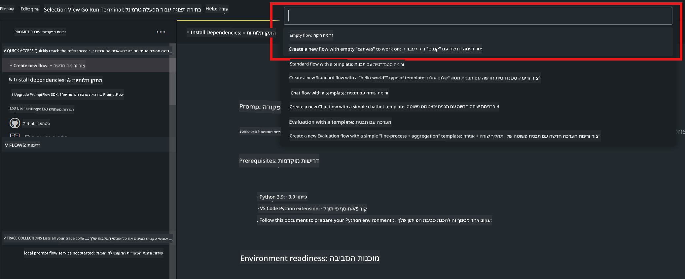

<!--
CO_OP_TRANSLATOR_METADATA:
{
  "original_hash": "bc29f7fe7fc16bed6932733eac8c81b8",
  "translation_date": "2025-07-17T03:59:46+00:00",
  "source_file": "md/02.Application/02.Code/Phi3/VSCodeExt/HOL/AIPC/02.PromptflowWithNPU.md",
  "language_code": "he"
}
-->
# **מעבדה 2 - הרצת Prompt flow עם Phi-3-mini ב-AIPC**

## **מה זה Prompt flow**

Prompt flow היא חבילת כלים לפיתוח שמטרתה לפשט את מחזור הפיתוח המלא של יישומי AI מבוססי LLM, מהרעיון, דרך יצירת אב-טיפוס, בדיקות, הערכה ועד לפריסה במערכת הפקה ומעקב. היא מקלה מאוד על הנדסת הפרומפט ומאפשרת לבנות אפליקציות LLM באיכות של הפקה.

עם Prompt flow תוכל/י:

- ליצור זרימות שמקשרות בין LLMים, פרומפטים, קוד Python וכלים נוספים בזרימת עבודה הניתנת להרצה.

- לנפות שגיאות ולבצע איטרציות על הזרימות, במיוחד על האינטראקציה עם ה-LLM, בקלות.

- להעריך את הזרימות, לחשב מדדי איכות וביצועים עם מערכי נתונים גדולים יותר.

- לשלב את הבדיקות וההערכה במערכת ה-CI/CD שלך כדי להבטיח איכות של הזרימה.

- לפרוס את הזרימות לפלטפורמת השירות שתבחר/י או לשלב אותן בקלות בקוד של האפליקציה שלך.

- (אופציונלי אך מומלץ מאוד) לשתף פעולה עם הצוות שלך באמצעות הגרסה בענן של Prompt flow ב-Azure AI.

## **מה זה AIPC**

מחשב AI כולל מעבד מרכזי (CPU), מעבד גרפי (GPU) ומעבד נוירוני (NPU), שכל אחד מהם מצויד ביכולות האצה ייחודיות ל-AI. NPU, או יחידת עיבוד נוירונית, הוא מאיץ ייעודי שמטפל במשימות בינה מלאכותית (AI) ולמידת מכונה (ML) ישירות במחשב שלך, במקום לשלוח את הנתונים לעיבוד בענן. ה-GPU וה-CPU יכולים גם לעבד את המשימות האלה, אך ה-NPU מצטיין במיוחד בחישובי AI עם צריכת חשמל נמוכה. מחשב AI מייצג שינוי מהותי באופן שבו המחשבים שלנו פועלים. זה לא פתרון לבעיה שלא הייתה קיימת קודם, אלא שיפור משמעותי לשימושים יומיומיים במחשב.

אז איך זה עובד? בהשוואה ל-AI גנרטיבי ולמודלים גדולים (LLMs) שמאומנים על כמויות עצומות של נתונים ציבוריים, ה-AI שירוץ במחשב שלך יהיה נגיש יותר ברמות רבות. הרעיון פשוט יותר להבנה, ומכיוון שהוא מאומן על הנתונים שלך, מבלי צורך לגשת לענן, היתרונות נראים מידיים ומושכים קהל רחב יותר.

בטווח הקצר, עולם מחשב ה-AI כולל עוזרים אישיים ומודלים קטנים של AI שרצים ישירות במחשב שלך, משתמשים בנתונים שלך כדי להציע שיפורים אישיים, פרטיים ובטוחים יותר לדברים שאתה כבר עושה כל יום – רישום פרוטוקולים מישיבות, ארגון ליגת פנטזי כדורגל, אוטומציה של שיפורים בעריכת תמונות ווידאו, או תכנון מסלול מושלם למפגש משפחתי בהתבסס על זמני הגעה ויציאה של כולם.

## **בניית זרימות קוד גנרציה ב-AIPC**

***Note*** ：אם לא השלמת את התקנת הסביבה, אנא בקר ב-[Lab 0 -Installations](./01.Installations.md)

1. פתח את תוסף Prompt flow ב-Visual Studio Code ויצר פרויקט זרימה ריק



2. הוסף פרמטרים של קלט ופלט והוסף קוד Python כזרימה חדשה


אתה יכול להתייחס למבנה הזה (flow.dag.yaml) כדי לבנות את הזרימה שלך

```yaml

inputs:
  question:
    type: string
    default: how to write Bubble Algorithm
outputs:
  answer:
    type: string
    reference: ${Chat_With_Phi3.output}
nodes:
- name: Chat_With_Phi3
  type: python
  source:
    type: code
    path: Chat_With_Phi3.py
  inputs:
    question: ${inputs.question}


```

3. הוסף קוד ב-***Chat_With_Phi3.py***

```python


from promptflow.core import tool

# import torch
from transformers import AutoTokenizer, pipeline,TextStreamer
import intel_npu_acceleration_library as npu_lib

import warnings

import asyncio
import platform

class Phi3CodeAgent:
    
    model = None
    tokenizer = None
    text_streamer = None
    
    model_id = "microsoft/Phi-3-mini-4k-instruct"

    @staticmethod
    def init_phi3():
        
        if Phi3CodeAgent.model is None or Phi3CodeAgent.tokenizer is None or Phi3CodeAgent.text_streamer is None:
            Phi3CodeAgent.model = npu_lib.NPUModelForCausalLM.from_pretrained(
                                    Phi3CodeAgent.model_id,
                                    torch_dtype="auto",
                                    dtype=npu_lib.int4,
                                    trust_remote_code=True
                                )
            Phi3CodeAgent.tokenizer = AutoTokenizer.from_pretrained(Phi3CodeAgent.model_id)
            Phi3CodeAgent.text_streamer = TextStreamer(Phi3CodeAgent.tokenizer, skip_prompt=True)

    

    @staticmethod
    def chat_with_phi3(prompt):
        
        Phi3CodeAgent.init_phi3()

        messages = "<|system|>You are a AI Python coding assistant. Please help me to generate code in Python.The answer only genertated Python code, but any comments and instructions do not need to be generated<|end|><|user|>" + prompt +"<|end|><|assistant|>"


        generation_args = {
            "max_new_tokens": 1024,
            "return_full_text": False,
            "temperature": 0.3,
            "do_sample": False,
            "streamer": Phi3CodeAgent.text_streamer,
        }

        pipe = pipeline(
            "text-generation",
            model=Phi3CodeAgent.model,
            tokenizer=Phi3CodeAgent.tokenizer,
            # **generation_args
        )

        result = ''

        with warnings.catch_warnings():
            warnings.simplefilter("ignore")
            response = pipe(messages, **generation_args)
            result =response[0]['generated_text']
            return result


@tool
def my_python_tool(question: str) -> str:
    if platform.system() == 'Windows':
        asyncio.set_event_loop_policy(asyncio.WindowsSelectorEventLoopPolicy())
    return Phi3CodeAgent.chat_with_phi3(question)


```

4. תוכל/י לבדוק את הזרימה דרך Debug או Run כדי לוודא שהקוד הגנרטיבי פועל כראוי


5. הרץ את הזרימה כ-API לפיתוח בטרמינל

```

pf flow serve --source ./ --port 8080 --host localhost   

```

תוכל/י לבדוק זאת ב-Postman / Thunder Client

### **Note**

1. ההרצה הראשונה אורכת זמן רב. מומלץ להוריד את מודל phi-3 דרך Hugging face CLI.

2. בהתחשב במגבלות כוח המחשוב של Intel NPU, מומלץ להשתמש ב-Phi-3-mini-4k-instruct

3. אנו משתמשים בהאצת Intel NPU להמרת כימות INT4, אך אם תריץ/י מחדש את השירות, יש למחוק את תיקיות ה-cache ו-nc_workshop.

## **משאבים**

1. ללמוד על Promptflow [https://microsoft.github.io/promptflow/](https://microsoft.github.io/promptflow/)

2. ללמוד על האצת Intel NPU [https://github.com/intel/intel-npu-acceleration-library](https://github.com/intel/intel-npu-acceleration-library)

3. קוד לדוגמה, הורדה [Local NPU Agent Sample Code](../../../../../../../../../code/07.Lab/01/AIPC)

**כתב ויתור**:  
מסמך זה תורגם באמצעות שירות תרגום מבוסס בינה מלאכותית [Co-op Translator](https://github.com/Azure/co-op-translator). למרות שאנו שואפים לדיוק, יש לקחת בחשבון כי תרגומים אוטומטיים עלולים להכיל שגיאות או אי-דיוקים. המסמך המקורי בשפת המקור שלו נחשב למקור הסמכותי. למידע קריטי מומלץ להשתמש בתרגום מקצועי על ידי אדם. אנו לא נושאים באחריות לכל אי-הבנה או פרשנות שגויה הנובעת משימוש בתרגום זה.