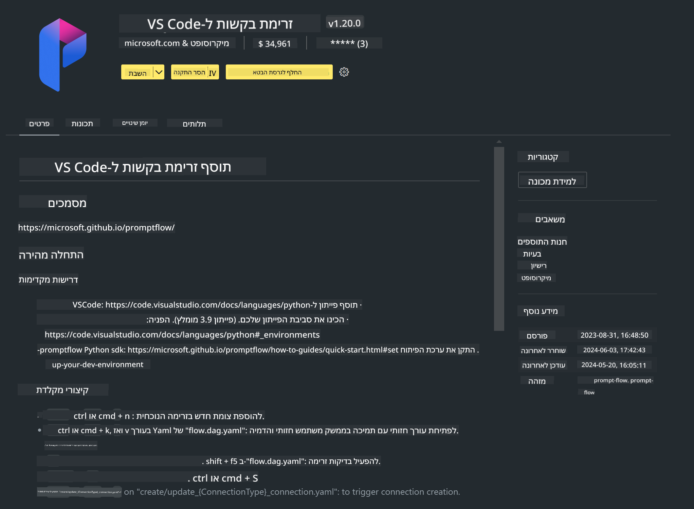

<!--
CO_OP_TRANSLATOR_METADATA:
{
  "original_hash": "4b16264917d9b93169745d92b8ce8c65",
  "translation_date": "2025-05-09T19:36:13+00:00",
  "source_file": "md/02.Application/02.Code/Phi3/VSCodeExt/HOL/Apple/01.Installations.md",
  "language_code": "he"
}
-->
# **מעבדה 0 - התקנה**

כשאנחנו נכנסים למעבדה, צריך להגדיר את הסביבה הרלוונטית:


### **1. Python 3.11+**

מומלץ להשתמש ב-miniforge כדי להגדיר את סביבת הפייתון שלך

להגדרת miniforge, יש לעיין ב-[https://github.com/conda-forge/miniforge](https://github.com/conda-forge/miniforge)

לאחר הגדרת miniforge, הרץ את הפקודה הבאה ב-Power Shell

```bash

conda create -n pyenv python==3.11.8 -y

conda activate pyenv

```


### **2. התקנת Prompt flow SDK**

במעבדה 1, אנחנו משתמשים ב-Prompt flow, לכן יש להגדיר את ה-Prompt flow SDK.

```bash

pip install promptflow --upgrade

```

אתה יכול לבדוק את ה-promptflow sdk עם הפקודה הזו


```bash

pf --version

```

### **3. התקנת תוסף Visual Studio Code ל-Prompt flow**



### **4. מסגרת Apple MLX**

MLX היא מסגרת מערך למחקר למידת מכונה על שבבי Apple, מבית מחקר למידת המכונה של Apple. ניתן להשתמש ב**Apple MLX framework** כדי להאיץ LLM / SLM עם Apple Silicon. אם תרצה לדעת יותר, תוכל לקרוא ב-[https://github.com/microsoft/PhiCookBook/blob/main/md/01.Introduction/03/MLX_Inference.md](https://github.com/microsoft/PhiCookBook/blob/main/md/01.Introduction/03/MLX_Inference.md).

התקנת ספריית מסגרת MLX ב-bash


```bash

pip install mlx-lm

```


### **5. ספריית פייתון נוספת**


צור קובץ requirements.txt והוסף את התוכן הבא

```txt

notebook
numpy 
scipy 
scikit-learn 
matplotlib 
pandas 
pillow 
graphviz

```


### **6. התקנת NVM**

התקן את nvm ב-Powershell


```bash

brew install nvm

```

התקן nodejs 18.20


```bash

nvm install 18.20.0

nvm use 18.20.0

```

### **7. התקנת תמיכה בפיתוח ב-Visual Studio Code**


```bash

npm install --global yo generator-code

```

כל הכבוד! הגדרת את ה-SDK בהצלחה. כעת, המשך לשלב המעשי.

**כתב ויתור**:  
מסמך זה תורגם באמצעות שירות תרגום מבוסס בינה מלאכותית [Co-op Translator](https://github.com/Azure/co-op-translator). למרות שאנו שואפים לדיוק, יש לקחת בחשבון כי תרגומים אוטומטיים עלולים להכיל שגיאות או אי-דיוקים. המסמך המקורי בשפת המקור שלו צריך להיחשב כמקור הסמכותי. עבור מידע קריטי, מומלץ להשתמש בתרגום מקצועי של אדם. אנו לא אחראים על אי-הבנות או פרשנויות שגויות הנובעות משימוש בתרגום זה.