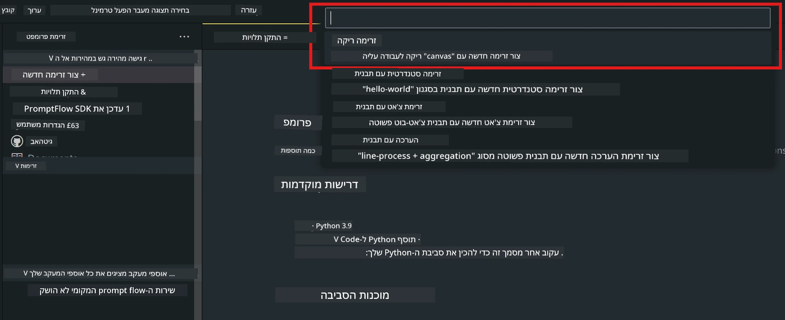
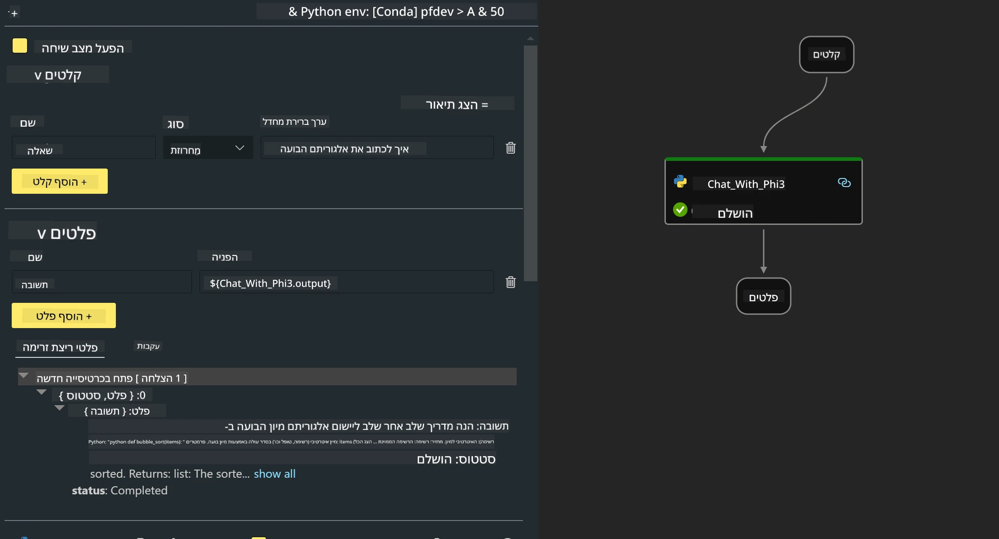
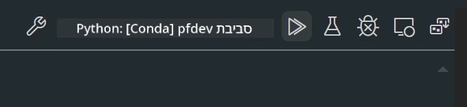

# **מעבדה 2 - הרצת Prompt flow עם Phi-3-mini ב-AIPC**

## **מה זה Prompt flow**

Prompt flow היא חבילת כלים לפיתוח שמטרתה לפשט את מחזור הפיתוח המלא של יישומי AI מבוססי LLM, החל מרעיונות, יצירת אב-טיפוס, בדיקות, הערכה ועד לפריסה במערכת הפקה ומעקב. היא מקלה מאוד על הנדסת הפרומפט ומאפשרת לבנות אפליקציות LLM באיכות הפקה.

עם Prompt flow תוכל:

- ליצור זרימות שמקשרות בין LLMים, פרומפטים, קוד Python וכלים נוספים בזרימת עבודה הניתנת להרצה.

- לנפות שגיאות ולבצע איטרציות על הזרימות שלך, במיוחד באינטראקציה עם LLMים, בקלות.

- להעריך את הזרימות שלך, לחשב מדדי איכות וביצועים עם מערכי נתונים גדולים יותר.

- לשלב את הבדיקות וההערכה במערכת ה-CI/CD שלך כדי להבטיח איכות של הזרימה.

- לפרוס את הזרימות לפלטפורמת השרתים שתבחר או לשלב אותן בקלות בקוד של האפליקציה שלך.

- (אופציונלי אך מומלץ מאוד) לשתף פעולה עם הצוות שלך באמצעות הגרסה בענן של Prompt flow ב-Azure AI.

## **בניית זרימות קוד גנרציה על Apple Silicon**

***Note*** ：אם לא השלמת את התקנת הסביבה, אנא בקר ב-[Lab 0 -Installations](./01.Installations.md)

1. פתח את תוסף Prompt flow ב-Visual Studio Code ויצר פרויקט זרימה ריק



2. הוסף פרמטרים של קלט ופלט והוסף קוד Python כזרימה חדשה



אתה יכול להתייחס למבנה הזה (flow.dag.yaml) כדי לבנות את הזרימה שלך

```yaml

inputs:
  prompt:
    type: string
    default: Write python code for Fibonacci serie. Please use markdown as output
outputs:
  result:
    type: string
    reference: ${gen_code_by_phi3.output}
nodes:
- name: gen_code_by_phi3
  type: python
  source:
    type: code
    path: gen_code_by_phi3.py
  inputs:
    prompt: ${inputs.prompt}


```

3. כמת את phi-3-mini

אנו שואפים להריץ טוב יותר SLM על מכשירים מקומיים. בדרך כלל, אנו מבצעים כימות למודל (INT4, FP16, FP32)

```bash

python -m mlx_lm.convert --hf-path microsoft/Phi-3-mini-4k-instruct

```

**Note:** התיקייה ברירת המחדל היא mlx_model

4. הוסף קוד ב-***Chat_With_Phi3.py***

```python


from promptflow import tool

from mlx_lm import load, generate


# The inputs section will change based on the arguments of the tool function, after you save the code
# Adding type to arguments and return value will help the system show the types properly
# Please update the function name/signature per need
@tool
def my_python_tool(prompt: str) -> str:

    model_id = './mlx_model_phi3_mini'

    model, tokenizer = load(model_id)

    # <|user|>\nWrite python code for Fibonacci serie. Please use markdown as output<|end|>\n<|assistant|>

    response = generate(model, tokenizer, prompt="<|user|>\n" + prompt  + "<|end|>\n<|assistant|>", max_tokens=2048, verbose=True)

    return response


```

4. תוכל לבדוק את הזרימה דרך Debug או Run כדי לוודא שהקוד ליצירה פועל כראוי



5. הרץ את הזרימה כ-API לפיתוח בטרמינל

```

pf flow serve --source ./ --port 8080 --host localhost   

```

תוכל לבדוק זאת ב-Postman / Thunder Client

### **Note**

1. ההרצה הראשונה אורכת זמן רב. מומלץ להוריד את מודל phi-3 דרך Hugging face CLI.

2. בהתחשב במגבלות כוח המחשוב של Intel NPU, מומלץ להשתמש ב-Phi-3-mini-4k-instruct

3. אנו משתמשים בהאצת Intel NPU לכימות המרה ל-INT4, אך אם תריץ את השירות שוב, יש למחוק את תיקיות המטמון וה-nc_workshop.

## **משאבים**

1. ללמוד על Promptflow [https://microsoft.github.io/promptflow/](https://microsoft.github.io/promptflow/)

2. ללמוד על האצת Intel NPU [https://github.com/intel/intel-npu-acceleration-library](https://github.com/intel/intel-npu-acceleration-library)

3. קוד לדוגמה, הורדה [Local NPU Agent Sample Code](../../../../../../../../../code/07.Lab/01/AIPC/local-npu-agent)

**כתב ויתור**:  
מסמך זה תורגם באמצעות שירות תרגום מבוסס בינה מלאכותית [Co-op Translator](https://github.com/Azure/co-op-translator). למרות שאנו שואפים לדיוק, יש לקחת בחשבון כי תרגומים אוטומטיים עלולים להכיל שגיאות או אי-דיוקים. המסמך המקורי בשפת המקור שלו נחשב למקור הסמכותי. למידע קריטי מומלץ להשתמש בתרגום מקצועי על ידי מתרגם אנושי. אנו לא נושאים באחריות לכל אי-הבנה או פרשנות שגויה הנובעת משימוש בתרגום זה.