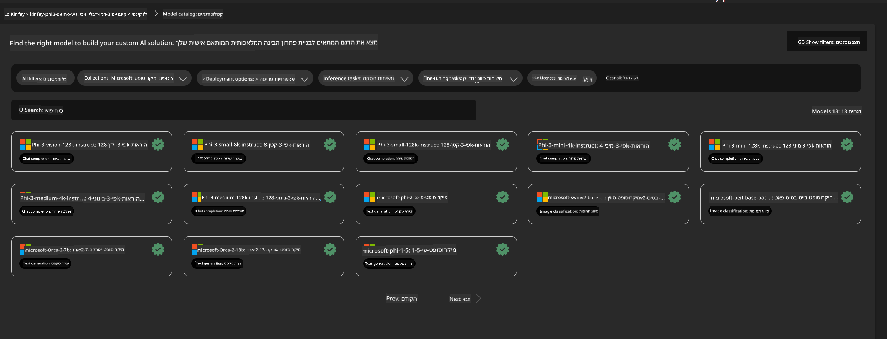
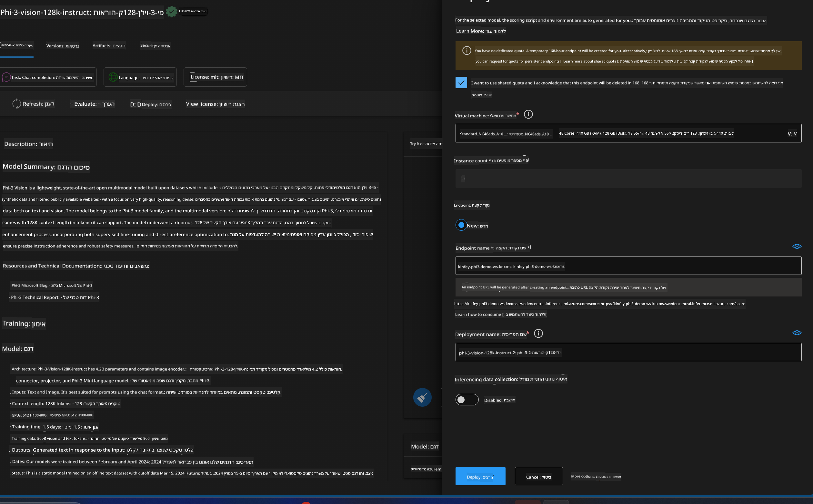
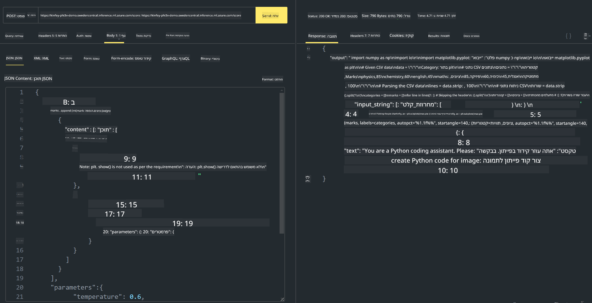

<!--
CO_OP_TRANSLATOR_METADATA:
{
  "original_hash": "20cb4e6ac1686248e8be913ccf6c2bc2",
  "translation_date": "2025-05-09T19:44:16+00:00",
  "source_file": "md/02.Application/02.Code/Phi3/VSCodeExt/HOL/Apple/03.DeployPhi3VisionOnAzure.md",
  "language_code": "he"
}
-->
# **מעבדה 3 - פריסת Phi-3-vision בשירות Azure Machine Learning**

אנחנו משתמשים ב-NPU כדי להשלים את פריסת הייצור של הקוד המקומי, ואז רוצים להכניס את היכולת להכניס את PHI-3-VISION דרכו כדי להשיג הפיכת תמונות לקוד.

בהקדמה הזו, נוכל לבנות במהירות שירות Model As Service של Phi-3 Vision בשירות Azure Machine Learning.

***Note***： Phi-3 Vision דורש כוח מחשוב כדי לייצר תוכן במהירות גבוהה יותר. אנחנו צריכים כוח מחשוב בענן שיעזור לנו להשיג זאת.


### **1. יצירת שירות Azure Machine Learning**

אנחנו צריכים ליצור שירות Azure Machine Learning בפורטל Azure. אם תרצו ללמוד איך, אנא בקרו בקישור הזה [https://learn.microsoft.com/azure/machine-learning/quickstart-create-resources?view=azureml-api-2](https://learn.microsoft.com/azure/machine-learning/quickstart-create-resources?view=azureml-api-2)


### **2. בחירת Phi-3 Vision בשירות Azure Machine Learning**




### **3. פריסת Phi-3-Vision ב-Azure**





### **4. בדיקת נקודת הקצה ב-Postman**





***Note***

1. הפרמטרים שיש לשלוח חייבים לכלול Authorization, azureml-model-deployment, ו-Content-Type. יש לבדוק את פרטי הפריסה כדי לקבל אותם.

2. כדי לשלוח פרמטרים, Phi-3-Vision צריך לקבל קישור לתמונה. אנא התייחסו לשיטת GPT-4-Vision לשליחת פרמטרים, כמו

```json

{
  "input_data":{
    "input_string":[
      {
        "role":"user",
        "content":[ 
          {
            "type": "text",
            "text": "You are a Python coding assistant.Please create Python code for image "
          },
          {
              "type": "image_url",
              "image_url": {
                "url": "https://ajaytech.co/wp-content/uploads/2019/09/index.png"
              }
          }
        ]
      }
    ],
    "parameters":{
          "temperature": 0.6,
          "top_p": 0.9,
          "do_sample": false,
          "max_new_tokens": 2048
    }
  }
}

```

3. קריאה ל-**/score** באמצעות שיטת Post

**מזל טוב**！סיימתם את פריסת PHI-3-VISION המהירה וניסיתם כיצד להשתמש בתמונות כדי ליצור קוד. בשלב הבא, נוכל לבנות יישומים בשילוב עם NPUs ועננים

**כתב ויתור**:  
מסמך זה תורגם באמצעות שירות תרגום מבוסס בינה מלאכותית [Co-op Translator](https://github.com/Azure/co-op-translator). למרות שאנו שואפים לדיוק, יש לקחת בחשבון שתרגומים אוטומטיים עלולים להכיל שגיאות או אי-דיוקים. המסמך המקורי בשפת המקור שלו הוא המקור הסמכותי. למידע קריטי מומלץ להשתמש בתרגום מקצועי של אדם. איננו אחראים לכל אי-הבנות או פרשנויות שגויות הנובעות משימוש בתרגום זה.