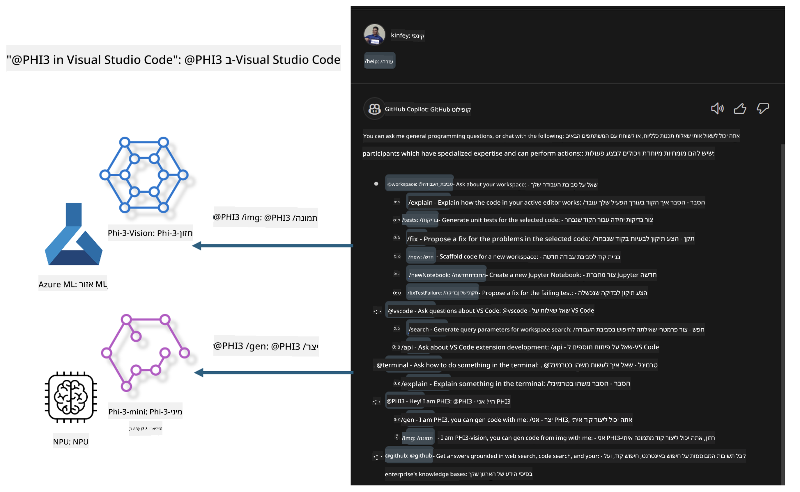

<!--
CO_OP_TRANSLATOR_METADATA:
{
  "original_hash": "00b7a699de8ac405fa821f4c0f7fc0ab",
  "translation_date": "2025-05-09T19:14:59+00:00",
  "source_file": "md/02.Application/02.Code/Phi3/VSCodeExt/README.md",
  "language_code": "he"
}
-->
# **בנה לעצמך את שיחת GitHub Copilot של Visual Studio Code עם משפחת Microsoft Phi-3**

האם השתמשת בסוכן סביבת העבודה ב-GitHub Copilot Chat? רוצה לבנות סוכן קוד משלך לצוות שלך? מעבדה זו מעשית ומטרתה לשלב את המודל בקוד פתוח כדי לבנות סוכן עסקי לייצור קוד ברמת ארגון.

## **יסודות**

### **למה לבחור ב-Microsoft Phi-3**

Phi-3 היא סדרת משפחה, הכוללת את phi-3-mini, phi-3-small ו-phi-3-medium, המבוססים על פרמטרים שונים לאימון ליצירת טקסט, השלמת דיאלוג ויצירת קוד. קיימת גם גרסת phi-3-vision המבוססת על Vision. היא מתאימה לארגונים או צוותים שונים ליצירת פתרונות AI גנרטיביים במצב לא מקוון.

מומלץ לקרוא בקישור הזה [https://github.com/microsoft/PhiCookBook/blob/main/md/01.Introduction/01/01.PhiFamily.md](https://github.com/microsoft/PhiCookBook/blob/main/md/01.Introduction/01/01.PhiFamily.md)

### **Microsoft GitHub Copilot Chat**

ההרחבה GitHub Copilot Chat מספקת לך ממשק שיחה שמאפשר אינטראקציה עם GitHub Copilot וקבלת תשובות לשאלות הקשורות לקוד ישירות בתוך VS Code, בלי הצורך לנווט בתיעוד או לחפש בפורומים אונליין.

שיחת Copilot עשויה להשתמש בהדגשת תחביר, הזחה ותכונות עיצוב נוספות כדי להבהיר את התשובה שנוצרה. בהתאם לסוג השאלה מהמשתמש, התוצאה יכולה לכלול קישורים להקשר ש-Copilot השתמש בו ליצירת התשובה, כמו קבצי קוד מקור או תיעוד, או כפתורים לגישה לפונקציות של VS Code.

- שיחת Copilot משתלבת בזרימת הפיתוח שלך ומספקת עזרה במקום שבו אתה צריך:

- התחל שיחה מקוונת ישירות מהעורך או מהטרמינל לקבלת עזרה בזמן הקידוד

- השתמש בתצוגת הצ'אט כדי לקבל עוזר AI לצידך בכל עת

- הפעל Quick Chat כדי לשאול שאלה מהירה ולחזור במהירות למה שאתה עושה

ניתן להשתמש ב-GitHub Copilot Chat במצבים שונים, כגון:

- מענה על שאלות קידוד כיצד לפתור בעיה בצורה הטובה ביותר

- הסבר על קוד של מישהו אחר והצעת שיפורים

- הצעת תיקוני קוד

- יצירת מקרים לבדיקות יחידה

- יצירת תיעוד קוד

מומלץ לקרוא בקישור הזה [https://code.visualstudio.com/docs/copilot/copilot-chat](https://code.visualstudio.com/docs/copilot/copilot-chat?WT.mc_id=aiml-137032-kinfeylo)

###  **Microsoft GitHub Copilot Chat @workspace**

שימוש ב-**@workspace** ב-Copilot Chat מאפשר לך לשאול שאלות על כל בסיס הקוד שלך. בהתבסס על השאלה, Copilot מאתר בצורה חכמה קבצים וסמלים רלוונטיים, אותם הוא מציין בתשובתו כקישורים ודוגמאות קוד.

כדי לענות על שאלתך, **@workspace** מחפש באותם מקורות שהמפתח היה משתמש בהם בעת ניווט בבסיס הקוד ב-VS Code:

- כל הקבצים בסביבת העבודה, למעט קבצים המוחרגים על ידי קובץ .gitignore

- מבנה התיקיות עם שמות תיקיות וקבצים מקוננים

- אינדקס חיפוש הקוד של GitHub, אם סביבת העבודה היא מאגר GitHub ומאונדקסת על ידי חיפוש קוד

- סמלים והגדרות בסביבת העבודה

- טקסט שנבחר כרגע או טקסט גלוי בעורך הפעיל

הערה: .gitignore מתעלם אם יש לך קובץ פתוח או טקסט שנבחר בתוך קובץ שהוחרג.

מומלץ לקרוא בקישור הזה [[https://code.visualstudio.com/docs/copilot/copilot-chat](https://code.visualstudio.com/docs/copilot/workspace-context?WT.mc_id=aiml-137032-kinfeylo)]

## **למד עוד על המעבדה הזו**

GitHub Copilot שיפר משמעותית את יעילות התכנות בארגונים, וכל ארגון רוצה להתאים אישית את הפונקציות הרלוונטיות של GitHub Copilot. ארגונים רבים התאימו הרחבות דומות ל-GitHub Copilot בהתבסס על תרחישי העסק שלהם ומודלים בקוד פתוח. עבור ארגונים, הרחבות מותאמות אישית הן קלות יותר לשליטה, אך זה גם משפיע על חוויית המשתמש. אחרי הכל, ל-GitHub Copilot יש פונקציות חזקות יותר בהתמודדות עם תרחישים כלליים ומקצועיות. אם ניתן לשמור על חוויה עקבית, יהיה טוב יותר להתאים אישית את ההרחבה של הארגון. GitHub Copilot Chat מספק APIs רלוונטיים לארגונים להרחבה בחוויית השיחה. שמירה על חוויה עקבית ועם פונקציות מותאמות אישית היא חוויית משתמש טובה יותר.

מעבדה זו משתמשת בעיקר במודל Phi-3 בשילוב עם NPU מקומי והיברידי של Azure כדי לבנות סוכן מותאם אישית ב-GitHub Copilot Chat ***@PHI3*** שיעזור למפתחים בארגון להשלים יצירת קוד ***(@PHI3 /gen)*** וליצור קוד בהתבסס על תמונות ***(@PHI3 /img)***.

### ***הערה:*** 

מעבדה זו מיושמת כרגע ב-AIPC של מעבדי Intel ו-Apple Silicon. נמשיך לעדכן את גרסת Qualcomm של NPU.

## **מעבדה**

| שם | תיאור | AIPC | Apple |
| ------------ | ----------- | -------- |-------- |
| Lab0 - Installations(✅) | הגדרת והתקנת סביבות וכלי התקנה רלוונטיים | [Go](./HOL/AIPC/01.Installations.md) |[Go](./HOL/Apple/01.Installations.md) |
| Lab1 - Run Prompt flow with Phi-3-mini (✅) | בשילוב עם AIPC / Apple Silicon, שימוש ב-NPU מקומי ליצירת קוד דרך Phi-3-mini | [Go](./HOL/AIPC/02.PromptflowWithNPU.md) |  [Go](./HOL/Apple/02.PromptflowWithMLX.md) |
| Lab2 - Deploy Phi-3-vision on Azure Machine Learning Service(✅) | יצירת קוד על ידי פריסת קטלוג המודלים של Azure Machine Learning Service - תמונת Phi-3-vision | [Go](./HOL/AIPC/03.DeployPhi3VisionOnAzure.md) |[Go](./HOL/Apple/03.DeployPhi3VisionOnAzure.md) |
| Lab3 - Create a @phi-3 agent in GitHub Copilot Chat(✅)  | יצירת סוכן Phi-3 מותאם אישית ב-GitHub Copilot Chat להשלמת יצירת קוד, יצירת קוד גרפי, RAG ועוד | [Go](./HOL/AIPC/04.CreatePhi3AgentInVSCode.md) | [Go](./HOL/Apple/04.CreatePhi3AgentInVSCode.md) |
| Sample Code (✅)  | הורדת קוד לדוגמה | [Go](../../../../../../../code/07.Lab/01/AIPC) | [Go](../../../../../../../code/07.Lab/01/Apple) |

## **משאבים**

1. Phi-3 Cookbook [https://github.com/microsoft/Phi-3CookBook](https://github.com/microsoft/Phi-3CookBook)

2. למד עוד על GitHub Copilot [https://learn.microsoft.com/training/paths/copilot/](https://learn.microsoft.com/training/paths/copilot/?WT.mc_id=aiml-137032-kinfeylo)

3. למד עוד על GitHub Copilot Chat [https://learn.microsoft.com/training/paths/accelerate-app-development-using-github-copilot/](https://learn.microsoft.com/training/paths/accelerate-app-development-using-github-copilot/?WT.mc_id=aiml-137032-kinfeylo)

4. למד עוד על GitHub Copilot Chat API [https://code.visualstudio.com/api/extension-guides/chat](https://code.visualstudio.com/api/extension-guides/chat?WT.mc_id=aiml-137032-kinfeylo)

5. למד עוד על Azure AI Foundry [https://learn.microsoft.com/training/paths/create-custom-copilots-ai-studio/](https://learn.microsoft.com/training/paths/create-custom-copilots-ai-studio/?WT.mc_id=aiml-137032-kinfeylo)

6. למד עוד על קטלוג המודלים של Azure AI Foundry [https://learn.microsoft.com/azure/ai-studio/how-to/model-catalog-overview](https://learn.microsoft.com/azure/ai-studio/how-to/model-catalog-overview)

**כתב ויתור**:  
מסמך זה תורגם באמצעות שירות תרגום מבוסס בינה מלאכותית [Co-op Translator](https://github.com/Azure/co-op-translator). למרות שאנו שואפים לדיוק, יש לקחת בחשבון כי תרגומים אוטומטיים עלולים להכיל שגיאות או אי-דיוקים. המסמך המקורי בשפת המקור שלו צריך להיחשב כמקור הסמכותי. למידע קריטי מומלץ להשתמש בתרגום מקצועי על ידי מתרגם אנושי. איננו אחראים לכל אי-הבנה או פרשנות שגויה הנובעים משימוש בתרגום זה.