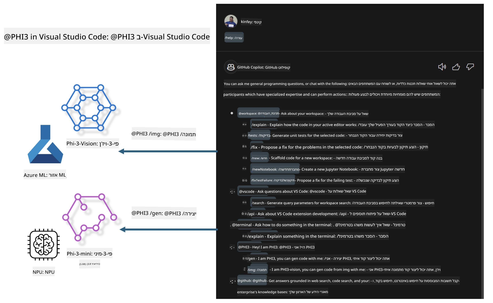

# **בנה את Visual Studio Code GitHub Copilot Chat שלך עם משפחת Microsoft Phi-3**

האם השתמשת בסוכן סביבת העבודה ב-GitHub Copilot Chat? רוצה לבנות סוכן קוד משלך לצוות שלך? המעבדה המעשית הזו שואפת לשלב את המודל בקוד פתוח כדי לבנות סוכן קוד עסקי ברמת ארגון.

## **יסודות**

### **למה לבחור ב-Microsoft Phi-3**

Phi-3 היא סדרת משפחה, הכוללת את phi-3-mini, phi-3-small ו-phi-3-medium, המבוססים על פרמטרים שונים לאימון ליצירת טקסט, השלמת דיאלוג ויצירת קוד. יש גם את phi-3-vision המבוסס על Vision. היא מתאימה לארגונים או צוותים שונים ליצירת פתרונות AI גנרטיביים לא מקוונים.

מומלץ לקרוא בקישור הזה [https://github.com/microsoft/PhiCookBook/blob/main/md/01.Introduction/01/01.PhiFamily.md](https://github.com/microsoft/PhiCookBook/blob/main/md/01.Introduction/01/01.PhiFamily.md)

### **Microsoft GitHub Copilot Chat**

ההרחבה GitHub Copilot Chat מספקת ממשק שיחה שמאפשר לך לתקשר עם GitHub Copilot ולקבל תשובות לשאלות הקשורות לקוד ישירות בתוך VS Code, מבלי שתצטרך לעבור על תיעוד או לחפש בפורומים באינטרנט.

Copilot Chat עשוי להשתמש בהדגשת תחביר, הזחה ותכונות עיצוב נוספות כדי להבהיר את התשובה שנוצרה. בהתאם לסוג השאלה מהמשתמש, התוצאה יכולה לכלול קישורים להקשר שבו Copilot השתמש ליצירת התשובה, כמו קבצי קוד מקור או תיעוד, או כפתורים לגישה לפונקציונליות של VS Code.

- Copilot Chat משתלב בזרימת העבודה שלך כמפתח ומספק לך סיוע במקום שבו אתה צריך אותו:

- התחל שיחת צ'אט מקוונת ישירות מהעורך או מהטרמינל לקבלת עזרה בזמן הקידוד

- השתמש בתצוגת הצ'אט כדי לקבל עוזר AI בצד שיעזור לך בכל עת

- הפעל Quick Chat כדי לשאול שאלה מהירה ולחזור במהירות למה שאתה עושה

ניתן להשתמש ב-GitHub Copilot Chat במגוון תרחישים, כגון:

- מענה על שאלות קידוד לגבי הדרך הטובה ביותר לפתור בעיה

- הסבר על קוד של מישהו אחר והצעת שיפורים

- הצעת תיקוני קוד

- יצירת מקרים של בדיקות יחידה

- יצירת תיעוד קוד

מומלץ לקרוא בקישור הזה [https://code.visualstudio.com/docs/copilot/copilot-chat](https://code.visualstudio.com/docs/copilot/copilot-chat?WT.mc_id=aiml-137032-kinfeylo)

###  **Microsoft GitHub Copilot Chat @workspace**

הפניה ל-**@workspace** ב-Copilot Chat מאפשרת לך לשאול שאלות על כל בסיס הקוד שלך. בהתבסס על השאלה, Copilot מחלץ בצורה חכמה קבצים וסמלים רלוונטיים, אותם הוא מציין בתשובתו כקישורים ודוגמאות קוד.

כדי לענות על שאלתך, **@workspace** מחפש באותם מקורות שמפתח היה משתמש בהם בעת ניווט בבסיס הקוד ב-VS Code:

- כל הקבצים בסביבת העבודה, למעט קבצים שמוזנחים על ידי קובץ .gitignore

- מבנה התיקיות עם שמות תיקיות וקבצים מקוננים

- אינדקס חיפוש הקוד של GitHub, אם סביבת העבודה היא מאגר GitHub ומאונדקסת על ידי חיפוש קוד

- סמלים והגדרות בסביבת העבודה

- טקסט שנבחר כרגע או טקסט גלוי בעורך הפעיל

הערה: קובץ .gitignore מתעלם אם יש לך קובץ פתוח או טקסט שנבחר בתוך קובץ מוזנח.

מומלץ לקרוא בקישור הזה [[https://code.visualstudio.com/docs/copilot/copilot-chat](https://code.visualstudio.com/docs/copilot/workspace-context?WT.mc_id=aiml-137032-kinfeylo)]

## **למידע נוסף על המעבדה הזו**

GitHub Copilot שיפר משמעותית את יעילות התכנות בארגונים, וכל ארגון מקווה להתאים אישית את הפונקציות הרלוונטיות של GitHub Copilot. ארגונים רבים התאימו הרחבות דומות ל-GitHub Copilot בהתבסס על תרחישי העסק שלהם ומודלים בקוד פתוח. עבור ארגונים, הרחבות מותאמות אישית קלות יותר לניהול, אך זה משפיע גם על חוויית המשתמש. אחרי הכל, ל-GitHub Copilot יש פונקציות חזקות יותר בהתמודדות עם תרחישים כלליים ומקצועיות. אם ניתן לשמור על חוויה עקבית, עדיף להתאים אישית את ההרחבה של הארגון עצמו. GitHub Copilot Chat מספק APIs רלוונטיים לארגונים להרחבה בחוויית הצ'אט. שמירה על חוויה עקבית וקיום פונקציות מותאמות אישית היא חוויית משתמש טובה יותר.

מעבדה זו משתמשת בעיקר במודל Phi-3 בשילוב עם NPU מקומי והיברידי של Azure כדי לבנות סוכן מותאם אישית ב-GitHub Copilot Chat ***@PHI3*** לסייע למפתחי ארגונים בהשלמת יצירת קוד***(@PHI3 /gen)*** ויצירת קוד מבוסס תמונות ***(@PHI3 /img)***.

### ***הערה:*** 

מעבדה זו מיושמת כרגע ב-AIPC של מעבדי Intel ו-Apple Silicon. נמשיך לעדכן את גרסת Qualcomm של NPU.

## **מעבדה**

| שם | תיאור | AIPC | Apple |
| ------------ | ----------- | -------- |-------- |
| Lab0 - Installations(✅) | הגדרת והתקנת סביבות וכלי התקנה קשורים | [Go](./HOL/AIPC/01.Installations.md) |[Go](./HOL/Apple/01.Installations.md) |
| Lab1 - Run Prompt flow with Phi-3-mini (✅) | בשילוב עם AIPC / Apple Silicon, שימוש ב-NPU מקומי ליצירת קוד דרך Phi-3-mini | [Go](./HOL/AIPC/02.PromptflowWithNPU.md) |  [Go](./HOL/Apple/02.PromptflowWithMLX.md) |
| Lab2 - Deploy Phi-3-vision on Azure Machine Learning Service(✅) | יצירת קוד על ידי פריסת קטלוג המודלים של Azure Machine Learning Service - תמונת Phi-3-vision | [Go](./HOL/AIPC/03.DeployPhi3VisionOnAzure.md) |[Go](./HOL/Apple/03.DeployPhi3VisionOnAzure.md) |
| Lab3 - Create a @phi-3 agent in GitHub Copilot Chat(✅)  | יצירת סוכן Phi-3 מותאם אישית ב-GitHub Copilot Chat להשלמת יצירת קוד, יצירת קוד גרפי, RAG ועוד | [Go](./HOL/AIPC/04.CreatePhi3AgentInVSCode.md) | [Go](./HOL/Apple/04.CreatePhi3AgentInVSCode.md) |
| Sample Code (✅)  | הורדת קוד לדוגמה | [Go](../../../../../../../code/07.Lab/01/AIPC) | [Go](../../../../../../../code/07.Lab/01/Apple) |

## **משאבים**

1. Phi-3 Cookbook [https://github.com/microsoft/Phi-3CookBook](https://github.com/microsoft/Phi-3CookBook)

2. למידע נוסף על GitHub Copilot [https://learn.microsoft.com/training/paths/copilot/](https://learn.microsoft.com/training/paths/copilot/?WT.mc_id=aiml-137032-kinfeylo)

3. למידע נוסף על GitHub Copilot Chat [https://learn.microsoft.com/training/paths/accelerate-app-development-using-github-copilot/](https://learn.microsoft.com/training/paths/accelerate-app-development-using-github-copilot/?WT.mc_id=aiml-137032-kinfeylo)

4. למידע נוסף על GitHub Copilot Chat API [https://code.visualstudio.com/api/extension-guides/chat](https://code.visualstudio.com/api/extension-guides/chat?WT.mc_id=aiml-137032-kinfeylo)

5. למידע נוסף על Azure AI Foundry [https://learn.microsoft.com/training/paths/create-custom-copilots-ai-studio/](https://learn.microsoft.com/training/paths/create-custom-copilots-ai-studio/?WT.mc_id=aiml-137032-kinfeylo)

6. למידע נוסף על קטלוג המודלים של Azure AI Foundry [https://learn.microsoft.com/azure/ai-studio/how-to/model-catalog-overview](https://learn.microsoft.com/azure/ai-studio/how-to/model-catalog-overview)

**כתב ויתור**:  
מסמך זה תורגם באמצעות שירות תרגום מבוסס בינה מלאכותית [Co-op Translator](https://github.com/Azure/co-op-translator). למרות שאנו שואפים לדיוק, יש לקחת בחשבון כי תרגומים אוטומטיים עלולים להכיל שגיאות או אי-דיוקים. יש להתייחס למסמך המקורי בשפת המקור כמקור הסמכותי. למידע קריטי מומלץ להשתמש בתרגום מקצועי על ידי מתרגם אנושי. אנו לא נושאים באחריות לכל אי-הבנה או פרשנות שגויה הנובעת משימוש בתרגום זה.