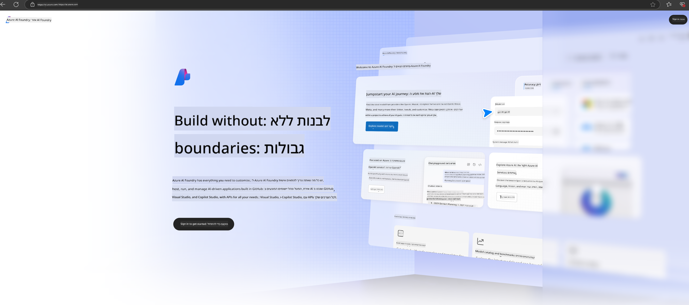

<!--
CO_OP_TRANSLATOR_METADATA:
{
  "original_hash": "3a1e48b628022485aac989c9f733e792",
  "translation_date": "2025-05-09T20:13:06+00:00",
  "source_file": "md/02.QuickStart/AzureAIFoundry_QuickStart.md",
  "language_code": "he"
}
-->
# **שימוש ב-Phi-3 ב-Azure AI Foundry**

עם התפתחות ה-AI הגנרטיבי, אנו מקווים להשתמש בפלטפורמה מאוחדת לניהול מודלים גדולים של שפה (LLM) ומודלים קטנים של שפה (SLM), אינטגרציה של נתוני ארגונים, כיוונון מדויק/פעולות RAG, והערכת עסקים ארגוניים שונים לאחר שילוב LLM ו-SLM, כדי לאפשר יישום טוב יותר של יישומים חכמים מבוססי AI גנרטיבי. [Azure AI Foundry](https://ai.azure.com) היא פלטפורמת יישומים ארגונית ל-AI גנרטיבי.

באמצעות Azure AI Foundry, ניתן להעריך תגובות של מודלים גדולים של שפה (LLM) ולתזמר רכיבי יישום פרומפט עם prompt flow לביצועים טובים יותר. הפלטפורמה מאפשרת הרחבה קלה של רעיונות ראשוניים למוצרים מלאים בקלות. ניטור ושיפור מתמידים תומכים בהצלחה לטווח הארוך.

ניתן לפרוס במהירות את מודל Phi-3 ב-Azure AI Foundry באמצעות כמה שלבים פשוטים, ולאחר מכן להשתמש ב-Azure AI Foundry להשלים את Playground/Chat, כיוונון מדויק, הערכה ועבודות נוספות הקשורות ל-Phi-3.

## **1. הכנה**

אם כבר מותקן אצלך [Azure Developer CLI](https://learn.microsoft.com/azure/developer/azure-developer-cli/overview?WT.mc_id=aiml-138114-kinfeylo), השימוש בתבנית זו פשוט כמו הרצת הפקודה הזו בתיקיה חדשה.

## יצירה ידנית

יצירת פרויקט ו-hub ב-Microsoft Azure AI Foundry היא דרך מצוינת לארגן ולנהל את עבודת ה-AI שלך. הנה מדריך שלב-אחר-שלב להתחלה:

### יצירת פרויקט ב-Azure AI Foundry

1. **גש ל-Azure AI Foundry**: התחבר לפורטל של Azure AI Foundry.
2. **צור פרויקט**:
   - אם אתה בתוך פרויקט, בחר "Azure AI Foundry" בפינה השמאלית העליונה של הדף כדי לעבור לדף הבית.
   - בחר "+ Create project".
   - הזן שם לפרויקט.
   - אם יש לך hub, הוא יבחר כברירת מחדל. אם יש לך גישה ליותר מ-hub אחד, תוכל לבחור אחד אחר מהרשימה הנפתחת. אם ברצונך ליצור hub חדש, בחר "Create new hub" וספק שם.
   - לחץ על "Create".

### יצירת Hub ב-Azure AI Foundry

1. **גש ל-Azure AI Foundry**: התחבר עם חשבון Azure שלך.
2. **צור Hub**:
   - בחר ב-Mangement center מהתפריט השמאלי.
   - בחר "All resources", ואז את החץ למטה לצד "+ New project" ובחר "+ New hub".
   - בדיאלוג "Create a new hub", הזן שם ל-hub שלך (למשל contoso-hub) ושנה שדות נוספים לפי הצורך.
   - לחץ על "Next", בדוק את המידע ואז לחץ על "Create".

להוראות מפורטות יותר, ניתן לעיין בתיעוד הרשמי של [Microsoft](https://learn.microsoft.com/azure/ai-studio/how-to/create-projects).

לאחר יצירה מוצלחת, תוכל לגשת לסטודיו שיצרת דרך [ai.azure.com](https://ai.azure.com/)

ניתן שיהיו מספר פרויקטים באותו AI Foundry. צור פרויקט ב-AI Foundry כהכנה.

צור Azure AI Foundry [QuickStarts](https://learn.microsoft.com/azure/ai-studio/quickstarts/get-started-code)

## **2. פריסת מודל Phi ב-Azure AI Foundry**

לחץ על אפשרות Explore של הפרויקט כדי להיכנס לקטלוג המודלים ובחר Phi-3

בחר Phi-3-mini-4k-instruct

לחץ על 'Deploy' כדי לפרוס את מודל Phi-3-mini-4k-instruct

> [!NOTE]
>
> ניתן לבחור כוח מחשוב בעת הפריסה

## **3. Playground Chat עם Phi ב-Azure AI Foundry**

גש לדף הפריסה, בחר Playground, וצ'ט עם Phi-3 של Azure AI Foundry

## **4. פריסת המודל מ-Azure AI Foundry**

כדי לפרוס מודל מקטלוג המודלים של Azure, ניתן לבצע את השלבים הבאים:

- התחבר ל-Azure AI Foundry.
- בחר את המודל שברצונך לפרוס מקטלוג המודלים של Azure AI Foundry.
- בדף הפרטים של המודל, בחר Deploy ואז בחר Serverless API עם Azure AI Content Safety.
- בחר את הפרויקט שבו תרצה לפרוס את המודלים שלך. כדי להשתמש ב-Serverless API, סביבת העבודה שלך חייבת להיות באזור East US 2 או Sweden Central. ניתן להתאים אישית את שם הפריסה.
- באשף הפריסה, בחר Pricing and terms כדי ללמוד על התמחור ותנאי השימוש.
- לחץ על Deploy. המתן עד שהפריסה תהיה מוכנה ויעבירו אותך לדף הפריסות.
- בחר Open in playground כדי להתחיל באינטראקציה עם המודל.
- תוכל לחזור לדף הפריסות, לבחור בפריסה, ולרשום את כתובת ה-URL של ה-Target ואת מפתח ה-Secret, שניתן להשתמש בהם לקריאת הפריסה וליצירת השלמות.
- תמיד ניתן למצוא את פרטי נקודת הקצה, ה-URL ומפתחות הגישה דרך לשונית Build ובחירת Deployments מתוך סעיף Components.

> [!NOTE]
> שים לב שחשבון המשתמש שלך חייב לקבל הרשאות תפקיד Azure AI Developer על Resource Group כדי לבצע שלבים אלה.

## **5. שימוש ב-Phi API ב-Azure AI Foundry**

ניתן לגשת לכתובת https://{שם הפרויקט שלך}.region.inference.ml.azure.com/swagger.json דרך Postman ב-GET ולשלב עם המפתח כדי ללמוד על הממשקים המסופקים

ניתן לקבל את פרמטרי הבקשה בנוחות רבה, כמו גם את פרמטרי התגובה.

**כתב ויתור**:  
מסמך זה תורגם באמצעות שירות תרגום מבוסס בינה מלאכותית [Co-op Translator](https://github.com/Azure/co-op-translator). למרות שאנו שואפים לדיוק, יש להיות מודעים לכך שתרגומים אוטומטיים עלולים להכיל שגיאות או אי דיוקים. המסמך המקורי בשפת המקור שלו צריך להיחשב כמקור הסמכותי. למידע קריטי, מומלץ להשתמש בתרגום מקצועי על ידי אדם. אנו לא אחראים לכל אי הבנה או פרשנות שגויה הנובעים משימוש בתרגום זה.