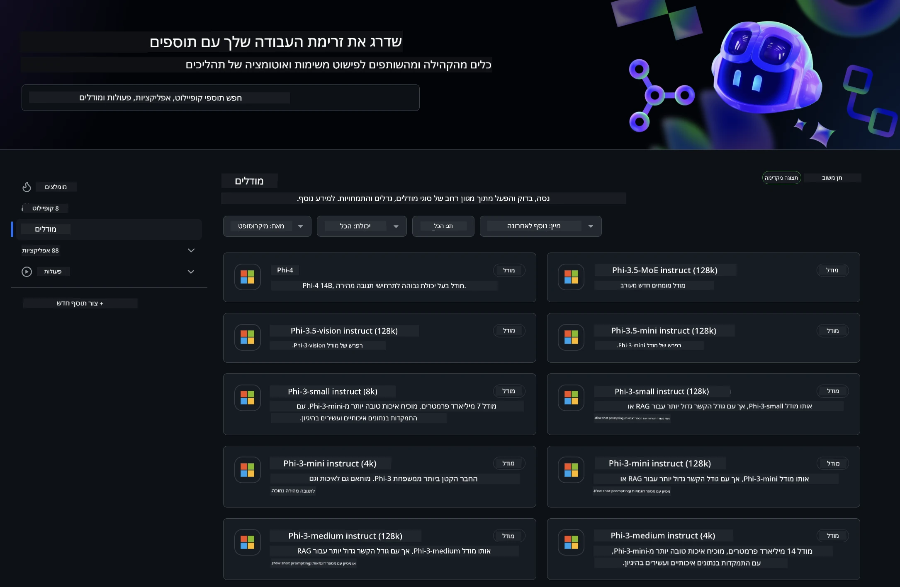
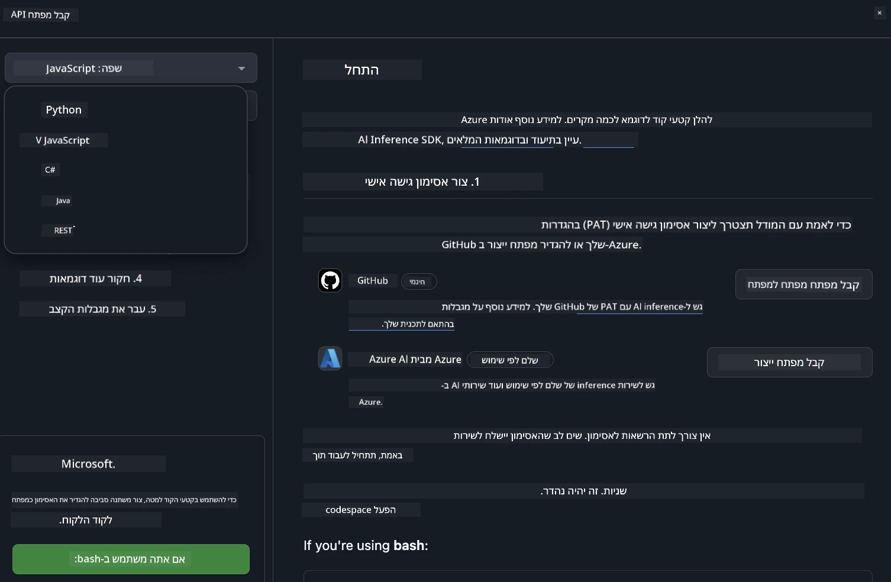
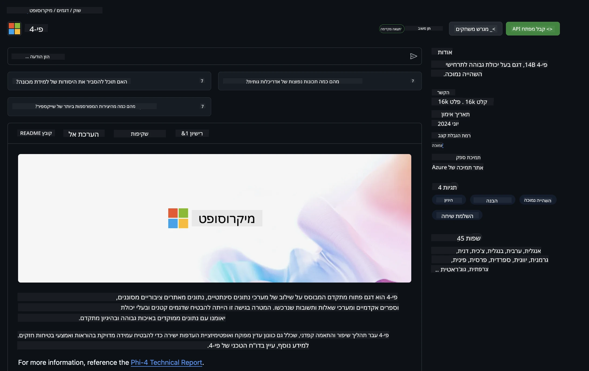

## GitHub Models - בטא ציבורית מוגבלת

ברוכים הבאים ל-[GitHub Models](https://github.com/marketplace/models)! הכל מוכן ומזומן בשבילכם לחקור דגמי AI המתארחים ב-Azure AI.



למידע נוסף על הדגמים הזמינים ב-GitHub Models, עיינו ב-[GitHub Model Marketplace](https://github.com/marketplace/models)

## דגמים זמינים

לכל דגם יש סביבת ניסוי ייעודית וקוד לדוגמה


### דגמי Phi-3 בקטלוג GitHub Model

[Phi-3-Medium-128k-Instruct](https://github.com/marketplace/models/azureml/Phi-3-medium-128k-instruct)

[Phi-3-medium-4k-instruct](https://github.com/marketplace/models/azureml/Phi-3-medium-4k-instruct)

[Phi-3-mini-128k-instruct](https://github.com/marketplace/models/azureml/Phi-3-mini-128k-instruct)

[Phi-3-mini-4k-instruct](https://github.com/marketplace/models/azureml/Phi-3-mini-4k-instruct)

[Phi-3-small-128k-instruct](https://github.com/marketplace/models/azureml/Phi-3-small-128k-instruct)

[Phi-3-small-8k-instruct](https://github.com/marketplace/models/azureml/Phi-3-small-8k-instruct)

## התחלה מהירה

יש כמה דוגמאות בסיסיות שמוכנות להרצה. תוכלו למצוא אותן בתיקיית הדוגמאות. אם תרצו לעבור ישר לשפת התכנות המועדפת עליכם, הדוגמאות זמינות בשפות הבאות:

- Python  
- JavaScript  
- cURL  

קיימת גם סביבת Codespaces ייעודית להרצת הדוגמאות והדגמים.



## קוד לדוגמה

להלן קטעי קוד לדוגמא למספר מקרים. למידע נוסף על Azure AI Inference SDK, ראו את התיעוד המלא והדוגמאות.

## הגדרה

1. צרו Personal Access Token  
אין צורך להעניק הרשאות לטוקן. שימו לב שהטוקן יישלח לשירות של מיקרוסופט.

כדי להשתמש בקטעי הקוד למטה, הגדירו משתנה סביבה עם הטוקן שלכם כמפתח עבור קוד הלקוח.

אם אתם משתמשים ב-bash:  
```
export GITHUB_TOKEN="<your-github-token-goes-here>"
```  
אם אתם ב-powershell:  

```
$Env:GITHUB_TOKEN="<your-github-token-goes-here>"
```  

אם אתם ב-Windows command prompt:  

```
set GITHUB_TOKEN=<your-github-token-goes-here>
```  

## דוגמת Python

### התקנת תלותים  
התקינו את Azure AI Inference SDK באמצעות pip (דורש: Python >=3.8):

```
pip install azure-ai-inference
```  
### הרצת דוגמה בסיסית

דוגמה זו מדגימה קריאה בסיסית ל-API של השלמת שיחה. היא משתמשת בנקודת הקצה של דגם ה-AI של GitHub ובטוקן שלכם. הקריאה היא סינכרונית.

```
import os
from azure.ai.inference import ChatCompletionsClient
from azure.ai.inference.models import SystemMessage, UserMessage
from azure.core.credentials import AzureKeyCredential

endpoint = "https://models.inference.ai.azure.com"
# Replace Model_Name 
model_name = "Phi-3-small-8k-instruct"
token = os.environ["GITHUB_TOKEN"]

client = ChatCompletionsClient(
    endpoint=endpoint,
    credential=AzureKeyCredential(token),
)

response = client.complete(
    messages=[
        SystemMessage(content="You are a helpful assistant."),
        UserMessage(content="What is the capital of France?"),
    ],
    model=model_name,
    temperature=1.,
    max_tokens=1000,
    top_p=1.
)

print(response.choices[0].message.content)
```

### הרצת שיחה מרובת סבבים

דוגמה זו מדגימה שיחה מרובת סבבים עם API השלמת השיחה. כשמשתמשים בדגם ליישום שיחה, יש לנהל את היסטוריית השיחה ולשלוח את ההודעות האחרונות לדגם.

```
import os
from azure.ai.inference import ChatCompletionsClient
from azure.ai.inference.models import AssistantMessage, SystemMessage, UserMessage
from azure.core.credentials import AzureKeyCredential

token = os.environ["GITHUB_TOKEN"]
endpoint = "https://models.inference.ai.azure.com"
# Replace Model_Name
model_name = "Phi-3-small-8k-instruct"

client = ChatCompletionsClient(
    endpoint=endpoint,
    credential=AzureKeyCredential(token),
)

messages = [
    SystemMessage(content="You are a helpful assistant."),
    UserMessage(content="What is the capital of France?"),
    AssistantMessage(content="The capital of France is Paris."),
    UserMessage(content="What about Spain?"),
]

response = client.complete(messages=messages, model=model_name)

print(response.choices[0].message.content)
```

### זרימת הפלט

לשיפור חוויית המשתמש, רצוי להזרים את תגובת הדגם כך שהטוקן הראשון יופיע מוקדם ולא תצטרכו להמתין לתגובות ארוכות.

```
import os
from azure.ai.inference import ChatCompletionsClient
from azure.ai.inference.models import SystemMessage, UserMessage
from azure.core.credentials import AzureKeyCredential

token = os.environ["GITHUB_TOKEN"]
endpoint = "https://models.inference.ai.azure.com"
# Replace Model_Name
model_name = "Phi-3-small-8k-instruct"

client = ChatCompletionsClient(
    endpoint=endpoint,
    credential=AzureKeyCredential(token),
)

response = client.complete(
    stream=True,
    messages=[
        SystemMessage(content="You are a helpful assistant."),
        UserMessage(content="Give me 5 good reasons why I should exercise every day."),
    ],
    model=model_name,
)

for update in response:
    if update.choices:
        print(update.choices[0].delta.content or "", end="")

client.close()
```  
## JavaScript

### התקנת תלותים

התקינו Node.js.

העתיקו את השורות הבאות ושמרו אותן כקובץ package.json בתוך התיקייה שלכם.

```
{
  "type": "module",
  "dependencies": {
    "@azure-rest/ai-inference": "latest",
    "@azure/core-auth": "latest",
    "@azure/core-sse": "latest"
  }
}
```

הערה: @azure/core-sse נדרש רק כאשר מזרים את תגובת השלמת השיחה.

פתחו חלון טרמינל בתיקייה זו והריצו npm install.

לכל אחד מקטעי הקוד למטה, העתיקו את התוכן לקובץ sample.js והריצו עם node sample.js.

### הרצת דוגמה בסיסית

דוגמה זו מדגימה קריאה בסיסית ל-API השלמת שיחה. היא משתמשת בנקודת הקצה של דגם ה-AI של GitHub ובטוקן שלכם. הקריאה היא סינכרונית.

```
import ModelClient from "@azure-rest/ai-inference";
import { AzureKeyCredential } from "@azure/core-auth";

const token = process.env["GITHUB_TOKEN"];
const endpoint = "https://models.inference.ai.azure.com";
// Update your modelname
const modelName = "Phi-3-small-8k-instruct";

export async function main() {

  const client = new ModelClient(endpoint, new AzureKeyCredential(token));

  const response = await client.path("/chat/completions").post({
    body: {
      messages: [
        { role:"system", content: "You are a helpful assistant." },
        { role:"user", content: "What is the capital of France?" }
      ],
      model: modelName,
      temperature: 1.,
      max_tokens: 1000,
      top_p: 1.
    }
  });

  if (response.status !== "200") {
    throw response.body.error;
  }
  console.log(response.body.choices[0].message.content);
}

main().catch((err) => {
  console.error("The sample encountered an error:", err);
});
```

### הרצת שיחה מרובת סבבים

דוגמה זו מדגימה שיחה מרובת סבבים עם API השלמת השיחה. כשמשתמשים בדגם ליישום שיחה, יש לנהל את היסטוריית השיחה ולשלוח את ההודעות האחרונות לדגם.

```
import ModelClient from "@azure-rest/ai-inference";
import { AzureKeyCredential } from "@azure/core-auth";

const token = process.env["GITHUB_TOKEN"];
const endpoint = "https://models.inference.ai.azure.com";
// Update your modelname
const modelName = "Phi-3-small-8k-instruct";

export async function main() {

  const client = new ModelClient(endpoint, new AzureKeyCredential(token));

  const response = await client.path("/chat/completions").post({
    body: {
      messages: [
        { role: "system", content: "You are a helpful assistant." },
        { role: "user", content: "What is the capital of France?" },
        { role: "assistant", content: "The capital of France is Paris." },
        { role: "user", content: "What about Spain?" },
      ],
      model: modelName,
    }
  });

  if (response.status !== "200") {
    throw response.body.error;
  }

  for (const choice of response.body.choices) {
    console.log(choice.message.content);
  }
}

main().catch((err) => {
  console.error("The sample encountered an error:", err);
});
```

### זרימת הפלט  
לשיפור חוויית המשתמש, רצוי להזרים את תגובת הדגם כך שהטוקן הראשון יופיע מוקדם ולא תצטרכו להמתין לתגובות ארוכות.

```
import ModelClient from "@azure-rest/ai-inference";
import { AzureKeyCredential } from "@azure/core-auth";
import { createSseStream } from "@azure/core-sse";

const token = process.env["GITHUB_TOKEN"];
const endpoint = "https://models.inference.ai.azure.com";
// Update your modelname
const modelName = "Phi-3-small-8k-instruct";

export async function main() {

  const client = new ModelClient(endpoint, new AzureKeyCredential(token));

  const response = await client.path("/chat/completions").post({
    body: {
      messages: [
        { role: "system", content: "You are a helpful assistant." },
        { role: "user", content: "Give me 5 good reasons why I should exercise every day." },
      ],
      model: modelName,
      stream: true
    }
  }).asNodeStream();

  const stream = response.body;
  if (!stream) {
    throw new Error("The response stream is undefined");
  }

  if (response.status !== "200") {
    stream.destroy();
    throw new Error(`Failed to get chat completions, http operation failed with ${response.status} code`);
  }

  const sseStream = createSseStream(stream);

  for await (const event of sseStream) {
    if (event.data === "[DONE]") {
      return;
    }
    for (const choice of (JSON.parse(event.data)).choices) {
        process.stdout.write(choice.delta?.content ?? ``);
    }
  }
}

main().catch((err) => {
  console.error("The sample encountered an error:", err);
});
```

## REST

### הרצת דוגמה בסיסית

הדביקו את הפקודות הבאות ב-shell:

```
curl -X POST "https://models.inference.ai.azure.com/chat/completions" \
    -H "Content-Type: application/json" \
    -H "Authorization: Bearer $GITHUB_TOKEN" \
    -d '{
        "messages": [
            {
                "role": "system",
                "content": "You are a helpful assistant."
            },
            {
                "role": "user",
                "content": "What is the capital of France?"
            }
        ],
        "model": "Phi-3-small-8k-instruct"
    }'
```  
### הרצת שיחה מרובת סבבים

קראו ל-API השלמת השיחה ושלחו את היסטוריית השיחה:

```
curl -X POST "https://models.inference.ai.azure.com/chat/completions" \
    -H "Content-Type: application/json" \
    -H "Authorization: Bearer $GITHUB_TOKEN" \
    -d '{
        "messages": [
            {
                "role": "system",
                "content": "You are a helpful assistant."
            },
            {
                "role": "user",
                "content": "What is the capital of France?"
            },
            {
                "role": "assistant",
                "content": "The capital of France is Paris."
            },
            {
                "role": "user",
                "content": "What about Spain?"
            }
        ],
        "model": "Phi-3-small-8k-instruct"
    }'
```  
### זרימת הפלט

זוהי דוגמה לקריאה לנקודת הקצה וזרימת התגובה.

```
curl -X POST "https://models.inference.ai.azure.com/chat/completions" \
    -H "Content-Type: application/json" \
    -H "Authorization: Bearer $GITHUB_TOKEN" \
    -d '{
        "messages": [
            {
                "role": "system",
                "content": "You are a helpful assistant."
            },
            {
                "role": "user",
                "content": "Give me 5 good reasons why I should exercise every day."
            }
        ],
        "stream": true,
        "model": "Phi-3-small-8k-instruct"
    }'
```

## שימוש חינמי ומגבלות קצב עבור GitHub Models



[מגבלות הקצב עבור סביבת הניסוי והשימוש החינמי ב-API](https://docs.github.com/en/github-models/prototyping-with-ai-models#rate-limits) נועדו לאפשר לכם להתנסות בדגמים ולפתח אב-טיפוס של יישום ה-AI שלכם. לשימוש מעבר למגבלות אלו, ולהרחבת היישום בקנה מידה, יש לספק משאבים מחשבון Azure ולאמת דרכו במקום להשתמש ב-Personal Access Token של GitHub. אין צורך לשנות דבר בקוד שלכם. השתמשו בקישור זה כדי ללמוד כיצד לעבור את מגבלות השכבה החינמית ב-Azure AI.

### גילויים

זכרו שכאשר אתם מתקשרים עם דגם, אתם מתנסים ב-AI ולכן ייתכנו טעויות בתוכן.

התכונה כפופה למגבלות שונות (כולל בקשות לדקה, בקשות ליום, טוקנים לבקשה ובקשות מקבילות) ואינה מיועדת לשימושים פרודקשן.

GitHub Models משתמש ב-Azure AI Content Safety. מסננים אלו אינם ניתנים לכיבוי כחלק מחוויית GitHub Models. אם תבחרו להשתמש בדגמים דרך שירות בתשלום, אנא הגדירו את מסנני התוכן בהתאם לצרכים שלכם.

שירות זה כפוף לתנאי Pre-release של GitHub.

**כתב ויתור**:  
מסמך זה תורגם באמצעות שירות תרגום מבוסס בינה מלאכותית [Co-op Translator](https://github.com/Azure/co-op-translator). למרות שאנו שואפים לדיוק, יש לקחת בחשבון כי תרגומים אוטומטיים עלולים להכיל שגיאות או אי-דיוקים. המסמך המקורי בשפת המקור שלו נחשב למקור הסמכותי. למידע קריטי מומלץ להשתמש בתרגום מקצועי על ידי מתרגם אנושי. אנו לא נושאים באחריות לכל אי-הבנה או פרשנות שגויה הנובעת משימוש בתרגום זה.