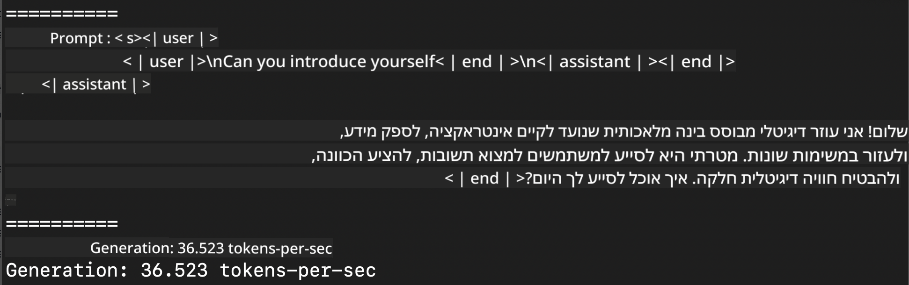
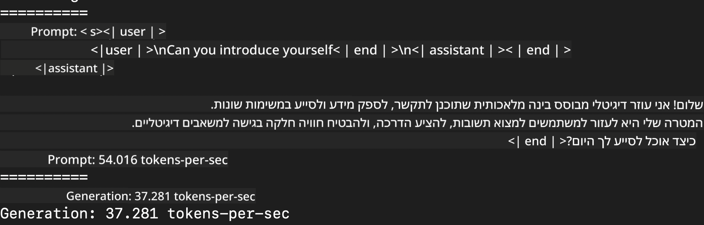
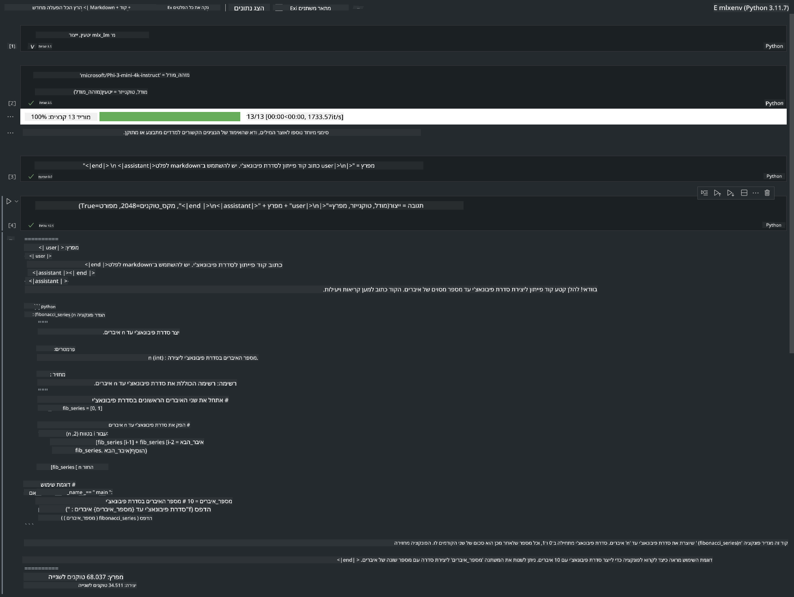

<!--
CO_OP_TRANSLATOR_METADATA:
{
  "original_hash": "dcb656f3d206fc4968e236deec5d4384",
  "translation_date": "2025-05-09T22:32:33+00:00",
  "source_file": "md/03.FineTuning/03.Inference/MLX_Inference.md",
  "language_code": "he"
}
-->
# **הסקת Phi-3 עם מסגרת Apple MLX**

## **מהי מסגרת MLX**

MLX היא מסגרת מערכים למחקר למידת מכונה על שבבי Apple, מבית מחקר למידת המכונה של Apple.

MLX עוצבה על ידי חוקרי למידת מכונה עבור חוקרי למידת מכונה. המסגרת מיועדת להיות ידידותית למשתמש, אך עדיין יעילה לאימון והפעלת מודלים. העיצוב של המסגרת עצמו גם פשוט מבחינה רעיונית. אנו שואפים להקל על החוקרים להרחיב ולשפר את MLX במטרה לחקור רעיונות חדשים במהירות.

ניתן להאיץ מודלים גדולים (LLMs) במכשירי Apple Silicon באמצעות MLX, והמודלים יכולים לפעול מקומית בנוחות רבה.

## **שימוש ב-MLX להסקת Phi-3-mini**

### **1. הגדרת סביבת MLX שלך**

1. Python 3.11.x  
2. התקנת ספריית MLX  


```bash

pip install mlx-lm

```

### **2. הפעלת Phi-3-mini בטרמינל עם MLX**


```bash

python -m mlx_lm.generate --model microsoft/Phi-3-mini-4k-instruct --max-token 2048 --prompt  "<|user|>\nCan you introduce yourself<|end|>\n<|assistant|>"

```

התוצאה (הסביבה שלי היא Apple M1 Max, 64GB) היא



### **3. כימות Phi-3-mini עם MLX בטרמינל**


```bash

python -m mlx_lm.convert --hf-path microsoft/Phi-3-mini-4k-instruct

```

***הערה:*** ניתן לכמת את המודל דרך mlx_lm.convert, וכימות ברירת המחדל הוא INT4. בדוגמה זו מכמתים את Phi-3-mini ל-INT4.

ניתן לכמת את המודל דרך mlx_lm.convert, וכימות ברירת המחדל הוא INT4. בדוגמה זו מכמתים את Phi-3-mini ל-INT4. לאחר הכימות, הוא יישמר בתיקיית ברירת המחדל ./mlx_model

ניתן לבדוק את המודל המכוים עם MLX מתוך הטרמינל


```bash

python -m mlx_lm.generate --model ./mlx_model/ --max-token 2048 --prompt  "<|user|>\nCan you introduce yourself<|end|>\n<|assistant|>"

```

התוצאה היא




### **4. הפעלת Phi-3-mini עם MLX ב-Jupyter Notebook**




***הערה:*** אנא קראו את הדוגמה הזו [לחצו כאן](../../../../../code/03.Inference/MLX/MLX_DEMO.ipynb)


## **משאבים**

1. למידה על מסגרת Apple MLX [https://ml-explore.github.io](https://ml-explore.github.io/mlx/build/html/index.html)

2. מאגר GitHub של Apple MLX [https://github.com/ml-explore](https://github.com/ml-explore)

**כתב ויתור**:  
מסמך זה תורגם באמצעות שירות תרגום מבוסס בינה מלאכותית [Co-op Translator](https://github.com/Azure/co-op-translator). למרות שאנו שואפים לדיוק, יש לקחת בחשבון כי תרגומים אוטומטיים עלולים להכיל שגיאות או אי-דיוקים. המסמך המקורי בשפת המקור שלו הוא המקור הסמכותי. למידע קריטי מומלץ להשתמש בתרגום מקצועי אנושי. אנו לא נושאים באחריות לכל אי-הבנות או פרשנויות שגויות הנובעות משימוש בתרגום זה.