<!--
CO_OP_TRANSLATOR_METADATA:
{
  "original_hash": "c1559c5af6caccf6f623fd43a6b3a9a3",
  "translation_date": "2025-07-17T06:08:48+00:00",
  "source_file": "md/03.FineTuning/FineTuning_AIFoundry.md",
  "language_code": "he"
}
-->
# כיוונון עדין של Phi-3 עם Azure AI Foundry

בואו נחקור כיצד לכוונן עדין את מודל השפה Phi-3 Mini של מיקרוסופט באמצעות Azure AI Foundry. כיוונון עדין מאפשר להתאים את Phi-3 Mini למשימות ספציפיות, מה שהופך אותו לעוצמתי ומודע להקשר בצורה טובה יותר.

## שיקולים

- **יכולות:** אילו מודלים ניתנים לכיוונון עדין? מה ניתן להשיג באמצעות כיוונון המודל הבסיסי?
- **עלות:** מהו מודל התמחור עבור כיוונון עדין?
- **התאמה אישית:** עד כמה ניתן לשנות את המודל הבסיסי – ובאילו דרכים?
- **נוחות:** כיצד מתבצע הכיוונון בפועל – האם יש צורך לכתוב קוד מותאם? האם יש צורך לספק משאבי חישוב משלך?
- **בטיחות:** ידוע כי למודלים מכווננים יש סיכוני בטיחות – האם קיימים אמצעי הגנה למניעת נזק לא מכוון?

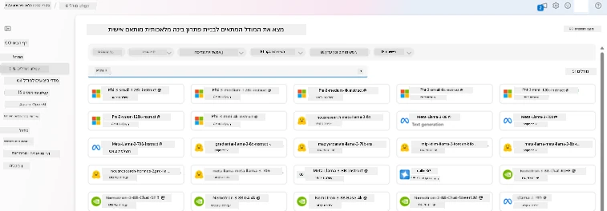

## הכנה לכיוונון עדין

### דרישות מוקדמות

> [!NOTE]
> עבור משפחת מודלי Phi-3, הצעת כיוונון עדין במודל pay-as-you-go זמינה רק עם hubs שנוצרו באזורים **East US 2**.

- מנוי Azure. אם אין לך מנוי Azure, צור [חשבון Azure בתשלום](https://azure.microsoft.com/pricing/purchase-options/pay-as-you-go) כדי להתחיל.

- פרויקט [AI Foundry](https://ai.azure.com?WT.mc_id=aiml-138114-kinfeylo).
- בקרות גישה מבוססות תפקידים של Azure (Azure RBAC) משמשות למתן גישה לפעולות ב-Azure AI Foundry. כדי לבצע את השלבים במאמר זה, חשבון המשתמש שלך חייב להיות מוקצה לתפקיד __Azure AI Developer__ בקבוצת המשאבים.

### רישום ספק מנוי

וודא שהמנוי רשום לספק המשאבים `Microsoft.Network`.

1. היכנס ל-[פורטל Azure](https://portal.azure.com).
1. בחר **Subscriptions** בתפריט השמאלי.
1. בחר את המנוי שברצונך להשתמש בו.
1. בחר **AI project settings** > **Resource providers** בתפריט השמאלי.
1. ודא ש-**Microsoft.Network** מופיע ברשימת ספקי המשאבים. אם לא, הוסף אותו.

### הכנת נתונים

הכן את נתוני האימון והאימות שלך כדי לכוונן את המודל. מערכי הנתונים שלך צריכים לכלול דוגמאות קלט ופלט שמדגימות כיצד תרצה שהמודל יתפקד.

ודא שכל דוגמאות האימון שלך עומדות בפורמט הצפוי עבור אינפרנס. כדי לכוונן מודלים בצורה יעילה, חשוב לשמור על מאגר נתונים מאוזן ומגוון.

זה כולל שמירה על איזון בנתונים, הכללת תרחישים שונים, ועדכון תקופתי של נתוני האימון כדי להתאים לציפיות מהעולם האמיתי, מה שמוביל לתגובות מדויקות ומאוזנות יותר של המודל.

סוגי מודלים שונים דורשים פורמטים שונים של נתוני אימון.

### השלמת שיחה

נתוני האימון והאימות שבהם תשתמש **חייבים** להיות בפורמט JSON Lines (JSONL). עבור `Phi-3-mini-128k-instruct` מערך הנתונים לכיוונון עדין חייב להיות בפורמט שיחה המשמש את ממשק ה-API של השלמות שיחה.

### דוגמת פורמט קובץ

```json
    {"messages": [{"role": "system", "content": "You are an Xbox customer support agent whose primary goal is to help users with issues they are experiencing with their Xbox devices. You are friendly and concise. You only provide factual answers to queries, and do not provide answers that are not related to Xbox."}, {"role": "user", "content": "Is Xbox better than PlayStation?"}, {"role": "assistant", "content": "I apologize, but I cannot provide personal opinions. My primary job is to assist you with any issues related to your Xbox device. Do you have any Xbox-related issues that need addressing?"}]}
    {"messages": [{"role": "system", "content": "You are an Xbox customer support agent whose primary goal is to help users with issues they are experiencing with their Xbox devices. You are friendly and concise. You only provide factual answers to queries, and do not provide answers that are not related to Xbox."}, {"role": "user", "content": "Can I play PC games on my Xbox?"}, {"role": "assistant", "content": "While Xbox consoles don't natively support PC games, they can play an array of Xbox games, many of which are also available on PC. Can I assist you with finding games compatible with your Xbox device?"}]}
    {"messages": [{"role": "system", "content": "You are an Xbox customer support agent whose primary goal is to help users with issues they are experiencing with their Xbox devices. You are friendly and concise. You only provide factual answers to queries, and do not provide answers that are not related to Xbox."}, {"role": "user", "content": "I'm having trouble connecting my Xbox to the Wi-Fi."}, {"role": "assistant", "content": "No worries, let's go through the network settings on your Xbox. Can you please tell me what happens when you try to connect it to the Wi-Fi?"}]}
```

סוג הקובץ הנתמך הוא JSON Lines. הקבצים מועלים למאגר הנתונים ברירת המחדל וזמינים בפרויקט שלך.

## כיוונון עדין של Phi-3 עם Azure AI Foundry

Azure AI Foundry מאפשרת לך להתאים מודלים גדולים של שפה למאגרי הנתונים האישיים שלך באמצעות תהליך שנקרא כיוונון עדין. כיוונון עדין מספק ערך משמעותי על ידי התאמה אישית ואופטימיזציה למשימות ויישומים ספציפיים. זה מוביל לשיפור בביצועים, יעילות עלות, הפחתת השהייה ותוצאות מותאמות.

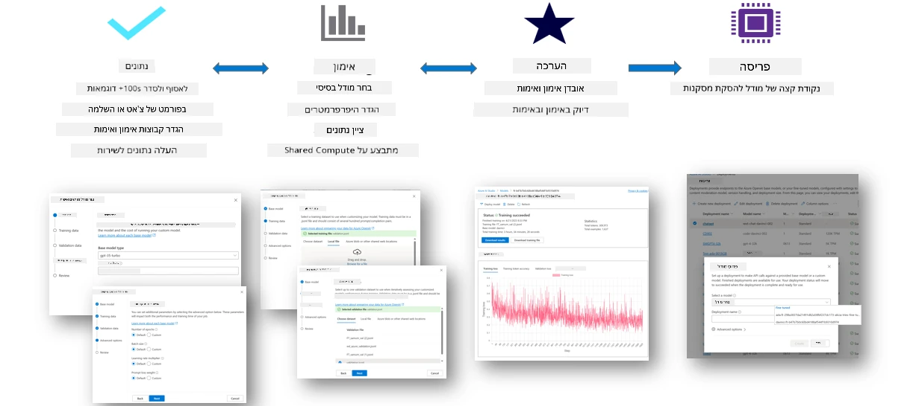

### יצירת פרויקט חדש

1. היכנס ל-[Azure AI Foundry](https://ai.azure.com).

1. בחר **+New project** כדי ליצור פרויקט חדש ב-Azure AI Foundry.

    

1. בצע את המשימות הבאות:

    - שם ה-**Hub** של הפרויקט. חייב להיות ערך ייחודי.
    - בחר את ה-**Hub** לשימוש (צור חדש במידת הצורך).

    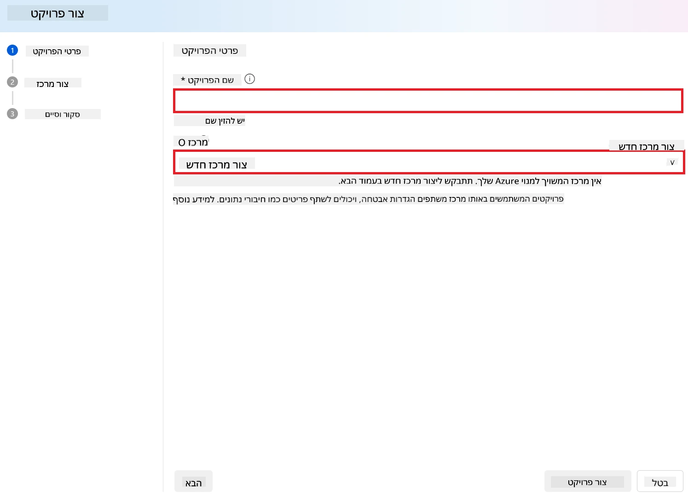

1. בצע את המשימות הבאות ליצירת hub חדש:

    - הזן **שם ה-Hub**. חייב להיות ערך ייחודי.
    - בחר את **המנוי** שלך ב-Azure.
    - בחר את **קבוצת המשאבים** לשימוש (צור חדשה במידת הצורך).
    - בחר את **המיקום** שבו תרצה להשתמש.
    - בחר את **חיבור לשירותי Azure AI** לשימוש (צור חדש במידת הצורך).
    - בחר **חיבור ל-Azure AI Search** כדי **דלג על החיבור**.

    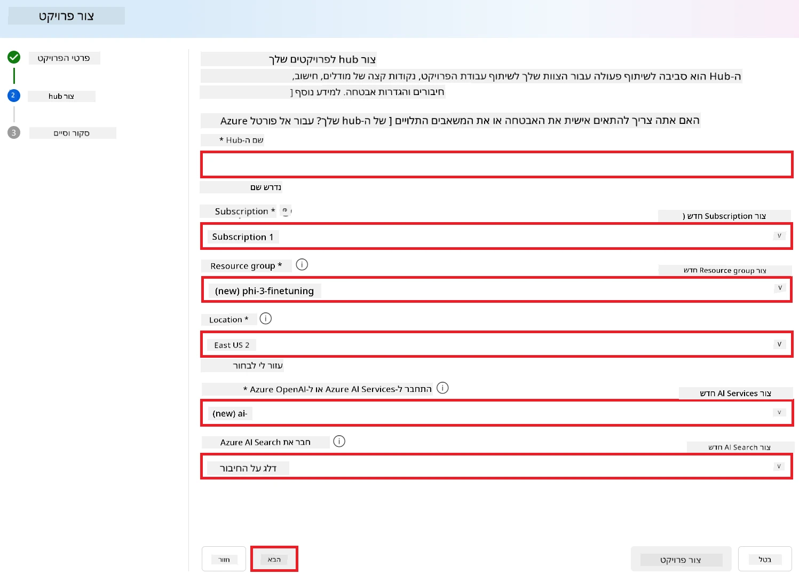

1. בחר **Next**.
1. בחר **Create a project**.

### הכנת נתונים

לפני הכיוונון, אסוף או צור מאגר נתונים רלוונטי למשימה שלך, כגון הוראות שיחה, זוגות שאלות-תשובות או כל טקסט רלוונטי אחר. נקה ועבד את הנתונים על ידי הסרת רעשים, טיפול בערכים חסרים, וטוקניזציה של הטקסט.

### כיוונון עדין של מודלי Phi-3 ב-Azure AI Foundry

> [!NOTE]
> כיוונון עדין של מודלי Phi-3 נתמך כרגע בפרויקטים הממוקמים ב-East US 2.

1. בחר **Model catalog** מהטאב בצד שמאל.

1. הקלד *phi-3* ב**סרגל החיפוש** ובחר את מודל phi-3 שברצונך להשתמש בו.

    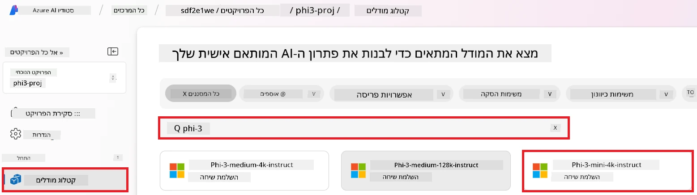

1. בחר **Fine-tune**.

    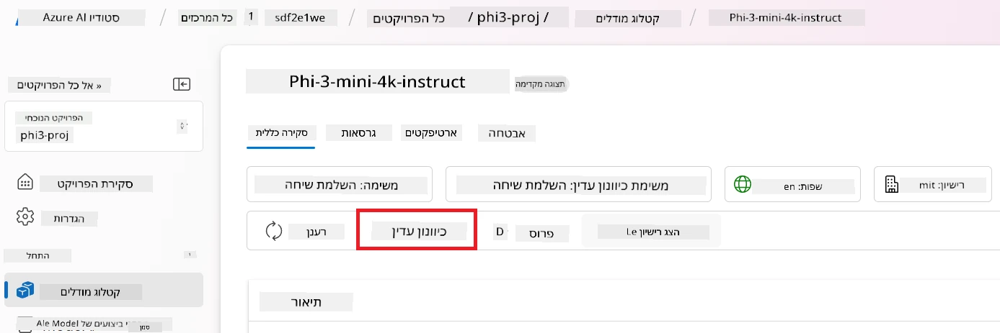

1. הזן את **שם המודל המכוונן**.

    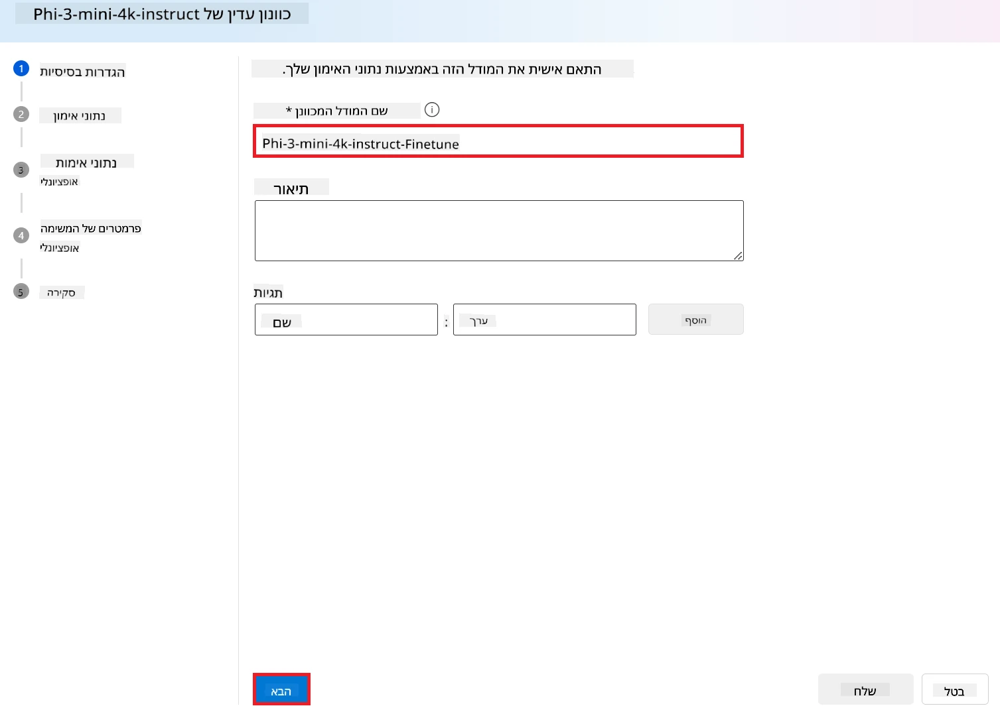

1. בחר **Next**.

1. בצע את המשימות הבאות:

    - בחר את **סוג המשימה** ל-**Chat completion**.
    - בחר את **נתוני האימון** שברצונך להשתמש בהם. ניתן להעלות אותם דרך Azure AI Foundry או מהסביבה המקומית שלך.

    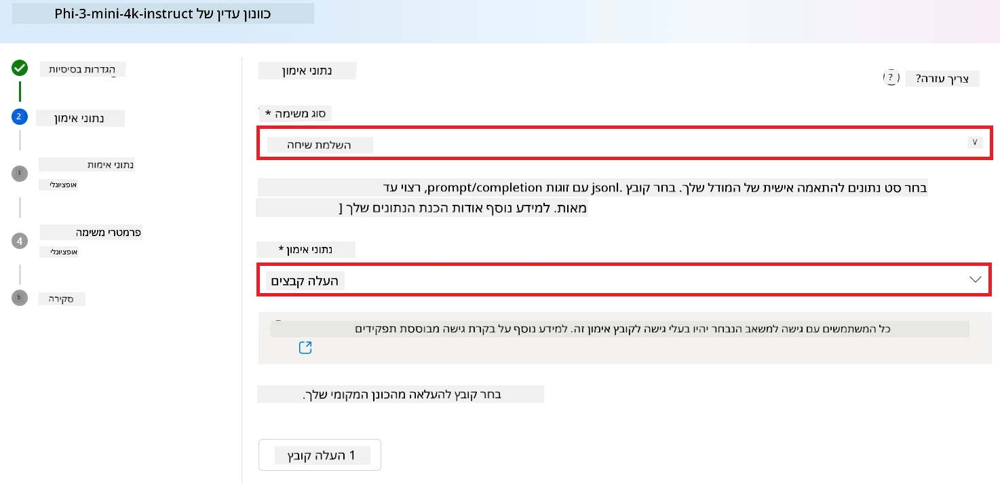

1. בחר **Next**.

1. העלה את **נתוני האימות** שברצונך להשתמש בהם, או בחר ב**חלוקה אוטומטית של נתוני האימון**.

    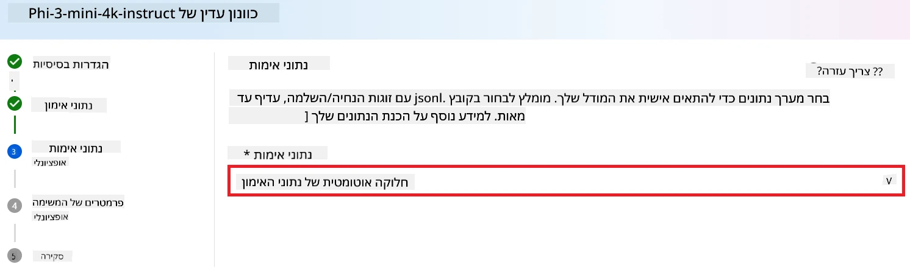

1. בחר **Next**.

1. בצע את המשימות הבאות:

    - בחר את **מכפיל גודל האצווה** שברצונך להשתמש בו.
    - בחר את **קצב הלמידה** שברצונך להשתמש בו.
    - בחר את **מספר האפוקים** שברצונך להשתמש בהם.

    

1. בחר **Submit** כדי להתחיל את תהליך הכיוונון.

    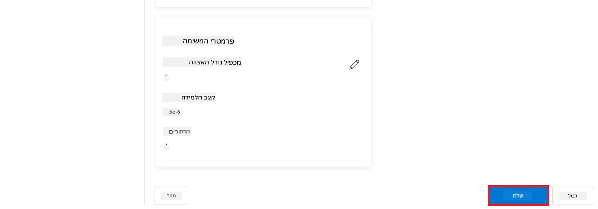

1. לאחר שהמודל שלך מכוונן, הסטטוס יוצג כ-**Completed**, כפי שמוצג בתמונה למטה. כעת תוכל לפרוס את המודל ולהשתמש בו באפליקציה שלך, ב-playground או ב-prompt flow. למידע נוסף, ראה [כיצד לפרוס משפחת מודלי שפה קטנים Phi-3 עם Azure AI Foundry](https://learn.microsoft.com/azure/ai-studio/how-to/deploy-models-phi-3?tabs=phi-3-5&pivots=programming-language-python).

    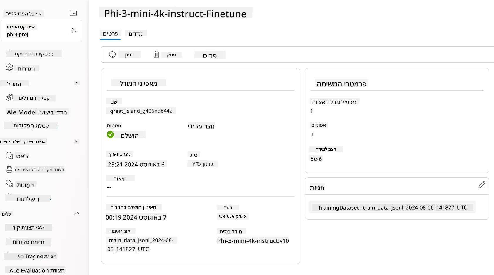

> [!NOTE]
> למידע מפורט יותר על כיוונון עדין של Phi-3, בקר ב-[Fine-tune Phi-3 models in Azure AI Foundry](https://learn.microsoft.com/azure/ai-studio/how-to/fine-tune-phi-3?tabs=phi-3-mini).

## ניקוי מודלים מכווננים

ניתן למחוק מודל מכוונן מרשימת המודלים בכיוונון עדין ב-[Azure AI Foundry](https://ai.azure.com) או מדף פרטי המודל. בחר את המודל המכוין למחיקה בדף הכיוונון, ואז בחר בלחצן Delete כדי למחוק את המודל.

> [!NOTE]
> לא ניתן למחוק מודל מותאם אישית אם יש לו פריסה קיימת. יש למחוק קודם את פריסת המודל לפני שניתן למחוק את המודל המותאם.

## עלויות ומכסים

### שיקולי עלות ומכסה עבור מודלי Phi-3 מכווננים כשירות

מודלי Phi מכווננים כשירות מוצעים על ידי מיקרוסופט ומשולבים עם Azure AI Foundry לשימוש. ניתן למצוא את התמחור בעת [פריסה](https://learn.microsoft.com/azure/ai-studio/how-to/deploy-models-phi-3?tabs=phi-3-5&pivots=programming-language-python) או כיוונון המודלים תחת לשונית התמחור והתנאים במדריך הפריסה.

## סינון תוכן

מודלים המופעלים כשירות במודל pay-as-you-go מוגנים על ידי Azure AI Content Safety. כאשר הם מופעלים בנקודות קצה בזמן אמת, ניתן לבחור לא להשתמש ביכולת זו. עם Azure AI Content Safety מופעל, גם ההנחיה וגם התוצאה עוברים דרך מערך של מודלי סיווג שמטרתם לזהות ולמנוע הפקת תוכן מזיק. מערכת סינון התוכן מזהה ופועלת על קטגוריות ספציפיות של תוכן פוטנציאלית מזיק הן בהנחיות הקלט והן בתוצאות הפלט. למידע נוסף על [Azure AI Content Safety](https://learn.microsoft.com/azure/ai-studio/concepts/content-filtering).

**הגדרות כיוונון עדין**

היפרפרמטרים: הגדר היפרפרמטרים כגון קצב למידה, גודל אצווה ומספר אפוקים.

**פונקציית אובדן**

בחר פונקציית אובדן מתאימה למשימה שלך (למשל, cross-entropy).

**אופטימייזר**

בחר אופטימייזר (למשל, Adam) לעדכוני גרדיאנט במהלך האימון.

**תהליך הכיוונון**

- טעינת מודל מאומן מראש: טען את נקודת הבדיקה של Phi-3 Mini.
- הוספת שכבות מותאמות: הוסף שכבות ספציפיות למשימה (למשל, ראש סיווג להוראות שיחה).

**אימון המודל**  
כוונן את המודל באמצעות מאגר הנתונים שהכנת. עקוב אחר התקדמות האימון והתאם היפרפרמטרים לפי הצורך.

**הערכה ואימות**

מערך אימות: חלק את הנתונים למערכי אימון ואימות.

**הערכת ביצועים**

השתמש במדדים כמו דיוק, F1-score או perplexity להערכת ביצועי המודל.

## שמירת המודל המכוון

**נקודת בדיקה**  
שמור את נקודת הבדיקה של המודל המכוון לשימוש עתידי.

## פריסה

- פרוס כשירות רשת: פרוס את המודל המכוון כשירות רשת ב-Azure AI Foundry.
- בדוק את נקודת הקצה: שלח שאילתות בדיקה לנקודת הקצה שהופעלה כדי לוודא את תפקודה.

## חזרה ושיפור

חזור על התהליך: אם הביצועים אינם מספקים, חזור על התהליך על ידי התאמת היפרפרמטרים, הוספת נתונים נוספים או כיוונון לאפוקים נוספים.

## ניטור ושיפור

עקוב באופן רציף אחר התנהגות המודל ושפר אותו לפי הצורך.

## התאמה והרחבה

משימות מותאמות: ניתן לכוונן את Phi-3 Mini למשימות שונות מעבר להוראות שיחה. חקור שימושים נוספים!  
ניסוי: נסה ארכיטקטורות שונות, שילובי שכבות וטכניקות לשיפור הביצועים.

> [!NOTE]
> כיוונון עדין הוא תהליך איטרטיבי. נסה, למד והתאם את המודל שלך כדי להשיג את התוצאות הטובות ביותר למשימה הספציפית שלך!

**כתב ויתור**:  
מסמך זה תורגם באמצעות שירות תרגום מבוסס בינה מלאכותית [Co-op Translator](https://github.com/Azure/co-op-translator). למרות שאנו שואפים לדיוק, יש לקחת בחשבון כי תרגומים אוטומטיים עלולים להכיל שגיאות או אי-דיוקים. המסמך המקורי בשפת המקור שלו נחשב למקור הסמכותי. למידע קריטי מומלץ להשתמש בתרגום מקצועי על ידי מתרגם אנושי. אנו לא נושאים באחריות לכל אי-הבנה או פרשנות שגויה הנובעת משימוש בתרגום זה.