<!--
CO_OP_TRANSLATOR_METADATA:
{
  "original_hash": "c1559c5af6caccf6f623fd43a6b3a9a3",
  "translation_date": "2025-05-09T20:33:45+00:00",
  "source_file": "md/03.FineTuning/FineTuning_AIFoundry.md",
  "language_code": "he"
}
-->
# כוונון מדויק של Phi-3 עם Azure AI Foundry

בואו נבדוק כיצד לכוונן במדויק את מודל השפה Phi-3 Mini של Microsoft באמצעות Azure AI Foundry. כוונון מדויק מאפשר להתאים את Phi-3 Mini למשימות ספציפיות, מה שהופך אותו לעוצמתי ומודע להקשר בצורה טובה יותר.

## שיקולים

- **יכולות:** אילו מודלים ניתנים לכוונון? מה ניתן להשיג באמצעות כוונון המודל הבסיסי?
- **עלות:** מהו מודל התמחור עבור כוונון מדויק?
- **התאמה אישית:** עד כמה ניתן לשנות את המודל הבסיסי – ובאילו דרכים?
- **נוחות:** כיצד מתבצע הכוונון בפועל – האם צריך לכתוב קוד מותאם? האם יש צורך במשאבי חישוב משלך?
- **בטיחות:** ידוע שכיוונון מדויק עלול לסכן בטיחות – האם קיימים אמצעי הגנה למניעת נזק בלתי מכוון?

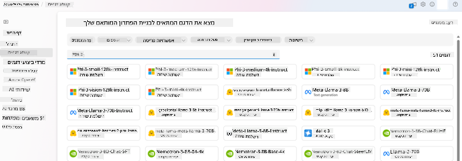

## הכנה לכוונון מדויק

### דרישות מוקדמות

> [!NOTE]
> עבור משפחת מודלים Phi-3, מודל התשלום לפי שימוש לכוונון מדויק זמין רק במרכזים שנוצרו באזור **East US 2**.

- מנוי Azure. אם אין לך מנוי Azure, צור [חשבון Azure בתשלום](https://azure.microsoft.com/pricing/purchase-options/pay-as-you-go) כדי להתחיל.

- פרויקט [AI Foundry](https://ai.azure.com?WT.mc_id=aiml-138114-kinfeylo).
- בקרות גישה מבוססות תפקידים ב-Azure (Azure RBAC) משמשות למתן גישה לפעולות ב-Azure AI Foundry. כדי לבצע את השלבים במאמר זה, חשבון המשתמש שלך חייב להיות משויך לתפקיד __Azure AI Developer__ בקבוצת המשאבים.

### רישום ספק מנוי

וודא שהמנוי רשום לספק המשאבים `Microsoft.Network`.

1. היכנס ל-[פורטל Azure](https://portal.azure.com).
1. בחר **Subscriptions** מהתפריט השמאלי.
1. בחר את המנוי שברצונך להשתמש בו.
1. בחר **AI project settings** > **Resource providers** מהתפריט השמאלי.
1. אשר ש-**Microsoft.Network** נמצא ברשימת ספקי המשאבים. אם לא, הוסף אותו.

### הכנת נתונים

הכן את נתוני האימון והאימות שלך לכוונון המודל. מערכי הנתונים שלך כוללים דוגמאות קלט ופלט שמדגימות כיצד תרצה שהמודל יתפקד.

ודא שכל דוגמאות האימון שלך עומדות בפורמט הצפוי לאינפרנס. כדי לכוונן מודלים ביעילות, חשוב לשמור על מאגר נתונים מאוזן ומגוון.

זה כולל שמירה על איזון הנתונים, הכללת תרחישים שונים, ועדכון תקופתי של נתוני האימון כך שיתאימו לציפיות מהעולם האמיתי, מה שמוביל לתגובות מדויקות ומאוזנות יותר של המודל.

סוגי מודלים שונים דורשים פורמטים שונים של נתוני אימון.

### השלמת שיחה

נתוני האימון והאימות שבהם אתה משתמש **חייבים** להיות בפורמט JSON Lines (JSONL). עבור `Phi-3-mini-128k-instruct`, מערך הנתונים לכוונון מדויק חייב להיות בפורמט שיחה שמשמש את ממשק ה-Chat completions API.

### פורמט קובץ לדוגמה

```json
    {"messages": [{"role": "system", "content": "You are an Xbox customer support agent whose primary goal is to help users with issues they are experiencing with their Xbox devices. You are friendly and concise. You only provide factual answers to queries, and do not provide answers that are not related to Xbox."}, {"role": "user", "content": "Is Xbox better than PlayStation?"}, {"role": "assistant", "content": "I apologize, but I cannot provide personal opinions. My primary job is to assist you with any issues related to your Xbox device. Do you have any Xbox-related issues that need addressing?"}]}
    {"messages": [{"role": "system", "content": "You are an Xbox customer support agent whose primary goal is to help users with issues they are experiencing with their Xbox devices. You are friendly and concise. You only provide factual answers to queries, and do not provide answers that are not related to Xbox."}, {"role": "user", "content": "Can I play PC games on my Xbox?"}, {"role": "assistant", "content": "While Xbox consoles don't natively support PC games, they can play an array of Xbox games, many of which are also available on PC. Can I assist you with finding games compatible with your Xbox device?"}]}
    {"messages": [{"role": "system", "content": "You are an Xbox customer support agent whose primary goal is to help users with issues they are experiencing with their Xbox devices. You are friendly and concise. You only provide factual answers to queries, and do not provide answers that are not related to Xbox."}, {"role": "user", "content": "I'm having trouble connecting my Xbox to the Wi-Fi."}, {"role": "assistant", "content": "No worries, let's go through the network settings on your Xbox. Can you please tell me what happens when you try to connect it to the Wi-Fi?"}]}
```

סוג הקובץ הנתמך הוא JSON Lines. הקבצים מועלים למאגר הנתונים ברירת המחדל וזמינים בפרויקט שלך.

## כוונון מדויק של Phi-3 עם Azure AI Foundry

Azure AI Foundry מאפשרת לך להתאים מודלים גדולים של שפה למאגרי הנתונים האישיים שלך באמצעות תהליך שנקרא כוונון מדויק. כוונון מדויק מספק ערך משמעותי על ידי אפשרות התאמה אישית ואופטימיזציה למשימות ויישומים ספציפיים. זה מוביל לשיפור בביצועים, יעילות בעלות, הפחתת זמן תגובה, ותוצאות מותאמות אישית.

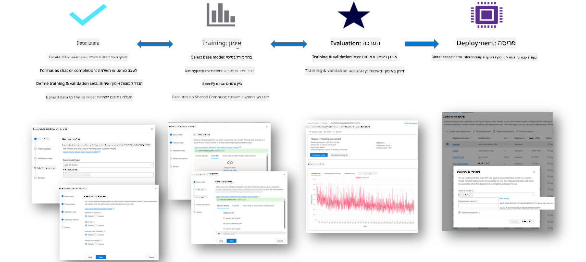

### יצירת פרויקט חדש

1. היכנס ל-[Azure AI Foundry](https://ai.azure.com).

1. בחר **+New project** ליצירת פרויקט חדש ב-Azure AI Foundry.

    

1. בצע את המשימות הבאות:

    - שם ה-**Hub** של הפרויקט. חייב להיות ערך ייחודי.
    - בחר את ה-**Hub** לשימוש (צור חדש במידת הצורך).

    

1. בצע את המשימות הבאות ליצירת Hub חדש:

    - הזן את שם ה-**Hub**. חייב להיות ערך ייחודי.
    - בחר את מנוי Azure שלך (**Subscription**).
    - בחר את קבוצת המשאבים (**Resource group**) לשימוש (צור חדשה במידת הצורך).
    - בחר את **Location** שבו תרצה להשתמש.
    - בחר את **Connect Azure AI Services** לשימוש (צור חדש במידת הצורך).
    - בחר **Connect Azure AI Search** ולאחר מכן בחר **Skip connecting**.

    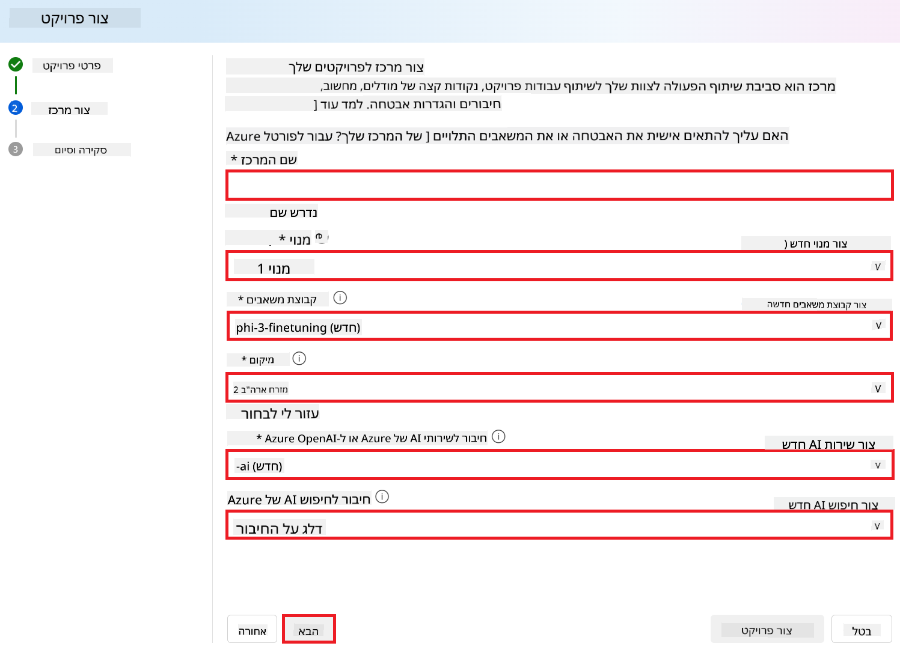

1. בחר **Next**.
1. בחר **Create a project**.

### הכנת נתונים

לפני הכוונון, אסוף או צור מערך נתונים רלוונטי למשימה שלך, כמו הוראות שיחה, זוגות שאלה-תשובה או כל טקסט רלוונטי אחר. נקה ועבד מראש את הנתונים על ידי הסרת רעשים, טיפול בערכים חסרים, וחלוקת הטקסט לטוקנים.

### כוונון מדויק של מודלי Phi-3 ב-Azure AI Foundry

> [!NOTE]
> כוונון מדויק של מודלי Phi-3 נתמך כרגע בפרויקטים הממוקמים באזור East US 2.

1. בחר **Model catalog** מהטאב בצד שמאל.

1. הקלד *phi-3* בשורת החיפוש ובחר את מודל phi-3 שברצונך להשתמש בו.

    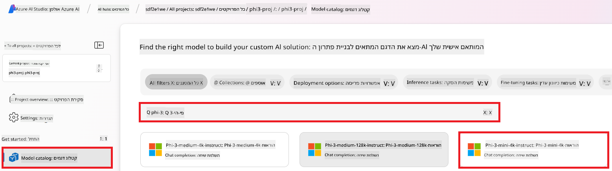

1. בחר **Fine-tune**.

    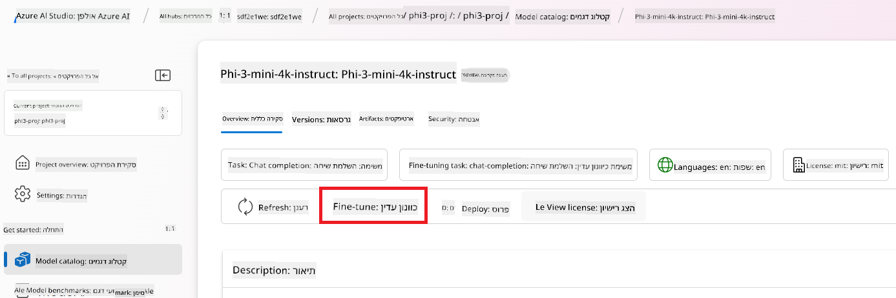

1. הזן את שם ה-**Fine-tuned model**.

    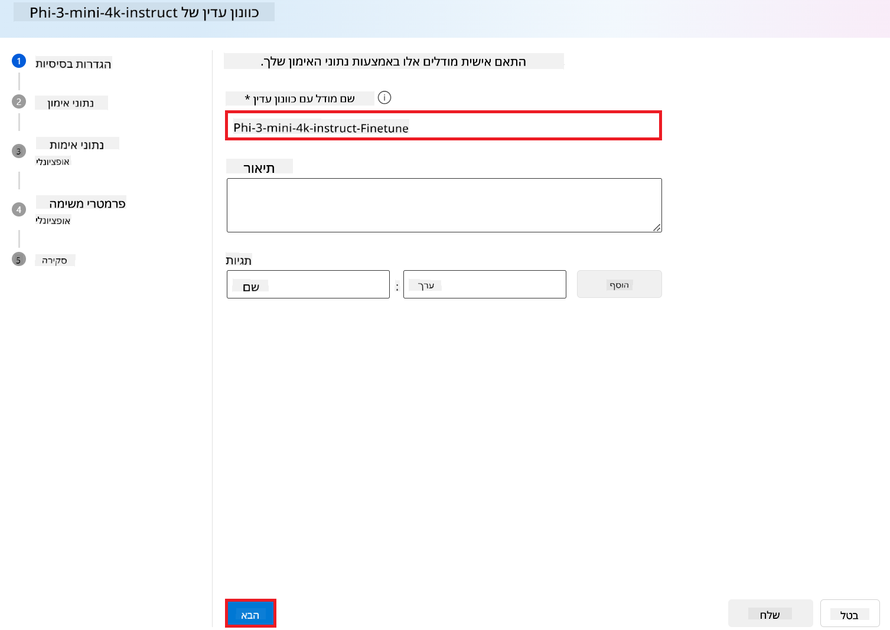

1. בחר **Next**.

1. בצע את המשימות הבאות:

    - בחר את **task type** ל-**Chat completion**.
    - בחר את **Training data** שברצונך להשתמש בו. ניתן להעלות אותו דרך נתוני Azure AI Foundry או מהסביבה המקומית שלך.

    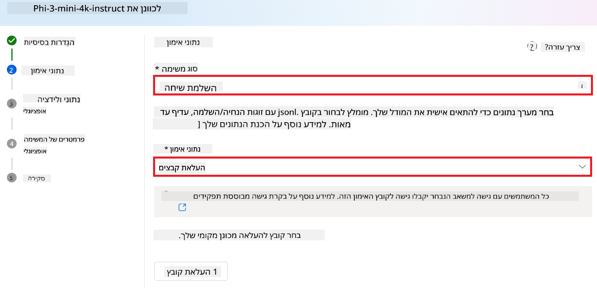

1. בחר **Next**.

1. העלה את **Validation data** שברצונך להשתמש בו, או בחר **Automatic split of training data**.

    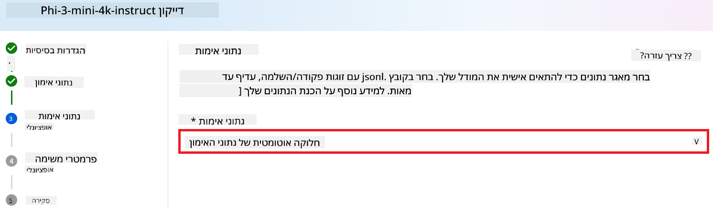

1. בחר **Next**.

1. בצע את המשימות הבאות:

    - בחר את **Batch size multiplier** הרצוי.
    - בחר את **Learning rate** הרצוי.
    - בחר את מספר ה-**Epochs** הרצוי.

    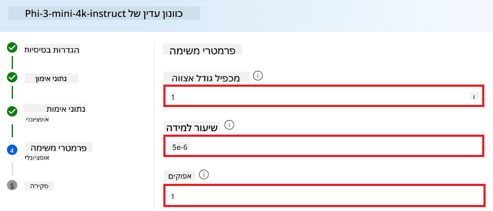

1. בחר **Submit** כדי להתחיל את תהליך הכוונון המדויק.

    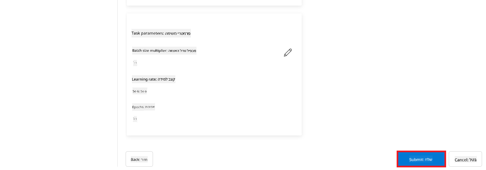

1. לאחר שהמודל שלך כוונן בהצלחה, הסטטוס יוצג כ-**Completed**, כפי שמוצג בתמונה למטה. כעת תוכל לפרוס את המודל ולהשתמש בו באפליקציה שלך, ב-playground או ב-prompt flow. למידע נוסף, ראה [How to deploy Phi-3 family of small language models with Azure AI Foundry](https://learn.microsoft.com/azure/ai-studio/how-to/deploy-models-phi-3?tabs=phi-3-5&pivots=programming-language-python).

    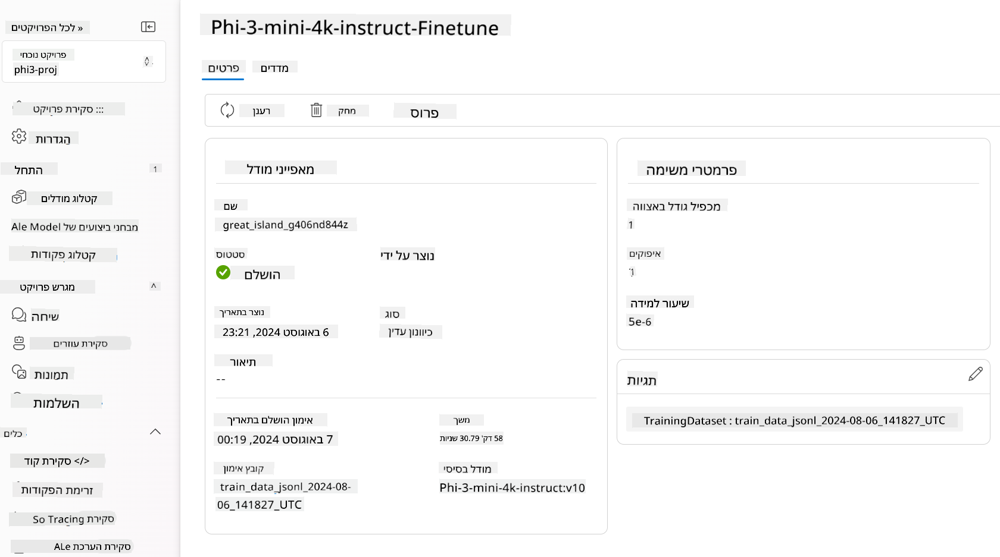

> [!NOTE]
> לפרטים נוספים על כוונון מדויק של Phi-3, בקר ב-[Fine-tune Phi-3 models in Azure AI Foundry](https://learn.microsoft.com/azure/ai-studio/how-to/fine-tune-phi-3?tabs=phi-3-mini).

## ניקוי מודלים שכיווננת

ניתן למחוק מודל שכיווננת מרשימת מודלי הכוונון ב-[Azure AI Foundry](https://ai.azure.com) או מדף פרטי המודל. בחר את המודל שכיווננת למחיקה מדף הכוונון, ואז בחר בלחצן Delete למחיקת המודל.

> [!NOTE]
> לא ניתן למחוק מודל מותאם אישית אם קיים לו פריסה פעילה. יש למחוק קודם את פריסת המודל לפני שניתן למחוק את המודל המותאם.

## עלויות ומכסות

### שיקולים עלות ומכסה עבור מודלי Phi-3 שכיווננו כשירות

מודלי Phi המכווננים כשירות מוצעים על ידי Microsoft ומשולבים ב-Azure AI Foundry לשימוש. ניתן למצוא את המחירים בעת [פריסה](https://learn.microsoft.com/azure/ai-studio/how-to/deploy-models-phi-3?tabs=phi-3-5&pivots=programming-language-python) או כוונון המודלים תחת לשונית Pricing and terms במדריך הפריסה.

## סינון תוכן

מודלים המופעלים כשירות בתשלום לפי שימוש מוגנים על ידי Azure AI Content Safety. כאשר הם מופעלים בנקודות קצה בזמן אמת, ניתן לבחור לבטל את הפיצ'ר הזה. עם הפעלת Azure AI Content Safety, גם הפרומפט וגם התוצאה עוברים דרך מערך של מודלי סיווג שנועדו לזהות ולמנוע הפקת תוכן מזיק. מערכת סינון התוכן מזהה ונוקטת פעולה על קטגוריות ספציפיות של תוכן פוטנציאלית מזיק הן בפרומפטים והן בתוצאות. למידע נוסף, ראה [Azure AI Content Safety](https://learn.microsoft.com/azure/ai-studio/concepts/content-filtering).

**הגדרות כוונון מדויק**

היפרפרמטרים: הגדר היפרפרמטרים כמו שיעור למידה, גודל אצווה ומספר אפוקים לאימון.

**פונקציית אובדן**

בחר פונקציית אובדן מתאימה למשימה שלך (למשל, cross-entropy).

**אופטימייזר**

בחר אופטימייזר (למשל, Adam) לעדכוני גרדיאנט במהלך האימון.

**תהליך הכוונון המדויק**

- טעינת מודל מאומן מראש: טען את נקודת הביקורת של Phi-3 Mini.
- הוספת שכבות מותאמות: הוסף שכבות ייעודיות למשימה (למשל, ראש סיווג להוראות שיחה).

**אימון המודל**  
כוונן את המודל באמצעות מערך הנתונים שהכנת. עקוב אחר התקדמות האימון והתאם היפרפרמטרים לפי הצורך.

**הערכה ואימות**

מערך אימות: חלק את הנתונים שלך למערכי אימון ואימות.

**הערכת ביצועים**

השתמש במדדים כמו דיוק, F1-score או perplexity כדי להעריך את ביצועי המודל.

## שמירת מודל שכיווננת

**נקודת ביקורת**  
שמור את נקודת הביקורת של המודל המכוונן לשימוש עתידי.

## פריסה

- פריסה כשירות רשת: פרוס את המודל שכיווננת כשירות רשת ב-Azure AI Foundry.
- בדיקת נקודת קצה: שלח שאילתות בדיקה לנקודת הקצה שהופעלה כדי לוודא את תפקודה.

## חזרה ושיפור

חזור על התהליך: אם הביצועים אינם מספקים, חזור על התהליך על ידי התאמת היפרפרמטרים, הוספת נתונים או כוונון נוסף במספר אפוקים.

## ניטור ושיפור

עקוב באופן רציף אחרי התנהגות המודל וחדד אותו לפי הצורך.

## התאמה והרחבה

משימות מותאמות: ניתן לכוונן את Phi-3 Mini למשימות שונות מעבר להוראות שיחה. גלה שימושים נוספים!  
ניסוי: נסה ארכיטקטורות שונות, שילובי שכבות וטכניקות לשיפור הביצועים.

> [!NOTE]
> כוונון מדויק הוא תהליך איטרטיבי. נסה, למד, והתאם את המודל שלך כדי להשיג את התוצאות הטובות ביותר למשימה הספציפית שלך!

**כתב ויתור**:  
מסמך זה תורגם באמצעות שירות תרגום מבוסס בינה מלאכותית [Co-op Translator](https://github.com/Azure/co-op-translator). למרות שאנו שואפים לדיוק, יש לקחת בחשבון כי תרגומים אוטומטיים עלולים להכיל שגיאות או אי-דיוקים. המסמך המקורי בשפתו המקורית נחשב למקור הסמכותי. למידע קריטי מומלץ להיעזר בתרגום מקצועי על ידי מתרגם אנושי. אנו לא נושאים באחריות לכל אי הבנה או פרשנות שגויה הנובעות משימוש בתרגום זה.