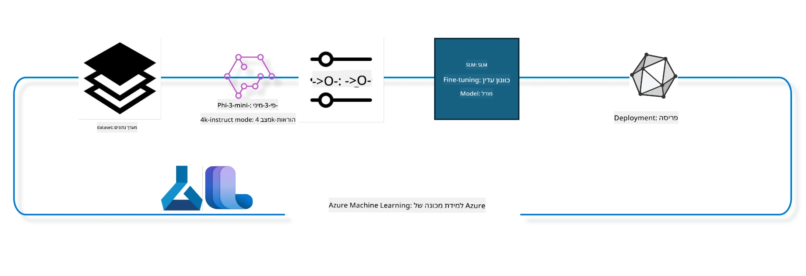

## איך להשתמש ברכיבי השלמת שיחה מרגיסטריית מערכת Azure ML לכיול מדויק של מודל

בדוגמה זו נבצע כיול מדויק למודל Phi-3-mini-4k-instruct כדי להשלים שיחה בין שני אנשים באמצעות מערך הנתונים ultrachat_200k.



הדוגמה תראה כיצד לבצע כיול מדויק באמצעות Azure ML SDK ופייתון ולאחר מכן לפרוס את המודל המכויל בקצה מקוון למסקנות בזמן אמת.

### נתוני אימון

נשתמש במערך הנתונים ultrachat_200k. זהו גרסה מסוננת מאוד של מערך הנתונים UltraChat ושימש לאימון Zephyr-7B-β, מודל שיחה מתקדם בגודל 7 מיליארד פרמטרים.

### המודל

נשתמש במודל Phi-3-mini-4k-instruct כדי להראות כיצד המשתמש יכול לכייל מדויק מודל למשימת השלמת שיחה. אם פתחתם מחברת זו מדף מודל ספציפי, זכרו להחליף את שם המודל הספציפי.

### משימות

- לבחור מודל לכיול מדויק.
- לבחור ולחקור את נתוני האימון.
- להגדיר את משימת הכיול.
- להריץ את משימת הכיול.
- לסקור מדדים של האימון וההערכה.
- לרשום את המודל המכויל.
- לפרוס את המודל המכויל למסקנות בזמן אמת.
- לנקות משאבים.

## 1. הגדרת דרישות מוקדמות

- התקנת תלויות
- התחברות ל-AzureML Workspace. למידע נוסף ראו set up SDK authentication. החליפו את <WORKSPACE_NAME>, <RESOURCE_GROUP> ו-<SUBSCRIPTION_ID> למטה.
- התחברות לרגיסטריית מערכת azureml
- הגדרת שם ניסוי אופציונלי
- בדיקת או יצירת חישוב.

> [!NOTE]
> נדרש צומת GPU יחיד שיכול לכלול מספר כרטיסי GPU. לדוגמה, בצומת אחד של Standard_NC24rs_v3 יש 4 כרטיסי NVIDIA V100 ואילו ב-Standard_NC12s_v3 יש 2 כרטיסי NVIDIA V100. עיינו בתיעוד למידע זה. מספר כרטיסי ה-GPU לצומת מוגדר בפרמטר gpus_per_node למטה. קביעת ערך זה נכון תבטיח שימוש בכל כרטיסי ה-GPU בצומת. ניתן למצוא את SKU-י החישוב GPU המומלצים כאן וכאן.

### ספריות פייתון

התקינו תלויות על ידי הרצת התא למטה. זו לא שלב אופציונלי אם מריצים בסביבה חדשה.

```bash
pip install azure-ai-ml
pip install azure-identity
pip install datasets==2.9.0
pip install mlflow
pip install azureml-mlflow
```

### אינטראקציה עם Azure ML

1. סקריפט פייתון זה משמש לאינטראקציה עם שירות Azure Machine Learning (Azure ML). להלן פירוט הפעולות שלו:

    - מייבא מודולים נחוצים מ-azure.ai.ml, azure.identity, ו-azure.ai.ml.entities. כמו כן מייבא את מודול time.

    - מנסה לאמת באמצעות DefaultAzureCredential(), המציע חווית אימות פשוטה להתחלת פיתוח יישומים המופעלים בענן Azure. במקרה של כישלון, מפנה לאימות באמצעות InteractiveBrowserCredential(), שמציג חלון התחברות אינטראקטיבי.

    - מנסה ליצור מופע MLClient באמצעות from_config, שקורא את ההגדרות מקובץ config.json ברירת מחדל. במקרה של כשלון, יוצר מופע MLClient באופן ידני עם subscription_id, resource_group_name ו-workspace_name.

    - יוצר מופע MLClient נוסף, הפעם לרגיסטריית Azure ML בשם "azureml". רגיסטריה זו משמשת לאחסון מודלים, צינורות הכיול וסביבות.

    - מגדיר את experiment_name כ-"chat_completion_Phi-3-mini-4k-instruct".

    - מייצר חותמת זמן ייחודית על ידי המרה של הזמן הנוכחי (בשניות מאז האפוצ) למספר שלם ואז למחרוזת. חותמת זו משמשת ליצירת שמות וגרסאות ייחודיות.

    ```python
    # ייבא מודולים נחוצים מ-Azure ML ו-Azure Identity
    from azure.ai.ml import MLClient
    from azure.identity import (
        DefaultAzureCredential,
        InteractiveBrowserCredential,
    )
    from azure.ai.ml.entities import AmlCompute
    import time  # ייבא את מודול time
    
    # נסה לאמת באמצעות DefaultAzureCredential
    try:
        credential = DefaultAzureCredential()
        credential.get_token("https://management.azure.com/.default")
    except Exception as ex:  # אם DefaultAzureCredential נכשל, השתמש ב-InteractiveBrowserCredential
        credential = InteractiveBrowserCredential()
    
    # נסה ליצור מופע של MLClient תוך שימוש בקובץ הקונפיגורציה הברירת מחדל
    try:
        workspace_ml_client = MLClient.from_config(credential=credential)
    except:  # אם זה נכשל, צור מופע של MLClient על ידי מתן הפרטים באופן ידני
        workspace_ml_client = MLClient(
            credential,
            subscription_id="<SUBSCRIPTION_ID>",
            resource_group_name="<RESOURCE_GROUP>",
            workspace_name="<WORKSPACE_NAME>",
        )
    
    # צור מופע נוסף של MLClient עבור רישום Azure ML בשם "azureml"
    # רישום זה הוא המקום שבו נשמרים מודלים, pipeline ייעול וסביבות
    registry_ml_client = MLClient(credential, registry_name="azureml")
    
    # הגדר את שם הניסוי
    experiment_name = "chat_completion_Phi-3-mini-4k-instruct"
    
    # צור חותמת זמן ייחודית שיכולה לשמש לשמות וגרסאות שצריכות להיות ייחודיות
    timestamp = str(int(time.time()))
    ```

## 2. בחירת מודל יסוד לכיול מדויק

1. Phi-3-mini-4k-instruct הוא מודל קל משקל עם 3.8 מיליארד פרמטרים, מתקדם, בנוי על מערכי נתונים ששימשו ב-Phi-2. המודל שייך למשפחת מודלי Phi-3, וגירסת Mini מגיעה בשתי וריאציות 4K ו-128K, שזה אורך ההקשר (במונחי טוקנים) אותו הוא יכול לתמוך בו. יש לכייל את המודל למטרה הספציפית שלנו לצורך שימוש. ניתן לעיין במודלים אלה בקטלוג המודלים ב-AzureML Studio, עם סינון למשימת השלמת שיחה. בדוגמה זו אנו משתמשים במודל Phi-3-mini-4k-instruct. אם פתחתם מחברת זו עבור מודל אחר, החליפו את שם המודל והגרסה בהתאם.

> [!NOTE]
> מזהה המודל הוא תכונה של המודל. זה יועבר כקלט למשימת הכיול. ניתן למצוא אותו גם כשדה Asset ID בדף פרטי המודל בקטלוג AzureML Studio.

2. סקריפט פייתון זה מתממשק עם שירות Azure Machine Learning (Azure ML). להלן פירוט הפעולות שלו:

    - מגדיר את model_name כ-"Phi-3-mini-4k-instruct".

    - משתמש בשיטת get של models ברגיסטריית registry_ml_client כדי לשלוף את הגרסה העדכנית ביותר של המודל עם השם הנתון מהרגיסטריה של Azure ML. השיטה נקראת עם שני ארגומנטים: שם המודל ותווית המציינת שיש לשלוף את הגרסה העדכנית ביותר.

    - מדפיס הודעה למסוף שמציינת את השם, הגרסה והמזהה של המודל שישמש לכיול. בשיטת format של המחרוזת מוזנים השם, הגרסה והמזהה של המודל מתוך תכונות אובייקט foundation_model.

    ```python
    # הגדר את שם המודל
    model_name = "Phi-3-mini-4k-instruct"
    
    # קבל את הגרסה העדכנית ביותר של המודל מהרשומה של Azure ML
    foundation_model = registry_ml_client.models.get(model_name, label="latest")
    
    # הדפס את שם המודל, הגרסה והזיהוי
    # מידע זה שימושי למעקב ולאיתור באגים
    print(
        "\n\nUsing model name: {0}, version: {1}, id: {2} for fine tuning".format(
            foundation_model.name, foundation_model.version, foundation_model.id
        )
    )
    ```

## 3. יצירת חישוב לשימוש במשימה

משימת הכיול עובדת רק עם חישוב GPU. גודל החישוב תלוי בגודל המודל וברוב המקרים קשה לזהות את החישוב הנכון למשימה. בתא זה אנו מדריכים את המשתמש לבחור בחישוב הנכון למשימה.

> [!NOTE]
> החישובים הרשומים למטה פועלים עם הקונפיגורציה המיטבית ביותר. שינויים בקונפיגורציה עלולים להוביל לשגיאת Cuda Out Of Memory. במקרים כאלה, יש לשדרג את החישוב לגודל גדול יותר.

> [!NOTE]
> בעת בחירת compute_cluster_size למטה, יש לוודא שהחישוב זמין בקבוצת המשאבים שלכם. אם חישוב מסוים אינו זמין, אפשר להגיש בקשה לקבלת גישה למשאבי החישוב.

### בדיקת תאימות הכיול למודל

1. סקריפט פייתון זה בודק אובייקט מודל ב-Azure Machine Learning (Azure ML). להלן פירוט הפעולות שלו:

    - מייבא את מודול ast, שמספק פונקציות לעיבוד עצי דקדוק של שפת Python.

    - בודק אם לאובייקט foundation_model (המסמל מודל ב-Azure ML) יש תג בשם finetune_compute_allow_list. תגיות ב-Azure ML הן זוגות מפתח-ערך שניתן ליצור ולסנן באמצעותן מודלים.

    - אם התג finetune_compute_allow_list קיים, הסקריפט משתמש ב-ast.literal_eval כדי לנתח בבטחה את ערך התג (מחרוזת) לרשימת Python. רשימה זו מוקצית למשתנה computes_allow_list. לאחר מכן מודפסת הודעה שממליצה ליצור חישוב מתוך הרשימה.

    - אם התג אינו קיים, מגדיר computes_allow_list ל-None ומדפיס הודעה שהתג finetune_compute_allow_list אינו חלק מתגי המודל.

    - לסיכום, הסקריפט בודק תג ספציפי במטא-דאטא של המודל, ממיר את ערך התג לרשימה אם קיים, ומספק משוב למשתמש בהתאם.

    ```python
    # ייבא את מודול ה-ast, המספק פונקציות לעיבוד עצי הדקדוק המופשט של פייתון
    import ast
    
    # בדוק אם התג 'finetune_compute_allow_list' קיים בתגי המודל
    if "finetune_compute_allow_list" in foundation_model.tags:
        # אם התג קיים, השתמש ב-ast.literal_eval כדי לפענח בבטחה את ערך התג (מחרוזת) לרשימת פייתון
        computes_allow_list = ast.literal_eval(
            foundation_model.tags["finetune_compute_allow_list"]
        )  # המרת מחרוזת לרשימת פייתון
        # הדפס הודעה המציינת שצריך ליצור חישוב מהרשימה
        print(f"Please create a compute from the above list - {computes_allow_list}")
    else:
        # אם התג אינו קיים, הגדר את computes_allow_list ל-None
        computes_allow_list = None
        # הדפס הודעה המציינת שתג 'finetune_compute_allow_list' אינו חלק מתגי המודל
        print("`finetune_compute_allow_list` is not part of model tags")
    ```

### בדיקת מופע חישוב

1. סקריפט פייתון זה מבצע מספר בדיקות על מופע חישוב בשירות Azure Machine Learning (Azure ML). להלן פירוט הפעולות שלו:

    - מנסה לאחזר את מופע החישוב בשם השמור ב-compute_cluster מתוך Azure ML workspace. אם מצב הפרוביזיה של מופע החישוב הוא "failed", מעלה שגיאת ValueError.

    - בודק אם computes_allow_list אינו None. אם כן, ממיר את כל גדלי החישוב ברשימה לאותיות קטנות ובודק אם גודל מופע החישוב הנוכחי נמצא ברשימה. אם לא, מעלה שגיאת ValueError.

    - אם computes_allow_list הוא None, בודק האם גודל מופע החישוב נמצא ברשימת גדלים לא נתמכים של VM עם GPU. אם כן, מעלה שגיאת ValueError.

    - מאחזר רשימה של כל גדלי החישוב הזמינים ב-workspace. עובר על הרשימה זו, ובודק האם שם הגודל תואם את גודל מופע החישוב הנוכחי. אם כן, מאחזר את מספר כרטיסי ה-GPU עבור גודל החישוב ומגדיר gpu_count_found ל-True.

    - אם gpu_count_found הוא True, מדפיס את מספר כרטיסי ה-GPU במופע החישוב. אם לא, מעלה שגיאת ValueError.

    - לסיכום, הסקריפט מבצע בדיקות על מופע חישוב ב-Azure ML workspace, כולל בדיקת מצב הפרוביזיה, התאמת גודל מול רשימות מאושרות או אסורות ומספר כרטיסי ה-GPU.

    ```python
    # הדפס את הודעת החריגה
    print(e)
    # העלה חריגת ValueError אם גודל המחשב אינו זמין בסביבת העבודה
    raise ValueError(
        f"WARNING! Compute size {compute_cluster_size} not available in workspace"
    )
    
    # השג את מופע המחשב מסביבת העבודה של Azure ML
    compute = workspace_ml_client.compute.get(compute_cluster)
    # בדוק אם מצב ההקצאה של מופע המחשב הוא "נכשל"
    if compute.provisioning_state.lower() == "failed":
        # העלה חריגת ValueError אם מצב ההקצאה הוא "נכשל"
        raise ValueError(
            f"Provisioning failed, Compute '{compute_cluster}' is in failed state. "
            f"please try creating a different compute"
        )
    
    # בדוק אם computes_allow_list אינו None
    if computes_allow_list is not None:
        # המר את כל גדלי המחשב ב-computes_allow_list לאותיות קטנות
        computes_allow_list_lower_case = [x.lower() for x in computes_allow_list]
        # בדוק אם גודל מופע המחשב נמצא ב-computes_allow_list_lower_case
        if compute.size.lower() not in computes_allow_list_lower_case:
            # העלה חריגת ValueError אם גודל מופע המחשב אינו נמצא ב-computes_allow_list_lower_case
            raise ValueError(
                f"VM size {compute.size} is not in the allow-listed computes for finetuning"
            )
    else:
        # הגדר רשימה של גדלי VM עם GPU שאינם נתמכים
        unsupported_gpu_vm_list = [
            "standard_nc6",
            "standard_nc12",
            "standard_nc24",
            "standard_nc24r",
        ]
        # בדוק אם גודל מופע המחשב נמצא ב-unsupported_gpu_vm_list
        if compute.size.lower() in unsupported_gpu_vm_list:
            # העלה חריגת ValueError אם גודל מופע המחשב נמצא ב-unsupported_gpu_vm_list
            raise ValueError(
                f"VM size {compute.size} is currently not supported for finetuning"
            )
    
    # אתחל דגל כדי לבדוק אם מספר כרטיסי ה-GPU במופע המחשב נמצא
    gpu_count_found = False
    # השג רשימה של כל גדלי המחשב הזמינים בסביבת העבודה
    workspace_compute_sku_list = workspace_ml_client.compute.list_sizes()
    available_sku_sizes = []
    # עבור על רשימת גדלי המחשב הזמינים
    for compute_sku in workspace_compute_sku_list:
        available_sku_sizes.append(compute_sku.name)
        # בדוק אם שם גודל המחשב תואם לגודל מופע המחשב
        if compute_sku.name.lower() == compute.size.lower():
            # אם כן, השג את מספר כרטיסי ה-GPU עבור גודל המחשב והגדר gpu_count_found כ-True
            gpus_per_node = compute_sku.gpus
            gpu_count_found = True
    # אם gpu_count_found הוא True, הדפס את מספר כרטיסי ה-GPU במופע המחשב
    if gpu_count_found:
        print(f"Number of GPU's in compute {compute.size}: {gpus_per_node}")
    else:
        # אם gpu_count_found הוא False, העלה חריגת ValueError
        raise ValueError(
            f"Number of GPU's in compute {compute.size} not found. Available skus are: {available_sku_sizes}."
            f"This should not happen. Please check the selected compute cluster: {compute_cluster} and try again."
        )
    ```

## 4. בחירת מערך הנתונים לכיול המודל

1. אנו משתמשים במערך הנתונים ultrachat_200k. מערך הנתונים מחולק לארבעה חלקים, המתאימים לכיול מפוקח (supervised fine-tuning - sft).
דירוג יצירה (generation ranking - gen). מספר הדוגמאות בכל חלק מוצג להלן:

    ```bash
    train_sft test_sft  train_gen  test_gen
    207865  23110  256032  28304
    ```

1. התאים הבאים מציגים הכנה בסיסית של הנתונים לכיול:

### הצגת שורות נתונים

רוצים שהדוגמה תרוץ מהר, לכן נשמור קבצי train_sft ו-test_sft הכוללים 5% מהשורות שכבר נבחרו. משמעות הדבר היא שהמודל המכויל יהיה פחות מדויק, ולכן אין להשתמש בו במצבים אמיתיים.
הסקריפט download-dataset.py משמש להורדת מערך הנתונים ultrachat_200k ולהמרתו לפורמט שמרכיב צנרת הכיול יכול לצרוך. כמו כן, כיוון שמערך הנתונים גדול, כאן מופיע רק חלק ממנו.

1. הרצת הסקריפט להלן מורידה רק 5% מהנתונים. ניתן להגדיל זאת על ידי שינוי הפרמטר dataset_split_pc לאחוז הרצוי.

> [!NOTE]
> יש מודלי שפה עם קודי שפה שונים ולכן שמות העמודות במערך הנתונים צריכים לשקף זאת.

1. דוגמה לאיך הנתונים אמורים להראות:
מערך הנתונים של השלמת שיחה מאוחסן בפורמט parquet כאשר כל רשומה משתמשת בסכימה הבאה:

    - זהו מסמך JSON (JavaScript Object Notation), פורמט נפוץ להחלפת מידע. זה אינו קוד להרצה, אלא אופן אחסון והעברת נתונים. להלן פירוט המבנה:

    - "prompt": מפתח זה מחזיק מחרוזת שמייצגת משימה או שאלה שניתנה לעוזר AI.

    - "messages": מפתח זה מכיל מערך של אובייקטים. כל אובייקט מייצג הודעה בשיחה בין משתמש לעוזר AI. לכל אובייקט הודעה שני מפתחות:

    - "content": מפתח זה מחזיק מחרוזת שמייצגת את תוכן ההודעה.
    - "role": מפתח זה מחזיק מחרוזת שמציינת את תפקיד השולח של ההודעה. יכול להיות "user" או "assistant".
    - "prompt_id": מפתח זה מחזיק מחרוזת שמייצגת מזהה ייחודי עבור הפרומפט.

1. במסמך JSON ספציפי זה, מתוארת שיחה שבה משתמש מבקש מהעוזר ליצור דמות מרכזית לסיפור דיסטופי. העוזר מגיב, ולאחר מכן המשתמש מבקש פרטים נוספים. העוזר מסכים לספק פרטים נוספים. כל השיחה משויכת למזהה פרומפט ספציפי.

    ```python
    {
        // The task or question posed to an AI assistant
        "prompt": "Create a fully-developed protagonist who is challenged to survive within a dystopian society under the rule of a tyrant. ...",
        
        // An array of objects, each representing a message in a conversation between a user and an AI assistant
        "messages":[
            {
                // The content of the user's message
                "content": "Create a fully-developed protagonist who is challenged to survive within a dystopian society under the rule of a tyrant. ...",
                // The role of the entity that sent the message
                "role": "user"
            },
            {
                // The content of the assistant's message
                "content": "Name: Ava\n\n Ava was just 16 years old when the world as she knew it came crashing down. The government had collapsed, leaving behind a chaotic and lawless society. ...",
                // The role of the entity that sent the message
                "role": "assistant"
            },
            {
                // The content of the user's message
                "content": "Wow, Ava's story is so intense and inspiring! Can you provide me with more details.  ...",
                // The role of the entity that sent the message
                "role": "user"
            }, 
            {
                // The content of the assistant's message
                "content": "Certainly! ....",
                // The role of the entity that sent the message
                "role": "assistant"
            }
        ],
        
        // A unique identifier for the prompt
        "prompt_id": "d938b65dfe31f05f80eb8572964c6673eddbd68eff3db6bd234d7f1e3b86c2af"
    }
    ```

### הורדת הנתונים

1. סקריפט פייתון זה משמש להורדת מערך נתונים באמצעות סקריפט עזר בשם download-dataset.py. להלן פירוט הפעולות שלו:

    - מייבא את מודול os, שמספק דרכים ניידות לשימוש בפונקציות תלוי מערכת הפעלה.

    - מפעיל את הפקודה להרצת סקריפט download-dataset.py עם פרמטרים לשורת הפקודה. הפרמטרים מציינים את מערך הנתונים להורדה (HuggingFaceH4/ultrachat_200k), את התיקייה להורדה אליה (ultrachat_200k_dataset) ואת אחוז חלוקת מערך הנתונים (5). הפונקציה os.system מחזירה את סטטוס היציאה של הפקודה; סטטוס זה נשמר במשתנה exit_status.

    - בודק אם exit_status שונה מאפס. במערכות מסוג Unix, סטטוס יציאה 0 מציין שהפקודה הצליחה, וכל מספר אחר מצביע על שגיאה. אם exit_status שונה מאפס, מעלה חריגה עם הודעה על שגיאת הורדה.

    - לסיכום, הסקריפט מריץ פקודה להורדת מערך נתונים ומעלה חריגה אם הפקודה נכשלה.

    ```python
    # ייבא את מודול os, המספק דרך להשתמש בפונקציונליות התלויה במערכת ההפעלה
    import os
    
    # השתמש בפונקציה os.system כדי להריץ את הסקריפט download-dataset.py ב-shell עם ארגומנטים ספציפיים בשורת הפקודה
    # הארגומנטים מציינים את מערך הנתונים להורדה (HuggingFaceH4/ultrachat_200k), את התיקייה להורדה אליה (ultrachat_200k_dataset), ואת אחוז החלוקה של מערך הנתונים (5)
    # פונקציית os.system מחזירה את קוד היציאה של הפקודה שבוצעה; קוד זה נשמר במשתנה exit_status
    exit_status = os.system(
        "python ./download-dataset.py --dataset HuggingFaceH4/ultrachat_200k --download_dir ultrachat_200k_dataset --dataset_split_pc 5"
    )
    
    # בדוק אם exit_status לא שווה ל-0
    # במערכות הפעלה בדמות יוניקס, קוד יציאה של 0 בדרך כלל מציין שהפקודה הצליחה, וכל מספר אחר מציין שגיאה
    # אם exit_status אינו 0, זרוק חריגה עם הודעה המציינת שהייתה שגיאה בהורדת מערך הנתונים
    if exit_status != 0:
        raise Exception("Error downloading dataset")
    ```

### טעינת נתונים ל-DataFrame

1. סקריפט פייתון זה טוען קובץ JSON Lines ל-DataFrame של pandas ומציג את 5 השורות הראשונות. להלן פירוט הפעולות שלו:

    - מייבא את ספריית pandas, שהיא ספרייה חזקה לניתוח וניתוב נתונים.

    - מגדיר את המקסימום רוחב עמודה באפשרויות התצוגה של pandas ל-0. המשמעות היא שכל הטקסט המלא של כל עמודה יופיע ללא קיצור כאשר התצוגה של ה-DataFrame מודפסת.
- הוא משתמש בפונקציית pd.read_json כדי לטעון את הקובץ train_sft.jsonl מתיקיית ultrachat_200k_dataset לתוך DataFrame. הפרמטר lines=True מציין שהקובץ הוא בפורמט JSON Lines, כאשר כל שורה היא אובייקט JSON נפרד.

- הוא משתמש במתודה head כדי להציג את 5 השורות הראשונות של ה-DataFrame. אם ל-DataFrame יש פחות מ-5 שורות, הוא יציג את כולן.

- לסיכום, הסקריפט טוען קובץ JSON Lines לתוך DataFrame ומציג את 5 השורות הראשונות עם הטקסט המלא של העמודות.

    ```python
    # ייבא את ספריית pandas, שהיא ספרייה חזקה לטיפול וניתוח נתונים
    import pandas as pd
    
    # הגדר את רוחב העמודה המקסימלי לאופציות התצוגה של pandas ל-0
    # משמעות הדבר היא שהטקסט המלא של כל עמודה יוצג ללא קיצור כאשר DataFrame יודפס
    pd.set_option("display.max_colwidth", 0)
    
    # השתמש בפונקציה pd.read_json כדי לטעון את הקובץ train_sft.jsonl מתיקיית ultrachat_200k_dataset אל DataFrame
    # הפרמטר lines=True מציין שהקובץ בפורמט JSON Lines, כאשר כל שורה היא אובייקט JSON נפרד
    df = pd.read_json("./ultrachat_200k_dataset/train_sft.jsonl", lines=True)
    
    # השתמש בשיטת head כדי להציג את 5 השורות הראשונות של ה-DataFrame
    # אם ל-DataFrame יש פחות מ-5 שורות, יוצגו כולן
    df.head()
    ```

## 5. הגש את עבודת הכיוונון המעודן בעזרת המודל והנתונים כקלט

צור את העבודה שמשתמשת ברכיב צינור השלמת שיחה. למדו עוד על כל הפרמטרים הנתמכים לכיוונון מעודן.

### הגדר פרמטרי כיוונון מעודן

1. פרמטרי הכיוונון המעודן יכולים להתחלק לשתי קטגוריות - פרמטרים של אימון, ופרמטרים של אופטימיזציה

1. פרמטרי אימון מגדירים היבטים של האימון כמו -

    - המוּרגֶן (optimizer), מתזמן (scheduler) לשימוש
    - המטריקה לאופטימיזציה של הכיוונון המעודן
    - מספר צעדי אימון וגודל אצווה וכן הלאה
    - פרמטרי אופטימיזציה עוזרים באופטימיזציה של זיכרון ה-GPU ושימוש יעיל במשאבי המחשוב.

1. להלן כמה מהפרמטרים שנכללים בקטגוריה זו. פרמטרי האופטימיזציה משתנים לכל מודל ונארזים עם המודל כדי לטפל בסטיות אלו.

    - הפעלת DeepSpeed ו-LoRA
    - הפעלת אימון בדיוק מעורב (mixed precision)
    - הפעלת אימון על מספר צמתים (multi-node)

> [!NOTE]
> כיוונון מעודן בפיקוח עשוי לגרום לאובדן התאמה או לשכחה קטסטרופלית. מומלץ לבדוק את הנושא ולהריץ שלב התאמה לאחר הכיוונון המעודן.

### פרמטרי כיוונון מעודן

1. סקריפט פייתון זה מגדיר פרמטרים לכיוונון מעודן של מודל למידת מכונה. הנה פירוט של הפעולות:

    - הוא מגדיר פרמטרי אימון ברירת מחדל כגון מספר אפוקים לאימון, גדלי אצוות לאימון והערכה, שיעור למידה, וסוג מתזמן שיעור הלמידה.

    - הוא מגדיר פרמטרי אופטימיזציה ברירת מחדל כגון אם להחיל Layer-wise Relevance Propagation (LoRa) ו-DeepSpeed, ושלב DeepSpeed.

    - הוא משלב את פרמטרי האימון והאופטימיזציה למילון יחיד בשם finetune_parameters.

    - הוא בודק אם ל-foundation_model יש פרמטרי ברירת מחדל ספציפיים למודל. אם כן, מדפיס הודעת אזהרה ומעדכן את מילון finetune_parameters עם הפרמטרים הספציפיים האלה. הפונקציה ast.literal_eval משמשת להמרת הפרמטרים מהמחרוזת למילון פייתון.

    - הוא מדפיס את קבוצת הפרמטרים הסופית של הכיוונון המעודן שישמשו להרצה.

    - לסיכום, הסקריפט מכין ומציג את הפרמטרים לכיוונון מעודן של מודל למידת מכונה, עם יכולת להחליף את פרמטרי ברירת המחדל בפרמטרים ספציפיים למודל.

    ```python
    # הגדר פרמטרים ברירת מחדל לאימון כגון מספר האפוקים, גדלי המנות לאימון ולהערכה, מהירות הלמידה וסוג לוח הזמנים למהירות הלמידה
    training_parameters = dict(
        num_train_epochs=3,
        per_device_train_batch_size=1,
        per_device_eval_batch_size=1,
        learning_rate=5e-6,
        lr_scheduler_type="cosine",
    )
    
    # הגדר פרמטרים ברירת מחדל לאופטימיזציה כגון האם להחיל הפצת רלוונטיות לפי שכבות (LoRa) ו-DeepSpeed, ושלב ה-DeepSpeed
    optimization_parameters = dict(
        apply_lora="true",
        apply_deepspeed="true",
        deepspeed_stage=2,
    )
    
    # שלב את פרמטרי האימון והאופטימיזציה למילון אחד שנקרא finetune_parameters
    finetune_parameters = {**training_parameters, **optimization_parameters}
    
    # בדוק אם ל-foundation_model יש פרמטרים ספציפיים למודל כברירת מחדל
    # אם כן, הדפס הודעת אזהרה ועדכן את מילון ה-finetune_parameters עם ברירות המחדל המסוימות למודל אלה
    # הפונקציה ast.literal_eval משמשת להמרת ברירות המחדל הספציפיות למודל ממחרוזת למילון פייתון
    if "model_specific_defaults" in foundation_model.tags:
        print("Warning! Model specific defaults exist. The defaults could be overridden.")
        finetune_parameters.update(
            ast.literal_eval(  # המר מחרוזת למילון פייתון
                foundation_model.tags["model_specific_defaults"]
            )
        )
    
    # הדפס את קבוצת הפרמטרים הסופית לכיול עדין שישמשו להרצה
    print(
        f"The following finetune parameters are going to be set for the run: {finetune_parameters}"
    )
    ```

### צינור אימון

1. סקריפט פייתון זה מגדיר פונקציה ליצירת שם תצוגה לצינור אימון של למידת מכונה, ואז קורא לפונקציה זו כדי ליצור ולהדפיס את שם התצוגה. הנה פירוט:

1. הפונקציה get_pipeline_display_name מוגדרת. פונקציה זו יוצרת שם תצוגה בהתבסס על פרמטרים שונים הקשורים לצינור האימון.

1. בתוך הפונקציה, היא מחשבת את גודל האצווה הכולל על ידי הכפלת גודל האצווה לכל התקן, מספר שלבי הצטברות גרדיאנט, מספר ה-GPUs לכל צומת, ומספר הצמתים לכיוונון מעודן.

1. היא שולפת פרמטרים נוספים כגון סוג מתזמן שיעור הלמידה, האם DeepSpeed מופעל, שלב DeepSpeed, האם Layer-wise Relevance Propagation (LoRa) מופעל, הגבול על מספר נקודות ביקורת לשמירה, ואורך רצף מקסימלי.

1. היא בונה מחרוזת הכוללת את כל הפרמטרים האלה, מופרדים במקפים. אם DeepSpeed או LoRa מופעלים, המחרוזת כוללת "ds" עם שלב DeepSpeed, או "lora", בהתאמה. אחרת, היא כוללת "nods" או "nolora", בהתאמה.

1. הפונקציה מחזירה מחרוזת זו, שמשמשת כשם התצוגה של צינור האימון.

1. לאחר שהפונקציה מוגדרת, קוראים לה כדי ליצור את שם התצוגה, ואז מדפיסים אותו.

1. לסיכום, הסקריפט מהווה יצירת שם תצוגה לצינור אימון של למידת מכונה בהתבסס על פרמטרים שונים, ואז מדפיס את השם.

    ```python
    # הגדר פונקציה ליצירת שם תצוגה עבור צנרת האימון
    def get_pipeline_display_name():
        # חשב את גודל האצווה הכולל על ידי הכפלת גודל האצווה לכל מכשיר, מספר שלבי הצטברות הגרדיאנט, מספר כרטיסי המסך לכל צומת ומספר הצמתים המשמשים לכיול עדין
        batch_size = (
            int(finetune_parameters.get("per_device_train_batch_size", 1))
            * int(finetune_parameters.get("gradient_accumulation_steps", 1))
            * int(gpus_per_node)
            * int(finetune_parameters.get("num_nodes_finetune", 1))
        )
        # שלוף את סוג מתזמן שיעור הלמידה
        scheduler = finetune_parameters.get("lr_scheduler_type", "linear")
        # שלוף אם DeepSpeed מיושם
        deepspeed = finetune_parameters.get("apply_deepspeed", "false")
        # שלוף את שלב DeepSpeed
        ds_stage = finetune_parameters.get("deepspeed_stage", "2")
        # אם DeepSpeed מיושם, כלול "ds" ואחריו את שלב DeepSpeed בשם התצוגה; אם לא, כלול "nods"
        if deepspeed == "true":
            ds_string = f"ds{ds_stage}"
        else:
            ds_string = "nods"
        # שלוף אם מיושם הפצת רלוונטיות שכבתית (LoRa)
        lora = finetune_parameters.get("apply_lora", "false")
        # אם LoRa מיושם, כלול "lora" בשם התצוגה; אם לא, כלול "nolora"
        if lora == "true":
            lora_string = "lora"
        else:
            lora_string = "nolora"
        # שלוף את המגבלה על מספר נקודות הביקורת של הדגם לשמירה
        save_limit = finetune_parameters.get("save_total_limit", -1)
        # שלוף את האורך המקסימלי של הרצף
        seq_len = finetune_parameters.get("max_seq_length", -1)
        # הרכב את שם התצוגה על ידי שרשור כל הפרמטרים הללו, מופרדים במקפים
        return (
            model_name
            + "-"
            + "ultrachat"
            + "-"
            + f"bs{batch_size}"
            + "-"
            + f"{scheduler}"
            + "-"
            + ds_string
            + "-"
            + lora_string
            + f"-save_limit{save_limit}"
            + f"-seqlen{seq_len}"
        )
    
    # קרא לפונקציה ליצירת שם התצוגה
    pipeline_display_name = get_pipeline_display_name()
    # הדפס את שם התצוגה
    print(f"Display name used for the run: {pipeline_display_name}")
    ```

### הגדרת הצינור

סקריפט פייתון זה מגדיר ומגדיר צינור למידת מכונה באמצעות Azure Machine Learning SDK. הנה פירוט:

1. הוא מייבא מודולים נחוצים מתוך Azure AI ML SDK.

1. הוא מושך רכיב צינור בשם "chat_completion_pipeline" מהרשומה.

1. הוא מגדיר עבודה בצינור באמצעות הדקורטור `@pipeline` והפונקציה `create_pipeline`. שם הצינור מוגדר כ- `pipeline_display_name`.

1. בתוך פונקציית `create_pipeline`, הוא מאתחל את רכיב הצינור שנמשך עם פרמטרים שונים, כולל נתיב המודל, צברי מחשוב לשלביים שונים, פרוסות של מערכי נתונים לאימון ולבדיקה, מספר ה-GPUs לשימוש בכיוונון מעודן, ופרמטרים נוספים לכיוונון המעודן.

1. הוא ממפה את הפלט של עבודת הכיוונון המעודן לפלט של עבודת הצינור. זאת כדי שהמודל שעבר כיוונון מעודן יוכל להירשם בקלות, דבר הנדרש לפריסה לנקודת קצה מקוונת או אצווה.

1. הוא יוצר מופע של הצינור על ידי קריאה לפונקציית `create_pipeline`.

1. הוא מגדיר את ההגדרה `force_rerun` של הצינור ל- `True`, כלומר אין להשתמש בתוצאות שמורות מעבודות קודמות.

1. הוא מגדיר את ההגדרה `continue_on_step_failure` של הצינור ל- `False`, כלומר הצינור ייפסק אם שלב כלשהו נכשל.

1. לסיכום, הסקריפט מגדיר ומגדיר צינור למידת מכונה למשימת השלמת שיחה באמצעות Azure Machine Learning SDK.

    ```python
    # ייבא מודולים נחוצים מ-SDK של Azure AI ML
    from azure.ai.ml.dsl import pipeline
    from azure.ai.ml import Input
    
    # שלוף את רכיב הצינור בשם "chat_completion_pipeline" מהרשומה
    pipeline_component_func = registry_ml_client.components.get(
        name="chat_completion_pipeline", label="latest"
    )
    
    # הגדר את עבודת הצינור באמצעות המעטר @pipeline והפונקציה create_pipeline
    # שם הצינור מוגדר ל-pipeline_display_name
    @pipeline(name=pipeline_display_name)
    def create_pipeline():
        # אתחל את רכיב הצינור שנשלף עם פרמטרים שונים
        # אלה כוללים את נתיב המודל, אשכולות מחשוב לשלבים שונים, חלוקות מערכות נתונים לאימון ובדיקה, מספר ה-GPUs לשימוש בכיוונון עדין ופרמטרים נוספים לכיוונון עדין
        chat_completion_pipeline = pipeline_component_func(
            mlflow_model_path=foundation_model.id,
            compute_model_import=compute_cluster,
            compute_preprocess=compute_cluster,
            compute_finetune=compute_cluster,
            compute_model_evaluation=compute_cluster,
            # העבר את חלוקות מערכות הנתונים לפרמטרים
            train_file_path=Input(
                type="uri_file", path="./ultrachat_200k_dataset/train_sft.jsonl"
            ),
            test_file_path=Input(
                type="uri_file", path="./ultrachat_200k_dataset/test_sft.jsonl"
            ),
            # הגדרות אימון
            number_of_gpu_to_use_finetuning=gpus_per_node,  # מוגדר למספר ה-GPUs הזמינים במחשוב
            **finetune_parameters
        )
        return {
            # מיפוי הפלט של עבודת הכיוונון העדין לפלט של עבודת הצינור
            # נעשה זאת כדי שנוכל לרשום בקלות את המודל המכווין עדין
            # רישום המודל נדרש כדי לפרוס את המודל לנקודת קצה מקוונת או אצווה
            "trained_model": chat_completion_pipeline.outputs.mlflow_model_folder
        }
    
    # צור מופע של הצינור על ידי קריאה לפונקציה create_pipeline
    pipeline_object = create_pipeline()
    
    # אל תשתמש בתוצאות מטמון של עבודות קודמות
    pipeline_object.settings.force_rerun = True
    
    # הגדר המשך במקרה של כשל שלב ל-False
    # זה אומר שהצינור ייפסק אם שלב כלשהו נכשל
    pipeline_object.settings.continue_on_step_failure = False
    ```

### הגש את העבודה

1. סקריפט פייתון זה מגיש עבודת צינור למידת מכונה לסביבת עבודה Azure Machine Learning ואז ממתין להשלמת העבודה. הנה פירוט:

    - הוא קורא למתודה create_or_update של האובייקט jobs ב-workspace_ml_client כדי להגיש את עבודת הצינור. הצינור להרצה מצוין על ידי pipeline_object, והניסוי תחתיו נעשית העבודה מצוין על ידי experiment_name.

    - לאחר מכן הוא קורא למתודה stream של האובייקט jobs ב-workspace_ml_client כדי להמתין להשלמת עבודת הצינור. העבודה להמתין לה מצוין בשדה name של האובייקט pipeline_job.

    - לסיכום, הסקריפט מגיש עבודת צינור למידת מכונה לסביבת עבודה Azure Machine Learning ואז ממתין להשלמתה.

    ```python
    # שלח את משימת הפסPipeline לעבודה של Azure Machine Learning
    # ה- Pipeline שירוץ מצוין על ידי pipeline_object
    # הניסוי תחתיו מתבצעת המשימה מצוין על ידי experiment_name
    pipeline_job = workspace_ml_client.jobs.create_or_update(
        pipeline_object, experiment_name=experiment_name
    )
    
    # המתן לסיום משימת ה- Pipeline
    # המשימה להמתין לה מצוין על ידי התכונה name של אובייקט pipeline_job
    workspace_ml_client.jobs.stream(pipeline_job.name)
    ```

## 6. רישום המודל שעבר כיוונון מעודן בסביבת העבודה

נרשום את המודל מתוך פלט עבודת הכיוונון המעודן. זה יעקוב אחרי הקשר בין המודל המעודן לבין עבודת הכיוונון המעודן. עבודת הכיוונון המעודן, בנוסף, עוקבת אחרי הקשר למודל היסוד, הנתונים וקוד האימון.

### רישום מודל ML

1. סקריפט פייתון זה רושם מודל למידת מכונה שאומן בצינור Azure Machine Learning. הנה פירוט:

    - הוא מייבא מודולים נחוצים מ-Azure AI ML SDK.

    - הוא בודק אם הפלט trained_model זמין מעבודת הצינור על ידי קריאה למתודה get של האובייקט jobs ב-workspace_ml_client וגישה למאפיין outputs שלו.

    - הוא יוצר נתיב למודל המאומן על ידי עיצוב מחרוזת עם שם עבודת הצינור ושם הפלט ("trained_model").

    - הוא מגדיר שם למודל המעודן על ידי הוספת "-ultrachat-200k" לשם המודל המקורי והחלפת כל הסלאשים במקפים.

    - הוא מתכונן לרישום המודל על ידי יצירת אובייקט Model עם פרמטרים שונים, כולל הנתיב למודל, סוג המודל (מודל MLflow), שם הגרסה ותיאור המודל.

    - הוא רושם את המודל על ידי קריאה למתודה create_or_update של האובייקט models ב-workspace_ml_client עם האובייקט Model כארגומנט.

    - הוא מדפיס את המודל הרשום.

1. לסיכום, הסקריפט רושם מודל למידת מכונה שאומן בצינור Azure Machine Learning.

    ```python
    # ייבא מודולים נחוצים מ-SDK של Azure AI ML
    from azure.ai.ml.entities import Model
    from azure.ai.ml.constants import AssetTypes
    
    # בדוק אם הפלט `trained_model` זמין ממשימת הצנרת
    print("pipeline job outputs: ", workspace_ml_client.jobs.get(pipeline_job.name).outputs)
    
    # בנה נתיב למודל המאומן על ידי עיצוב מחרוזת עם שם משימת הצנרת ושם הפלט ("trained_model")
    model_path_from_job = "azureml://jobs/{0}/outputs/{1}".format(
        pipeline_job.name, "trained_model"
    )
    
    # הגדר שם למודל המכוונן בעדינות על ידי הוספת "-ultrachat-200k" לשם המקורי והחלפת כל קווים נטויים בקווים מקפים
    finetuned_model_name = model_name + "-ultrachat-200k"
    finetuned_model_name = finetuned_model_name.replace("/", "-")
    
    print("path to register model: ", model_path_from_job)
    
    # התכונן לרשום את המודל על ידי יצירת אובייקט Model עם פרמטרים שונים
    # אלה כוללים את הנתיב למודל, סוג המודל (מודל MLflow), שם וגרסת המודל, ותיאור של המודל
    prepare_to_register_model = Model(
        path=model_path_from_job,
        type=AssetTypes.MLFLOW_MODEL,
        name=finetuned_model_name,
        version=timestamp,  # השתמש בחותמת זמן כגרסה כדי למנוע קונפליקט בגרסאות
        description=model_name + " fine tuned model for ultrachat 200k chat-completion",
    )
    
    print("prepare to register model: \n", prepare_to_register_model)
    
    # רשום את המודל על ידי קריאה למתודת create_or_update של אובייקט המודלים ב-workspace_ml_client עם אובייקט ה-Model כארגומנט
    registered_model = workspace_ml_client.models.create_or_update(
        prepare_to_register_model
    )
    
    # הדפס את המודל שנרשם
    print("registered model: \n", registered_model)
    ```

## 7. פרוס את המודל המעודן לנקודת קצה מקוונת

נקודות קצה מקוונות מספקות ממשק API REST עמיד שניתן לשלב עם אפליקציות שדורשות שימוש במודל.

### ניהול נקודת קצה

1. סקריפט פייתון זה יוצר נקודת קצה מקוונת מנוהלת ב-Azure Machine Learning עבור מודל רשום. הנה פירוט:

    - הוא מייבא מודולים נחוצים מתוך Azure AI ML SDK.

    - הוא מגדיר שם ייחודי לנקודת הקצה המקוונת על ידי הוספת חותמת זמן למחרוזת "ultrachat-completion-".

    - הוא מתכונן ליצירת נקודת הקצה על ידי יצירת אובייקט ManagedOnlineEndpoint עם פרמטרים שונים, כולל שם הנקודה, תיאור, ואופן האימות ("key").

    - הוא יוצר את נקודת הקצה המקוונת על ידי קריאה למתודה begin_create_or_update של workspace_ml_client עם האובייקט ManagedOnlineEndpoint כארגומנט. לאחר מכן ממתין להשלמת יצירתה באמצעות המתודה wait.

1. לסיכום, הסקריפט יוצר נקודת קצה מקוונת מנוהלת ב-Azure Machine Learning עבור מודל רשום.

    ```python
    # ייבא מודולים נחוצים מחבילת Azure AI ML SDK
    from azure.ai.ml.entities import (
        ManagedOnlineEndpoint,
        ManagedOnlineDeployment,
        ProbeSettings,
        OnlineRequestSettings,
    )
    
    # הגדר שם ייחודי לנקודת הקצה המקוונת על ידי הוספת חותמת זמן למחרוזת "ultrachat-completion-"
    online_endpoint_name = "ultrachat-completion-" + timestamp
    
    # התכונן ליצור את נקודת הקצה המקוונת על ידי יצירת אובייקט ManagedOnlineEndpoint עם פרמטרים שונים
    # אלו כוללים את שם נקודת הקצה, תיאור של נקודת הקצה, ואופן האימות ("key")
    endpoint = ManagedOnlineEndpoint(
        name=online_endpoint_name,
        description="Online endpoint for "
        + registered_model.name
        + ", fine tuned model for ultrachat-200k-chat-completion",
        auth_mode="key",
    )
    
    # צור את נקודת הקצה המקוונת על ידי קריאה לשיטה begin_create_or_update של workspace_ml_client עם אובייקט ManagedOnlineEndpoint כארגומנט
    # לאחר מכן המתן לסיום פעולת יצירת נקודת הקצה על ידי קריאה לשיטה wait
    workspace_ml_client.begin_create_or_update(endpoint).wait()
    ```

> [!NOTE]
> ניתן למצוא כאן את רשימת ה-SKU הנתמכים לפריסה - [רשימת SKU לנקודות קצה מקוונות מנוהלות](https://learn.microsoft.com/azure/machine-learning/reference-managed-online-endpoints-vm-sku-list)

### פריסת מודל ML

1. סקריפט פייתון זה מפרוס מודל למידת מכונה רשום לנקודת קצה מקוונת מנוהלת ב-Azure Machine Learning. הנה פירוט:

    - הוא מייבא את המודול ast, שמספק פונקציות לעיבוד עצים של הדקדוק האבסטרקטי של פייתון.

    - הוא מגדיר את סוג המופע לפריסה כ-"Standard_NC6s_v3".

    - הוא בודק אם התגית inference_compute_allow_list קיימת במודל היסוד. אם כן, הוא ממיר את הערך משרשרת לרשימת פייתון ומאחסן ב- inference_computes_allow_list. אם לא, הוא מגדיר אותו כ-None.

    - הוא בודק אם סוג המופע שצוין נמצא ברשימת ההרשאה. אם לא, הוא מדפיס הודעה שמבקשת מהמשתמש לבחור סוג מופע מהרשימה.

    - הוא מתכונן ליצירת הפריסה על ידי יצירת אובייקט ManagedOnlineDeployment עם פרמטרים שונים, כולל שם הפריסה, שם נקודת הקצה, מזהה המודל, סוג ומספר המופעים, הגדרות liveness probe, והגדרות בקשות.

    - הוא יוצר את הפריסה על ידי קריאה למתודה begin_create_or_update של workspace_ml_client עם אובייקט ManagedOnlineDeployment כארגומנט. ולאחר מכן ממתין להשלמת יצירתה עם המתודה wait.

    - הוא מגדיר את תנועת הנקודה כך שכל התנועה (100%) תופנה לפריסת "demo".

    - הוא מעדכן את נקודת הקצה על ידי קריאה למתודה begin_create_or_update של workspace_ml_client עם אובייקט נקודת הקצה כארגומנט, ואז ממתין להשלמת העדכון עם המתודה result.

1. לסיכום, הסקריפט מפרוס מודל למידת מכונה רשום לנקודת קצה מקוונת מנוהלת ב-Azure Machine Learning.

    ```python
    # ייבא את מודול ast, שמספק פונקציות לעיבוד עצי דקדוק מופשט של פייתון
    import ast
    
    # הגדר את סוג המופע עבור הפריסה
    instance_type = "Standard_NC6s_v3"
    
    # בדוק אם התג `inference_compute_allow_list` קיים במודל הבסיס
    if "inference_compute_allow_list" in foundation_model.tags:
        # אם כן, המרת את ערך התג ממחרוזת לרשימת פייתון והקצה אותו ל-`inference_computes_allow_list`
        inference_computes_allow_list = ast.literal_eval(
            foundation_model.tags["inference_compute_allow_list"]
        )
        print(f"Please create a compute from the above list - {computes_allow_list}")
    else:
        # אם לא, הגדר את `inference_computes_allow_list` ל-`None`
        inference_computes_allow_list = None
        print("`inference_compute_allow_list` is not part of model tags")
    
    # בדוק אם סוג המופע שצויין נמצא ברשימת ההרשאות
    if (
        inference_computes_allow_list is not None
        and instance_type not in inference_computes_allow_list
    ):
        print(
            f"`instance_type` is not in the allow listed compute. Please select a value from {inference_computes_allow_list}"
        )
    
    # התכונן ליצירת הפריסה על ידי יצירת אובייקט `ManagedOnlineDeployment` עם פרמטרים שונים
    demo_deployment = ManagedOnlineDeployment(
        name="demo",
        endpoint_name=online_endpoint_name,
        model=registered_model.id,
        instance_type=instance_type,
        instance_count=1,
        liveness_probe=ProbeSettings(initial_delay=600),
        request_settings=OnlineRequestSettings(request_timeout_ms=90000),
    )
    
    # צור את הפריסה על ידי קריאה למתודה `begin_create_or_update` של `workspace_ml_client` עם האובייקט `ManagedOnlineDeployment` כארגומנט
    # ואז המתן לסיום פעולת היצירה על ידי קריאה למתודה `wait`
    workspace_ml_client.online_deployments.begin_create_or_update(demo_deployment).wait()
    
    # הגדר את התנועה של נקודת הקצה כך שתכוון 100% מהתנועה לפריסת "demo"
    endpoint.traffic = {"demo": 100}
    
    # עדכן את נקודת הקצה על ידי קריאה למתודה `begin_create_or_update` של `workspace_ml_client` עם האובייקט `endpoint` כארגומנט
    # ואז המתן לסיום פעולת העדכון על ידי קריאה למתודה `result`
    workspace_ml_client.begin_create_or_update(endpoint).result()
    ```

## 8. בדוק את נקודת הקצה עם נתוני דוגמה

נשלוף נתוני דוגמה ממערך הנתונים של הבדיקה ונגיש לנקודת הקצה המקוונת לקבלת התחזית. לאחר מכן נציג את התוויות שקיבל המודל לצד התוויות האמתיות.

### קריאת התוצאות

1. סקריפט פייתון זה קורא קובץ JSON Lines לתוך pandas DataFrame, מבצע דגימה אקראית, ומאפס את האינדקס. הנה פירוט:

    - הוא קורא את הקובץ ./ultrachat_200k_dataset/test_gen.jsonl לתוך pandas DataFrame. פונקציית read_json משמשת עם הפרמטר lines=True מאחר שהקובץ הוא בפורמט JSON Lines, בו כל שורה היא אובייקט JSON נפרד.

    - הוא לוקח דגימה אקראית של שורה אחת מתוך ה-DataFrame. פונקציית sample משמשת עם הפרמטר n=1 כדי לציין מספר שורות אקראיות לבחור.

    - הוא מאפס את האינדקס של ה-DataFrame. פונקציית reset_index משמשת עם הפרמטר drop=True כדי להסיר את האינדקס המקורי ולהחליפו באינדקס חדש עם ערכים שלמים ברירת מחדל.

    - הוא מציג את השורות הראשונות של ה-DataFrame באמצעות פונקצית head עם הפרמטר 2. אך מאחר שה-DataFrame מכיל שורה אחת בלבד לאחר הדגימה, יוצג רק שורה אחת זו.

1. לסיכום, הסקריפט קורא קובץ JSON Lines לתוך pandas DataFrame, מבצע דגימה אקראית של שורה אחת, מאפס את האינדקס, ומציג את השורה הראשונה.

    ```python
    # ייבא את ספריית pandas
    import pandas as pd
    
    # קרא את קובץ JSON Lines './ultrachat_200k_dataset/test_gen.jsonl' לתוך DataFrame של pandas
    # הפרמטר 'lines=True' מציין שהקובץ הוא בפורמט JSON Lines, שבו כל שורה היא אובייקט JSON נפרד
    test_df = pd.read_json("./ultrachat_200k_dataset/test_gen.jsonl", lines=True)
    
    # קח דגימה אקראית של שורה אחת מה-DataFrame
    # הפרמטר 'n=1' מציין את מספר השורות האקראיות שיש לבחור
    test_df = test_df.sample(n=1)
    
    # אפס את האינדקס של ה-DataFrame
    # הפרמטר 'drop=True' מציין שיש להוריד את האינדקס המקורי ולהחליפו באינדקס חדש עם ערכי מספרים שלמים ברירת מחדל
    # הפרמטר 'inplace=True' מציין שיש לשנות את ה-DataFrame במקום (בלי ליצור אובייקט חדש)
    test_df.reset_index(drop=True, inplace=True)
    
    # הצג את שתי השורות הראשונות של ה-DataFrame
    # עם זאת, מכיוון שה-DataFrame מכיל רק שורה אחת לאחר הדגימה, יוצג רק שורה זו בלבד
    test_df.head(2)
    ```

### צור אובייקט JSON

1. סקריפט פייתון זה יוצר אובייקט JSON עם פרמטרים ספציפיים ושומר אותו לקובץ. הנה פירוט:

    - הוא מייבא את מודול json, המספק פונקציות לעבודה עם נתוני JSON.
- הוא יוצר מילון parameters עם מפתחות וערכים המייצגים פרמטרים למודל למידת מכונה. המפתחות הם "temperature", "top_p", "do_sample", ו-"max_new_tokens", והערכים המתאימים הם בהתאמה 0.6, 0.9, True, ו-200.

- הוא יוצר מילון נוסף test_json עם שני מפתחות: "input_data" ו-"params". הערך של "input_data" הוא מילון נוסף עם מפתחות "input_string" ו-"parameters". הערך של "input_string" הוא רשימה המכילה את ההודעה הראשונה מה-DataFrame בשם test_df. הערך של "parameters" הוא מילון ה-parameters שנוצר קודם לכן. הערך של "params" הוא מילון ריק.

- הוא פותח קובץ בשם sample_score.json

    ```python
    # ייבא את מודול ה-json, המספק פונקציות לעבודה עם נתוני JSON
    import json
    
    # צור מילון בשם `parameters` עם מפתחות וערכים שמייצגים פרמטרים למודל למידת מכונה
    # המפתחות הם "temperature", "top_p", "do_sample" ו-"max_new_tokens", והערכים המתאימים הם 0.6, 0.9, True ו-200 בהתאמה
    parameters = {
        "temperature": 0.6,
        "top_p": 0.9,
        "do_sample": True,
        "max_new_tokens": 200,
    }
    
    # צור מילון נוסף בשם `test_json` עם שני מפתחות: "input_data" ו-"params"
    # הערך של "input_data" הוא מילון נוסף עם המפתחות "input_string" ו-"parameters"
    # הערך של "input_string" הוא רשימה המכילה את ההודעה הראשונה מתוך מסגרת הנתונים `test_df`
    # הערך של "parameters" הוא מילון ה-`parameters` שנוצר קודם
    # הערך של "params" הוא מילון ריק
    test_json = {
        "input_data": {
            "input_string": [test_df["messages"][0]],
            "parameters": parameters,
        },
        "params": {},
    }
    
    # פתח קובץ בשם `sample_score.json` בתיקייה `./ultrachat_200k_dataset` במצב כתיבה
    with open("./ultrachat_200k_dataset/sample_score.json", "w") as f:
        # כתוב את מילון ה-`test_json` לקובץ בפורמט JSON באמצעות הפונקציה `json.dump`
        json.dump(test_json, f)
    ```

### קריאה אל נקודת הקצה

1. סקריפט הפייתון הזה קורא לנקודת קצה אונליין ב-Azure Machine Learning כדי לבצע ניקוד על קובץ JSON. הנה פירוט מה הוא עושה:

- הוא קורא למתודת invoke של הפרופרטי online_endpoints של האובייקט workspace_ml_client. מתודה זו משמשת לשליחת בקשה לנקודת קצה אונליין וקבלת תגובה.

- הוא מציין את שם נקודת הקצה ואת ההפצה עם הפרמטרים endpoint_name ו-deployment_name. במקרה זה, שם נקודת הקצה מאוחסן במשתנה online_endpoint_name ושם ההפצה הוא "demo".

- הוא מציין את הנתיב לקובץ ה-JSON שיש לנקד עם הפרמטר request_file. במקרה זה, הקובץ הוא ./ultrachat_200k_dataset/sample_score.json.

- הוא מאחסן את התגובה מנקודת הקצה במשתנה response.

- הוא מדפיס את התגובה הגולמית.

1. לסיכום, הסקריפט הזה קורא לנקודת קצה אונליין ב-Azure Machine Learning כדי לנקד קובץ JSON ומדפיס את התגובה.

    ```python
    # קריאה לנקודת קצה מקוונת ב-Azure Machine Learning כדי לנבא את הקובץ `sample_score.json`
    # השיטה `invoke` של התכונה `online_endpoints` באובייקט `workspace_ml_client` משמשת לשליחת בקשה לנקודת קצה מקוונת וקבלת תגובה
    # הפרמטר `endpoint_name` מציין את שם נקודת הקצה, השמור במשתנה `online_endpoint_name`
    # הפרמטר `deployment_name` מציין את שם הפריסה, שהוא "demo"
    # הפרמטר `request_file` מציין את הנתיב לקובץ JSON שצריך לנבא, שהוא `./ultrachat_200k_dataset/sample_score.json`
    response = workspace_ml_client.online_endpoints.invoke(
        endpoint_name=online_endpoint_name,
        deployment_name="demo",
        request_file="./ultrachat_200k_dataset/sample_score.json",
    )
    
    # הדפסת התגובה הגולמית מהנקודת קצה
    print("raw response: \n", response, "\n")
    ```

## 9. מחיקת נקודת הקצה אונליין

1. אל תשכח למחוק את נקודת הקצה אונליין, אחרת תמשיך להיות חיוב על החישוב שהנקודה משתמשת בו. שורת הקוד של פייתון הזו מוחקת נקודת קצה אונליין ב-Azure Machine Learning. הנה פירוט מה היא עושה:

- היא קוראת למתודת begin_delete של הפרופרטי online_endpoints של האובייקט workspace_ml_client. מתודה זו משמשת להתחלת מחיקת נקודת קצה אונליין.

- היא מציינת את שם נקודת הקצה למחיקה עם הפרמטר name. במקרה זה, שם נקודת הקצה מאוחסן במשתנה online_endpoint_name.

- היא קוראת למתודת wait כדי לחכות שהמחיקה תסתיים. זהו פעולה חוסמת, כלומר היא מונעת מהסקריפט להמשיך עד סיום המחיקה.

- לסיכום, שורת קוד זו מתחילה במחיקת נקודת קצה אונליין ב-Azure Machine Learning ומחכה לסיום הפעולה.

    ```python
    # מחק את נקודת הקצה המקוונת ב-Azure Machine Learning
    # מתודת `begin_delete` של תכונת `online_endpoints` באובייקט `workspace_ml_client` משמשת כדי להתחיל את מחיקת נקודת הקצה המקוונת
    # הפרמטר `name` מציין את שם נקודת הקצה שיש למחוק, אשר מאוחסן במשתנה `online_endpoint_name`
    # מתודת `wait` נקראת כדי להמתין לסיום פעולת המחיקה. זוהי פעולה חוסמת, כלומר תמנע מהסקריפט להמשיך עד למחיקה מלאה
    workspace_ml_client.online_endpoints.begin_delete(name=online_endpoint_name).wait()
    ```

---

<!-- CO-OP TRANSLATOR DISCLAIMER START -->
**כתב ויתור**:  
מסמך זה תורגם באמצעות שירות תרגום מבוסס בינה מלאכותית [Co-op Translator](https://github.com/Azure/co-op-translator). בעוד שאנו שואפים לדיוק, יש לקחת בחשבון כי תרגומים אוטומטיים עלולים להכיל שגיאות או אי-דיוקים. יש להחשיב את המסמך המקורי בשפתו המקורית כמקור הסמכות. למידע קריטי מומלץ להשתמש בתרגום מקצועי על ידי בני אדם. אנו לא נושאים באחריות לכל אי הבנה או פרשנות שגויה הנובעים משימוש בתרגום זה.
<!-- CO-OP TRANSLATOR DISCLAIMER END -->