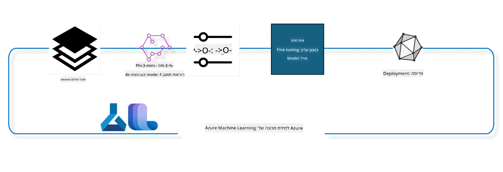

## איך להשתמש ברכיבי השלמת-צ'אט מרשם המערכת של Azure ML כדי לכוון דגם

בדוגמה זו נבצע כיוון עדין של הדגם Phi-3-mini-4k-instruct כדי להשלים שיחה בין 2 אנשים באמצעות מערך הנתונים ultrachat_200k.



הדוגמה תראה כיצד לבצע כיוון עדין באמצעות Azure ML SDK ופייתון ואז לפרוס את הדגם המכוון לקצה מקוון לאינפרנציה בזמן אמת.

### נתוני אימון

נשתמש במערך הנתונים ultrachat_200k. זהו גרסה מסוננת מאוד של מערך UltraChat ששימשה לאימון Zephyr-7B-β, דגם שיחה מתקדם בגודל 7B.

### דגם

נשתמש בדגם Phi-3-mini-4k-instruct כדי להראות כיצד המשתמש יכול לכוון דגם למשימת השלמת שיחה. אם פתחת את המחברת הזו מכרטיס דגם ספציפי, זכור להחליף את שם הדגם הספציפי.

### משימות

- לבחור דגם לכיוון עדין.
- לבחור ולחקור את נתוני האימון.
- להגדיר את משימת הכיוון העדין.
- להריץ את משימת הכיוון העדין.
- לבדוק מדדי אימון והערכה.
- לרשום את הדגם המכוון.
- לפרוס את הדגם המכוון לאינפרנציה בזמן אמת.
- לנקות משאבים.

## 1. הגדרת דרישות מקדימות

- התקנת תלותים
- התחברות לסביבת העבודה של AzureML. למידע נוסף, עיין ב: הקמת אימות SDK. החלף את <WORKSPACE_NAME>, <RESOURCE_GROUP> ו- <SUBSCRIPTION_ID> להלן.
- התחברות לרשם המערכת של azureml
- הגדרת שם ניסוי אופציונלי
- בדיקת חישוב או יצירתו.

> [!NOTE]
> דרישות: צומת GPU יחיד יכול להכיל מספר כרטיסי GPU. לדוגמה, בצומת אחד מסוג Standard_NC24rs_v3 יש 4 יחידות NVIDIA V100, בעוד שב-Standard_NC12s_v3 יש 2 יחידות NVIDIA V100. עיין בתיעוד למידע זה. מספר כרטיסי ה-GPU לצומת מוגדר בפרמטר gpus_per_node להלן. הגדרת ערך זה נכון תבטיח שימוש בכל כרטיסי ה-GPU בצומת. ניתן למצוא את ה-SKU המומלצים לחישובי GPU כאן וכאן.

### ספריות פייתון

התקן את התלויות על ידי הרצת התא הבאה. זו אינה שלב אופציונלי בסביבה חדשה.

```bash
pip install azure-ai-ml
pip install azure-identity
pip install datasets==2.9.0
pip install mlflow
pip install azureml-mlflow
```

### אינטראקציה עם Azure ML

1. סקריפט פייתון זה משמש לאינטראקציה עם שירות Azure Machine Learning (Azure ML). הנה פירוט מה שהוא עושה:

    - מייבא מודולים נדרשים מתוך azure.ai.ml, azure.identity ו-azure.ai.ml.entities. בנוסף מייבא את מודול time.

    - מנסה לאמת באמצעות DefaultAzureCredential(), המספק חווית אימות פשוטה להתחלת פיתוח יישומים המופעלים בענן Azure. אם כשל, עוברים ל-InteractiveBrowserCredential(), המספק כניסת משתמש אינטראקטיבית.

    - מנסה ליצור מופע MLClient באמצעות from_config, השואב את ההגדרות מקובץ התצורה המוגדר כברירת מחדל (config.json). אם כשל, יוצר MLClient באופן ידני עם subscription_id, resource_group_name ושם סביבת העבודה.

    - יוצר מופע MLClient נוסף עבור רשם Azure ML בשם "azureml". כאן מאוחסנים דגמים, pipelines לכיוון עדין וסביבות.

    - מגדיר את experiment_name ל-"chat_completion_Phi-3-mini-4k-instruct".

    - מייצר חותמת זמן ייחודית על ידי המרת הזמן הנוכחי (בשניות מאז האפוקה, כנקודה צפה) למספר שלם ואז למחרוזת. חותמת זמן זו משמשת ליצירת שמות וגרסאות ייחודיים.

    ```python
    # ייבא מודולים נחוצים מ-Azure ML ומ-Azure Identity
    from azure.ai.ml import MLClient
    from azure.identity import (
        DefaultAzureCredential,
        InteractiveBrowserCredential,
    )
    from azure.ai.ml.entities import AmlCompute
    import time  # ייבא את מודול הזמן
    
    # נסה לאמת באמצעות DefaultAzureCredential
    try:
        credential = DefaultAzureCredential()
        credential.get_token("https://management.azure.com/.default")
    except Exception as ex:  # אם DefaultAzureCredential נכשל, השתמש ב-InteractiveBrowserCredential
        credential = InteractiveBrowserCredential()
    
    # נסה ליצור מופע של MLClient באמצעות קובץ תצורה ברירת מחדל
    try:
        workspace_ml_client = MLClient.from_config(credential=credential)
    except:  # אם זה נכשל, צור מופע MLClient על ידי הזנת הפרטים ידנית
        workspace_ml_client = MLClient(
            credential,
            subscription_id="<SUBSCRIPTION_ID>",
            resource_group_name="<RESOURCE_GROUP>",
            workspace_name="<WORKSPACE_NAME>",
        )
    
    # צור מופע נוסף של MLClient לרשומת Azure ML בשם "azureml"
    # רשומה זו היא המקום שבו נשמרים מודלים, צינורות כיוונון ועצות
    registry_ml_client = MLClient(credential, registry_name="azureml")
    
    # הגדר את שם הניסוי
    experiment_name = "chat_completion_Phi-3-mini-4k-instruct"
    
    # צור חותמת זמן ייחודית שניתן להשתמש בה לשמות ולגרסאות שצריכות להיות ייחודיות
    timestamp = str(int(time.time()))
    ```

## 2. בחירת דגם בסיס לכיוון עדין

1. Phi-3-mini-4k-instruct הוא דגם קל משקל, מתקדם, עם 3.8 מיליארד פרמטרים, שנבנה על בסיס מערכי הנתונים ששימשו את Phi-2. הדגם שייך למשפחת דגמי Phi-3, והגרסת Mini מגיעה בשני ווריאנטים 4K ו-128K של אורך ההקשר (במונחי טוקנים) הנתמך. יש לכוון את הדגם למטרה הספציפית שלנו לשימוש. ניתן לעיין בדגמים אלה בקטלוג הדגמים ב-AzureML Studio, מסוננים על פי משימת השלמת שיחה. בדוגמה זו נשתמש בדגם Phi-3-mini-4k-instruct. אם פתחת את המחברת עבור דגם אחר, החלף ישירות את שם הדגם והגרסה.

> [!NOTE]
> מזהה הדגם (model id) שלו. זה יועבר כקלט למשימת הכיוון העדין. זה זמין גם כשדה Asset ID בדף פרטי הדגם בקטלוג הדגמים ב-AzureML Studio.

2. סקריפט הפייתון הזה מתקשר עם שירות Azure Machine Learning (Azure ML). להלן פירוט מה שהוא עושה:

    - מגדיר את model_name ל-"Phi-3-mini-4k-instruct".

    - משתמש בשיטת get של models ב-registry_ml_client כדי להביא את הגרסה האחרונה של הדגם בשם שצויין מרשם Azure ML. שיטת get קוראת עם שני ארגומנטים: שם הדגם ותווית המצוינת להבאת הגרסה העדכנית ביותר.

    - מדפיס למסך הודעה עם שם, גרסה ומזהה הדגם שישמש לכיוון עדין. משתמש בשיטת format של המחרוזת כדי להכניס את שם, גרסה ומזהה הדגם להודעה. השם, הגרסה ומזהה הדגם נגישים כרכיבי foundation_model.

    ```python
    # הגדר את שם המודל
    model_name = "Phi-3-mini-4k-instruct"
    
    # קבל את הגרסה העדכנית ביותר של המודל מרשימת Azure ML
    foundation_model = registry_ml_client.models.get(model_name, label="latest")
    
    # הדפס את שם המודל, הגרסה והזיהוי
    # מידע זה שימושי למעקב ולאיתור שגיאות
    print(
        "\n\nUsing model name: {0}, version: {1}, id: {2} for fine tuning".format(
            foundation_model.name, foundation_model.version, foundation_model.id
        )
    )
    ```

## 3. יצירת חישוב לשימוש במשימה

משימת הכיוון העדין פועלת רק עם חישוב GPU. גודל החישוב תלוי בגודל הדגם וברוב המקרים קשה לזהות את החישוב המתאים. בתא זה אנו מדריכים את המשתמש לבחור את החישוב המתאים למשימה.

> [!NOTE]
> החישובים המפורטים להלן עובדים עם הקונפיגורציה המיטבית ביותר. כל שינוי בקונפיגורציה עלול לגרום לשגיאת Cuda Out Of Memory. במקרים כאלה, מומלץ לשדרג את החישוב לגודל גדול יותר.

> [!NOTE]
> בבחירת compute_cluster_size להלן, וודא שהחישוב זמין בקבוצת המשאבים שלך. אם חישוב מסוים אינו זמין, תוכל לבקש גישה למשאבי החישוב.

### בדיקת תמיכה בכיוון עדין בדגם

1. סקריפט פייתון זה מתקשר עם דגם Azure Machine Learning (Azure ML). להלן פירוט מה שהוא עושה:

    - מייבא את מודול ast, המספק פונקציות לעיבוד עצי תחביר אבסטרקטיים של פייתון.

    - בודק אם לאובייקט foundation_model (שמסמל דגם ב-Azure ML) קיימת תגית בשם finetune_compute_allow_list. תגיות ב-Azure ML הן זוגות מפתח-ערך שניתן להשתמש בהם לסינון ומיון דגמים.

    - אם קיימת תגית finetune_compute_allow_list, משתמש בפונקציה ast.literal_eval כדי לפרש בבטחה את ערך התגית (מחרוזת) כרשימת פייתון. רשימה זו נשמרת במשתנה computes_allow_list. לאחר מכן מדפיס הודעה שממליצה ליצור חישוב מתוך הרשימה.

    - אם תגית finetune_compute_allow_list אינה קיימת, מגדיר את computes_allow_list ל-None ומדפיס הודעה המתארת כי תגית זו אינה חלק מתגיות הדגם.

    - לסיכום, סקריפט זה בודק תגית ספציפית במטא-דטה של הדגם, ממיר את ערכה לרשימה אם קיימת, ומספק משוב למשתמש.

    ```python
    # ייבא את מודול ast, המספק פונקציות לעיבוד עצי הדקדוק המופשט של פייתון
    import ast
    
    # בדוק אם התג 'finetune_compute_allow_list' קיים בתגיות של המודל
    if "finetune_compute_allow_list" in foundation_model.tags:
        # אם התג קיים, השתמש ב- ast.literal_eval כדי לפרש בצורה בטוחה את הערך של התג (מחרוזת) לרשימה בפייתון
        computes_allow_list = ast.literal_eval(
            foundation_model.tags["finetune_compute_allow_list"]
        )  # המרת מחרוזת לרשימת פייתון
        # הדפס הודעה המציינת שצריך ליצור חישוב מהרשימה
        print(f"Please create a compute from the above list - {computes_allow_list}")
    else:
        # אם התג לא קיים, הגדר את computes_allow_list ל- None
        computes_allow_list = None
        # הדפס הודעה המציינת שהתג 'finetune_compute_allow_list' אינו חלק מהתגיות של המודל
        print("`finetune_compute_allow_list` is not part of model tags")
    ```

### בדיקת מופע חישוב

1. סקריפט פייתון זה מתקשר עם שירות Azure Machine Learning (Azure ML) ומבצע בדיקות שונות על מופע חישוב. להלן פירוט מה שהוא עושה:

    - מנסה להביא את מופע החישוב עם שם המאוחסן במשתנה compute_cluster מסביבת העבודה של Azure ML. אם מצב ההקצאה של מופע החישוב הוא "failed", מעלה ValueError.

    - בודק אם computes_allow_list שונה מ-None. אם כן, ממיר את כל גדלי החישוב ברשימה לאותיות קטנות ובודק אם גודל מופע החישוב הנוכחי נמצא ברשימה. אם לא, מעלה ValueError.

    - אם computes_allow_list הוא None, בודק אם גודל מופע החישוב נמצא ברשימת גדלים לא נתמכים של מכונות GPU. אם כן, מעלה ValueError.

    - מביא רשימה של כל גדלי החישוב הזמינים בסביבת העבודה. לאחר מכן עובר על הרשימה, ולכל גודל בודק אם שמו תואם לגודל מופע החישוב הנוכחי. אם כן, מביא את מספר כרטיסי ה-GPU עבור אותו גודל ומגדיר gpu_count_found ל-True.

    - אם gpu_count_found הוא True, מדפיס את מספר כרטיסי ה-GPU במופע החישוב. אם False, מעלה ValueError.

    - לסיכום, סקריפט זה מבצע בדיקות שונות על מופע חישוב בסביבת Azure ML, כולל בדיקת מצב ההקצאה, גודלו ביחס לרשימות חריגות ומספר כרטיסי ה-GPU.

    ```python
    # הדפס את הודעת החריגה
    print(e)
    # העלה ValueError אם גודל המחשב אינו זמין במרחב העבודה
    raise ValueError(
        f"WARNING! Compute size {compute_cluster_size} not available in workspace"
    )
    
    # שלוף את מופע המחשב ממרחב העבודה של Azure ML
    compute = workspace_ml_client.compute.get(compute_cluster)
    # בדוק אם מצב הפרוביזיה של מופע המחשב הוא "failed"
    if compute.provisioning_state.lower() == "failed":
        # העלה ValueError אם מצב הפרוביזיה הוא "failed"
        raise ValueError(
            f"Provisioning failed, Compute '{compute_cluster}' is in failed state. "
            f"please try creating a different compute"
        )
    
    # בדוק אם computes_allow_list אינו None
    if computes_allow_list is not None:
        # המיר את כל גדלי המחשב ב-computes_allow_list לאותיות קטנות
        computes_allow_list_lower_case = [x.lower() for x in computes_allow_list]
        # בדוק אם גודל מופע המחשב נמצא ב-computes_allow_list_lower_case
        if compute.size.lower() not in computes_allow_list_lower_case:
            # העלה ValueError אם גודל מופע המחשב אינו ב-computes_allow_list_lower_case
            raise ValueError(
                f"VM size {compute.size} is not in the allow-listed computes for finetuning"
            )
    else:
        # הגדר רשימת גדלים לא נתמכי GPU VM
        unsupported_gpu_vm_list = [
            "standard_nc6",
            "standard_nc12",
            "standard_nc24",
            "standard_nc24r",
        ]
        # בדוק אם גודל מופע המחשב נמצא ב-unsupported_gpu_vm_list
        if compute.size.lower() in unsupported_gpu_vm_list:
            # העלה ValueError אם גודל מופע המחשב נמצא ב-unsupported_gpu_vm_list
            raise ValueError(
                f"VM size {compute.size} is currently not supported for finetuning"
            )
    
    # אתחל דגל לבדיקת מציאת מספר ה-GPU במופע המחשב
    gpu_count_found = False
    # שלוף רשימה של כל גדלי המחשב הזמינים במרחב העבודה
    workspace_compute_sku_list = workspace_ml_client.compute.list_sizes()
    available_sku_sizes = []
    # עבור על רשימת גדלי המחשב הזמינים
    for compute_sku in workspace_compute_sku_list:
        available_sku_sizes.append(compute_sku.name)
        # בדוק אם שם גודל המחשב תואם לגודל מופע המחשב
        if compute_sku.name.lower() == compute.size.lower():
            # אם כן, שלוף את מספר ה-GPU עבור גודל המחשב הזה והגדר gpu_count_found ל-True
            gpus_per_node = compute_sku.gpus
            gpu_count_found = True
    # אם gpu_count_found הוא True, הדפס את מספר ה-GPU במופע המחשב
    if gpu_count_found:
        print(f"Number of GPU's in compute {compute.size}: {gpus_per_node}")
    else:
        # אם gpu_count_found הוא False, העלה ValueError
        raise ValueError(
            f"Number of GPU's in compute {compute.size} not found. Available skus are: {available_sku_sizes}."
            f"This should not happen. Please check the selected compute cluster: {compute_cluster} and try again."
        )
    ```

## 4. בחירת מערך הנתונים לכיוון עדין של הדגם

1. אנו משתמשים במערך ultrachat_200k. למערך ארבעה חלקים, מתאימים לכיוון עדין מפוקח (sft). דירוג יצירתיות (gen). מספר הדוגמאות בכל חלק מוצג כך:

    ```bash
    train_sft test_sft  train_gen  test_gen
    207865  23110  256032  28304
    ```

1. התאים הבאים מציגים הכנת נתונים בסיסית לכיוון עדין:

### הצגת שורות נתונים לדוגמה

רוצים שהדוגמה הזו תרוץ מהר, לכן נשמור קבצי train_sft ו-test_sft המכילים 5% בלבד מהשורות הממוינות כבר. משמעות הדבר היא שלדגם המכוון יהיה דיוק נמוך יותר, לכן אסור להשתמש בו במקרים אמיתיים.
הסקריפט download-dataset.py משמש להורדת מערך הנתונים ultrachat_200k ולהמרת הנתונים לפורמט הנצרך על ידי רכיבי צינור הכיוון העדין. מכיוון שמדובר במערך גדול, אנו כאן מציגים רק חלק מהמערך.

1. הרצת הסקריפט להלן מורידה רק 5% מהנתונים. ניתן להגדיל זאת על ידי שינוי הפרמטר dataset_split_pc לאחוז הרצוי.

> [!NOTE]
> לחלק מדגמי השפה יש קודי שפה שונים ולכן שמות העמודות במערך הנתונים צריכים לשקף זאת.

1. כך נראה דוגמה לנתונים
מערך נתוני השלמת-השיחה נשמר בפורמט parquet כאשר כל רשומה משתמשת במבנה הבא:

    - זהו מסמך JSON (JavaScript Object Notation), פורמט נפוץ לחילוף מידע. זה אינו קוד הרצה, אלא דרך לאחסן ולהעביר נתונים. להלן מבנהו:

    - "prompt": מפתח זה מחזיק מחרוזת המייצגת משימה או שאלה שמוגשת לעוזר ה-AI.

    - "messages": מפתח זה מחזיק מערך אובייקטים. כל אובייקט מייצג הודעה בשיחה בין משתמש לעוזר AI. לכל אובייקט הודעה שני מפתחות:

    - "content": מפתח זה מחזיק מחרוזת שמייצגת את תוכן ההודעה.
    - "role": מפתח זה מחזיק מחרוזת שמייצגת את תפקיד השולח - יכול להיות "user" או "assistant".
    - "prompt_id": מפתח זה מחזיק מחרוזת שמייצגת מזהה ייחודי עבור ה-prompt.

1. במסמך JSON הספציפי הזה, מוצגת שיחה שבה המשתמש מבקש מהעוזר ליצור גיבור לסיפור דיסטופי. העוזר מגיב, ואז המשתמש מבקש פרטים נוספים. העוזר מסכים לספק פרטים נוספים. כל השיחה מקושרת ל-prompt_id מסוים.

    ```python
    {
        // The task or question posed to an AI assistant
        "prompt": "Create a fully-developed protagonist who is challenged to survive within a dystopian society under the rule of a tyrant. ...",
        
        // An array of objects, each representing a message in a conversation between a user and an AI assistant
        "messages":[
            {
                // The content of the user's message
                "content": "Create a fully-developed protagonist who is challenged to survive within a dystopian society under the rule of a tyrant. ...",
                // The role of the entity that sent the message
                "role": "user"
            },
            {
                // The content of the assistant's message
                "content": "Name: Ava\n\n Ava was just 16 years old when the world as she knew it came crashing down. The government had collapsed, leaving behind a chaotic and lawless society. ...",
                // The role of the entity that sent the message
                "role": "assistant"
            },
            {
                // The content of the user's message
                "content": "Wow, Ava's story is so intense and inspiring! Can you provide me with more details.  ...",
                // The role of the entity that sent the message
                "role": "user"
            }, 
            {
                // The content of the assistant's message
                "content": "Certainly! ....",
                // The role of the entity that sent the message
                "role": "assistant"
            }
        ],
        
        // A unique identifier for the prompt
        "prompt_id": "d938b65dfe31f05f80eb8572964c6673eddbd68eff3db6bd234d7f1e3b86c2af"
    }
    ```

### הורדת הנתונים

1. סקריפט פייתון זה משמש להורדת מערך נתונים באמצעות סקריפט עזר בשם download-dataset.py. להלן פירוט מה שהוא עושה:

    - מייבא את מודול os, המספק דרך ניידת לשימוש בפונקציות התלויות במערכת ההפעלה.

    - משתמש ב-os.system כדי להריץ את סקריפט download-dataset.py עם ארגומנטים מסוימים במעטפת הפקודות. הארגומנטים מגדירים את המערך להורדה (HuggingFaceH4/ultrachat_200k), את התיקייה להורדה (ultrachat_200k_dataset) ואת אחוז הפיצול של הנתונים (5). הפונקציה os.system מחזירה את סטטוס היציאה של הפקודה; סטטוס זה נשמר במשתנה exit_status.

    - בודק אם exit_status שונה מ-0. במערכות הפעלה מבוססות יוניקס, סטטוס יציאה 0 מייצג הצלחה, וכל ערך אחר מייצג שגיאה. אם exit_status שונה מ-0, מעלה Exception עם הודעה על שגיאה בהורדת המערך.

    - לסיכום, סקריפט זה מריץ פקודה להורדת מערך נתונים באמצעות סקריפט עזר, ומעלה חריגה אם הפקודה נכשלת.
    
    ```python
    # ייבא את מודול os, המספק דרך להשתמש בפונקציונליות התלויית במערכת ההפעלה
    import os
    
    # השתמש בפונקציה os.system כדי להריץ את הסקריפט download-dataset.py ב-shell עם ארגומנטים ספציפיים בשורת הפקודה
    # הארגומנטים מגדירים את מערך הנתונים להורדה (HuggingFaceH4/ultrachat_200k), את התיקיה שבה יורד (ultrachat_200k_dataset), ואת האחוז של מערך הנתונים לחלוקה (5)
    # הפונקציה os.system מחזירה את סטטוס היציאה של הפקודה שהיא הריצה; סטטוס זה נשמר במשתנה exit_status
    exit_status = os.system(
        "python ./download-dataset.py --dataset HuggingFaceH4/ultrachat_200k --download_dir ultrachat_200k_dataset --dataset_split_pc 5"
    )
    
    # בדוק אם exit_status אינו 0
    # במערכות הפעלה בסגנון Unix, סטטוס יציאה 0 בדרך כלל מציין שהפקודה הצליחה, בעוד שכל מספר אחר מציין שגיאה
    # אם exit_status אינו 0, זרוק חריגה עם הודעה המציינת שנגרמה שגיאה בהורדת מערך הנתונים
    if exit_status != 0:
        raise Exception("Error downloading dataset")
    ```

### טעינת הנתונים ל-DataFrame
1. סקריפט פייתון זה טוען קובץ JSON Lines לתוך DataFrame של pandas ומציג את 5 השורות הראשונות. להלן פירוט מה שהוא מבצע:

    - מייבא את ספריית pandas, שהיא ספרייה עוצמתית לעיבוד וניתוח נתונים.

    - מגדיר את רוחב העמודה המקסימלי באפשרויות התצוגה של pandas ל-0. משמעות הדבר היא שהטקסט המלא של כל עמודה יוצג ללא קיצור בעת הדפסת ה-DataFrame.

    - משתמש בפונקציית pd.read_json כדי לטעון את הקובץ train_sft.jsonl מתיקיית ultrachat_200k_dataset לתוך DataFrame. הפרמטר lines=True מציין שהקובץ נמצא בפורמט JSON Lines, שבו כל שורה היא אובייקט JSON נפרד.

    - משתמש בשיטה head להצגת 5 השורות הראשונות של ה-DataFrame. אם ל-DataFrame יש פחות מ-5 שורות, יוצגו כולן.

    - בסיכום, סקריפט זה טוען קובץ JSON Lines לתוך DataFrame ומציג את 5 השורות הראשונות עם הטקסט המלא של העמודות.
    
    ```python
    # ייבא את ספריית pandas, שהיא ספרייה חזקה לעיבוד וניתוח נתונים
    import pandas as pd
    
    # הגדר את רוחב העמודה המקסימלי באפשרויות התצוגה של pandas ל-0
    # משמעות הדבר היא שכל הטקסט של כל עמודה יוצג ללא קיצור כאשר DataFrame יודפס
    pd.set_option("display.max_colwidth", 0)
    
    # השתמש בפונקציה pd.read_json כדי לטעון את הקובץ train_sft.jsonl מתוך תיקיית ultrachat_200k_dataset אל תוך DataFrame
    # הפרמטר lines=True מציין שהקובץ הוא בפורמט JSON Lines, שבו כל שורה היא אובייקט JSON נפרד
    df = pd.read_json("./ultrachat_200k_dataset/train_sft.jsonl", lines=True)
    
    # השתמש בשיטה head כדי להציג את 5 השורות הראשונות של ה-DataFrame
    # אם ל-DataFrame יש פחות מ-5 שורות, הוא יציג את כולן
    df.head()
    ```

## 5. הגשת משימת הכוונון המדויק באמצעות המודל והנתונים כקלטים

צור את המשימה שמשתמשת ברכיב צינור השלמת הצ'אט. למדו עוד על כל הפרמטרים הנתמכים לכוונון מדויק.

### הגדרת פרמטרי כוונון מדויק

1. פרמטרי כוונון מדויק ניתן לחלק ל-2 קטגוריות – פרמטרי אימון ופרמטרי אופטימיזציה

1. פרמטרי אימון מגדירים את ההיבטים של האימון כגון -

    - האופטימייזר, המתזמן לשימוש
    - המדד לאופטימיזציה של הכוונון המדויק
    - מספר שלבי האימון וגודל האצווה וכן הלאה
    - פרמטרי אופטימיזציה מסייעים באופטימיזציה של זיכרון GPU ובשימוש יעיל במשאבי המחשב.

1. למטה כמה מהפרמטרים המשתייכים לקטגוריה זו. פרמטרי האופטימיזציה משתנים בין דגם לדגם ומלווים בחבילה עם המודל לטיפול בשינויים אלו.

    - הפעלת deepspeed ו-LoRA
    - הפעלת אימון בקירוב דיוק מעורב
    - הפעלת אימון מרובה צמתים

> [!NOTE]
> כוונון מפוקח עלול לגרום לאובדן התאמה או שכחה קטסטרופלית. אנו ממליצים לבדוק בעיה זו ולהריץ שלב התאמה לאחר הכוונון המדויק.

### פרמטרי כוונון מדויק

1. סקריפט פייתון זה מגדיר פרמטרים לכוונון מדויק של מודל למידת מכונה. להלן הפירוט:

    - מגדיר פרמטרי אימון ברירת מחדל כגון מספר אפוקים של אימון, גדלי אצווה לאימון והערכה, קצב למידה וסוג מתזמן קצב הלמידה.

    - מגדיר פרמטרי אופטימיזציה ברירת מחדל כגון האם להפעיל Layer-wise Relevance Propagation (LoRa) ו-DeepSpeed, ושלב DeepSpeed.

    - משלב את פרמטרי האימון והאופטימיזציה למילון יחיד בשם finetune_parameters.

    - בודק אם foundation_model מכיל פרמטרי ברירת מחדל ספציפיים למודל. אם כן, מדפיס הודעת אזהרה ומעדכן את מילון finetune_parameters עם ברירות המחדל הספציפיות למודל. הפונקציה ast.literal_eval משמשת להמרת הברירות מחדל הספציפיות למודל משרשרת טקסט למילון פייתון.

    - מדפיס את מערך הפרמטרים הסופי לכוונון המדויק שיופעל להרצה.

    - בסיכום, סקריפט זה מגדיר ומציג את הפרמטרים לכוונון מדויק של מודל למידת מכונה, עם אפשרות לדרוס את ברירות המחדל באמצעות פרמטרים ספציפיים למודל.

    ```python
    # הגדר פרמטרי אימון ברירת מחדל כמו מספר האפוקים, גדלי האצוות לאימון והערכה, קצב הלמידה, וסוג מתזמן קצב הלמידה
    training_parameters = dict(
        num_train_epochs=3,
        per_device_train_batch_size=1,
        per_device_eval_batch_size=1,
        learning_rate=5e-6,
        lr_scheduler_type="cosine",
    )
    
    # הגדר פרמטרי אופטימיזציה ברירת מחדל כמו האם להחיל Layer-wise Relevance Propagation (LoRa) ו-DeepSpeed, ושלב ה-DeepSpeed
    optimization_parameters = dict(
        apply_lora="true",
        apply_deepspeed="true",
        deepspeed_stage=2,
    )
    
    # שלב את פרמטרי האימון והאופטימיזציה למילון יחיד בשם finetune_parameters
    finetune_parameters = {**training_parameters, **optimization_parameters}
    
    # בדוק אם ל-foundation_model יש פרמטרי ברירת מחדל ספציפיים למודל
    # אם כן, הדפס הודעת אזהרה ועדכן את מילון ה-finetune_parameters עם ברירות מחדל אלה הספציפיות למודל
    # הפונקציה ast.literal_eval משמשת להמיר את ברירות המחדל הספציפיות למודל ממחרוזת למילון פייתון
    if "model_specific_defaults" in foundation_model.tags:
        print("Warning! Model specific defaults exist. The defaults could be overridden.")
        finetune_parameters.update(
            ast.literal_eval(  # המרת מחרוזת למילון פייתון
                foundation_model.tags["model_specific_defaults"]
            )
        )
    
    # הדפס את קבוצת פרמטרי הכוונון הסופית שתשמש להרצה
    print(
        f"The following finetune parameters are going to be set for the run: {finetune_parameters}"
    )
    ```

### צינור אימון

1. סקריפט פייתון זה מגדיר פונקציה ליצירת שם תצוגה לצינור אימון למידת מכונה, ואז קורא לפונקציה זו ליצירת שם התצוגה והדפסתו. להלן פירוט:

1. מוגדרת פונקציית get_pipeline_display_name. פונקציה זו יוצרת שם תצוגה המבוסס על פרמטרים שונים הקשורים לצינור האימון.

1. בתוך הפונקציה מחושב גודל האצווה הכולל על ידי הכפלת גודל האצווה לכל מכשיר, מספר שלבי צבירת הגרדיאנט, מספר ה-GPUs לכל צומת ומספר הצמתים שבהם משתמשים לכוונון מדויק.

1. מושכים פרמטרים נוספים כמו סוג מתזמן קצב הלמידה, האם DeepSpeed מופעל, שלב DeepSpeed, האם LoRa מופעל, המגבלה על מספר נקודות ביקורת לשמירה, ואורך הרצף המקסימלי.

1. יוצרת מחרוזת הכוללת את כל הפרמטרים הללו, מופרדת בקו-מקף. אם DeepSpeed או LoRa מופעלים, המחרוזת כוללת "ds" ואחריו שלב DeepSpeed, או "lora", בהתאמה. אחרת, כוללת "nods" או "nolora", בהתאמה.

1. הפונקציה מחזירה מחרוזת זו, המשמשת כשם התצוגה לצינור האימון.

1. לאחר הגדרת הפונקציה, היא נקראת ליצירת שם התצוגה, ולאחר מכן מדפיסה אותו.

1. לסיכום, סקריפט זה יוצר שם תצוגה לצינור אימון למידת מכונה בהתבסס על פרמטרים שונים, ואז מדפיס את שם התצוגה.

    ```python
    # הגדר פונקציה ליצירת שם תצוגה לצינור האימון
    def get_pipeline_display_name():
        # חשב את גודל האצווה הכולל על ידי כפל גודל האצווה לכל מכשיר, מספר שלבי הצטברות הגרדיאנט, מספר כרטיסי ה-GPU לכל צומת ומספר הצמתים המשמשים לכיול עדין
        batch_size = (
            int(finetune_parameters.get("per_device_train_batch_size", 1))
            * int(finetune_parameters.get("gradient_accumulation_steps", 1))
            * int(gpus_per_node)
            * int(finetune_parameters.get("num_nodes_finetune", 1))
        )
        # שלוף את סוג לו"ז קצב הלמידה
        scheduler = finetune_parameters.get("lr_scheduler_type", "linear")
        # שלוף האם DeepSpeed מיושם
        deepspeed = finetune_parameters.get("apply_deepspeed", "false")
        # שלוף את שלב DeepSpeed
        ds_stage = finetune_parameters.get("deepspeed_stage", "2")
        # אם DeepSpeed מיושם, כלול "ds" ואחריו את שלב DeepSpeed בשם התצוגה; אם לא, כלול "nods"
        if deepspeed == "true":
            ds_string = f"ds{ds_stage}"
        else:
            ds_string = "nods"
        # שלוף האם נוהל הפצת הרלוונטיות לפי שכבות (LoRa) מיושם
        lora = finetune_parameters.get("apply_lora", "false")
        # אם LoRa מיושם, כלול "lora" בשם התצוגה; אם לא, כלול "nolora"
        if lora == "true":
            lora_string = "lora"
        else:
            lora_string = "nolora"
        # שלוף את המגבלה על מספר נקודות הבדיקה של המודל לשמירה
        save_limit = finetune_parameters.get("save_total_limit", -1)
        # שלוף את האורך המקסימלי של הרצף
        seq_len = finetune_parameters.get("max_seq_length", -1)
        # בנה את שם התצוגה על ידי שרשור כל הפרמטרים האלה, מופרדים בקוים
        return (
            model_name
            + "-"
            + "ultrachat"
            + "-"
            + f"bs{batch_size}"
            + "-"
            + f"{scheduler}"
            + "-"
            + ds_string
            + "-"
            + lora_string
            + f"-save_limit{save_limit}"
            + f"-seqlen{seq_len}"
        )
    
    # קרא לפונקציה ליצירת שם התצוגה
    pipeline_display_name = get_pipeline_display_name()
    # הדפס את שם התצוגה
    print(f"Display name used for the run: {pipeline_display_name}")
    ```

### קונפיגורציית הצינור

סקריפט פייתון זה מגדיר ומגדיר צינור למידת מכונה באמצעות Azure Machine Learning SDK. להלן הפירוט:

1. מייבא מודולים נחוצים מ-Azure AI ML SDK.

1. מושך רכיב צינור בשם "chat_completion_pipeline" מהרשימה.

1. מגדיר משימת צינור באמצעות הקישוט `@pipeline` והפונקציה `create_pipeline`. שם הצינור מוגדר ל-`pipeline_display_name`.

1. בתוך פונקציית `create_pipeline`, מאתחל את הרכיב שהושקע עם פרמטרים שונים, ביניהם נתיב המודל, אשכולות מחשוב לשלבים שונים, חלקי מערך נתונים לאימון ולבדיקה, מספר GPUs לשימוש לכוונון מדויק ופרמטרים נוספים.

1. ממפה את הפלט של משימת הכוונון המדויק לפלט של משימת הצינור. זאת כדי לאפשר רישום קל של המודל עם הכוונון המדויק, שנדרש לפריסה של המודל לנקודת קצה מקוונת או באצ'ית.

1. יוצר מופע של הצינור באמצעות קריאה לפונקציית `create_pipeline`.

1. מגדיר את אופציית `force_rerun` של הצינור ל-`True`, כלומר לא ישתמש בתוצאות שמורות ממשימות קודמות.

1. מגדיר את אופציית `continue_on_step_failure` של הצינור ל-`False`, כלומר הצינור יעצור אם כל שלב נכשל.

1. לסיכום, סקריפט זה מגדיר ומקונפג צינור למידת מכונה למשימת השלמת צ'אט באמצעות Azure Machine Learning SDK.

    ```python
    # ייבא מודולים נחוצים מ- Azure AI ML SDK
    from azure.ai.ml.dsl import pipeline
    from azure.ai.ml import Input
    
    # משוך את רכיב הצינור בשם "chat_completion_pipeline" מהמחשב
    pipeline_component_func = registry_ml_client.components.get(
        name="chat_completion_pipeline", label="latest"
    )
    
    # הגדר את משימת הצינור באמצעות הדקורטור @pipeline והפונקציה create_pipeline
    # שם הצינור מוגדר כ- pipeline_display_name
    @pipeline(name=pipeline_display_name)
    def create_pipeline():
        # אתחל את רכיב הצינור שנמשך עם פרמטרים שונים
        # אלה כוללים את נתיב המודל, מקלחות חישוביות לשלבים שונים, חלוקות מערכי נתונים לאימון ובדיקה, מספר מעבדי GPU לשימוש באופטימיזציה מדוייקת ופרמטרים נוספים לאופטימיזציה
        chat_completion_pipeline = pipeline_component_func(
            mlflow_model_path=foundation_model.id,
            compute_model_import=compute_cluster,
            compute_preprocess=compute_cluster,
            compute_finetune=compute_cluster,
            compute_model_evaluation=compute_cluster,
            # מיפוי חלוקות מערכי הנתונים לפרמטרים
            train_file_path=Input(
                type="uri_file", path="./ultrachat_200k_dataset/train_sft.jsonl"
            ),
            test_file_path=Input(
                type="uri_file", path="./ultrachat_200k_dataset/test_sft.jsonl"
            ),
            # הגדרות אימון
            number_of_gpu_to_use_finetuning=gpus_per_node,  # מוגדר כמספר מעבדי ה-GPU הזמינים במחשב
            **finetune_parameters
        )
        return {
            # מיפוי הפלט של משימת האופטימיזציה לפלט של משימת הצינור
            # זאת נעשה כדי שנוכל להרשם בקלות למודל המותאם
            # רישום המודל נדרש כדי לפרוס את המודל לנקודת קצה מקוונת או בכמות גדולה
            "trained_model": chat_completion_pipeline.outputs.mlflow_model_folder
        }
    
    # צור מופע של הצינור על ידי קריאה לפונקציה create_pipeline
    pipeline_object = create_pipeline()
    
    # אל תשתמש בתוצאות שמורות ממשימות קודמות
    pipeline_object.settings.force_rerun = True
    
    # הגדר המשך על כשלון שלב ל- False
    # זה אומר שהצינור יפסיק אם כל שלב נכשל
    pipeline_object.settings.continue_on_step_failure = False
    ```

### הגשת המשימה

1. סקריפט פייתון זה מגיש משימת צינור למידת מכונה לסביבת Azure Machine Learning וממתין לסיום המשימה. להלן הפירוט:

    - קורא למתודת create_or_update של האובייקט jobs ב-workspace_ml_client כדי להגיש את משימת הצינור. הצינור שמורץ מוגדר על ידי pipeline_object, וניסוי ההרצה מוגדר על פי experiment_name.

    - לאחר מכן קורא למתודת stream של האובייקט jobs ב-workspace_ml_client כדי להמתין לסיום משימת הצינור. המשימה להמתין לה מוגדרת לפי מאפיין name של האובייקט pipeline_job.

    - לסיכום, סקריפט זה מגיש משימת צינור למידת מכונה לסביבת Azure Machine Learning, ואז ממתין לסיום המשימה.

    ```python
    # שלח את משימת הצנרת למרחב העבודה של Azure Machine Learning
    # צנרת להפעלה מוגדרת על ידי pipeline_object
    # הניסוי שבו מתבצעת המשימה מוגדר על ידי experiment_name
    pipeline_job = workspace_ml_client.jobs.create_or_update(
        pipeline_object, experiment_name=experiment_name
    )
    
    # המתן להשלמת משימת הצנרת
    # המשימה להמתין לה מוגדרת על ידי תכונת השם של אובייקט pipeline_job
    workspace_ml_client.jobs.stream(pipeline_job.name)
    ```

## 6. רישום המודל שעבר כוונון מדויק בסביבת העבודה

נרשום את המודל מתוך הפלט של משימת הכוונון המדויק. זה יעקוב אחרי קשרי שושלת בין המודל שעבר כוונון מדויק למשימת הכוונון. משימת הכוונון לעומת זאת, עוקבת אחר שושלת המודל הבסיסי, הנתונים וקוד האימון.

### רישום מודל ML

1. סקריפט פייתון זה רושם מודל למידת מכונה שאומן בצינור Azure Machine Learning. להלן הפירוט:

    - מייבא מודולים נחוצים מ-Azure AI ML SDK.

    - בודק האם הפלט trained_model זמין ממשימת הצינור על ידי קריאה למתודת get של האובייקט jobs ב-workspace_ml_client וגישה למאפיין outputs.

    - בונה נתיב למודל המאומן על ידי עיצוב מחרוזת עם שם משימת הצינור ושם הפלט ("trained_model").

    - מגדיר שם למודל שעבר כוונון מדויק על ידי הוספת "-ultrachat-200k" לשם המקורי של המודל והחלפת סימני "/" בקו-מקף.

    - מכין רישום מודל על ידי יצירת אובייקט Model עם פרמטרים שונים, ביניהם נתיב המודל, סוג המודל (מודל MLflow), שם וגירסת המודל ותיאור של המודל.

    - רושם את המודל באמצעות קריאה למתודת create_or_update של האובייקט models ב-workspace_ml_client עם אובייקט Model כארגעומנט.

    - מדפיס את המודל שנרשם.

1. לסיכום, סקריפט זה רושם מודל למידת מכונה שאומן בצינור Azure Machine Learning.

    ```python
    # ייבא מודולים נחוצים מ-SDK של Azure AI ML
    from azure.ai.ml.entities import Model
    from azure.ai.ml.constants import AssetTypes
    
    # בדוק אם הפלט `trained_model` זמין משיחת הצנרת
    print("pipeline job outputs: ", workspace_ml_client.jobs.get(pipeline_job.name).outputs)
    
    # צור נתיב למודל המאומן על ידי עיצוב מחרוזת עם שם שיחת הצנרת ושם הפלט ("trained_model")
    model_path_from_job = "azureml://jobs/{0}/outputs/{1}".format(
        pipeline_job.name, "trained_model"
    )
    
    # הגדר שם למודל המכוון על ידי צירוף "-ultrachat-200k" לשם המודל המקורי והחלפת כל הסלאשים בקווים מקפים
    finetuned_model_name = model_name + "-ultrachat-200k"
    finetuned_model_name = finetuned_model_name.replace("/", "-")
    
    print("path to register model: ", model_path_from_job)
    
    # התכונן לרישום המודל על ידי יצירת אובייקט Model עם פרמטרים שונים
    # אלו כוללים את הנתיב למודל, סוג המודל (מודל MLflow), שם וגרסת המודל, ותיאור המודל
    prepare_to_register_model = Model(
        path=model_path_from_job,
        type=AssetTypes.MLFLOW_MODEL,
        name=finetuned_model_name,
        version=timestamp,  # השתמש בחותמת זמן כגרסה כדי למנוע קונפליקט בגרסאות
        description=model_name + " fine tuned model for ultrachat 200k chat-completion",
    )
    
    print("prepare to register model: \n", prepare_to_register_model)
    
    # רשום את המודל על ידי קריאה לפונקציה create_or_update של האובייקט models ב-workspace_ml_client עם אובייקט Model כארגומנט
    registered_model = workspace_ml_client.models.create_or_update(
        prepare_to_register_model
    )
    
    # הדפס את המודל שנרשם
    print("registered model: \n", registered_model)
    ```

## 7. פריסה של המודל שעבר כוונון מדויק לנקודת קצה מקוונת

נקודות קצה מקוונות מספקות API REST עמיד שניתן להשתמש בו לשילוב עם יישומים הזקוקים להשתמש במודל.

### ניהול נקודת קצה

1. סקריפט פייתון זה יוצר נקודת קצה מקוונת מנוהלת ב-Azure Machine Learning עבור מודל שנרשם. להלן הפירוט:

    - מייבא מודולים נחוצים מ-Azure AI ML SDK.

    - מגדיר שם ייחודי לנקודת הקצה המקוונת על ידי הוספת טיימסטמפ למחרוזת "ultrachat-completion-".

    - מכין יצירת נקודת הקצה המקוונת באמצעות יצירת אובייקט ManagedOnlineEndpoint עם פרמטרים שונים, ביניהם שם נקודת הקצה, תיאור הנקודה, ומצב אימות ("key").

    - יוצר את נקודת הקצה המקוונת על ידי קריאה למתודת begin_create_or_update של workspace_ml_client עם אובייקט ManagedOnlineEndpoint כארגומנט. לאחר מכן ממתין לסיום הפעולה באמצעות קריאת wait.

1. לסיכום, סקריפט זה יוצר נקודת קצה מקוונת מנוהלת ב-Azure Machine Learning עבור מודל שנרשם.

    ```python
    # ייבא מודולים נדרשים מ-SDK של Azure AI ML
    from azure.ai.ml.entities import (
        ManagedOnlineEndpoint,
        ManagedOnlineDeployment,
        ProbeSettings,
        OnlineRequestSettings,
    )
    
    # הגדר שם ייחודי לנקודת הקצה המקוונת על ידי הוספת חותמת זמן למחרוזת "ultrachat-completion-"
    online_endpoint_name = "ultrachat-completion-" + timestamp
    
    # התכונן ליצירת נקודת קצה מקוונת על ידי יצירת אובייקט ManagedOnlineEndpoint עם פרמטרים שונים
    # אלה כוללים את שם נקודת הקצה, תיאור של נקודת הקצה ומצב אימות ("key")
    endpoint = ManagedOnlineEndpoint(
        name=online_endpoint_name,
        description="Online endpoint for "
        + registered_model.name
        + ", fine tuned model for ultrachat-200k-chat-completion",
        auth_mode="key",
    )
    
    # צור את נקודת הקצה המקוונת על ידי קריאה לפונקציה begin_create_or_update של workspace_ml_client עם אובייקט ManagedOnlineEndpoint כארגומנט
    # לאחר מכן המתן לסיום פעולת היצירה על ידי קריאה לפונקציה wait
    workspace_ml_client.begin_create_or_update(endpoint).wait()
    ```

> [!NOTE]
> ניתן למצוא כאן את רשימת SKU הנתמכת לפריסה - [רשימת SKU לנקודות קצה מקוונות מנוהלות](https://learn.microsoft.com/azure/machine-learning/reference-managed-online-endpoints-vm-sku-list)

### פריסת מודל למידת מכונה

1. סקריפט פייתון זה מפרוס מודל למידת מכונה שנרשם לנקודת קצה מקוונת מנוהלת ב-Azure Machine Learning. להלן הפירוט:

    - מייבא את מודול ast, המספק פונקציות לעיבוד עצי דקדוק תחבירי של פייתון.

    - מגדיר את סוג המופע לפריסה ל-"Standard_NC6s_v3".

    - בודק אם התג inference_compute_allow_list קיים במודל הבסיס. אם כן, ממיר את ערך התג משרשרת ליסטה בפייתון ומקצה אותו ל-inference_computes_allow_list. אם לא, מגדיר inference_computes_allow_list כ-None.

    - בודק אם סוג המופע שצוין נמצא ברשימת ההרשאה. אם לא, מדפיס הודעה למשתמש לבחור סוג מופע מתוך הרשימה המורשת.

    - מכין פריסה על ידי יצירת אובייקט ManagedOnlineDeployment עם פרמטרים שונים, ביניהם שם הפריסה, שם נקודת הקצה, מזהה המודל, סוג ומספר מופעים, הגדרות בדיקת חיים והגדרות בקשה.

    - יוצר את הפריסה באמצעות קריאה למתודת begin_create_or_update של workspace_ml_client עם אובייקט ManagedOnlineDeployment כארגומנט. לאחר מכן ממתין לסיום הפעולה באמצעות קריאת wait.

    - מגדיר את תעבורת הנקודה להפנות 100% מהתעבורה לפריסה בשם "demo".

    - מעדכן את נקודת הקצה באמצעות קריאה למתודת begin_create_or_update של workspace_ml_client עם אובייקט הנקודה כארגומנט. לאחר מכן ממתין לסיום העדכון באמצעות קריאת result.

1. לסיכום, סקריפט זה מפרוס מודל למידת מכונה שנרשם לנקודת קצה מקוונת מנוהלת ב-Azure Machine Learning.

    ```python
    # ייבא את מודול ast, המספק פונקציות לעיבוד עצי דקדוק מופשט של פייתון
    import ast
    
    # הגדר את סוג המופע עבור הפריסה
    instance_type = "Standard_NC6s_v3"
    
    # בדוק אם התג `inference_compute_allow_list` קיים במודל הבסיס
    if "inference_compute_allow_list" in foundation_model.tags:
        # אם כן, המר את ערך התג ממחרוזת לרשימת פייתון והקצה אותו ל-`inference_computes_allow_list`
        inference_computes_allow_list = ast.literal_eval(
            foundation_model.tags["inference_compute_allow_list"]
        )
        print(f"Please create a compute from the above list - {computes_allow_list}")
    else:
        # אם לא, הגדר את `inference_computes_allow_list` ל-`None`
        inference_computes_allow_list = None
        print("`inference_compute_allow_list` is not part of model tags")
    
    # בדוק אם סוג המופע שצויין נמצא ברשימת ההרשאות
    if (
        inference_computes_allow_list is not None
        and instance_type not in inference_computes_allow_list
    ):
        print(
            f"`instance_type` is not in the allow listed compute. Please select a value from {inference_computes_allow_list}"
        )
    
    # התכונן ליצירת הפריסה על ידי יצירת אובייקט `ManagedOnlineDeployment` עם פרמטרים שונים
    demo_deployment = ManagedOnlineDeployment(
        name="demo",
        endpoint_name=online_endpoint_name,
        model=registered_model.id,
        instance_type=instance_type,
        instance_count=1,
        liveness_probe=ProbeSettings(initial_delay=600),
        request_settings=OnlineRequestSettings(request_timeout_ms=90000),
    )
    
    # צור את הפריסה על ידי קריאה למתודה `begin_create_or_update` של `workspace_ml_client` עם האובייקט `ManagedOnlineDeployment` כטיעון
    # לאחר מכן המתן לסיום פעולת היצירה על ידי קריאה למתודה `wait`
    workspace_ml_client.online_deployments.begin_create_or_update(demo_deployment).wait()
    
    # הגדר את תנועת הנתונים בנקודת הקצה להפנות 100% מהתנועה לפריסת "demo"
    endpoint.traffic = {"demo": 100}
    
    # עדכן את נקודת הקצה על ידי קריאה למתודה `begin_create_or_update` של `workspace_ml_client` עם האובייקט `endpoint` כטיעון
    # לאחר מכן המתן לסיום פעולת העדכון על ידי קריאה למתודה `result`
    workspace_ml_client.begin_create_or_update(endpoint).result()
    ```

## 8. בדיקת נקודת הקצה עם דוגמת נתונים

נשלוף דוגמת נתונים ממערך הבדיקות ונגיש אותה לנקודת הקצה המקוונת למסקנה. לאחר מכן נציג את התוויות המתוכננות לצד תוויות האמת הקרקעית.

### קריאת התוצאות

1. סקריפט פייתון זה קורא קובץ JSON Lines ל-DataFrame של pandas, לוקח דגימה אקראית, ואפס את האינדקס. להלן הפירוט:

    - קורא את הקובץ ./ultrachat_200k_dataset/test_gen.jsonl ל-DataFrame של pandas. פונקציית read_json משמשת עם הפרמטר lines=True כי הקובץ בפורמט JSON Lines, שבו כל שורה היא אובייקט JSON נפרד.

    - לוקח דגימה אקראית של שורה אחת מתוך ה-DataFrame. פונקציית sample משמשת עם הפרמטר n=1 לציון מספר השורות האקראיות שיש לבחור.

    - מאפס את האינדקס של ה-DataFrame. פונקציית reset_index משמשת עם הפרמטר drop=True כדי להפטר מהאינדקס המקורי ולהחליפו באינדקס חדש של ערכי מספרים שלמים.

    - מציג את 2 השורות הראשונות של ה-DataFrame באמצעות פונקציית head עם הפרמטר 2. אולם, מכיוון שה-DataFrame מכיל שורה אחת בלבד לאחר הדגימה, יוצג רק שורה זו.

1. לסיכום, סקריפט זה קורא קובץ JSON Lines לתוך DataFrame של pandas, לוקח דגימה אקראית של שורה אחת, מאפס את האינדקס, ומציג את השורה הראשונה.
    
    ```python
    # ייבוא ספריית pandas
    import pandas as pd
    
    # קריאת קובץ JSON Lines './ultrachat_200k_dataset/test_gen.jsonl' אל תוך מסגרת נתונים של pandas
    # הפרמטר 'lines=True' מציין שהקובץ נמצא בפורמט JSON Lines, שבו כל שורה היא אובייקט JSON נפרד
    test_df = pd.read_json("./ultrachat_200k_dataset/test_gen.jsonl", lines=True)
    
    # לקיחת דגימה אקראית של שורה אחת ממסגרת הנתונים
    # הפרמטר 'n=1' מגדיר את מספר השורות האקראיות שיש לבחור
    test_df = test_df.sample(n=1)
    
    # איפוס האינדקס של מסגרת הנתונים
    # הפרמטר 'drop=True' מציין שיש להסיר את האינדקס המקורי ולהחליפו באינדקס חדש עם ערכי שלמים ברירת מחדל
    # הפרמטר 'inplace=True' מציין שיש לשנות את מסגרת הנתונים במקום (ללא יצירת אובייקט חדש)
    test_df.reset_index(drop=True, inplace=True)
    
    # הצגת שתי השורות הראשונות של מסגרת הנתונים
    # עם זאת, מאחר שמסגרת הנתונים מכילה רק שורה אחת לאחר הדגימה, יוצג רק שורה אחת זו
    test_df.head(2)
    ```

### יצירת אובייקט JSON
1. סקריפט פייתון זה יוצר אובייקט JSON עם פרמטרים ספציפיים ושומר אותו בקובץ. הנה פירוט של מה שהוא עושה:

    - הוא מייבא את המודול json, המספק פונקציות לעבודה עם נתוני JSON.

    - הוא יוצר מילון parameters עם מפתחות וערכים שמייצגים פרמטרים למודל למידת מכונה. המפתחות הם "temperature", "top_p", "do_sample" ו-"max_new_tokens", והערכים המתאימים להם הם 0.6, 0.9, True ו-200 בהתאמה.

    - הוא יוצר מילון נוסף test_json עם שני מפתחות: "input_data" ו-"params". הערך של "input_data" הוא מילון נוסף עם המפתחות "input_string" ו-"parameters". הערך של "input_string" הוא רשימה שמכילה את ההודעה הראשונה מתוך DataFrame בשם test_df. הערך של "parameters" הוא מילון הפרמטרים שנוצר קודם. הערך של "params" הוא מילון ריק.

    - הוא פותח קובץ בשם sample_score.json
    
    ```python
    # ייבא את מודול json, המספק פונקציות לעבודה עם נתוני JSON
    import json
    
    # צור מילון `parameters` עם מפתחות וערכים המייצגים פרמטרים למודל למידת מכונה
    # המפתחות הם "temperature", "top_p", "do_sample", ו-"max_new_tokens", והערכים המתאימים להם הם 0.6, 0.9, True ו-200 בהתאמה
    parameters = {
        "temperature": 0.6,
        "top_p": 0.9,
        "do_sample": True,
        "max_new_tokens": 200,
    }
    
    # צור מילון נוסף `test_json` עם שני מפתחות: "input_data" ו-"params"
    # הערך של "input_data" הוא מילון נוסף עם מפתחות "input_string" ו-"parameters"
    # הערך של "input_string" הוא רשימה המכילה את ההודעה הראשונה מ-DataFrame בשם `test_df`
    # הערך של "parameters" הוא מילון `parameters` שנוצר קודם לכן
    # הערך של "params" הוא מילון ריק
    test_json = {
        "input_data": {
            "input_string": [test_df["messages"][0]],
            "parameters": parameters,
        },
        "params": {},
    }
    
    # פתח קובץ בשם `sample_score.json` בתיקייה `./ultrachat_200k_dataset` במצב כתיבה
    with open("./ultrachat_200k_dataset/sample_score.json", "w") as f:
        # כתוב את מילון `test_json` לקובץ בפורמט JSON באמצעות הפונקציה `json.dump`
        json.dump(test_json, f)
    ```

### קריאה אל נקודת קצה

1. סקריפט פייתון זה קורא לנקודת קצה מקוונת ב-Azure Machine Learning כדי לדרג קובץ JSON. הנה פירוט של מה שהוא עושה:

    - הוא קורא למתודה invoke של מאפיין online_endpoints של האובייקט workspace_ml_client. מתודה זו משמשת לשליחת בקשה לנקודת קצה מקוונת ולקבלת תגובה.

    - הוא מגדיר את שם נקודת הקצה ואת ההפעלה עם הפרמטרים endpoint_name ו-deployment_name. במקרה זה, שם נקודת הקצה שמור במשתנה online_endpoint_name ושם ההפעלה הוא "demo".

    - הוא מגדיר את הנתיב אל קובץ ה-JSON שיש לדרג עם הפרמטר request_file. במקרה זה, הקובץ הוא ./ultrachat_200k_dataset/sample_score.json.

    - הוא שומר את התגובה מהנקודה במשתנה response.

    - הוא מדפיס את התגובה הגולמית.

1. לסיכום, סקריפט זה קורא לנקודת קצה מקוונת ב-Azure Machine Learning כדי לדרג קובץ JSON ומדפיס את התגובה.

    ```python
    # קריאה לנקודת הקצה המקוונת ב-Azure Machine Learning לציון הקובץ `sample_score.json`
    # שיטת `invoke` של מאפיין `online_endpoints` של האובייקט `workspace_ml_client` משמשת לשליחת בקשה לנקודת קצה מקוונת ולקבלת תגובה
    # הפרמטר `endpoint_name` מציין את שם נקודת הקצה, אשר מאוחסן במשתנה `online_endpoint_name`
    # הפרמטר `deployment_name` מציין את שם הפריסה, שהוא "demo"
    # הפרמטר `request_file` מציין את הנתיב לקובץ ה-JSON שיש לציין, שהוא `./ultrachat_200k_dataset/sample_score.json`
    response = workspace_ml_client.online_endpoints.invoke(
        endpoint_name=online_endpoint_name,
        deployment_name="demo",
        request_file="./ultrachat_200k_dataset/sample_score.json",
    )
    
    # הדפס את התגובה הגולמית מנקודת הקצה
    print("raw response: \n", response, "\n")
    ```

## 9. מחיקת נקודת הקצה המקוונת

1. אל תשכחו למחוק את נקודת הקצה המקוונת, אחרת תורידו את מונה החיוב עבור החישוב שבו השתמשה נקודת הקצה. שורת קוד פייתון זו מוחקת נקודת קצה מקוונת ב-Azure Machine Learning. הנה פירוט של מה שהיא עושה:

    - היא קוראת למתודה begin_delete של מאפיין online_endpoints של האובייקט workspace_ml_client. מתודה זו משמשת להתחלת מחיקת נקודת קצה מקוונת.

    - היא מגדירה את שם נקודת הקצה שברצונכם למחוק עם הפרמטר name. במקרה זה, שם נקודת הקצה שמור במשתנה online_endpoint_name.

    - היא קוראת למתודה wait כדי להמתין להשלמת פעולת המחיקה. זו פעולה חסימתית, כלומר תמנע מהסקריפט להמשיך עד שהמחיקה תסתיים.

    - לסיכום, שורת קוד זו מתחילה את מחיקת נקודת הקצה המקוונת ב-Azure Machine Learning ומחכה להשלמת הפעולה.

    ```python
    # מחק את נקודת הקצה המקוונת ב-Azure Machine Learning
    # השיטה `begin_delete` של המאפיין `online_endpoints` של האובייקט `workspace_ml_client` משמשת להתחלת מחיקת נקודת קצה מקוונת
    # הפרמטר `name` מגדיר את שם נקודת הקצה למחיקה, אשר מאוחסן במשתנה `online_endpoint_name`
    # השיטה `wait` נקראת כדי להמתין להשלמת פעולת המחיקה. זוהי פעולה חוסמת, כלומר תמנע מהסקריפט להמשיך עד שהמחיקה תסתיים
    workspace_ml_client.online_endpoints.begin_delete(name=online_endpoint_name).wait()
    ```

---

<!-- CO-OP TRANSLATOR DISCLAIMER START -->
**כתב ויתור**:  
מסמך זה תורגם באמצעות שירות תרגום מבוסס בינה מלאכותית [Co-op Translator](https://github.com/Azure/co-op-translator). למרות שאנו שואפים לדיוק, יש לקחת בחשבון כי תרגומים ממוחשבים עלולים להכיל שגיאות או אי-דיוקים. יש להחשיב את המסמך המקורי בשפת המקור כמקור הסמכותי. למידע קריטי מומלץ להשתמש בתרגום מקצועי על ידי אדם. אנו לא נישא באחריות לכל אי-הבנה או פרשנות שגויה הנובעים משימוש בתרגום זה.
<!-- CO-OP TRANSLATOR DISCLAIMER END -->