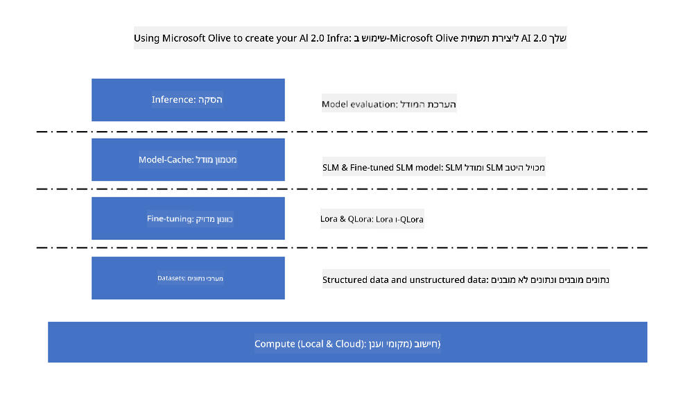
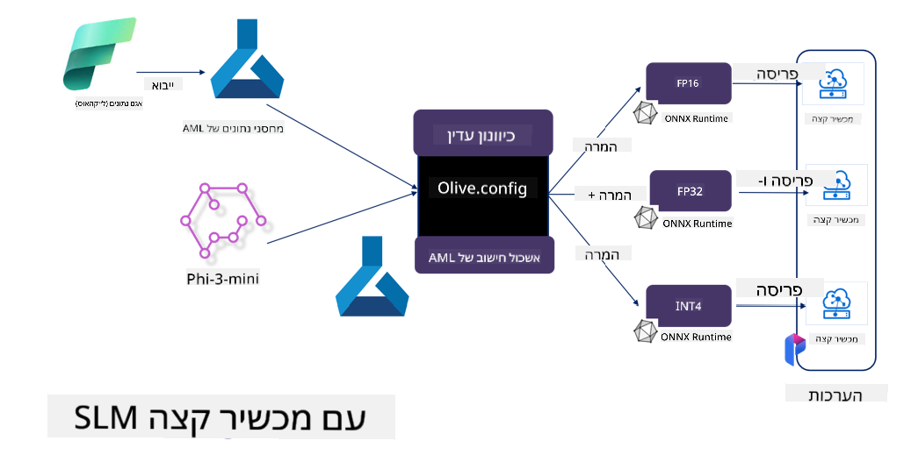

<!--
CO_OP_TRANSLATOR_METADATA:
{
  "original_hash": "5764be88ad2eb4f341e742eb8f14fab1",
  "translation_date": "2025-05-09T20:53:07+00:00",
  "source_file": "md/03.FineTuning/FineTuning_MicrosoftOlive.md",
  "language_code": "he"
}
-->
# **כוונון עדין של Phi-3 עם Microsoft Olive**

[Olive](https://github.com/microsoft/OLive?WT.mc_id=aiml-138114-kinfeylo) הוא כלי פשוט לשימוש לאופטימיזציה מודעת חומרה, שמאגד טכניקות מובילות בתעשייה לדחיסה, אופטימיזציה וקומפילציה של מודלים.

הוא מיועד לפשט את תהליך האופטימיזציה של מודלים ללמידת מכונה, ולהבטיח שימוש יעיל במבני חומרה ספציפיים.

בין אם אתם מפתחים אפליקציות בענן או במכשירי קצה, Olive מאפשר לכם לבצע אופטימיזציה למודלים בקלות וביעילות.

## תכונות מרכזיות:
- Olive מאגדת ומבצעת אוטומציה לטכניקות אופטימיזציה עבור יעדי חומרה רצויים.
- אין טכניקת אופטימיזציה אחת שמתאימה לכל המצבים, ולכן Olive מאפשרת הרחבה על ידי מתן אפשרות למומחי תעשייה להוסיף חידושים באופטימיזציה.

## הפחתת מאמץ הנדסי:
- מפתחים נדרשים לעיתים ללמוד ולהשתמש בכלי תוכנה שונים התואמים לספקי חומרה כדי להכין ולאופטם מודלים מאומנים לפריסה.
- Olive מפשטת את החוויה הזו באמצעות אוטומציה של טכניקות האופטימיזציה עבור החומרה הרצויה.

## פתרון אופטימיזציה מקצה לקצה מוכן לשימוש:

על ידי קומפוזיציה וכיוונון של טכניקות משולבות, Olive מציעה פתרון אחיד לאופטימיזציה מקצה לקצה.
היא מתחשבת במגבלות כמו דיוק ושהייה (latency) במהלך האופטימיזציה של המודלים.

## שימוש ב-Microsoft Olive לכוונון עדין

Microsoft Olive הוא כלי אופטימיזציה למודלים בקוד פתוח, קל מאוד לשימוש, שיכול לכסות גם כוונון עדין וגם הפניה בתחום הבינה המלאכותית הגנרטיבית. הוא דורש רק קונפיגורציה פשוטה, בשילוב עם שימוש במודלים קטנים בקוד פתוח וסביבות ריצה רלוונטיות (AzureML / GPU מקומי, CPU, DirectML), וניתן להשלים את הכוונון העדין או ההפניה של המודל באמצעות אופטימיזציה אוטומטית, ולמצוא את המודל הטוב ביותר לפריסה בענן או במכשירי קצה. מאפשר לארגונים לבנות מודלים ייעודיים לתעשייה שלהם הן באתר והן בענן.



## כוונון עדין של Phi-3 עם Microsoft Olive



## דוגמת קוד ודוגמה ל-Phi-3 Olive
בדוגמה הזו תשתמשו ב-Olive כדי:

- לכוונן עדין מתאם LoRA לסיווג ביטויים לקטגוריות עצב, שמחה, פחד, הפתעה.
- למזג את משקלי המתאם לתוך המודל הבסיסי.
- לבצע אופטימיזציה וכימות של המודל ל-int4.

[Sample Code](../../code/03.Finetuning/olive-ort-example/README.md)

### התקנת Microsoft Olive

התקנת Microsoft Olive פשוטה מאוד, וניתן להתקין גם עבור CPU, GPU, DirectML ו-Azure ML

```bash
pip install olive-ai
```

אם תרצו להריץ מודל ONNX עם CPU, ניתן להשתמש ב-

```bash
pip install olive-ai[cpu]
```

אם תרצו להריץ מודל ONNX עם GPU, ניתן להשתמש ב-

```python
pip install olive-ai[gpu]
```

אם תרצו להשתמש ב-Azure ML, השתמשו ב-

```python
pip install git+https://github.com/microsoft/Olive#egg=olive-ai[azureml]
```

**הערה**
דרישת מערכת הפעלה: Ubuntu 20.04 / 22.04

### **קובץ Config.json של Microsoft Olive**

לאחר ההתקנה, ניתן להגדיר הגדרות ספציפיות למודל דרך קובץ Config, כולל נתונים, חישוב, אימון, פריסה ויצירת מודל.

**1. נתונים**

ב-Microsoft Olive, אפשר לאמן על נתונים מקומיים ונתוני ענן, וניתן להגדיר זאת בהגדרות.

*הגדרות נתונים מקומיים*

ניתן להגדיר בקלות את מערך הנתונים שיש לאמן לכוונון עדין, בדרך כלל בפורמט json, ולהתאים אותו לתבנית הנתונים. יש להתאים זאת בהתאם לדרישות המודל (למשל, להתאים לפורמט הנדרש על ידי Microsoft Phi-3-mini. אם יש לכם מודלים אחרים, יש לעיין בדרישות הכוונון העדין של מודלים אחרים לטיפול)

```json

    "data_configs": [
        {
            "name": "dataset_default_train",
            "type": "HuggingfaceContainer",
            "load_dataset_config": {
                "params": {
                    "data_name": "json", 
                    "data_files":"dataset/dataset-classification.json",
                    "split": "train"
                }
            },
            "pre_process_data_config": {
                "params": {
                    "dataset_type": "corpus",
                    "text_cols": [
                            "phrase",
                            "tone"
                    ],
                    "text_template": "### Text: {phrase}\n### The tone is:\n{tone}",
                    "corpus_strategy": "join",
                    "source_max_len": 2048,
                    "pad_to_max_len": false,
                    "use_attention_mask": false
                }
            }
        }
    ],
```

**הגדרות מקור נתוני ענן**

על ידי קישור לאחסון הנתונים של Azure AI Studio / Azure Machine Learning Service, ניתן לבחור להכניס מקורות נתונים שונים ל-Azure AI Studio / Azure Machine Learning Service דרך Microsoft Fabric ו-Azure Data כתמיכה לכוונון עדין של הנתונים.

```json

    "data_configs": [
        {
            "name": "dataset_default_train",
            "type": "HuggingfaceContainer",
            "load_dataset_config": {
                "params": {
                    "data_name": "json", 
                    "data_files": {
                        "type": "azureml_datastore",
                        "config": {
                            "azureml_client": {
                                "subscription_id": "Your Azure Subscrition ID",
                                "resource_group": "Your Azure Resource Group",
                                "workspace_name": "Your Azure ML Workspaces name"
                            },
                            "datastore_name": "workspaceblobstore",
                            "relative_path": "Your train_data.json Azure ML Location"
                        }
                    },
                    "split": "train"
                }
            },
            "pre_process_data_config": {
                "params": {
                    "dataset_type": "corpus",
                    "text_cols": [
                            "Question",
                            "Best Answer"
                    ],
                    "text_template": "<|user|>\n{Question}<|end|>\n<|assistant|>\n{Best Answer}\n<|end|>",
                    "corpus_strategy": "join",
                    "source_max_len": 2048,
                    "pad_to_max_len": false,
                    "use_attention_mask": false
                }
            }
        }
    ],
    
```

**2. קונפיגורציית חישוב**

אם אתם צריכים לעבוד באופן מקומי, ניתן להשתמש ישירות במשאבי הנתונים המקומיים. אם יש צורך להשתמש במשאבי Azure AI Studio / Azure Machine Learning Service, יש להגדיר את הפרמטרים הרלוונטיים של Azure, שם כוח החישוב וכו'.

```json

    "systems": {
        "aml": {
            "type": "AzureML",
            "config": {
                "accelerators": ["gpu"],
                "hf_token": true,
                "aml_compute": "Your Azure AI Studio / Azure Machine Learning Service Compute Name",
                "aml_docker_config": {
                    "base_image": "Your Azure AI Studio / Azure Machine Learning Service docker",
                    "conda_file_path": "conda.yaml"
                }
            }
        },
        "azure_arc": {
            "type": "AzureML",
            "config": {
                "accelerators": ["gpu"],
                "aml_compute": "Your Azure AI Studio / Azure Machine Learning Service Compute Name",
                "aml_docker_config": {
                    "base_image": "Your Azure AI Studio / Azure Machine Learning Service docker",
                    "conda_file_path": "conda.yaml"
                }
            }
        }
    },
```

***הערה***

מכיוון שההרצה מתבצעת דרך מכולה ב-Azure AI Studio / Azure Machine Learning Service, יש להגדיר את סביבת ההרצה. ההגדרה נעשית בקובץ conda.yaml.

```yaml

name: project_environment
channels:
  - defaults
dependencies:
  - python=3.8.13
  - pip=22.3.1
  - pip:
      - einops
      - accelerate
      - azure-keyvault-secrets
      - azure-identity
      - bitsandbytes
      - datasets
      - huggingface_hub
      - peft
      - scipy
      - sentencepiece
      - torch>=2.2.0
      - transformers
      - git+https://github.com/microsoft/Olive@jiapli/mlflow_loading_fix#egg=olive-ai[gpu]
      - --extra-index-url https://aiinfra.pkgs.visualstudio.com/PublicPackages/_packaging/ORT-Nightly/pypi/simple/ 
      - ort-nightly-gpu==1.18.0.dev20240307004
      - --extra-index-url https://aiinfra.pkgs.visualstudio.com/PublicPackages/_packaging/onnxruntime-genai/pypi/simple/
      - onnxruntime-genai-cuda

    

```

**3. בחרו את ה-SLM שלכם**

ניתן להשתמש במודל ישירות מ-Hugging Face, או לשלב אותו עם קטלוג המודלים של Azure AI Studio / Azure Machine Learning לבחירת המודל לשימוש. בדוגמת הקוד למטה נשתמש ב-Microsoft Phi-3-mini כדוגמה.

אם יש לכם את המודל מקומית, ניתן להשתמש בשיטה זו

```json

    "input_model":{
        "type": "PyTorchModel",
        "config": {
            "hf_config": {
                "model_name": "model-cache/microsoft/phi-3-mini",
                "task": "text-generation",
                "model_loading_args": {
                    "trust_remote_code": true
                }
            }
        }
    },
```

אם תרצו להשתמש במודל מ-Azure AI Studio / Azure Machine Learning Service, ניתן להשתמש בשיטה זו

```json

    "input_model":{
        "type": "PyTorchModel",
        "config": {
            "model_path": {
                "type": "azureml_registry_model",
                "config": {
                    "name": "microsoft/Phi-3-mini-4k-instruct",
                    "registry_name": "azureml-msr",
                    "version": "11"
                }
            },
             "model_file_format": "PyTorch.MLflow",
             "hf_config": {
                "model_name": "microsoft/Phi-3-mini-4k-instruct",
                "task": "text-generation",
                "from_pretrained_args": {
                    "trust_remote_code": true
                }
            }
        }
    },
```

**הערה:**
יש לבצע אינטגרציה עם Azure AI Studio / Azure Machine Learning Service, ולכן בעת הגדרת המודל יש לעיין במספר הגרסה ובשמות הרלוונטיים.

כל המודלים ב-Azure צריכים להיות מוגדרים כ-PyTorch.MLflow

יש צורך בחשבון Hugging Face וקישור המפתח לערך המפתח של Azure AI Studio / Azure Machine Learning

**4. אלגוריתם**

Microsoft Olive כוללת היטב את אלגוריתמי הכוונון העדין Lora ו-QLora. כל שעליכם לעשות הוא להגדיר כמה פרמטרים רלוונטיים. כאן אקח את QLora כדוגמה.

```json
        "lora": {
            "type": "LoRA",
            "config": {
                "target_modules": [
                    "o_proj",
                    "qkv_proj"
                ],
                "double_quant": true,
                "lora_r": 64,
                "lora_alpha": 64,
                "lora_dropout": 0.1,
                "train_data_config": "dataset_default_train",
                "eval_dataset_size": 0.3,
                "training_args": {
                    "seed": 0,
                    "data_seed": 42,
                    "per_device_train_batch_size": 1,
                    "per_device_eval_batch_size": 1,
                    "gradient_accumulation_steps": 4,
                    "gradient_checkpointing": false,
                    "learning_rate": 0.0001,
                    "num_train_epochs": 3,
                    "max_steps": 10,
                    "logging_steps": 10,
                    "evaluation_strategy": "steps",
                    "eval_steps": 187,
                    "group_by_length": true,
                    "adam_beta2": 0.999,
                    "max_grad_norm": 0.3
                }
            }
        },
```

אם תרצו לבצע המרה לכימות, הסניף הראשי של Microsoft Olive כבר תומך בשיטת onnxruntime-genai. ניתן להגדיר לפי הצרכים:

1. למזג את משקלי המתאם לתוך המודל הבסיסי  
2. להמיר את המודל למודל onnx עם הדיוק הנדרש על ידי ModelBuilder

כגון המרה לכימות INT4

```json

        "merge_adapter_weights": {
            "type": "MergeAdapterWeights"
        },
        "builder": {
            "type": "ModelBuilder",
            "config": {
                "precision": "int4"
            }
        }
```

**הערה**  
- אם אתם משתמשים ב-QLoRA, כרגע לא נתמכת המרת כימות של ONNXRuntime-genai.  
- יש לציין שניתן להגדיר את השלבים הנ"ל לפי הצרכים שלכם. אין צורך להגדיר את כל השלבים במלואם. בהתאם לצרכים, ניתן להשתמש ישירות בשלבי האלגוריתם ללא כוונון עדין. בסופו של דבר יש להגדיר את המנועים הרלוונטיים.

```json

    "engine": {
        "log_severity_level": 0,
        "host": "aml",
        "target": "aml",
        "search_strategy": false,
        "execution_providers": ["CUDAExecutionProvider"],
        "cache_dir": "../model-cache/models/phi3-finetuned/cache",
        "output_dir" : "../model-cache/models/phi3-finetuned"
    }
```

**5. סיום הכוונון העדין**

בשורת הפקודה, הריצו בתיקיית olive-config.json

```bash
olive run --config olive-config.json  
```

**כתב ויתור**:  
מסמך זה תורגם באמצעות שירות תרגום מבוסס בינה מלאכותית [Co-op Translator](https://github.com/Azure/co-op-translator). למרות שאנו שואפים לדיוק, יש לקחת בחשבון כי תרגומים אוטומטיים עלולים להכיל שגיאות או אי-דיוקים. יש להתייחס למסמך המקורי בשפת המקור כמקור הסמכות. למידע קריטי מומלץ להשתמש בתרגום מקצועי על ידי מתרגם אנושי. אנו לא נושאים באחריות לכל אי-הבנה או פרשנות שגויה הנובעים משימוש בתרגום זה.