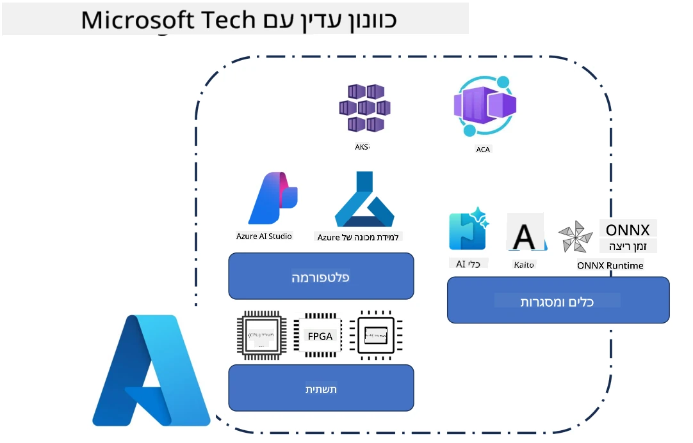
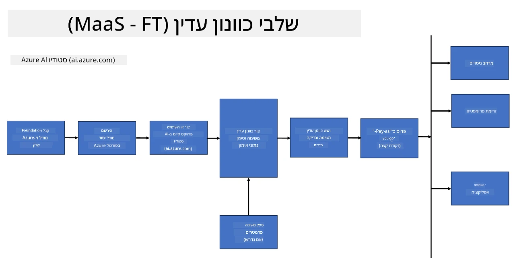
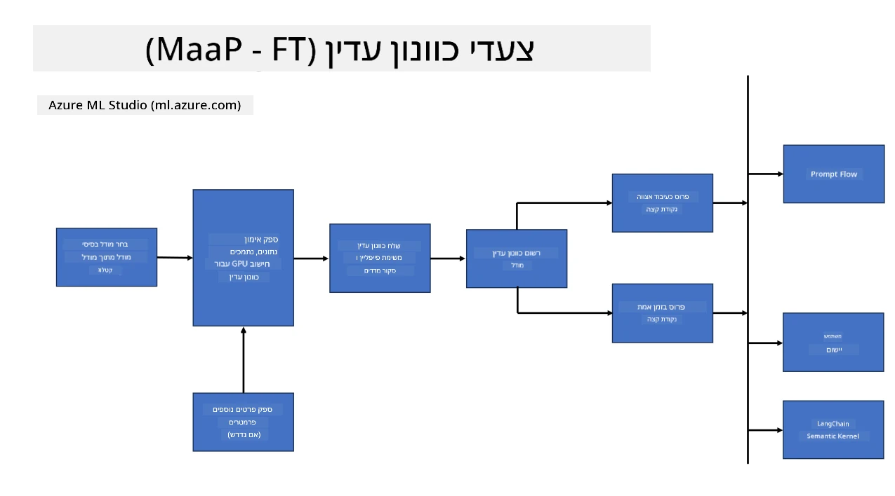

<!--
CO_OP_TRANSLATOR_METADATA:
{
  "original_hash": "cb5648935f63edc17e95ce38f23adc32",
  "translation_date": "2025-07-17T08:28:24+00:00",
  "source_file": "md/03.FineTuning/FineTuning_Scenarios.md",
  "language_code": "he"
}
-->
## תרחישי כוונון עדין

**פלטפורמה** כוללת טכנולוגיות שונות כמו Azure AI Foundry, Azure Machine Learning, כלי AI, Kaito ו-ONNX Runtime.

**תשתית** כוללת את ה-CPU וה-FPGA, שהם חיוניים לתהליך הכוונון העדין. אראה לכם את האייקונים של כל אחת מהטכנולוגיות האלה.

**כלים ומסגרות עבודה** כוללת את ONNX Runtime ו-ONNX Runtime. אראה לכם את האייקונים של כל אחת מהטכנולוגיות האלה.  
[הכנס אייקונים של ONNX Runtime ו-ONNX Runtime]

תהליך הכוונון העדין עם טכנולוגיות מיקרוסופט כולל רכיבים וכלים שונים. על ידי הבנה ושימוש בטכנולוגיות אלו, נוכל לכוונן את היישומים שלנו בצורה יעילה וליצור פתרונות טובים יותר.

## מודל כשירות

כוונן את המודל באמצעות כוונון עדין מתארח, ללא צורך ביצירה וניהול של משאבי חישוב.

כוונון עדין ללא שרת זמין לדגמי Phi-3-mini ו-Phi-3-medium, ומאפשר למפתחים להתאים במהירות ובקלות את המודלים לתרחישי ענן וקצה ללא צורך בארגון משאבי חישוב. בנוסף, הכרזנו כי Phi-3-small זמין כעת דרך ההצעה שלנו Models-as-a-Service, כך שמפתחים יכולים להתחיל במהירות ובקלות בפיתוח AI ללא צורך בניהול התשתית התחתונה.

## מודל כפלטפורמה

המשתמשים מנהלים את משאבי החישוב שלהם כדי לכוונן את המודלים שלהם.

[דוגמת כוונון עדין](https://github.com/Azure/azureml-examples/blob/main/sdk/python/foundation-models/system/finetune/chat-completion/chat-completion.ipynb)

## תרחישי כוונון עדין

| | | | | | | |
|-|-|-|-|-|-|-|
|תרחיש|LoRA|QLoRA|PEFT|DeepSpeed|ZeRO|DORA|
|התאמת LLMs מאומנים מראש למשימות או תחומים ספציפיים|כן|כן|כן|כן|כן|כן|
|כוונון עדין למשימות NLP כמו סיווג טקסט, זיהוי ישויות ושפות|כן|כן|כן|כן|כן|כן|
|כוונון עדין למשימות שאלות ותשובות|כן|כן|כן|כן|כן|כן|
|כוונון עדין ליצירת תגובות דמויות אדם בצ'אטבוטים|כן|כן|כן|כן|כן|כן|
|כוונון עדין ליצירת מוזיקה, אמנות או צורות יצירתיות אחרות|כן|כן|כן|כן|כן|כן|
|הפחתת עלויות חישוביות וכספיות|כן|כן|לא|כן|כן|לא|
|הפחתת שימוש בזיכרון|לא|כן|לא|כן|כן|כן|
|שימוש בפחות פרמטרים לכוונון יעיל|לא|כן|כן|לא|לא|כן|
|צורת פרלליזם יעילה בזיכרון המאפשרת גישה לזיכרון הכולל של כל מכשירי ה-GPU הזמינים|לא|לא|לא|כן|כן|כן|

## דוגמאות לביצועי כוונון עדין

**כתב ויתור**:  
מסמך זה תורגם באמצעות שירות תרגום מבוסס בינה מלאכותית [Co-op Translator](https://github.com/Azure/co-op-translator). למרות שאנו שואפים לדיוק, יש לקחת בחשבון כי תרגומים אוטומטיים עלולים להכיל שגיאות או אי-דיוקים. המסמך המקורי בשפת המקור שלו נחשב למקור הסמכותי. למידע קריטי מומלץ להשתמש בתרגום מקצועי על ידי מתרגם אנושי. אנו לא נושאים באחריות לכל אי-הבנה או פרשנות שגויה הנובעת משימוש בתרגום זה.