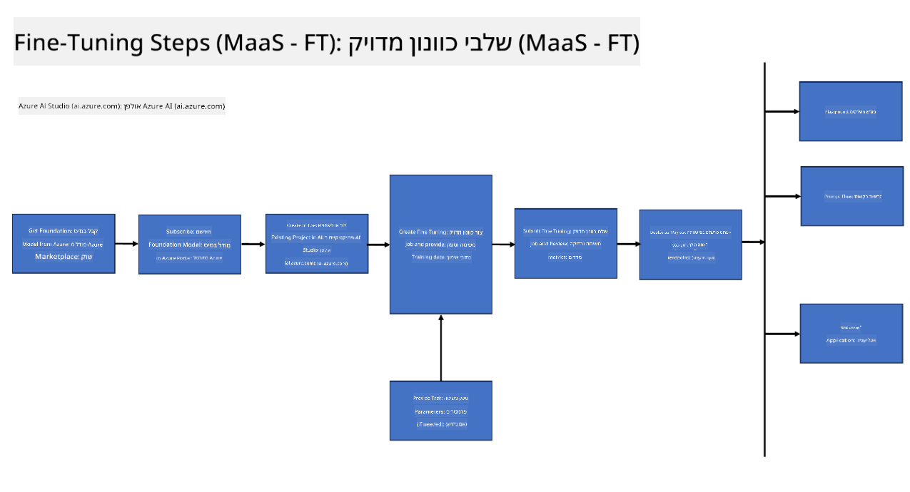
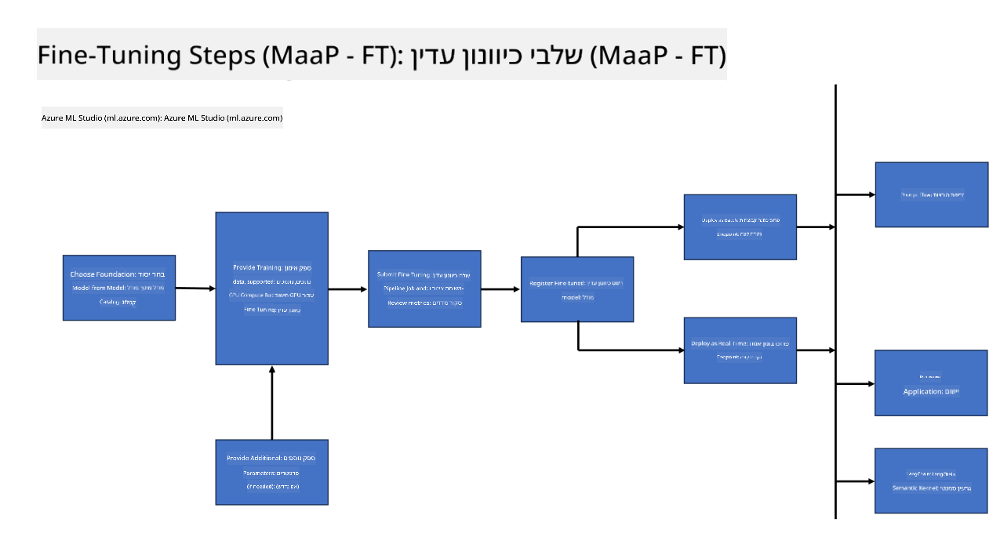
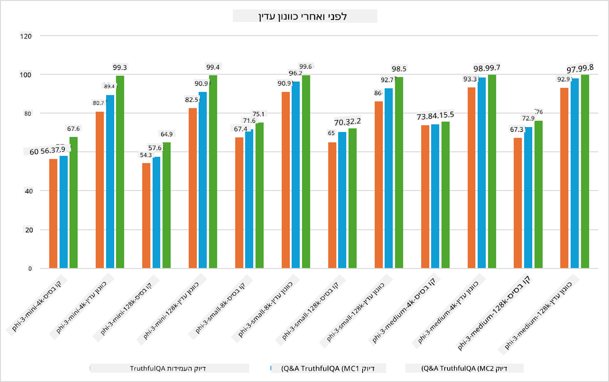

<!--
CO_OP_TRANSLATOR_METADATA:
{
  "original_hash": "cb5648935f63edc17e95ce38f23adc32",
  "translation_date": "2025-05-09T21:56:29+00:00",
  "source_file": "md/03.FineTuning/FineTuning_Scenarios.md",
  "language_code": "he"
}
-->
## תרחישי כיוונון עדין

**פלטפורמה** זה כולל טכנולוגיות שונות כמו Azure AI Foundry, Azure Machine Learning, AI Tools, Kaito ו-ONNX Runtime.

**תשתית** זה כולל את ה-CPU וה-FPGA, שהם חיוניים לתהליך הכיוונון העדין. אראה לכם את האייקונים של כל אחת מהטכנולוגיות האלה.

**כלים ומסגרות עבודה** זה כולל את ONNX Runtime ו-ONNX Runtime. אראה לכם את האייקונים של כל אחת מהטכנולוגיות האלה.  
[Insert icons for ONNX Runtime and ONNX Runtime]

תהליך הכיוונון העדין עם טכנולוגיות מיקרוסופט כולל רכיבים וכלים שונים. על ידי הבנה ושימוש בטכנולוגיות אלה, נוכל לכוון את היישומים שלנו בצורה יעילה וליצור פתרונות טובים יותר.

## מודל כשירות

כוונון עדין של המודל באמצעות כיוונון מתארח, ללא צורך ביצירה וניהול של חישוב.

כיוונון עדין ללא שרתים זמין לדגמי Phi-3-mini ו-Phi-3-medium, ומאפשר למפתחים להתאים במהירות ובקלות את המודלים לתרחישי ענן וקצה, מבלי לסדר חישוב. הודענו גם ש-Phi-3-small זמין כעת דרך ההצעה שלנו Models-as-a-Service, כך שמפתחים יכולים להתחיל במהירות ובקלות בפיתוח AI מבלי לנהל תשתית בסיסית.

## מודל כפלטפורמה

המשתמשים מנהלים את החישוב שלהם כדי לכוון את המודלים שלהם.

[Fine Tuning Sample](https://github.com/Azure/azureml-examples/blob/main/sdk/python/foundation-models/system/finetune/chat-completion/chat-completion.ipynb)

## תרחישי כיוונון עדין

| | | | | | | |
|-|-|-|-|-|-|-|
|תרחיש|LoRA|QLoRA|PEFT|DeepSpeed|ZeRO|DORA|
|התאמת LLMs מאומנים מראש למשימות או תחומים ספציפיים|כן|כן|כן|כן|כן|כן|
|כיוונון עדין למשימות NLP כמו סיווג טקסט, זיהוי ישויות ושפות|כן|כן|כן|כן|כן|כן|
|כיוונון עדין למשימות שאלות ותשובות|כן|כן|כן|כן|כן|כן|
|כיוונון עדין ליצירת תגובות אנושיות בצ'אטבוטים|כן|כן|כן|כן|כן|כן|
|כיוונון עדין ליצירת מוזיקה, אמנות או צורות יצירתיות אחרות|כן|כן|כן|כן|כן|כן|
|הפחתת עלויות חישוב וכספיות|כן|כן|לא|כן|כן|לא|
|הפחתת שימוש בזיכרון|לא|כן|לא|כן|כן|כן|
|שימוש בפחות פרמטרים לכיוונון יעיל|לא|כן|כן|לא|לא|כן|
|צורת פרלליזם יעילה בזיכרון שמאפשרת גישה לזיכרון הכולל של כל מכשירי ה-GPU הזמינים|לא|לא|לא|כן|כן|כן|

## דוגמאות לביצועי כיוונון עדין

**כתב ויתור**:  
מסמך זה תורגם באמצעות שירות תרגום מבוסס בינה מלאכותית [Co-op Translator](https://github.com/Azure/co-op-translator). למרות שאנו שואפים לדיוק, יש לקחת בחשבון שתרגומים אוטומטיים עלולים להכיל שגיאות או אי-דיוקים. המסמך המקורי בשפת המקור שלו נחשב למקור הסמכותי. למידע קריטי מומלץ להשתמש בתרגום מקצועי על ידי אדם. אנו לא אחראים לכל אי הבנות או פרשנויות שגויות הנובעות מהשימוש בתרגום זה.