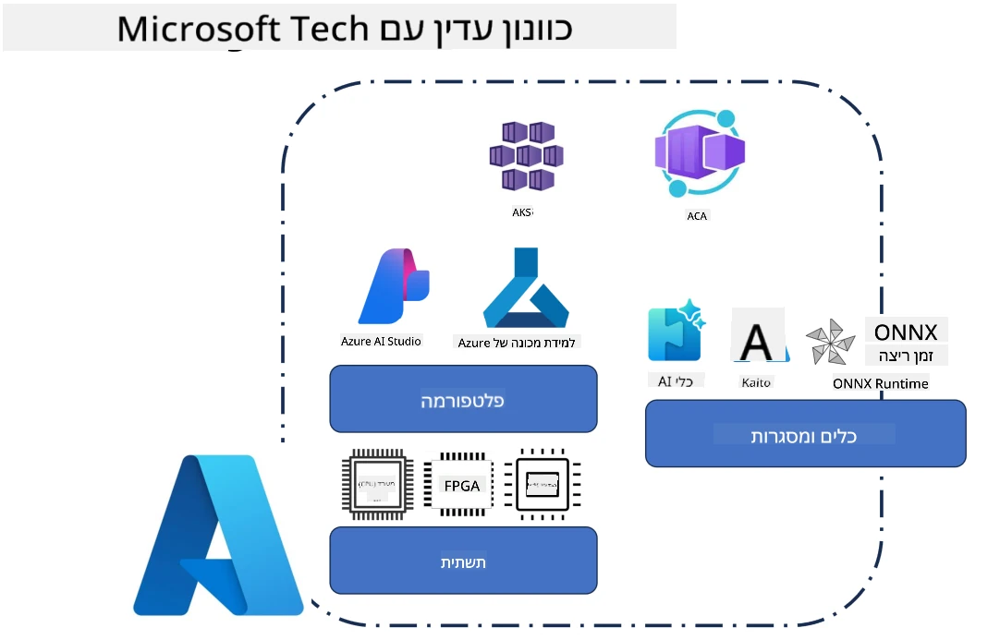
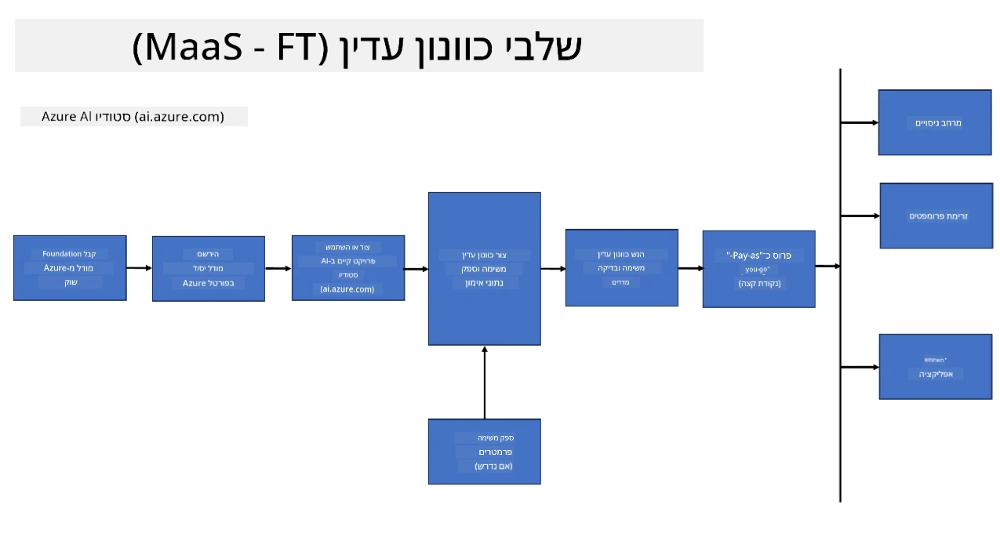
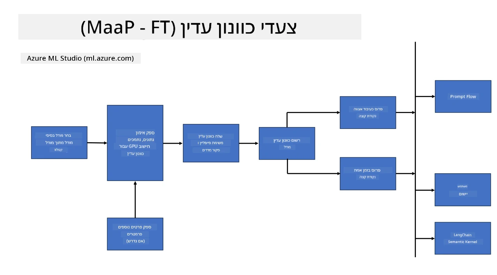
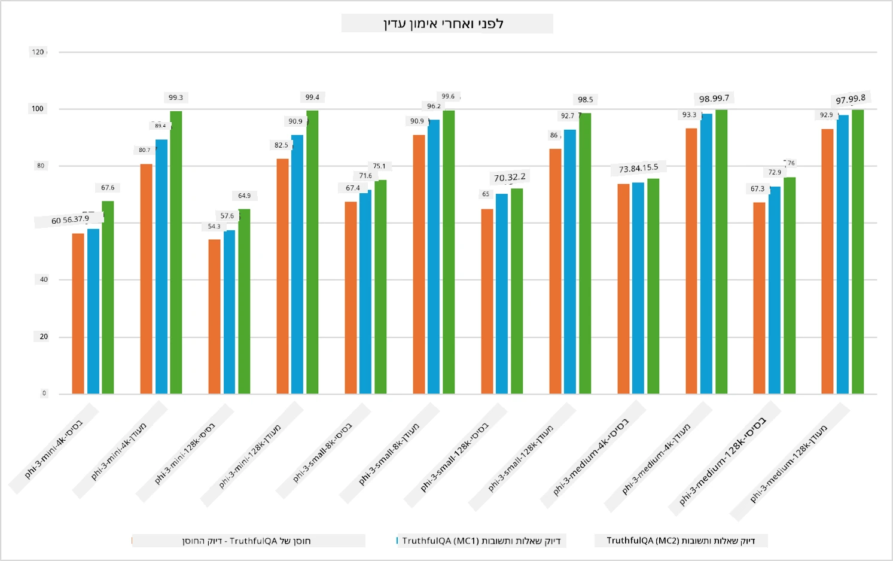

## תרחישי כוונון עדין

חלק זה מספק סקירה כללית של תרחישי כוונון עדין בסביבות Microsoft Foundry ו-Azure, כולל מודלי פריסה, שכבות תשתית, וטכניקות אופטימיזציה בשימוש נפוץ.

**פלטפורמה**  
זה כולל שירותים מנוהלים כגון Microsoft Foundry (לשעבר Azure AI Foundry) ו-Azure Machine Learning, המעניקים ניהול מודלים, ארכיטקטורת תהליכים, מעקב אחרי ניסויים, וזרימות עבודה לפריסה.

**תשתית**  
כוונון עדין דורש משאבי חישוב בקנה מידה רחב. בסביבות Azure, זה כולל בדרך כלל מכונות וירטואליות מבוססות GPU ומשאבי CPU עבור עומסי עבודה קלים, לצד אחסון בקנה מידה עבור ערכות נתונים ונקודות ביקורת.

**כלים ומסגרות עבודה**  
זרימות עבודה של כוונון עדין נשענות בדרך כלל על מסגרות וספריות אופטימיזציה כגון Hugging Face Transformers, DeepSpeed, ו-PEFT (כוונון עדין חסכוני בפרמטרים).

תהליך הכוונון העדין עם טכנולוגיות Microsoft כולל שירותי פלטפורמה, תשתיות חישוב, ומסגרות אימון. באמצעות הבנה כיצד רכיבים אלו עובדים יחד, מפתחים יכולים להתאים באופן יעיל מודלים בסיסיים למשימות ותרחישי הפקה ספציפיים.

## מודל כשירות

כוונון עדין של המודל באמצעות כוונון מתארח, ללא צורך ביצירה וניהול של משאבי חישוב.

כוונון עדין ללא שרתים זמין כעת עבור משפחות המודלים Phi-3, Phi-3.5, ו-Phi-4, ומאפשר למפתחים להתאים במהירות ובקלות את המודלים לתרחישי ענן וקצה מבלי לדאוג לסידור המשאבים.

## מודל כפלטפורמה

משתמשים מנהלים את משאבי החישוב שלהם על מנת לבצע כוונון עדין למודלים שלהם.

[דוגמת כוונון עדין](https://github.com/Azure/azureml-examples/blob/main/sdk/python/foundation-models/system/finetune/chat-completion/chat-completion.ipynb)

## השוואת טכניקות כוונון עדין

|תרחיש|LoRA|QLoRA|PEFT|DeepSpeed|ZeRO|DoRA|
|---|---|---|---|---|---|---|
|התאמת LLM מאומנים מראש למשימות או תחומים ספציפיים|כן|כן|כן|כן|כן|כן|
|כוונון עדין למשימות NLP כגון סיווג טקסט, זיהוי ישויות מנווטות, ותרגום מכונה|כן|כן|כן|כן|כן|כן|
|כוונון עדין למשימות QA|כן|כן|כן|כן|כן|כן|
|כוונון עדין ליצירת תגובות בסגנון אנושי בצ'אטבוטים|כן|כן|כן|כן|כן|כן|
|כוונון עדין ליצירת מוזיקה, אמנות, או צורות יצירה אחרות|כן|כן|כן|כן|כן|כן|
|הפחתת עלויות חישוב וכספיות|כן|כן|כן|כן|כן|כן|
|הפחתת שימוש בזיכרון|כן|כן|כן|כן|כן|כן|
|שימוש בפרמטרים מעטים יותר לכוונון יעיל|כן|כן|כן|לא|לא|כן|
|צורת פרלליות מותאמת לזיכרון היעילה שמספקת גישה לזיכרון המשולב של כל מכשירי ה-GPU הזמינים|לא|לא|לא|כן|כן|לא|

> [!NOTE]
> LoRA, QLoRA, PEFT, ו-DoRA הן שיטות כוונון עדין חסכוניות בפרמטרים, בעוד ש-DeepSpeed ו-ZeRO מתמקדות באימון מבוזר ואופטימיזציה של הזיכרון.

## דוגמאות לביצועי כוונון עדין

---

<!-- CO-OP TRANSLATOR DISCLAIMER START -->
**כתב ויתור**:  
מסמך זה תורגם באמצעות שירות תרגום מבוסס בינה מלאכותית [Co-op Translator](https://github.com/Azure/co-op-translator). למרות שאנו שואפים לדייק, יש להיות מודעים לכך שתרגומים אוטומטיים עשויים להכיל שגיאות או אי דיוקים. יש להתייחס למסמך המקורי בשפתו כאל המקור הסמכותי. למידע קריטי מומלץ להשתמש בתרגום מקצועי אנושי. איננו אחראים על אי הבנות או פרשנויות שגויות הנובעות משימוש בתרגום זה.
<!-- CO-OP TRANSLATOR DISCLAIMER END -->