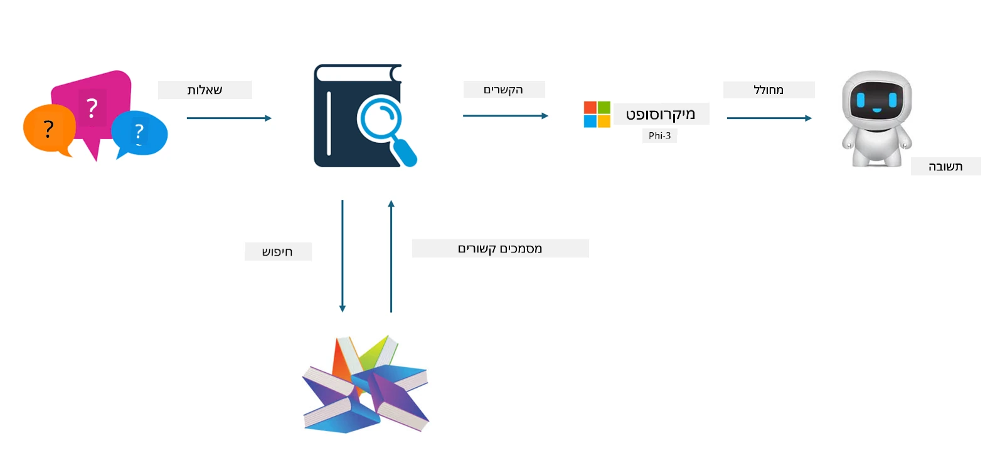

<!--
CO_OP_TRANSLATOR_METADATA:
{
  "original_hash": "e4e010400c2918557b36bb932a14004c",
  "translation_date": "2025-07-17T09:30:15+00:00",
  "source_file": "md/03.FineTuning/FineTuning_vs_RAG.md",
  "language_code": "he"
}
-->
## כיוונון עדין מול RAG

## יצירת תוכן משולבת שליפה (Retrieval Augmented Generation)

RAG הוא שילוב של שליפת נתונים + יצירת טקסט. הנתונים המובנים והלא מובנים של הארגון מאוחסנים בבסיס נתונים וקטורי. בעת חיפוש תוכן רלוונטי, נמצא סיכום ותוכן רלוונטיים ליצירת הקשר, ויכולת השלמת הטקסט של LLM/SLM משולבת ליצירת התוכן.

## תהליך RAG

## כיוונון עדין
כיוונון עדין מתבסס על שיפור של מודל מסוים. אין צורך להתחיל מהאלגוריתם של המודל, אך יש צורך בהצטברות מתמדת של נתונים. אם רוצים מונחים מדויקים יותר וביטוי שפה מדויק בתעשייה, כיוונון עדין הוא הבחירה הטובה יותר. אך אם הנתונים משתנים לעיתים קרובות, כיוונון עדין עלול להיות מסובך.

## איך לבחור
אם התשובה שלנו דורשת הכנסת נתונים חיצוניים, RAG היא הבחירה הטובה ביותר

אם צריך להפיק ידע תעשייתי יציב ומדויק, כיוונון עדין יהיה בחירה טובה. RAG מתמקד בשליפת תוכן רלוונטי אך לא תמיד מצליח לתפוס את הדקויות המיוחדות.

כיוונון עדין דורש מערך נתונים איכותי, ואם מדובר בטווח קטן של נתונים, זה לא ישפיע משמעותית. RAG גמיש יותר  
כיוונון עדין הוא תיבה שחורה, מטאפיזיקה, וקשה להבין את המנגנון הפנימי. אך RAG מאפשר למצוא בקלות את מקור הנתונים, וכך להתאים ביעילות הזיות או שגיאות בתוכן ולספק שקיפות טובה יותר.

**כתב ויתור**:  
מסמך זה תורגם באמצעות שירות תרגום מבוסס בינה מלאכותית [Co-op Translator](https://github.com/Azure/co-op-translator). למרות שאנו שואפים לדיוק, יש לקחת בחשבון כי תרגומים אוטומטיים עלולים להכיל שגיאות או אי-דיוקים. המסמך המקורי בשפת המקור שלו צריך להיחשב כמקור הסמכות. למידע קריטי מומלץ להשתמש בתרגום מקצועי על ידי מתרגם אנושי. אנו לא נושאים באחריות לכל אי-הבנה או פרשנות שגויה הנובעת משימוש בתרגום זה.