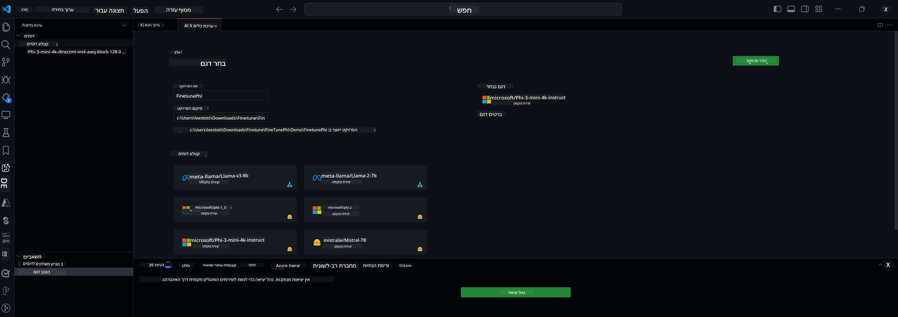

<!--
CO_OP_TRANSLATOR_METADATA:
{
  "original_hash": "c2bc0950f44919ac75a88c1a871680c2",
  "translation_date": "2025-07-17T09:16:04+00:00",
  "source_file": "md/03.FineTuning/Finetuning_VSCodeaitoolkit.md",
  "language_code": "he"
}
-->
## ברוכים הבאים ל-AI Toolkit עבור VS Code

[AI Toolkit עבור VS Code](https://github.com/microsoft/vscode-ai-toolkit/tree/main) מאחדת מודלים שונים מתוך קטלוג Azure AI Studio וקטלוגים נוספים כמו Hugging Face. הכלי מפשט את המשימות הנפוצות בפיתוח אפליקציות AI עם כלים ומודלים של AI גנרטיבי באמצעות:
- התחלה עם גילוי מודלים ו-playground.
- כוונון מודל והסקת מסקנות באמצעות משאבי מחשוב מקומיים.
- כוונון והסקת מסקנות מרחוק באמצעות משאבי Azure.

[התקן את AI Toolkit עבור VSCode](https://marketplace.visualstudio.com/items?itemName=ms-windows-ai-studio.windows-ai-studio)



**[Private Preview]** פרוביזיה בלחיצה אחת עבור Azure Container Apps להרצת כוונון מודל והסקת מסקנות בענן.

עכשיו בואו נתחיל בפיתוח אפליקציית ה-AI שלכם:

- [ברוכים הבאים ל-AI Toolkit עבור VS Code](../../../../md/03.FineTuning)
- [פיתוח מקומי](../../../../md/03.FineTuning)
  - [הכנות](../../../../md/03.FineTuning)
  - [הפעלת Conda](../../../../md/03.FineTuning)
  - [כוונון מודל בסיסי בלבד](../../../../md/03.FineTuning)
  - [כוונון מודל והסקת מסקנות](../../../../md/03.FineTuning)
  - [כוונון מודל](../../../../md/03.FineTuning)
  - [Microsoft Olive](../../../../md/03.FineTuning)
  - [דוגמאות ומשאבים לכוונון](../../../../md/03.FineTuning)
- [**\[Private Preview\]** פיתוח מרחוק](../../../../md/03.FineTuning)
  - [דרישות מוקדמות](../../../../md/03.FineTuning)
  - [הגדרת פרויקט פיתוח מרחוק](../../../../md/03.FineTuning)
  - [פרוביזיה של משאבי Azure](../../../../md/03.FineTuning)
  - [\[אופציונלי\] הוספת טוקן Huggingface לסוד של Azure Container App](../../../../md/03.FineTuning)
  - [הרצת כוונון](../../../../md/03.FineTuning)
  - [פרוביזיה של נקודת קצה להסקת מסקנות](../../../../md/03.FineTuning)
  - [פריסת נקודת הקצה להסקת מסקנות](../../../../md/03.FineTuning)
  - [שימוש מתקדם](../../../../md/03.FineTuning)

## פיתוח מקומי
### הכנות

1. ודאו כי דרייבר NVIDIA מותקן במחשב המארח.
2. הריצו `huggingface-cli login` אם אתם משתמשים ב-HF לניצול מערכי נתונים.
3. הסברים על הגדרות מפתח `Olive` לכל דבר שמשנה את השימוש בזיכרון.

### הפעלת Conda
מכיוון שאנו משתמשים בסביבת WSL שהיא משותפת, יש להפעיל ידנית את סביבת ה-conda. לאחר שלב זה תוכלו להריץ כוונון או הסקת מסקנות.

```bash
conda activate [conda-env-name] 
```

### כוונון מודל בסיסי בלבד
כדי לנסות את המודל הבסיסי ללא כוונון, ניתן להריץ את הפקודה הזו לאחר הפעלת conda.

```bash
cd inference

# Web browser interface allows to adjust a few parameters like max new token length, temperature and so on.
# User has to manually open the link (e.g. http://0.0.0.0:7860) in a browser after gradio initiates the connections.
python gradio_chat.py --baseonly
```

### כוונון מודל והסקת מסקנות

כאשר סביבת העבודה פתוחה בתוך מיכל פיתוח, פתחו טרמינל (הנתיב ברירת המחדל הוא שורש הפרויקט), ואז הריצו את הפקודה הבאה כדי לכוונן LLM על מערך הנתונים שנבחר.

```bash
python finetuning/invoke_olive.py 
```

נקודות הבדיקה והמודל הסופי יישמרו בתיקיית `models`.

לאחר מכן הריצו הסקת מסקנות עם המודל המכוונן דרך שיחות ב-`console`, `דפדפן אינטרנט` או `prompt flow`.

```bash
cd inference

# Console interface.
python console_chat.py

# Web browser interface allows to adjust a few parameters like max new token length, temperature and so on.
# User has to manually open the link (e.g. http://127.0.0.1:7860) in a browser after gradio initiates the connections.
python gradio_chat.py
```

כדי להשתמש ב-`prompt flow` ב-VS Code, עיינו ב-[Quick Start](https://microsoft.github.io/promptflow/how-to-guides/quick-start.html).

### כוונון מודל

לאחר מכן, הורידו את המודל המתאים בהתאם לזמינות GPU במכשיר שלכם.

כדי להתחיל את סשן הכוונון המקומי באמצעות QLoRA, בחרו מודל שברצונכם לכוונן מתוך הקטלוג שלנו.
| פלטפורמה | GPU זמין | שם המודל | גודל (GB) |
|---------|---------|--------|--------|
| Windows | כן | Phi-3-mini-4k-**directml**-int4-awq-block-128-onnx | 2.13GB |
| Linux | כן | Phi-3-mini-4k-**cuda**-int4-onnx | 2.30GB |
| Windows<br>Linux | לא | Phi-3-mini-4k-**cpu**-int4-rtn-block-32-acc-level-4-onnx | 2.72GB |

**_הערה_** אין צורך בחשבון Azure כדי להוריד את המודלים.

המודל Phi3-mini (int4) בגודל של כ-2GB-3GB. בהתאם למהירות הרשת שלכם, ההורדה עשויה לקחת כמה דקות.

התחילו בבחירת שם ומיקום לפרויקט.
לאחר מכן בחרו מודל מתוך קטלוג המודלים. תתבקשו להוריד את תבנית הפרויקט. לאחר מכן תוכלו ללחוץ על "Configure Project" כדי להתאים הגדרות שונות.

### Microsoft Olive

אנו משתמשים ב-[Olive](https://microsoft.github.io/Olive/why-olive.html) להרצת כוונון QLoRA על מודל PyTorch מתוך הקטלוג שלנו. כל ההגדרות מוגדרות מראש עם ערכי ברירת מחדל לאופטימיזציה של תהליך הכוונון המקומי עם שימוש מיטבי בזיכרון, אך ניתן להתאים אותן לסיטואציה שלכם.

### דוגמאות ומשאבים לכוונון

- [מדריך התחלה לכוונון](https://learn.microsoft.com/windows/ai/toolkit/toolkit-fine-tune)
- [כוונון עם מערך נתונים של HuggingFace](https://github.com/microsoft/vscode-ai-toolkit/blob/main/archive/walkthrough-hf-dataset.md)
- [כוונון עם מערך נתונים פשוט](https://github.com/microsoft/vscode-ai-toolkit/blob/main/archive/walkthrough-simple-dataset.md)

## **[Private Preview]** פיתוח מרחוק

### דרישות מוקדמות

1. כדי להריץ כוונון מודל בסביבת Azure Container App מרחוק, ודאו שלמנוי שלכם יש מספיק קיבולת GPU. הגישו [כרטיס תמיכה](https://azure.microsoft.com/support/create-ticket/) כדי לבקש את הקיבולת הנדרשת לאפליקציה שלכם. [למידע נוסף על קיבולת GPU](https://learn.microsoft.com/azure/container-apps/workload-profiles-overview)
2. אם אתם משתמשים במערך נתונים פרטי ב-HuggingFace, ודאו שיש לכם [חשבון HuggingFace](https://huggingface.co/?WT.mc_id=aiml-137032-kinfeylo) ו[יצרתם טוקן גישה](https://huggingface.co/docs/hub/security-tokens?WT.mc_id=aiml-137032-kinfeylo)
3. הפעלת דגל תכונה לכוונון והסקת מסקנות מרחוק ב-AI Toolkit עבור VS Code
   1. פתחו את הגדרות VS Code דרך *File -> Preferences -> Settings*.
   2. עברו ל-*Extensions* ובחרו *AI Toolkit*.
   3. סמן את האפשרות *"Enable Remote Fine-tuning And Inference"*.
   4. טענו מחדש את VS Code כדי שהשינויים ייכנסו לתוקף.

- [כוונון מרחוק](https://github.com/microsoft/vscode-ai-toolkit/blob/main/archive/remote-finetuning.md)

### הגדרת פרויקט פיתוח מרחוק
1. הריצו את פלטת הפקודות `AI Toolkit: Focus on Resource View`.
2. עברו ל-*Model Fine-tuning* כדי לגשת לקטלוג המודלים. תנו שם לפרויקט ובחרו מיקום במחשב שלכם. לאחר מכן לחצו על כפתור *"Configure Project"*.
3. הגדרת הפרויקט
    1. הימנעו מהפעלת האפשרות *"Fine-tune locally"*.
    2. הגדרות Olive יופיעו עם ערכי ברירת מחדל מוגדרים מראש. יש להתאים ולמלא את ההגדרות לפי הצורך.
    3. המשיכו ל-*Generate Project*. שלב זה משתמש ב-WSL ומכין סביבת Conda חדשה, כהכנה לעדכונים עתידיים הכוללים Dev Containers.
4. לחצו על *"Relaunch Window In Workspace"* כדי לפתוח את פרויקט הפיתוח המרוחק שלכם.

> **הערה:** הפרויקט עובד כרגע או מקומית או מרחוק בתוך AI Toolkit עבור VS Code. אם תבחרו ב-"Fine-tune locally" בעת יצירת הפרויקט, הוא יפעל רק ב-WSL ללא יכולות פיתוח מרחוק. לעומת זאת, אם לא תפעילו את "Fine-tune locally", הפרויקט יוגבל לסביבת Azure Container App מרחוק.

### פרוביזיה של משאבי Azure
כדי להתחיל, יש לפרוביז את משאבי Azure עבור כוונון מרחוק. עשו זאת על ידי הרצת הפקודה `AI Toolkit: Provision Azure Container Apps job for fine-tuning` מפלטת הפקודות.

עקבו אחר התקדמות הפרוביזיה דרך הקישור שמוצג בערוץ הפלט.

### [אופציונלי] הוספת טוקן Huggingface לסוד של Azure Container App
אם אתם משתמשים במערך נתונים פרטי של HuggingFace, הגדירו את טוקן HuggingFace שלכם כמשתנה סביבה כדי למנוע צורך בהתחברות ידנית ל-Hugging Face Hub.
ניתן לעשות זאת באמצעות הפקודה `AI Toolkit: Add Azure Container Apps Job secret for fine-tuning`. עם פקודה זו, תוכלו להגדיר את שם הסוד כ-[`HF_TOKEN`](https://huggingface.co/docs/huggingface_hub/package_reference/environment_variables#hftoken) ולהשתמש בטוקן Hugging Face שלכם כערך הסוד.

### הרצת כוונון
כדי להתחיל את עבודת הכוונון המרוחק, הריצו את הפקודה `AI Toolkit: Run fine-tuning`.

כדי לצפות ביומני המערכת והקונסולה, ניתן לבקר בפורטל Azure דרך הקישור בפאנל הפלט (שלבים נוספים ב-[View and Query Logs on Azure](https://aka.ms/ai-toolkit/remote-provision#view-and-query-logs-on-azure)). או, ניתן לצפות ביומני הקונסולה ישירות בפאנל הפלט של VSCode על ידי הרצת הפקודה `AI Toolkit: Show the running fine-tuning job streaming logs`.
> **הערה:** ייתכן שהעבודה תעמוד בתור עקב מחסור במשאבים. אם היומן לא מוצג, הריצו את הפקודה `AI Toolkit: Show the running fine-tuning job streaming logs`, המתינו מעט ואז הריצו שוב את הפקודה כדי להתחבר מחדש ליומן הזרימה.

בתהליך זה, QLoRA ישמש לכוונון, וייצור מתאמי LoRA למודל לשימוש במהלך ההסקה.
תוצאות הכוונון יאוחסנו ב-Azure Files.

### פרוביזיה של נקודת קצה להסקת מסקנות
לאחר שהמתאמים אומנו בסביבה המרוחקת, השתמשו באפליקציית Gradio פשוטה כדי לתקשר עם המודל.
בדומה לתהליך הכוונון, יש להגדיר את משאבי Azure להסקת מסקנות מרחוק על ידי הרצת הפקודה `AI Toolkit: Provision Azure Container Apps for inference` מפלטת הפקודות.

ברירת המחדל היא שמנוי וקבוצת המשאבים להסקת מסקנות יתאימו לאלו שבהם השתמשו בכוונון. ההסקה תשתמש באותה סביבת Azure Container App ותיגש למודל ולמתאם המודל המאוחסנים ב-Azure Files, שנוצרו במהלך שלב הכוונון.

### פריסת נקודת הקצה להסקת מסקנות
אם ברצונכם לשנות את קוד ההסקה או לטעון מחדש את מודל ההסקה, הריצו את הפקודה `AI Toolkit: Deploy for inference`. פעולה זו תסנכרן את הקוד העדכני שלכם עם Azure Container App ותאתחל מחדש את הרפליקה.

לאחר שהפריסה הושלמה בהצלחה, תוכלו לגשת ל-API של ההסקה על ידי לחיצה על כפתור "*Go to Inference Endpoint*" שמופיע בהודעת VSCode. או, נקודת הקצה של ה-API נמצאת תחת `ACA_APP_ENDPOINT` בקובץ `./infra/inference.config.json` ובפאנל הפלט. כעת אתם מוכנים להעריך את המודל באמצעות נקודת קצה זו.

### שימוש מתקדם
למידע נוסף על פיתוח מרחוק עם AI Toolkit, עיינו בתיעוד [כוונון מודלים מרחוק](https://aka.ms/ai-toolkit/remote-provision) ו-[הסקת מסקנות עם המודל המכוונן](https://aka.ms/ai-toolkit/remote-inference).

**כתב ויתור**:  
מסמך זה תורגם באמצעות שירות תרגום מבוסס בינה מלאכותית [Co-op Translator](https://github.com/Azure/co-op-translator). למרות שאנו שואפים לדיוק, יש לקחת בחשבון כי תרגומים אוטומטיים עלולים להכיל שגיאות או אי-דיוקים. המסמך המקורי בשפת המקור שלו נחשב למקור הסמכותי. למידע קריטי מומלץ להשתמש בתרגום מקצועי על ידי מתרגם אנושי. אנו לא נושאים באחריות לכל אי-הבנה או פרשנות שגויה הנובעת משימוש בתרגום זה.