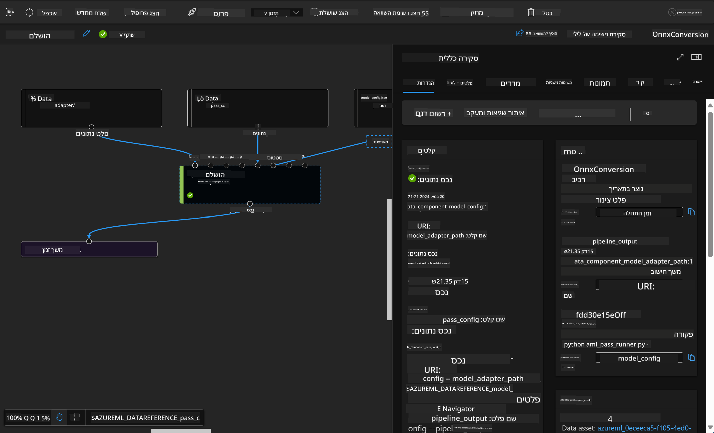

<!--
CO_OP_TRANSLATOR_METADATA:
{
  "original_hash": "7fe541373802e33568e94e13226d463c",
  "translation_date": "2025-05-09T22:21:46+00:00",
  "source_file": "md/03.FineTuning/Introduce_AzureML.md",
  "language_code": "he"
}
-->
# **הקדמה לשירות Azure Machine Learning**

[Azure Machine Learning](https://ml.azure.com?WT.mc_id=aiml-138114-kinfeylo) הוא שירות ענן שמאיץ ומנהל את מחזור חיי פרויקט למידת מכונה (ML).

אנשי מקצוע ב-ML, מדעני נתונים ומהנדסים יכולים להשתמש בו בשגרה היומית שלהם כדי:

- לאמן ולפרוס מודלים.  
- לנהל תפעול למידת מכונה (MLOps).  
- ניתן ליצור מודל ב-Azure Machine Learning או להשתמש במודל שנבנה בפלטפורמה בקוד פתוח, כמו PyTorch, TensorFlow או scikit-learn.  
- כלי MLOps עוזרים לך לנטר, לאמן מחדש ולפרוס מודלים מחדש.

## למי מיועד Azure Machine Learning?

**מדעני נתונים ומהנדסי ML**

הם יכולים להשתמש בכלים שמאיצים ומאוטומטים את שגרת העבודה היומית שלהם.  
Azure ML מספקת תכונות לשוויון, להסבר, למעקב ולאודיט.

**מפתחי אפליקציות:**  
יכולים לשלב מודלים באפליקציות או בשירותים בצורה חלקה.

**מפתחי פלטפורמה**

יש להם גישה למערך חזק של כלים הנתמכים על ידי APIs עמידים של Azure Resource Manager.  
כלים אלו מאפשרים בניית כלי ML מתקדמים.

**ארגונים**

עובדים בענן Microsoft Azure, נהנים מאבטחה מוכרת ושליטה מבוססת תפקידים.  
ניתן להגדיר פרויקטים לשליטה בגישה לנתונים מוגנים ולפעולות ספציפיות.

## פרודוקטיביות לכל חברי הצוות  
פרויקטים של ML דורשים לעיתים צוות עם מיומנויות מגוונות לבנייה ותחזוקה.

Azure ML מספקת כלים שמאפשרים לך:  
- לשתף פעולה עם הצוות דרך מחברות משותפות, משאבי מחשוב, מחשוב ללא שרת, נתונים וסביבות.  
- לפתח מודלים עם שוויון, הסבר, מעקב ואודיט לצורך עמידה בדרישות שייכות ואודיט.  
- לפרוס מודלי ML במהירות ובקלות בקנה מידה, ולנהל ולשלוט בהם ביעילות באמצעות MLOps.  
- להריץ עומסי עבודה של למידת מכונה בכל מקום עם ממשל, אבטחה וציות מובנים.

## כלים חוצי פלטפורמות

כל אחד בצוות ML יכול להשתמש בכלים המועדפים עליו כדי לבצע את העבודה.  
בין אם אתה מריץ ניסויים מהירים, מגדיר היפרפרמטרים, בונה צינורות או מנהל אינפרנסים, תוכל להשתמש בממשקים מוכרים כמו:  
- Azure Machine Learning Studio  
- Python SDK (v2)  
- Azure CLI (v2)  
- Azure Resource Manager REST APIs

כשאתה מחדד מודלים ומשתף פעולה לאורך מחזור הפיתוח, תוכל לשתף ולמצוא נכסים, משאבים ומדדים בתוך ממשק המשתמש של Azure Machine Learning studio.

## **LLM/SLM ב-Azure ML**

Azure ML הוסיפה פונקציות רבות הקשורות ל-LLM/SLM, שמשלבות בין LLMOps ו-SLMOps ליצירת פלטפורמת טכנולוגיה לאינטליגנציה מלאכותית גנרטיבית ארגונית.

### **קטלוג מודלים**

משתמשים ארגוניים יכולים לפרוס מודלים שונים בהתאם לתרחישי עסקים שונים דרך קטלוג המודלים, ולספק שירותים כ-Model as Service למפתחים או משתמשים ארגוניים לגישה.

קטלוג המודלים ב-Azure Machine Learning studio הוא המרכז לגילוי ושימוש במגוון רחב של מודלים שמאפשרים בניית אפליקציות AI גנרטיביות. קטלוג המודלים כולל מאות מודלים מספקים כמו Azure OpenAI service, Mistral, Meta, Cohere, Nvidia, Hugging Face, כולל מודלים שאומנו על ידי מיקרוסופט. מודלים מספקים שאינם מיקרוסופט מוגדרים כמוצרים שאינם של מיקרוסופט, בהתאם לתנאי מוצר של מיקרוסופט, וכפופים לתנאים שמסופקים עם המודל.

### **צינור עבודה**

העיקרון בצינור למידת מכונה הוא לפצל משימת למידת מכונה שלמה לזרימת עבודה רב-שלבית. כל שלב הוא רכיב ניהולי שניתן לפתח, לאופטימיזציה, לקונפיגורציה ולאוטומציה בנפרד. השלבים מחוברים דרך ממשקים מוגדרים היטב. שירות הצינור של Azure Machine Learning מארגן אוטומטית את כל התלויות בין שלבי הצינור.

בכיוונון עדין של SLM / LLM, ניתן לנהל את הנתונים, האימון ותהליכי ההפקה דרך Pipeline.

### **Prompt flow**

יתרונות השימוש ב-Azure Machine Learning prompt flow  
Azure Machine Learning prompt flow מציע מגוון יתרונות שעוזרים למשתמשים לעבור מרעיון לניסוי ולבסוף לאפליקציות מבוססות LLM מוכנות לפרודקשן:

**גמישות בהנדסת פרומפטים**

חוויית כתיבה אינטראקטיבית: Azure Machine Learning prompt flow מספק ייצוג חזותי של מבנה הזרימה, שמאפשר למשתמשים להבין ולנווט בקלות בפרויקטים שלהם. כמו כן, מציע חוויית קידוד דמויית מחברת לפיתוח ו-debug יעיל של הזרימה.  
וריאציות לכיוונון פרומפט: משתמשים יכולים ליצור ולהשוות וריאציות פרומפט מרובות, מה שמאפשר תהליך שיפור איטרטיבי.

הערכה: זרימות הערכה מובנות מאפשרות למשתמשים להעריך את האיכות והיעילות של הפרומפטים והזרימות שלהם.

משאבים מקיפים: Azure Machine Learning prompt flow כולל ספרייה של כלים מובנים, דוגמאות ותבניות המשמשות כנקודת התחלה לפיתוח, מעוררות יצירתיות ומאיצות את התהליך.

**מוכנות ארגונית לאפליקציות מבוססות LLM**

שיתוף פעולה: Azure Machine Learning prompt flow תומך בשיתוף פעולה צוותי, מאפשר למספר משתמשים לעבוד יחד על פרויקטי הנדסת פרומפטים, לשתף ידע ולשמור על בקרת גרסאות.

פלטפורמה כוללת: Azure Machine Learning prompt flow מייעל את כל תהליך הנדסת הפרומפטים, מהפיתוח וההערכה ועד הפריסה והניטור. משתמשים יכולים לפרוס בקלות את הזרימות שלהם כנקודות קצה של Azure Machine Learning ולנטר את הביצועים בזמן אמת, להבטיח פעולה מיטבית ושיפור מתמשך.

פתרונות מוכנות ארגונית של Azure Machine Learning: prompt flow מנצל את פתרונות המוכנות הארגונית החזקים של Azure Machine Learning, ומספק בסיס מאובטח, סקלאבילי ואמין לפיתוח, ניסוי ופריסת זרימות.

עם Azure Machine Learning prompt flow, משתמשים יכולים לשחרר את הגמישות בהנדסת הפרומפטים, לשתף פעולה ביעילות, ולהשתמש בפתרונות ברמת ארגון להצלחה בפיתוח ופריסת אפליקציות מבוססות LLM.

בשילוב כוח המחשוב, הנתונים והרכיבים השונים של Azure ML, מפתחים ארגוניים יכולים בקלות לבנות אפליקציות אינטיליגנציה מלאכותית משלהם.

**כתב ויתור**:  
מסמך זה תורגם באמצעות שירות תרגום מבוסס בינה מלאכותית [Co-op Translator](https://github.com/Azure/co-op-translator). למרות שאנו שואפים לדיוק, יש להיות מודעים לכך שתרגומים אוטומטיים עלולים להכיל שגיאות או אי-דיוקים. המסמך המקורי בשפת המקור שלו צריך להיחשב למקור הסמכותי. למידע קריטי, מומלץ להשתמש בתרגום מקצועי על ידי אדם. אנו לא נושאים באחריות לכל אי-הבנות או פרשנויות שגויות הנובעות משימוש בתרגום זה.