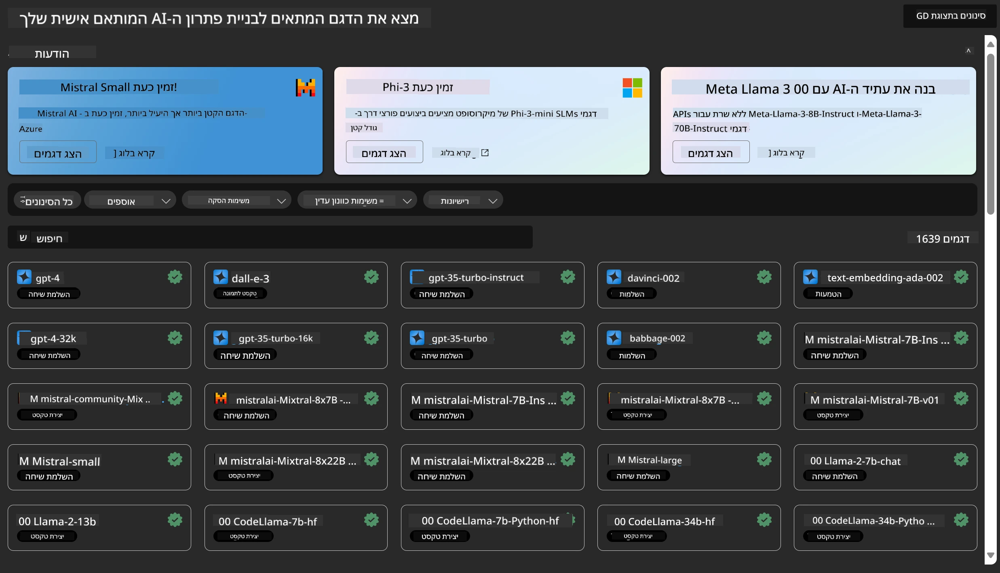

<!--
CO_OP_TRANSLATOR_METADATA:
{
  "original_hash": "7fe541373802e33568e94e13226d463c",
  "translation_date": "2025-07-17T09:44:45+00:00",
  "source_file": "md/03.FineTuning/Introduce_AzureML.md",
  "language_code": "he"
}
-->
# **הקדמה לשירות Azure Machine Learning**

[Azure Machine Learning](https://ml.azure.com?WT.mc_id=aiml-138114-kinfeylo) הוא שירות ענן שמאיץ ומנהל את מחזור החיים של פרויקטים בתחום למידת המכונה (ML).

אנשי מקצוע ב-ML, מדעני נתונים ומהנדסים יכולים להשתמש בו בשגרה היומית שלהם כדי:

- לאמן ולפרוס מודלים.  
- לנהל את תפעול למידת המכונה (MLOps).  
- ניתן ליצור מודל ב-Azure Machine Learning או להשתמש במודל שנבנה בפלטפורמה קוד פתוח, כמו PyTorch, TensorFlow או scikit-learn.  
- כלי MLOps עוזרים לך לנטר, לאמן מחדש ולפרוס מודלים מחדש.

## למי מיועד Azure Machine Learning?

**מדעני נתונים ומהנדסי ML**

הם יכולים להשתמש בכלים שמאיצים ומאוטומטים את זרימות העבודה היומיות שלהם.  
Azure ML מספקת תכונות לשוויון, להסבר, למעקב ולביקורת.  

**מפתחי אפליקציות:**  
הם יכולים לשלב מודלים באפליקציות או בשירותים בצורה חלקה.

**מפתחי פלטפורמות**

יש להם גישה למערך כלים חזק הנתמך על ידי APIs עמידים של Azure Resource Manager.  
כלים אלה מאפשרים בניית כלי ML מתקדמים.

**ארגונים**

עובדים בענן Microsoft Azure, ארגונים נהנים מאבטחה מוכרת ושליטה בגישה מבוססת תפקידים.  
ניתן להגדיר פרויקטים לשליטה בגישה לנתונים מוגנים ולפעולות ספציפיות.

## פרודוקטיביות לכל חברי הצוות  
פרויקטים של ML דורשים לעיתים צוות עם מגוון מיומנויות לבנייה ותחזוקה.

Azure ML מספקת כלים שמאפשרים לך:  
- לשתף פעולה עם הצוות דרך מחברות משותפות, משאבי חישוב, חישוב ללא שרת, נתונים וסביבות.  
- לפתח מודלים עם שוויון, הסבר, מעקב וביקורת כדי לעמוד בדרישות של שושלת וביקורת.  
- לפרוס מודלי ML במהירות ובקלות בקנה מידה, ולנהל ולפקח עליהם ביעילות עם MLOps.  
- להריץ עומסי עבודה של למידת מכונה בכל מקום עם ממשל, אבטחה וציות מובנים.

## כלים חוצי פלטפורמות

כל חבר בצוות ML יכול להשתמש בכלים המועדפים עליו כדי לבצע את העבודה.  
בין אם אתה מריץ ניסויים מהירים, מכוון היפרפרמטרים, בונה צינורות עבודה או מנהל הסקות, תוכל להשתמש בממשקים מוכרים כמו:  
- Azure Machine Learning Studio  
- Python SDK (v2)  
- Azure CLI (v2)  
- Azure Resource Manager REST APIs

כשאתה משפר מודלים ומשתף פעולה לאורך מחזור הפיתוח, תוכל לשתף ולמצוא נכסים, משאבים ומדדים בתוך ממשק המשתמש של Azure Machine Learning studio.

## **LLM/SLM ב-Azure ML**

Azure ML הוסיפה פונקציות רבות הקשורות ל-LLM/SLM, שמשלבות בין LLMOps ו-SLMOps ליצירת פלטפורמת טכנולוגיית בינה מלאכותית גנרטיבית ארגונית.

### **קטלוג מודלים**

משתמשים ארגוניים יכולים לפרוס מודלים שונים בהתאם לתרחישי עסק שונים דרך קטלוג המודלים, ולספק שירותים כ-Model as Service למפתחים או משתמשים ארגוניים.

קטלוג המודלים ב-Azure Machine Learning studio הוא המרכז לגילוי ושימוש במגוון רחב של מודלים שמאפשרים לבנות יישומי בינה מלאכותית גנרטיבית. קטלוג המודלים כולל מאות מודלים מספקי מודלים כמו Azure OpenAI service, Mistral, Meta, Cohere, Nvidia, Hugging Face, כולל מודלים שאומנו על ידי Microsoft. מודלים מספקים שאינם Microsoft מוגדרים כמוצרים שאינם של Microsoft, בהתאם לתנאי המוצר של Microsoft, וכפופים לתנאים הנלווים למודל.

### **צינור עבודה (Job Pipeline)**

הבסיס של צינור עבודה בלמידת מכונה הוא לפצל משימה שלמה למספר שלבים. כל שלב הוא רכיב שניתן לפתח, לאופטימיזציה, להגדיר ולאוטומציה בנפרד. השלבים מחוברים דרך ממשקים מוגדרים היטב. שירות הצינורות של Azure Machine Learning מארגן אוטומטית את כל התלויות בין שלבי הצינור.

בכיוונון עדין של SLM / LLM, ניתן לנהל את הנתונים, האימון ותהליכי ההפקה דרך Pipeline.

### **Prompt flow**

יתרונות השימוש ב-Azure Machine Learning prompt flow  
Azure Machine Learning prompt flow מציע מגוון יתרונות שעוזרים למשתמשים לעבור מרעיון לניסוי ולבסוף ליישומים מבוססי LLM מוכנים לפרודקשן:

**גמישות בהנדסת פרומפטים**

חוויית כתיבה אינטראקטיבית: Azure Machine Learning prompt flow מספק ייצוג חזותי של מבנה ה-flow, שמאפשר למשתמשים להבין ולנווט בקלות בפרויקטים שלהם. הוא גם מציע חוויית קידוד דמוית מחברת לפיתוח ו-debug יעיל של ה-flow.  
גרסאות לכיוונון פרומפט: משתמשים יכולים ליצור ולהשוות בין מספר גרסאות פרומפט, מה שמקל על תהליך שיפור איטרטיבי.

הערכה: זרמי הערכה מובנים מאפשרים למשתמשים להעריך את איכות ויעילות הפרומפטים והזרמים שלהם.

משאבים מקיפים: Azure Machine Learning prompt flow כולל ספרייה של כלים מובנים, דוגמאות ותבניות המשמשות כנקודת התחלה לפיתוח, מעוררות יצירתיות ומאיצות את התהליך.

**מוכנות ארגונית ליישומים מבוססי LLM**

שיתוף פעולה: Azure Machine Learning prompt flow תומך בשיתוף פעולה צוותי, ומאפשר למספר משתמשים לעבוד יחד על פרויקטים של הנדסת פרומפטים, לשתף ידע ולשמור על בקרת גרסאות.

פלטפורמה כוללת: Azure Machine Learning prompt flow מפשט את כל תהליך הנדסת הפרומפטים, מהפיתוח וההערכה ועד לפריסה ומעקב. משתמשים יכולים לפרוס את הזרמים שלהם כ-endpoints של Azure Machine Learning ולנטר את הביצועים בזמן אמת, להבטיח פעולה מיטבית ושיפור מתמיד.

פתרונות מוכנות ארגונית של Azure Machine Learning: Prompt flow מנצל את פתרונות המוכנות הארגונית החזקים של Azure Machine Learning, ומספק בסיס מאובטח, מדרגי ואמין לפיתוח, ניסוי ופריסת זרמים.

עם Azure Machine Learning prompt flow, משתמשים יכולים לשחרר את הגמישות בהנדסת הפרומפטים, לשתף פעולה ביעילות ולהשתמש בפתרונות ברמת ארגון לפיתוח ופריסה מוצלחים של יישומים מבוססי LLM.

בשילוב כוח המחשוב, הנתונים והרכיבים השונים של Azure ML, מפתחים ארגוניים יכולים בקלות לבנות את יישומי הבינה המלאכותית שלהם.

**כתב ויתור**:  
מסמך זה תורגם באמצעות שירות תרגום מבוסס בינה מלאכותית [Co-op Translator](https://github.com/Azure/co-op-translator). למרות שאנו שואפים לדיוק, יש לקחת בחשבון כי תרגומים אוטומטיים עלולים להכיל שגיאות או אי-דיוקים. המסמך המקורי בשפת המקור שלו צריך להיחשב כמקור הסמכות. למידע קריטי מומלץ להשתמש בתרגום מקצועי על ידי מתרגם אנושי. אנו לא נושאים באחריות לכל אי-הבנה או פרשנות שגויה הנובעת משימוש בתרגום זה.