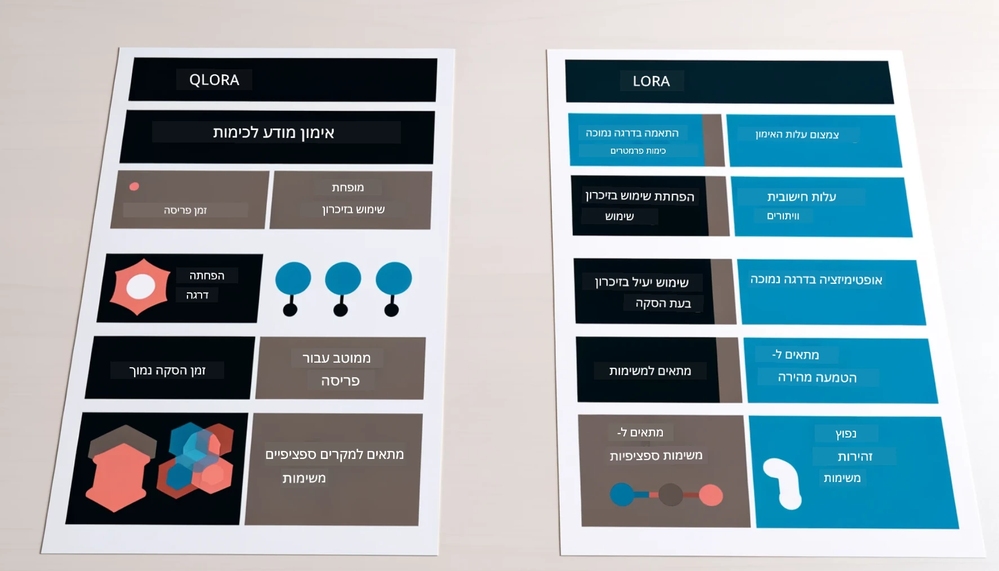

# **לתת ל-Phi-3 להפוך למומחה תעשייתי**

כדי לשלב את מודל Phi-3 בתעשייה, יש להוסיף למודל נתוני עסק מהתעשייה. יש לנו שתי אפשרויות שונות, הראשונה היא RAG (Retrieval Augmented Generation) והשנייה היא Fine Tuning.

## **RAG מול Fine-Tuning**

### **Retrieval Augmented Generation**

RAG הוא שילוב של אחזור נתונים + יצירת טקסט. הנתונים המובנים והלא מובנים של הארגון נשמרים במסד נתונים וקטורי. בעת חיפוש תוכן רלוונטי, נמצא סיכום ותוכן רלוונטיים ליצירת הקשר, ויכולת השלמת הטקסט של LLM/SLM משולבת ליצירת התוכן.

### **Fine-tuning**

Fine-tuning מבוסס על שיפור של מודל מסוים. אין צורך להתחיל מהאלגוריתם של המודל, אך יש צורך בהצטברות מתמדת של נתונים. אם רוצים מונחים מדויקים יותר וביטוי שפה מדויק יותר ביישומים תעשייתיים, Fine-tuning היא הבחירה הטובה יותר. אך אם הנתונים משתנים לעיתים קרובות, Fine-tuning עלול להיות מסובך.

### **איך לבחור**

1. אם התשובה שלנו דורשת הכנסת נתונים חיצוניים, RAG היא הבחירה הטובה ביותר

2. אם צריך פלט יציב ומדויק של ידע תעשייתי, Fine-tuning תהיה בחירה טובה. RAG מתמקד בשליפת תוכן רלוונטי אך לא תמיד מדייק בניואנסים המיוחדים.

3. Fine-tuning דורש מערך נתונים איכותי, ואם מדובר בטווח קטן של נתונים, זה לא ישפיע משמעותית. RAG גמיש יותר

4. Fine-tuning הוא תהליך שחור, מטאפיזי, וקשה להבין את המנגנון הפנימי. לעומת זאת, RAG מאפשר למצוא בקלות את מקור הנתונים, וכך להתאים ביעילות הזיות או טעויות בתוכן ולספק שקיפות טובה יותר.

### **תסריטים**

1. תעשיות אנכיות שדורשות אוצר מילים מקצועי ומונחים ספציפיים, ***Fine-tuning*** תהיה הבחירה הטובה ביותר

2. מערכת QA, הכוללת סינתזה של נקודות ידע שונות, ***RAG*** תהיה הבחירה הטובה ביותר

3. שילוב של זרימת עבודה אוטומטית ***RAG + Fine-tuning*** היא הבחירה הטובה ביותר

## **איך להשתמש ב-RAG**

מסד נתונים וקטורי הוא אוסף נתונים השמורים בצורה מתמטית. מסדי נתונים וקטוריים מקלים על מודלים של למידת מכונה לזכור קלטים קודמים, ומאפשרים להשתמש בלמידת מכונה לתמיכה במקרים כמו חיפוש, המלצות ויצירת טקסט. ניתן לזהות נתונים על בסיס מדדי דמיון ולא רק התאמות מדויקות, מה שמאפשר למודלים להבין את ההקשר של הנתונים.

מסד הנתונים הווקטורי הוא המפתח למימוש RAG. ניתן להמיר נתונים לאחסון וקטורי באמצעות מודלים וקטוריים כמו text-embedding-3, jina-ai-embedding ועוד.

למידע נוסף על יצירת יישום RAG [https://github.com/microsoft/Phi-3CookBook](https://github.com/microsoft/Phi-3CookBook?WT.mc_id=aiml-138114-kinfeylo)

## **איך להשתמש ב-Fine-tuning**

האלגוריתמים הנפוצים ב-Fine-tuning הם Lora ו-QLora. איך לבחור?
- [למידע נוסף עם המחברת לדוגמה הזו](../../../../code/04.Finetuning/Phi_3_Inference_Finetuning.ipynb)
- [דוגמה לסקריפט FineTuning בפייתון](../../../../code/04.Finetuning/FineTrainingScript.py)

### **Lora ו-QLora**

LoRA (Low-Rank Adaptation) ו-QLoRA (Quantized Low-Rank Adaptation) הן טכניקות המשמשות לכוונון עדין של מודלים גדולים של שפה (LLMs) באמצעות Parameter Efficient Fine Tuning (PEFT). טכניקות PEFT נועדו לאמן מודלים בצורה יעילה יותר מאשר שיטות מסורתיות.  
LoRA היא טכניקת כוונון עדין עצמאית שמפחיתה את צריכת הזיכרון על ידי יישום קירוב דרגה נמוכה למטריצת עדכון המשקלות. היא מציעה זמני אימון מהירים ושומרת על ביצועים קרובים לשיטות כוונון עדין מסורתיות.

QLoRA היא גרסה מורחבת של LoRA שמשלבת טכניקות כימות להקטנת צריכת הזיכרון עוד יותר. QLoRA מכמתת את דיוק פרמטרי המשקל במודל ה-LLM המאומן מראש לדיוק של 4 ביט, מה שיותר יעיל בזיכרון מאשר LoRA. עם זאת, אימון QLoRA איטי בכ-30% מאימון LoRA בגלל שלבי הכימות והפירוק הנוספים.

QLoRA משתמשת ב-LoRA ככלי עזר לתיקון שגיאות שנוצרות במהלך הכימות. QLoRA מאפשרת כוונון עדין של מודלים עצומים עם מיליארדי פרמטרים על GPUs קטנים יחסית וזמינים. לדוגמה, QLoRA יכולה לכוונן מודל עם 70 מיליארד פרמטרים שדורש 36 GPUs עם רק 2 GPUs...

**כתב ויתור**:  
מסמך זה תורגם באמצעות שירות תרגום מבוסס בינה מלאכותית [Co-op Translator](https://github.com/Azure/co-op-translator). למרות שאנו שואפים לדיוק, יש לקחת בחשבון כי תרגומים אוטומטיים עלולים להכיל שגיאות או אי-דיוקים. המסמך המקורי בשפת המקור שלו צריך להיחשב כמקור הסמכות. למידע קריטי מומלץ להשתמש בתרגום מקצועי על ידי מתרגם אנושי. אנו לא נושאים באחריות לכל אי-הבנה או פרשנות שגויה הנובעת משימוש בתרגום זה.