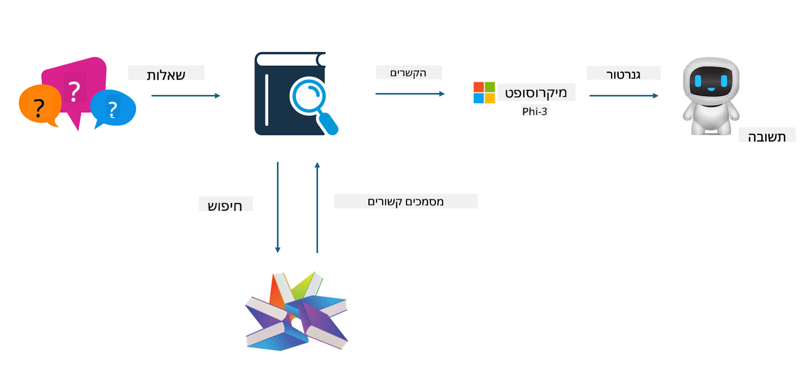

<!--
CO_OP_TRANSLATOR_METADATA:
{
  "original_hash": "743d7e9cb9c4e8ea642d77bee657a7fa",
  "translation_date": "2025-05-09T22:28:08+00:00",
  "source_file": "md/03.FineTuning/LetPhi3gotoIndustriy.md",
  "language_code": "he"
}
-->
# **תן ל-Phi-3 להפוך למומחה תעשייתי**

כדי להכניס את מודל Phi-3 לתחום התעשייה, יש להוסיף נתוני עסקים תעשייתיים למודל Phi-3. יש לנו שתי אפשרויות שונות, הראשונה היא RAG (Retrieval Augmented Generation) והשנייה היא Fine Tuning.

## **RAG מול Fine-Tuning**

### **Retrieval Augmented Generation**

RAG היא שליפה של נתונים + יצירת טקסט. הנתונים המובנים והלא מובנים של הארגון נשמרים במסד נתונים וקטורי. בעת חיפוש תוכן רלוונטי, נמצא סיכום ותוכן רלוונטיים ליצירת הקשר, ויכולת השלמת הטקסט של LLM/SLM משולבת ליצירת התוכן.

### **Fine-tuning**

Fine-tuning מבוסס על שיפור של מודל מסוים. אין צורך להתחיל עם אלגוריתם המודל, אך יש לצבור נתונים באופן מתמשך. אם רוצים מונחים מדויקים יותר וביטויי שפה מדויקים יותר ביישומים תעשייתיים, Fine-tuning היא הבחירה הטובה יותר. אך אם הנתונים משתנים תדיר, Fine-tuning עלולה להיות מסובכת.

### **איך לבחור**

1. אם התשובה שלנו דורשת הכנסת נתונים חיצוניים, RAG היא הבחירה הטובה ביותר

2. אם יש צורך ביצירת ידע תעשייתי יציב ומדויק, Fine-tuning תהיה בחירה טובה. RAG מתמקד בשליפת תוכן רלוונטי אך לא תמיד מצליח ללכוד את הדקויות המיוחדות.

3. Fine-tuning דורש מערך נתונים איכותי, ואם מדובר בטווח קטן של נתונים, לא תהיה לכך השפעה משמעותית. RAG גמיש יותר

4. Fine-tuning היא תיבה שחורה, מטפיזיקה, וקשה להבין את המנגנון הפנימי שלה. אך RAG מאפשר למצוא בקלות את מקור הנתונים, וכך ניתן לתקן הזיות או שגיאות תוכן ולספק שקיפות טובה יותר.

### **תסריטים**

1. תעשיות אנכיות שדורשות אוצר מילים מקצועי וביטויים ספציפיים, ***Fine-tuning*** תהיה הבחירה הטובה ביותר

2. מערכת שאלות ותשובות, הכוללת סינתזה של נקודות ידע שונות, ***RAG*** תהיה הבחירה הטובה ביותר

3. שילוב של זרימת עבודה עסקית אוטומטית ***RAG + Fine-tuning*** היא הבחירה הטובה ביותר

## **איך להשתמש ב-RAG**

מסד נתונים וקטורי הוא אוסף נתונים השמורים בצורה מתמטית. מסדי נתונים וקטוריים מקלים על מודלי למידת מכונה לזכור קלטים קודמים, מה שמאפשר להשתמש בלמידת מכונה לתמיכה במקרים כמו חיפוש, המלצות ויצירת טקסט. ניתן לזהות נתונים על בסיס מדדי דמיון ולא רק התאמות מדויקות, מה שמאפשר למודלים להבין את ההקשר של הנתונים.

מסד הנתונים הווקטורי הוא המפתח למימוש RAG. ניתן להמיר נתונים לאחסון וקטורי דרך מודלים וקטוריים כמו text-embedding-3, jina-ai-embedding, ועוד.

למידע נוסף על יצירת יישום RAG [https://github.com/microsoft/Phi-3CookBook](https://github.com/microsoft/Phi-3CookBook?WT.mc_id=aiml-138114-kinfeylo)

## **איך להשתמש ב-Fine-tuning**

האלגוריתמים הנפוצים ב-Fine-tuning הם Lora ו-QLora. איך לבחור?
- [למידע נוסף עם דוגמת מחברת זו](../../../../code/04.Finetuning/Phi_3_Inference_Finetuning.ipynb)
- [דוגמת Python ל-FineTuning](../../../../code/04.Finetuning/FineTrainingScript.py)

### **Lora ו-QLora**

LoRA (Low-Rank Adaptation) ו-QLoRA (Quantized Low-Rank Adaptation) הן טכניקות המשמשות ל-Fine-tuning של מודלים גדולים של שפה (LLMs) באמצעות Parameter Efficient Fine Tuning (PEFT). טכניקות PEFT נועדו לאמן מודלים בצורה יעילה יותר משיטות מסורתיות.  
LoRA היא טכניקת Fine-tuning עצמאית שמפחיתה את צריכת הזיכרון על ידי יישום קירוב דרגה נמוכה למטריצת עדכון המשקלות. היא מציעה זמני אימון מהירים ושומרת על ביצועים קרובים לשיטות Fine-tuning מסורתיות.

QLoRA היא גרסה מורחבת של LoRA שמשלבת טכניקות כימות להפחתת צריכת הזיכרון עוד יותר. QLoRA מכמתת את דיוק פרמטרי המשקל במודל LLM מאומן מראש לדיוק של 4 סיביות, שהוא יעיל יותר בזיכרון מאשר LoRA. עם זאת, אימון QLoRA איטי בכ-30% מאימון LoRA עקב שלבי כימות ופירוק הכימות נוספים.

QLoRA משתמשת ב-LoRA כתוספת לתיקון השגיאות שנוצרות במהלך הכימות. QLoRA מאפשרת Fine-tuning של מודלים עצומים עם מיליארדי פרמטרים על GPUs קטנים וזמינים יחסית. לדוגמה, QLoRA יכולה לבצע Fine-tuning למודל עם 70 מיליארד פרמטרים שדורש 36 GPUs רק עם 2

**כתב ויתור**:  
מסמך זה תורגם באמצעות שירות תרגום מבוסס בינה מלאכותית [Co-op Translator](https://github.com/Azure/co-op-translator). למרות שאנו שואפים לדיוק, יש לקחת בחשבון כי תרגומים אוטומטיים עלולים להכיל שגיאות או אי-דיוקים. המסמך המקורי בשפת המקור שלו הוא המקור הסמכותי. למידע קריטי מומלץ להשתמש בתרגום מקצועי של אדם. אנו לא נושאים באחריות לכל אי הבנה או פרשנות שגויה הנובעת משימוש בתרגום זה.