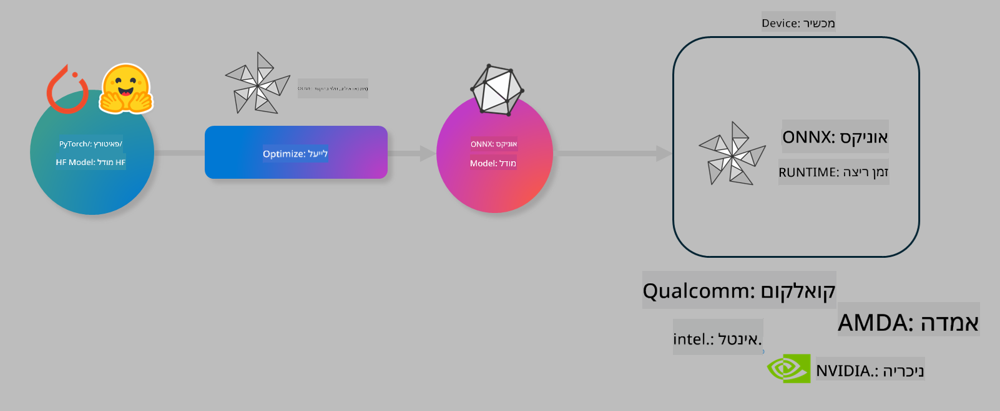

<!--
CO_OP_TRANSLATOR_METADATA:
{
  "original_hash": "6bbe47de3b974df7eea29dfeccf6032b",
  "translation_date": "2025-05-09T22:38:44+00:00",
  "source_file": "md/03.FineTuning/olive-lab/readme.md",
  "language_code": "he"
}
-->
# מעבדה. אופטימיזציה של מודלים של AI לאינפרנס במכשיר

## מבוא

> [!IMPORTANT]
> מעבדה זו דורשת **כרטיס מסך Nvidia A10 או A100** עם דרייברים וכלי CUDA (גרסה 12 ומעלה) מותקנים.

> [!NOTE]
> זו מעבדה של **35 דקות** שתעניק לכם היכרות מעשית עם המושגים המרכזיים באופטימיזציה של מודלים לאינפרנס במכשיר באמצעות OLIVE.

## מטרות הלמידה

בסיום המעבדה תוכלו להשתמש ב-OLIVE כדי:

- לכמת מודל AI באמצעות שיטת הכימות AWQ.
- לכוונן מודל AI למשימה ספציפית.
- ליצור מתאמי LoRA (מודל מכוונן) לאינפרנס יעיל במכשיר על ONNX Runtime.

### מה זה Olive

Olive (*O*NNX *live*) הוא כלי לאופטימיזציה של מודלים עם CLI נלווה המאפשר לכם לספק מודלים עבור ONNX runtime +++https://onnxruntime.ai+++ עם איכות וביצועים גבוהים.



הקלט ל-Olive הוא בדרך כלל מודל PyTorch או Hugging Face והפלט הוא מודל ONNX מותאם שמורץ במכשיר (יעד פריסה) שמריץ את ONNX runtime. Olive מבצע אופטימיזציה למודל עבור המאיץ AI של יעד הפריסה (NPU, GPU, CPU) המסופק על ידי ספק חומרה כגון Qualcomm, AMD, Nvidia או Intel.

Olive מבצע *workflow*, שהוא רצף מסודר של משימות אופטימיזציה למודל הנקראות *passes* - דוגמאות ל-passes הן: דחיסת מודל, לכידת גרף, כימות, אופטימיזציה של גרף. לכל pass יש סט פרמטרים שניתן לכוונן כדי להשיג את המדדים הטובים ביותר, למשל דיוק ו-latency, הנמדדים על ידי מעריך מתאים. Olive משתמש באסטרטגיית חיפוש עם אלגוריתם שמכוונן כל pass בנפרד או קבוצת passes יחד.

#### יתרונות Olive

- **הפחתת תסכול וזמן** של ניסויים ידניים בטרייל-אנד-ארור עם טכניקות שונות לאופטימיזציית גרף, דחיסה וכימות. הגדירו את מגבלות האיכות והביצועים ותנו ל-Olive למצוא את המודל הטוב ביותר עבורכם באופן אוטומטי.
- **מעל 40 רכיבי אופטימיזציה מובנים** המכסים טכניקות מתקדמות בכימות, דחיסה, אופטימיזציית גרף וכיוונון.
- **CLI קל לשימוש** למשימות אופטימיזציה נפוצות. לדוגמה: olive quantize, olive auto-opt, olive finetune.
- אריזת מודלים ופריסה מובנים.
- תומך ביצירת מודלים עבור **Multi LoRA serving**.
- בניית workflows באמצעות YAML/JSON לתיאום משימות אופטימיזציה ופריסה.
- אינטגרציה עם **Hugging Face** ו-**Azure AI**.
- מנגנון **קאשינג** מובנה ל**חיסכון בעלויות**.

## הוראות המעבדה
> [!NOTE]
> וודאו שהקמתם את Azure AI Hub והפרויקט שלכם והגדרתם את מחשוב ה-A100 בהתאם למעבדה 1.

### שלב 0: התחברו למחשוב Azure AI שלכם

תחברו למחשוב Azure AI באמצעות תכונת ה-remote ב-**VS Code.**

1. פתחו את אפליקציית **VS Code** במחשב שלכם:
1. פתחו את **command palette** באמצעות **Shift+Ctrl+P**
1. בחיפוש ב-command palette חפשו **AzureML - remote: Connect to compute instance in New Window**.
1. עקבו אחר ההוראות על המסך להתחברות למחשוב. זה יכלול בחירת מנוי Azure, Resource Group, פרויקט ושם המחשוב שהגדרתם במעבדה 1.
1. לאחר ההתחברות למחשב Azure ML שלכם, זה יוצג ב**פינה השמאלית התחתונה של Visual Code** `><Azure ML: Compute Name`

### שלב 1: שכפלו את המאגר הזה

ב-VS Code, פתחו טרמינל חדש עם **Ctrl+J** ושכפלו את המאגר:

בטרמינל תראו את ההנחיה

```
azureuser@computername:~/cloudfiles/code$ 
```
שכפול הפתרון

```bash
cd ~/localfiles
git clone https://github.com/microsoft/phi-3cookbook.git
```

### שלב 2: פתחו את התיקייה ב-VS Code

כדי לפתוח את VS Code בתיקייה הרלוונטית הריצו את הפקודה הבאה בטרמינל, שתפתח חלון חדש:

```bash
code phi-3cookbook/code/04.Finetuning/Olive-lab
```

או לחלופין, פתחו את התיקייה על ידי בחירה ב**File** > **Open Folder**.

### שלב 3: תלותים

פתחו חלון טרמינל ב-VS Code במחשב Azure AI שלכם (טיפ: **Ctrl+J**) והריצו את הפקודות הבאות להתקנת התלותים:

```bash
conda create -n olive-ai python=3.11 -y
conda activate olive-ai
pip install -r requirements.txt
az extension remove -n azure-cli-ml
az extension add -n ml
```

> [!NOTE]
> ההתקנה תיקח כ-5 דקות.

במעבדה זו תורידו ותעלו מודלים לקטלוג המודלים של Azure AI. כדי לגשת לקטלוג, יש להתחבר ל-Azure באמצעות:

```bash
az login
```

> [!NOTE]
> בעת ההתחברות תתבקשו לבחור את המנוי שלכם. ודאו שהמנוי שנבחר הוא זה שסופק למעבדה זו.

### שלב 4: הריצו פקודות Olive

פתחו חלון טרמינל ב-VS Code במחשב Azure AI שלכם (טיפ: **Ctrl+J**) וודאו שסביבת conda `olive-ai` מופעלת:

```bash
conda activate olive-ai
```

לאחר מכן, הריצו את פקודות Olive הבאות בשורת הפקודה.

1. **בדקו את הנתונים:** בדוגמה זו תכווננו את מודל Phi-3.5-Mini כך שיתמחה במענה על שאלות בנושא טיולים. הקוד למטה מציג את הרשומות הראשונות של מערך הנתונים, בפורמט JSON lines:
   
    ```bash
    head data/data_sample_travel.jsonl
    ```
1. **כמתו את המודל:** לפני אימון המודל, ראשית כמתו אותו באמצעות הפקודה הבאה שמשתמשת בטכניקה בשם Active Aware Quantization (AWQ) +++https://arxiv.org/abs/2306.00978+++. AWQ מכמת את המשקלים של המודל תוך התחשבות באקטיבציות המופקות בזמן האינפרנס. משמעות הדבר היא שתהליך הכימות לוקח בחשבון את התפלגות הנתונים בפועל באקטיבציות, מה שמוביל לשימור טוב יותר של הדיוק לעומת שיטות כימות משקלות מסורתיות.
    
    ```bash
    olive quantize \
       --model_name_or_path microsoft/Phi-3.5-mini-instruct \
       --trust_remote_code \
       --algorithm awq \
       --output_path models/phi/awq \
       --log_level 1
    ```
    
    תהליך הכימות לוקח **כ-8 דקות**, ויקטין את גודל המודל מ~7.5GB לכ~2.5GB.
   
   במעבדה זו אנו מראים כיצד להזין מודלים מ-Hugging Face (למשל: `microsoft/Phi-3.5-mini-instruct`). However, Olive also allows you to input models from the Azure AI catalog by updating the `model_name_or_path` argument to an Azure AI asset ID (for example:  `azureml://registries/azureml/models/Phi-3.5-mini-instruct/versions/4`). 

1. **Train the model:** Next, the `olive finetune` פקודה זו מכווננת את המודל הכמות. כימות לפני כיוונון משפר את הדיוק כי תהליך הכיוונון מפצה על אובדן הכימות.
    
    ```bash
    olive finetune \
        --method lora \
        --model_name_or_path models/phi/awq \
        --data_files "data/data_sample_travel.jsonl" \
        --data_name "json" \
        --text_template "<|user|>\n{prompt}<|end|>\n<|assistant|>\n{response}<|end|>" \
        --max_steps 100 \
        --output_path ./models/phi/ft \
        --log_level 1
    ```
    
    כיוונון לוקח **כ-6 דקות** (עם 100 צעדים).

1. **אופטימיזציה:** לאחר שהמודל אומן, כעת תוכלו לאופטימיזציה באמצעות הפקודה של Olive `auto-opt` command, which will capture the ONNX graph and automatically perform a number of optimizations to improve the model performance for CPU by compressing the model and doing fusions. It should be noted, that you can also optimize for other devices such as NPU or GPU by just updating the `--device` and `--provider` - אך לצורך המעבדה נשתמש ב-CPU.

    ```bash
    olive auto-opt \
       --model_name_or_path models/phi/ft/model \
       --adapter_path models/phi/ft/adapter \
       --device cpu \
       --provider CPUExecutionProvider \
       --use_ort_genai \
       --output_path models/phi/onnx-ao \
       --log_level 1
    ```
    
    האופטימיזציה תיקח **כ-5 דקות**.

### שלב 5: בדיקה מהירה של אינפרנס למודל

כדי לבדוק אינפרנס למודל, צרו קובץ Python בתיקייה בשם **app.py** והדביקו את הקוד הבא:

```python
import onnxruntime_genai as og
import numpy as np

print("loading model and adapters...", end="", flush=True)
model = og.Model("models/phi/onnx-ao/model")
adapters = og.Adapters(model)
adapters.load("models/phi/onnx-ao/model/adapter_weights.onnx_adapter", "travel")
print("DONE!")

tokenizer = og.Tokenizer(model)
tokenizer_stream = tokenizer.create_stream()

params = og.GeneratorParams(model)
params.set_search_options(max_length=100, past_present_share_buffer=False)
user_input = "what is the best thing to see in chicago"
params.input_ids = tokenizer.encode(f"<|user|>\n{user_input}<|end|>\n<|assistant|>\n")

generator = og.Generator(model, params)

generator.set_active_adapter(adapters, "travel")

print(f"{user_input}")

while not generator.is_done():
    generator.compute_logits()
    generator.generate_next_token()

    new_token = generator.get_next_tokens()[0]
    print(tokenizer_stream.decode(new_token), end='', flush=True)

print("\n")
```

הריצו את הקוד באמצעות:

```bash
python app.py
```

### שלב 6: העלאת המודל ל-Azure AI

העלאת המודל למאגר מודלים של Azure AI מאפשרת שיתוף המודל עם חברי צוות הפיתוח ומטפלת גם בבקרת גרסאות. להעלאת המודל הריצו את הפקודה הבאה:

> [!NOTE]
> עדכנו את `{}` placeholders with the name of your resource group and Azure AI Project Name. 

To find your resource group `"resourceGroup"` ושם פרויקט Azure AI, והריצו את הפקודה

```
az ml workspace show
```

או על ידי כניסה ל-+++ai.azure.com+++ ובחירה ב**management center** > **project** > **overview**

עדכנו את המילויים `{}` בשם קבוצת המשאבים ופרויקט Azure AI שלכם.

```bash
az ml model create \
    --name ft-for-travel \
    --version 1 \
    --path ./models/phi/onnx-ao \
    --resource-group {RESOURCE_GROUP_NAME} \
    --workspace-name {PROJECT_NAME}
```
אתם יכולים לראות את המודל שהועלה ולפרוס אותו בכתובת https://ml.azure.com/model/list

**כתב ויתור**:  
מסמך זה תורגם באמצעות שירות תרגום מבוסס בינה מלאכותית [Co-op Translator](https://github.com/Azure/co-op-translator). למרות שאנו שואפים לדיוק, יש לקחת בחשבון כי תרגומים אוטומטיים עלולים להכיל שגיאות או אי-דיוקים. המסמך המקורי בשפת המקור שלו הוא המקור המוסמך והמהימן. למידע קריטי מומלץ להשתמש בתרגום מקצועי על ידי אדם. איננו אחראים לכל אי הבנה או פרשנות שגויה הנובעת משימוש בתרגום זה.